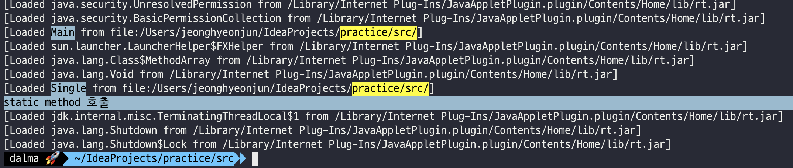

- 출처
  - [Loading, Linking, and Initializing](https://docs.oracle.com/javase/specs/jvms/se8/html/jvms-5.html)
  - [클래스는 언제 로딩되고 초기화되는가?](https://velog.io/@skyepodium/%ED%81%B4%EB%9E%98%EC%8A%A4%EB%8A%94-%EC%96%B8%EC%A0%9C-%EB%A1%9C%EB%94%A9%EB%90%98%EA%B3%A0-%EC%B4%88%EA%B8%B0%ED%99%94%EB%90%98%EB%8A%94%EA%B0%80)
  - [JVM 밑바닥까지 파헤치기](https://www.yes24.com/Product/Goods/126114513)

# **클래스 로딩**

- 클래스의 완전한 이름을 보고 해당 클래스를 정의하는 바이너리 바이트 스트림을 **JVM** 메모리에 올리는 작업을 의미한다.
- **JVM**은 실행될 때 모든 클래스를 메모리에 올리지 않고 **필요할 때 마다 클래스를 메모리에 올린다.**
- 클래스 로딩의 메커니즘은 *로딩 → (검증 → 준비 → 해석) → 초기화 → 사용 → 언로딩* 과정이 존재하며 이번 게시글에서는 **로딩 단계**를 확인한다. (위에 작성한 과정의 순서는 시작 지점 기준이다.)
- `java -verbose:class {파일 이름.java}` 명령어를 통해 클래스 로딩에 대한 상세 정보를 확인할 수 있다.

# **그럼 언제 클래스를 로딩할까?**

<h3>첫 번째. initial class만 실행</h3>

```java
class Main {
    public static void main(String[] args){ }
}

class Single{
    public Single() { }
}
```


- `Main`클래스만 로딩 되었고 `Single`클래스는 로딩되지 않음

<h3>두 번째. 다른 클래스의 인스턴스 생성</h3>

```java
class Main {
    public static void main(String[] args){
        Single single = new Single();
    }
}

class Single{
    public Single() { }
}
```


- `Main`이 실행되고 `Single`클래스가 실행됨

<h3>세 번째. final 키워드가 없는 정적 변수만 호출</h3>

```java
class Main {
    public static void main(String[] args){
        System.out.println(Single.a);
    }
}

class Single{
    public static int a;
}
```


- `Main`이 실행되고 `Single`클래스가 실행됨
- `public static int a`변수가 타입 기본값으로 출력됨

<h3>네 번째. final 키워드가 있는 정적 변수 호출</h3>

```java
class Main {
    public static void main(String[] args){
        System.out.println(Single.b);
    }
}

class Single{
    public static int a;
    public static final int b = 1000;
}
```


- `Main`클래스가 로딩되고 **`Single`클래스가 로딩되지 않았지만 `public static final int b`가 출력됨**

<h3>다섯 번째. 정적 메서드 호출</h3>

```java
class Main {
    public static void main(String[] args){
        Single.test();
    }
}

class Single{
    public static void test(){
        System.out.println("static method 호출");
    }
}
```



- Main과 Single 클래스 모두 로딩됨

<h3>여섯 번째. 클래스의 내부 정적 클래스의 정적 변수 호출</h3>

```java
class Main {
    public static void main(String[] args){
        System.out.println(Single.INNER_INSTANCE.INSTANCE);
    }
}

class Single{
    public static class INNER_INSTANCE{
        public static Single INSTANCE;
    }
}
```


- Main 클래스와 Single$INNER_INSTANCE는 로딩되었지만, Single 클래스는 로딩되지 않음

## **정리**

위의 테스트를 통해 두 가지 의문점이 생긴다.

<h3>첫 번째. static final 클래스 변수는 클래스 로딩이 필요없는가?</h3>

세 번째 테스트인 final 키워드가 없는 정적 변수를 호출하면 Single 클래스가 로딩되는 것을 확인할 수 있었다.  
그 이유는 `static final` 클래스 변수는 컴파일 타임에 바이트 코드의 상수 풀에 채워지므로 클래스 로딩이 필요없는 것이다.

```
  public static int a;
    descriptor: I
    flags: (0x0009) ACC_PUBLIC, ACC_STATIC

  public static final int b;
    descriptor: I
    flags: (0x0019) ACC_PUBLIC, ACC_STATIC, ACC_FINAL
    ConstantValue: int 1000
```

위의 바이트 코드를 확인하면 `ConstantValue` 속성에 실제 선언한 값이 인라인화 되어있는 것을 확인할 수 있다.  
  
추가로 내부 정적 클래스의 클래스 변수에 접근하는 것도 Single 클래스가 로딩되지 않는 것을 알 수 있다. 실제로 `Single$INNER_INSTANCE`는 다른 클래스 파일로 컴파일되며, `Single` 클래스에 종속되지 않기 때문이다.  

<h3>두 번째. 클래스는 한 번만 로딩됨을 보장한다.</h3>

자바 컴파일러는 변수 초기화와 정적 문장 블록, 부모 클래스의 인스턴스 생성자를 취합하여 `<clinit>()` 이라는 클래스 생성자를 자동으로 생성하며 작성된 순서의 영향을 받는다.  
`<clinit>()`은 자바 언어에서 말하는 생성자와 다르며, 가상 머신 관점에서 인스턴스를 만드는 인스턴스 생성자는 `<init>()`이다.  
(지금부터 clinit은 클래스 생성자, init은 인스턴스 생성자라고 부르겠다.)  
  
자바 가상 머신은 클래스 생성자가 멀티스레드 환경에서 적절히 동기화되도록 해야 한다.  
여러 스레드가 한 클래스를 동시에 초기화하려 시도하면 그중 한 스레드만 클래스 생성자를 실행하고 다른 스레드는 모두 대기시켜야 한다.  
**그렇기에 클래스 생성자에 오래 걸리는 작업이 포함되어 있다면 여러 스레드가 장시간 블록될 수 있기에 조심해야 한다.**  

```java
class Main {
    public static void main(String args[]) {
        ExecutorService service = Executors.newCachedThreadPool();
        for (int i = 0; i < 10; i++) {
            service.submit(() -> {
                new Single();
            });
        }
        service.shutdown();
    }
}
class Single {
    static {
        System.out.println(Thread.currentThread() + ": static 블록 호출 " + System.currentTimeMillis());
    }

    public Single() {
        System.out.println(Thread.currentThread() + ": 생성자 호출 " + System.currentTimeMillis());
    }
}
```

```
Thread[#25,pool-1-thread-1,5,main]: static 블록 호출 1727681233985
Thread[#34,pool-1-thread-10,5,main]: 생성자 호출 1727681233989
Thread[#27,pool-1-thread-3,5,main]: 생성자 호출 1727681233989
Thread[#30,pool-1-thread-6,5,main]: 생성자 호출 1727681233989
Thread[#32,pool-1-thread-8,5,main]: 생성자 호출 1727681233989
Thread[#28,pool-1-thread-4,5,main]: 생성자 호출 1727681233989
Thread[#31,pool-1-thread-7,5,main]: 생성자 호출 1727681233989
Thread[#29,pool-1-thread-5,5,main]: 생성자 호출 1727681233989
Thread[#33,pool-1-thread-9,5,main]: 생성자 호출 1727681233989
Thread[#26,pool-1-thread-2,5,main]: 생성자 호출 1727681233989
Thread[#25,pool-1-thread-1,5,main]: 생성자 호출 1727681233989
```

인스턴스 생성자는 동일한 시간대에 여러 번 호출된 것을 볼 수 있지만 클래스 생성자는 단 한 번만 호출된 것을 확인할 수 있다.

## **싱글 톤 인스턴스 만들기**

- <span style="color:red; font-weight:bold">실패 사례</span>

```java
class Main {
    public static void main(String args[]) {
        ExecutorService service = Executors.newCachedThreadPool();
        for (int i = 0; i < 10; i++) {
            service.submit(() -> {
                SingleTon.getInstance();
            });
        }
        service.shutdown();
    }
}

class SingleTon {
    private SingleTon() {
        System.out.println("싱글톤 인스턴스 생성");
    }

    public static SingleTon instance;

    public static SingleTon getInstance() {
        if(instance == null){
            System.out.println("인스턴스 생성");
            return new SingleTon();
        }
        return instance;
    }
}
```


- <span style="color:green; font-weight:bold">LazyHolder를 이용한 사례</span> (가장 권장되는 방법중 하나이다.)

```java
import java.util.concurrent.ExecutorService;
import java.util.concurrent.Executors;

class Main {
    public static void main(String args[]) {
        ExecutorService service = Executors.newCachedThreadPool();
        for (int i = 0; i < 10; i++) {
            service.submit(() -> {
                SingleTon.getInstance();
            });
        }
        service.shutdown();
    }
}

class SingleTon {
    private SingleTon() {
        System.out.println("싱글톤 인스턴스 생성");
    }
    public static SingleTon getInstance() {
        return LazyHolder.INSTANCE;
    }
    // 클래스는 한 번만 로딩됨을 보장한다.
    private static class LazyHolder {
        private static final SingleTon INSTANCE = new SingleTon();
    }
}
```


***

## **초기화는 언제 발생되나?**
  
자바 가상 머신 명세에서는 로딩이 정확히 어떤 상황에서 시작해야 하는지 명시하지 않았다. 하지만 **초기화 단계는 아래의 상황에 대해서는 즉시 시작하도록 규정해 놓았다.**
  
간단한 사례를 확인하면 아래와 같다.  

- 클래스 또는 인터페이스 `T` 는 다음 중 하나가 처음 발생하기 직전에 초기화된다
  - `T` 는 클래스이고 `T` 의 인스턴스가 생성 될 때
  - `T` 의 `static` 메소드가 호출 될 때
  - `T` 의 `static` 변수가 할당 될 때
  - `T` 의 `final`이 아닌 `static` 변수가 사용될 떄 (final로 지정된 정적 필드는 컴파일 타임에 상수 풀에 채워지므로 예외)
- 이전에 초기화되지 않은 경우 클래스가 초기화되면 해당 슈퍼 클래스가 초기화된다.
- `static` 필드에 대한 참조은 하위 클래스, 하위 인터페이스 또는 인터페이스를 구현하는 클래스의 이름을 통해 참조될 수 있지만 실제로 필드를 선언하는 클래스 또는 인터페이스만 초기화한다.
- `java.lang.reflect` 패키지 등 표준 클래스 라이브러리에서 제공하는 리플렉션을 사용할 때 해당 클래스가 초기화되어 있지 않다면 초기화를 촉발한다.
- 인터페이스의 초기화는 그 자체로 그 슈퍼 인터페이스의 초기화를 일으키지 않으며, 인터페이스에 디폴트 메서드를 정의했다면, 해당 인터페이스를 직간접적으로 구현한 클래스가 초기화될 때 인터페이스부터 초기화한다.
- `java.lang.invoke.MethodHandle` 인스턴스를 호출할 때 해당하는 클래스가 초기화되어 있지 않았다면 초기화를 촉발

<h3>부모클래스는 자식클래스보다 먼저 초기화된다.</h3>

```java
class Super {
    static { System.out.println("Super Init"); }
}
class One {
    static { System.out.println("One Init"); }
}
class Two extends Super {
    static { System.out.println("Two Init"); }
}
class Main {
    public static void main(String[] args) {
        One o = null;
        Two t = new Two();
    }
}
```

```
Super Init
Two Init
```

<h3>부모 인터페이스는 자식 인터페이스가 호출하여도 초기화 하지 않는다.</h3>

```java
interface A {
    int A = 1;
    int AA = Main.out("AA", 2);
}
interface B extends A {
    int B = Main.out("B", 3);
    int BB = Main.out("BB", 4);
}
interface C extends B {
    int C = Main.out("C", 5);
    int CC = Main.out("CC", 6);
}
class Main {
    public static void main(String[] args) {
        System.out.println("B.A : " + B.A);
        System.out.println("C.B : " + C.B);
        System.out.println("C.C : " + C.C);
    }
    static int out(String s, int i) {
        System.out.println(s + " = " + i);
        return i;
    }
}
```

```
B.A : 1
B = 3
BB = 4
C.B : 3
C = 5
CC = 6
C.C : 5
```

## **초기화 진행 순서**

```java
class Main {
    public static void main(String[] args) {
        new Single();
    }
}

class Single {
    static int A = 0;
    static int B = 0;
    public Single() {
        System.out.println("3. 생성자");
    }
    static {
        System.out.println("A : " + A);
        System.out.println("B : " + B);
        A = 10;
        B = 20;
        System.out.println("1. 정적 블록");
    }
    public static Temp temp = new Temp();

    public static void StaticClass(){
        System.out.println("X. 정적 메서드");
    }
    public static class InnerClass{
        static {
            System.out.println("X. 내부 클래스");
        }
    }
}

class Temp {
    public Temp () {
        System.out.println("2. 정적 변수");
    }
}
```

```
A : 0
B : 0
1. 정적 블록
2. 정적 변수
3. 생성자
```
