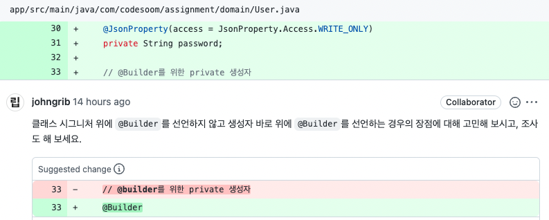

- 아래의 링크를 참고하였습니다
  - [`kwonnam` Lombok 사용상 주의점](https://kwonnam.pe.kr/wiki/java/lombok/pitfall)
  - [`projectlombok` constructor](https://www.projectlombok.org/features/constructor)
  - [`projectlombok` configuration](https://projectlombok.org/features/configuration)

```
compileOnly 'org.projectlombok:lombok:1.18.16'
annotationProcessor 'org.projectlombok:lombok:1.18.16'
```

# **@AllArgsConstructor**, **@RequiredArgsConstructor** 사용금지


- Lombok을 사용하면 IDE Generate보다 클래스위에 어노테이션을 자동완성 해왔다
- 생성자 어노테이션은 왜 위험할까??

<br>

- 이 [글](https://kwonnam.pe.kr/wiki/java/lombok/pitfall)에 따르면 **@AllArgsConstructor**, **@RequiredArgsConstructor** 클래스 필드 순서대로 생성자를 생성해준다고 한다
  - 이 때, **생성자 어노테이션이 작성된 클래스 필드들의 순서를 수정하면 이미 사용중인 영역에 영향이 간다**
  - 필드들의 타입이 달라서 컴파일 에러를 일으킨다면 다행이지만 , **타입이 같다면 큰 문제다**
- 직접 확인해보자

<br>

> **ProductData**

```java
@AllArgsConstructor
public class ProductData {
    private Long id;
    private String name;
    private String maker;
    private Integer price;
    private String imageUrl;
}
```

> 컴파일된 클래스를 디컴파일한 **ProductData**


```java
public class ProductData {
    private Long id;
    private String name;
    private String maker;
    private Integer price;
    private String imageUrl;

    public ProductData(Long id, String name, String maker, Integer price, String imageUrl) {
        this.id = id;
        this.name = name;
        this.maker = maker;
        this.price = price;
        this.imageUrl = imageUrl;
    }
}
```


> 필드들의 순서가 섞인 **ProductData**

```java
@AllArgsConstructor
public class ProductData {
    private Long id;
    private String imageUrl;
    private String maker;
    private Integer price;
    private String name;
}
```

> 컴파일된 클래스를 디컴파일한 **순서가 섞인 ProductData**


```java
public class ProductData {
    private Long id;
    private String imageUrl;
    private String maker;
    private Integer price;
    private String name;

    public ProductData(Long id, String imageUrl, String maker, Integer price, String name) {
        this.id = id;
        this.imageUrl = imageUrl;
        this.maker = maker;
        this.price = price;
        this.name = name;
    }
}
```

- 필드의 순서에 맞게 생성자가 재정의 되었다. 꼭 필요하다면 직접 작성하자
- 특정 롬복 어노테이션을 막고 싶다면 `lombok.(featureName).flagUsage` 옵션을 사용하자
- [어떤 분](https://github.com/projectlombok/lombok/issues/2094#issuecomment-866351481)은 `@AllArgsConsructor`를 **"This annotation is simply a loaded gun.."**라고 말하기도 했다

***

# **@Builder** 클래스에 작성하는 것과 메서드에 작성하는 것의 차이점



- 아래의 링크를 참고하였습니다
  - [`johngrib` Lombok @Builder](https://johngrib.github.io/wiki/pattern/builder/#lombok-builder)
  - [`lombok` @Builder](https://projectlombok.org/features/Builder)
  - [@Builder의 동작 원리](https://velog.io/@park2348190/Lombok-Builder%EC%9D%98-%EB%8F%99%EC%9E%91-%EC%9B%90%EB%A6%AC)
  

- `@Builder`를 직접 확인해보자

```java
@Target({TYPE, METHOD, CONSTRUCTOR})
@Retention(SOURCE)
public @interface Builder {
  ...
}
```

- [**RetentionPolicy**](https://docs.oracle.com/en/java/javase/11/docs/api/java.base/java/lang/annotation/RetentionPolicy.html)에 따르면 **컴파일 단계에서 제거된다**
- [**ElementType**](https://docs.oracle.com/en/java/javase/11/docs/api/java.base/java/lang/annotation/ElementType.html)에 따르면 **아래 위치에 선언할 수 있다**
  1. **클래스**
  2. 인터페이스
  3. enum
  4. 메서드
  5. **생성자**

```
클래스에 주석이 달린 경우 패키지 전용 생성자가 모든 필드를 인수로 사용하여 생성되며( @AllArgsConstructor(access = AccessLevel.PACKAGE)클래스에 있는 것처럼) 이 생성자에 주석이 @Builder대신 추가된 것과 같습니다.
```
- [출처](https://projectlombok.org/features/Builder)

> **클래스에 작성**

```java
@Builder
public class Test {
    private int a;
    private int b;
}

...

public class Test {
    private int a;
    private int b;

    Test(int a, int b) {
        this.a = a;
        this.b = b;
    }
    // static Builder 클래스...
}
```

- **Class 레벨**에 작성하면 기본 생성자는 `default`로 작성된다
- 필드를 추가하게 되면 자동적으로 **Builder**에 포함된다
- 그리고 위에서말한 `@AllArgsConstructor 금지`를 지키지 못한 것과 같다

<br>

> **생성자에 작성**


```java
public class Test {
    private int a;
    private int b;
    private int c;

    @Builder
    private Test(int a, int b, int c) {
        this.a = a;
        this.b = b;
        this.c = c;
    }
}
```

- 위와 같이 사용하다가 `int d`를 추가했다고 가정해보자

> **생성자에 작성** `int d`추가

```java
public class Test {
    private int a;
    private int b;
    private int c;
    private int d;

    private Test(int a, int b, int c) {
        this.a = a;
        this.b = b;
        this.c = c;
    }

    public static Test.TestBuilder builder() {
        return new Test.TestBuilder();
    }

    public static class TestBuilder {
        private int a;
        private int b;
        private int c;

        // method ...
    }
}
```

- 추가한 `int d`는 **Builder**에 포함되지 않고 생성자도 직접 지정한 **private**로 지정되어 있다
- 그리고 아래와 같이 **`@Builder`를 지정한 생성자의 필드에만 적용할 수도 있다**


> **특정 생성자에 작성**

```java
public class Test {
    private int a;
    private int b;
    private int c;

    @Builder
    private Test(int a , int b){
        this.a = a;
        this.b = b;
    }

    private Test(int a, int b, int c) {
        this.a = a;
        this.b = b;
        this.c = c;
    }
}

...

public class Test {
    private int a;
    private int b;
    private int c;

    private Test(int a, int b) {
        this.a = a;
        this.b = b;
    }

    private Test(int a, int b, int c) {
        this.a = a;
        this.b = b;
        this.c = c;
    }

    public static Test.TestBuilder builder() {
        return new Test.TestBuilder();
    }

    public static class TestBuilder {
        private int a;
        private int b;

        // method ...
    }
}
```

- **결론**
  - `@Builder`는 클래스 레벨에 달면 필드가 추가될 때 자동으로 빌더에 포함되고 **default**생성자를 생성한다
  - **default**생성자는 `@AllArgsConstructor`를 사용한 것과 같으니 지양해야 한다
  - 생성자에 직접 달아주자