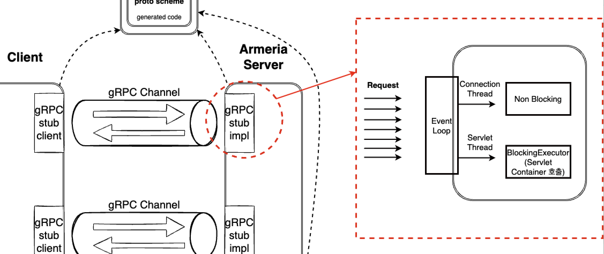
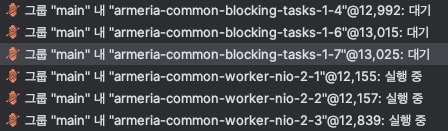
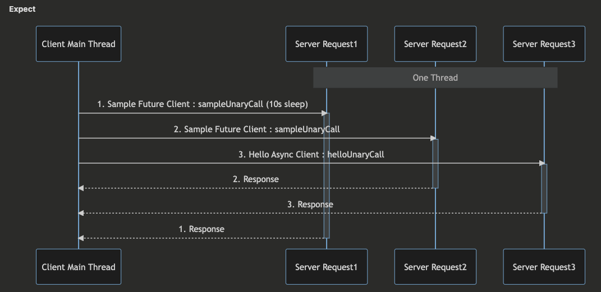
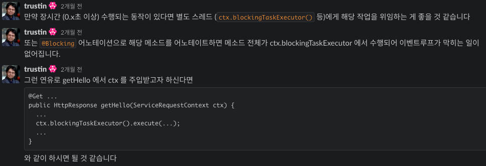
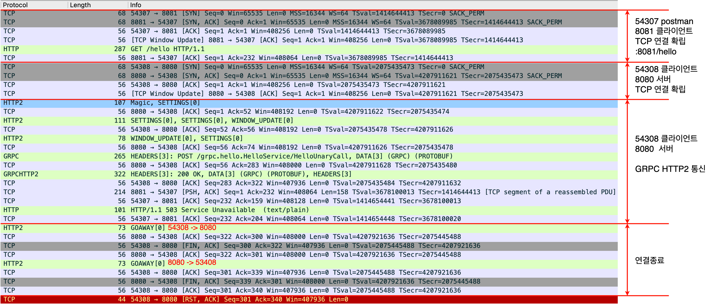
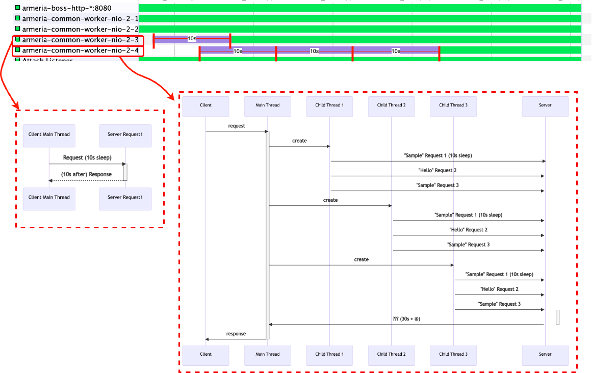

이번에 진행하게된 1차 트레이닝 프로젝트에서 기대하는 영향은 기존에 존재하던 REST API를 그대로 유지하면서 gRPC 통신을 같이 사용할 수 있을지 확인하고, Stream 통신을 테스트해보는 것이다.  
- REST API와 RPC 통신을 한 포트로 처리할 수 있는 Armeria를 사용한다.
- protocol buffer를 통해 기존 JSON보다 데이터 사이즈를 줄일 수 있을 것이다.
  
# Armeria와 Tomcat을 한 개의 포트로?

Armeria에서는 [`javadoc` HttpService](https://javadoc.io/doc/com.linecorp.armeria/armeria-javadoc/latest/com/linecorp/armeria/server/HttpService.html)로 Tomcat, gRPC 들을 추상화 해놓았다.  
Armeria 서버가 실행될 때 원하는 Service들을 ServerBuilder에 추가시키기만 하면 된다.  

> ✋  
> Tomcat 포트를 직접 지정해주고 해당 포트로 REST 요청을 보내게되면 Armeria를 거치지 않고 바로 TomcatWebServer가 처리한다.  
> Tomcat 포트를 `-1`로 지정하고 Armeria 포트만 지정해주면 Armeria가 REST 요청과 gRPC 요청 둘 다 처리하게 된다.  
> 개인적인 궁금증으로는 REST 요청과 gRPC 요청을 어떤 기준으로 요청을 구분하는지 알아내고 싶었지만, 조사해보아도 알아내지 못 했다 ㅠ

Netty의 `EventLoop`가 client로부터 오는 모든 요청을 다 받는다.  
1. **gRPC는 NonBlocking으로 처리**
2. **REST는 Tomcat이 Blocking으로 처리**
   - 서블릿 스레드는 Armeria의 `BlockingTaskExecutor`이다
   - `EventLoop`가 해당 request를 처리하라는 작업을 `BlockingTaskExecutor`에게 위임
   - `BlockingTaskExecutor`에서 어댑터를 이용해 서블릿 컨테이너를 호출

  
> EventLoop는 변경되지 않는 하나의 Thread로 움직이며,  
> 작업 (Runnable 또는 Callable)을 EventLoop 구현으로 직접 제출해 즉시 또는 예약 실행할 수 있다.  
> 구성과 사용 가능한 코어에 따라서는 리소스 활용을 최적화하기 위해 여러 EventLoop가 생성되고,  
> 여러 Channel에 서비스를 제공하기 위해 단일 EventLoop가 할당되는 경우도 있다.  
> - **네티인액션**

# gRPC 통신 종류

> Async는 비동기-논블로킹 통신, Future는 동기-논블로킹 통신

- **UnaryCall** 단일 요청, 단일 응답 
  - Future Stub
  - Blocking Stub
  - 기본(Async) Stub

- **ServerStream** 서버 → 클라이언트 스트림 통신
  - Future Stub (not support)
  - Blocking Stub
  - 기본(Async) Stub

- **ClientStream** 클라이언트 → 서버 스트림 통신
  - Future Stub (not support)
  - Blocking Stub (not support)
  - 기본(Async) Stub

- **BiStream** 양방향 스트림 통신
  - Future Stub (not support)
  - Blocking Stub (not support)
  - 기본(Async) Stub

# Armeria의 Server Thread는 어떻게 처리될까?

1. 클라이언트의 메인 스레드에서 다른 서비스로 요청해도 모든 요청을 처리하는 스레드는 서버 스레드 한 개이다
   - Sample, Hello 서로 다른 서비스로 요청을 보내도 요청을 처리하는 스레드는 한 개이다
2. 위와 같은 테스트를 두 개의 클라이언트에서 각각 한 번씩 보내도 똑같은 결과다
   - **결국 서버에서 받는 모든 요청들은 각 클라이언트의 소켓에 맞는 서버의 스레드들이 처리한다**
3. 한 개의 클라이언트의 메인 스레드에서 자식 스레드 여러 개를 서버에 요청 전송하여도 한 개의 서버 스레드가 처리한다.

> 위와 같은 결과가 나오는 이유를 이해하려면 이벤트 루프, 멀티플렉싱에 대한 이해가 필요하다.  
> [EventLoop와 멀티플렉싱에 대해 정리한 글](https://github.com/jdalma/footprints/blob/main/%EC%A0%95%EB%A6%AC/%EB%A9%80%ED%8B%B0%ED%94%8C%EB%A0%89%EC%8B%B1.md)을 참고하자

EventLoop는 단일 스레드로 요청과 응답을 처리하므로 해당 스레드를 블록하면 EventLoop 자체를 블록하는 것과 같다.  

**Event Loop가 처리하는 기준**
- 한 호스트의 동일한 Port에서 10초 간격으로 요청을 보내면 한 개의 Armeria Server Thread로 처리하지만
- 11초 간격으로 보내면 클라이언트의 Port가 바뀌면서 각기 다른 Armeria Server Thread가 처리한다
- [`GOAWAY` 프레임](https://datatracker.ietf.org/doc/html/rfc7540#section-6.8)을 통해 서로 데이터를 다 보냈다는 확인을 한다.
- 마지막 **RST flag**를 보내면서 서버에서 Socket이 닫히고 TCP 커넥션을 끊는다고 이해했다.

# 소감과 무지 목록
  
proto를 작성해서 generate된 stub들을 이용하여 client ↔︎ server 스트림 통신을 테스트해보는 간단한 테스트 코드를 작성해보았다.  
그리고 새로운 서비스를 개발할 때 다른 팀원들이 템플릿처럼 사용할 수 있도록 회사 레포에 등록해두었다.  
기존 서비스들에 적용하기에는 큰 도전일 것으로 예상된다.  
이 기술들을 한 번에 적용하기 보다는 [JSON을 proto로 바꿔보는 단계](https://spring.io/blog/2015/03/22/using-google-protocol-buffers-with-spring-mvc-based-rest-services)를 밟는것도 좋을 것 같다.    
  
해당 프로젝트에는 처음 접하는 기술적인 키워드들이 많이 포함되어 있었고, 네트워크 지식이 부족하다고 느꼈다.  
- 추가적으로 정리한 내용은 [Armeria와 gRPC 정리](https://github.com/jdalma/footprints/blob/main/%EC%A0%95%EB%A6%AC/Armeria_gRPC.md)에서 볼 수 있다.
  
**무지 목록**    
1. Netty에 대한 이해
2. TCP 소켓 프로그래밍에 대한 이해
3. HTTP/2에 대한 이해
4. Armeria 아키텍처
