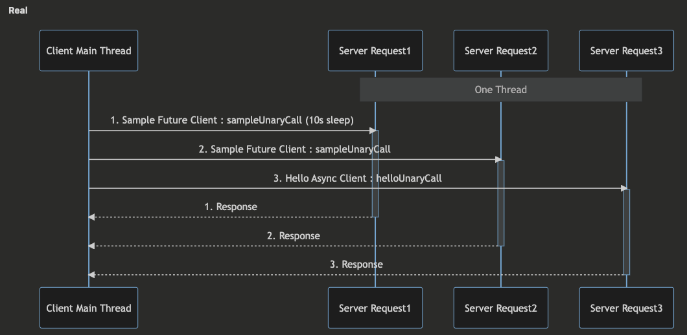

코드는 [여기에](https://github.com/jdalma/armeria-grpc-kotlin/tree/master)

# gRPC 통신 종류

> Async는 비동기-논블로킹 통신, Future는 동기-논블로킹 통신

**SampleCallBiStream** 양방향 스트림 통신
- Future Stub (not support)
- Blocking Stub (not support)
- 기본(Async) Stub

**SampleCallServerStream** 서버 → 클라이언트 스트림 통신
- Future Stub (not support)
- Blocking Stub
- 기본(Async) Stub

**SampleCallClientStream** 클라이언트 → 서버 스트림 통신
- Future Stub (not support)
- Blocking Stub (not support)
- 기본(Async) Stub

**SampleUnaryCall** 단일 요청, 단일 응답 
- Future Stub
- Blocking Stub
- 기본(Async) Stub

# Armeria의 Server Thread는 어떻게 처리될까?

1. Armeria가 요청을 어떻게 처리하는지
2. Armeria Thread가 어떤 기준으로 생성되고 소멸되는지
3. Armeria가 논블로킹, 블로킹 처리를 어떻게 하는지
4. Java NIO의 Selector와 Netty의 EventLoop
5. gRPC(+ HTTP/2) 통신과 ProtocolBuffers를 어떻게 사용하는지
6. Wireshark와 Visual VM을 사용하여 패킷이나 스레드가 어떻게 처리되는지 분석

등등의 내용들을 배우게 되었다.  
스스로 생각하기에는 완벽한 이해나 분석을 했다고 볼 수 없다고 느꼇다.  
**진행하면서 `OS와 네트워크의 중요성`을 많이 느꼈다**

1. **Java NIO의 Selector가 SelectionKeys를 반환하는 과정**
   - TCP Buffer에 패킷들이 다 적재되어 사용할 수 있는 상황이 되면 User영역에 옮기는 처리를 한다고 하는데 명확한 이해가 되지 않는다
2. **Socket File Discriptor에 대한 이해**
   - 어떤 과정으로 Socket과 Channel이 생겨나는지
3. **Armeria Server Thread가 생성되는 기준에 대한 이해**
   - 한 호스트의 동일한 Port에서 10초 간격으로 요청을 보내면 한 개의 Armeria Server Thread로 처리하지만
   - 11초 간격으로 보내면 클라이언트의 Port가 바뀌면서 각기 다른 Armeria Server Thread가 처리한다
   - 마지막 **RST flag**를 보내면서 서버에서 Socket이 닫히고 EventLoop와 Channel이 소멸된다고 이해했다.

1. 클라이언트의 메인 스레드에서 다른 서비스로 요청해도 모든 요청을 처리하는 스레드는 서버 스레드 한 개이다
   - Sample, Hello 서로 다른 서비스로 요청을 보내도 요청을 처리하는 스레드는 한 개이다
2. 위와 같은 테스트를 클라이언트 2개에서 각각 한 번씩 보내도 똑같은 결과다
   - **결국 서버에서 받는 모든 요청들은 각 클라이언트의 소켓에 맞는 서버의 스레드들이 처리한다**
3. 클라이언트의 메인 스레드에서 ExecutorService를 통해 자식 스레드를 여러 개를 서버에 요청 전송하여도 한 개의 서버 스레드가 처리한다.

# 이벤트 루프에서 오래 걸리는 작업은 어떻게 처리하지?

// BlockingTaskExecutor 설명 작성하기