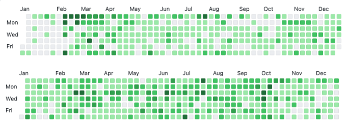

# **들어가며**

개발자로 지내면서 연말회고를 처음 작성하여 제목은 "2022년 회고"이지만 지금까지의 생각을 정리하는 긴 글이 될 것 같다.  
**잊고 싶지 않은 올해의 이벤트들과 내 심정을 기록하기 위해 작성한다**   

***

# **블로그**

블로그를 시작하게 된 계기는  
1. **스스로에 대한 동기부여**
2. 글쓰기 훈련 (코딩도 언어만 다르지 결국 글쓰기라고 생각하기 때문이다)
3. 유명한 개발자들의 블로그
   - [종립 님의 블로그](https://johngrib.github.io/)와 [향로 님의 블로그](https://jojoldu.tistory.com/) 영향이 컷다
4. 유명한 회사들의 기술 블로그
  
`2021년 2월 20일`부터 시작하여 대략 2년 정도 블로그에 글을 작성하고 있다.  
블로그를 관리하면서 얻은  
> **첫 번째 장점은 스스로에 대한 동기부여이다.**  


  
2021,2022년 커밋 내역이다.  
위의 모든 커밋들이 유의미한 커밋이라고 말할 수도 없고 대부분 앵무새 글(강의,책 내용 정리)들 이지만,  
**학습 능력을 기르고 학습 습관**을 잡는 것에는 큰 도움이 되었다.  
  
> **두 번째 장점으로는 메타인지를 높일 수 있는 기회이다.**  
머리에 담긴 `파편적인 지식들을 연결시켜가며` 글로 작성하면서 모르는 내용들이나 키워드들을 발견하게 된다.  
그리고 작성한 게시글을 시간이 흐른뒤에 보면 내가 무엇을 알고 무엇을 모르는지 알게될 기회가 많다.  
알고리즘 공부하면서 많이 느꼇다.  
  
위의 장점들을 보면 블로그를 하는게 무조건 이득일 것 같지만, 단점도 존재한다.  
  
> **첫 번째 단점은 죽은 문서들이다.**  
게시글을 작성하는 재미에 빠져 학습한 내용들을 많이 작성하게 되지만, 그때만 유효하고 그 글들을 계속 관리하지 않기 때문이다.  
학습 내용을 정리하여 글로 작성하면 그 내용들이 내것이 된 것 마냥 신경쓰지 않고 내버려두게 된다.  
그렇다고 지우기에는 아까워 `저장강박증`이 생겼다..  
  
이 **죽은 문서들을 살리기 위한 노력과 시간이 추가로 필요하다.**  
어떤 분들은 글들을 리팩토링하는 즐거움이 있다고 한다  
  
종립님은 이 문제를 해결하기위해 블로그에 **랜덤 버튼**을 추가하여 죽은 문서들이 없게 노력하고 계신다고 하였다.  
  
> **두 번째 단점은 블로깅에만 집중하는 것이다.**  
이력서를 작성할 때 블로그 링크를 당당하게 작성하게 되는데, 블로그가 독이 될 때도 있다.  
첫 번째 단점과 연관이 있는데, 학습 내용들을 확실히 이해하지 않고 넘어가거나 중요한 포인트를 간과하고 블로그에 마구마구 작성하면서 `죽은 문서들`은 불어난다.  
면접관분들은 블로그를 보고 질문을 추가로 생각하게 될텐데 그 질문에 잘 대답하면 본전이고 대답을 못하게 된다면 블로그의 게시글들은 신뢰가 떨어진다.  
  
**위의 문제를 해결하기 위해 `개인 학습 공간`과 `개인 기술 블로그`를 분리할 생각이다.**  
분리하면서 게시글들도 정리해야 할 것이다. (2023년 목표이다)  
  
그럼에도 불구하고 `죽은 문서들`이 걱정돼서 블로그를 망설이고 있다면 **무조건 시작하라고 할 것 이다.**  
개인적으로 개발자가 가져야 할 가장 중요한 소양은 **학습 습관**이라고 생각하기 때문이다.

***

# **알고리즘**

이직을 고민하면서 알고리즘을 하게 되었다.  
- 어떤 분이 `"알고리즘 한 문제에 5만원이라고 생각해라"`라고 한게 갑자기 떠올랐다  
  
SI 업무에 찌들어 있을 때, 알고리즘 푸는게 재밌다라고 느꼈었다.  
문제를 고민하고 해결하는게 진짜 개발자 같다라고 생각이 들었다.   
*(스스로가 멋져보이기도 했다)*  
  
처음에는 [인프런 강의](https://www.inflearn.com/course/%EC%9E%90%EB%B0%94-%EC%95%8C%EA%B3%A0%EB%A6%AC%EC%A6%98-%EB%AC%B8%EC%A0%9C%ED%92%80%EC%9D%B4-%EC%BD%94%ED%85%8C%EB%8C%80%EB%B9%84/dashboard)로 기본을 떼고 운이 좋게 [스터디](https://github.com/jdalma/Algorithm-Study/tree/main)에 참가하게 되었다.  
이 스터디에 [알고리즘 랭커분](https://solved.ac/profile/opera_tive)이 계셨는데 엄청 큰 도움이 되었다.  
  
단순히 알고리즘 분야를 떠나서 `"이렇게 열심히 하시는 분도 있구나"` 라는 생각에 동기부여도 많이 되었다.  
세그먼트 트리 주제로 교육을 한 번 해주셨는데 절대 잊을 수가 없다..  
  
알고리즘이 실무의 문제를 해결할 떄 무조건 도움은 된다고 확신한다.  
단순히 문제를 해결하기 위해 무지성으로 짜는 것이 아니라 **시간,공간 복잡도를 고려하는 자세**가 생긴다.  
최적의 답을 무조건 찾아내지 못 하더라도 (나도 시간복잡도를 확실히 모른다.) 생각하는 개발자라면 기계처럼 코드를 작성하는 것이 아니라 몇 분이라도 고민하고 작성하는것이 중요하다고 생각한다.  

```
내가 사용하는 자바의 정렬 메소드는 어떻게 정렬이 되는지?  
자료구조 마다 그리고 자료구조 구현체 마다 장,단점은 무엇인지?  
```

사소하지만 원리를 알게 될 학습을 할 확률이 높다고 생각한다.  
  
이번년도 목표는 플레티넘이였지만 `골드 1 (1541점)` 59점을 남겨놓고 멈췄다.  
기업용 코테 통과가 목표였는데  

```
1. 특정 깊이 이상으로 파고들기에는 가성비가 떨어진다. (시간 소모가 너무 크다)
2. 문제해결능력보단 solved.ac 티어와 점수에 집착을 하게 된다.
3. 백준에는 문제가 너무 많아 스스로에게 도움이 되는 문제를 구별해내지 못 한다.
``` 

계획은 영어권 플랫폼이긴 하지만.. 문제가 명료하고 프리미엄 결제를 하면 여러 방법의 해설을 설명해주는 **리트코드**를 활용할 생각이다.  
*추가로 데브매칭이나 쇼미더코드 같은 이벤트에 무지성으로 참여하기*  

***

# **스터디와 읽기모임**

1년 전만해도 `"모르는 사람과 스터디나 모임을 어떻게 하지.."`라는 걱정을 했지만 지금은 새로운 개발자들과 모이는 것이 재밌다.  
**다양한 생각과 의견을 나누고 조언을 듣거나 학습 습관들을 보고 배울 수 있기 때문이다.**  
그래서 올해는 온라인 스터디나 모임을 찾으려고 부단히 노력한 것 같다.    

1. (이전 직장) [사내 스터디](https://github.com/jdalma/dev-study)
   - 토론 보다는 단방향 교육에 가까워 아쉬운 스터디 중 하나다.
   - 스터디 주제가 너무 포괄적이였다.
2. [파워 알고리즘 스터디](https://github.com/jdalma/Algorithm-Study/tree/main)
   - 운이 좋게 아주 뛰어나신 분들과 스터디를 하게 되었다.
   - 알고리즘 공부에 있어서 큰 영향을 준 스터디
3. [코드숨 알고리즘 스터디](https://github.com/jdalma/algorithm-for-coding-test)
   - [나정님](https://github.com/Najeong-Kim)이 리딩하신 스터디
   - 19일차, 20일차는 완료 못했다 ㅎㅎ
4. [코드숨 오브젝트 스터디](https://github.com/jdalma/object/wiki)
   - [규원님](https://github.com/kyuwon53)이 리딩하신 스터디
   - 토비의 스프링 읽기모임에 집중하느라 2장까지만 진행하고 포기했다.
5. 코드숨 코딩인터뷰완전분석 읽기모임
   - 여러 분들과 모여서 많은 이야기를 할 수 있어서 재밌었다
6. **토비님이 주관하신 [토비의 스프링 읽기모임](https://github.com/jdalma/tobyspringin5/wiki)**
   - 토비의 스프링을 쓰신 토비님과 함께 읽기모임을 할 수 있었던 굉장히 좋은 경험이였다.
   - 혼자서는 절대 못 읽었을 책이였는데 뛰어나신 많은 분들과 책에 대한 이야기를 할 수 있어서 좋았다.
   - 이번에 이직하면서 큰 도움을 받은 읽기모임이다.
7. [테스트주도개발](https://github.com/jdalma/tdd)
   - 1부만 읽고 2부는 읽지 못 했다
   - 2부를 읽을 때 [토비님 영상](https://www.youtube.com/watch?v=tdKFZcZSJmg&ab_channel=TobyLee)도 참고하자
8. **맹기완 대표님이 주관하신 [자바에서 코틀린으로 읽기모임](https://github.com/jdalma/java-to-kotlin)** 
   - 코드숨 대표 윤석님 덕분에 참여하게 됐고 맹기완 대표님, 책을 번역하신 오현석님과 함께 할 수 있는 모임이다.
   - `"책을 이렇게 까지 읽을 수 있구나. 같은 책을 봐도 아는 만큼 보인다"`를 느낀 모임이다.
   - 스스로 지식이 얕아 중요하게 보지 않고 넘기는 부분들을 깊게 얘기해주시고 토론을 하여 굉장히 재밌게 진행하고 있는 모임이다.
   - *재밌다고해서 안힘들진 않다* 스터디나 읽기모임에 자주 참여하지만 이렇게 깊게 얘기하고 부담되는 모임은 처음이다.
   - 단순히 책에 나오는 내용들만 보고 넘어가는게 아니라 **객체지향**, **함수형 프로그래밍**, **값 이론** 등에 대한 깊은 내용들을 얘기해주셔서 감사하게 참여하고 있다.

***

# **코드숨**

**코드 리뷰**를 경험하고, **테스트 코드**를 배우고 싶어서 관심갖게된 교육이다.  
금액 때문에 고민을 잠깐 했지만 `종립님`이 직접 리뷰를 해주시는 것을 보고 바로 참여했다.  

|  | 제목          | 리뷰               | 회고 |
|:--|:-------------|:------------------|:------|
| 1주차 | [**Java로 ToDo REST API만들기**](https://github.com/jdalma/spring-week1-assignment-1) | [코드 리뷰](https://github.com/CodeSoom/spring-week1-assignment-1/pull/115) | [회고](https://jdalma.github.io/docs/retrospective/2022y/2022y08m/#8%EC%9B%94-%EC%B2%AB-%EC%A7%B8%EC%A3%BC-%ED%9A%8C%EA%B3%A0)  |
| 2주차 | [**Spring Web 으로 ToDo REST API 만들기**](https://github.com/jdalma/spring-week2-assignment-1) | [코드 리뷰](https://github.com/CodeSoom/spring-week2-assignment-1/pull/94)  | [회고](https://jdalma.github.io/docs/retrospective/2022y/2022y08m/#8%EC%9B%94-%EB%91%98-%EC%A7%B8%EC%A3%BC-%ED%9A%8C%EA%B3%A0)  |
| 3주차 | [**Spring Mock MVC , 유닛 테스트 작성하기**](https://github.com/jdalma/spring-week3-assignment-1) | [코드 리뷰](https://github.com/CodeSoom/spring-week3-assignment-1/pull/83) | [회고](https://jdalma.github.io/docs/retrospective/2022y/2022y08m/#8%EC%9B%94-%EC%85%8B-%EC%A7%B8%EC%A3%BC-%ED%9A%8C%EA%B3%A0---%EC%BD%94%EB%93%9C%EC%88%A8-3%EC%A3%BC%EC%B0%A8-%EA%B3%BC%EC%A0%9C-%EC%8A%A4%ED%94%84%EB%A7%81-%ED%85%8C%EC%8A%A4%ED%8A%B8-%EC%BD%94%EB%93%9C-%EC%9E%91%EC%84%B1%ED%95%98%EA%B8%B0)   |
| 4주차 | [**TDD로 `상품 도메인` 구현하기**](https://github.com/jdalma/spring-week4-assignment-1) | [코드 리뷰](https://github.com/CodeSoom/spring-week4-assignment-1/pull/76) | [회고](https://jdalma.github.io/docs/retrospective/2022y/2022y08m/#8%EC%9B%94-%EB%84%B7-%EC%A7%B8%EC%A3%BC-%ED%9A%8C%EA%B3%A0---%EC%BD%94%EB%93%9C%EC%88%A8-4%EC%A3%BC%EC%B0%A8-%EA%B3%BC%EC%A0%9C-%EA%B3%A0%EC%96%91%EC%9D%B4-%EC%9E%A5%EB%82%9C%EA%B0%90-%EA%B0%80%EA%B2%8C-%EB%A7%8C%EB%93%A4%EA%B8%B0)|
| 5주차 | [**TDD로 `사용자 도메인` 구현하기** (+ 유효성 검사)](https://github.com/jdalma/spring-week5-assignment-1)  | [코드 리뷰](https://github.com/CodeSoom/spring-week5-assignment-1/pull/75) | [회고](https://jdalma.github.io/docs/retrospective/2022y/2022y09m/#9%EC%9B%94-%EC%B2%AB-%EC%A7%B8%EC%A3%BC-%ED%9A%8C%EA%B3%A0---%EC%BD%94%EB%93%9C%EC%88%A8-5%EC%A3%BC%EC%B0%A8-%EA%B3%BC%EC%A0%9C-%EA%B3%A0%EC%96%91%EC%9D%B4-%EC%9E%A5%EB%82%9C%EA%B0%90-%EA%B0%80%EA%B2%8C-%EB%A7%8C%EB%93%A4%EA%B8%B0) |
| 6주차 | [**JJWT `인증`(Authentication) 구현하기**](https://github.com/jdalma/spring-week6-assignment-1) | [코드 리뷰](https://github.com/CodeSoom/spring-week6-assignment-1/pull/70) | [회고](https://jdalma.github.io/docs/retrospective/2022y/2022y09m/#9%EC%9B%94-%EC%85%8B-%EC%A7%B8%EC%A3%BC-%ED%9A%8C%EA%B3%A0)
| 7주차 | [**사용자 패스워드 `암호화` 및 `인가` 처리를 Spring Security로 처리**](https://github.com/jdalma/spring-week7-assignment-1) | [코드 리뷰](https://github.com/CodeSoom/spring-week7-assignment-1/pull/74) | [회고](https://jdalma.github.io/docs/retrospective/2022y/2022y09m/#9%EC%9B%94-%EB%84%B7-%EC%A7%B8%EC%A3%BC-%ED%9A%8C%EA%B3%A0)
| 8주차 | [**`Spring REST Docs` 적용, `Docker`로 빌드 및 배포**](https://github.com/jdalma/spring-week8-assignment-1) | [코드 리뷰](https://github.com/CodeSoom/spring-week8-assignment-1/pull/67) | [회고](https://jdalma.github.io/docs/retrospective/2022y/2022y10m/#10%EC%9B%94-%EC%B2%AB%EC%A7%B8-%EC%A3%BC-%ED%9A%8C%EA%B3%A0-%EC%BD%94%EB%93%9C%EC%88%A8-%EB%81%9D)


코드숨 교육을 들으면서 기술적인 내용만이 아니라 **개발자 커리어를 관통하는 말씀들을 많이 해주셨다.**  
종립님이 리뷰해주신 내용 중 아래의 내용이 가장 기억에 남는다.  

> 우리가 작성하는 코드는 그냥 기계를 굴러가게 하기만 하는 것이 아닙니다.  
> 레퍼런스 문서를 토대로 실천하는 활동이기도 하다는 점을 곱씹어보세요.  
> 공식 문서의 힘을 끌어다 내 코드에 연결할 수 있다고 생각해 보세요.  
  
살면서 종립님을 직접 뵐 기회가 있을까 싶었는데, 코드숨 공부방에 직접 오셔서 강연까지 해주셨다.  

1. 자주 사용하는 것을 자세하게 들여다 봐라.
   - 자바 `util` 패키지를 뜯어보거나 무의식적으로 사용하는 기능들에 대해 공부해라
2. 블로그 게시글들을 오래 묵혀두지 않기, 텀을 두고 반복읽기
3. 1차 창작자의 글 또는 책을 읽어라
   - 과제를 진행하면서 **RFC** , **JLS**를 많이 접했다
   - 개인적으로 공감되는게 공식 문서들이 읽기는 힘들지만 습득할 때 찝찝하지가 않다
   - *영어를 읽기가 힘들긴 하다...* 적응하면 된다
4. 책 추천
   - [**생각하는 프로그래밍**](http://www.kyobobook.co.kr/product/detailViewKor.laf?mallGb=KOR&ejkGb=KOR&barcode=9788966260997) `퀵 소트 알고리즘 공동 저술자`
   - [**자바 병렬 프로그래밍**](https://www.aladin.co.kr/shop/wproduct.aspx?ItemId=2354267) 
5. 알고리즘은 필요한 만큼 해라
6. 면접은 가기 싫은 순으로 많이 봐라
   - **긍정적인 에너지를 보이려고 노력해라**
   - 면접에 붙다보면 자신감도 붙는다

그리고 코드숨 디스코드 커뮤니티도 도움이 많이 되었다.  
스터디 모집도 활발하고 정보 공유도 많이 해주신다.  
퇴근하고 새벽에도 공부하시는 분들 보면 동기부여도 많이 된다.  

코드숨 교육은 **올해의 두 번째로 잘한 일이다.** *첫 번째는 퇴사*    
금전적인 여유가 된다면 코드숨 교육을 **강력 추천**한다.  

***

# **이직**

SI 회사에서 개발자로 인정받기 위해서는 좋은 코드 보단 수행한 프로젝트의 수 였다.  
**냄새나는 코드들은 넘쳐나고 기술 부채는 안중에도 없고 생산성을 높일 수 있는 기술이나 툴이 있어도 그걸 적용하는 비용을 더 크게 생각**하여 개발자는 도태될 수 밖에 없는 환경이다.  
  
SI 회사를 [퇴사](https://jdalma.github.io/2022y/leave/)하고 3달동안 하고싶은 공부를 했다.  
- 코드숨 교육
- [우테캠프로 사전과제](https://github.com/jdalma/footprints/blob/main/%ED%9A%8C%EA%B3%A0/%EC%9A%B0%EC%95%84%ED%95%9C%ED%85%8C%ED%81%AC%EC%BA%A0%ED%94%84%ED%94%84%EB%A1%9C_%EC%82%AC%EC%A0%84%EA%B3%BC%EC%A0%9C.md)
  
구직 활동 중에 자비스앤빌런즈 코딩 테스트,[과제](https://github.com/jdalma/footprints/blob/main/%ED%9A%8C%EA%B3%A0/%EC%9E%90%EB%B9%84%EC%8A%A4_%EA%B3%BC%EC%A0%9C.md)를 통과하고 기술면접에서 떨어져 화나서 찾아보다가 지원한 회사가 지금 회사다.  
  
더파이러츠와 지금 회사를 고민하다가 **MSA를 구축하기 위해 힘쓰고 있고 기술적 부채를 해결하기 위해 노력하고 있다**는 말을 듣고 주저없이 지금 회사를 선택했다.  
*[더파이러츠 시리즈 C 투자 유치](https://platum.kr/archives/197188) 기사를 보고 조금 씁쓸했지만..*  
  
알고리즘을 열심히 준비했었는데 알고리즘을 써먹지 못하고 이직해서 조금 아쉽긴 하지만 배우고 경험할 수 있는 것들은 넘쳐난다.  
입사한지 얼마안된 지금 느끼기엔 기술 스택은 크게 GraalVM, Java 17, Kotlin, Spring (+Gateway), Armeria, gRPC, Docker, ELK stack 들인 것 같다.  
Java 버전에 대한 개인적인 생각은 Java 8을 쓴다고 해도 Java 8을 확실히 쓸 수 있는 사람은 몇 없기 때문에 Java 버전에 굉장히 방어적인데 17버전이라 놀랐다.  
**버전이 높은 만큼 학습해서 적용할 기회는 더 많을 것이다.** 그리고 (인프라에 대해 잘 모르지만) **도커 스웜** ([컨테이너 오케스트레이션](https://seongjin.me/docker-swarm-introduction-nodes/)), **젠킨스**로 인프라를 구성하고 있어 관련 기술들을 학습하여 적용할 수 있는 기회도 있을 것이다.  
*학습하고 그 일을 하고 싶다고 강하게 어필해야지*  
  
입사 후에 트레이닝 프로젝트와 도메인 교육을 진행했다.  
내가 맡은 트레이닝 프로젝트는 `n차`로 나뉘어 진행되고 있는데  
**1차**는 [Armeria와 gRPC로 통신하기 위한 템플릿 서버 개발](https://jdalma.github.io/2022y/trainingProject/)  
**2차**는 1차에서 만든 템플릿 서버로 ES서버에 부하를 주는 검색식 검증 규칙 관리 개발이다.
  
1차 트레이닝 프로젝트는 [기술적인 키워드들](https://github.com/jdalma/footprints/blob/main/%ED%95%99%EC%8A%B5/Armeria_gRPC.md)이 너무 많이 포함되어 있었어서 힘들었다.  
`"시간만 있다면 스스로 어떤 일이든 해낼 수 있다"` 라고 생각하고 있었지만 CS지식의 중요성을 깨달았다.  
그래도 스스로 테스트 케이스를 생각하며 테스트하고 어디를 더 분석해야할지 결정하여 오랜만에 재밌게 개발한 것 같다.  
원리를 이해하기 위한 학습을 계속 해야하고, 이번에 Armeria와 gRPC를 사용하는 만큼 비동기 프로그래밍과 HTTP/2는 확실하게 짚고가고 싶다.  
  
SI 회사와 굉장히 다른 점은 
1. 새로운 기술을 도입할 때 그저 사용하는 개발이 아니라, **원리를 파악하고 사용하기 위해 분석을 하고 개발 하는 것**
2. 분석이나 개발하면서 조언을 받고 싶은것이 있다면 리뷰를 요청하기만 하면 되는 **리뷰 문화**
3. 레거시 프로젝트에서 특정 기능을 라이브러리로 분리하면서 사소한 리팩토링을 진행했는데 **`어떻게 하면 객체지향적일까?`라고 팀원들에게 여쭤보면 진지하게 고민하시는 것**
   - SI 회사에서는 이런 내용을 고민하는 분이 없었다
4. `분석 → 설계 → 개발`의 한 사이클을 직접 경험할 수 있다.

입사하고 힘든 점은 **도메인 교육**이다. 입사할 때는 특허에 대해 무지하여 무슨 서비스일지 궁금했었다.  
결론은 기능들이 엄청많다. 특허조사를 하기 위한 편의성 기능들과 다른 회사에서 솔루션으로 취급할 정도의 서비스들도 있다.  
*그만큼 레거시 프로젝트는 생각보다 거대한 것 아닐까?*

**특허 데이터 검색 서비스**가 메인인 만큼, 특허에 대해 잘 알아야하고 회사 서비스에 대한 이해가 높아야 한다.  
두 개의 교육이 끝난 상태지만 마지막 관문인 **검색 서비스 활용 능력 시험**이 있다.  
특정 조건이 주어지면 **우리 회사 서비스를 어떻게 사용해야 할지 서술**하는 것이다.  

한 번에 통과하고 개발업무에 집중하고 싶다. *제발*  

***

# **소감**

연말회고를 처음 작성해보는데 이렇게 나열해보니 열심히 살아온 것 같기도 하다.  
올해 목표들이 있었는데  

1. [x] 수익이 나는 서비스 회사
2. [x] mac을 지원해주는 회사
3. [x] IDE를 지원해주는 회사
4. [x] 간식들이 구비되어 있는 회사
5. [x] 스스로 생각하는 최소한의 연봉은 주는 회사
6. [ ] B2C 서비스 회사 → `B2B 회사`
7. [ ] 많은 트래픽을 경험할 수 있는 회사 → `대용량 데이터 경험 가능??`
8. [ ] AWS, 분산 DB, MSA, 메시지 큐 시스템을 경험할 수 있는 회사  → `레거시 프로젝트 서비스 분리 작업 진행` ([마틴 파울러의 마이크로서비스](https://martinfowler.com/articles/microservices.html))
9. [x] 블로그 꾸준히 운영하기
10. [x] 학습하는 자세 유지하기
11. [x] 다른 개발자들과 교류하기
12. [x] 관심가는 스터디에 망설이지 말고 참여하기
13. [x] 코드리뷰 받아보기
14. [x] 테스트 코드 배워보기
15. [x] 학습에 대한 비용은 아끼지 말기

시간이 지나면서 점점 목표한 것들을 해내고 있다는 생각이 든다.  
**옛날엔 어려워 했던 것을 `지금은 아무렇지 않게 해내게 된 것`이 가장 많이 성장한 것 같다.**  

# **2023년 목표**

2022년 연말에 새로 참여한 [스터디](https://terrific-bull-7be.notion.site/RealWorld-c8c7312ff2824764a2efbfa871d22c2f)가 있다.  
회사 도메인 시험을 끝내고 참여할 생각이다.  
해당 스터디 인원들과 **개발 서적 읽기 모임**도 만들어 Real MySQL과 HTTP 완벽가이드를 읽을 생각이다.  
같이 꾸준하게 많은 책들을 해치워 나갔으면 좋겠다.  
아래는 읽어야지 생각하고 있는 책들이다.  

1. 네티 인 액션
2. 코틀린 인 액션
3. 자바에서 코틀린으로
4. Real MySQL 1,2권
5. HTTP 완벽가이드
6. 이펙티브 자바
7. 이펙티브 코틀린
8. 리팩터링
9.  자바 ORM 표준 JPA 프로그래밍
10. 혼자 공부하는 컴퓨터 구조+운영체제
11. 데이터 중심 애플리케이션 설계
12. 생각하는 프로그래밍
13. 프로그래머의 뇌
14. 실용주의 프로그래머
15. 멀티코어를 100% 활용하는 자바 병렬 프로그래밍
16. 자바 최적화
17. 가상 면접 사례로 배우는 대규모 시스템 설계 기초
18. 오브젝트
19. 클린 코드
20. 클린 아키텍처
21. 코드 CODE
22. 만들면서 배우는 클린 아키텍처
23. 도메인 주도 개발 시작하기
24. 도메인 주도 설계
25. 1일 1로그 100일 완성 IT 지식
26. 죽을 때까지 코딩하며 사는 법
27. 개발자의 글쓰기

2023년 연말 회고 때 얼마나 읽었는지 확인해야지  

> **2023년에 지키고 싶은 목표들**  
1. 블로그 꾸준히 운영하기
   - 학습 블로그와 기술 블로그 분리하기
2. 학습하는 자세 유지하기
   - 인프런 사놓은 강의 보기
   - 책 10권 읽기
3. 다른 개발자들과 교류하기
4. 관심가는 스터디에 참여하기
5. 사람들 앞에서 기술 발표 해보기
6. `400km` 뛰기
   - 2021년 응암에 살 때는 `420km`정도 뛰었었는데.. 가디로 이사오면서 거의 안했다.
7. [개발자, 한 달에 책 한 권 읽기](https://www.facebook.com/dev.reader) 참여하기

지금 회사에서 학습 습관을 좋게 봐주셨는데, 2차 면접에서 `"이렇게 몰두한 경험이 또 있나?"`라는 질문이 기억에 남는다.  
개발자를 시작하기 전에 이렇게 내 모든 에너지와 시간을 쏟아부어서 열정적이게 했던 일은 없었던 것 같다.  
개발자라는 직업이 매력적인 만큼 스스로 변화했다고 많이 느껴진다.  
다른 전공자들에 비해 늦게 시작한 만큼 불안하기도 하고, 열등감도 많이 느꼈었는데 그럴수록 부족한 부분을 더 채우면 된다고 생각한다.  

2023년 연말 회고를 작성할 때 이 글이 귀엽게 보일 정도로 성장했으면 좋겠다.  
올해 고생했고 계속 나아가자  