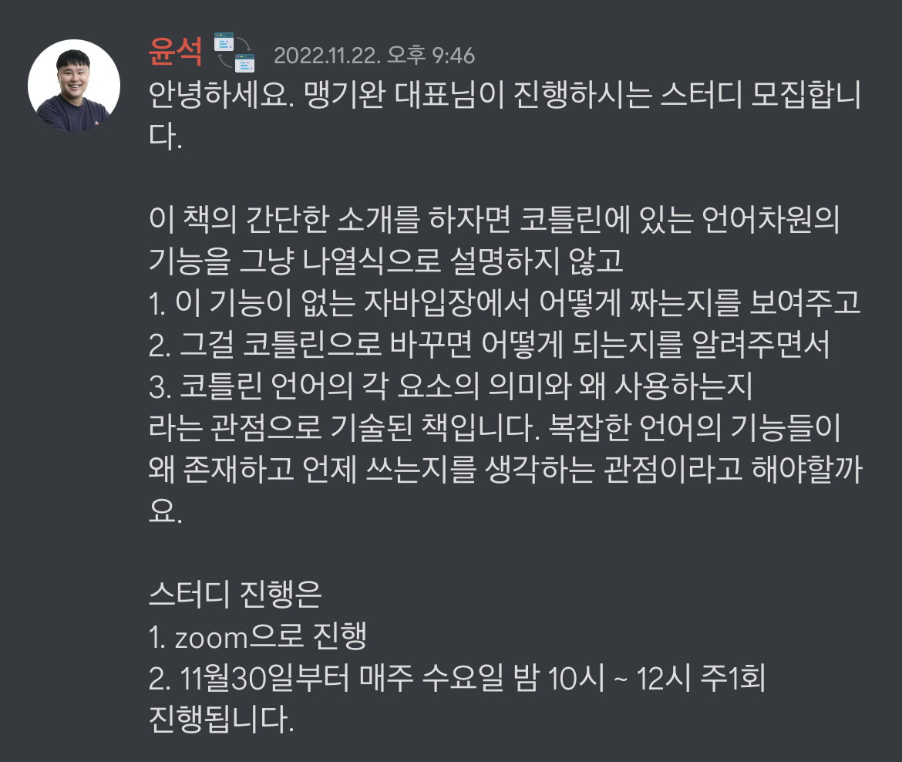
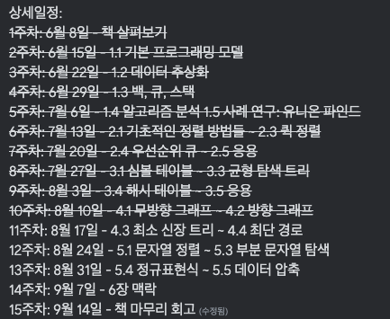
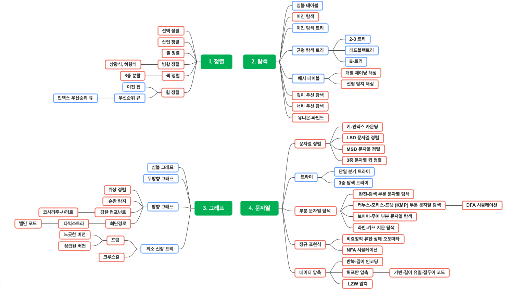
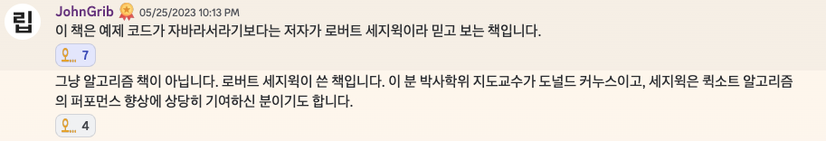

# **자바에서 코틀린으로**

업무를 진행하면서 자바와 코틀린 중에 선택할 수 있었다.  
새로 개발하는 작업들은 모두 코틀린을 지향하고 있기도 하고, 이 기회에 코틀린을 써보고 싶어 코틀린을 선택했다.  
  
시기적절하게 코드숨 커뮤니티에서 스터디 모집 공지가 올라왔다.  

소개를 보면 코틀린을 처음 접하는 상황에서 진행하기는 버거워 보였지만 일단 신청했다.  
실제로 쫓아가기도 바빳고, 좋은 이야기들을 많이 해주셨는데 소화하기도 힘들었던 것 같다.  
  
총 13주간 진행한 [자바에서 코틀린으로](http://www.yes24.com/Product/Goods/115221699)스터디를 회고해보려 한다.  
- [모임 내용 정리](https://github.com/jdalma/java-to-kotlin/wiki)
  
<h3>코틀린을 몰라도 따라갈 수 있나?</h3>
  
[공식문서](https://kotlinlang.org/docs/data-science-overview.html)에서 `"Kotlin은 간결하고 읽기 쉽고 배우기 쉽습니다."` 라고하듯이 문법을 배워서 작성하는 것은 자바를 사용했다면 코틀린 자체를 빨리 이해할 수 있는 것은 맞다.  
하지만 **코틀린을 코틀린답게, 객재지향 프로그래밍과 함수형 프로그래밍을 적절히 선택하여 코틀린답게 작성하는 것은 매우 어려운일이다.**  
  
*함수형 프로그래밍의 `ㅎ`도 모르는 입장에서* 코틀린의 문법과 코틀린이 해결하려는 문제를 동시에 이해하기는 힘들었다.  
- [대수적 효과](https://overreacted.io/ko/algebraic-effects-for-the-rest-of-us/)  
- [모나드](https://overcurried.com/3%EB%B6%84%20%EB%AA%A8%EB%82%98%EB%93%9C/) 
딱딱한 자바만 사용하다가 코틀린을 만나면서 자바에 비해 문제를 해결하는 문법적인 방법이 많다는 것을 느꼈다.  
이 책은 코틀린의 기능을 친절하게 설명해주는 책은 아니고 자유도가 높은 만큼 **저자 입장에서** `자바를 코틀린으로 전환`하거나, `자바와 코틀린의 기능적 차이`, `코틀린의 특정 기능을 사용하는 목적과 이유`를 설명하려 하는 것 같다.  
  
코틀린에 대한 이해가 깊고 함수형 프로그래밍에 대해 관심을 가지는 인원들과 같이 하는것이 아니라면 해당 책을 읽기에는 놓치는 것이 많을 것 같다.  
혼자 책으로 공부하려 했다면 이 책보다는 [코틀린 인 액션](http://www.yes24.com/Product/Goods/55148593) 이나 [코틀린 완벽 가이드](http://www.yes24.com/Product/Goods/107698728)로 진행했을 것 같다.  
  
<h3>책을 읽고 얻은 것은?</h3>

1. 코틀린에서 널과 예외를 대처하는 자세
2. 코틀린의 함수 타입과 개념 (고차함수, 일급함수) , 람다와 친해지기
3. 예외를 `Result`와 같이 값으로 반환하는 예외를 다루는 방법 (+ [Result4K](https://github.com/npryce/result4k))
4. 클래스로 캡슐화를 하기 보다는 코틀린 표준 라이브러리를 사용하기 위한 타입 별명 적용
5. 자바와 다르게 코드 트랜잭션, 컨텍스트에 신경쓰고 가능한 짧게 가져가기
6. 함수 체이닝
7. 인라인 함수 (컴파일 시점에 함수 본문의 바이트코드를 삽입하여 준다.)
8. 코틀린은 기본적으로 클래스 상속에 닫혀있고, 합성적인 스타일을 장려
9.  값 이론과 객체 전파, 방어적 복사

아는만큼 보인다라는 말이 있듯이, 자바 함수형 프로그래밍과 스트림을 정확하게 이해하지 못하는 수준인 나의 입장에서 얻은 것들은 이 정도가 대표적인 것 같다.  
  
코틀린의 기능을 `언제`, `어떤 기준`으로 사용하는지 주관적인 기준이 생겼다.  
- *마법같은* 코틀린 컴파일러를 통해 컴파일된 class를 자바 코드로 디컴파일해서 확인하면서 학습하는 것이 큰 도움이 되었다.
  
<h3>모임을 참여하고 얻은 것은?</h3>

책을 이렇게 음미하면서 잘근잘근 씹어먹는 스터디는 처음이였다.  
아마 코틀린과 함수형 프로그래밍에 능통하신 맹대표님과 책을 번역하신 오현석님, 그리고 백지훈님이 계셔서 가능하지 않았을까 싶다.  
*세 분이 토론하면 살벌하다*  
  
이번 모임을 통해 **책을 비판적으로 읽는 시각**과 **읽기 모임의 정석**을 경험한 것 같다.  
지식을 습득하려는 목적으로 책을 읽으면서 책의 내용에 항상 순응하고 `"오 이렇게 쓰나보다"` 하고 넘어가는 부분들에 대해, 사람들이 모여 진지하게 토론하는 자체가 좋은 경험이였다.  
목표는 두 시간에 두 개의 장을 나가는 것이 목표였지만, 두 시간을 넘기거나 두 장을 못 나가는 경우도 허다했다.  
그만큼 토론에 진심인 분들을 보며 `"책을 이렇게 까지 읽을 수 있구나, 이 주제로 이 정도의 얘기를 할 수 있구나"`를 느꼈다.  
*해당 토론에서 튀어나오는 키워드들만 주워 먹기도 벅찼다.*  

<h3>핵심</h3>

책을 다 읽고나니 스터디 초중반에 말씀해주셨던 아래의 내용이 책을 관통하는 내용이였다는 것을 알 수 있었다.  

> 코틀린은 `가변성` + `OOP`를 바탕에 깔고 있는 언어이기 때문에 아에 가변성을 쓰지 않을 이유는 없다
> 
> 1. 전체적인 프로젝트의 흐름은 객체지향을 쓴다
> 2. 객체지향을 쓸 때도 꼭 필요한 경우가 아니라면 가변 필드 + 가변 객체를 쓰는 일은 지양한다
> 3. 객체 사이의 통신에 사용하는 메서드는 가능하면 명시적 수단 (파라미터와 반환 값을 사용)을 활용하고 부수효과(side effect)를 만들지 않는다
> 4. 한 함수 / 메서드 내부에는 가능한 불변성을 활용한다
> 5. 여러 원소를 저장할 컬렉션에 대한 집계, 필터링, 변환 등의 로직을 직접 구현하기 보다는 표준 컬렉션 라이브러리를 활용한다
>
> 상태를 경계에 잘 가둬서 처리하느냐 → **객체지향**    
> 상태 변화를 없애고 값 객체, 불변으로 처리하느냐 → **함수형**  
> 함수 경계 안에서는 불변객체와 컬렉션을 쓰고 각종 순수 함수를 도우미로 써서 함수형으로 처리하면 좀 더 코드를 쉽게 작성할 수 있고,    
> 전체적으로는 객체지향적으로 사고하면서 모듈간의 결합도를 최소화하고 응집도를 최대화한다는 기본 원칙을 지켜나가는 스타일이 이미 자바 개발자인 분들에게는 최선이 될 것이다.    
> - 자바에서 코틀린으로 옮긴이 [오현석](http://www.yes24.com/24/AuthorFile/Author/192002)

  
> 값 컨텍스트로 프로그래밍하면 그 여파가 미치는 곳은 코드의 디자인적인 측면이나 설계까지 전부 영향이가고,    
> 더 나아가 코드를 사용하는 방법 마저도 달라지고 필요한 자료구조도 달라진다.    
> 단지 저장에 해당되는 부분만 값으로 대치한다고 끝이 아니다. 값 컨텍스트를 도입하려면 값을 다루는 모든 프로그래밍 스킬도 배워야 한다.   
> 값과 함수형을 고려할 때는 조직 내 사람이라는 문제를 간과하지 않아야 한다.    
> 값 컨텍스트를 펼치고 함수형 프로그래밍을 팀에 도입한뒤 "넌 이거 왜 못해?"라고 하는 것은 폭력이 될 수 있다.
> - [맹기완](https://www.rocketpunch.com/@hikamaeng) 대표
  
<h3>소감</h3>

언어에 대해 새로운 인사이트를 얻게해주시고, 경험과 조언들을 아낌없이 쏟아내주신 스터디원 분들과 맹대표님, 오이사님 그리고 스터디에 참석할 수 있게 공유해주신 윤석님에게 감사하다.  
스터디에서 주제를 공급하기보단 소비만하는 스터디원이였는데 쫓아내시지 않은것도 감사하다.  
  
스터디를 하면서 팀원들과 코틀린에 대한 이야기를 몇번 나누었었는데, 코틀린의 기능을 제한적으로 사용할 때도 있고, 자율적으로 사용할 때도 있다.  
코딩한다는 행위 자체가 정답이 있는 행위가 아니다. **혼자 일하는 것이 아닌 이상 코드리뷰를 통해 회사 내의 컨벤션을 맞춰가거나 팀원들과 조율해나가야 할 것이다.**  
실무에 코틀린을 사용하면서 진짜 간단한 작성도 고민을 하게 됐으며, **`이걸 이렇게 사용하면 장단점이 뭐지? 의도가 잘 드러날까?`** 고민을 하는 자세가 이 모임 덕분이 아닐까 싶다.  
*코틀린으로 개발하고 있는 나를 뒤에서 스터디원분들이 지켜보고 있는 느낌?*  
  
추가로 [오현석](http://www.yes24.com/24/AuthorFile/Author/192002)님이 코틀린 핵심 프로그래밍 책을 내신다고 하셨다.  

***

# **RealMySQL 1권** ~ing

[정리](https://github.com/jdalma/footprints/tree/main/real-mysql)를 하면서 읽고있다.  

***

# **한 권으로 읽는 컴퓨터 구조와 프로그래밍**

간략하게 [정리](https://github.com/jdalma/footprints/tree/main/%ED%95%9C%20%EA%B6%8C%EC%9C%BC%EB%A1%9C%20%EC%9D%BD%EB%8A%94%20%EC%BB%B4%ED%93%A8%ED%84%B0%20%EA%B5%AC%EC%A1%B0%EC%99%80%20%EC%9A%B4%EC%98%81%EC%B2%B4%EC%A0%9C)하면서 읽었다.  
  
추천의 글과 옮긴이의 말을 보면서 자극 만땅으로 받고 책을 폈지만 중후반부터 정신이 혼미해진다.  
저자는 이 책에서 많은 기초적인 내용을 다룬다고 설명한다.    

초반에서 중반까지는 전자 회로부터 빌드업하여 내부구조, 컴퓨터 아키텍처와 운영체제까지 얕게 설명해준다.  
고민조차 할 수 없었던 이야기들이 나온다. 예를 들어 `실제로 비트는 어떻게 저장되나?` 와 같은 고민이다.  

중반에서 후반까지는 좋은 내용도 많지만 갑자기 이런 내용이 왜 나오지? 하는 내용들이 있다.  
저자 말대로 넓고 얕은 내용을 설명하여 관심있는 주제는 얕아서 문제고 특정 내용은 기반지식이 없으면 이해조차 할 수 없는 챕터도 있었다.  
  
그래고 컴퓨터 구조 책을 처음으로 다 읽어봐서 뿌듯하다  
**각 잡고 읽는 책이기 보다는 출퇴근할 떄 가볍게 읽어도 될, 컴퓨터 구조라는 학문을 시작하는 책이라고 생각한다.**  

***

# **토비의 스프링 부트 - 이해와 원리**

큰 맥락으로 보면 `@SpringBootApplication` 어노테이션이 제공해주는 마법같은 일들을 알려주는 강의이다.  
- 스프링 부트가 스프링을 어떻게 잘 사용하고 있는지 
- 스프링 부트의 자동 구성이 어떤 식으로 실행되고 로딩되는지
- 스프링 부트의 기술 마다 자동으로 구성되는 빈들은 어떤게 있는지
- 자동으로 구성되는 설정 정보들이 어떻게 관리되는지

실무에서 대충 감으로 이해하던 내용들이 많았다.  
스프링 부트가 뭐냐고 물어보면 "스프링을 편하게 써줄 수 있게 해주는 프레임워크"라고만 생각했었는데 조금 더 자세하게 설명해줄 수 있을 것 같다.  
  
처음 접한다면 모르는 기술적인 단어들이 많이 나와서 스프링과 자바에 익숙하지 않다면 힘들수도 있을 것 같긴 하지만  
**스프링 부트의 컨셉과 구성 정보를 관리하는 구조에 대해 알 수 있어 굉장히 좋은 강의였다.**  

***

# **HTTP 완벽 가이드**

해당 책의 스터디는 [이슈 기반](https://github.com/SeolYoungKim/http-definitive-guide-study/issues?q=is%3Aissue+is%3Aclosed)으로 진행되었다.  
대략적인 [정리](https://github.com/jdalma/footprints/tree/main/HTTP%EC%99%84%EB%B2%BD%EA%B0%80%EC%9D%B4%EB%93%9C)를 하면서 읽었다.  
  
책이 `2002년`에 출간되었고, 번역본은 `2013년`에 출간된 만큼 요즘이랑 비교하면서 읽기에는 무리가 있다.  
하지만 많은 사람들이 추천하는 이유가 있다.  
  
전반적인 네트워크 지식을 익힐 수 있고, `HTTP`가 진화하면서 기존 근간 기술들은 변하지 않기 때문에 읽을 가치는 충분하다.  

1. TCP 커넥션에 대한 개념
2. 프록시, 게이트웨이, 터널에 대한 이해
3. HTTP 헤더에 대한 이해
4. I/O 아키텍처에 대해 얕게..
  
위의 내용이 대표적으로 생각나는 것 같다.  
혼자서 읽었으면 진작에 포기했을 것 같은데 다른 분들과 같이 질문을 준비하고 토론을 하면서 읽으니 잘 버틴 것 같다.  
  
**코틀린 스터디로 인해 13장까지 읽고 도중 하차하여 14,15,18,20장만 추후에 읽어야겠다.**  

***

# **데브옵스 핸드북**

(경험이 아직 부족해서 공감가는 내용이 많지 않았지만) 인상깊은 내용들도 많고, 실제 기업의 개선 사례도 설명해줘서 재밌었다.  
    
- 기술 부채를 해결하지 않는 조직은 일상 업무에서의 문제가 해결되지 않은 채로 작업을 하다가 부담이 가중돼 더 이상 새로운 작업을 완료할 수 없게 된다. **즉, 기술 부채의 현재 이자만 상환하게 된다.**
- 스페셜리스트보단 제네럴리스트가 되어라.
- 팀 규모를 작게 유지하라 (피자 두 판의 법칙)
- "자동화 테스팅 없이 코드를 작성하는 경우, 코드를 테스트하기 위해서는 더 많은 시간과 비용이 소비된다."
- 블루/그린 배포
- 교살자 애플리케이션 패턴 적용에 대한 사례
- 텔레메트리 중요성
- 넷플릭스의 카오스 몽키
- 비난 없는 포스트모템을 진행하고, 문서화하도록 하여 공유하라
- [테스트 코드에 대해](https://github.com/jdalma/footprints/blob/main/%EC%A0%95%EB%A6%AC/%ED%85%8C%EC%8A%A4%ED%8A%B8.md)
- ...
  
**핵심은 문제를 빠르게 발견하고 수정하도록 빠른 피드백을 받을 수 있는 (기술적,인적) 환경을 만드는 것이다.**  
데브옵스가 정확히 뭐지? CI/CD가 뭐지? 글로벌 회사는 데브옵스를 어떻게 적용할까? 라는 고민을 한적 있다면 추천하고 싶다.  
주니어가 읽어도 좋지만 리드급이 읽으면 더 좋을 것 같다.  

***

# **코틀린 핵심 프로그래밍** ~ing

<iframe src="https://www.facebook.com/plugins/post.php?href=https%3A%2F%2Fwww.facebook.com%2Fhika00%2Fposts%2Fpfbid036LeauGbWWn1uW14Qtpengk6tjQDCiYijFMJj2iSZ7tSG5Ls1PzofQ281gcU7BvDLl&show_text=true&width=500" width="500" height="110" style="border:none;overflow:hidden" scrolling="no" frameborder="0" allowfullscreen="true" allow="autoplay; clipboard-write; encrypted-media; picture-in-picture; web-share"></iframe>

오현석님의 **코틀린 핵심 프로그래밍**이 출간되어 맹대표님 스터디에 참여하면서 읽게 되었다.  
모임 내용을 정리하고 책에 나오는 내용들을 테스트 코드로 [직접 작성](https://github.com/jdalma/kotlin-playground)해보면서 읽었다.  
그리고 [이론적인 내용도 정리](https://github.com/jdalma/footprints/tree/main/%EC%BD%94%ED%8B%80%EB%A6%B0)해보았다.  
  
이 책을 읽을 때 처음에는 `"입문서인가?"` 했는데 뒤로 갈수록 매운 맛이 난다. (저자 피셜 입문서는 아니라고 한다.)  
코틀린의 Sequence와 Stream, Coroutine에 대해 설명하진 않지만 **제네릭스**와 **컬렉션 함수** 에 대한 내용이 자세하여 읽을 이유는 충분하다.  
그리고 [연습문제](https://github.com/jdalma/kotlin-playground/blob/main/%EC%BD%94%ED%95%B5%ED%94%84_%EC%97%B0%EC%8A%B5%EB%AC%B8%EC%A0%9C.md)도 제공한다. (해설은 없다.)  
이 [영상](https://www.youtube.com/watch?v=J2wTJPybBfA&ab_channel=%EC%BD%94%EB%93%9C%EC%8A%A4%ED%94%BC%EC%B8%A0)도 참고하면 좋을 듯 하다.  

***

# **알고리즘 개정 4판**

> 15주간의 알고리즘 스터디를 마무리한 기념으로 회고같은 서평을 작성해본다.  

처음 알고리즘에 관심을 가지게 된 계기가 기업용 코딩 테스트를 통과하기 위해서였다.  
코딩 테스트를 통과하기 위한 알고리즘 공부는 지문에서 키워드를 모으고 최대 입력, 허용 가능한 시간과 공간을 확인해서 적합한 알고리즘을 판단하는 연습의 반복이다.  
코딩 테스트를 위한 알고리즘 공부는 이 책에 비해 얕고 넓다. 이와 같은 학습은 사용하는 알고리즘과 자료구조는 늘어나지만 자료구조 구현 레벨까지 학습을 하지않아 단편적인 공부에 해당한다.  
  
하지만 이 책은 **추상화 데이터 타입, API의 개념 그리고 시간복잡도부터 천천히 빌드업하여 자료구조와 알고리즘을 설명해나간다.**  
알고리즘의 문제해결에 집중하다보면 절차지향적으로 작성하게 되는데, 저자는 자료구조를 구현할 때 API 목록을 먼저 뽑아내고 그에 맞게 구현해나가는 것도 인상깊었다.  
자료구조와 알고리즘만 설명해주려하기 보다는 **외부 클라이언트 코드와 내부 구현을 분리**하려는 자세도 학습시켜주려 하는 것 같았다.  
그리고 알고리즘과 자료구조의 변화 과정과 다양한 구현 방법을 설명해줘서 많은 생각을 할 수 있었던 것 같다.  
아래의 이미지는 책을 통해 배운 내용들이다. (책에서 제공하는 목차와 다를 수 있다.)  
붉은색 박스는 알고리즘을 의미하고, 푸른색 박스는 자료구조를 의미한다.  

 
이번 책을 통해서 평소에 자주 사용하지만 내부 구현은 확실히 몰랐던 **정렬**과 **우선순위 큐**, **균형 트리**, **문자열 패턴 매칭**을 학습하게 됐다.  
겨우 1회독이라서 책에서 소개하는 많은 알고리즘과 자료구조를 모두 이해하지는 못 했지만 알고리즘과 자료구조에 대해 흥미가 다시 생긴 것 같다.  
**이제 인덱스 우선순위 큐, 2-3트리, 레드블랙트리, 문자열 패턴 매칭, 정규표현식 매칭 알고리즘을 순서대로 다시 학습하여 완벽히 이해하고 넘어가는 것이 목표이다.**  
아래는 읽으면서 정리한 내용이다.  
- [정렬](https://github.com/jdalma/footprints/blob/main/%EC%95%8C%EA%B3%A0%EB%A6%AC%EC%A6%98/%EC%A0%95%EB%A0%AC.md)
- [해시 테이블](https://github.com/jdalma/footprints/blob/main/%EC%95%8C%EA%B3%A0%EB%A6%AC%EC%A6%98/%ED%95%B4%EC%8B%9C%ED%85%8C%EC%9D%B4%EB%B8%94.md)
- [그래프](https://github.com/jdalma/footprints/blob/main/%EC%95%8C%EA%B3%A0%EB%A6%AC%EC%A6%98/%EA%B7%B8%EB%9E%98%ED%94%84.md)
- [트라이](https://github.com/jdalma/footprints/blob/main/%EC%95%8C%EA%B3%A0%EB%A6%AC%EC%A6%98/%ED%8A%B8%EB%9D%BC%EC%9D%B4.md)
- [우선순위 큐](https://github.com/jdalma/footprints/blob/main/%EC%95%8C%EA%B3%A0%EB%A6%AC%EC%A6%98/%EC%9A%B0%EC%84%A0%EC%88%9C%EC%9C%84%20%ED%81%90.md)
  
공부할 주제는 차고 넘치는데 `알고리즘을 왜 공부하는지`, `실무에 직접적인 도움이 되는지` 궁금한 분들도 있을 것이다.  
도메인이나 직무에 따라 다르겠지만 이때까지 실무에 BFS와 DFS를 사용한 적이 딱 한 번 밖에 없어서 다른 개발자에게 선뜻 추천하기는 쉽지않은 것 같다.  
이 책은 총 932페이지인 만큼 두껍고, 이해하기 어려운 내용들도 많고, 시간도 많이 걸리는데
- `이 책을 공부할 시간에 실무에 맞닿아있는 기술 스택을 공부하는게 더 효과적이지 않나?`  
- 실제로 알고리즘과 자료구조는 많은 곳에서 사용되고 있긴하지만, 그렇다고 해서 `사용만 잘 하면되지 우리가 내부 구현을 다 알아야 돼?` 

라고 물어볼 수 있다. 책을 다 읽고 난 입장에서 봐도 **맞는 말이다.** 실무에 도움이 안될지도 모르는 이 책을 공부하기에는 시간 낭비일 수 있다.  

하지만 개인적인 생각으로는 알고리즘과 자료구조도 네트워크, 운영체제, 데이터베이스와 같이 **유통기한이 긴 지식**에 해당한다고 생각한다.  
이 유통기한이 긴 지식은 **건축 기초공사**에 비유하곤 하는데, **"건축물을 지탱할 수 있도록 단단한 지면을 만드는 것 처럼, 개발 지식도 확장하기 위해서는 지반을 단단히 다져야한다"** 라고 막연하게 믿고있다.  
`막연하다`라고 표현한 이유는 이런 학습들은 당장 확인할 수 없는 **복리 효과**이기 때문이다.  

> "복리의 힘은 오랜 시간 (10년 이상) 동안 꾸준히 비가 오나 눈이 오나 해야 효과가 보이기 시작한다."  
> "자꾸 잘하는지 도움이 되는지 확인하지 않는 것이 중요하다. 그냥 하는 거다."  
> - [출처 : 기용님의 "커리어를 긴 호흡으로 바라보기"](https://www.linkedin.com/posts/activity-7091133720857882624-Ek9Q/?utm_source=share&utm_medium=member_desktop)
>
> "누구나 프로그래머가 될 수 있지만 누구나 좋은 프로그래머가 될 수 있는 것은 아니다."  
> "자동차를 잘 운전하기 위해 꼭 차를 조립할 수 있어야 하는 것은 아니지만, 최상위 클래스 F1 드라이버가 되려면 드라이빙에 필요한 신체나 정신적인 능력은 물론 레이스에 적합하게 차를 설정하기 위한 다양한 공학적 지식도 필요한 것 처럼, 좋은 프로그래머가 되기 위해서는 도메인 지식은 물론 컴퓨터의 동작 원리나 컴퓨터공학 전반에 대해 잘 이해할 필요가 있다."  
> - 한 권으로 읽는 컴퓨터 구조와 프로그래밍 옮긴이 [오현석](https://www.kyobobook.co.kr/service/profile/information?chrcCode=1000477804)

[아웃 스탠딩의 "왜 부트캠프는 개발자 인력난을 해소하지 못하는 걸까요"](https://outstanding.kr/bootcamp20230914)글에서도 **CS 이론**에 대한 이야기가 나온다. 유료 글이라 내용을 인용하기가 힘드니 회원가입하고 무료로 한 번 읽어보기를 추천한다.  
  
이 책 한 권을 읽었다고 해서 코드 퀄리티가 드라마틱하게 상승하고, 시간과 공간을 효율적으로 작성하고 해결하려는 문제에 맞는 자료구조를 적절히 선택한다는 보장은 없다.  
알고리즘이라는 것이 실무에서는 몰라도 큰 상관이 없을 때도 많다. 실무에서는 유지보수성과 협업이 중요한데, 성능은 좋지만 필수적이지 않은 곳에 복잡한 알고리즘을 작성하여 협업 능력을 떨어뜨릴 수 있다.  
하지만 **현재 업무 환경에서 필요없다고 해서 배우지 않아도 되는것은 아니지않을까?** 알고리즘 자체를 등한시한다면 실제로 필요한 곳에 적용할 시도조차 못하게 되니 **복리 효과**를 기대하고 싶다면 한 번쯤 읽어보는 것이 좋을 것 같다.  
  

이 책을 추천하는 이유 중 [로버트 세지윅](https://en.wikipedia.org/wiki/Robert_Sedgewick_(computer_scientist))이 저자라는 점도 한 몫한다.  
1회독으로 모두 흡수하기에는 힘들 것 같다. 길게 1~2년 정도 꾸준히 볼만한 가치는 충분한 책인 것 같다.  

***

# **디자인 패턴의 아름다움**

<iframe src="https://www.facebook.com/plugins/post.php?href=https%3A%2F%2Fwww.facebook.com%2Fhika00%2Fposts%2Fpfbid01GvYG7STwJ5eTt3PPuQfFtfXxJkZbXF9HKs3QrCMo9EnYh2iLbymbQ1wESD3FviLl&show_text=true&width=500" width="500" height="110" style="border:none;overflow:hidden" scrolling="no" frameborder="0" allowfullscreen="true" allow="autoplay; clipboard-write; encrypted-media; picture-in-picture; web-share"></iframe>

고품질 코드를 작성하는 것에 초점을 맞춰 다섯 가지 관련 주제인 **객체지향 프로그래밍 패러다임**, **설계 원칙**, **코딩 규칙**, **리팩터링 기술**, **디자인 패턴**을 모두 포괄적으로 설명한다.  
`"이런 디자인 패턴이 생겨난 이유는 무엇인가?"`, `"어떤 종류의 프로그래밍 문제를 해결하는데 사용되는가?"`, `"적용시 장단점은 무엇인가?"`와 같은 질문을 이해하고 적용할 수 있도록 안내한다.  
  
나는 디자인 패턴 책으로 유명한 [GoF의 디자인 패턴](https://www.yes24.com/Product/Goods/17525598) 과 [헤드퍼스트의 디자인 패턴](https://www.yes24.com/Product/Goods/108192370) 책을 읽지 않아 차이점을 알순 없지만 이 책을 읽으면서 좋았던 점은 SOLID 원칙에 대한 자세한 내용과 패턴에서 소개하는 예제들이 좋았다.

1. **리스코프 치환 원칙**을 지키기 위한 자세한 설명
2. 팩토리 패턴에서 **BeanFactory** 예제
3. 프록시 패턴에서 **자바의 동적 프록시** 예제
4. 데코레이터 패턴에서 **JavaIO 라이브러리** 예제
5. 옵저버 패턴의 **비동기식 비차단 옵저버 패턴**과 **EventBus** 예제
6. 템플릿 메서드 패턴에서 **InputStream 클래스** 예제
7. 템플릿 메서드 콜백 패턴에서 **JdbcTemplate** 예제
8. 책임 연쇄 패턴에서 **스프링의 필터와 인터셉터** 그리고 **MyBatis의 인터셉터** 예제

패턴을 배우는 동시에 우리가 자주 사용하지만 따로 시간을 내지 않으면 내부 원리는 알기 힘든 기능들에 대해 예제를 작성해줘서 더 재밌었던 것 같다.  
그리고 비슷한 패턴간의 차이점이나 해당 패턴을 사용했을 때 생기는 문제점과 극복할 수 있는 방법들도 중간중간 소개를 해줘서 좋았다.  
  
스터디를 통해 경험이 많은 사람들의 이야기를 들으면서 읽은 탓에 더 좋은 느낌을 받은것도 있다.  
(디자인 패턴 책은 이번이 처음이지만) 디자인 패턴 자체가 가독성을 지키면서 확장에 유연한 코드를 작성하기 위한 **컨셉** 이라고 생각한다.  
각 패턴들에 매몰되어 패턴 자체를 외워가면서 학습하는 것이 아니라 **어떤 문제를 `어떻게` 해결하는지 에 대해 전체적인 그림을 이해하는 것** 이 중요하다고 느꼈다.  
`"이 패턴을 써볼까?"`라고 먼저 사용할 패턴을 정하고 설계하는 것 보다 `"이 문제는 이 패턴의 장점을 활용하면 이렇게 해결할 수 있겠는데?"`라고 생각하는게 더 유연한 설계를 하는 방법이라고 생각한다.  
  
**이 책은 자바와 스프링에 대해 친숙하고 다양한 예제들을 접하고 싶다면 해당 책을 추천하고 싶다.**   
  
이 책을 읽으면서 정리한 내용들이다.  
1. [좋은 코드, 고품질 코드란?](https://jdalma.github.io/2023y/oop/)
2. [객체 생성 관련 패턴](https://github.com/jdalma/footprints/blob/main/%EB%94%94%EC%9E%90%EC%9D%B8%ED%8C%A8%ED%84%B4/%EA%B0%9D%EC%B2%B4_%EC%83%9D%EC%84%B1_%EA%B4%80%EB%A0%A8.md)
3. [구조 관련 패턴](https://github.com/jdalma/footprints/blob/main/%EB%94%94%EC%9E%90%EC%9D%B8%ED%8C%A8%ED%84%B4/%EA%B5%AC%EC%A1%B0_%EA%B4%80%EB%A0%A8.md)
4. [행동 관련 패턴](https://github.com/jdalma/footprints/blob/main/%EB%94%94%EC%9E%90%EC%9D%B8%ED%8C%A8%ED%84%B4/%ED%96%89%EB%8F%99_%EA%B4%80%EB%A0%A8.md)
이제 [디자인 패턴에 뛰어들기](https://refactoring.guru/ko/design-patterns/book)를 읽으면서 예제를 더 업데이트할 생각이다.  

***

# **도메인 주도 설계란 무엇인가?**

> **왜 DDD가 오늘날 더욱 중요하다고 생각하십니까?**  
> 옛날에는 웹 개발이 보편적이지 않기도 했고, 일반적인 기능의 웹 개발을 할 때도 신경써야할 부분이 많았습니다.  
> 지금은 웹 사용의 기초적인 수준에 대해서 많은 사람들이 이해하고 개발자가 비즈니스에 집중할 수 있도록 도와주는 기술들이 많이 만들어졌습니다.  
> 이러한 환경으로 인해, 많은 사람들이 다시 비즈니스 로직에 도전하기 시작하고 있습니다.  
> 기본적으로 DDD는, 사용자들이 밀접하게 관계되어 있는 도메인 이슈에 집중해야 한다는 원칙을 기반에 둡니다.  
> 도메인이란 우리가 이해하기 위해 혼신의 힘을 다해야만 하는 가장 중요한 부분입니다.  
> DDD는 팀 전체가 함께하는 거대한 작업이라는 것을 잊지 말아야 하고 모든 것에 적용하려고 하지 마세요.  
> 실험을 많이 하고 실수를 많이 할 것이라고 예상하세요. 모델링은 창조적인 작업입니다.  
> - 에릭 에반스
  
이 책은 도메인 주도 설계라는 주제의 기초를 요약한 소개서이다.  
도메인 전문가에게 도메인 지식을 끌어내어 아키텍트가 설계하고, 그 설계한 내용에 따라 개발자가 구현을 해나가는 흐름에 있어, **정확한 도메인 모델링을 어떻게 하고, 그 모델을 코드로 어떻게 변환할 것인가?** 가 주제이다.  
  

**엔티티**, **값 객체**, **도메인**, **모델**, **서비스**, **모듈**, **집합**에 대해 정의를 내려주며 서로 다른 책임을 가지고 있다면 레이어를 침범해서는 안된다.  
디자인 패턴의 아름다움 스터디에서 팩토리 패턴이 강조되었었는데 **Aggregate**를 생성할 때 팩토리 패턴을 적극적으로 활용해야 한다고 설명한다.  
객체 생성 로직을 클라이언트에게 숨겨 외부에서는 접근하지 못하게 캡슐화하고 클라이언트가 참조를 얻고 싶다면 방어적 복사를 통해 객체를 전달한다.  

***

# **모던 자바 인 액션** ~ing

***

# **대체 뭐가 문제야?**

> "문제란 바라는 것과 인식하는 것 간의 차이다."  
> "우리는 문제를 해결하려고만 하지 문제의 본질과 문제를 해결했을 때 생길 수 있는 다른 문제들에 대해서 생각하지 않는다"  
> "문제를 정확한 정의를 내렸다고 결고 확신하지 말라. 그러나 그것을 얻기 위한 노력은 계속해야 한다."  
> **"문제를 이해할 때, 잘못될 수 있는 경우를 적어도 세 가지 이상 생각해 내지 못한다면 당신은 문제를 이해하지 못한 것이다."**  
  
나는 문제를 정의하는데 시간을 보내기보다는 거의 성급하게 해결안을 찾는 것에 매달린다.  
해결안을 찾는 도중에 발생하는 문제들에 대해 몰두하게 되어 본질적인 문제를 잊기도 한다.  
  
이 책은 `무엇이 문제인가`, `그것은 어떤 문제인가`, `누구의 문제인가`, `문제는 어디에서 비롯되는가`를 설명한다.  
문제를 인식하고 그 문제를 해결하기 위한 방법이 낳는 다른 문제들에 대한 인식, 내가 세운 이 해결책이 진짜 문제를 해결하는 것인지, 내가 인식하지 못한 문제들이 더 존재하는지, 내가 세운 해결책이 도덕성과 관련있는지에 대해 사례를 통해 설명한다.  
  
책의 내용 중 엘리베이터 얘기가 인상 깊은데, 문제를 건의한 사람이 제안한 문제 해결책 중에서 말도 안되는 **"옆 건물의 엘리베이터 시간을 훔치자"** 라는 제안을 한다.  
이 말도 안되는 제안은 (마지막 즈음에 밝혀지지만) 옆 건물 주인도 바라던 것이였다. 회사에서 이런 비슷한 경험이 있는데 나는 실없는 해결책인 줄 알았지만 그런 것도 한 방법이라고 얘기를 해주셨다.  
**"유머감각이 없는 사람의 문제를 해결하려고 노력하지 말라."**  
- [우아한 형제들 김범준 대표의 EO 영상](https://www.youtube.com/watch?v=3H4umWD5bwI&t=9s&ab_channel=EO%EC%9D%B4%EC%98%A4)에서 나오는 엘리베이터 이야기가 (이 책을 인용했는지는 모르지만)이 책에서 등장한다.  
  
문제를 `단수에서 복수로 보는 사고의 전환`이 필요하고, 문제를 해결하며 `되돌아보는 자세`가 필요하다.  
이 책에서 세상에는 두 종류의 사람, **일을 하는 사람**과 **할 일을 만드는 사람**이 있다고 한다.  
할 일을 만드는 사람이 되지 않아야지  
  
책이 얇고 읽기 쉬워서 **문제 해결에 대한 고민**을 한 경험이 있다면 읽을 이유는 충분하다.

***

# **이너게임**

> 이너게임에 대한 나의 연구를 한마디로 요약한다면 ‘사람을 좀 더 효과적으로 변화시킬 수 있는 방법을 발견했다’는 것이다.  
> 이너게임의 원리는 테니스에서 포핸드, 백핸드, 또는 서브를 어떻게 바꿀 것인가를 연구하면서 발견되었지만, 이 원리는 테니스 외의 다른 여러 분야에 응용될 수 있다.  
> 이 책은 우리가 일하는 방법을 어떻게 바꿀 것인가에 대한 것이다. 달리 표현한다면, 일이 우리를 위해 존재하게 만드는 방법에 관한 것이다.

[Timothy Gallwey](https://en.wikipedia.org/wiki/Timothy_Gallwey)는 테니스를 코칭하면서 터득한 코칭의 기술, 집중에 대한 방법과 일터에서 즐거움을 느끼고, 그 즐거움 속에서 배우고 성장하며 성과를 내는 방법, 비평가적 인지에 대해 설명한다.  
일반적으로 코칭을 한다는 것은 훈련생은 코치에게 고민을 전달하고 코치는 고민을 해결하기 위해 훈련생을 모델링하며 훈련생은 코치에게 평가를 받는다.  
이런 코칭의 단점이 클라이언트는 자신의 문제를 해결하지 못 하는 이유 또는 발생한 이유 등에 집중하여 방어적으로 문제에 접근한다.  
이로 인해 클라이언트는 자신의 문제에 대한 인지 수준을 높이지 못한다는 것이다.  
이때 코치는 클라이언트가 비평가적 인지를 하도록 유도하며 클라이언트가 스스로 상황을 주도하도록 만들고 인지 수준을 더욱 높이도록 가이드 하는 것이 코칭 효과가 좋다는 것을 깨닫는다.  
그렇다고 이 규칙이 테니스에만 적용되는 것이 아니다. 개개인의 일상과 업무 속에서도 적용할 수 있다.  
[이 글](https://www.facebook.com/hika00/posts/7116315028383895?ref=embed_post)에서 교수가 한 학생을 코치하는 내용을 보면 이너게임에서 말하는 코칭과 유사하다는 것을 알 수 있다.  
  
간략하게 정리하면 **내부에서 일어나는 셀프1과 셀프2의 싸움에서 셀프1을 무시하고 셀프2에만 집중하여 비평가적 인지를 유지해야 한다는 것**이다.  
셀프1과 셀프2에 대한 정의는 책 전반적으로 많이 설명되는데
- 셀프1 : 지시하고 평가하는 쪽, 타인이 나에게 요구하는 우선순위, 타인에게 인정받으려 하는 욕구
- 셀프2 : 자신의 실체, 자신의 내면에 존재하는 본질적인 우선순위, 
- 비평가적 인지 : 어떤 현상을 평가하지 말고 자신과 자신의 행동을 있는 그대로 느끼고 받아들이는 것
  
책에서 읽은 내용을 일상생활, 업무속에 적용하려 할 때 굉장히 어렵다라고 느꼈다.  
나는 매순간을 스스로를 평가하고 책망하였었다는걸 알 수 있었다.  
하지만 스스로 평가를 내리는 습관을 **인지**하는 것이 비평가적 인지를 갖추는 첫 걸음이라고 한다.  
  
1. 스스로가 항상 부족하고 멍청하다고 책망하고 평가하여 해야하는 일에 대해 집중을 하지 못하고 계획조차 세우지 못한 경험
2. 일에 집중하기도 힘들고 재미를 느끼기 힘들었던 경험
3. 일에서 얻을 수 있는 것은 오로지 성과(급여)라고 생각하는 사람
4. 몰입을 경험하고 싶은 사람

위의 사항에 해당한다면 이 책을 추천해주고 싶다.  

***

# **데일 카네기의 자기관리론**

중요한 일을 앞두고 스트레스를 많이 받았다.  
준비해야 할 일을 하지 못하고 걱정과 잡생각만 하면서 계획조차 세우지 못했다.  
  
데일 카네기는 "인간관계론"으로 처음 알게 됐다. "인간관계론"이나 "자기관리론"이나 뭔가 엄청 대단한 정보를 전달해주기 보다는 읽으면 당연한 것이라고 생각하지만 평소에 놓치고 있는 것들, 깊게 생각하지 않은 것들을 상기시켜주는 내용이라고 느꼈다.  
1장을 읽고 공감을 하나도 하지 못한다면 "당연하고 진부한 이야기들을 왜 말하지?"라고 생각할 수 있다.  
책에서도 말하지만 위와 같은 생각이 든다면 책을 다 읽게 되더라도 얻는 것은 없으니 책을 쓰레기통에 버리라고 한다.  
난 엄청 재밌게 읽은 것 같다. 출퇴근 시간에 책 읽을 생각에 조금 신난 적도 있다.  
**평소에 걱정이나 불안을 달고 살거나, 과거나 미래에 집착하고 있다면 이 책을 읽으라고 추천하고 싶다.**  
  
아래는 가장 인상 깊은 내용이다.  
> "그 어떤 일이라 해도 그 사람이 무한한 열정을 가진 일이기만 하면 그는 성공할 수 있다."  
> "자신의 일에서 보수 이외에 다른 아무런 보람도 얻지 못하는 사람이 가장 불쌍한 사람이라고 생각합니다."  
> **"자신의 천직을 찾아낸 사람은 축복 받은 사람이다. 더 이상의 축복은 바라지 마라"**  
  

내용

<h3>걱정에 대해 알아야 할 기본 사실</h3>

**첫 번째. 오늘에 충실하라**  
모든 지적 능력과 정열을 다 동원해서 오늘 해야 할 일을 오늘 가장 잘하는 데 집중하는 것이 내일을 가장 잘 준비하는 길이다.  
'오늘만의 구획'을 만들어라.  
살아가는 단계마다 버튼을 눌러서 강철문이 과거, 즉 이제는 죽어버린 지난날을 격리하는 소리를 들으십시오.  
또 다른 버튼을 눌러서 금속 막벽으로 미래, 즉 아직 태어나지 않은 내일을 격리하십시오.  
  
> "삶을 모래시계라고 생각하게나, 위에는 수천 개의 모래알이 있지만 그 모래알들은 천천히, 그리고 일정하게 잘록한 부분을 통과하지"  
> "아침에 일과를 시작할 때 우리가 그날 해야하는 것으로 보이는 일이 수백 개나 되지."  
> "하지만 모래시계에서 모래알이 좁은 구멍을 지나가듯이. 한 번에 하나씩, 천천히, 그리고 일정하게 일을 처리하지 않으면 우리는 스스로의 육체적 혹은 정신적 상태를 무너뜨리게 되어 있어"  
 
우리가 살 수 있는 유일한 시간을 사는 것으로, 지금부터 잠자리에 드는 시간까지 사는 것으로 만족하기로 하자.  

> "자신의 짐이 아무리 무겁더라도 밤이 올 떄 까지라면 누구나 견딜 수 있다."  
> "자기가 해야 할 일이 아무리 힘들더라도 하루동안이라면 누구나 할 수 있다."  
> "해가 떨어질 때까지라면 누구나 달콤하게, 참을성 있게, 사랑스럽게, 순수하게 살 수 있다."  
> **"이것이 삶이 실제로 의미하는 전부이다."**

아래의 질문에 대답해보자.  
1. 미래에 대한 걱정으로, 혹은 '눈앞에 있는 장미보다 지평선 너머 어딘가에 있는 마법의 장미 정원'을 고대하며 오늘을 사는 걸 미루는 경향이 있지는 않은가?  
2. 가끔 과거에 일어난 일, 이제는 지나버리고 어쩔 수 없는 일에 대해 후회하느라 괴로워한 적이 있는가?
3. 아침에 일어나면서 오늘 하루 24시간을 최대한 활용할 결심을 하는가?
4. '오늘 충실하게 생활'함으로써 인생을 더 밀도 있게 살 수 있는가?
5. 언제부터 이렇게 할 수 있는가? 다음 주? 내일? 오늘?
  
**두 번째. 걱정스런 상황을 해결하는 마법의 공식**  

> "사실을 직시해라. 걱정을 집어치워라. 해결하기 위해 행동하라"

1단계. 스스로에게 `"일어날 수 있는 최악은 어떤 것인가?"` 물어보라.  
2단계. 필요한 경우 최악을 받아들일 준비를 하라.  
3단계. 침착하게 최악의 상황을 개선하기 위해 노력하라.  
  
**세 번째. 걱정이 미치는 효과**  
걱정을 할 경우 얼마나 큰 건강상의 대가를 치러야하는지 기억하라  

> "걱정에 대처할 줄 모르는 사업가는 오래 살지 못한다."  
 
<h3>걱정 분석의 기본 테크닉</h3>

**사실을 확인하라. 세성 걱정 가운데 절반은 무엇을 근거로 결정을 내려야 할지 충분히 알지도 못한 채 결정을 내리려고 하는 사람들이 만든 것이다.**  
  
1단계. 내가 걱정하고 있는 것을 정확하게 적는다.  
2단계. 그것에 대해 내가 할 수 있는 것을 적는다.  
3단계. 어떻게 할지 결정한다.  
4단계. 결정을 즉작적으로 실행에 옮긴다.  

> "일단 결정이 내려지고 실행할 일만 남아 있다면, 결과에 대한 책임감과 관심은 조금도 남김없이 엊어버려라."

<h3>걱정하는 습관을 없애는 방법</h3>

**바쁘게 움직여라. 걱정하는 사람이 절망의 늪에 빠지지 않으려면 행동에 몰두해야만 한다.**  

> "비참해지게 되는 비결은 자신이 행복한지 아닌지 고민할 여유를 가지는 것이다."  
> 우리들은 '인간'에게 닥쳐오는 보기 드물 정도로 심한 폭풍우나 혹은 번개와 같은 자연재해는 잘 견뎌내고도 조그만 딱정벌레, 손가락으로도 간단히 죽일 수 있을 정도로 아주 조그만 '걱정'이라는 딱정벌레에 우리 마음을 잠식당하고 있지 않은가?  
> 우리가 무시하고 잊어버려야 할 만한 사소한 일이 우리 속을 뒤집어 놓도록 놔두지 말라.  
> "인생은 사소한 일에 신경 쓰기에는 너무나 짧다."

**피할 수 없다면, 받아들여라**  

> 내가 변화시킬 수 있을 것 같지 않은 일로 걱정하려고 할 때면 나는 어깨를 으쓱하며 이렇게 말합니다. "잊어버리자고"  

**여러분의 걱정에 '손절매'주문을 내라**  

> 에디슨 숙모는 오래 간직해온 감정의 응어리 때문에 비싼 대가를 치러야했다.  
> 마음의 평화를 대가로 지불했던 것이다.  

대개로 화를 내는 입장은 대가를 지불한다고 생각하지 못 했는데, 이 책에서는 마음속에 응어리를 가지고 있는 자체를 `마음의 평화를 대가로 지불`했다고 표현하는 것이 인상깊다.  
**걱정을 하는 자체가 이미 스스로 대가를 지불하고 있다는 뜻도 있다.**  
어느정도에서 이 걱정을 '손절매'할 것 인가?  
걱정에 대해 비용을 얼마만큼 낼 것인가? 이미 너무 많은 비용을 낸것은 아닌가?  
  
<h3>평화와 행복을 부르는 정신자세를 갖추는 방법</h3>

관심과 걱정의 차이는 무엇일까?  
관심이란 문제가 어떤 것인지 이해하고 조용히 그 문제에 대처하기 위한 조치를 취하는 것이다.  
걱정이란 미친 듯 쓸데없이 제자리를 빙글빙글 맴도는 것이다.  
  
> "인간은 일어나는 일에 의해서가 아니라 일어나는 일에 대한 자신의 의견에 의해서 더 큰 상처를 입는다."  
> 그리고 일어나는 일에 대한 우릐의 의견은 전적으로 우리에게 달려있다.  
  
**유쾌하게 생각하고 행동하라. 그러면 유쾌해진다.**  
  
> "행동이 감정을 따라오는 것 같지만, 실제로는 행동과 감정은 동시에 일어난다."  
> 우리의 행동을 바꿈으로써 자동적으로 우리의 느낌과 기분을 변화시킬 수 있다.  

**앙갚음은 비용이 많이 든다.**  
우리가 적을 증오할 때 우리는 적에게 우리를 지배하는 힘을 부여한다.  
우리의 잠, 식욕, 혈압, 건강, 행복을 지배하는 힘을 부여한다.  
  
> "이기적인 사람들이 당신을 이용해 득을 보려고 하더라도, 무시해버리고 똑같이 갚아주려고 노력하지 말라."  
> "똑같이 갚아주려고 하는 순간 당신은 다른 사람이 아니라 자기 자신을 더 해치게 되기 때문이다."  

**10억을 준다면 지금 갖고 있는 것을 포기하겠는가?**  

> "우리는 우리가 가진 것에 대해서는 거의 생각하지 않지만, 갖지 못한 것에 대해서는 언제나 생각한다."  
> 이 마음이야 말로 인류 최대의 비극이다.

불평, 불만을 얘기 할 때 마다 듣던 말이다.  
내가 가진 것을 하찮게 여기고 다른 사람이 그것을 가지고 있으면 부러워하고 신세를 한탄한다.  
책에서 이런 이야기를 보니 스스로 찔린다..  

> "두 사람이 감옥 창살 밖을 보았네"  
> "한 사람은 진흙탕을 보고, 한 사람은 별을 보았다네"  

관점의 차이를 이야기하는 것 같다.  
"걱정과 불안은 환경 때문에 생기는 것이 아니다. 그 환경을 받아들이는 스스로의 마음에서 생기는 것이다." 라는 말이 기억난다.  
이 말과 의미가 비슷하지 않을까?

<h3>걱정을 극복하는 완벽한 방법</h3>

> "기도와 종교의 신비를 이해하지 못한다는 사실 때문에 종교가 가져다주는 더 풍요롭고 행복한 삶을 누리지 말아야 하는 것도 아니다."  
> "믿음이란 인간이 의지하고 살아가는 힘이며, 믿음이 전혀 없다는 것은 붕괴를 의미한다."   

나는 무신론자 이지만, 가끔씩 종교를 생각하면 마음의 짐을 덜어내는 정도의 믿음이 가장 좋을 것이라고 생각한적이 있다.  
이 책에서 기도의 힘에 대해 설명을 한다.  
기도는 스스로의 짐을 혼자지는게 아니라 나누어진다는 느낌을 갖게 해준다고 설명한다.  
가상의 존재에게 기도하여, 이 행위를 통해 마음을 안정을 찾는다는 의미인 것 같다.  

<h3>비판을 받고도 걱정하지 않을 방법</h3>

> "여러분이 비판을 받는다면, 그 사람은 그럼으로써 자신이 중요해진다고 느끼기 때문에 그렇게 한다는 사실을 잊지 말라."  
> "그것은 종종 여러분이 좋은 실적을 내고 있으며 주목할 만한 사람임을 뜻한다."

내가 내 자신을 지켜보고 있지 않으면, 누군가 나를 비판하기 시작하는 순간 나는 상대방이 무슨 얘기를 하는지 제대로 이해하기도 전에 자동적으로 방어에 들어간다.  
비판을 거부하고 칭찬은 그대로 받아들이는 경향이 있다.  
비판이 정당한지 칭찬이 정당한지는 신경도 쓰지 않는다.  
인간은 논리적인 존재가 아니다. 인간은 감정적인 존재이다. 인간의 논리란 깊고 캄캄하며 폭풍이 몰차이는 감정이라는 바다 한가운데서 이리저리 흔들리는 작은 카누에 불과하다.  
누군가 나를 비판한다면 방어하려고 애쓰지 말자. 겸손하면서 재치있는 방법을 쓰자.  

<h3>걱정과 피로를 막고 활력과 의욕을 고취시키는 방법</h3>

> 1. "휴식을 자주 취하라. 여러분의 심장이 그렇듯이 지치기 전에 휴식을 취하라."  
> 2. "긴장을 풀고 일하는 법을 배워라."  
> "정신병리학자들의 말에 따르면 대부분의 피로는 우리의 정신적, 감정적 태도에서 생긴다. 우리가 피로해지는 것은 우리의 감정들이 육체에 신경성 긴장 상태를 유발하기 때문이다. 걱정과 긴장, 감정적 동요가 피로를 유발하는 3대 요인이다."  
> 3. "우리의 삶은 우리가 생각하는대로 만들어진다."  
> 4. "걱정과 피로를 막기위해 일에 열정을 쏟아라."  
> 5. "수면 부족보다 불면증에 대한 걱정이 더 나쁜 영향을 미친다."

***

# **내 생에 단 한 번**

동욱님의 [나를 위해 남을 도와주기](https://jojoldu.tistory.com/715?category=689637) 게시글에서 `내 생에 단 한 번` 책의 내용중 한 챕터로 예를 들어주셨는데 책의 내용이 너무 마음에 들어 바로 구매하고 읽어보았다.  

내용

<!-- summary 아래 한칸 공백 두어야함 -->
> 남들은 멀쩡히 잘도 걸어다니는데 왜 하필이면 나만 목발에 의지해야 하고,  
> 어떤 사람은 펜만 잡으면 멋진 글이 술술 잘도 나오는데 왜 하필이면 나만 이 짤막한 글 하나 쓰면서도 머리를 벽에 박아야 하는가.
> - "하필이면"

> 태어남은 하나의 약속이다.  
> 나무로 태어남은 한여름에 힘껏 물오른 가지로 푸르름을 뽐내리라는 약속이고,  
> 꽃으로 태어남은 흐드러지게 활짝 피어 그 화려함으로 이 세상에 아름다움을 더하리라는 약속이고,  
> 짐승으로 태어남은 그 우직한 본능으로 생명의 규율을 지키리라는 약속이다.  
> ...  
> 다른 생명과 달리 우리의 태어남은 생각하고 이해하고 사랑할 수 있는 기회의 약속이다.  
> 미움 끝에 용서할 줄 알고, 비판 끝에 이해할 줄 알며, 절시 끝에 사랑할 줄 아는 기적을 만드는 일이다.  
> - "약속"

> 사랑받는다는 것은 "진짜"가 될 수 있는 귀중한 기회이다.  
> 모난 마음은 동그랗게,  
> 잘 깨지는 마음은 부드럽게,  
> 너무 비싸서 오만한 마음은 겸손하게 누그러뜨릴 때에야 비로소 "진짜"가 되는 것이다.  
> - "'진짜'가 되는 길"

> 영겁의 시간 속에 비하면 우리 한평생 칠, 팔십 정도는 눈 깜짝할 순간이다.  
> 좋은 마음으로 좋은 말만하고 살아도 아까운 세월인데,  
> 우리는 타고난 재주로 이리저리 시간 쪼개어  
> 미워할 시간, 시기할 시간, 불신할 시간, 아픔 줄 시간을 따로 마련하면서 산다.  
> - "은하수와 개미마음"

> 작품에 작중 인물이 그저 '남'이고 '남의 일'이라고 단정해 버리면,  
> '나'와 '남' 사이에 공존하는 인간의 보편적 성향을 공부하는 문학은 애당초 의미를 잃는다.  
> ...  
> 가끔 누군가 내게 행한 일이 너무나 말도 안 되고 화가나서 견딜 수 없을 때가 있다.  
> 며칠 동안 가슴앓이하다가도 문득 "만약 내가 그 사람 입장이었다면 나라도 그럴 수 있었을지 모르겠다."는 생각이 들 때가 있다.  
> "오죽하면 그랬을까"라는 동정심이 생기는 것이다.  
> '남'의 마음을 '나'의 마음으로 헤아릴 때 생기는 기적이다.  
> - "나와 남"

> 우리에게 주어지는 선택은 단 두 가지 뿐이다.  
> 완전히 좌절하고 삶을 포기하거나, 아니면 그 상황을 또 다른 시작의 계기로 삼는 일이다.  
> 그리고 최후의 승리는 두 번째 길을 택하는 자에게 돌아간다고 나는 확신한다.  
> - "막다른 골목"

> 이 눈먼 소년처럼 도움을 필요로 하는 사람이 있으면 모두 자기 시간을 쪼개 그를 도와야 할 겁니다.  
> 그러면 남을 돕고, 남을 위해 나의 작은 것을 희생할 수 있는 배려하는 마음을 배울 수 있다고 생각합니다.  
> ...  
> 남을 돕고 함께 나눌 줄 모르는 나라라면, 그런 나라에서 사느니 차라리 죽는게 나을지도 모릅니다.  
> - "눈먼 소년이 어떻게 돕는가?"

> 살아가면서 누군가를 미워할 때 그를 '용서해야 할 이유'보다는 '용서하지 못할 이유'를 먼저 찾고,  
> 누군가를 비난하면서 그를 '좋아해야 할 이유'보다는 '좋아하지 못할 이유'를 먼저 찾고,  
> 마음의 문을 꽁꽁 닫아건 채 누군가를 '사랑해야 할 이유'보다는 '사랑하지 못할 이유'를 먼저 찾지는 않았는지  
> - "못 줄 이유"

> 어쩌면 우리 삶 자체가 시험인지 모른다.  
> 우리 모두 삶이라는 시험지를 앞에 두고 정답을 찾으려 애쓴다.  
> 그것은 용기의 시험이고, 인내와 사랑의 시험이다.  
> 그리고 어떻게 시험을 보고 얼마만큼의 성적을 내는가는 우리들의 몫이다.  
> ...  
> 우리에게 인생의 시험을 주는이가 그 누구든, 어떤 문제를 내더라도 절대로 우리가 실패하기를 원치 않는다고 생각한다.  
> - "실패없는 시험"

> 일상생활 속에서 여러 사람을 만나면서 내가 정말로 그 사람 자체의 됨됨이만으로 그 사람을 평가했던가?  
> 그의 배경이나 그가 속한 집단에 대한 일반적 평판만으로 그를 섣불리 판단하거나 질시하는 일은 없었던가?  
> 그가 사는 방법을 나의 틀에 맞춰 그를 비판하거나 도외시하는 일은 없었던가?  
> 우리들은 종종 다른 사람들을 편의상 한 집단으로 분류해 놓고 단정적으로 판단하는 경향이 있다.  
> - "연주야!"

