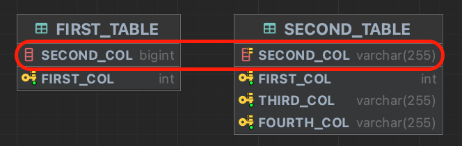

> 서비스에 장애를 일으킨 이유를 재현해보고 정리하기 위해 작성한다.  
> [`mysql docs` EXPLAIN 출력 형식](https://dev.mysql.com/doc/refman/5.7/en/explain-output.html#explain-join-types)

# 문제 분석



|FIR.FIRST_COL|FIR.SECOND_COL|SEC.FIRST_COL|SEC.SECOND_COL|
|:---:|:---:|:---:|:---:|
1|20230330|1|20230330|
| ... | ... | ... | ... |
1|20230330|10|20230330|
2|20231231|11|20231231|
| ... | ... | ... | ... |
2|20231231|20|20231231|

두 테이블을 `SECOND_COL` 기준으로 `INNER JOIN`을 사용하여 `SECOND_TABLE`의 데이터들을 가져와야한다.  
`FIRST_TABLE`의 `SECOND_COL`은 **bigint**  
`SECOND_TABLE`의 `SECOND_COL`은 **varchar**이며, 인덱스를 지정한 것을 볼 수 있다.  
- `FIRST_TABLE`에 2건, `SECOND_TABLE`에 20건이 있으며, 두 테이블의 관계는 **1(bigint):N(varchar)** 이다.
- 기대하는 결과는 `SECOND_TABLE`의 **탐색 row수가 10건이 나와야한다.**

```sql
explain
select COUNT(*)
from FIRST_TABLE FIR inner join
     SECOND_TABLE SEC
on FIR.SECOND_COL = SEC.SECOND_COL
where FIR.FIRST_COL = 1

# 조인 순서를 바꿔도 결과는 동일하게 20건을 모두 검색한다.
EXPLAIN
select COUNT(*)
from SECOND_TABLE SEC inner join
     FIRST_TABLE FIR
     on SEC.SECOND_COL = FIR.SECOND_COL
where FIR.FIRST_COL = 1
```

|[id]|[select_type]|[table]|[partitions]|[type]|[possible_keys]|[key]|[key_len]|[ref]|[rows]|[filtered]|[Extra]|
|:---:|:---:|:---:|:---:|:---:|:---:|:---:|:---:|:---:|:---:|:---:|:---:|
|1|SIMPLE|FIR| |const|PRIMARY|PRIMARY|4|const|1|100|
|1|SIMPLE|SEC| |index|SECOND_COL_INDEX|SECOND_COL_INDEX|1023| |20|10|Using where; Using index|


- `id` : 질의문에 사용된 식별자 데이터
- **`select_type` : <span style="background-color:#fff5b1">SELECT 유형에 대해 설명, **SIMPLE**은 (UNION이나 서브쿼리를 사용하지 않은) 단순 SELECT**</span>
- `table` : 출력 테이블 이름
- **`type` : <span style="background-color:#fff5b1">조인 유형</span>**
  - **const** : 기본 키나 유니크 제약조건 컬럼을 기준으로 조회할 때, 최대 하나와 일치하는 행이 있다는 것 (매우 빠르다)
  - **index** : 해당 유형은 두 가지 방식으로 실행된다
    - 인덱스 트리만 스캔하며 `Extra`열에 인덱스 사용이 표시된다.
    - 인덱스 순서로 데이터 행을 조회하며 **전체 테이블 스캔이 수행된다.** `Extra`열에 인덱스 사용이 표시되지 않는다.
- `possible_keys` : 데이터를 찾기위해 선택할 수 있는 인덱스를 나타낸다.
  - 이 열은 `NULL`을 포함해서는 안된다
- **`key` : <span style="background-color:#fff5b1">실제로 선택한 인덱스</span>**
- `key_len` : 선택한 키의 길이
- `ref` : 인덱스와 비교한 열
- **`rows` : <span style="background-color:#fff5b1">검사할 행의 추정치</span>**
- `filtered` : 테이블 조건으로 필터링된 행의 비율
- **`Extra` : <span style="background-color:#fff5b1">이 쿼리를 해결하는 방법에 대한 추가 정보</span>**
  - **Using Where**
  - **Using index** : 행을 읽기 위해 추가 검색을 수행할 필요 없이 인덱스 트리의 정보만을 사용하여 검색한다.
  - **Using join buffer (Block Nested Loop)** (현재 상황에서는 표시되지 않지만 문제가 생겼을 당시 표현되었던 힌트)
    - Block Nested Loop 알고리즘을 사용하여, 이전 조인의 테이블을 조인 버퍼로 부분적으로 읽은 다음 해당 행을 버퍼에서 사용하여 현재 테이블과의 조인을 수행한다.  
    - EXPLAIN 출력의 이전 행에 있는 테이블의 키가 버퍼링되고 일치하는 행이 Using join buffer가 나타나는 행이 나타내는 테이블에서 일괄적으로 페치된다.

위의 내용을 보면 **FIRST 테이블은 기본 키가 사용되었고, SECOND 테이블은 인덱스가 사용되었다는 것을 알 수 있지만 `rows`가 20건인 것을 알 수 있다.**  

> MySQL은 필요에 따라 자동으로 문자열을 숫자로 변환하고 그 반대도 마찬가지입니다.  
> [`mysql docs` Type Conversion](https://dev.mysql.com/doc/refman/8.0/en/type-conversion.html)  

이 내용 말고는 **타입이 서로 다른 컬럼을 조인할 떄**에 대한 직접적인 내용을 찾지 못 했다.  
chatGPT에 따르면

> 서로 다른 타입의 컬럼을 조인하면 MySQL은 자동으로 데이터 타입을 변환하여 일치하게 만들려고 시도합니다. 그러나 이러한 자동 타입 변환이 예상치 못한 결과를 초래할 수 있으므로 주의해야 합니다.  
> 예를 들어, 하나의 테이블의 컬럼이 문자열이고 다른 테이블의 컬럼이 숫자라면, MySQL은 문자열을 숫자로 변환하려고 시도합니다.

# 서로 타입을 바꾸면?

위의 제목과 같이 타입을 바꿔서 해보면 결과는 예측할 수 없다는 것을 알 수 있다.  
`EXPLAIN`과 `EXPLAIN ANALYZE` 비교  
- [`dev mysql` EXPLAIN ANALYZE](https://dev.mysql.com/blog-archive/mysql-explain-analyze/)

<h3>1(bigint):N(varchar) Join 순서 상관 없음</h3>


|[type]|[possible_keys]|[key]|[key_len]|[ref]|[rows]|[filtered]|[Extra]|
|:---:|:---:|:---:|:---:|:---:|:---:|:---:|:---:|
|const|PRIMARY|PRIMARY|4|const|1|100|
|index|SECOND_COL_INDEX|SECOND_COL_INDEX|1023| |20|10|Using where; Using index|

```
-> Aggregate: count(0)  (cost=0.65 rows=1) (actual time=0.338..0.340 rows=1 loops=1)
    -> Filter: (SEC.SECOND_COL = '20230330')  (cost=0.45 rows=2) (actual time=0.178..0.296 rows=10 loops=1)
        -> Covering index scan on SEC using SECOND_COL_INDEX  (cost=0.45 rows=20) (actual time=0.139..0.216 rows=20 loops=1)
```

- cost 합 = 1.55
- 첫 번째 행을 가져오는 시간 합 = 0.655

<h3>1(varchar):N(bigint) FIRST_TABLE FIR inner join SECOND_TABLE SEC</h3>

|[type]|[possible_keys]|[key]|[key_len]|[ref]|[rows]|[filtered]|[Extra]|
|:---:|:---:|:---:|:---:|:---:|:---:|:---:|:---:|
|const|PRIMARY|PRIMARY|4|const|1|100|
|ref|SECOND_COL_INDEX|SECOND_COL_INDEX|9|const|10|100|Using where; Using index|

```
-> Aggregate: count(0)  (cost=2.81 rows=1) (actual time=0.264..0.265 rows=1 loops=1)
    -> Filter: ('20230330' = SEC.SECOND_COL)  (cost=1.81 rows=10) (actual time=0.138..0.224 rows=10 loops=1)
        -> Covering index lookup on SEC using SECOND_COL_INDEX (SECOND_COL='20230330')  (cost=1.81 rows=10) (actual time=0.118..0.182 rows=10 loops=1)
```

- cost 합 = 6.43
- 첫 번째 행을 가져오는 시간 합 = 0.52

<h3>1(varchar):N(bigint) SECOND_TABLE SEC inner join FIRST_TABLE FIR</h3>

|[type]|[possible_keys]|[key]|[key_len]|[ref]|[rows]|[filtered]|[Extra]|
|:---:|:---:|:---:|:---:|:---:|:---:|:---:|:---:|
|const|PRIMARY|PRIMARY|4|const|1|100|
|ref|SECOND_COL_INDEX|SECOND_COL_INDEX|9|const|1|100|Using where; Using index|

```
-> Aggregate: count(0)  (cost=0.45 rows=1) (actual time=0.518..0.521 rows=1 loops=1)
    -> Filter: (SEC.SECOND_COL = '20230330')  (cost=0.35 rows=1) (actual time=0.282..0.404 rows=10 loops=1)
        -> Covering index lookup on SEC using SECOND_COL_INDEX (SECOND_COL='20230330')  (cost=0.35 rows=1) (actual time=0.210..0.295 rows=10 loops=1)
```

- cost 합 = 1.15
- 첫 번째 행을 가져오는 시간 합 = 1.01

# 결론

타입이 서로 다른 컬럼을 조인했을 때 `Extra`에 `Using Index`가 출력되지만, 실제로는 20건을 모두 조회하는 것을 확인해보았으며,  
`1:N`관계에서 타입을 반대로 바꾸게 될 경우에는 10건만 조회하고, 조인 순서를 바꾸면 결과가 또 달라지는 것을 확인할 수 있다.  
MySQL의 내부 최적화를 통해 결과가 바뀌는 것이 아닐까 싶다.  
조사하면서 이해하기 힘든 부분이 많은만큼 **가능하면 예측할 수 없는 결과를 만들어내는 이런 경우는 사전에 예방하는게 좋을 것이다.**  