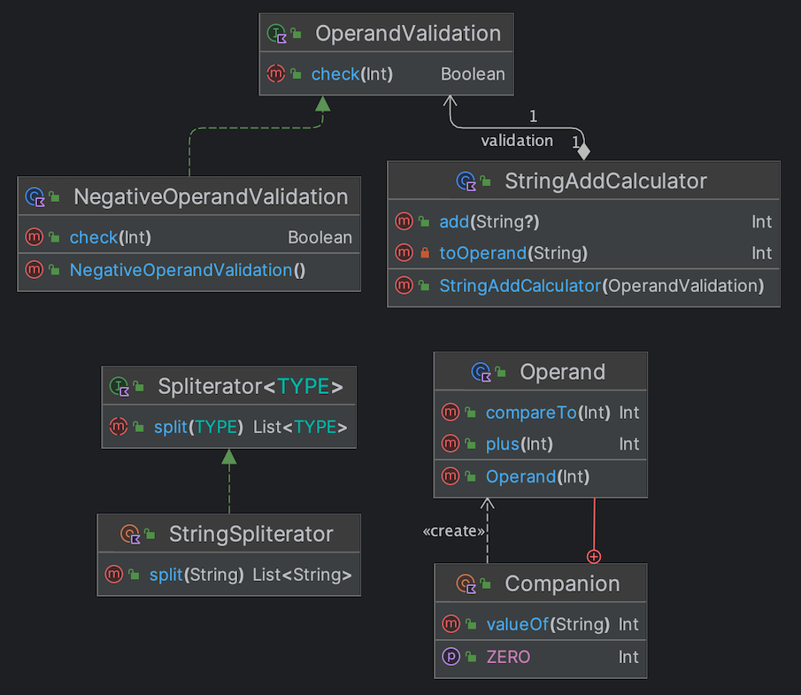
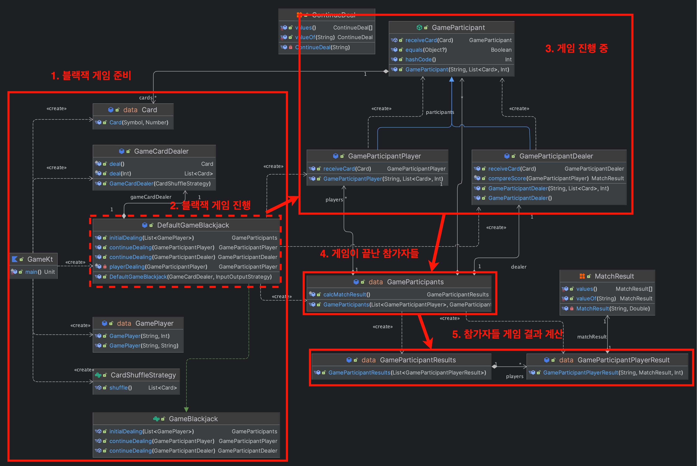
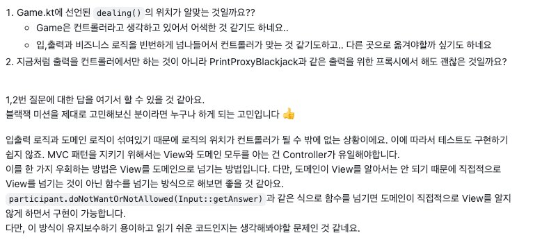
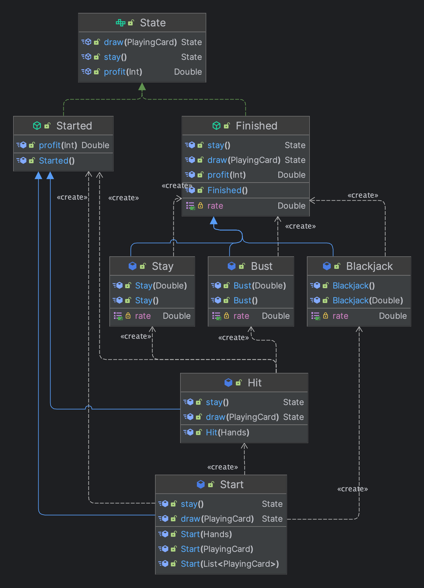
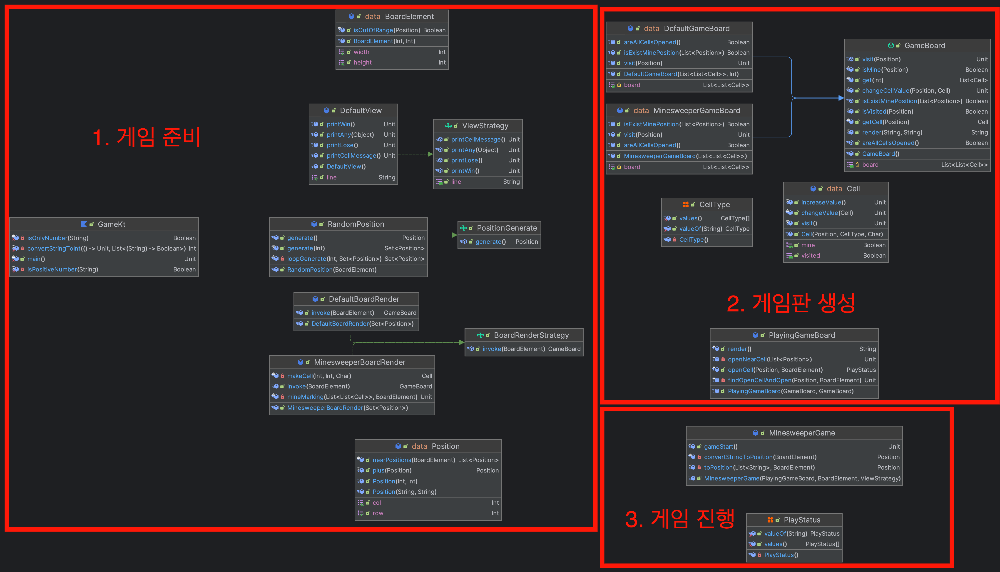

# TDD, 클린 코드 with Kotlin

이 교육은 코틀린과 클린코드(OOP, 컨벤션), TDD를 가르쳐준다.  
하지만 나는 코틀린과 클린코드만 배우기에도 벅차다고 생각하여 TDD는 신경쓰지 않았다 ㅎㅎ  
구현해야하는 미션 게임들을 보면 단순하다고 생각하여 쉽게 생각할 수도 있겠다.  
하지만 **단순히 돌아가는 구현과 OOP를 고민하며 구현하는 것은 하늘과 땅 차이다.**  
  
스스로 `"OOP가 무엇인지 대충 알고있다"` 라는 생각을 가지고 있었는데 [엘레강트 오브젝트](https://jdalma.github.io/2023y/bookReview/bookReview/#%EC%97%98%EB%A0%88%EA%B0%95%ED%8A%B8-%EC%98%A4%EB%B8%8C%EC%A0%9D%ED%8A%B8)를 같이 읽으면서 교육을 진행하다보니 OOP에 대해 굉장히 무지했다는 것을 깨달았다. ([더닝 크루거](https://namu.wiki/w/%EB%8D%94%EB%8B%9D%20%ED%81%AC%EB%A3%A8%EA%B1%B0%20%ED%9A%A8%EA%B3%BC#s-2)가 떠올랐다.)  
  
> 이따금 클래스를 “객체 템플릿”으로 부르는 것(예를 들면 위키피디아에서 그렇게 하고 있다)을 듣곤 한다.  
> 이 같은 정의는 정확하지 않은데, 이 정의에 따르면 클래스는 수동적인 위치에 있기 때문이다.  
> 이 정의는 누군가가 템플릿을 가지고 그것을 사용해 객체를 만들어낸다고 가정한다. 그럴 수도 있지만 엄밀히 말하자면 개념적으로 틀린 말이다.  
> 생성된 객체는 스스로 동작한다. 자신을 누가 만들었고 클래스에 형제 자매가 얼마나 더 있는지 알아서는 안 된다.  
  
클래스와 객체를 이야기할 때 대부분 `"붕어빵"`과 `"붕어빵을 찍어낼 수 있는 틀"` 정도로 설명한다.  
수동적이라는 인식이 큰데, 객체지향 프로그래밍에서 객체는 완전히 살아있는 유기체라고 생각해야 한다.  
  
> **알고리즘** 과 **실행** 대신 **객체** 와 **행동** 의 관점에서 사고해야한다.  
> 절차적인 프로그래밍과 OOP의 중요한 차이점은 **책임을 지는 주체가 무엇인가** 이다.  
> 우리는 그저 누가 누구인지만 정의하고 객체들이 필요할 때 **스스로** 상호작용하도록 제어를 위임하는 것이다.  
> 객체는 **살아있는 유기체** 이며, 다른 유기체들과 **의사소통** 하면서 그들의 작업을 지원하고, 다른 유기체들 역시 이 객체에게 도움을 받는다.  
> 이렇게 각 객체들은 서로를 필요로 하기 때문에 **결합된다는 것** 이다.  
  
객체는 어떻게 분리하고 협력하는지, 문맥은 어떻게 구성할지, 상태는 어디까지 공유하고 생명주기는 어디까지 해야할지 등 많은 고민들을 자동차 경주, 계산기, 로또, 블랙잭, 지뢰찾기 구현 미션들을 통해 고민해볼 수 있었다.  
그리고 각 미션마다 강조하는 디자인 패턴이나 핵심 지점들이 단계적으로 제공되었어서 보람도 단계적으로 느낄 수 있었던 것 같다.  
  
> "추상화를 통해 의미있는 의존성이 분리되었는지, 테스트가 가능해졌는지, 코드나 가독성이 좋아졌는지 등의 고민을 하면서 현준님만의 기준을 찾아보셔도 좋을거 같습니다!"
  
이번 교육과 엘레강트 오브젝트 책을 통해 OOP에 대한 주관적인 기준이 생겼고 OOP에 대한 무지함을 깨달았으며, 본격적인 OOP를 공부할 준비가 된 것 같다는 느낌이 든다.  
완벽한 설계는 없으니 완벽하게 구현하려 욕심부리지말고 스스로 정도를 정해가면서 꾸준한 리팩토링을 통해 개선해나가는 것이 효과적이다라는 것을 느꼈다.  
  
개발하다보면 다른 사람이 작성한 코드를 보고 평가하면서 오만한 자세를 가지기 쉬운데 겸손해지는 빠른 방법은 이런 교육을 통해 리뷰를 받아보는것이지 않을까 싶다.  
이 교육은 금액도 꽤 나가는데 미션이 힘든만큼 완주하지 못하는 교육생들도 많다. 이번 기수 교육생이 총 66명인데, 지뢰찾기 게임까지 완료한 사람이 20명도 안돼 보인다.  
  
1. 한 모듈의 간단한 수정이 이와 관계없는 모듈을 통해 시스템 전역으로 퍼져 나가거나 다른 곳의 무언가를 깨뜨리는 경우
2. 수정하는 부분이 시스템에 어떤 영향을 미칠지 몰라 코드의 수정이 두려운 경우
3. 변경 사항에 어디가 영향을 받는지 파악하고 있는 사람이 없어서 결국 모든 사람이 참석해야 하는 회의
4. 서비스 레이어에 모든 비즈니스 로직을 절차지향적으로 작성하거나 연쇄 메서드 호출이 습관인 경우
  
위의 경우에 해당한다면 이 교육을 추천하고 싶다.  

***

# 자동차 경주

```
경주할 자동차 이름을 입력하세요(이름은 쉼표(,)를 기준으로 구분).
pobi,crong,honux
시도할 횟수는 몇 회인가요?
5

실행 결과
pobi : -
crong : -
honux : -

pobi : --
crong : -
honux : --

pobi : ---
crong : --
honux : ---

pobi : ----
crong : ---
honux : ----

pobi : -----
crong : ----
honux : -----

pobi, honux가 최종 우승했습니다.
```  
  
**1단계**: 환경 세팅  
**2단계**: 문자열 계산기 [리뷰](https://github.com/next-step/kotlin-racingcar/pull/1315)  
**3단계**: 자동차 경주 구현 [리뷰](https://github.com/next-step/kotlin-racingcar/pull/1381)  
**4단계**: 자동차 경주 우승자 기능 추가 [리뷰](https://github.com/next-step/kotlin-racingcar/pull/1440)  
**5단계**: 자동차 경주 리팩토링 [리뷰](https://github.com/next-step/kotlin-racingcar/pull/1473)  
  
자동차 경주는 우테캠 프리코스에서 한 번 해본 경험도 있었고 기능 자체는 간단하여 쉬울 줄 알았지만.. 여전히 책임을 나누는 것이 쉽지 않았다.  

> 자동차 경주 첫 구현


> 자동차 경주 마지막 구현


처음 작성한 것에 비해 미션이 끝날 때의 (기능이 추가되긴 했지만) 다이어그램을 보면 책임이 더 분리된 것을 확인할 수 있다.  
이번 미션의 핵심은 **랜덤 기능** 을 최대한 밖으로 끌어내어 주입할 지점을 찾고 **I/O 기능과 비즈니스를 분리하며 개발하는 것** 
이다.  
  
1. 코틀린 클래스는 프로퍼티, 초기화 블록, 부 생성자, 함수, 동반 객체 순으로 작성하는 것이 컨벤션이다.
2. 계층간 "결과 객체"인 DTO를 추가하여 결합도를 낮출 수 있었다.
3. 비즈니스 로직과 IO 로직이 혼재해 있었는데, 중간 DTO를 추가하니 책임과 역할이 더 잘 보였다.
4. DIP를 잘 지켜내면서 개발하면 테스트가 쉽다.
5. 랜덤 기능과 같이 테스트가 불가능한 기능은 최대한 외부로 밀어내라. 또한 추상화를 통해 가짜 객체를 주입하여 테스트 할 수 있도록 작성해라.
6. 예측하지 못하거나, 비정상적인 오류인 경우에는 예외로 처리하지만 그 외는 null 또는 예외 타입으로 표현할 수 있도록 해라.
7. `"You Aren't Gonna Need It"` 지금 당장 필요하지 않은 설계나 기능은 작성하지 마라.
8. data class는 equals와 hashCode, copy가 필요하다면 사용하는 것이다. 기능이 있다고 이상하게 생각하지마라.
9.  스마트 캐스트를 의식하라.
10. 클래스 이름이 Order라면 orderShip()보다는 짧게 ship()이라고 하면 클라이언트에서는 order.ship()라고 호출하며, 간결한 호출의 표현이 된다.
11. [효과적인 이름짓기](https://remotty.github.io/blog/2014/03/01/hyogwajeogin-ireumjisgi/)
12. 코틀린은 기본적으로 프로퍼티 기반인 것을 명심해라.
  
어떤 경우에는 과하게 분리하여 불필요한 주입을 받도록 작성하기도 하고, 분리하여 주입이 필요한 부분을 알아차리지 못하고 많은 책임을 가지도록 작성하기도 했다.  
특히 검증하는 부분을 외부에서 주입받도록 계속 작성한 것 같다.. 책임이 적절히 잘 나눠진 클래스는 테스트하기가 굉장히 쉬웠다.  
대표적으로 `RandomRacingRule`이 잘 나눠졌다고 생각한다.  
  
1. 추상화된 게임 규칙 구현 클래스
2. 추상화된 랜덤 번호 생성기 주입받아 위임
3. 게임 규칙의 조건에 필요한 정보를 주입받아 활용

이와 같이 적절하게 분리되어 있어 **랜덤 기능** 과 **게임 규칙 조건** 에 대한 테스트 작성이 수월했다.  
  
> "응집도가 높고 견고한 클래스에는 적은 수의 메서드와 상대적으로 더 많은 수의 생성자가 존재한다."  
> "생성자의 주된 임무는 제공된 인자를 사용해서 캡슐화된 프로퍼티를 초기화하는 것이고, 메서드의 수가 많을수록 SRP을 위반할 확률이 높지만 생성자는 많을수록 클라이언트가 유연하게 사용할 수 있다."  

***

# 문자열 덧셈 계산기와 로또

이번 미션은 4단계로 이루어져 있다.  

<h3>1단계. 문자열 덧셈 계산기</h3>
  
1. [x] 쉼표 또는 콜론을 구분자로 가지는 문자열을 입력하는 경우 구분자를 기준으로 분리하여 숫자들의 합을 반환
   -  [x] 공백이라면 0을 반환한다.
2. [x] 문자열 앞부분의 "//"와 "\n" 사이에 위치하는 문자를 커스텀 구분자로 사용한다.
3. [x] 문자열 계산기에 숫자 이외의 값 또는 음수가 입력된 경우 "런타임 예외"를 던진다. 



1. `<TYPE> -> List<TYPE>`을 반환하는 Spliterator 인터페이스
2. 기본 구분자와 커스텀 구분자 기준으로 분리하는 (Spliterator를 구현하는) `유틸리티 StringSpliterator`
3. `피연산자` 를 값 클래스로 래핑
4. `피연산자` 검증 인터페이스
5. 검증 인터페이스를 구현한 `음수 검증기`
6. 검증기를 주입받는 `문자열 계산기`

StringSpliterator를 유틸리티로 사용하였는데 유틸리티 클래스는 유익하지 않으니 문자열 계산기에 검증기와 같이 주입하는 것도 괜찮을 것 같다.  
  
<h3>로또</h3>

```
구입금액을 입력해 주세요.
14000

수동으로 구매할 로또 수를 입력해 주세요.
3

수동으로 구매할 번호를 입력해 주세요.
8, 21, 23, 41, 42, 43
3, 5, 11, 16, 32, 38
7, 11, 16, 35, 36, 44

수동으로 3장, 자동으로 11개를 구매했습니다.
[8, 21, 23, 41, 42, 43]
[3, 5, 11, 16, 32, 38]
[7, 11, 16, 35, 36, 44]
[1, 8, 11, 31, 41, 42]
[13, 14, 16, 38, 42, 45]
[7, 11, 30, 40, 42, 43]
[2, 13, 22, 32, 38, 45]
[23, 25, 33, 36, 39, 41]
[1, 3, 5, 14, 22, 45]
[5, 9, 38, 41, 43, 44]
[2, 8, 9, 18, 19, 21]
[13, 14, 18, 21, 23, 35]
[17, 21, 29, 37, 42, 45]
[3, 8, 27, 30, 35, 44]

지난 주 당첨 번호를 입력해 주세요.
1, 2, 3, 4, 5, 6
보너스 볼을 입력해 주세요.
7

당첨 통계
---------
3개 일치 (5000원)- 1개
4개 일치 (50000원)- 0개
5개 일치 (1500000원)- 0개
5개 일치, 보너스 볼 일치(30000000원) - 0개
6개 일치 (2000000000원)- 0개
총 수익률은 0.35입니다.(기준이 1이기 때문에 결과적으로 손해라는 의미임)
```
    
<h3>로또 구현 목록</h3>

1. [x] 구입금액을 입력 받는다.
   - 정수만 입력 가능하다.
   - 잘못된 입력 또는 천원 단위가 아니라면 IllegalArgumentException을 던진다.
2. [x] 구입금액의 1000원 단위로 로또를 구매한다.
   - 로또 번호는 1부터 45까지 존재한다.
   - 6개의 번호를 선택하여 1개의 로또를 구매한다.
3. [x] 구매한 로또를 출력한다.
   - "[%d, %d, ..]" 형식으로 출력한다.
4. [x] 지난 주 담청 번호를 입력 받는다.
   - "%d, %d, %d" 형식으로 입력한다.
5. [x] 입력 받은 당첨 번호 기준으로 당첨 금액과 당첨된 로또의 개수를 출력한다.
   - ```
     3개 일치 (5000원)- 1개
     4개 일치 (50000원)- 0개
     5개 일치 (1500000원)- 0개
     6개 일치 (2000000000원)- 0개
     ```
6. [x] 수익률을 계산하여 출력한다.
   - `총 수익률은 0.35입니다.(기준이 1이기 때문에 결과적으로 손해라는 의미임)`
7. [x] 보너스 볼을 입력받는다.
   - 정수 한 자리
8. [x] 당첨 결과에서 보너스 볼에 대한 결과도 출력한다.
9. [x] 수동으로 구매할 로또 수를 입력 받는다.
   - 수동으로 구매할 로또 수는 입력 받은 구입 금액을 넘을 수 없다.
10. [x] 수동으로 구매할 수만큼 로또 번호를 입력 받는다.
11. [x] 로또를 자동과 수동을 구분해서 구매한다.
12. [x] 로또 결과를 자동과 수동을 구분하여 출력하고 수익률을 함께 계산한다.
  
**2단계**: 로또(자동) [리뷰](https://github.com/next-step/kotlin-lotto/pull/845)  
**3단계**: 로또(2등) [리뷰](https://github.com/next-step/kotlin-lotto/pull/900)  
**4단계**: 로또(수동) [리뷰](https://github.com/next-step/kotlin-racingcar/pull/1440)  
  

  
일련의 과정은 위와 같다.  
중요한 점은 각 과정 사이에서 결합도를 낮추고 있는 **1번** 과 **3번** 이다.  
  
**1번** 은 구매자와 로또 가게에 대한 결합도를 낮추고 있다. `LottoShop`은 `LottoPurchase`에 대해서만 의존한다.  
**3번** 은 로또 구매와 로또 당첨금 확인 및 통계에 대한 결합도를 낮추고 있다. `LottoMachine`은 `LottoWinningNumber`와 `LottoWinningResult`에 대해서만 의존한다.  
이렇게 중간 DTO를 잘 활용하면 책임과 역할을 잘 구분할 수 있다.  
  
로또를 구현하면서 놓쳤던 부분들이 있다.  

<h4>로또 당첨 등수를 결정하는 함수에 대한 책임</h4>

2등은 보너스 볼이 맞았는지 확인해야 하는 것처럼 다른 등수를 확인하는 방법과 다르다.  
`LottoRank` 내부에서 직접 확인하는 것으로 구현했지만 아래와 같은 피드백이 왔다.  
  
> "어떤 랭크인지에 대한 판단을 지금 상위객체(LottoRank)에서 직접 평가하고 있어요."  
> "이렇게되면 상위 객체에서 하위 인스턴스를 모두 파악해야하고 하나의 함수에서 여러 인스턴스 타입에 대해 알고 종속되버리기에 유 연하지 못한 코드가 됩니다."  
> "실제로 지금 이 로직에서 또 여러 조건들의 로또들이 추가되거나 랭크가 기획이 추가되면 로직 변경이 까다로워지겠죠?"  

`LottoRank`는 enum이니 유틸리티 클래스처럼 생각하여 직접 확인하여도 무방하다고 생각했다.  

> "열거타입은 결국 하나의 최상위 불변 인터페이스이고, 하위 속성들이 이 인터페이스를 구현한 구현체 인스턴스라고 할 수 있습니다"

`LottoRank`의 하위 속성들이 직접 당첨이 되었는지 각자 확인하도록 책임을 전가해야 했다. 이 생각을 하지 못한 이유가 열거타입과 하위 속성을 분리해서 생각해본적이 없었기 때문이다.  

```kotlin
typealias MatchedPredicate = (LottoWinningResult) -> Boolean

enum class LottoRank(val prize: Int, val matchedPredicate: MatchedPredicate ) {
   FIRST(2_000_000_000) { it.matchCount == 6 },
   SECOND(30_000_000) { it.matchCount == 5 && it.isBonus == true }, 
   ...

    companion object {
        fun valueOf(lottoWinningResult: LottoWinningResult): LottoRank =
            entries.find { it.matchPredicate(lottoWinningResult) } ?: MISS
    }
}
```


<h3>Lotto를 이루는 일급 컬렉션의 네이밍과 역할에 대한 결정</h3>

||AS-IS|TO-BE|
|------|---|---|
|로또 번호|LottoNumber|LottoNumber|
|로또 (한 줄)|LottoLine|Lotto|
|여러 개의 로또|Lotto|Lottos|

```java
// AS-IS
Lotto(
   lines: List<LottoLine>
)
LottoLine(
   numbers: List<LottoNumber>
)

// TO-BE
Lottos(
   auto: List<Lotto>,
   manual: List<Lotto>
)
Lotto(
   numbers: List<LottoNumber>
)
```

리뷰어님과 서로 생각하는 단위가 달라서 아마 리뷰어님이 이해하기 힘드셨지 않을까 싶다..  
나는 `"한 개의 로또 라인이 여러 개로 이루어져 한 개의 로또를 구성한다"`라는 것이고, 리뷰어님은 `"한 개의 로또가 여러 로또를 구성한다."` 라는 것이다.  
나름 이유를 대자면 실제로 한 개의 로또에 5개까지 구매할 수 있으니 여기서는 5개라는 제한이 없고 그냥 `"복수의 LottoLine은 5개를 초과하여도 Lotto를 구성한다"`라는 생각이였다.  
  
하지만 이렇게보니 리뷰어님의 제안이 더 이해하기 쉬운 것 같다.  

<h3>플라이웨이트 패턴</h3>

로또를 구매할 때 마다 항상 새로운 `LottoNumber`를 생성하였다.  
하지만 피드백을 통해 모든 로또는 똑같은 `LottoNumber`를 보유하도록 미리 초기화를 해놓았다.  

```kotlin
@JvmInline
value class LottoNumber private constructor(
    private val number: Int
) {
   companion object {
      private val LOTTO_NUMBER_RANGE = IntRange(1, 45)
      private val LOTTO_NUMBERS: Map<Int, LottoNumber> = LOTTO_NUMBER_RANGE.associateWith(::LottoNumber)

      fun from(value: Int): LottoNumber = LOTTO_NUMBERS[value] 
         ?: throw IllegalArgumentException("[입력:$value] 1에서 45사이의 정수만 허용됩니다.")

      fun random() : LottoNumber = from(LOTTO_NUMBER_RANGE.random())
   }
   ...
}
```

일급 객체인 로또 번호를 [플라이웨이트 패턴](https://inpa.tistory.com/entry/GOF-%F0%9F%92%A0-Flyweight-%ED%8C%A8%ED%84%B4-%EC%A0%9C%EB%8C%80%EB%A1%9C-%EB%B0%B0%EC%9B%8C%EB%B3%B4%EC%9E%90)을 적용하여 재활용을 통한 메모리 사용을 최적화할 수 있다.  

<h3>그 외</h3>

1. [일급 객체](https://inpa.tistory.com/entry/CS-%F0%9F%91%A8%E2%80%8D%F0%9F%92%BB-%EC%9D%BC%EA%B8%89-%EA%B0%9D%EC%B2%B4first-class-object)와 추상화 사이에서의 고민
2. JvmInline과 value class를 활용한 최적화
3. 리스코프 치환 원칙을 위반한 예제
4. 상속이 문제가 아니라 **상속을 잘 활용하는 것이 문제** 다.
5. 코틀린에서 Int와 Integer를 처리하는 방법과 Int의 캐싱 범위
6. 백킹 프로퍼티를 활용하여 객체 내부에서는 Mutable하게 외부로는 Immutable하게 사용하고, 방어적 복사를 적용할 수 있다.
7. `List(size: Int, init: (index: Int) -> T)` 같은 가짜 생성자나 생성자를 여러 개 선언하는 것은 클래스를 유연하게 사용할 수 있도록 도와준다.
8. `by` 키워드를 통해 다른 클래스의 기능을 편리하게 위임할 수 있는 장점이 있지만 모든 기능이 열리는 단점도 있다.
9. [우아한객체지향 by 조영호](https://www.youtube.com/watch?v=dJ5C4qRqAgA&ab_channel=%EC%9A%B0%EC%95%84%ED%95%9C%ED%85%8C%ED%81%AC)
10. [Spring Batch를 더 우아하게 사용하기 - Spring Batch Plus](https://d2.naver.com/helloworld/9879422)
11. [type safe builders](https://kotlinlang.org/docs/type-safe-builders.html)

***

# 블랙잭

```
게임에 참여할 사람의 이름을 입력하세요.(쉼표 기준으로 분리)
pobi,jason

pobi의 배팅 금액은?
10000

jason의 배팅 금액은?
20000

딜러와 pobi, jason에게 2장의 나누었습니다.
딜러: 3다이아몬드
pobi카드: 2하트, 8스페이드
jason카드: 7클로버, K스페이드

pobi는 한장의 카드를 더 받겠습니까?(예는 y, 아니오는 n)
y
pobi카드: 2하트, 8스페이드, A클로버
pobi는 한장의 카드를 더 받겠습니까?(예는 y, 아니오는 n)
n
jason은 한장의 카드를 더 받겠습니까?(예는 y, 아니오는 n)
n
jason카드: 7클로버, K스페이드

딜러는 16이하라 한장의 카드를 더 받았습니다.

딜러 카드: 3다이아몬드, 9클로버, 8다이아몬드 - 결과: 20
pobi카드: 2하트, 8스페이드, A클로버 - 결과: 21
jason카드: 7클로버, K스페이드 - 결과: 17

## 최종 수익
딜러: 10000
pobi: 10000 
jason: -20000
```

<h3>블랙잭 구현 목록</h3>

- [x] 게임에 참여할 사람의 이름을 입력받는다.
   - 쉼표 기준으로 분리한다.
- [x] 플레이어에게 각각 2장의 카드를 나눠준다.
   - 플레이어들에게 나눠준 카드를 `{이름} 카드: {카드}, {카드}, ...` 형식으로 출력한다.
- [x] 각 플레이어들은 가진 카드의 합이 21을 초과하지 않는다면 카드를 계속 뽑을 수 있다.
   - 카드를 뽑는다면 결과를 `{이름} 카드: {카드}, {카드}, ...` 형식으로 출력한다. 
   - 카드를 뽑는 순서는 앞의 사용자가 끝나야 다음 사용자가 뽑을 수 있다.
   - 21이 초과한 상태에서 뽑는다면 다음 사용자로 넘어가도록 할 것이다.
- [x] 사용자들이 모든 결정을 하였다면 결과를 출력한다.
   - `{이름} 카드: {카드}, {카드}, ... - 결과: {합계}` 형식으로 출력한다.
- [x] 딜러도 게임에 참여하며 딜러의 점수가 16이하이면 한 장의 카드를 추가로 받는다.
- [x] 딜러가 21을 초과하면 플레이어가 가지고 있는 패에 상관없이 승리한다.
- [x] 게임을 완료한 후 각 플레이어별로 승패를 출력한다.
- [x] 게임 참가자들의 베팅 금액을 입력받는다.
- [x] 블랙잭이라면 배팅 금액의 1.5배를 받고 나머지는 승패에 따라 수익을 계산한다.
- [x] 최종 수익에서 베팅 결과를 출력한다.
  
**1단계**: 코틀린 DSL [리뷰](https://github.com/next-step/kotlin-blackjack/pull/592)  
**2단계**: 블랙잭 [리뷰](https://github.com/next-step/kotlin-blackjack/pull/620)  
**3단계**: 블랙잭(딜러 역할 추가) [리뷰](https://github.com/next-step/kotlin-blackjack/pull/635)  
**4단계**: 블랙잭(베팅 기능 추가) [리뷰](https://github.com/next-step/kotlin-blackjack/pull/660)  
**5단계**: 상태 추상화 [코드](https://github.com/jdalma/kotlin-blackjack/tree/refactor/src/main/kotlin/blackjack/state)  
  
이번 미션의 핵심은 블랙잭 게임을 진행하는 동안 **게임 상태를 어떻게 객체지향적으로 설계하는 것** 이다.  
일단 내가 설계한 흐름을 보면




  
**1번 블랙잭 게임 준비** 는 카드 셔플 전략과 셔플 전략을 사용하여 카드를 분배하는 딜러, 딜러를 가지는 블랙잭 게임과 게임 플레이어들을 생성하는 책임들을 가진다. 생성한 블랙잭 게임을 통해 게임을 진행한다.  
**2번 블랙잭 게임 진행** 은 딜러와 입출력 전략을 받아 뷰와 도메인을 연결해주는 역할과 게임을 진행하는 역할을 동시에 가진다.  
**3번 게임 진행 중** 은 플레이어가 카드를 계속 받는지에 대한 입,출력과 비즈니스 로직을 빈번하게 넘나들어야만 했기에 꼬리 재귀를 통해 공유되는 문맥(스택)의 정보를 최소화하여 반복적으로 받도록 하였고 비즈니스 로직에서 입,출력에 대한 구현체를 주입받아 문제를 해결했다.  
**4번과 5번에서 게임이 끝난 참가자들을 승패, 수익률을 계산** 한다.  
  
플레이어가 **게임 진행 중인 상태** 는 GameParticipant 추상 클래스를 구현하는 Player와 Dealer로 표현하였고,  
**게임이 끝난 상태** 를 GameParticipants 클래스로 표현하였고,  
**게임 결과를 계산한 상태** 를 GameParticipantPlayerResult 클래스로 표현하였다.  
그리고 게임 결과를 계산할 때 점수 비교는 아래와 같이 분기문으로 해결하였다.  

```kotlin
class GameParticipantDealer(
   name: String = NAME,
   cards: List<Card> = emptyList(),
   betAmount: Int = 0
) : GameParticipant(name, cards, betAmount) {

   fun compareScore(player: GameParticipantPlayer): MatchResult {
      val playerScore = player.getScore()
      val dealerScore = this.getScore()
      return if (player.isBust || this.isBlackjack()) MatchResult.LOSS
      else if (player.isBlackjack()) MatchResult.BLACKJACK
      else if (this.isBust) MatchResult.WIN
      else if (dealerScore < playerScore) MatchResult.WIN
      else if (playerScore < dealerScore) MatchResult.LOSS
      else MatchResult.DRAW
   }

   ...
}
```

위에서 나열한 상태와 점수 비교를 **객체지향의 다형성을 통하여 해결할 수 있는 방법이 이번 과제의 핵심이다.**  
하지만 분기문이 항상 나쁘다고 봐야할지는 생각해봐야 할 문제다.  
  
> **Q** 게임 결과를 판단할 때 조건문의 순서에 많이 의존되는데.. 다른 작업자가 볼때 이 의도를 파악하기 힘들 것 같다고 생각됐습니다.  
> 테스트 코드로 설명을 대체할 수 있을 것 같기도 한데 설계의 방법으로 순서에 대한 강조를 어떻게 표현할 수 있을까요??  
> **A** 순서에 관해서는 저도 고민을 많이 해봤는데 블랙잭의 승패를 정하는 룰 자체가 이미 너무 길기 때문에 이를 다른 방식으로 표현하거나 쪼개서 표현하는 것 자체가 더 알아보기 어려운 것 같더라구요.  
>  순서가 존재 + 두 객체를 비교하는 경우에는 그냥 한 메서드에 로직을 쭉 나열하는 것보다 알기 쉬운 방법이 없더라구요

리뷰어님의 의견에 동의하기도 한다. 항상 디자인 패턴과 추상화가 옳다고 말할 수 있는지는 모르겠다.  
하지만 학습에 중점을 두어야하니 **상태를 다형성으로 해결하는 방법을 알아보자**  
  
<h3>객체지향의 다형성을 이용해 조건문 줄이기</h3>

기존에는 상태가 서로 다른 클래스로 표현되며 점수 비교는 여러 분기문으로 작성되어 있었다.  



**게임 내 규칙을 객체로 추상화** 하였다.  

```kotlin
interface State {
   fun draw(card: PlayingCard): State
   fun stay(): State
   fun profit(money: Int): Double
}

abstract class Finished : State {

   protected abstract val rate: Double

   override fun draw(card: PlayingCard): State {
      throw IllegalStateException()
   }

   override fun stay(): State {
      throw IllegalStateException()
   }

   override fun profit(money: Int): Double = money * rate
}

abstract class Started : State {

   override fun profit(money: Int): Double {
      throw IllegalStateException()
   }
}
```

클라이언트는 블랙잭 게임 상태의 자세한 구현을 전혀 알 필요가 없다.  
클라이언트는 사용자가 `draw`나 `stay`를 선택하기만 하면 내부에서 상태는 자동으로 계산된다.  
상태 전이표(행에서 열로 전이)는 아래와 같다.  
  
||Start|Hit|Stay|Blackjack|Bust|
|:---:|:---:|:---:|:---:|:---:|:---:|
|Start|-|O|X|O|X
|Hit|X|O|O|X|O|X|
|Stay|X|X|-|X|X|
|Blackjack|X|X|X|-|X|
|Bust|X|X|X|X|-|
  
1. 시작(Start): 카드 2장을 받고 있는 상태 (2장을 다 받으면 다음 상태로 바로 전이한다.)
2. 힛(Hit): 처음 2장의 상태에서 카드를 더 뽑는 것
3. 스테이(Stay): 카드를 더 뽑지 않고 차례를 마치는 것
4. 블랙잭(Blackjack): 처음 두 장의 카드 합이 21인 경우, 베팅 금액의 1.5배
5. 버스트(Bust): 카드 총합이 21을 넘는 경우. 배당금을 잃는다.
  
`Started` 추상 클래스를 구현하는 Start와 Hit는 수익률을 계산할 수 없는 **게임 진행 중인 상태** 를 표현한다.  
`Finished` 추상 클래스를 구현하는 Stay와 Bust, Blackjack은 카드를 더 받거나 받지않는다는 선택을 할 수 없는 상태이다. **게임이 끝난 상태** 를 표현한다.  
이 두 개의 추상 클래스를 아우르는 `State` 인터페이스가 해당 타입들을 추상화하였다.  
  
이 구현에서 두 개의 디자인 패턴이 활용되었는데 내부에서 상태를 변경하는 **상태 패턴** 과 `draw`,`stay`,`profit`에 대한 중복되는 처리를 **템플릿 메서드 패턴** 으로 해결하였다.  
  
<h3>그 외</h3>

1. 수신 객체 지정 람다를 이용한 Kotlin DSL
2. Builder들의 책임과 비즈니스 로직에서 사용할 값 객체의 책임
   - 1단계 예제에서 PersonBuilder 내부 필드를 한 번에 초기화 하는 것이였는데 Skill과 Language 빌더들이 너무 더럽다고 느꼈지만 제이슨님은 PersonBuilder 자체가 더러움을 책임지는 객체라고 생각하셨다.
   - 비즈니스 로직에서 관심가지는 것은 값 객체에 대한 정보(프로퍼티)이기 때문에 각 data class들이 불변 필드들을 가질 수 있도록 각 Builder이 가변 필드들을 소유하는것은 문제가 안된다.
3. 모든 플레이어들이 카드를 요청하여 받는 부분에서 `출력 → 입력 → 카드 배분 → 출력` 흐름을 따르는 부분이 입출력 로직과 비즈니스 로직을 문맥에 맞게 넘나들도록 해야하기 때문에 힘들었다.
   - 딜러가 추가되면서 카드 배분 받는 로직은 달라지지만 출력되는 부분은 같은 게임 플레이어로 인식해야하는 점
   - 핵심은 딜러가 추가되면서 기존 플레이어와 중복되는 코드를 어떻게 제거할 것인가? abstract class? interface? sealed class? sealed interface? 이 방법들의 차이는 무엇이고 어떤 기준으로 사용하는가?
   - sealed class와 interface는 내부 라이브러리를 개발하는 상황과 같이 확장을 제한할 떄는 유용하지만 일반적인 상황에서는 유의미한가 싶다. [참고](https://kotlinlang.org/docs/sealed-classes.html)

***

# 지뢰찾기

```
높이를 입력하세요.
10

너비를 입력하세요.
10

지뢰는 몇 개인가요?
10

지뢰찾기 게임 시작
open: 1, 1
0 1 C C C C C C C C
0 1 C C C C C C C C
0 1 C C C C C C C C
1 1 C C C C C C C C
C C C C C C C C C C
C C C C C C C C C C
C C C C C C C C C C
C C C C C C C C C C
C C C C C C C C C C
C C C C C C C C C C

open: 4, 1
Lose Game.
```

<h3>지뢰찾기 구현 목록</h3>

1. [x] 게임판의 높이와 너비, 지뢰 개수를 입력받는다.
2. [x] 게임판을 만든다.
3. [x] 입력받은 지뢰 개수만큼 지뢰를 생성하며 위치는 랜덤이다.
4. [x] 지뢰찾기 게임판을 만든다.
   - 지뢰 주변의 셀 숫자를 증가시킨다.
5. [x] 셀 위치를 반복적으로 입력 받는다.
   - 입력받은 위치는 `,`로 구분되어야 하고 2개의 정수이어야 하며 높이와 너비를 초과해서는 안된다.
6. [x] 입력받은 위치의 셀을 연다.
   - [x] 주변에 지뢰가 존재하지 않는 셀(0인 셀)이라면 반복해서 주변의 셀을 연다.
   - [x] 주변에 지뢰가 존재하는 셀이라면 선택한 셀만 열린다.
   - [x] 선텍한 셀이 지뢰라면 게임은 끝난다.
  
**1단계**: 지뢰 찾기 (그리기) [리뷰](https://github.com/next-step/kotlin-minesweeper/pull/367)  
**2단계**: 지뢰 찾기 (지뢰 개수) [리뷰](https://github.com/next-step/kotlin-minesweeper/pull/378)  
**3단계**: 지뢰 찾기 (게임 실행) [리뷰](https://github.com/next-step/kotlin-minesweeper/pull/396)  
**4단계**: 지뢰 찾기 (리팩터링) [리뷰](https://github.com/next-step/kotlin-minesweeper/pull/419)  
  


**1. 게임 준비** 단계에서는 게임판 높이와 너비, 지뢰 생성 전략, 게임에 사용되는 게임판 생성 전략, IO 전략을 준비한다.  
**2. 게임판 생성** 게임을 진행하는 동안 사용자 게임판과 관리자 게임판을 관리하는 책임을 가진 `PlayingGameBoard`을 생성한다.  
**3. 게임 진행** 게임에 사용될 게임판인 `PlayingGameBoard`와 플레이어 IO를 책임지는 `ViewStrategy`를 보유하는 `MinesweeperGame`을 통해 게임을 진행한다.  
처음에는 컨트롤러 역할을하는 Game 클래스가 게임판을 준비하고 플레이어 IO와 게임 진행을 하는 책임을 모두 가지고 있었다.  
해당 의존성을 아래처럼 분리했다.  
```
                                          ➚ DefaultGameBoard extends GameBoard
Game → MinesweeperGame → PlayingGameBoard
                                          ➘ MinesweeperGameBoard extends GameBoard
```
  
다이어그램을 통해 알 수 있듯이 책임 사이사이에 구현체에 직접 의존하지 않고 인터페이스에 의존하도록 구현했다.  
게임을 진행하는동안 플레이어의 입출력을 담당할 로직도 `MinesweeperGame`에 `ViewStrategy`를 주입하여 결합도를 낮추도록 하였다.
지뢰 위치를 기억하는 관리자 게임판과 플레이어가 사용하는 게임판을 같은 타입으로 구분하기 위해 추상 클래스 `GameBoard` 추가하였다.  
  
미션을 진행하면서 엘레강스 오브젝트의 [퍼블릭 상수를 사용하지 마라](https://jdalma.github.io/2023y/bookReview/bookReview/#%EC%97%98%EB%A0%88%EA%B0%95%ED%8A%B8-%EC%98%A4%EB%B8%8C%EC%A0%9D%ED%8A%B8)가 떠올랐다.  
책임이 너무 많다고 인지할 수 있는 힌트 3가지가 있다는 것을 느꼈다.  
- 상수의 개수
- 파라미터의 개수
- 프로퍼티의 개수

상수를 private으로 선언하지 못하거나 한 클래스에 private 상수가 많은것도 힌트라고 보인다.

<h3>지뢰 주변 셀들 값 증가시키기</h3>

플레이어가 특정 셀을 열었을 때 해당 셀의 주변 8방향 셀 주변에 지뢰가 없다면 연쇄적으로 셀을 열어야 할 필요가 있었다.  
그래서 지뢰찾기 게임판을 생성할 때 지뢰 주변의 셀들을 1씩 증가시켜서 게임판을 생성하는 관리자 게임판 Render가 있다.  
이때 기준 셀의 주변 8방향 셀의 위치를 반환하는 기능을 **게임판의 높이와 너비를 가지는 `BoardElement`** 에 구현할지, **셀의 위치를 가지는 `Position`** 에 구현할지 고민했다.  
  
`BoardElement`는 게임판의 높이와 너비를 이미 가지고 있기 때문에 IndexOutOfBounds 예외를 피할 수 있다.  
하지만 문맥상 `Position` 클래스가 맞는 것 같아 `Position`에 구현했다.  

```kotlin
class MinesweeperBoardRender(
    private val mines: Set<Position>
): BoardRenderStrategy {

    override fun invoke(boardElement: BoardElement): GameBoard {
        val board = List(boardElement.width) { col ->
            List(boardElement.height) { row ->
                makeCell(col, row, INIT_CELL_NUMBER)
            }
        }

        mineMarking(board, boardElement)
        return MinesweeperGameBoard(board)
    }

    private fun makeCell(col: Int, row: Int, value: Char): Cell {
        val position = Position(col, row)
        val type = if (mines.contains(position)) CellType.MINE else CellType.NORMAL
        return Cell(position, type, value)
    }

    private fun mineMarking(board: List<List<Cell>>, boardElement: BoardElement) {
        mines.forEach { mine ->
            mine.nearPositions(boardElement)
                .forEach { if (!board[it.col][it.row].isMine()) board[it.col][it.row].increaseValue() }
        }
    }
    ...
}

data class Position(
    val col: Int,
    val row: Int
) {
    constructor(col: String, row: String): this(col.toInt() - 1, row.toInt() - 1)
    operator fun plus(other: Position) = Position(this.col + other.col, this.row + other.row)

    fun nearPositions(boardElement: BoardElement): List<Position> =
        NEAR_POSITIONS.map { this + it }
            .filter { !boardElement.isOutOfRange(it) }

    companion object {
        private val NEAR_POSITIONS = arrayOf(
            Position(0, -1),
            Position(1, -1),
            Position(1, 0),
            Position(1, 1),
            Position(0, 1),
            Position(-1, 1),
            Position(-1, 0),
            Position(-1, -1)
        )
    }
}
```
  
