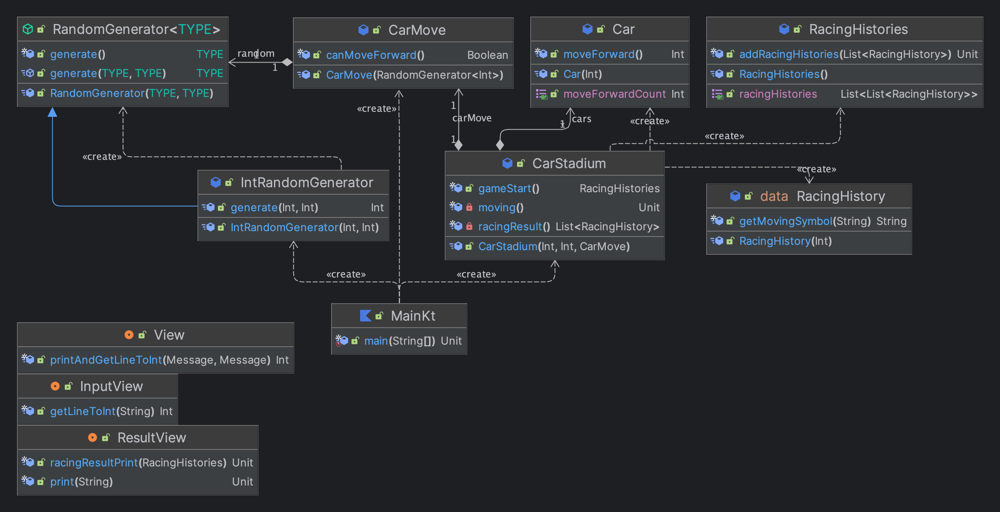
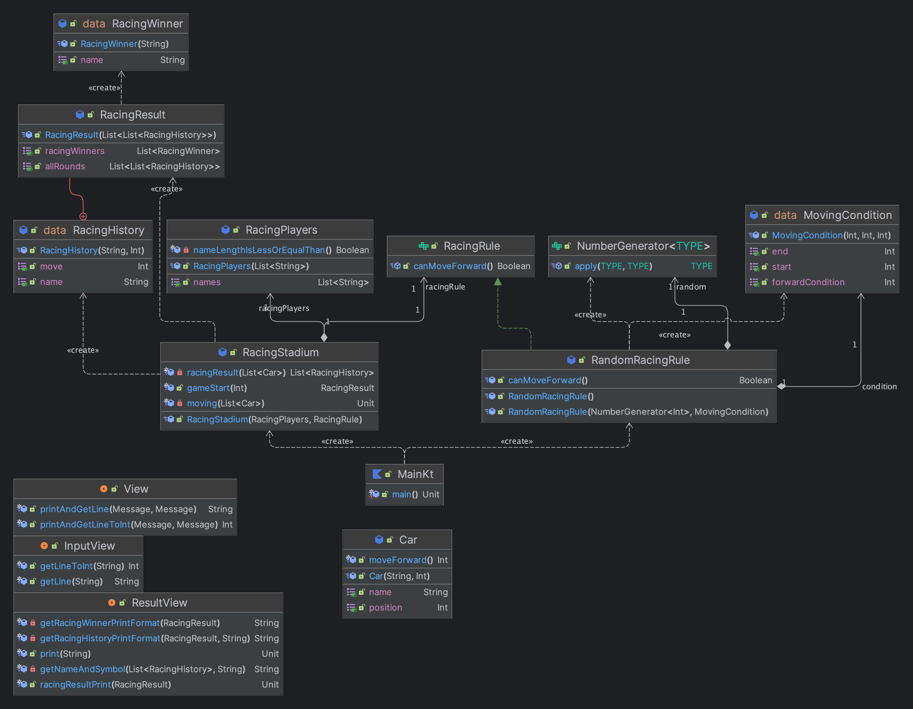

# TDD, 클린 코드 with Kotlin

> "객체지향 프로그래밍 언어를 사용하여 모든 코드를 클래스에 넣기만 하면 그것이 바로 객체지향 프로그래밍이라고 생각하지만 절차지향 프로그래밍 스타일로 작성한 경우가 대부분일 것이다."  
> 디자인 패턴의 아름다움에서

Controller,Service, 영속성 계층을 제외하고 도메인 클래스들을 최대 몇 개까지 나눠본 적이 있는지 생각해보면 Service들을 조립해서 사용하려고 하지 클래스들한테 책임을 준 적이 있었나 싶다.  
대부분 Service를 분리하며 책임을 잘 나눴다고 스스로 합리화를 해왔던 것 같기도하다.  

## 1주차

> 응집도가 높고 견고한 클래스에는 적은 수의 메서드와 상대적으로 더 많은 수의 생성자가 존재한다.  
> 생성자의 주된 임무는 제공된 인자를 사용해서 캡슐화된 프로퍼티를 초기화하는 것이고, 메서드의 수가 많을수록 SRP을 위반할 확률이 높지만 생성자는 많을수록 클라이언트가 유연하게 사용할 수 있다.  
  
1주차는 5단계로 이루어져 있었다.
  
**1단계**: 환경 세팅  
**2단계**: [문자열 계산기](https://github.com/next-step/kotlin-racingcar/pull/1315)  
**3단계**: [자동차 경주 구현](https://github.com/next-step/kotlin-racingcar/pull/1381)  
**4단계**: [자동차 경주 우승자 기능 추가](https://github.com/next-step/kotlin-racingcar/pull/1440)  
**5단계**: [자동차 경주 리팩토링](https://github.com/next-step/kotlin-racingcar/pull/1473)  
  
자동차 경주는 우테캠 프리코스에서 한 번 해본 경험도 있었고 기능 자체는 간단하지만 여전히 책임을 나누는 것이 쉽지 않았다.  
그리고 코틀린을 코틀린스럽게 작성하는 것에 익숙하지 않다는 것을 느꼈다.  
  
> 3단계

> 5단계

(5단계 까지 기능이 추가되긴 했지만) 다이어그램을 보면 네이밍과 책임이 더 분리된 것을 확인할 수 있다.  
이번 과제를 진행하면서 느낀점은 아래와 같다.  
  
1. 계층간 "결과 객체"인 DTO를 추가하여 결합도를 낮출 수 있었다.
2. 비즈니스 로직과 IO 로직이 혼재해있었는데, 중간 DTO를 추가하니 책임과 역할이 더 잘 보였다.
3. DIP를 잘 지켜내면 작성하면 테스트가 쉽다.
4. 랜덤 기능과 같이 테스트가 불가능한 기능은 최대한 외부로 밀어내라. 또한 추상화를 통해 가짜 객체를 통해 테스트 할 수도 있다.
5. 백킹 필드를 고려해라.
6. 예측하지 못하거나, 비정상적인 오류인 경우에는 예외로 처리하지만 그 외는 null로 표현할 수 있도록 해라.
7. "You Aren't Gonna Need It"
  
이제 2주차 부터 TDD를 진행하기 위해서는 **요구 사항 분석 및 설계** 가 필수이다.  
과제를 진행하면서 README에 **구현할 기능 목록을 작성하여** 해당 기능들을 한 개씩 TDD로 진행해봐야겠다.  
구현할 기능 목록을 작성하고 고민되는 지점을 시각화하는 것 자체가 이미 훈련이다.  