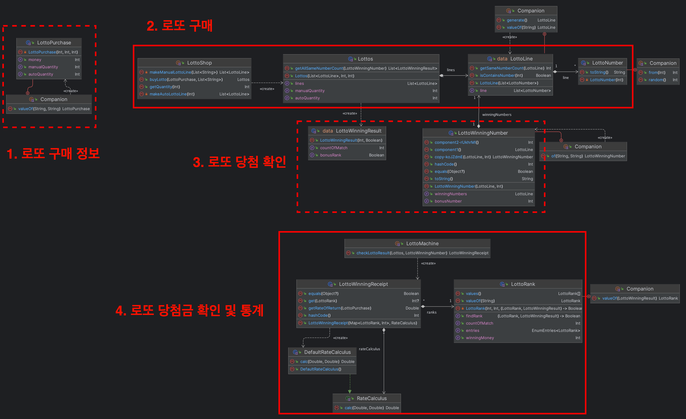

# TDD, 클린 코드 with Kotlin

> "객체지향 프로그래밍 언어를 사용하여 모든 코드를 Service 클래스에 몰아 넣고 객체지향 프로그래밍이라고 생각하지만 절차지향 프로그래밍 스타일로 작성한 경우가 대부분일 것이다."  
> 디자인 패턴의 아름다움에서


OOP에 대한 감을 잡기가 힘들다.. 이 책임은 누구한테 주고 협력은 어떻게 하고 어떤 역할을 부여할지 결정하는 것이 어렵다.  

> "추상화를 통해 의미있는 의존성이 분리되었는지, 테스트가 가능해졌는지, 코드나 가독성이 좋아졌는지 등의 고민을 하면서 현준님만의 기준을 찾아보셔도 좋을거 같습니다!"

위의 조언처럼 스스로 고민을 많이 해봐야겠다.

## 자동차 경주
  
자동차 경주 미션은 5단계로 이루어져 있다.  
  
**1단계**: 환경 세팅  
**2단계**: 문자열 계산기 [리뷰](https://github.com/next-step/kotlin-racingcar/pull/1315)  
**3단계**: 자동차 경주 구현 [리뷰](https://github.com/next-step/kotlin-racingcar/pull/1381)  
**4단계**: 자동차 경주 우승자 기능 추가 [리뷰](https://github.com/next-step/kotlin-racingcar/pull/1440)  
**5단계**: 자동차 경주 리팩토링 [리뷰](https://github.com/next-step/kotlin-racingcar/pull/1473)  
  
자동차 경주는 우테캠 프리코스에서 한 번 해본 경험도 있었고 기능 자체는 간단하여 쉬울 줄 알았지만.. 여전히 책임을 나누는 것이 쉽지 않았다.  
  
> 자동차 경주 첫 구현


> 자동차 경주 마지막 구현


처음 작성한 것에 비해 미션이 끝날 때의 (기능이 추가되긴 했지만) 다이어그램을 보면 책임이 더 분리된 것을 확인할 수 있다.  
이번 미션의 핵심은 **랜덤 기능** 을 최대한 밖으로 끌어내어 주입할 지점을 찾고 **I/O 기능과 비즈니스를 분리하며 개발하는 것** 
이다.  
  
1. 코틀린 클래스는 프로퍼티, 초기화 블록, 부 생성자, 함수, 동반 객체 순으로 작성하는 것이 컨벤션이다.
2. 계층간 "결과 객체"인 DTO를 추가하여 결합도를 낮출 수 있었다.
3. 비즈니스 로직과 IO 로직이 혼재해 있었는데, 중간 DTO를 추가하니 책임과 역할이 더 잘 보였다.
4. DIP를 잘 지켜내면서 개발하면 테스트가 쉽다.
5. 랜덤 기능과 같이 테스트가 불가능한 기능은 최대한 외부로 밀어내라. 또한 추상화를 통해 가짜 객체를 주입하여 테스트 할 수 있도록 작성해라.
6. 예측하지 못하거나, 비정상적인 오류인 경우에는 예외로 처리하지만 그 외는 null 또는 예외 타입으로 표현할 수 있도록 해라.
7. `"You Aren't Gonna Need It"` 지금 당장 필요하지 않은 설계나 기능은 작성하지 마라.
8. data class는 equals와 hashCode, copy가 필요하다면 사용하는 것이다. 기능이 있다고 이상하게 생각하지마라.
9.  스마트 캐스트를 의식하라.
10. 클래스 이름이 Order라면 orderShip()보다는 짧게 ship()이라고 하면 클라이언트에서는 order.ship()라고 호출하며, 간결한 호출의 표현이 된다.
11. [효과적인 이름짓기](https://remotty.github.io/blog/2014/03/01/hyogwajeogin-ireumjisgi/)
12. 코틀린은 기본적으로 프로퍼티 기반인 것을 명심해라.
  
어떤 경우에는 과하게 분리하여 불필요한 주입을 받도록 작성하기도 하고, 분리하여 주입이 필요한 부분을 알아차리지 못하고 많은 책임을 가지도록 작성하기도 했다.  
특히 검증하는 부분을 외부에서 주입받도록 계속 작성한 것 같다.. 책임이 적절히 잘 나눠진 클래스는 테스트하기가 굉장히 쉬웠다.  
대표적으로 `RandomRacingRule`이 잘 나눠졌다고 생각한다.  
  
1. 추상화된 게임 규칙 구현 클래스
2. 추상화된 랜덤 번호 생성기 주입받아 위임
3. 게임 규칙의 조건에 필요한 정보를 주입받아 활용

이와 같이 적절하게 분리되어 있어 **랜덤 기능** 과 **게임 규칙 조건** 에 대한 테스트 작성이 수월했다.  
  
> "응집도가 높고 견고한 클래스에는 적은 수의 메서드와 상대적으로 더 많은 수의 생성자가 존재한다."  
> "생성자의 주된 임무는 제공된 인자를 사용해서 캡슐화된 프로퍼티를 초기화하는 것이고, 메서드의 수가 많을수록 SRP을 위반할 확률이 높지만 생성자는 많을수록 클라이언트가 유연하게 사용할 수 있다."  

## 로또

2주차는 4단계로 이루어져 있다.  

**1단계**: 문자열 덧셈 계산기  
**2단계**: 로또(자동) [리뷰](https://github.com/next-step/kotlin-lotto/pull/845)  
**3단계**: 로또(2등) [리뷰](https://github.com/next-step/kotlin-lotto/pull/900)  
**4단계**: 로또(수동) [리뷰](https://github.com/next-step/kotlin-racingcar/pull/1440)  
  
<h3>문자열 덧셈 계산기</h3>
  


1. `<TYPE> -> List<TYPE>`을 반환하는 Spliterator 인터페이스
2. 기본 구분자와 커스텀 구분자 기준으로 분리하는 (Spliterator를 구현하는) `유틸리티 StringSpliterator`
3. `피연산자` 를 값 클래스로 래핑
4. `피연산자` 검증 인터페이스
5. 검증 인터페이스를 구현한 `음수 검증기`
6. 검증기를 주입받는 `문자열 계산기`

StringSpliterator를 유틸리티로 사용하였는데 유틸리티 클래스는 유익하지 않으니 문자열 계산기에 검증기와 같이 주입하는 것도 괜찮을 것 같다.  
  
<h3>로또</h3>


  
일련의 과정은 위와 같다.  
중요한 점은 각 과정 사이에서 결합도를 낮추고 있는 **1번** 과 **3번** 이다.  
  
**1번** 은 구매자와 로또 가게에 대한 결합도를 낮추고 있다. `LottoShop`은 `LottoPurchase`에 대해서만 의존한다.  
**3번** 은 로또 구매와 로또 당첨금 확인 및 통계에 대한 결합도를 낮추고 있다. `LottoMachine`은 `LottoWinningNumber`와 `LottoWinningResult`에 대해서만 의존한다.  
이렇게 중간 DTO를 잘 활용하면 책임과 역할을 잘 구분할 수 있다.  
  
로또를 구현하면서 놓쳤던 부분들이 있다.  

<h4>로또 당첨 등수를 결정하는 함수에 대한 책임</h4>

2등은 보너스 볼이 맞았는지 확인해야 하는 것처럼 다른 등수를 확인하는 방법과 다르다.  
`LottoRank` 내부에서 직접 확인하는 것으로 구현했지만 아래와 같은 피드백이 왔다.  
  
> "어떤 랭크인지에 대한 판단을 지금 상위객체(LottoRank)에서 직접 평가하고 있어요."  
> "이렇게되면 상위 객체에서 하위 인스턴스를 모두 파악해야하고 하나의 함수에서 여러 인스턴스 타입에 대해 알고 종속되버리기에 유 연하지 못한 코드가 됩니다."  
> "실제로 지금 이 로직에서 또 여러 조건들의 로또들이 추가되거나 랭크가 기획이 추가되면 로직 변경이 까다로워지겠죠?"  

`LottoRank`는 enum이니 유틸리티 클래스처럼 생각하여 직접 확인하여도 무방하다고 생각했다.  

> "열거타입은 결국 하나의 최상위 불변 인터페이스이고, 하위 속성들이 이 인터페이스를 구현한 구현체 인스턴스라고 할 수 있습니다"

`LottoRank`의 하위 속성들이 직접 당첨이 되었는지 각자 확인하도록 책임을 전가해야 했다. 이 생각을 하지 못한 이유가 열거타입과 하위 속성을 분리해서 생각해본적이 없었기 때문이다.  

```kotlin
typealias MatchedPredicate = (LottoWinningResult) -> Boolean
enum class LottoRank(val prize: Int, val matchedPredicate: MatchedPredicate ) {
   FIRST(2_000_000_000) { it.matchCount == 6 },
   SECOND(30_000_000) { it.matchCount == 5 && it.isBonus == true }, 
   ...

    companion object {
        fun valueOf(lottoWinningResult: LottoWinningResult): LottoRank =
            entries.find { it.matchPredicate(lottoWinningResult) } ?: MISS
    }
}
```


<h3>Lotto를 이루는 일급 컬렉션의 네이밍과 역할에 대한 결정</h3>

||AS-IS|TO-BE|
|------|---|---|
|로또 번호|LottoNumber|LottoNumber|
|로또 (한 줄)|LottoLine|Lotto|
|여러 개의 로또|Lotto|Lottos|

```java
// AS-IS
Lotto(
   lines: List<LottoLine>
)
LottoLine(
   numbers: List<LottoNumber>
)

// TO-BE
Lottos(
   auto: List<Lotto>,
   manual: List<Lotto>
)
Lotto(
   numbers: List<LottoNumber>
)
```

리뷰어님과 서로 생각하는 단위가 달라서 아마 리뷰어님이 이해하기 힘드셨지 않을까 싶다..  
나는 `"한 개의 로또 라인이 여러 개로 이루어져 한 개의 로또를 구성한다"`라는 것이고, 리뷰어님은 `"한 개의 로또가 여러 로또를 구성한다."` 라는 것이다.  
나름 이유를 대자면 실제로 한 개의 로또에 5개까지 구매할 수 있으니 여기서는 5개라는 제한이 없고 그냥 `"복수의 LottoLine은 5개를 초과하여도 Lotto를 구성한다"`라는 생각이였다.  
  
하지만 이렇게보니 리뷰어님의 제안이 더 이해하기 쉬운 것 같다.  

<h3>로또 번호 일급 객체 캐싱</h3>

로또를 구매할 때 마다 항상 새로운 `LottoNumber`를 생성하였다.  
하지만 피드백을 통해 모든 로또는 똑같은 `LottoNumber`를 보유하도록 미리 초기화를 해놓았다.  

```kotlin
@JvmInline
value class LottoNumber private constructor(
    private val number: Int
) {
    companion object {
        private val LOTTO_NUMBER_RANGE = IntRange(1, 45)
        private val LOTTO_NUMBERS: Map<Int, LottoNumber> = LOTTO_NUMBER_RANGE.associateWith(::LottoNumber)

        fun from(value: Int): LottoNumber = LOTTO_NUMBERS[value] ?: throw IllegalArgumentException("[입력:$value] 1에서 45사이의 정수만 허용됩니다.")
        
        fun random() : LottoNumber = from(LOTTO_NUMBER_RANGE.random())
    }
    ...
}
```

<h3>그 외</h3>

1. [일급 객체](https://inpa.tistory.com/entry/CS-%F0%9F%91%A8%E2%80%8D%F0%9F%92%BB-%EC%9D%BC%EA%B8%89-%EA%B0%9D%EC%B2%B4first-class-object)와 추상화 사이에서의 고민
2. JvmInline과 value class를 활용한 최적화
3. 리스코프 치환 원칙을 위반한 예제
4. 상속이 문제가 아니라 **상속을 잘 활용하는 것이 문제** 다.
5. 코틀린에서 Int와 Integer를 처리하는 방법과 Int의 캐싱 범위
6. 백킹 프로퍼티를 활용하여 객체 내부에서는 Mutable하게 외부로는 Immutable하게 사용하고, 방어적 복사를 적용할 수 있다.
7. `List(size: Int, init: (index: Int) -> T)` 같은 가짜 생성자나 생성자를 여러 개 선언하는 것은 클래스를 유연하게 사용할 수 있도록 도와준다.
8. `by` 키워드를 통해 다른 클래스의 기능을 편리하게 위임할 수 있는 장점이 있지만 모든 기능이 열리는 단점도 있다.
9. [우아한객체지향 by 조영호](https://www.youtube.com/watch?v=dJ5C4qRqAgA&ab_channel=%EC%9A%B0%EC%95%84%ED%95%9C%ED%85%8C%ED%81%AC)
10. [Spring Batch를 더 우아하게 사용하기 - Spring Batch Plus](https://d2.naver.com/helloworld/9879422)
11. [type safe builders](https://kotlinlang.org/docs/type-safe-builders.html)

## 블랙잭

1. 수신 객체 지정 람다를 이용한 Kotlin DSL
2. Builder들의 책임과 비즈니스 로직에서 사용할 값 객체의 책임
   1. 마지막 주차 1단계 예제에서 PersonBuilder 내부 필드를 한 번에 초기화 하는 것이였는데 Skill과 Language 빌더들이 너무 더럽다고 느꼈지만 제이슨님은 PersonBuilder 자체가 더러움을 책임지는 객체라고 생각하셨다.
   2. 비즈니스 로직에서 관심가지는 것은 값 객체에 대한 정보이기 때문에 각 data class들이 불변 필드들을 가지고 있는것에 만족하셨다.
1. 모든 플레이어들이 카드를 요청하여 받는 부분에서 `출력 → 입력 → 카드 배분 → 출력` 흐름을 따르는 부분이 입출력 로직과 비즈니스 로직을 문맥에 맞게 넘나들도록 해야하기 때문에 힘들었다.
   1. 딜러가 추가되면서 카드 배분 받는 로직은 달라지지만 출력되는 부분은 같은 게임 플레이어로 인식해야하는 점
   2. 핵심은 딜러가 추가되면서 기존 플레이어와 중복되는 코드를 어떻게 제거할 것인가? abstract class? interface? sealed class? sealed interface? 이 방법들의 차이는 무엇이고 어떤 기준으로 사용하는가?
2. 게임 내 규칙을 객체로 추상화하는법
   1. 힛(Hit): 처음 2장의 상태에서 카드를 더 뽑는 것
   2. 스테이(Stay): 카드를 더 뽑지 않고 차례를 마치는 것
   3. 블랙잭(Blackjack): 처음 두 장의 카드 합이 21인 경우, 베팅 금액의 1.5배
   4. 버스트(Bust): 카드 총합이 21을 넘는 경우. 배당금을 잃는다.


## 지뢰찾기

- GameBoardRenderer는 GameBoard를 생성하는 책임을 가지고 있게하여 렌더링 전략 인터페이스는 필요없어짐을 느꼈다
- 하지만 MinesweeperBoardRenderer를 추가하면서 Renderer를 추상화해야할까 고민했다. 그냥 콘크리트 클래스를 상속받을까? 아니면 인터페이스를 추가해서 수평적인 확장을 하도록할까?
- MinesweeperBoard는 기본 게임판과 다른 렌더링 과정을 거쳐야해서 필요한 정보들을 상태로 갸지고 있게 하도록 하기 위해 인터페이스를 선택함
- 콘크리트 클래스로 사용했
- 클래스를 정의할 때 필요한 정보를 상태로 가지게할지 인자로 넘겨 사용할지 고민되었다.

```kotlin
class MinesweeperBoard(
    private val gameBoard: GameBoard<Int>,
    private val mines: Mines
) {
    fun calculateAdjacentMineCounts() = mines.increaseNearCellNumbers(gameBoard)
}
```

- 하지만 이렇게 되면 `Mines` 내부에서 지뢰 주변의 셀을 1씩 증가시키기 때문에 `Mines`가 `GameBoard`의 구현체 타입에 대해 자세하게 알아야 하는 문제가 있다. 
- `Mines`는 `Position`의 집합일 뿐이고 지뢰 주변을 표시하는 책임은 `GameBoard`에게 있다고 판단했다.
- 그리고 특정 셀 주변 8방향을 계산해주는 책임은 `BoardDimensions`에서 `Position`으로 옮겼다. 잘 옮긴듯
