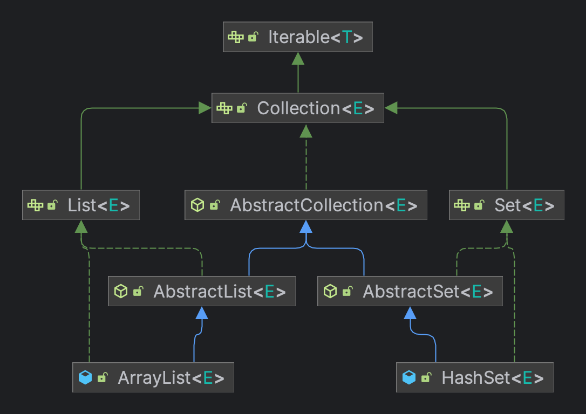
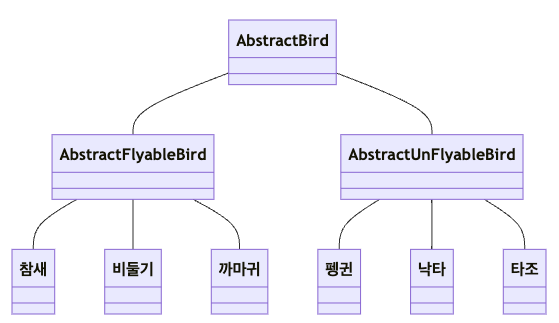
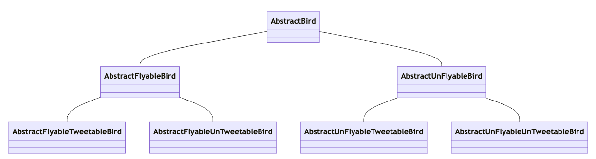
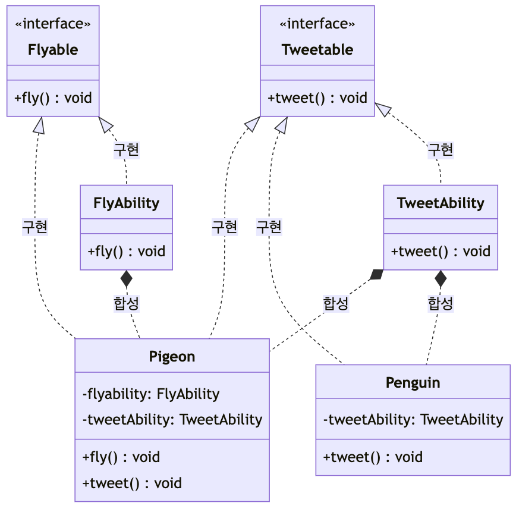
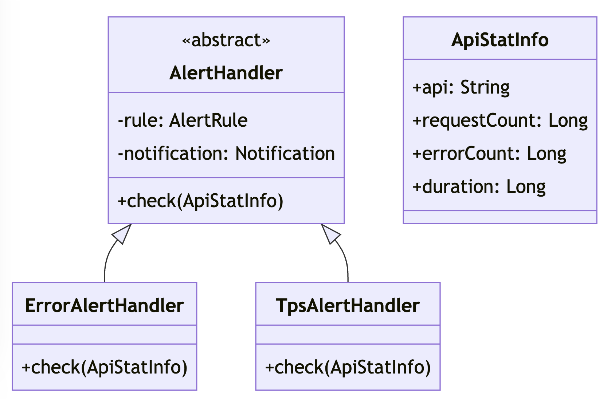
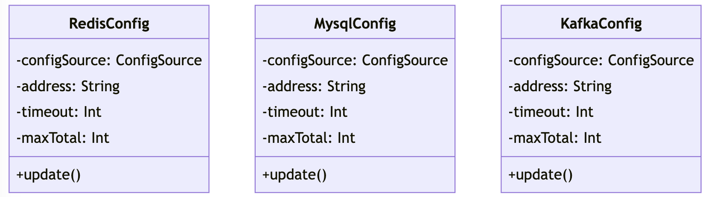

# 들어가기전에

> "소스 코드를 읽으면서 종종 그것이 어떤 의미인지 이해하지 못하는 경우가 있다. 사실 이런 문제의 원인은 매우 간단하다."  
> "코드를 완벽하게 이해하기 위해 **필요한 기본적인 기술적 소양과 능력이 부족하기 때문이다.**"  
> 디자인 패턴의 아름다움 1장
  
작성되어 있는 코드를 분석하다보면 나에게 생소한 디자인 패턴이 적용되어 있거나, 연속된 추상화 등등 이해가 힘들 때 `"복잡한 도메인,비즈니스를 많이 접해보지 못하고 기술적인 수준이 낮아서 그런건가?"`라는 생각을 한적이 있다.  
**좋은 코드를 보고 그 원리를 분석하여 내 것으로 만들고 싶어도 기술의 이해가 없다면 본질을 이해하지 못해 흡수는 커녕 작성자의 의도 조차 파악할 수 없을 것이다.**  
  
하지만 내가 좋은 코드를 보고 좋은 코드라고 판단할 수 있을까?  
좋은 코드를 판단하지 못하고, 좋은 코드를 작성하지 못하는 이유는 **어떤 코드가 고품질의 코드인지 알지 못하기 때문이다.**  
아래와 같은 질문을 어느정도로 생각하나?  
  
1. 계층화와 하위 모듈화 방법은 무엇인가?
2. 클래스를 어떻게 나누는 것이 좋은가?
3. 각 클래스에는 어떤 책임과 역할이 있는가?
4. 클래스 간의 상호 작용을 설계하는 방법, 메시지는 무엇인가?
5. 상속을 사용하는 것이 옳은가?
6. 인터페이스나 추상 클래스를 사용하는 것이 옳은가?
7. 상속과 합성 중 뭐가 옳은가?
8. 결합도가 높은 코드와 낮은 코드는 무엇인가?
9. 디커플링을 달성하는 방법은 무엇인가?
10. 싱글턴 패턴이나 정적 메서드를 사용하는 것이 옳은가?
11. 객체를 생성할 때 팩터리 패턴을 사용하는 것이 옳은가?
12. 가독성을 유지하면서 확장성을 향상하기 위해 디자인 패턴을 도입하는 방법은 무엇인가?
13. 어떤 종류의 코드가 확장과 유지관리에 용이한가?
  
> "컴퓨터가 이해할 수 있는 코드는 바보라도 작성할 수 있다. 훌륭한 프로그래머는 사람이 이해할 수 있는 코드를 작성한다." - 마틴 파울러

위에서 말하는 좋은 코드, 고품질 코드를 작성하기 위한 방법들에 대해 알아보자.  
대부분의 내용은 아래의 책과 영상, 글을 참고하였다.  
- [모던 자바 인 액션](https://www.yes24.com/Product/Goods/77125987)
- [디자인 패턴의 아름다움](https://product.kyobobook.co.kr/detail/S000202093794)
- [`KSUG` 대규모 엔터프라이즈 시스템 개선 경험기 - 1부 -](https://www.youtube.com/watch?v=UwAoUshVpgM&ab_channel=SpringCampbyKSUG)
- [`KSUG` 대규모 엔터프라이즈 시스템 개선 경험기 - 2부 -](https://www.youtube.com/watch?v=u_y6UGzOPUk&ab_channel=SpringCampbyKSUG)

***

# **객체지향 프로그래밍**

> 객체지향 프로그래밍의 프로그래밍 단위는 **클래스**또는 **객체**이고,  
> 절차지향 프로그래밍의 프로그래밍 단위는 **함수**이며,  
> 함수형 프로그래밍의 프로그래밍 단위는 **스테이트리스 함수**이다.
  
객체지향 프로그래밍은 `클래스의 관점`에서 생각해야 한다.  
처음부터 복잡한 프로세스를 메서드로 분해하는 대신 **어떻게 비즈니스 모델링을 할지 먼저 생각한 후 요구 사항을 클래스로 구성하고 클래스 간의 상호 작용을 설정**한다.  
객체지향 프로그래밍을 이해하기 위해서는 **캡슐화**, **추상화**, **상속**, **다형성**을 이해해야 한다.  
  
<h3>캡슐화</h3>

정보 은닉 또는 데이터 접근 보호라고도 하는데, **접근 가능한 인터페이스를 제한하여 클래스가 제공하는 메서드를 통해서만 내부 정보나 데이터에 대한 외부 접근을 허가하는 것을 뜻 한다.**  
객체 생성 시 값이 결정되며 불변 속성을 지키거나 어쩔 수 없이 속성을 수정해야 한다면 비즈니스 세부 정보를 지킬 수 있다.  
Getter,Setter를 남용하는 행위가 대표적인 안좋은 예다.  
  
클래스의 속성에 대한 접근을 제한하지 않으면 모든 코드가 클래스의 속성에 접근하고 값을 변경할 수 있게 된다.  
얼핏 이것이 더 유연하게 느껴지지만, **과도한 유연성은 제어할 수 없음을 의미하고 수정 로직이 코드의 모든 곳에 흩어져 가독성과 유지 관리 용이성에 문제를 끼친다.**  
그리고 클래스는 필요한 작업만 노출하는 제한된 메서드를 제공하여 클래스의 사용성을 향상 시킬 수 있다.  
  
<h3>추상화</h3>  

**메서드의 내부 구현을 숨기는 것을 의미한다.** `함수` 그 자체가 구현을 숨기는 추상화에 해당한다.  
따라서 클래스를 사용할 때 기능의 구현 방식에 대해 고민하지 않고, **메서드가 제공하는 기능에만 집중할 수 있다.**  
함수라는 문법을 통해 구현되기 때문에 **실제로 코드의 구현 내용은 그 자체로 추상화되는 함수의 내부에 포함된다.**  
**규칙과 구현의 분리**를 준수하여 코드의 결합 정도를 줄이고 코드의 확장성을 향상 시킬 수 있다.  
  
> 객체 지향과 도메인 주도 설계는 소프트웨어 설계에 **일관성과 맥락**을 부여한다.  
> **일관성과 맥락**은 추상화의 기본 재료이며, 추상화로부터 얻은 **모델**은 주요 관심사이다.  
> 모델은 소프트웨어에 **단순함**을 부여한다.
  
<h3>상속</h3>  

`고양이는 포유류의 일종이다.`처럼 클래스 사이의 `is-a`관계를 나타내는 데 사용된다.  
상속은 이해하기도 쉬우며 동일한 코드의 중복을 막아낼 수 있다.  
하지만 과도하게 사용할 경우, 상속 계층 구조가 너무 깊고 복잡하면 코드의 가독성과 유지 관리성이 급격하게 떨어지므로 유의해야 한다.  
  
<h3>다형성</h3>

여러가지 형태를 갖는 성질을 말하며 `수정에 대해 폐쇄적이고 확장에 대해 개방적`이라는 설계 원칙을 준수할 수 있다.  
**동일한 논리(같은 타입)를 재사용할 수 있어 코드의 재사용성을 향상 시킬 수 있다.**  
`동적 디스패치`를 통한 런타임 시점에 결정되는 행위를 다형성이라고 생각할 수 있다.    
  
다형성의 특성을 구현하기 위해
1. 상속과 메서드 재정의를 하는 방식
2. 인터페이스를 사용하여 합성하는 방식

Collection Framework의 `Iterable`을 통해 인터페이스를 사용하여 합성하는 방식을 확인해보자.  



```java
public static void main(String[] args) {
    List<String> list = new ArrayList<>();
    Set<String> set = new HashSet<>();

    System.out.println(list);
    System.out.println(set);
}
```

이렇게 Collection 하위 타입을 출력하게 되면 아래 코드의 구현체에 구현되어 있는 `Iterable`을 반환받아 출력받게 된다.  

```java
public abstract class AbstractCollection<E> implements Collection<E> {
    public String toString() {
        Iterator<E> it = iterator();
        // ...
    }
}

public class ArrayList<E> extends AbstractList<E>
        implements List<E>, RandomAccess, Cloneable, java.io.Serializable
{
    public Iterator<E> iterator() {
        return new Itr();
    }
    // ...
}

public class HashSet<E> extends AbstractSet<E>
    implements Set<E>, Cloneable, java.io.Serializable
{
    public Iterator<E> iterator() {
        return map.keySet().iterator();
    }
    // ...
}
```


## Getter와 Setter 남용

객체지향 프로그래밍 언어를 사용하여 모든 코드를 클래스에 넣기만 하면 그것이 바로 객체지향 프로그래밍이라고 생각하지만 절차지향 프로그래밍 스타일로 작성한 경우가 대부분일 것이다.  
예를 들어, 많은 비즈니스 로직을 `Service` 계층에 몰아넣고 객체지향이다 라고 말하는 것과 같이 말이다.  
대부분의 백엔드 개발자들은 (표현 계층, 논리 계층, 데이터 계층) MVC 아키텍처에 익숙하여 **빈약한 도메인 모델**을 의식하지 못하며 개발한다.  
  

- [이미지 출처](https://www.youtube.com/watch?v=u_y6UGzOPUk&ab_channel=SpringCampbyKSUG)

> 💡 **풍부한 도메인 모델**  
> 1. Service 클래스는 저장소 계층과 통신하여 도메인 모델을 만들어낸다.
> 2. Service 클래스는 여러 도메인 모델의 비즈니스 논리를 결합한다.
> 3. Service 클래스는 기능과 무관한 타 시스템과의 상호 작용을 담당한다.
  
**풍부한 도메인 모델**은 데이터와 비즈니스 논리가 하나의 클래스에 포함되며 전형적인 객체지향 프로그래밍에 속한다.  
즉, `Service`에 비즈니스 로직을 작성하는 것이 아니라 각 `도메인 모델`에 책임을 부여하는 것이다.  
이에 기반한 **DDD** 개발방식은 **비즈니스 시스템을 분리하고, 비즈니스 모듈을 분할하고, 비즈니스 도메인 모델과 상호 작용을 정의하는 방법을 설계할 때 사용된다.**  
DDD를 잘 하기 위한 핵심은 비즈니스에 익숙하지 않으면 합리적인 도메인 설계를 얻을 수 없기 때문에 DDD의 개념을 공부하고 익히는 것이 아니라 **비즈니스에 친숙해지는 것이다.**  
  
그리고 많은 백엔드 개발자들은 `Setter`는 열심히 막으려 하지만 `Getter`는 합리화한다. (나도 그렇다.)  
도메인 모델의 속성이 객체일 때 클라이언트 코드가 참조한다면 신경써야할 것이 많다.  
예를 들어, `Getter`를 통해 컬렉션 내에있는 객체를 수정한다면? 수정할 수 없는 불변 컬렉션이였지만 가변 컬렉션으로 캐스팅하여 수정한다면?  
**객체 전파**, **방어적 복사**, **앨리어싱 에러**들도 고려해야 한다.  
  
시스템이 복잡할수록 코드 재사용성과 유지 관리 용이성에 대한 요구 사항은 점점 높아지기 때문에 초기 설계에 더 많은 시간과 에너지를 투자하여 **풍부한 도메인 모델에 기반한 DDD 개발 방식에 익숙해져야 할 것이다.**  


<h4>객체지향과 절차지향? 풍부한 도메인 모델과 빈약한 도메인 모델?</h4>  

`항상 객체지향 프로그래밍과 풍부한 도메인 모델이 옳지만은 않다.`  
요구사항이 간단하고 전체적인 작업 흐름이 가지를 뻗어나가지 않고 고정된 형태를 띄는 경우에는 절차지향 프로그래밍이 적절할 수 있다.  
그리고 개발하는 시스템의 비즈니스가 비교적 단순할때는 굳이 복잡한 풍부한 도메인 모델을 설계하기 보다는 빈약한 도메인 모델이 더 적합하다.  
하지만 복잡한 시스템일때 많은 개발자들이 풍부한 도메인 모델을 쉽게 적용할 수 있진 않을 것이다.  
**풍부한 도메인 모델은 설계하기가 훨씬 까다롭고, 빈약한 도메인 모델을 기반으로 하는 전통적인 개발 방식은 수년 동안 사용되어 왔고 대부분의 개발자에게 단단하게 박혀 있기 때문에 쉽게 적용하기에는 힘들 것이다.**  
  
***

# **추상 클래스와 인터페이스, 상속과 합성**

개발하면서 추상화를 고민할 때 추상 클래스를 쓸지, 인터페이스를 쓸지 잠깐 고민하게 된다.  
하지만 항상 인터페이스를 쓰게 되는데 그 이유는 
1. 인터페이스도 구현 메서드를 가질 수 있다.
2. 다중 상속이 안되니 정말 강한 관계라고 의도를 표현해야 할 상황인지 판단하지 못 하는 경우가 많다.
3. 상태가 필요한 경우에는 상수 모듈로 관리하거나 외부에서 전략을 주입받을 수 있다.
4. 추상 클래스는 부모 클래스를 같이 초기화해야 한다.
5. 상속 단계가 깊어지는 것이 부담스럽다.
  
항상 추상 클래스를 배제하였지만, '디자인 패턴의 아름다움'을 읽고 생각이 조금 바뀌게 되어 정리하려 한다. 
  
클래스 상속의 관점에서 **추상 클래스는 상향식 설계 방식**이며 `is-a` 관계를 나타낸다.  
**인터페이스는 반대로 하향식 설계 방식**이며 깊어지지 않고 넓어진다. 그리고 프로토콜 또는 규약의 집합으로 사용자에게 제공되는 **기능의 목록**이다.  
`has-a`(또는 `can-do`, `behave like`) 관계를 나타낸다.  
  
<h3>추상 클래스</h3>  

1. 인스턴스화할 수 없다.
2. 인스턴스 변수와 구현 메서드를 포함할 수 있다.
3. 하위 클래스는 추상 클래스의 모든 추상 메서드를 구현해야 한다.
4. **타입 계층 구조를 제공한다.**



추상 클래스를 사용하는 위의 다이어그램에서 만약 `노래 부를 수 있는` 타입을 추가해야한다면 어떻게 해야할까?  



이와 같이 경우의 수는 2의 제곱으로 늘어나 복잡도가 기하급수적으로 높아진다.  
이 문제는 **인터페이스의 `합성`, `인터페이스`, `위임`을 사용하는게 적절하다.**  



```kotlin
interface Flyable { fun fly() }
interface Tweetable { fun tweet() }

class FlyAbility : Flyable { override fun fly() = TODO("do fly") }
class TweetAbility : Tweetable { override fun tweet() = TODO("do tweet") }

class Pigeon(
    private val flyAbility: Flyable,             // 합성, 의존성 주입
    private val tweetAbility: Tweetable          // 합성, 의존성 주입
) : Flyable, Tweetable {
    override fun fly() = flyAbility.fly()       // 위임
    override fun tweet() = tweetAbility.tweet() // 위임
}

class Penguin(
    private val tweetAbility: Tweetable         // 합성, 의존성 주입
) : Tweetable {
    override fun tweet() = tweetAbility.tweet() // 위임
}
```

이론적으로는 `is-a`관계는 합성과 인터페이스의 `has-a`관계로 대체될 수 있고,  
다형성은 인터페이스를 사용하여 달성할 수 있으며,  
코드 재사용은 합성과 위임으로 대체할 수 있다.  
  
그럼 어떤 경우에 상속이 사용되면 좋을까? **타입 계층 구조가 필요할 때 이다.**  

```kotlin
interface Flyable { fun fly() }
interface Tweetable { fun tweet() }

abstract class Bird (val name: String) : Flyable, Tweetable

class Pigeon() : Bird("비둘기") {
    override fun fly() = TODO()
    override fun tweet() = TODO()
}

class Penguin() : Bird("펭귄") {
    override fun fly() = throw OperationNotSupportedException()
    override fun tweet() = TODO()
}
```

인터페이스로 행위를 일반화하고, 추상 클래스로 계층 구조를 나누었고, 구현 계층에서 행위를 구현하였다.  
계층 구조를 만들게 되면
1. 인지적인 카테고리를 제공한다.
2. 특정 계층의 타입에만 해당 기능을 제공할 수 있다.
  
`"저런 구조는 인터페이스로도 가능하지 않나?"`, `"추상 계층의 내부 속성만 각 구현 계층으로 내리면 인터페이스로도 가능하지 않나?"`  
맞는 말이다.  
  
인터페이스에서 기본 메서드와 속성을 정의할 수 있긴 하지만(재차 강조하지만) 인터페이스의 본래 속성은 **프로토콜 또는 규약의 집합으로, 사용자에게 제공되는 기능의 목록**이다.  
  
> [What's New in JDK 8](https://www.oracle.com/java/technologies/javase/8-whats-new.html)에서 인터페이스의 기본 메서드를 설명한다.  
> "Default methods enable new functionality to be added to the interfaces of libraries and ensure binary compatibility with code written for older versions of those interfaces."  
> **"기본 메서드를 사용하면 새 기능을 라이브러리 인터페이스에 추가할 수 있고 해당 인터페이스의 이전 버전용으로 작성된 코드와의 이진 호환성을 보장할 수 있습니다."** 라고 설명한다.  
  
"자 인터페이스에 기본 메서드로 구현 메서드를 작성할 수 있으니 적극 활용하세요."라는것이 아니라 기존에 인터페이스로 개발된 곳은 기본 메서드가 없으면 인터페이스에 새 메서드를 추가하고 이전 버전과의 호환성을 유지할 수 없기 때문에 추가되었으니 다른 방법이 없을 때 고려해라 라고 느껴진다. [참고](https://softwareengineering.stackexchange.com/questions/418912/why-were-default-methods-introduced-to-java)  
**인터페이스 정의는 구현 세부 정보를 노출하지 않고, 구체적인 수행 방법이 아닌, 어떤 작업을 수행하는지만 고려해야 하기 때문이다.**  
  
<h3>합성을 사용할지 상속을 사용할지?</h3>  

합성을 더 많이 사용하고 상속을 덜 사용하도록 권장하지만, `언제나 합성이 옳은것도 아니고 상속이 항상 쓸모없는 것도 아니다.`  
클래스 간의 상속 구조가 안정적이어서 쉽게 변경되지 않고 상속 단계가 2단계 이하로 비교적 얕아 상속 관계가 복잡하지 않다면 과감하게 **상속**을 사용할 수 있다.  
또한, 콘크리트 클래스의 특정 함수를 재정의하거나 (얕은)타입 계층 구조가 필요하다면 **상속**을 사용할 수 있다.  
반대로 시스템이 불안정하고 타입 계층이 깊고 복잡하면 **합성**을 사용해야 한다.  
  
**상속**은 반드시 하위 클래스가 상위 클래스의 "진짜" 하위 타입인 상황에서만 쓰여야 하며 클래스 B가 클래스 A와 is-a 관계일 때만 사용해야 한다. "B가 정말 A인가?"  
그리고 클래스의 행동을 확장하는 것이 아니라 **정제** 할 때다.  
**확장(합성)** 이란 새로운 행동을 덧붙여 기존의 행동을 부분적으로 보완하는 것을 의미하고, **정제(상속)** 란 부분적으로 불완전한 행동을 완전하게 만드는 것을 의미한다.  
  
항상 상속을 배제하고 합성을 사용하려 하지마라. 상속 자체가 문제가 아니라 잘 적용하는 것이 문제다.  

***

# **단일 책임 원칙**

클래스와 모듈은 **하나의 책임 또는 기능만을 가지고 있어야 한다**는 설계 원칙이다.  
즉, 거대하고 포괄적인 클래스를 설계하는 대신, **작은 단위와 단일 기능을 가진 클래스를 설계**해야 한다.  
`책임`이란것은 이 코드가 변화하는 이유가 **한 가지**이도록 만드는 것이라고 생각하면 쉽다.  
  
<h4>그럼 책임의 단위는 어떻게 판단해야할까?</h4>

실제 소프트웨어 개발에서 클래스에 단일책임이 있는지를 판별하기란 쉬운 일이 아니다.  

```kotlin
class UserInfo (
    val userId: Long,
    val username: String,
    val email: String,
    val telephone: String,
    val provinceOfAddress: String,  // 도
    val cityOfAddress: String,      // 시
    val regionOfAddress: String,    // 구
    val detailedAddress: String     // 상세 주소
)
```

위의 코드에서 두 가지 관점이 존재할 수 있다.  
**첫 번째.** 사용자와 관련된 정보가 포함되어 있고 모든 속성과 메서드가 사용자와 같은 비즈니스 모델에 속해 있어 단일책임원칙을 만족한다.  
**두 번째.** 사용자와 주소는 서로 다른 책임이기 때문에 주소 정보를 독립적인 `UserAddress` 클래스로 분할하여 `UserInfo`클래스는 주소 정보를 제외한 다른 정보만 보유하도록 해야한다. 단일책임원칙을 만족하지 않는다.  
어느쪽이 맞다고 생각되는가?  
  
만약 사용자의 주소 정보가 단순 표시에만 사용되며, 다른 사용자 속성과 함께 사용된다면 **첫 번째 관점**에 납득할 수 있다.  
하지만 주소 정보가 표시를 위해 사용될 뿐만 아니라 전자 상거래의 물류 배송 정보로 사용된다면 **두 번째 관점**이 타당할 것이다.  
  
위의 예를 통해, **동일한 클래스라 할지라도 다른 응용 시나리오나 다른 단계의 요구 사항에 따라 클래스의 책임이 단일한지 아닌지를 판단하는 것이 다를 수 있다는 점을 알 수 있다.**  
`개인마다 비즈니스 수준의 관점이 다르고, 그 비즈니스 수준은 계속 변화하기 때문이다.`  
현재 요구 사항에서는 단일책임원칙을 만족할 수 있지만, 응용 시나리오가 변경되거나 요구사항이 이후 달라질 경우에는 해당 클래스의 설계가 단일책임원칙을 지키지 못할 수 있다.  
  
***

# **개방 폐쇄 원칙**

> "고전적인 패턴 22개 중 대부분은 코드 확장성 문제를 해결하기 위해 고안되었고, 이 패턴들의 중요한 설계 원칙이 바로 **개방 폐쇄 원칙**이다."  

**확장할 때는 개방, 수정할 때는 폐쇄** 원칙으로도 불린다.  
새로운 기능을 추가할 때 기존의 모듈, 클래스, 함수를 수정하기 보다는 기존 코드를 기반으로 모듈, 클래스, 함수 등을 추가하는 방식으로 코드를 확장해야 한다는 뜻이다.  
  
아래의 다양한 알림 채널을 지원하는 경고 알림 기능으로 예를 들어보겠다.  

```kotlin
class Alert (
    private val rule: AlertRule,
    private val notification: Notification
) {
    fun check(
        api: String,
        requestCount: Long,
        errorCount: Long,
        duration: Long
    ) {
        val tps = requestCount / duration
        if (tps > rule.getMatchedRule(api).getMaxTps()) {
            notification.notify(NotificationLevel.URGENCY, ...)
        }
        if (errorCount > rule.getMatchedRule(api).getMaxErrorCount()) {
            notification.notify(NotificationLevel.SEVERE, ...)
        }
    }
}
```

위의 논리는 `check()`에 집중되어 있으며, 초당 트랜잭션 수가 미리 설정한 최댓값을 초과하거나 요청 오류 수가 최대 허용치를 초과하는 경우로 나뉘고 있다.  
만약 이때 `초당 인터페이스 요청 횟수가 미리 설정된 최댓값을 초과할 경우, 경고 알림이 설정되며 통지가 발송된다`라는 새로운 규칙을 추가해야 한다면 어떻게 해야할까?  
**기존 Alert 도메인의 check 함수 수정은 불가피할 것이다.**  
  


위와 같이 책임들을 분리하고 추상화를 한다면 단일 책임 원칙을 지키면서 확장에 유연한 설계가 된다.  
- `AlertHandler`의 구현체들에서 동일하게 사용되는 `AlertRule`과 `Notification`을 부모에서 관리하여 확장시에는 `check()` 함수 구현에 집중할 수 있다.
- 구현 클래스를 추가한다면 추가한 클래스에 대한 단위 테스트만 작성하면 된다.
- `AlertHandler`의 추상화를 통해 알림 기능을 사용하는 클라이언트에서는 `AlertHandler`의 API 목록에만 의존하면 된다.
- 기존 `check()` 함수의 파라미터를 `ApiStatInfo`로 묶어버려서 시그니처(파라미터) 수정에 유연해졌다.
  
> 분기문은 도메인 그 자체라서 제거 자체가 불가능하다.  
> 도메인 기능의 일반화(추상화)를 통해 변화율이 다른 것을 찾아내서 외부로 밀어낼 수 있다.  
> 계속 외부로 밀어내어 의존성 주입을 받는 것이 최선이다.

<h3>코드를 수정하는 것은 개방 폐쇄 원칙을 위반하는 것일까?</h3>

코드를 변경할 때 그 결과를 **확장**으로 보아야 하는지, **수정**으로 보아야 하는지 명확하게 구분하기 어렵기 때문에 개방 폐쇄 원칙을 이해하기가 어렵다.  
`TimeoutAlertHandler` 구현 클래스가 추가된다면 이것은 **확장**이라고 판단할 수 있지만, `ApiStatInfo`에 새 속성과 메서드를 추가하는것은 확장일까, 수정일까?  
  
클래스에 속성과 메서드가 추가되었기 때문에 분명히 **수정**되었다고 판단할 수 있다.  
하지만 **이 변경 사항이 기존의 속성을 변경하거나 메서드를 수정하지 않았기 때문에 속성이나 메서드 입장에서 보면 확장으로 간주될 수 있다.**  
  
> "개방 폐쇄 원칙의 기본적인 목적을 다시 떠올려보면, 코드의 수정이 기존에 작성되었던 코드와 단위 테스트를 깨뜨리지 않는 한, 이는 개방 폐쇄 원칙을 위반하지 않는다고 판단해도 무방하다."

핵심은 우리는 수정을 아예 안 하는 것이 아니라 **수정을 가능한 한 상위 수준의 코드에서 진행** 하고, 코드의 핵심 부분이나 복잡한 부분, 공통 코드나 기반 코드가 **개방 폐쇄 원칙을 충족하는 방향으로 노력해야 한다.**  

***

# **리스코프 치환 원칙**

**만약 `S`가 `T`의 하위 유형인 경우, `T` 유형의 객체는 프로그램을 중단하지 않고도 `S`유형의 객체로 대체될 수 있다.**  
하위 유형 또는 파생 클래스의 객체는 프로그램 내에서 **상위 클래스가 나타나는 모든 상황에서 대체 가능**하며, 프로그램이 원래 가지는 **논리적인 동작이 변경되지 않으며 정확성도 유지**된다.  
한 마디로, 부모 클래스를 사용하는 기존의 클라이언트 코드가 자식 클래스로 대입하여도 문제 없이 작동하도록 하기 위해서 **자식 클래스는 부모 클래스가 따르던 계약 사항을 자식도 따라야한다**는 것이다.  

```kotlin
open class Parent (
    val p: Parameter
) {
    open fun doSomething() {
        // do something
    }
}

class Child(
    p: Parameter
): Parent(p) {
    override fun doSomething() {
        // do something
    }
}

class Client {
    fun run(obj: Parent) {
        obj.doSomething()
    }
}

class Main {
    fun test() {
        val p = Parameter()
        Client().run(Child(p))
    }
}
```

위의 `Child`는 리스코프 치환 원칙을 따르기 때문에, 해당 객체는 상위 클래스 객체가 나타나는 모든 위치에서 대체될 수 있다.

<h3>리스코프 치환 원칙과 다형성의 차이점</h3>

`리스코프 치환 원칙은 결국 다형성인건가?`라고 생각할 수 있다.  
보기에는 비슷하지만 **실제로는 완전히 다른 의미이다.**  

```kotlin
open class Parent (
    val p: Parameter
) {
    open fun doSomething() {
        if (p == null) {
            throw Exception()
        }
        // do something
    }
}

class Child(
    p: Parameter
): Parent(p) {
    override fun doSomething() {
        if (super.p == null) {
            throw Exception()
        }
        if (!super.p.isOk()) {
            throw ParameterStatusException()
        }
        // do something
    }
}
```

위와 같이 `Parent`는 `p`의 null만 확인하여 `Exception`을 전파하지만, `Child`는 `isOk()`를 통해 `ParameterStatusException`을 전파한다.  
**하위 클래스가 상위 클래스의 `doSomething()`을 대체하면서 프로그램의 논리적인 동작이 변경되었다.**  
클라이언트 코드에서 호출하는 자체로서는 리스코프 치환 원칙을 어기지 않는 것으로 보이지만, 설계 관점에서 살펴보면 `Child` 클래스의 설계는 원칙을 따르지 않는 것이다.  
  
아래의 경우도 리스코프 치환 원칙의 안티 패턴이다.  
1. **하위 클래스가 구현하려는 상위 클래스에서 선언한 기능을 위반하는 경우**
   - 상위 클래스에서 제공하는 `sort()`는 금액 기준으로 정렬을 한다고 가정하자.
   - 하위 클래스가 `sort()`를 재정의하여 날짜 기준으로 정렬을 한다면 이것은 리스코프 치환 원칙을 어기는 것이다.
   - **추상클래스가 제공하는 `abstract`를 제외한 어떤 기능도 재정의를 금지하면 해결할 수 있다.**
2. **하위 클래스가 입력, 출력 및 예외에 대한 상위 클래스의 계약을 위반하는 경우**
   - 상위 클래스에서 작업 시 오류가 발생하면 `null`을 반환하며, 값을 얻을 수 없을 때는 `빈 컬렉션`을 반환하지만
   - 하위 클래스에서 함수를 재정의하면서 null 대신 `예외`를 발생 시키고, 값을 얻을 수 없을 때는 빈 컬렉션이 아니라 `null`을 반환한다면 리스코프 치환 원칙을 어기는 것이다.
   - 다른 예로는 상위 클래스에서 입력 시 모든 정수를 받아들일 수 있을 때, 하위 클래스에서 함수를 재정의하면서 음수일 경우에는 예외를 던진다면 하위 클래스의 유효성 검사가 상위 클래스 보다 훨씬 엄격하여 리스코프 치환 원칙을 어기는 것이다.
3. **하위 클래스가 상위 클래스의 주석에 나열된 특별 지침을 위반하는 경우**
   - 상위 클래스에서 사용자의 계좌에서 잔액을 출금하는 함수가 있는데 주석으로 `출금 금액은 계좌 잔액을 초과할 수 없다.` 작성이 되어있다고 생각해보자.
   - 이때 하위 클래스에서 해당 함수를 재정의하여 당좌 인출 기능을 구현하여 출금 금액이 계좌 잔액을 초과하는 경우를 허용한다면 리스코프 치환 원칙을 위반하는 것이다.
   - 상위 클래스의 주석을 수정하는 것이 원칙을 지킬 수 있는 간단한 방법일 것이다.
  
**계약에 따른 설계 (design by contract)** 라고 생각하면 쉽다.  
하위 클래스를 설계할 때는 **상위 클래스의 동작 규칙을 따라야 하며**, 하위 클래스는 함수의 내부 구현 논리를 변경할 수 있지만 **함수의 원래 동작 규칙은 변경할 수 없다는 것**을 명심해야한다.  

<h3>제네릭 파라미터 타입의 공변성,반공변성?</h3>

클라이언트 코드에서 부모 클래스에서 자식 클래스로 치환했을 때 문제가 전혀 없으려면 호출되는 함수와 파라미터 또한 공변성과 반공 변성이 보장되어야 한다.  
  
> 리스코프의 원칙은 새로운 객체 지향 프로그래밍 언어에 채용된 시그니처에 관한 몇 가지 표준적인 요구사항을 강제한다.  
> - 하위형에서 메서드 인수의 반공변성  
> - 하위형에서 반환형의 공변성  
> - 하위형에서 메서드는 상위형 메서드에서 던져진 예외의 하위형을 제외하고 새로운 예외를 던지면 안된다.  
> 여기에 더하여 하위형이 만족해야하는 행동 조건 몇 가지가 있다. 이것은 계약이 상속에 대해 어떻게 상호작용하는지에 대한 제약조건을 유도하는 계약에 의한 설계 방법론과 유사한 용어로 자세히 설명되어있다.  
> - 하위형에서 선행조건은 강화될 수 없다.  
> - 하위형에서 후행조건은 약화될 수 없다.  
> - 하위형에서 상위형의 불변조건은 반드시 유지되어야 한다.  

이 내용은 **오현석님의 설명**으로 대체하겠다. 
  
리스코프 치환 원칙에서 제네릭 파라미터 타입의 공변성, 반공변성 부분은 그냥 사족일 뿐이다.  
**선행조건 강화 금지**, **후행조건 완화 금지**, **불변조건 지키기** 정도로 충분하다.  

```
class Foo<in A, out B> {
    fun foo(a: A) : B { ... }
} 
```

제네릭 타입 파라미터 `A`가 함수 `foo`의 인자 타입으로 쓰이는 경우를 생각해보자.  
이 경우는 `precondition (a isa A)`라고 볼 수 있다.  
여기서 **a isa A** 라는 선행조건을 약화시키는 방법은 **A보다 더 느슨한 타입(상위타입)을 제공하는 것** 이고,  
강화시키는 방법은 **A보다 더 빡빡한 타입(하위타입)을 제공하는 것** 이다. 다른 방법은 없다.  
  
하위 클래스가 메서드를 오버라이드하면서 선행조건을 더 강화하지 말라는 논리가 이해 된다면 이 부분에서 같은 논리로 `인자의 반 공변성`을 설명하는걸 이해할 수 있다.  
마찬가지로 반환값을 후행조건이라고 생각하면 더 느슨한 후행 조건은 허용하지 않는다는 것으로 생각할 수 있으므로, `상위 타입의 값을 허용하지 못하는 걸로 반환 타입의 공변성`을 이해할 수 있다.  
  
**부모 타입에 조건을 추가해서 더 세분화한게 자식 타입이니까 자식 타입은 부모 타입의 제약을(부모 타입의 제약과 호환되는 방향에서) 더 강화한 것일 뿐이다.**  
`"부모 타입의 제약과 호환"`에서 `"호환"`이 무슨 뜻인지를 생각하다 보니 **리스코프 치환 규칙**으로 정의할 수 있는 것이다.  
공변성과 반공변성은 따라나오는 정도에 지나지 않는다.  
또 어떤 면에서 보면 리스코프 치환 원칙은 그냥 `is-a`관계를 다른 말로 써놨을 뿐이라고 볼수도 있을 것 같다.  
결국 **`Child is-a Parent`라는 관계가 성립되기 위한 원칙인 것이다.**  

***

# **인터페이스 분리 원칙**

> "클라이언트는 필요하지 않은 인터페이스를 사용하도록 강요되어서는 안된다."

인터페이스 분리 원칙에서 이야기하는 인터페이스는 크게 다음 세 가지 중 하나를 의미한다.  
1. API나 기능의 집합
2. 단일 API 또는 기능
3. 객체지향 프로그래밍의 인터페이스

<h3>API나 기능의 집합</h3>

```kotlin
interface UserService {
    fun register(cellPhone: String, password: String) : Boolean
    fun login(cellPhone: String, password: String) : Boolean
    fun getUserInfoByCellphone(cellPhone: String) : UserInfo
}
```

만약 위와 같은 `UserService`에서 만약 사용자를 삭제하는 API가 추가해야된다면 어떻게 해야할까?  
대부분 반사적으로 `UserService`에 추가하게 될 것이다.  
하지만 **사용자 삭제는 신중하게 수행해야 하는 작업이므로 백그라운드 관리 시스템을 통해서만 수행되어야 하며, 따라서 관련 인터페이스의 사용 범위는 백그라운드 관리 시스템으로 제한되어야 한다.**  
(예시가 사용자 도메인이기 때문에 여러 구현체가 있을지 만무하지만) 사용자 삭제 메서드를 현재 사용중인 인터페이스에 추가하게 된다면, 구현체들에서 모두 구현을 해줘야 해줄뿐더러 **사용자 삭제와 관련없는 클라이언트에서도 삭제 메서드를 알게된다.**  

```kotlin
interface RestrictedUserService {
    fun deleteUserByCellphone(cellPhone: String) : Boolean
}
```

이렇게 새로운 인터페이스로 분리하는게 **API나 기능의 집합** 관점에서 알맞을 것이다.  
핵심은 인터페이스 또는 기능의 일부가 호출자 중 일부에만 사용되거나 전혀 사용되지 않는다면 불필요한 항목을 **강요**하는 대신, 인터페이스나 기능에서 해당 부분을 분리하여 해당 호출자에게 별도로 제공해야 하며, 사용하지 않는 인터페이스나 기능에는 접근하지 못하게 해야 한다.  

<h3>단일 API나 기능으로서의 인터페이스</h3>

**API나 기능은 가능한 한 단순해야 하며 하나의 기능에 여러 다른 기능 논리를 구현하지 않아야 한다.**  

```kotlin
class Statistics (
    val max: Long,
    val min: Long,
    val avg: Long,
    val sum: Long
)

fun count(dataSet: Collection<Long>) : Statistics {
    // make Statistics
    return statistics
}
```

`count(Collection<Long>)`에서 dataSet을 가공하여 `Statistics`를 반환하는 예제를 보면 `count` 함수는 단일하지 않다는 것을 알 수 있다.  
해결 방법은 여러가지다.  
1. `Statistics`를 풍부한 도메인 모델로 만든다.
2. dataSet이 그렇게 크지 않다면 `Statistics` 생성자로 dataSet을 전달하여 불변 값을 세팅한다.
3. `count` 함수에서 각 속성을 계산하는 함수를 다시 분리한다.
  
인터페이스 분리 원칙은 단일 책임 원칙과 유사하다.  
호출자가 인터페이스를 사용하는 방식에 따라 인터페이스에 단일 책임이 있는지 여부를 확인할 수 있다.  
**호출자가 인터페이스의 일부 또는 그 기능의 일부만 사용하는 경우 해당 인터페이스 설계는 단일 책임 원칙을 충족하지 않는다고 말할 수 있다.**  

<h3>객체지향 프로그래밍에서의 인터페이스</h3>

앞에서 언급한 두 가지 인터페이스 외에도 언어 수준에서의 `interface`를 다룰 수도 있다.  
아래와 같은 Concrete 클래스 3개가 있다고 가정해보자.  
  


여기서 **핫 업데이트 (Mysql 제외)**와 **모니터링 (Kafka 제외)**에 대한 요구사항이 들어왔다고 생각해보자.  
그렇다면 어떻게 설계하는 것이 좋을까?  

1. 핫 업데이트를 지원하기 위해 `periodInSeconds` 설정 시간마다 반복하여 설정 정보를 업데이트하는 `ScheduledUpdater` 클래스 구현
2. 설정 정보를 업데이트 하기 위해 `Updater` 인터페이스 추가
3. 설정 정보를 출력하기 위해 `Viewer` 인터페이스 추가

[](https://mermaid.live/edit#pako:eNrNVE1PwzAM_StVTkNs075YWTRxAQ4IJiE6OKBerMYdEWlS0gQ2xv47WVMggyFxJIcqfc-xn-3Ea5IphoSSVGYCquqMw0JDkcrIrduSgUEdTd-63egGGa9Olcz5Yg97Cfkj7GU7nSjJHpBZgawBvcUdx5dfnYfkbFU9iQ_S07XW8NTa49vVyWokUVZnSKPT4C8wAsY0VhWNEqO5XASM4QUqa2h0IU0AF7CcKwPiG35o65xaBx7ahPqCovxLfUFh_42-7SfU-P3uhEJxiZk1StMvq_MGSlA_8x3BXHLDQZyhgNWFTNBlyZz8K7UjvkTNFfud92pdxJ2rXCeirdxb5Z_Cp1MuHZJDhicnf2uVfw9_8OEqX1pzLYDLOS5N6-BnhxqbLTWD8jOY35A2KVAXwJkbCnW8lJgHLDAl1G0Z5mCFSd282DhTcLVOVjIj1GiLbeIzaIYIoTmIyqElSELXZElo57jf7fV6_dHwaBKPBoN-3CYrQsfH3dghk8koHo4Ho2G8aZNXpZyHfn36vt433tyjdw2e-bFVT6_NO8bwdZE)

각각의 인터페이스는 단일 기능을 가지도록 했고, `ScheduledUpdater` 클래스는 필요한 `Updater`에만 의존하고 불필요한 `Updater`에는 의존하지 않기 때문에 **인터페이스 분리 원칙**을 만족한다.  
이와 같이 **인터페이스 밀도가 작은 경우 인터페이스 변경에 따라 수정해야 하는 클래스도 그만큼 줄어든다.**  
  
이 인터페이스 분리 원칙을 지키지 못한 대표적인 예가 `AbstractImmutableCollection`이지 않을까 싶다.  
아래와 같이 `UnsupportedOperationException` 예외를 던지는 메소드들이 노출되어 있기 때문이다.  
아마 기존 자바의 가변 콜렉션 타입 계층에 포함시키기 위해 어쩔 수 없는 선택이지 않았을까 싶다.  

```java
static abstract class AbstractImmutableCollection<E> extends AbstractCollection<E> {
    // all mutating methods throw UnsupportedOperationException
    @Override public boolean add(E e) { throw uoe(); }
    @Override public boolean addAll(Collection<? extends E> c) { throw uoe(); }
    @Override public void    clear() { throw uoe(); }
    @Override public boolean remove(Object o) { throw uoe(); }
    @Override public boolean removeAll(Collection<?> c) { throw uoe(); }
    @Override public boolean removeIf(Predicate<? super E> filter) { throw uoe(); }
    @Override public boolean retainAll(Collection<?> c) { throw uoe(); }
}
```

***

# **의존 역전 원칙**

> 프레임워크는 객체를 조합하고 전체 실행 흐름을 관리하기 위한 확장 가능한 코드 **골격** 을 제공한다.  
> **호출자 (상위 모듈)** 는 **수신자 (하위 모듈)** 에 의존하지 않아야 하며, 추상화에 의존해야만 한다.  
> 또한 추상화가 세부 사항에 의존하는 것이 아니라, 세부 사항이 추상화에 의존해야 한다.
  
아래의 질문에 대해 생각해보자.  
1. **의존 역전**이 뜻하는 것은 어떤 대상 사이의 역전인가? 그리고 어떤 의존이 역전되는 것인가? 그리고 여기서 말하는 **역전**은 무엇을 의미하는가?
   - 대상은 호출자와 수신자로 구분할 수 있고, 역전이 되는 대상은 **프레임워크를 사용하기 전에 직접 작성했던 전체 프로그램 흐름의 실행을 제어하는 코드다.**
   - 프레임워크를 사용한 후 전체 프로그램의 실행 흐름은 프레임워크에 의해 **제어** 되고, 흐름의 제어는 **프로그래머에서 프레임워크로 역전되는 것** 이다.
2. 종종 **제어 반전**과 **의존성 주입**이라는 두 가지 다른 개념을 접할 수 있는데, 이 개념은 **의존 역전**과 같은 개념에 속하는가? 만약 그렇지 않다면 그 차이는 무엇인가?
   - **제어 반전** 은 특정한 기술이 아니라 일반적으로 프레임워크를 사용할 때 만나게 되는 보편적인 설계 사상에 가깝다.  
   - **의존성 주입** 은 특정한 프로그래밍 기술이다. 객체 생성 예약어를 사용하여 클래스 내부에 종속되는 클래스의 객체를 생성하는 대신, **외부에서 종속 클래스의 객체를 생성한 후 생성자 또는 함수의 매개변수 등을 통해 클래스에 주입하는 것을 의미한다.**  
3. Spring 프레임워크의 IoC는 2번의 세 가지 개념과 어떤 관련이 있는가?
   - Spring과 같은 의존성 주입 프레임워크를 사용하면 생성해야 하는 모든 클래스 객체와 클래스 간의 의존성을 간단히 구성할 수 있으며, 프레임워크가 자동으로 객체를 생성하고, 객체의 라이프 사이클을 관리하고, 의존성 주입을 할 수 있다.

<h3>모듈간 의존 역전이 필요한 경우</h3>

```kotlin
// 수정 전
// moduleA
class Runner(val func: Func1) {
  fun exec() {...}
}

// moduleB
class Func1
fun main() {
  Runner(Func1()).exec()
}

// 수정 후
// moduleA
class Runner(val func: Func) {
  fun exec() {..}
}
interface Func

// moduleB
class Func1:Func

fun main() {
  Runner(Func1()).exec()
}
```

수정 전에는 `moduleA`가 `moduleB`의 `Func1`을 직접 의존하고 있어 `Func1`의 수정 사항에 `Runner`가 변경될 확률이 굉장히 높다.  
수정 후에는 `moduleA`가 `Func1`이 구현하고 있는 `Func Interface`를 의존하게 되면서 외부로 드러난 API 목록에만 집중할 수 있게 되었다.  
  
***

# **결론**

**기술이나 설계방법론에는 정답이 없다.**  
내가 처해있는 상황을 철저하게 분석하고 어떤 방법이 더 옳은지 판단하여 최선의 방법을 선택해야 한다.  
코드의 확장성은 코드의 품질을 판단하는 중요한 기준이다. 하지만 확장성은 가독성을 떨어뜨릴 수 있기 때문에 `공짜`는 아니다.  
확장성이 더 중요한 일부 시나리오에서는 코드의 가독성을 희생할 가치가 있다.  

<h3>위의 원칙들을 지켜내기만 하면 좋은 코드인가?</h3>

위에서 설명한 **SOLID와 확장성, 코드의 품질을 판단하는 기준은 사람마다 다 제각각이다.**  
단일책임원칙을 평가하기 위한 명확하고 정량화할 수 있는 표준은 존재하지 않으며 과도하게 너무 세분화하여 설계할 필요도 없다.  
단일 책임을 갖는 인터페이스를 여러 개 갖는 구체 클래스는 단일책임이라고 말할 수 있을까? 합성으로 여러 인터페이스를 구현하는 것이 아니라 위임으로 해결해야 하지 않을까?  
처음에는 현재의 비즈니스 요구사항을 충족하기 위해 다른 사람이 볼때는 납득할 수 없는 형태의 클래스를 작성할 수도 있지만, **사업이 발전하면서 기능이 점점 추가되고, 코드가 더 복잡해지면서 어느 기준을 넘길 때 점진적 추상화를 진행할 수 있을 것이다.**  
코드의 변경 가능한 부분과 변경할 수 없는 부분을 잘 식별해야 한다.  
**변화율이 서로 다른 기능, 함수를 구분하여 분리하고 그 기능, 함수에 필요한 속성을 캡슐화하고 상위 시스템에서 사용되는 변경되지 않을 추상 인터페이스를 제공해야 한다.**


- [이미지 출처](https://www.youtube.com/watch?v=UwAoUshVpgM&ab_channel=SpringCampbyKSUG)

중복된 코드에 매몰되지 말고 API에 집중해서 API의 책임이 중복되지 않게 꾸준히 신경써야 하며, 고품질 코드에 대한 `책임`과 `끈기`를 가져야 할 것이다.  
좋은 코드, 고품질 코드에 대해 스스로의 주관을 가져야 한다.  
내가 이렇게 작성한 이유를 상대방에게 설명하거나 설득시킬 수 있는 능력과 스스로의 안목을 키우기 위해 꾸준한 노력이 필요하다.  

