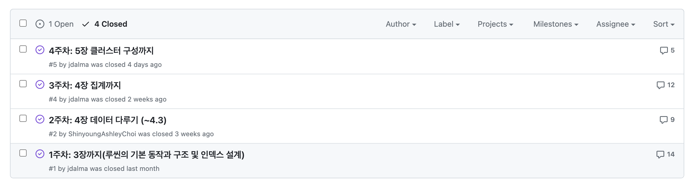

# 들어가며

벌써 2023년이 끝난다. [2022년 회고](https://jdalma.github.io/2022y/yearend)에 이어 2023년 회고, 두 번째 회고를 작성해보려 한다.  
많은 일들이 있었는데 찬찬히 정리해보자.

# 회사 적응기

2년 반정도 SI 회사에서 근무한 습관은 금방 털어내고 회사에 금방 적응할 줄 알았지만, 쉽지 않았다. 가장 힘들었던 점은 `일을 진행하면서 고민해야하는 범위`이다.  
SI회사에서 업무를 진행할 때는 RFP가 존재하고, 요구사항을 충족시키기 위한 기술도 정해져있기 때문에 문제를 해결해야 할 영역이 매우 작았다.  
되돌아보면 대부분 코드레벨의 구현 수준을 고민했었다. Java 8을 쓰니 Stream이나 Optional을 써볼까? 추상화는 어떻게 할까? SP를 애플리케이션 레벨로 어떻게 옮길까? 와 같은 고민들이다.  
  
현재 재직중인 회사는 `분석 → 설계 → 개발`의 사이클을 거치면서 **목표와 문제만 주어지고 문제를 해결하고 목표에 도달할 수 있는 많은 방법들을 프로젝트의 실무자들이 결정하여 주도한다.**  
**문제를 해결하기 위한 방법들을 다각도로 고민하여, 프로젝트의 이해관계자들을 설득하여 일을 진행하는 것** 이 핵심이다.  
(개발자는 코딩하는 시간이 대부분이라고 생각했었는데 실제로 개발하는 시간은 10~20% 밖에 되지 않았다.)  
  
올해 진행한 프로젝트는 5,6개 정도 되는데, 어떤 프로젝트는 수동적으로 답을 얻으러 다녔고 어떤 프로젝트는 능동적으로 진행하는 스스로를 볼 수 있었다.  
내가 업무를 처리하는 자세가 다른 이유는 `업무에 흥미가 있냐 없냐`로 나뉘었다.  
어떤 문제를 기술적으로 해결할 떄는 흥미를 느꼈고, 비즈니스적으로 해결할 때는 흥미를 느끼지 못했다.  
  
진행하고 있는 프로젝트가 어떤 문제를 해결하려 하는지, 사용자에게 어떤 편의를 제공하는지, 기존에는 어떤 불편함이 있었는지 등을 공감하려 하지 않았었다.  
사용하는 기술이나 개발 방법에만 관심을 두고 비즈니스에 공감하려 하지 않아 설계 단계에서 분석으로 또는 개발 단계에서 설계 단계로 다시 돌아가는 경우도 있었다.  
그러면서 일정은 늦어지고 팀장님과 마찰은 잦았다.  
  
SI에서 묻은 때를 벗기려 스스로의 습관이나 생각을 고치려고 노력을 많이 했다.(하고 있다.)  
이때 책에서 많은 영감을 얻으려 노력했고 피드백을 적극 수용하려 노력했다. 그리고 팀장님이 많은 면담을 통해 개발 흐름에 녹아들 수 있도록 많이 도와주셨다.  
개인의 노력과 팀장님의 노력으로 연말 프로젝트 회고를 통해 처음 절반 프로젝트는 대실패였지만 뒤의 절반은 좋은 평가를 받았기에 어느 정도 개선된 것을 몸소 느꼈다.  
하지만 좋은 평가를 받은 프로젝트들은 R&D 성향이 강했다. 간헐적으로 응답이 엄청 느리게 반환되는 문제를 분석하거나 특정 API의 개선 지점을 찾는 것과 같이 말이다.  
  
이제 프론트 팀, 데이터 팀, QA 팀, 기획 팀과 같이 협업을 진행해야는 프로젝트를 더 많이 진행할텐데, 올해는 능동적인 개발자가 되는것이 목표였다면 내년에는 **소프트 스킬** 을 향상시키는 것이 목표이다.  
   
# 건강과 운동

5월달에 건강상의 문제로 3주 휴직 기간을 가졌다. (지금은 건강하다.)  
부작용으로 재입원도 하면서 대부분의 사람들은 경험하지 않을 경험을 하니 당시에는 슬럼프도 왔었다.  
다 접고 쉬고 싶다는 생각이 들었지만 이 슬럼프를 잘 넘기면서 조금 더 성장하지 않았나? 생각한다.  
  
나에게 이런 일이 생긴것은 굉장히 슬프지만 이 일이 나에게 긍정적인 효과를 끼치도록 만들려면 **내가 어떤 행동으로 어떤 결과를 만드냐** 에 달려있다.  
스스로 불행하다고 생각하면서 퇴사하고 건강을 챙기지 않으면 이 일은 내 생에 최악의 일이였겠지만 런닝도 다시 시작하고 금연 중이다.  
처음에는 `내가 뭘 잘못했지?`, `나에게 이런 일이 왜 생기지?` 라는 생각에 많이 슬펐지만 지금은 **내 인생에 좋은 반환점으로 삼으려 노력 중이다.**  
  
올해 5월부터 런닝을 다시 시작하면서 10km 완주가 목표였었는데 총 4번의 10km 마라톤에 참가하여 완주했다.  

그리고 5월 ~ 12월까지 대략 350km 정도 달린 것 같다.  

- 5월: 35.56km
- 6월: 30.18km
- 7월: 45.63km
- 8월: 33.65km
- 9월: 61.11km
- 10월: 62.78km
- 11월: 35.72km
- 12월: 55.59km
  
스트레스 받을 때나 주말 아침에 달리고 오면 기분이 상쾌함을 느낀다. 몸은 힘들지만 에너지가 더 채워지는 느낌을 받는 것을 보면 나랑 잘 맞는 것 같다.  
내년 목표가 있다.  

1. 10km에 대략 1시간 ~ 1시간 10분 정도 나오는데 50분대로 줄이기
2. 평소에는 5km만 달리는데 10km로 늘리기
3. 하프 마라톤

내년 회고에는 하프 마라톤 기록을 포함시키는 것이 목표다.  

# 책 읽기와 스터디

올해는 살면서 가장 많은 책을 읽은 해이다. 내적, 외적 동기부여가 골고루 갖춰진 환경이였어서 읽다보니 이렇게 된 것 같다.  
(책을 많이 읽었다고 해서 꼭 성장했다고 볼 순 없지만) [총 18권의 책과 2편의 강의](https://jdalma.github.io/2023y/bookReview/bookReview/)를 보았다.  
개발 관련은 10권, 개발 외적으로는 8권을 읽었다.  
  
개발 관련 책은 대부분 [코드숨](https://www.codesoom.com/) 스터디에서 읽었다.  
- [모던 자바 인 액션](https://jdalma.github.io/2023y/bookReview/bookReview/#%EB%AA%A8%EB%8D%98-%EC%9E%90%EB%B0%94-%EC%9D%B8-%EC%95%A1%EC%85%98)
- [코틀린 핵심 프로그래밍](https://jdalma.github.io/2023y/bookReview/bookReview/#%EC%BD%94%ED%8B%80%EB%A6%B0-%ED%95%B5%EC%8B%AC-%ED%94%84%EB%A1%9C%EA%B7%B8%EB%9E%98%EB%B0%8D)
- [디자인패턴의 아름다움](https://jdalma.github.io/2023y/bookReview/bookReview/#%EB%94%94%EC%9E%90%EC%9D%B8-%ED%8C%A8%ED%84%B4%EC%9D%98-%EC%95%84%EB%A6%84%EB%8B%A4%EC%9B%80)
- [자바에서 코틀린으로](https://jdalma.github.io/2023y/bookReview/bookReview/#%EC%9E%90%EB%B0%94%EC%97%90%EC%84%9C-%EC%BD%94%ED%8B%80%EB%A6%B0%EC%9C%BC%EB%A1%9C)
- [알고리즘 개정 4판](https://jdalma.github.io/2023y/bookReview/bookReview/#%EC%95%8C%EA%B3%A0%EB%A6%AC%EC%A6%98-%EA%B0%9C%EC%A0%95-4%ED%8C%90)
- [업무 시각화](https://jdalma.github.io/2023y/bookReview/bookReview/#%EC%97%85%EB%AC%B4-%EC%8B%9C%EA%B0%81%ED%99%94)
- [한 권으로 읽는 컴퓨터 구조와 프로그래밍](https://jdalma.github.io/2023y/bookReview/bookReview/#%ED%95%9C-%EA%B6%8C%EC%9C%BC%EB%A1%9C-%EC%9D%BD%EB%8A%94-%EC%BB%B4%ED%93%A8%ED%84%B0-%EA%B5%AC%EC%A1%B0%EC%99%80-%ED%94%84%EB%A1%9C%EA%B7%B8%EB%9E%98%EB%B0%8D)
- [HTTP 완벽 가이드](https://jdalma.github.io/2023y/bookReview/bookReview/#http-%EC%99%84%EB%B2%BD-%EA%B0%80%EC%9D%B4%EB%93%9C)
  
개발과 무관한 책은 출퇴근 시간에 읽었다.  
출근에는 잠을 덜 깨서, 퇴근에는 진이 다 빠져서 출퇴근 시간에 책을 읽는 자체가 처음엔 힘들었다.  
진짜 읽고 싶은 책(어떤 책이든 상관없이 습관을 들이는 목적으로)만 골라서 그 환경에 책을 읽는 습관을 들이니 이제 어떤 책을 읽을지 고민할 정도로 수월해졌다.  
  
[인생을 바꾸는 법 - 한 걸음씩 나아가기](https://www.youtube.com/watch?v=y00tvum7g1I&list=LL&index=61&ab_channel=%ED%95%9C%EB%88%88%EC%97%90%EB%B3%B4%EB%8A%94%EC%84%B8%EC%83%81%E2%80%93Kurzgesagt) 이 영상이 루틴과 습관, 트리거에 대한 이해에 도움이 되었다.  
  
내년에는 20권 정도 읽었으면 좋겠다.

# 사내 스터디

지금 회사의 메인 스트림은 특허 검색 서비스이며 해당 서비스에 엘라스틱서치를 사용하고 있다.  
(백엔드의 입장으로서는 Query DSL을 만드는 것이 다 이지만) 개발팀 회의를 진행할 때 마다 클러스터, 노드, 샤드, 인덱스, 형태소 분석기 등 모르는 용어들이 많아 데이터팀의 공유 사항을 이해하기가 힘들었다.  
그리고 키바나를 사용하거나 Query DSL을 작성할 때 매번 구글링하면서 스스로가 너무 답답했다.  
  
이 이유로 [엘라스틱서치 바이블](https://www.yes24.com/Product/Goods/119719070) 스터디를 만들었다.  
이제 절반정도 도달했고 1월 말에 스터디가 끝날 예정이다.

  
절반정도 읽었는데 굉장히 만족중이다. 데이터팀의 회의 내용을 이제 이해할 수 있게 되었고 학습하면서 실무에 어떻게 적용되어 있는지 비교할 수 있으니 이해가 더 잘되는 것 같다.  
다른 팀원들도 적극적으로 잘 참여해주셔서 재밌게 진행 중이다.  
(회사가 재미없었는데 사내 스터디 덕분에 활기를 찾은 느낌이다.)  
  
이번 스터디를 잘 마무리하고 다음 스터디도 꾸준히 진행하고 싶다.  

# 칸반

[업무 시각화](https://www.yes24.com/Product/Goods/86627323?pid=123487&cosemkid=go15803705973738109&gad_source=1&gclid=Cj0KCQiAv8SsBhC7ARIsALIkVT0tW1ZLWdfN7eGtAMkonCv92sKwKsSeSWkBgyT5x7g7HH8lVc5dyXYaAr_dEALw_wcB)를 읽고 TODO 목록을 칸반으로 관리해보고 있다.  

이전에는 온전히 기억력으로만 관리하던 것을 시각화하니 기억에 대한 부담이 덜하고 새로운 것을 추가해야 할 때 우선순위를 비교해볼 수 있고 어떤 것이 더 중요한지 고민하는것이 편하다.  
그리고 완료 상태로 넘어갈 때 뿌듯함을 계속 느낄 수 있는 것도 장점이다.  
  
내년 회고를 작성할 때까지 꾸준히 사용하는 것이 목표다.  

# 느낀점

SI 회사를 퇴사하고 서비스 회사를 1년 다니면서 느낀 점은 `이제 진짜 개발자다워 지는 것 같다.` 이다.  
문제를 해결하기 위해 여러 기술들을 고민하고 클러스터를 직접 구성하여 운영하면서 발생하는 문제들을 해결하기 위해 여러 방안들을 고민하는 것들이 새로웠다.  
그만큼 많은 기술들이 사용되고 있고 배워야 할 기술들은 산더미이다.  
단순히 코더처럼 일하는 것이 아니라 문제를 해결하기 위한 여러 방안들을 모색하고 타협점을 찾아 결정하는 것 그리고 (쉽진 않지만) 누군가를 설득하고 일의 진행 순서와 우선순위를 스스로 결정하여 진행하는 것이 재밌다고 느꼈다.  
이제 공부 주제의 우선순위도 실무에 맞닿아 있는 것들을 위주로 학습하려고 한다.  
  
그리고 오프라인 마라톤 대회에 참여하면서 느낀 점이 있다.  
출발 초반에 다른 사람들이 내 앞으로 추월하는 것을 보기 힘들어 스스로의 페이스를 유지하기가 힘들었다.  
주변 사람들이 빠르게 뛰니 나도 덩달아 `빨리 뛰어야 하나?` 라는 생각에 페이스를 잃은 경우가 있다.  
하지만 `와 저 속도로 뛴다고?`하는 사람들 `2/3` 정도는 결국 따라 잡는다. 앞에서 걷고 있는 경우가 대부분이기 때문이다.  
나머지 `1/3` 은 진짜 끝까지 일정한 속도로 뛰는 그 사람들의 페이스였다.  
  
주변 사람들의 속도에 연연하지 말고 나만의 페이스로 주변 경치도 보면서 꾸준히 뛰는 것이 정답이다.  
**경치나 아름다운 길을 돌아보지 않고 앞만 보고 달리는 사람, 목적에 심취하여 과정에서 달콤함을 찾지 못하는 사람이 되지 않도록 해야한다.**  
  
> 마치 날씨가 너무 좋은 날 경치가 아름다운 길을 돌아보지 않고 바삐 지나치는 것이 그 시간에 대한 모욕인 것 처럼,  
> 기껏 수능 시험을 얼마나 잘 보았나, 혹은 얼마나 명문 대학에 입학했는가 정도라면 그것은 그보다 흥미로운 지적 체험이 없었다는 자기 고백일 뿐이다.  
> - **공부란 무엇인가?** "낙화암에서 떨어진다고 모두 꽃은 아니다" (에필로그 중에서)

# 마무리

2022년 회고에 작성했던 올해 목표들이다.

- [x] 블로그 꾸준히 운영하기, 학습 블로그와 기술 블로그 분리하기
- [x] 학습하는 자세 유지하기
- [ ] 인프런 사놓은 강의 보기
  - 2편 밖에 못 봤으니.. 이루지 못 했다고 보자
- [x] 책 10권 읽기
- [x] 다른 개발자들과 교류하기
  - 넥스트스텝 코틀린 교육의 오프라인 모임에 참석 그리고 코드숨 연말 회고에 참석
- [x] 관심가는 스터디에 참여하기
- [ ] 사람들 앞에서 기술 발표 해보기
- [ ] 개발자, 한 달에 책 한 권 읽기 참여하기

<h3>2024년 목표</h3>

- 하프 마라톤 완주하기
- 책 20권 읽기
- 인프런 강의 5편 이상 보기
- 사람들 앞에서 기술 발표 해보기
- 도전을 두려워 하지말기
- (간단한) 서비스 만들기
