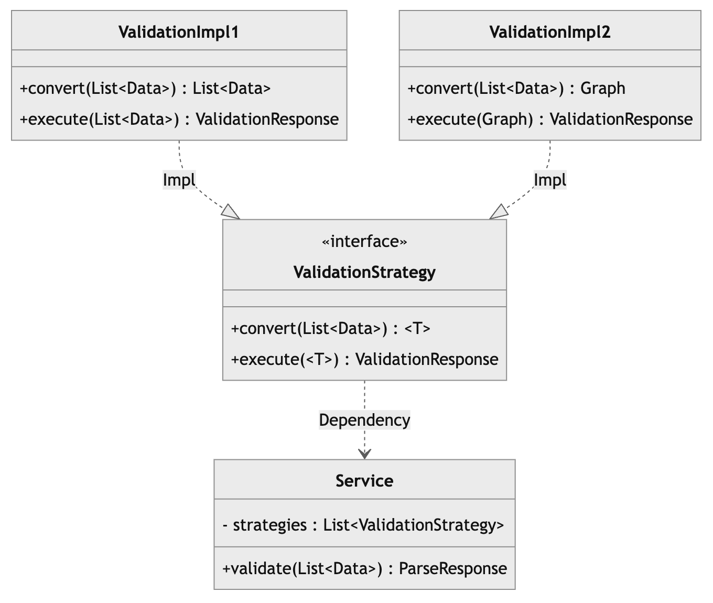

업무를 진행하면서 스프링과 코틀린을 사용하면서 만난 문제를 정리하려고 한다.  

  
위의 다이어그램과 같이 `Service`는 `ValidationStrategy` 인터페이스를 구현한 구현체를 `List<ValidationStrategy>`으로 주입받아 사용하려 했다.  
`convert(List<Data>)`는 고정된 타입을 받아 `T`를 반환하고, `execute(T)`는 `T`타입을 받아 응답으로 반환하는 것을 알 수 있다.  
의도는 확장에 유연하도록 각 `ValidationImpl`은 `execute()`를 통해 `List<Data>`라는 데이터를 받아 **검증할 때 사용할 타입을 정의하도록 했다.**  
  
# 예제 코드


```kotlin
@Service
class Service(
    val strategies: List<ValidationStrategy<*>>
) {
    fun validate(values: List<Data>) : List<ValidationResponse> {
        val responses = mutableListOf<ValidationResponse>()
        strategies.map {
            responses.add(it.execute(it.convert(values)))
        }
        return responses
    }
}

interface ValidationStrategy<T : Any>{

    fun execute(param: T) : ValidationResponseVo

    fun convert(queries: List<Data>) : T
}

class ValidationResponse
```