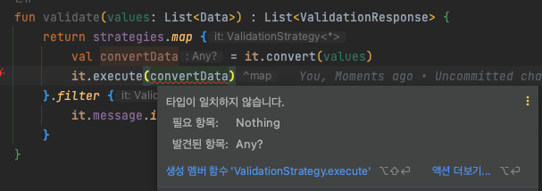
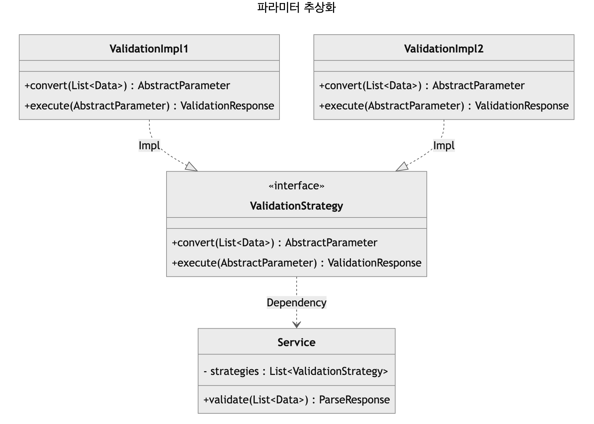

스프링과 코틀린을 사용하면서 만난 문제를 정리하려고 한다. 실제 업무와 비슷하게 다이어그램을 작성해 보았다.  


  
`convert(List<Data>)`는 고정된 타입을 받아 `T`를 반환하고, `execute(T)`는 `T`타입을 받아 `ValidationResponse` 를 반환하는 것을 알 수 있다.  
이 설계의 의도는 **확장에 유연**하고 **검증하는 부분과 검증기가 필요로하는 데이터 타입을 가공하는 부분**을 나누고 싶었다.  
각 `ValidationImpl`은 `convert()`를 통해 `List<Data>`라는 타입을 받아 **검증할 때 사용할 데이터 타입을 직접 정의할 수 있도록 했다.**  
  
- `strategies`를 주입받을 떄 **`*` Star-projection**을 사용하여 모든 구현체를 주입받아야 한다.
  - `*`로 하지 않고 `Any`로 주입받으면 빈을 찾지 못한다.
- `ValidationStrategy`의 제네릭을 `Any`로 작성하여 구현체마다 직접 다운 캐스팅을 하진 않을 것이다.

  
# **문제점**

위의 다이어그램과 같이 `Service`는 `ValidationStrategy` 인터페이스를 구현한 구현체를 `List<ValidationStrategy>`으로 주입받아 사용하려 했다.  
   
```kotlin
@Service
class Service(
    private val strategies: List<ValidationStrategy<*>>
) {
    fun validate(values: List<Data>) : List<ValidationResponse> {
        return strategies.map {
            val convertData = it.convert(values)
            it.execute(convertData) // COMPILE ERROR!!!
        }.filter {
            it.message.isNotEmpty()
        }
    }
}

interface ValidationStrategy<T>{

    fun execute(param: T) : ValidationResponse

    fun convert(queries: List<Data>) : T
}

@Component
class ValidationImpl1 : ValidationStrategy<String> {

    override fun execute(param: String): ValidationResponse {
        return ValidationResponse(param)
    }

    override fun convert(queries: List<Data>): String {
        return "가공 데이터"
    }

}

data class ValidationResponse (
    val message: String
)

data class Data (
    val data : String
)
```

하지만 `it.execute(convertData)`를 호출할 때 파라미터를 넘겨보면 **컴파일 에러**가 발생한다.  


  
이 에러를 보고 고민했을 때 아래와 같은 방법들이 떠올랐다.  

## **첫 번째 방법 : 리플렉션** 
*직접 해보진 않았지만* 리플렉션을 사용하여 주입받은 `ValidationStrategy.execute()`의 타입 파라미터와 메소드를 조회화여, 찾은 타입 파라미터로 캐스팅하거나 찾은 메소드로 `invoke`하는 방법
  - 코드 복잡성이 높아진다.
  - 가독성이 급격히 떨어진다.
  - **개인적으로는 리플렉션 같은 메타 프로그래밍을 선호하지 않는다.**

## **두 번째 방법 : 파라미터 추상화** 



좋은 방법이긴 하지만 [자바에서 코틀린으로 15장. 캡슐화한 컬렉션에서 타입 별명으로](https://github.com/jdalma/java-to-kotlin#15%EC%9E%A5-%EC%BA%A1%EC%8A%90%ED%99%94%ED%95%9C-%EC%BB%AC%EB%A0%89%EC%85%98%EC%97%90%EC%84%9C-%ED%83%80%EC%9E%85-%EB%B3%84%EB%AA%85%EC%9C%BC%EB%A1%9C)을 보면 자료구조를 클래스로 캡슐화하게 되면 **코틀린 표준 라이브러리가 제공하는 기능을 사용하기에는 불편하기 때문에 제외하였다.**  

## **세 번째 방법 : 타입을 명시적으로** 

`ValidationStrategy`은 **받아들이는 제네릭 파라미터와 반환하는 파라미터 타입이 같기 때문에** 한정적 와일드카드를 적용하기에는 힘들다고 판단했다.  
이런 상황을 해결하기 위한 방법을 [Effective Java Item 31 내용 중 비한정적 타입 매개변수와 비한정적 와일드카드](https://github.com/jdalma/footprints/blob/main/effective-java/item31_%ED%95%9C%EC%A0%95%EC%A0%81%20%EC%99%80%EC%9D%BC%EB%93%9C%EC%B9%B4%EB%93%9C%EB%A5%BC%20%EC%82%AC%EC%9A%A9%ED%95%B4%20API%20%EC%9C%A0%EC%97%B0%EC%84%B1%EC%9D%84%20%EB%86%92%EC%9D%B4%EB%9D%BC.md)에서 소개한다.    
  
```java
public static void swap(List<?> list, int i, int j) {
    list.set(i, list.set(j, list.get(i)));
}
```

List의 타입이 `List<?>`인데, `List<?>`에는 **null**외에는 어떤 값도 넣을 수 없기 때문에 컴파일 에러가 발생한다.  
코틀린의 `*`이 [`kotlinlang` Nothing](https://kotlinlang.org/api/latest/jvm/stdlib/kotlin/-nothing.html)을 기대하는 이유가 [`Java tutorial` Wildcards](https://docs.oracle.com/javase/tutorial/extra/generics/wildcards.html)를 확인해보면 **와일드카드를 통해 모든 타입을 적용할 수 있게 되지만 쓰는 것에 대해서는 안전하지가 않다는 것을 알 수 있다.**  
    
이 상황은 `ValidationStrategy`의 상황과 같다.  

```kotlin
@Service
class Service(
    private val strategies: List<ValidationStrategy<*>>
) {
    fun validate(values: List<Data>) : List<ValidationResponse> {
        return strategies.map {
            // execute를 하기위해 파라미터를 넘겨야 하는데 인자 타입을 알 수 없다.
            strategy.execute(strategy.convert(queries.toList())) 
        }.filter {
            it.message.isNotEmpty()
        }
    }
}
```
  
이펙티브 자바 책에서는 아래와 같은 `helper method`에 제네릭을 작성하여 실제 타입을 알려주면서 해결하였다.  

```java
// 와일드카드 타입을 실제 타입으로 바꿔주는 private 도우미 메서드
private static <E> void swapHelper(List<E> list, int i, int j) {
    list.set(i, list.set(j , list.get(i)));
}
```
  
## **타입을 명시적으로** 

위의 `helper method`를 참고하여 아래와 같이 작성해보았다.  
  
```kotlin
fun validate(values: List<Data>) : List<ValidationResponse> {
    return strategies.map {
        it as ValidationStrategy<Any>
        it.execute(it.convert(values))
    }.filter {
        it.message.isNotEmpty()
    }
}

// 또는

fun validate(values: List<Data>) : List<ValidationResponse> {
    return strategies.filterIsInstance<ValidationStrategy<Any>>()
        .map {
            it.execute(it.convert(values))
        }.filter {
            it.message.isNotEmpty()
        }
}
```

`strategies.filterIsInstance<ValidationStrategy<Any>>()`를 통해 `*`을 `Any`로 확정지어주면서 해결했다.  
- [`kotlinlang` Iterable<*>.filterIsInstance()](https://kotlinlang.org/api/latest/jvm/stdlib/kotlin.collections/filter-is-instance.html) 확장함수가 `Iterable<*>`이므로 Star-Projections를 사용했을 때 타입을 확정지어줄 수 있게 제공하는 것 같다.  
  
추가적으로 [제네릭을 정리해 보았다.](https://jdalma.github.io/2023y02m/kotlinGeneric)  