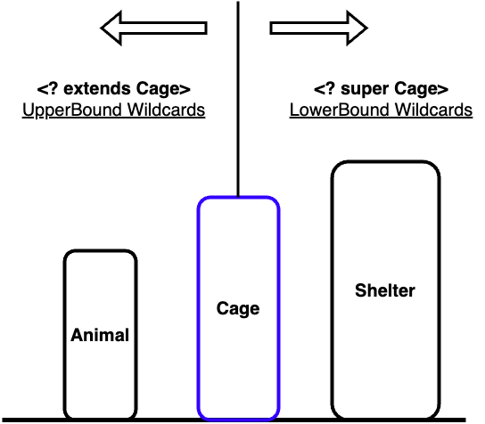

[스프링에서 코틀린의 `*`을 사용](https://jdalma.github.io/2023y02m/generic/)하면서 만난 문제를 정리해봤었는데, 이 참에 제네릭을 정리해보고자 한다.  

# **코틀린의 제네릭과 한정적 와일드카드**
  
일단 **타입 매개변수**와 **타입 인수**를 알고가자  
매개변수는 메서드 선언에 정의한 변수이고, 인수는 메서드 호출시 넘기는 실젯값이다.

```java
class Set<T> {...}
Set<Integer> = ...;
```

`T`는 **타입 매개변수**가 되고, `Integer`는 **타입 인수**가 된다.  
    
이제 **공변 `covariance`, 반공변 `contravariant`, 무공변 `invariance`** 에 대해, **코틀린의 `in`, `out`, `where`** 은 어떤 개념인지 알아보자  
  
**변성**에 대한 이야기는 `타입 T1이 T2의 하위 타입일 때, List<T1>가 List<T2>의 타입 관계가 어떠한가?`로 시작된다.  
  
> [`kotlinlang` Java Generics in Kotlin](https://kotlinlang.org/docs/java-interop.html#java-generics-in-kotlin)를 확인하면  
> `Foo<? extends Bar>` becomes `Foo<out Bar!>!`  
> `Foo<? super Bar>` becomes `Foo<in Bar!>!` 이렇게 사용한다.  
> `!` 는 `Bar`와 `Bar?` 둘 다 의미한다.  

```java
interface Step<T>
open class Shelter
open class Cage : Shelter()
class Animal : Cage()

fun 무공변(relation: Step<Cage>) {}
fun 공변(relation: Step<out Cage>) {}
fun 반공변(relation: Step<in Cage>) {}

fun main() {
    val shelter = object : Step<Shelter> {}
    val cage = object : Step<Cage> {}
    val animal = object : Step<Animal> {}

    무공변(shelter)    // Type mismatch Compile Error !!!
    무공변(cage)
    무공변(animal)     // Type mismatch Compile Error !!!

    공변(shelter)     // Type mismatch Compile Error !!!
    공변(cage)
    공변(animal)

    반공변(shelter)
    반공변(cage)
    반공변(animal)     // Type mismatch Compile Error !!!
}
```
- [예제 참고](https://sungjk.github.io/2021/02/20/variance.html)
- [invariance/non-variance 참고 `Effective Java Item 28. 배열보다는 리스트를 사용하라`](https://github.com/jdalma/footprints/blob/main/effective-java/item28_%EB%B0%B0%EC%97%B4%EB%B3%B4%EB%8B%A4%EB%8A%94%20%EB%A6%AC%EC%8A%A4%ED%8A%B8%EB%A5%BC%20%EC%82%AC%EC%9A%A9%ED%95%98%EB%9D%BC.md)
- [PESC 공식 참고 `Effective Java Item 31. 한정적 와일드카드`](https://github.com/jdalma/footprints/blob/main/effective-java/item31_%ED%95%9C%EC%A0%95%EC%A0%81%20%EC%99%80%EC%9D%BC%EB%93%9C%EC%B9%B4%EB%93%9C%EB%A5%BC%20%EC%82%AC%EC%9A%A9%ED%95%B4%20API%20%EC%9C%A0%EC%97%B0%EC%84%B1%EC%9D%84%20%EB%86%92%EC%9D%B4%EB%9D%BC.md#pecs--producer-extends-consumer-super)
  
**무공변**은 제네릭 타입 파라미터가 고정되어 있는 상황으로 **타입관계가 성립되지 않는 것**  
**공변**은 하위 타입이 상위 타입과 관계를 성립 하는 것 **`Step<Animal>` is a `Step<Cage>`**  
**반공변**은 공변과 반대로 **`Step<Shelter> is a Step<Cage>`**  
  
여기서 추가로 **PECS 공식**이 등장하는데 `producer-extends, consumer-super`를 의미한다.  
즉, `Collection<T>`에 대해 **쓰기 작업은 `extends`** , **읽기 작업은 `super`** 를 사용하라고 하는 공식이다.  
넣을 때는 제네릭 타입 파라미터 기준 하위 타입들까지 허용하도록 하고, 꺼낼 때는 상위 타입들로 꺼낼 수 있도록 하는 것이다. [리스코프 치환 원칙](https://ko.wikipedia.org/wiki/%EB%A6%AC%EC%8A%A4%EC%BD%94%ED%94%84_%EC%B9%98%ED%99%98_%EC%9B%90%EC%B9%99)  
  


타입 인수에 대해 자바의 `?` 같은 방식으로 모든 타입을 수용하고 안전한 방식으로 사용하기 위해 [`kotlinlang` Start-Projections](https://kotlinlang.org/docs/generics.html#star-projections)이 제공된다. **Start-Projections**을 이해하는데 한정적 와일드카드가 도움이 된다.  
  
`interface Function<in T, out U>`  
`Function<*, String>` → `Function<in Nothing, String>`  
`Function<Int, *>` → `Function<Int, out Any?>`  
`Function<*, *>` → `Function<in Nothing, out Any?>`  
  
그렇다면 코틀린의 `where`은 무엇일까?  
[`kotlinlang` Upper Bounds](https://kotlinlang.org/docs/generics.html#upper-bounds)를 보면 기본적으로 `<>`에 하나의 상한만 지정이 가능하지만 둘 이상의 상한이 필요한 경우 사용할 수 있다고 한다.  
**전달된 유형은 절의 모든 조건을 동시에 만족해야한다.** 아래의 예제를 확인해보자
  
```kotlin
interface Cage
class Animal : Cage
class Birds : Cage

interface Person
class Trainer : Cage, Person
class Developer : Person

interface WhereStep<T> where T : Cage, T : Person

fun main() {
    val animal = object : WhereStep<Animal> {}          // Type argument is not within its bounds. Compile Error !!!
    val birds = object : WhereStep<Birds> {}            // Type argument is not within its bounds. Compile Error !!!
    val trainer = object : WhereStep<Trainer> {}
    val developer = object : WhereStep<Developer> {}    // Type argument is not within its bounds. Compile Error !!!
}
```

`WhereStep` 인터페이스는 `Cage`와 `Person` 둘 다 만족해야 하기 때문에 `Trainer`만 구현 가능한 것을 확인할 수 있다.  
