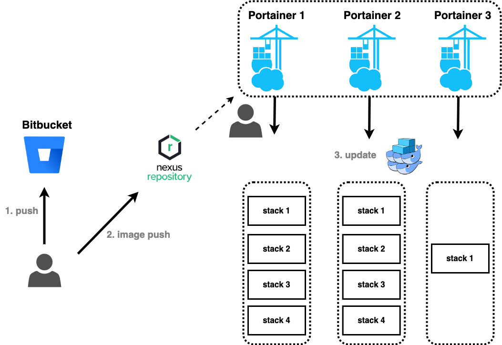

# AS-IS

현재 모두 수동으로 반영하고 있다.  
- **`Bitbucket`은 형상관리 역할만 하기에 커밋 내용과 `Nexus`의 도커 이미지가 동일하다는 것이 보장되지 않는다.**  
- **`Nexus`에 이미지를 넣기 위해 쉘 스크립트를 직접 실행시켜줘야 한다.**  
- **그리고 도커 이미지 태깅을 직접 작성하기에 잘 못 작성할 여지가 있다.** 
  
위의 문제를 해결하기 위해 아래와 같은 CI/CD를 구축해보려 한다.  
  
# TO-BE

`Jenkins`가 Webhook을 받아 테스트를 실행하고 이미지를 빌드하여 푸시한다.  
    
**통합 테스트는 어디에서 실행되어야 하나?**  
통합 테스트를 진행하는 서비스가 다른 서비스에 의존한다면?  
검색을 위한 테스트를 검증하기 위해서는 여러 서비스가 같이 있어야 하는데 주위 서비스들을 모두 mock으로 대체할 것인가?  

## 서비스 기준 통합 테스트

포테이너에 이미지를 푸시하기전에, 배포하는 서비스 기준으로 통합 테스트를 하면 아래와 같을 것이다.  

테스트 상황별(Hotfix Test, Integration Test 등)로 테스트 코드를 관리하기 위해 `Gradle Task`를 각각 선언하여 경로별로 할 수 있지만 서버에 테스트 코드가 같이 존재하면 커밋이 복잡해져 분리하자는 요구사항이 있었다.  
하지만 **서비스 기준으로 통합 테스트를 진행할 때 서버를 분리해서 진행하기는 힘들다.**  
분리하기 위해서는 여러 서비스와 DB가 얽혀있는 API를 테스트하려 한다면 얽혀있는 모든 컴포넌트들을 실행시켜야 한다.  
분리하지 않고 테스트 코드를 서비스 내에 위치시킨다면 얽혀있는 컴포넌트들을 위한 mock 테스트 개발이 필요하다.  
> **테스트를 위한 많은 개발 비용이 필요하며 mock을 사용하는 만큼 테스트에 대한 신뢰성이 떨어진다.**  

## 인프라 기준 통합 테스트

모든 인프라가 구축이 완료된 테스트 서버(stack)에서 통합 테스트를 진행하면 아래와 같을 것이다.  

**통합 테스트를 실행할 서버와 서비스 서버를 분리**한 상태에서 진행하기가 수월하다.  
포테이너에서 배포할 서비스 이미지 업데이트가 끝난 후에, 통합 테스트를 실행한다면 가능하다.  
이미 주변 컴포넌트들이 `stack`내에 위치해 실행되고 있기 때문이다.  
  
해당 위치에서 통합 테스트가 실행된다면 **Postman CLI (newman)으로 json파일 기준으로 통합 테스트를 실행하는 방법**을 적용할 수 있을 것 같다.  
> **서비스 기준 통합 테스트에 비해 개발 비용은 낮을 것으로 예상되며, mock을 사용하지 않는 만큼 테스트에 대한 신뢰는 올라가지만, 개인적인 작업 환경을 구축하기는 힘들다.**  
  
**인프라 기준 통합 테스트** 구축을 위한 통합 테스트를 실행하고, 테스트 케이스를 관리하는 여러 방법을 찾아보자.

### CASE 1. Jenkins + Postman (+ newman)

Postman의 테스트 스크립트를 이용하여 JSON파일로 만들고, 해당 JSON파일을 프로젝트 내에 위치시키고 Jenkins에서 newman을 실행시켜 보았다.  
테스트를 위해 `test`와 `build` 단계는 빼고, 테스트 케이스를 실행하기 위한 테스트만 진행해 보았다.  

**장점**  
1. Postman에서 export된 JSON 파일로 테스트를 실행하기 때문에, 로컬에서 테스트하기도 쉽고, 접근성이 용이하다.
   
**단점**
1. Postman script에 대한 학습이 조금 필요하다.
2. gRPC는 JSON으로 export되지 않는다.
3. JSON 파일을 어떻게 관리할지 구상하여야 한다.

***

# 브랜치

한 서비스에 `main`을 제외한 브랜치는 총 9개가 있고, 테스트 서버도 브랜치에 맞게 9개가 있다.  
**각 브랜치마다 다른 테스트 서버에 다른 이미지가 배포된다.**  
서로 다른 이미지를 배포하는 것이 **지속적인 통합/지속적인 배포**라는 의미가 맞을까?  
- [`화해 기술 블로그` 브랜치 전략 수립을 위한 전문가의 조언들](https://blog.hwahae.co.kr/all/tech/9507)
  - Git-flow
  - Github-flow
  - Gitlab-flow