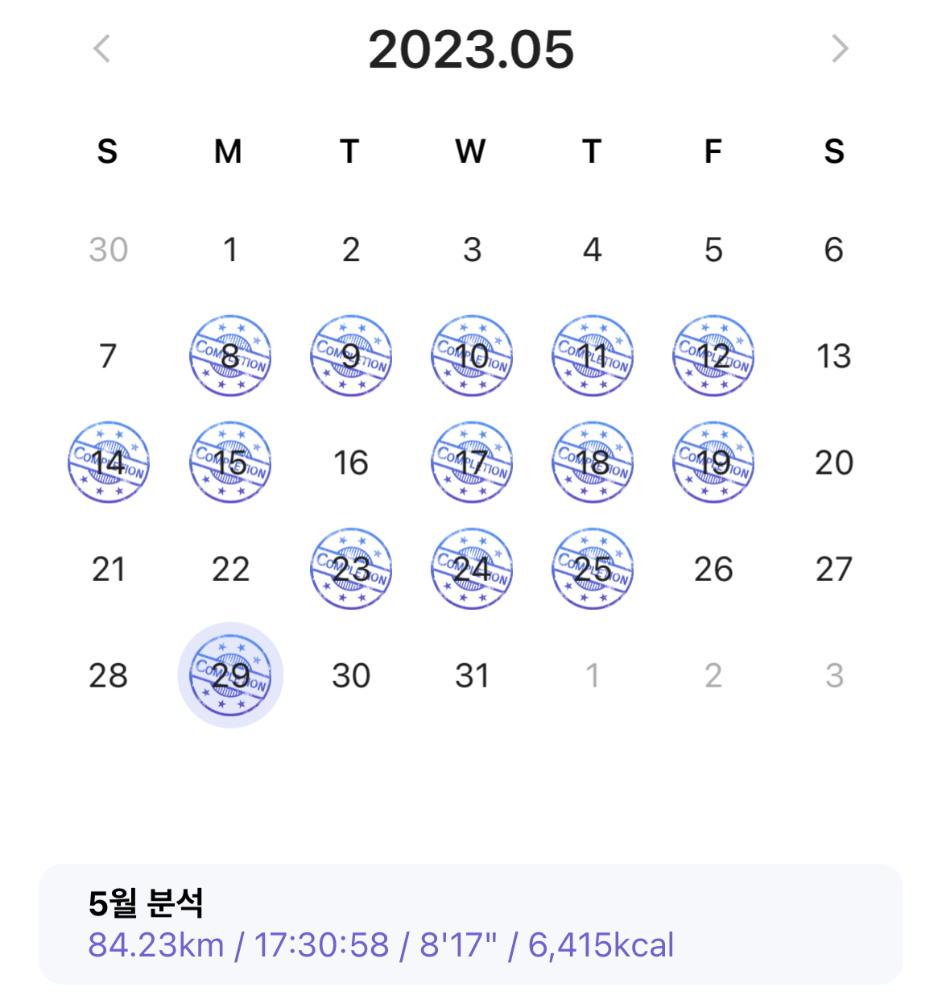

육체적,정신적으로 힘든 일을 겪어 회사에 3주간 휴직을 내었다.  
**지금은 굉장히 건강하다.**  
- 이전보다 더 건강해졌다.
- 금연,금주 중이고 런데이도 다시 시작했다
  
입원도 하고, 부작용으로 응급실도 가고, 대부분의 사람들은 경험하지 않아도 될 경험을 하면서 **번아웃이 왔다.**  
개발이 재미없어진 것은 아니지만, `"인생이 허무하다. 열심히 사는게 의미가 있나?"`라는 생각이 머리를 지배했다.  
작성일 기준으로 내일 휴직을 끝내고 출근하는 기념으로 번아웃을 극복하기 위해 노력한 과정을 기록해보려 한다.  
  
# 햇빛 쬐면서 운동하기

어디서 들었던 말인데 `"많은 사람들이 정신이 육체를 지배한다고 생각하지만, 육체가 정신(기분)을 지배할 수 있다."` 라는 말을 기억한다.  
육체와 정신을 따로 생각하고 기분이 안좋거나 우울할 때 육체를 움직여 정신(기분)을 맑은(신나는) 상태로 바꿀 수 있다라고 기억한다.  
무기력하고 우울할 때 마다 이 기분을 이겨내기 위해 무조건 밖에 나갔다.  

퇴원 첫 주는 피 수치가 낮아 뛰거나 계단을 오르내릴 순 없어서 집 주변만 산책하고, 둘째 주 부터 런닝을 시작했다.  
표시가 되지 않은 날에는 집에서 홈트레이닝을 했다.  
  
실제로 엄청 우울한 날에도 머리로 생각을 멈추고 아무 생각없이 옷 입고 밖에 나가서 런닝을 하면 오히려 힘이 넘치는 것을 느꼈다.  
**우울하거나 힘들때는 집안에 있지말고 잠깐이라도 밖으로 나가서 햇빛을 쬐면서 걷거나 뛰어보자**  

# 스터디 

이번 일을 겪기 전부터 참여하던 코틀린 스터디, 컴구 스터디가 있다.  
병원에서 입원한 날이랑 겹쳤던 컴구 스터디를 한 번 빠진것을 제외하곤 모두 참여하고 있다.  
(컴구 스터디는 5월 25일에 스터디를 성공적으로 끝냈다.)  
  
책 읽고 공부하기가 너무 싫어도 꾸역꾸역 공부하고 참여했다.  
서울에서 혼자 자취를 하고 있기도 하고 사람을 만나기가 싫었어서 이런 스터디가 아니면 말을 할 상황이 거의 없었기 때문에 스터디를 꾸준히 참여한게 번아웃을 극복하는 것에 큰 도움이 되었다고 생각한다.  
  
**다른 개발자 분들이랑 여러 주제로 이야기 나누는 행위 자체가 스터디를 하는 동안이라도 머리를 복잡하지 않게 해준 것 같다.**  

# 요리하기

어떤 뉴스였는지 기억은 안나지만, 우울하거나 자존감이 많이 떨어진 사람들에게 요리를 추천한다라는 말을 어디서 들었었다.  
스스로 요리를 하는 과정 자체와 스스로 만든 음식으로 배를 부르게 하는 것이 도움이 된다고 했던 것 같다.  
- [우울증에 요리, 추천합니다!](https://brunch.co.kr/@naomememe/144)
  
실제로도 그랬다.  
요리를 잘하지 못 하기 때문에 소스를 직접 만들지는 못 하지만 찌개소스를 사서 요리를 만드는 것이 재밌었다.  
고기를 익히고, 파와 김치 썰고, 간을 보는 이런 행위들이 재밌게 느껴졌다.  
  
내가 만든 음식으로 배부르게 먹는것도 좋았다.  
아 이렇게 하니까 간이 이상한가보다 다음에는 이렇게 해야지, 오 오늘은 맛있는데, 이런 맛이 나네 등등 여러 생각을 하면서 부정적인 생각에서 빠져나올 수 있었던 것 같다.  
  
**약간의 보람을 느끼고 싶다면 간단한 요리라도 해보는 것을 추천한다.**  
다음에 해먹어볼 음식들
- (고기 엄청 많이 넣은) 카레, 수육, 김치찜

# 책 읽기

여기서 말하는 책은 개발과 무관한 책들을 말한다.  
동욱님의 [나를 위해 남을 도와주기](https://jojoldu.tistory.com/715?category=689637) 게시글에서 `내 생에 단 한 번` 책의 내용중 한 챕터로 예를 들어주셨는데 책의 내용이 너무 마음에 들어 바로 구매하고 읽어보았다.  
  
(개발 책만 보다가 에세이를 봐서 그럴수도 있지만) 저자의 생각이 나와 굉장히 비슷하다고 느껴 감정 이입이 잘됐던 것 같다.  
저자님의 강의 재밌었겠다 생각하면서, 울거나 웃으면서 재밌게 읽었다.  
내가 책을 이렇게 빨리 읽다니라고 생각이 들 정도로 정신없이 읽었다.  
  
**딱딱한 개발책만 보기보다는 시간을 따로 내서 다른 책도 읽어야겠다.**  

# 결론

일상생활할 정도로 회복은 된 것 같지만 번아웃을 다 극복하진 못한 것 같다.  
외부의 약한 스트레스에 정신이 쉽게 무너질까봐 무섭다.  
  
그렇다고 잘 다니던 회사를 때려치울수도 없고, 다 접고 부산으로 내려갈수도 없으니 일단 원래의 생활로 돌아가려고 한다.  
내 기억을 지울수도 없고, 시간을 되돌릴 수도 없으니 이번에 경험한것들은 잊을 수 없을 것이다.  
**이번에 경험한 것들 때문에 번아웃이 회복이 되지 않는다고 생각하기 보다는 정신적으로 성장하고 있다고 생각하자**  

