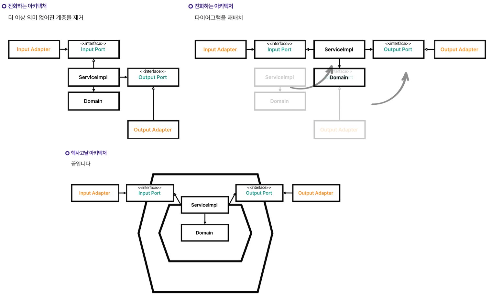

- 참고한 내용들
  - [개발자를 위한 '소프트웨어 아키텍처' 개념과 활용법][wishket]
  - [만들면서 배우는 클린 아키텍처][book]
  - [Java/Spring 테스트를 추가하고 싶은 개발자들의 오답노트][inflearn]

# 개요

[토이 프로젝트](https://github.com/f-lab-edu/just-commerce)를 만들어보면서 아키텍처에 대한 고민이 필요했다.  
그리하여 레이어드 아키텍처와 헥사고날 아키텍처에 대해 학습하여 (주관적인) 장,단점을 정리해보고 어떤 결정을 내렸는지 정리해보려 한다.  
  
> **소프트웨어 아키텍처란?**  
> 시스템의 구조와 행동을 정의하는 청사진으로, 소프트웨어 시스템을 구성하는 **컴포넌트(components)** 와 그들 간의 **관계(relationships)**, 그리고 설계와 개발을 안내하는 **원칙(principles)** 을 포함합니다.   
> 그리고 시스템의 기술적 결정을 조직화하고, 개발자가 시스템을 이해, 유지보수, 확장할 수 있도록 도와줍니다.  

## 레이어드 아키텍처

> 웹 (컨트롤러) → 비즈니스 (서비스) → 영속성 (엔티티, 리포지토리)

위와 같이 의존성이 단방향, 상위에서 하위 계층으로 흐르는 이 아키텍처의 단점과 특징에 대해 알아보자.  

1. **데이터베이스 주도 설계를 유도한다.**
    - 가장 마지막에 의존하는 영속성 계층을 먼저 설계한 후에 이를 토대로 객체의 상태를 먼저 설계하게 된다.
    - 이런 데이터베이스 주도 설계는 데이터 중심 설계를 유발하며, 행동보다 데이터를 먼저 결정하게 되어 객체간 협력을 고려하기 어려워진다.
2. **계층간 참조 오염이 발생하기 쉽다.**
    - 위에서 아래로 순방향으로만 흐르고 역류하지 않도록 해야하며, 레이어를 건너뛰거나 특정 레이어를 제외하고는 동일 레이어를 참조하지 말아야 한다는 규칙이 있긴 하다.
    - 상위 레이어에서 하위 레이어로 모두 접근 가능하다는 말이 되기에 비즈니스 레이어에서 필요한 헬퍼나 유틸리티 컴포넌트를 영속성 레이어에 밀어 넣는 오염을 발생시키기 쉽다.
    - 아주 간단한 엔티티 조작을 요구하는 상황에 비즈니스 레이어를 건너뛰고 웹 레이어에서 영속성 레이어로 바로 접근하는 오염도 발생시킬 수 있다.
3. **유스케이스를 숨긴다.**
    - 도메인 로직이 어디에도 존재할 수 있기 때문에 흩어지기 쉽다.
    - 여러 개의 유스케이스를 담당하는 괴물 서비스가 탄생하기 쉽다.

데이터베이스 주도 설계 문제는 개발자의 역량이 높다면 문제가 되지 않을 것이라고 생각되며, 계층간 오염 또는 유스케이스를 숨기는 문제는 대부분 철저한 코드 리뷰 또는 팀원간 지식 동기화를 통한 비용을 회사가 부담하는 환경이라면 해결할 수 있다.  
하지만 이런 비용을 부담하는 환경이 되지 않는다면 레이어드 아키텍처의 가장 큰 문제점은 **계층간 기술 의존성이 오염되기 쉽다는 것**이다.  
즉, 비즈니스 레이어(또는 도메인 레이어)가 영속성 레이어에 직접 의존하여 영속성 레이어의 기술 의존성에 쉽게 노출되어 결합도가 높아진다는 것이다.  
결합도가 높아진다는것은 영속성 레이어에 변경이 일어난다면 비즈니스 로직을 관리하는 비즈니스, 도메인 레이어까지 변경의 영향이 온다는 것이다.  
  
이 문제를 헥사고날 아키텍처는 **의존성 역전** 을 통해 해결한다.  

## 헥사고날 아키텍처

**포트/어댑터 계층을 통해 의존성을 역전시켜 도메인 코드가 다른 바깥쪽 코드에 의존하지 않게 함으로써 영속성과 UI에 특화된 의존성들을 분리하는 것이다.**  
모든 의존성이 도메인 코드 방향으로 향하도록 하여 도메인 코드 변경의 취약점을 제거하는 것이 핵심이다.  


- 출처 [Java/Spring 테스트를 추가하고 싶은 개발자들의 오답노트][inflearn]

아래와 같은 구조가 된다.  

```
root
 ├── adapter
 │   ├── in
 │   │   └── web
 │   └── out
 │       └── persistence
 ├── application
 │   ├── domain
 │   │   ├── model
 │   │   └── service
 │   └── port
 │       ├── in
 │       └── out
 └── common
     └── validation
```

애플리케이션 코어와 어댑터들 간의 통신이 가능하려면 애플리케이션 코어가 각각의 포트를 제공해야 한다.  
**주도하는 어댑터**에게는 그러한 포트가 코어에 있는 유스케이스 클래스 중 하나에 의해 구현되고 어댑터에 의해 호출되는 인터페이스가 될 것이고,  
**주도되는 어댑터**에게는 그러한 포트가 어댑터에 의해 구현되고 코어에 의해 호출되는 인터페이스가 될 것이다.  
  
즉, **주도하는 어댑터가 서비스에 의해 구현된 인커밍 포트를 호출하고, 서비스는 어댑터에 의해 구현된 아웃고잉 포트를 호출한다.**  
그렇기에 애플리케이션 계층이 인커밍/아웃고잉 어댑터에 의존하지 않아도 된다.  

1. `adapter.in.web` (Controller)
2. `application.port.in` (UseCase)
3. `application.service` (UseCase Impl)
4. `application.port.out` (Port)
5. `adapter.out.persistence` (Port Impl)
  
> 클린 아키텍처, 육각형 아키텍처, 혹은 포트와 어댑터 아키텍처 중 무엇으로 불리든 의존성을 역전시켜 도메인 코드가 다른 바깥쪽 코드에 의존하지 않게 함으로써 영속성과 UI에 특화된 모든 문제로부터 도메인 로직의 결합을 제거하고 코드를 변경할 이유의 수를 줄일 수 있다. 그리고 변경할 이유가 적을수록 유지보수성은 더 좋아진다.  

내용을 종합하면 어댑터와 포트를 통해 의존성 역전을 적용하여 도메인을 순수한 영역으로 만드는 것이 핵심이다.  
도메인은 다른 계층에 의존하지 않기에 변경의 여파를 받지 않을 수 있고 추상화 영역(포트)이 도메인을 감싸고 있기에 계층 구현체를 바꾸기도 수월하다.  
  
하지만 헥사고날 아키텍처는 작성해야 하는 코드가 많다는 것이 단점이다. 계층간 모델을 독립적으로 관리한다면 그에 맞게 매핑 메서드들도 늘어난다.  
또한 레이어드 아키텍처와 마찬가지로 코드 리뷰 또는 지식 동기화에 대한 노력을 하지 않는다면 헥사고날 아키텍처 또한 비즈니스 로직이 흩어질 가능성이 있다.  
영속성 프레임워크에 의존하며 개발하던 개발자들은 도메인 영역과 영속성 영역이 분리되게 되면서 불편함을 호소할 수도 있다.  

# 결론

정리해보면 레이어드 아키텍처의 단점은 유즈케이스 가시성이 높지 않다는 것, 헥사고날 아키텍처의 단점은 작성해야 할 코드양이 많다는 것과 애플리케이션의 복잡도가 높지 않으면 큰 효과를 보기 힘들 수 있다는 점이다.  
공통적인 문제로는 (멀티 모듈을 적용하지 않는 전제) 비즈니스 로직이 흩어지거나 계층 오염이 발생하는 것은 추가적인 노력이 필요한 부분이라고 볼 수 있다.  
  
그렇기에 **헥사고날 아키텍처의 장점을 레이어드 아키텍처에 접목하여 최소한의 노력으로 개발자에게 어느정도 가이드 라인을 제공하고 어느정도의 컨벤션을 정의해보았다.**  
구조는 아래와 같다.  

```
─ payment-service
    ├── controller
    │   └── port**
    ├── service
    │   ├── domain
    │   ├── port**
    │   └── exception**
    └── infrastructure
        ├── jpa
        ├── exception**
        ├── mapper**
        └── webclient
```

> `**` 표시의 패키지를 보자.

1. 포트/어댑터를 in,out으로 구분하지 않고 **port 인터페이스 패키지만 클라이언트 패키지에 위치시켜 의존성 역전 원칙을 통해 도메인 영역을 순수하게 만든다.**
2. 자원에 대한 단일 서비스 클래스를 사용하지 않고 **유즈케이스 별로 port 인터페이스와 service 구현체를 작성하여 유즈케이스를 노출시켜 불필요한 메서드에 의존하지 않도록 한다.**
    - 또한 유즈케이스별로 요청과 응답을 각각 생성하여 불필요한 정보는 전달되지 않도록 한다.
3. **각 계층은 모델을 직접 관리하여 각 계층의 관심사에 맞는 모델의 검증 작업을 통해 의도를 확실히 드러낸다.**
    - 예를 들어, controller의 request 모델은 입력 유효성 검증, service의 command 모델은 비즈니스 규칙 검증을 가진다.
4. **각 계층은 예외를 직접 관리하여 각 계층의 관심사에 맞는 예외를 직접 정의하며, 공통 모듈의 예외를 상속받아 계층화하여 사용한다.**
    - 예를 들어, service의 예외는 `InvalidCouponException`과 같은 비즈니스 예외를 관리하고 infra의 예외는 `..EntityNotFoundExcepion`과 같은 영속성 예외를 관리한다.
5. **계층간 매핑 전략은 커맨드(변경) 요청인 경우 양방향 매핑 전략을 사용하며, 입력 규칙 또는 비즈니스 규칙이 복잡할 경우 커맨드 객체를 추가하여 책임과 목적을 명확히 한다.**
    - 쿼리(읽기) 요청이 간단한 경우 웹 계층과 애플리케이션 계층 간 매핑은 생략하여 불필요한 매핑은 추가하지 않도록 한다.
    - 기본적으로 도메인 계층과 영속성 계층은 항상 모델(엔티티)를 분리하여 기술적 의존성을 도메인 계층에 침범하지 않도록 한다.

service 계층에서 in/out을 구분하여 입력, 출력에 대한 의존성을 관리하지 않아 service 계층에서는 controller/port와 infrastructure에 의존하는 특징이 있다.  
**헥사고날 아키텍처의 구조를 그대로 따르기 보다는 레이어드 아키텍처의 기조를 따르되, 헥사고날 아키텍처의 장점 중 현재 필요한 부분만 차용하여 스스로가 생각하는 기준을 정리해 보았다.**  
  
# 느낀점

설명한 아키텍처 구조와 컨벤션은 정답이 아니며, 문제를 해결할 당시의 비즈니스 요구 사항과 환경에 따라 아키텍처는 유연하게 변경되어야 한다.  
변경에 따라 얻는 점과 잃는 점을 확실히 인식하여 적절한 트레이드오프를 진행할 수 있어야 한다.

> **설계를 할 때도 현재 환경에 맞춰 발전시킬 부분과 포기할 부분을 신중히 선택해야 합니다. 모든 것을 동시에 발전시키는 것은 불가능하다는 사실을 받아들여야 합니다.**   
> **잘못된 선택을 하면, 특정 상황에서는 적합하지만 다른 상황에서는 적응하지 못하는 시스템이 만들어지게 됩니다.**  
> [설계 트레이드오프](https://eternity-object.tistory.com/43)

이렇게 학습하고 스스로의 기준을 확립해보면서 아키텍처의 당위성을 설명하는 시도는 아키텍처와 설계에 대한 안목을 키우는 것에 큰 도움이 된다고 느꼈다.  

[wishket]: https://yozm.wishket.com/magazine/detail/2743/
[book]: https://www.yes24.com/product/goods/105138479
[inflearn]: https://www.inflearn.com/course/%EC%9E%90%EB%B0%94-%EC%8A%A4%ED%94%84%EB%A7%81-%ED%85%8C%EC%8A%A4%ED%8A%B8-%EA%B0%9C%EB%B0%9C%EC%9E%90-%EC%98%A4%EB%8B%B5%EB%85%B8%ED%8A%B8/dashboard
