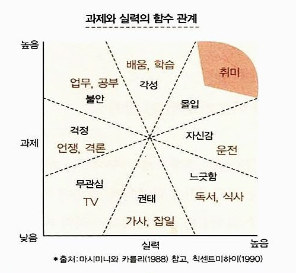

# **엘라스틱서치 바이블** 

> `12월 6일부터 01월 17일까지`

실무에서 엘라스틱서치와 맞닿아 있는 업무를 할 때 모르고 넘어가는 것이 많아 불편하고 찝찝한 느낌이 있었다.  
그리고 데이터 팀의 공유 사항을 들으면 이해 못하는 것이 많았다.  

1. 운영중인 여러 개의 검색 클러스터, ES 내부 아키텍처에 대한 이해가 없어 검색 이슈가 발생했을 때의 상황과 해결 방법을 이해할 수 없음
2. ES QueryDSL 작성할 때 마다 구글링을 하는 불편함
3. 현재 운영중인 ES 환경의 문제점과 개선점에 대해 고민하거나 공감할 수 없음
  
위와 같은 이유로 엘라스틱서치를 공부해야겠다는 생각이 들었고 사내 스터디를 만들어서 읽어보았다.  
ES에 대한 지식 하나도 없었지만 읽기 편했고 대부분의 개발책은 외국에서 쓰여서 번역본으로 읽게 되는데 이 책은 내국인이 써서 읽기 편했다.  
  
읽으면서 내용들을 [정리](https://github.com/jdalma/footprints/tree/main/%EC%97%98%EB%9D%BC%EC%8A%A4%ED%8B%B1%EC%84%9C%EC%B9%98)해 보았다.  
  
1. 엘라스틱서치 클러스터 수준에서 루씬 세그먼트와 루씬 commit, flush 그리고 translog 수준까지의 **개괄적인 구조**
2. 복잡한 수준의 쿼리를 작성하면서 설명하진 않지만 기본적인 여러 종류의 **ES Query DSL**
3. **인덱스 설정과 필드 타입**
4. 문서를 검색하거나 조작하는 **여러 문서 API**
5. 저수준, 고수준 REST 클라이언트와 최신 자바 클라이언트 사용 방법
  
위의 내용들을 재밌게 읽었다.  
하지만 아래와 같이 실제 운영하는 인원에게 도움이 되는 내용들은 흥미가 없었다.  
1. 엘라스틱서치, 키바나, 클라이언트 등을 TLS로 구성하는 방법
2. 인덱스, 샤드 운영 전략과 스냅샷 복구 방법
3. 코드 레벨의 동작과 커스텀 플러그인
  
전반적인 내용으로 봤을 때, 엘라스틱서치 클라이언트 입장이거나 엘라스틱서치의 관계자인 개발자보다는 클러스터를 직접 운영하고 튜닝하거나 깊은 내용의 이해를 필요로 하는 개발자한테 도움이 많이 될 것으로 보인다.  
그래도 학습하면서 현재 실무 운영 환경과 책의 내용을 비교하면서 읽을 수 있었고 같은 회사의 팀원들과 읽어서 더욱 재밌게 읽었던 것 같다.  
이 책으로 진행한 스터디 덕분에 실무 환경에서 모르고 넘어갔던 부분들을 배울 수 있었고 백엔드만의 영역이 아니라 데이터 팀의 영역에 대한 시야도 넓어진 느낌이다.  

# **실용주의 프로그래머**

> `12월 8일부터 01월 18일까지`

처음엔 3,4주면 다 읽을 줄 알았는데 6주가 걸렸다. 너무 기대해서 그런지 지루한 느낌이 있었다.  
기술 책이라기 보다는 **개발자라는 직업의 장인 정신에 대한 이야기** 를 한다고 느꼈다.  
누구나 문제에 접근하는 태도와 방식, 철학에 차이가 있는 **실용주의 프로그래머** 가 될 수 있다고 설득한다.  
  
1. 자신의 경력에 대한 책임을 지고, 자신의 무지나 실수를 주저없이 인정하며 정직하고 솔직해야 한다.
2. 어설픈 변명 말고 대안을 제시하라.
3. 프로그램을 과도하게 장식하거나 지나칠 정도로 다듬느라 망치지 말라.
4. 왜냐고 다섯 번 묻기
5. 직교적인(응집도가 높은) 시스템을 작성하도록 노력하여 관련 없는 것들 간에 서로 영향이 없도록 하라.
6. 누군가에 문제를 설명해봐라. 고무 오리라도 괜찮다.
7. 여러분은 완벽한 소프트웨어를 만들 수 없다.
8. 이 책의 저자는 문제를 찾고 원인을 밝히기 위해서는 사고가 난 지점에서 "일찍 멈추기"를 장려한다.
9. has-a가 is-a 보다 낫다.
10. 의도적으로 프로그래밍하라. 우연에 기대지 말고 가정에 의존하지 마라. 신뢰할 수 있는것에만 기대라.
11. 리팩토링가 기능 추가를 동시에 하지 말라.
12. 요구 사항 문서는 의뢰인을 위한 것이 아니다.

책을 읽으면서 표시해놓은 인덱스들을 작성해봤다. 위의 내용만 보아도 책에서 설명하는 범위는 굉장히 넓은 것을 알 수 있다.  
개인적으로는 `철학, 편집도구, 클린코드, 테스트, 태도, 문서화, 협업 등` 내용이 너무 포괄적이라서 흥미를 느끼지 못한 것 같다.  
순서대로 읽기 보다는 목차에서 관심있는 주제들을 골라서 읽는 것을 추천한다.  

# **HTTP/2 인 액션**

> `12월 13일부터 1월 20일까지`

사내에서 Armeria + gRPC를 통한 POC를 진행한 적이 있는데 HTTP/2에 대한 이해가 없었어서 힘들었던 경험이 있다.  
위의 경험 때문에 [코드숨 스터디](https://www.codesoom.com/courses/soomtudy) 모집을 보고 바로 참가했다.  
  
HTTP/2가 개선되긴 했지만 HTTP/1.1과 비교해서 **명확하게 어떤 부분이 개선되었는지** , 스트림에 대해서는 들어봤는데 **명확하게 어떤 방식으로 통신이 이루어지는지** 알지 못했다.  
이 책은 HTTP/2 뿐만이 아니라 HTTP/1.0, HTTP/1.1, HTTPS, TCP, QUIC에 대해서도 설명해주어서 가려웠던 부분을 시원하게 다 긁어준다.  

1. HTTP/1.1까지의 문제점과 한계
2. HTTP/2 개념과 프레임, 단일 연결 다중 요청
3. HTTP/2 푸시, 최적화
4. HTTP/2 스트림, 흐름 제어, 스트림 우선순위
5. QUIC과 HTTP/3를 설명하기 위한 TCP의 비효율성과 UDP를 선택한 이유

이번 책으로 인해서 HTTP/2가 **어떤 문제를 어떻게 해결하는지, 한계는 무엇인지를 이해할 수 있었다.**  
  
스터디에서 [매 챕터마다 문제를 제공](https://github.com/CodeSoom/http2-in-action)해줘서 [문제를 풀면서 학습](https://github.com/jdalma/footprints/blob/main/%EC%8A%A4%ED%84%B0%EB%94%94/HTTP2%EC%9D%B8%EC%95%A1%EC%85%98.md)할 수 있었어서 좋았다.  
네트워크 내용이 너무 방대해서 항상 네트워크 책을 읽을 때 마다 힘들었는데, 이번 책은 HTTP 프로토콜에 대해 집중적으로 설명해줘서 다른 책에 비해 덜 힘들었던 것 같다.  
  
요즘 많은 회사에서 HTTP/2를 적용한 통신 방법을 채택하고 있고 전반적인 네트워크 변화의 흐름에 대해 이해하기 위해서는 정말 좋은 책이라고 생각한다.  
  
- [gRPC를 사용하는 기업들](https://www.codenary.co.kr/techstack/detail/grpc)
- [Armeria로 Reactive Streams와 놀자!](https://engineering.linecorp.com/ko/blog/reactive-streams-with-armeria-1)
- [뱅크샐러드 프로덕션 환경에서 사용하는 golang과 gRPC](https://blog.banksalad.com/tech/production-ready-grpc-in-golang/)
- [쿡앱스는 gRPC를 어떻게 사용하나요?](https://story.cookapps.com/articles/187)

# **타입으로 견고하게 다형성으로 유연하게**

> `1월 19일부터 2월 20일까지`
  
> 정적 타입 언어는 타입 검사기를 통하여 생산성을 높이기도 좋고, 불필요한 실행 중 검사를 없앨 수 있어서 프로그램이 좋은 성능을 내는데 유리하고 큰 프로그램을 만들 때 타입 검사기의 위력은 강력하다.  
> 타입 검사기가 거부하는 코드를 줄이고 정적 언어를 잘 사용하기 위해 여러 경우에 대한 다형성,가변성에 대한 이해와 타입 검사기와 친해지도록 노력해야 한다.  
  
이 책을 통해 아래의 내용을 학습할 수 있다.  

1. **여러 종류의 다형성**
2. (JVM 언어에서는 지원하지 않는) **다른 언어의 기능**
3. **최대, 최소 타입**
4. **제네릭 가변성** 
5. **PECS를 지켜야하는 이유**
6. 타입 클래스, 카인드
  
제일 와닿았던 부분은 제네릭 가변성에 대한 이해가 없을 때 이게 왜 안되는지 몰랐던 부분들을 깨닫게 도와줬다.  
[PECS : producer-extends, consumer-super](https://github.com/jdalma/footprints/blob/main/effective-java/item31_%ED%95%9C%EC%A0%95%EC%A0%81%20%EC%99%80%EC%9D%BC%EB%93%9C%EC%B9%B4%EB%93%9C%EB%A5%BC%20%EC%82%AC%EC%9A%A9%ED%95%B4%20API%20%EC%9C%A0%EC%97%B0%EC%84%B1%EC%9D%84%20%EB%86%92%EC%9D%B4%EB%9D%BC.md#pecs--producer-extends-consumer-super)를 외워서 사용했는데 왜 저렇게 제한해야 하는지 더 깊은 이해를 할 수 있도록 도와주었다.    
  
이 책을 읽으면서 안다고 착각했던 부분들이 많았다는 것을 깨달았다. 정적 타입 언어에 대한 이해를 한층 더 높여준 책이다.  
개발하면서 타입 검사기가 거부하는 상황이 발생하면 IDE의 도움을 받아 어영부영 넘어간 경험 또는 제네릭이나 제네릭을 통한 타입 매개변수 제한을 사용할 때 타입 검사기가 왜 거부하는지 이해하지 못 했던 경험이 있다면 이 책은 큰 도움이 될 것이다.  

# **프레임**

> `2월 12일부터 2월 21일까지`

책을 추천받아 읽어보았다. 아마 현재를 만족하지 못하고 불평만 하며 가지지 않은 것에 대한 욕심만 높아 스트레스를 받는 나를 보고 추천해준 것 아닐까 싶다.  
책 이름을 보고 따분한 자기계발서로 예상할 수 있지만 연구 결과에 기반한 심리학 내용을 전개하여 흥미롭게 읽었다.  
  
> **프레임**은 "세상을 바라보는 마음의 창"이다. 어떤 문제를 바라보는 관점, 세상을 향한 마인드셋, 세상에 대한 온유, 사람들에 대한 고정관념등이 모두 프레임의 범주에 포함되는 말이다.  
> 마음을 비춰보는 창으로서의 프레임은 특정한 방향으로 세상을 보도록 이끄는 조력자의 역할을 하지만, 동시에 우리가 보는 세상을 제한하는 검열관의 역할도 한다.

> **프레임**은 우리가 지각하고 생각하는 과정을 선택적으로 제약하고, 궁극적으로는 지각과 생각의 결과를 결정한다.

> **프레임**은 다양한 형태를 지닌다. 우리의 가정, 전제, 기준, 고정관념, 은유, 단어, 질문, 경험의 순서, 맥락 등이 프레임의 대표적인 형태다.

이 **프레임** 에 대한 특성과 연구 결과들을 설명한다.  
그중에 인상깊은 연구들이 있다.  

1. **동메달이 은메달보다 행복한 이유**
2. **이미지 투사**
   - 타인을 평가하는 기준은 자기 자신을 평가할 때도 그 기준을 중요하게 생각한다.
3. **행동의 원인은 사람인가? 상황인가?**
   - 나치의 반인륜적인 악행을 행한 사람들을 "소수의 악인, 소수의 사이코패스가 저지른 악행" 이라는 **사람 프레임** 으로 보지 않는 것 
   - 악이 사람이 아니라 상황에 의해 유발된다는 **상황 프레임** 으로 보는 것
4. 위의 연구에 힘을 싣는 **권위에 대한 위험한 복종 연구**
   - 지시자, 교사, 학생 3명의 인원 중 교사만 실험 대상이다.
   - 지시자는 교사에게 학생이 오답을 말하면 전기가 통하는 스위치를 누르도록 지시
   - 학생이 고의로 오답을 선택하게 하여 전기 충격을 15V에서 450V 까지 단계적으로 올렸다.
   - 마지막 수준까지 전기 충격을 가할 사람의 수는 극소수라고 생각했지만 67%에 해당하는 사람이 끝까지 복종
5. **방관자 효과**
   - 살인 사건에 최소한 49명의 목격자가 있었지만 경찰에 즉각적으로 알라지 않고 서로 떠넘김으로써 골든타임을 놓쳐 사망한 사건
6. **군중의 힘**
   - 고층 빌딩에 뛰어내려 자살하려는 긴박한 상황에 군중들이 오히려 자살을 부추기는 상황
   - 개인이 군중이라는 상황 속에서 자아 실종 현상을 심리학에서 "몰아" 라고 한다.
7. **가장 긴 선을 고르세요.**
   - 8명 중 1명을 속이는 실험, 8명 중 7명은 가장 긴 선을 선택하라는 질문에 동일하게 잘못된 답을 선택
   - 그 중 실험 대상인 1명은 처음엔 맞는 답을 선택하였지만 시간이 지날수록 7명이 선택한 잘못된 답을 선택한다.
   - 하지만 7명의 동조자 중 1명이라도 정상적인 답을 선택하면 정답률이 100%에 가깝게 회복된 것
   - 조금 다르게 7명의 동조자 중 1명이 다수가 선택한 오답이 아닌 다른 답을 선택하여도 정답률이 상승한 것
   - **집단의 다양성을 보장하여 우리 모두의 소신을 이끌어내야한다.**
8. **매몰 비용**
   - 할인할 때 3000원 주고 스파게티를 사서 집에왔지만 친구가 온다하여 다시 사러 갔을 때는 6000원 주고 스파게티를 사왔다.
   - 친구가 못 온다고 하였을 때, 두 개의 스파게티 중 많은 사람들이 비싼 스파게티를 선택하는 것
   - 아깝다는 이유만으로 제값에 산 걸 먹어야만 된다고 생각하는 **손실에 대한 원초적 거부**

책이 나를 설명한다고 느낄 정도로 읽으면서 뜨끔한 적이 많았다.  
그리고 읽으면서 [유연함의 힘](https://jdalma.github.io/2023y/bookReview/bookReview/#%EC%9C%A0%EC%97%B0%ED%95%A8%EC%9D%98-%ED%9E%98)이 떠올랐다. 유연함의 힘은 커리어, 회사생활에 대한 내용이였다면 이 책은 삶에 대한 내용을 설명한다고 느꼈다.  
  
심리학에 흥미가 있는 사람이라면 추천해주고 싶다.  

# **몰입**

> `2월 21일부터 27일까지`

이 [영상](https://www.youtube.com/watch?v=TTk9Q5FyD3s&ab_channel=%EC%A7%80%EC%8B%9D%EC%9D%B8%EC%82%AC%EC%9D%B4%EB%93%9C)을 보고 책에 대해 알게되었다.  
책을 읽거나 업무를 할때 집중력을 금방 잃는다는 것을 느꼈다. 그리고 잠들기전에 유튜브 쇼츠를 보는 버릇이 생겼다.  
유튜브 쇼츠를 보는 것만으로도, 그저 평범한 영상임에도 불구하고 기분이 좋아지고 편안함을 느끼는 자신을 발견하고 놀랐다.  
쇼츠를 볼 때는 넋 놓고 있는 것처럼, 아무 생각없이 뇌를 뺀것처럼 손가락만 슥슥 움직이는 스스로를 보고 심각하구나라고 생각했다.  
이런 습관을 없애고 집중력을 높일 수 있는 방법이 있을까 궁금하여 읽게되었다.  
  
> "천재와 보통 사람 사이의 지적 능력 차이는 질보다는 양의 문제이다."

저자는 천재와 보통 사람의 차이는 재능 문제가 아니라 생각을 하는 절대적인 양의 차이라고 강조한다.  
그리고 (노력하면) **누구나** 몰입에 빠질 수 있고, 즐길 수 있으며, 몰입을 통하여 평소에는 겪어보지 못한 행복감을 느낌과 동시에 삶의 질이 상승한다고 말한다.  

위의 이미지처럼 실력과 과제의 난이도가 적당한 균형을 갖춰야 몰입에 이를 수 있다고 한다.  
몰입에 빠지면 수면 상태에서 고도로 활성화된 장기 기억을 활용하여 잠을 자면서도 문제를 풀려는 생각을 계속한다고 한다.  
절대적인 생각의 양을 늘려서 우연한 영감을 떠올리는 기회를 많이 만드는 것이다.  
  
> **세런디피티**는 완전한 우연으로부터 중대한 발견이나 발명이 이루어지는 것을 말하며 특히 과학연구의 분야에서 실험 도중에 실패해서 얻은 결과에서 중대한 발견 또는 발명을 하는 것을 말한다

예전에 팀 프로젝트로 서비스 개발할 때 한 번 느껴본 것 같다. 잠자려고 누울때도 내일 뭐 개발할지 고민하고 걸을때도 문제에 대해 생각했었다. 그 이후로는 한 번도 경험해본 적 없다..  
  
> 문제 해결을 목적으로 몰입을 시도할 경우에는 `"어떻게 하면 되는가?"`라는 물음보다는 `"왜 그렇게 되는가?"` 하는 물음이 훨씬 더 절실한 감정을 불러일으킨다.  
> 대체로 `왜`에 대한 답은 한 가지 원인으로 생각을 집중시켜서 수렴적 사고를 유도하지만, `어떻게`에 대한 답은 여러가지 가능성을 열어두어, 집중을 분산시키는 발산적 사고를 유도하는 경향이 있기 때문이다.  
> 초기에는 `왜`라는 형식의 물음으로 시작하여 `어떻게`라는 분산적 사고로 들어가야한다.

위와 같이 사고에 대한 방법과 하루에 한 시간 운동 그리고 천천히 생각하기를 통하여 몰입에서 잘 나오고 지치지 않게 페이스를 조절해야 한다고 한다.  
이런 몰입을 하는 능력은 곧 경쟁력이다. **깊이 생각하지 않고 주어진 일을 밤새워 열심히 하면 자신이 발전하기 보다는 소모된다는 느낌을 갖는다.**  
  
> **일상속에서 20분 생각하기 훈련을 해보자.**  
> 우리는 머리를 잠시도 비워두지 않는다. 항상 무엇인가를 생각하고 있다.  
> 사람은 한 시간에 2천 가지를 생각하고 하루 24시간 대략 5만 가지를 생각한다고 한다.  
> 그래서 `오만가지 생각`이라는 말이 생겼다. 그러나 이것은 **상념에 해당하는 '생각나기' 이다.**  
> 이것은 내가 내 뇌의 주인이 되는 것이 아니고 의도되지 않은 상념이 자리를 차지하고 있는 것이다.  
> 자신이 뇌의 주인이 되어 문제에 대한 해결을 향한 체계적인 사고를 하는 **'생각하기'** 를 해야 두뇌를 활용하고 즐거움을 얻을 수 있다.

생각하는 시간을 점진적으로 늘려가는 훈련과 천천히 생각하기 훈련을 통하여 몰입에 빠지거나 재몰입하기 쉽도록 해야한다.  
저자는 `"해야 할 일을 즐기며 행복하게 사는 방법. 나는 그 해답을 '몰입'에서 찾았다."` 라고 한다.  
올해 연말회고에 몰입한 사례를 기록하기 위해 노력해봐야겠다.  

# **도둑맞은 집중력**

> `2월 28일부터 3월 8일까지`

몰입을 읽은 후에 집중력에 대한 관심이 커져서 읽어보았다.  
무엇인가에 깊게 집중하지 못하면 항상 `"왜 이렇게 집중이 안되지?"`, `"이 정도밖에 집중을 못하나?"` 라며 스스로를 탓했다.  
하지만 이 책에서는 스스로의 문제가 아니라 **주변 환경**, **시스템** 에 대해 지적한다.  
  
저자는 여러 심리학자, 연구원, 엔지니어 등과 나누었던 이야기들을 전달한다.  
  
그 중 [스키너 상자](https://ko.wikipedia.org/wiki/%EC%8A%A4%ED%82%A4%EB%84%88_%EC%83%81%EC%9E%90)이야기가 인상 깊다.  
비둘기를 새장에 넣어 특정 행동을 하면 먹이를 주어 비둘기의 움직임을 제어하는 것이다. 이 강화 훈련을 통해 보상만 제대로 하면 많은 동물들이 우리가 선택한 행동들을 수행한다는 것이다.  
스키너는 이 원칙으로 인간의 행동들을 설명한다. 자신이 스스로 선택을 내린다고 확신하며 자유로운 존재라고 믿지만 다 환상이라고 주장한다. 우리의 집중력은 그동안 살면서 경험한 강화 훈련의 총합이라고 말이다.  
인스타그램의 설계자들은 이 강화 훈련을 인스타그램의 '하트'와 '좋아요'를 통해 수십억 사용자에게 적용했다.  
  
하지만 저자와 많은 미국 심리학자들은 이렇게 생각하지 않았다. 사람들의 집중력은 강화 훈련으로 생기는 것이 아니라 내면에 있는 **몰입** 이라고 주장한다. (이전에 읽은 "몰입"의 내용과 비슷한 설명들을 한다.)  
이 몰입에 쉽게 빠져들기 위한 집중력을 강화하기 위해 수면, 음식, 긴 텍스트를 읽는 능력 등의 중요성을 설명한다.  
  
또한 저자가 강조하는 우리가 집중력이 떨어지는 이유 중 하나는 거대 테크 기업들의 비즈니스 모델 때문이라고 설명한다.  
조금 더 서비스를 오래 사용하도록 자극적이고 비관적인 내용을 노출시켜 사용자들의 [부정성 편향](https://brunch.co.kr/@brilife78/204)을 자극한다며 기업의 사회적 책임에 대해 이야기 한다.  
  
> "나는 깊이 집중하는 능력이 식물과 같다고 생각한다. 우리의 집중력이 잘 자라서 잠재력을 온전히 피워내려면 특정 조건이 갖춰져야 한다."  
> "몰입을 느끼고, 책을 읽고, 자신이 집중하고 싶은 유의미한 활동을 찾고, 자기 삶을 이해할 수 있도록 생각이 배회할 공간을 마련하고, 신체 활동을 하고, 잘 자고, 뇌가 건강하게 발달할 수 있도록 영양가 있는 음식을 먹고, 안정감을 느껴야 한다."
  
항상 집중력이 낮은 스스로를 탓했었는데 항상 환경이나 시스템 탓을 할 순 없지만 주변 환경과 시스템에 대해 생각해본 계기가 됐다. 

# **개발자의 글쓰기**

> `3월 9일부터 3월 13일까지`

책이 얇고 글씨도 커서 금방 읽은 것 같다. 글을 쓸때 꼭 포함시켜야지 하는 중요한 내용들을 위주로 쓰다보면 문맥 연결이 잘 되지않을 때가 있어 글쓰기 책을 한번 읽어보고 싶어 이 책을 읽어보았다.  

<h4>서술식, 개조식, 도식의 차이</h4>

- **서술식** : `~다.`로 끝나는 완전한 문장으로 구성된 글을 말하며, 무엇을 설명하거나 논증할 때 주로 사용하는 방식이다.
- **개조식** : 어떤 사항을 나열할 때 사용하며 종결 어미 대신 명사나 용언의 명사형(`~했음`)으로 끝내는 것이다.
- **도식** : 사물의 구조나 관계, 상태를 그림이나 서식으로 보여주는 것이다.
- 줄거리가 있는 설명이나 이야기라면 **서술식** , 여러 가지 종류의 항목과 내용이 반복되거나 서술식에서 강조가 필요한 내용이라면 **개조식** , 각 항목이나 사항의 관계를 명확히 규정하고 싶다면 **도식** 이다.

내가 작성하려하는 글의 특징을 잘 이해하여 선택하여야 한다.

<h4>네이밍 컨벤션</h4>

이 네이밍 컨벤션은 항상 같은 조직 구성원들의 노력이 동반되어야 한다고 생각한다. 사내에는 네이밍 컨벤션이 따로 없지만 이 책의 내용이 좋은 가이드가 되어준 것 같다.  
**반대되는 단어를 선택할 때 일관성과 개연성이 있어야 한다.**  

- **이상, 초과, 이하, 미만** : and over, over, or under, under
- **중단에 대한 단어 선택**
  - 잠시 중단하고 재시작 가능할 때는 `stop`, 완전히 중단되어 재시작 가능성이 없을 때 `end`, 끝장을 봐서 재시작을 고려할 필요도 없을 때 `finish`
  - 다음 단계의 시작을 중단했을 때 `suspend`, 중단한 어떤 의도가 있을 때 `hold`
- **어떤 값을 가져올 때**
  - 어떤 값을 돌려받아서 반환하는 함수일 때 `get`, 검색해서 가져온다는 의미인 `retrieve`, 다른 것을 가져가지 못하게 독점하고자 할 때는 `acquire`
  - 현재 값을 가리키는 포인터가 다음 값으로 이동한 것을 가져올 때는 `fetch`
- **어떤 값을 만들거나 수정할 때**
  - 어떤 값을 정해진 틀에 넣을 때 `set`, 정해진 틀이 없으므로 먼저 틀을 만들때는 `create`
  - 내용을 단순히 바꾸는 `change`, 잘못된 것을 바로잡을 때 `modify`, 기존 내용과 달라졌음을 분명히할 때 `revise`

코드를 보는 개발자 사이에 일관적이고 개연적인 합의만 되어 있다면 어떻게 쓰든 상관없다.
[오픈소스의 네이밍 특징들](https://brunch.co.kr/@goodvc78/12#comments)을 읽어보는 것도 추천한다.

<h4>기술 블로그의 4종류</h4>

- **저** : 직접 경험하고 실험한 과정이나 결과
- **술** : 어떤 것을 분석하여 의미를 풀이하고 해석한 것
- **편** : 산만하고 복잡한 자료를 편집해 질서를 부여한 것
- **집** : 여러 사람의 견해나 흩어진 자료를 한데 정리한 것

이 책에서 더 좋은 많은 내용들을 서술한다.  
느끼기로는 글쓰기 가장 중요한점은 내가 쓸 글의 특징과 이 글을 읽을 독자의 관심이 무엇인지, 비즈니스 관점의 글쓰기가 필요하진 않은지 잘 판단하여야 한다는 것이다.  

1. 이 글을 왜 쓰는지?
2. 이 글을 읽는 독자는 누구인지?
3. 이 글을 읽는 독자에게 무엇을 말하려고 하는지?
4. 이 글이 주장하는 바가 무엇인지?
5. 이 글이 주장하는 바의 근거가 분명한지?

문제를 해결하면서 만난 모든 문제를 순차적으로 서술하기 보다는 문제 해결의 핵심 내용들을 정리하여 간결하게 써봐야겠다.  

# **내 코드가 그렇게 이상한가요?**

> `3월 14일부터 3월 26일까지`

<iframe src="https://www.facebook.com/plugins/post.php?href=https%3A%2F%2Fwww.facebook.com%2Ffupfin.geek%2Fposts%2Fpfbid09WddbAYkCwAaB3xKi4tazk2WzvuFhzqGvUhqYMCDdxxGJ7stEcm8nLMJbMdGpudZl&show_text=true&width=500" width="500" height="250" style="border:none;overflow:hidden" scrolling="no" frameborder="0" allowfullscreen="true" allow="autoplay; clipboard-write; encrypted-media; picture-in-picture; web-share"></iframe>

(박성철님의 이 글을 보고 구매해서 읽어보았다.)  
대부분의 개발자들은 코드를 작성하는 시간보다 코드를 읽고 이해하려 노력하는 시간이 더 많을 것이다.  
그 이해를 바탕으로 코드를 수정하거나 기능을 추가하고 테스트를 할 것이다. 하지만 이 행위는 말처럼 쉽지 않다.  
  
이해하기 힘든 코드, 의도를 전혀 알 수 없는 코드들을 맞닥뜨린 경험 또는 수정이나 확장했을 때 어디까지 영향을 끼치는지 확인하다가 하루가 다 가버린 경험, 냄새나는 코드인 줄은 알지만 어떻게 수정해야 할지 몰라서 결국 냄새나는 코드를 또 작성하며 죄책감을 느낀 경험이 있다면 이 책이 재밌게 읽힐 것이다.  
이 책에서는 이와같이 개발 능력을 떨어뜨리고 소프트웨어의 성장을 방해하는 설계, 또는 구현상의 문제를 `악마`에 비유하며 악마를 인식할 수 있는 시각과 악마가 코드에 스며들지 못하도록 예방하고 무찌를 수 있도록 도와준다.  
  
많은 책에서 **응집도와 결합도** 이야기가 자주 나오는데 항상 뉘앙스로 이해 했었다.  
이 책에서는 명확하게 **데이터와 로직 등이 분산되어 있는 것을 응집도가 낮은 구조** 라고 정의한다.  
응집도가 낮고 결합도가 높을 때 발생하는 `코드 중복`, `수정 누락`, `가독성 저하`, `초기화되지 않은 객체`, `잘못된 값 할당` 들을 설명해준다.  
그렇다고 코드 중복을 해결하기 위해 섣부른 일반화를 해서도 안된다. **코드 중복을 제거하는것이 핵심이 아니라 비즈니스적인 책무를 일반화 해도 괜찮은지를 먼저 고민해야한다.**  
즉, **같은 로직, 비슷한 로직이라도 개념이 다르면 중복을 허용해야 한다.**  
  
1. 성숙한 클래스를 설계하기 위해 클래스의 내부 필드와 그 필드를 가공하는 로직이 분산되지 않도록 노력해야하며 **인스턴스 변수가 잘못된 상태에 빠지지 않게 하기 위한 구조를 만드는 것임을 명심해야 한다.**  
1. `값 객체`, `완전 생성자`, `불변`, `부수 효과 방지` 는 기본적으로 유의해야 한다. 그렇다고 응집도를 높이기 위해 로직을 한곳에 모아 강한 결합 구조를 만들지 않도록 신경써야 한다.  
2. `..Manager`, `Person`, `Product`와 같은 너무 범용적인 이름을 사용하여 많은 책임과 관심사를 가지도록 하면 안된다. **목적 중심 이름 설계**를 명심해라.  
3. 관심사가 다르고 관계없는 책무를 가진 메서드는 동사 + 목적어 형태가 되는 경향이 있으므로 **메서드 이름은 `동사` 하나로 구성되게 해라.**
4. **모델**은 `특정 목정 달성을 위해서, 최소한으로 필요한 요소를 갖춘 것`이다. 그렇기에 **목적 달성의 수단** 이며 목적별로 모델링해야 한다.
5. **모델 != 클래스** 이다. 일반적으로 모델 하나는 여러 개의 클래스로 구현된다. 클래스 설계와 구현에서 무언가를 깨닫는다면, 이를 모델에 꾸준하게 피드백해야 한다. 그렇지않으면 서로 괴리가 생긴다.
6. `일급 컬렉션`에 대한 내용을 [넥스트스텝 코틀린 교육](http://localhost:8000/2023y/kotlinCleanCode/)에서 접했을땐 코틀린에서 지원하는 컬렉션 공통 함수들을 사용하기 불편하다고 생각해서 와닿지 않았었는데 이 책을 통해 잘못이해하고 있었다는 것을 느꼈다.  
  
인상 깊은 내용들은 이 정도로 정리할 수 있겠다. 중후반부 까지는 이렇게 좋은 코드를 작성하는 방법, 설계에 대한 강조, 모델의 개념들에 대해 설명했다.  
([엘레강트 오브젝트](http://localhost:8000/2023y/bookReview/bookReview/)가 자주 떠올랐다.)  
  
대체로 이렇게 코드,설계 레벨에서 마무리짓는데 이 책은 후반부에 **레거시 코드와 엔지니어의 성장 가능성의 관계**, **설계를 방해하는 환경**, **리뷰의 의의** 들도 설명하면서 자신의 업무 환경을 개선하기위한 용기와 방법을 알려준다.  
팀에 새로운 인원이 투입된다면 온보딩 기간에 읽어야 할 책으로 선정해도 무방할 정도로 좋은 책이였다.  
  
이 책 덕분에 [레거시 코드 활용 전략](https://m.yes24.com/Goods/Detail/64586851)에 흥미가 생겨 읽어볼 예정이다.  

# **타이탄의 도구들**

> `3월 27일부터 4월 1일까지`

개인적으로 자기계발서 책을 선택할 때는 어떤 주제에 특정적으로 관심이 생기거나 "몰입"과 "프레임", "이너게임"처럼 심리학을 근거로 연구 결과에 기반한 자기계발서들을 선택하려 한다.  
이런 종류의 성공한 사람들의 이야기를 전달하는 자기계발서를 좋아하지 않다보니 거부감이 드는 내용도 있었다.  
원래는 조금 읽다가 덮었겠지만 추천받은 책이라서 끝까지 읽어보았다.  
  
이 책은 세상에서 가장 성공한 사람들, 특정 분야에서 거대하고 영향력이 큰 사람들 `타이탄`과 나눈 이야기들을 전개한다.  
그중에 인상깊은 내용만 간략하게 적어보면

1. 나는 가진 것의 가치를 낮게 보고 가지지 않은(못한) 것에 집착한다는 이야기를 들은적이 있다. 
   - 타이탄들은 `"추구하는 것에만 집착하면 현재 갖고 있는 걸 잃는다. 반대로 현재 갖고 있는 것에 감사하면 마침내 추구하는 것을 얻게 된다."` 라고 말한다.
   - '내가 감사하게 여기는 것들'을 떠올려라
2. 나는 회의를 하거나 토론할 때 감정적으로 동요할 때가 있다.
   - `"비판하는 사람도, 그것을 달게 받는 사람도 모두 자기 자신과 상대, 회사를 위해 기여하고 있다는 걸 깨닫아야 한다."`
   - 점점 똑똑해진다는 것은 점점 강해진다는 뜻이니 강력한 의견과 침착한 태도를 유지해라
3. 전속력으로 달릴 때의 속도와 즐기면서 달릴 때의 속도 차이는 크지 않다.
   - `"우리는 천천히 해도 충분하다. 우리가 저지른 실수들은 대부분 나태함 때문이 아니라 야심과 욕심 때문이다."`
   - "그러니 명상을 하든 컴퓨터 모니터 앞에서 벗어나 나 자신을 위해 시간을 쓰든, 아니면 함께 있는 사람에 집중하든지 속도를 늦춰야 한다." 
4. 부정적인 감정에 휩쓸리지 마라. 화를 내고 속상해하는 것은 백해무익이다. 그 시간에 `대안`을 찾아라.
5. `"당신은 인생의 몇 퍼센트를 화를 내고 걱정하고 좌절하는데 사용하고 있는가?"` 
   - 책 에서는 [우리에게 소중한 시간은 얼마나 남았을까?](https://m.blog.naver.com/stranger234/221394229740)를 추천하지만 개인적으로는 [낙관적 허무주의](https://www.youtube.com/watch?v=oBIo2AyjNMo&list=LL&index=106&ab_channel=%ED%95%9C%EB%88%88%EC%97%90%EB%B3%B4%EB%8A%94%EC%84%B8%EC%83%81%E2%80%93Kurzgesagt)도 추천한다.
6. `"자기 전에, 꼭 생각할 거리를 정해두고 자라."`
   - "몰입"에서도 수면을 취하면서 무의식과 잠재의식으로 독창적인 해결책들을 찾는다고 하였는데 이 책에서도 관련 내용이 나왔다.
7. 사회생활을 한다면 명심하라. **위기에 처했을 때 모욕감없이 자존심을 굽힐 수 있게 해주고, 편견없이 모든 유용한 조언들을 스폰지처럼 흡수할 수 있게 해준다.**
   - 첫째. 당신은 당신이 생각하는 것만큼 유능하거나 중요한 인물이 아니다.
   - 둘째. 당신은 태도를 조금 바꿀 필요가 있다.
   - 셋째. 책이나 학교에서 배운것들, 당신이 안다고 생각하는 사실들은 대부분 시대에 뒤떨어졌거나 잘못된 것들이다.
8. 분노가 찾아온다면 그 존재를 의식적으로 알아차리고, 이름을 붙이고, 바라보는 것. 그것이 우리에게 가장 필요한 지혜이자 최선이다.

그리고 책 마지막에 [크리스토퍼 소머의 '단 하나의 결단'](https://brunch.co.kr/@yunseop17/15)의 내용도 인상깊었다.  
이루고 싶고 원하는 것을 위해 노력하고 있지만 발전이 보이지 않는다고 생각하는 사람이라면 꼭 읽어봤으면 좋겠다.  
  
이 글 시작에 이런 종류의 자기계발서를 좋아하지 않는다고 적었지만 위에 작성한 내용 말고도 인상 깊은 내용들이 많았다.  
모든 내용들이 다 와닿지는 않았지만 주옥같은 조언들이 많으니 나와 같이 이런 종류의 자기계발서를 기피하고 있다면 한 번은 읽어보길 추천한다.  

# **UML 실전에서는 이것만 쓴다** ~ing

# **Real My SQL 1권** ~ing

# **OAuth2 인 액션** ~ing

# **자바 네트워크 프로그래밍** ~ing

# **Real My SQL 2권** 예정

# **네티 인 액션** 예정

# **오브젝트** 예정

# **이펙티브 코틀린** 예정

# **이펙티브 자바** 예정

# **개발자를 위한 레디스** 예정

# **Nginx 쿡북** 예정