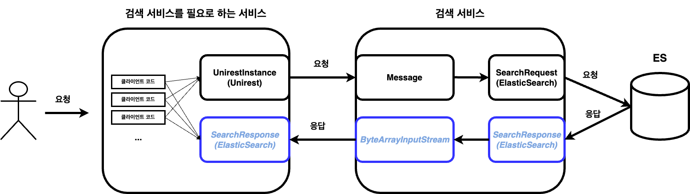
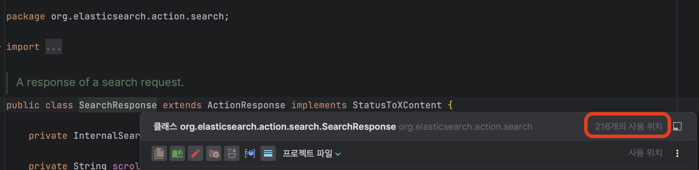
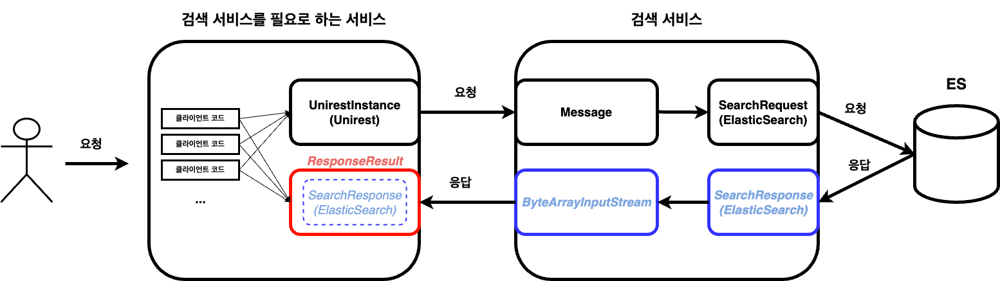
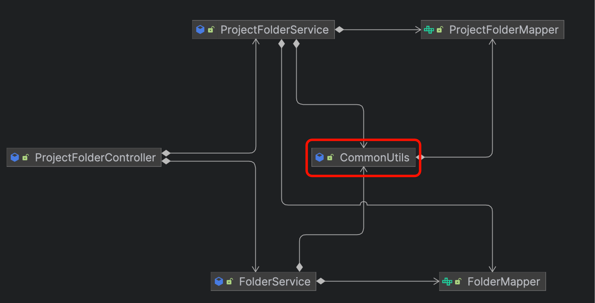
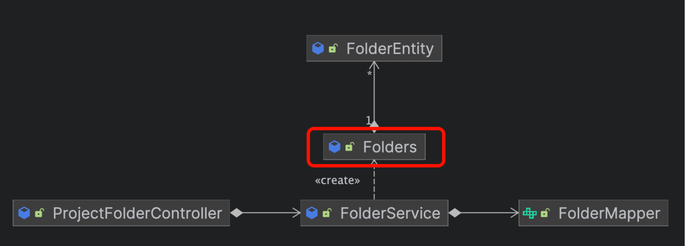

엉클 밥이 설명한 [보이스카웃 규칙](https://www.oreilly.com/library/view/97-things-every/9780596809515/ch08.html)을 실천한 경험을 정리해보려 한다.  
보이스카웃 규칙에 대해서는 [종립님이 정리한 글](https://johngrib.github.io/wiki/jargon/boy-scout-rule/)을 읽어보자.  
  
# 라이브러리에 대한 의존성 제한하기



검색 서비스에 의존하는 서비스들의 클라이언트 코드들이 위의 그림과 같이 응답으로 받는 ElasticSearch의 `SearchResponse`에 직접 의존하는 것을 알 수 있다.    
예를 들어, 검색에 실패하였을 경우 아래의 행위들을 클라이언트 코드에서 직접 구분하고 있었기에 비슷한 코드가 여러 곳에서 반복되는 것을 확인했다.  

1. 빈 검색 결과 객체를 반환하거나
2. null을 반환하거나
3. 예외를 던지거나

```java
val searchResponse = searchService.search(...)
if (searchResponse == null || searchResponse.failedShards > 0 || searchResponse.hits.totalHits == 0) {
   // 검색 실패 로직
}
```

위와 같이 클라이언트 코드에서 `failedShards`, `hits.totalHits` 필드들에 직접 의존하고 있어 엘라스틱서치의 클라이언트 의존성 버전 변경에 굉장히 민감해질 수 밖에 없다.  



이 검색 클라이언트 의존성을 격리시키면서 클라이언트 코드가 검색 결과에 따라 원하는 행위를 지정하도록 할 수 있는 방법은 없을까?  

```kotlin
sealed class ResponseResult<out T> {

    data class Success<out T>(val body: T): ResponseResult<T>()
    data class Failure(val errorResponse: ErrorResponse): ResponseResult<Nothing>()

    val isSuccess: Boolean
        get() = this is Success
    val isFailure: Boolean
        get() = this is Failure

    inline fun onSuccess(action: (T) -> Unit): ResponseResult<T> {
        if (this is Success) {
            action(body)
        }
        return this
    }

    inline fun onFailure(action: (ErrorResponse) -> Unit): ResponseResult<T> {
        if (this is Failure) {
            action(errorResponse)
        }
        return this
    }

    fun getOrNull(): T? = if (this is Success) body else null

    inline fun getOrThrow(exception: () -> Nothing): T {
        return when (this) {
            is Success -> body
            is Failure -> exception()
        }
    }

    inline fun <R> getOrDefault(default: R): R {
        return when (this) {
            is Success -> body
            is Failure -> default
        }
    }
}

data class ErrorResponse(
    val message: String,
    val code: CustomError,
    val status: HttpStatus
)
```

[MSA 환경에서의 유연한 HTTP 클라이언트 설계 전략](https://tech.kakaopay.com/post/make-http-client-design-flexible/#%EA%B0%81%EA%B8%B0-%EB%8B%A4%EB%A5%B8-%EB%B9%84%EC%A6%88%EB%8B%88%EC%8A%A4-%EC%9A%94%EA%B5%AC%EC%82%AC%ED%95%AD%EC%97%90-%EB%A7%9E%EA%B2%8C-%EC%9C%A0%EC%97%B0%ED%95%9C-%ED%95%B8%EB%93%A4%EB%A7%81-%EC%A7%80%EC%9B%90)을 참고하여 이 문제를 해결할 수 있었다.  
간략하게 설명하자면 `ResponseResult` 추상 클래스를 상속하는 `Success`와 `Failure` 클래스를 통해 HTTP 통신 결과에 따라 클라이언트 코드가 원하는 행위를 지정할 수 있도록 도와주는 클래스이다.  



> 사실 검색 서비스에서 검색 결과를 `ByteArrayInputStream`으로만 응답해줄 것이 아니라 **"검색 서비스를 필요로 하는 서비스"들에게 `SearchResponse` 타입을 전혀 몰라도 검색 결과를 알 수 있도록 `규격화된 응답 객체`를 전송해야 마땅하다.**  
> 하지만 검색 서비스 API 응답을 수정하는 작업은 작업 범위가 크다고 판단하였으며, 이번에 `ResponseResult`를 사용하여 의존성을 격리시킨다면 추후에 `SearchResponse` 의존성을 제거하는 것은 쉬울 것이므로 수정 범위를 이 정도로만 정했다.

어떻게 적용하였는지 예제 코드를 확인해보자.  

```kotlin
// 확장함수
fun HttpResponse<SearchResponse>.responseResult(): ResponseResult<Document> {
    return when (this.isSuccess && this.body != null && this.body.failedShards == 0 && this.body.hits.hits.isNotEmpty()) {
        true -> {
            val body = KotlinMapper.defaultMapper.readValue(hit.sourceAsString, Document::class.java)
            ResponseResult.Success(body)
        }
        false -> ResponseResult.Failure(ErrorResponse("외부 통신 실패", CommonError.ERROR, HttpStatus.INTERNAL_SERVER_ERROR))
    }
}

// UnirestInstance 요청 결과인 응답을 (확장함수를 사용하여) ResponseResult로 래핑
fun searchResponseResult(...): ResponseResult<Document> {
   return unirestInstance.post(url)
      .cookie(cookie)
      .routeParam("cluster", cluster)
      .body(body)
      .asObject<SearchResponse> { raw: RawResponse ->
         // RawResponse convert to SearchResponse
      }
      .responseResult()
}

// ResponseResult를 반환받아 클라이언트 코드에서 행위를 지정
// 1. 검색에 실패하였다면 null을 반환받음
val document = searchService.searchResponseResult(...).getOrNull()

// 2. 검색에 실패하였다면 지정한 예외를 던짐
val document = searchService.searchResponseResult(...).getOrThrow {
   throw DocumentNotFoundException(...)
}

// 3. 검색에 실패하였다면 지정한 람다의 반환값을 반환함
val document = searchService.searchResponseResult(...).getOrDefault(::EmtyDocument) {
   // body 가공 로직
}
```

이제부터는 격리시키고 싶은 의존성이 있다면 `ResponseResult`로 래핑하는 확장함수를 추가하면 된다.  
그리고 클라이언트가 통신 결과에 따라 유연하게 람다를 지정하여 호출할 수 있어 클라이언트 코드가 불필요한 의존성을 알아야 할 필요가 없어졌다.  

# 공통 기능을 모아놓은 빈 제거하기

폴더 구조를 가지는 기능을 가진 서비스가 있다.  
어떤 정보들을 프로젝트안에 존재하는 폴더에 저장하는 기능이다. 즉, **한 개의 프로젝트에 N개의 폴더를 생성할 수 있으며 각 폴더에 N개의 정보를 저장하는 것이다.**  

1. 한 프로젝트의 모든 폴더를 조회하는 API
2. 한 프로젝트 안에 폴더를 생성하고 해당 폴더를 조회하는 API

이 두 개의 웹 API가 아래와 같은 의존도를 가지고 있었다.  



위의 다이어그램을 보면 의아한 점이 생긴다.  

1. **ProjectFolderService와 FolderService, ProjectFolderMapper와 FolderMapper의 차이는 뭘까?**
   1. ProjectFolder와 Folder를 분리할 필요가 없고 동일한 관심사를 가지고 있다고 판단되었다.
2. **CommonUtils는 어떤 공통 기능을 가졌을까?**
   1. 폴더의 재귀 구조를 생성해주는 기능이 구현되어 있었다.
   2. 서로 같은 관심사를 가진 두 개의 Service가 존재하게 되면서 중복되는 코드를 CommonUtils라는 스프링 빈으로 몰아넣어져 있었다.
   3. 이 공통 기능을 가진 빈은 다시 Mapper를 필요로 한다.

공통 기능을 가진 스프링 빈은 의존성을 분리하는 이점이 있긴 하지만 OOP에 전혀 도움이 되지 않으며, 깨진 창문처럼 더 더러워지기 쉬운 이름을 가져서 어정쩡한 책임을 쉽게 추가하기 좋은 클래스이다.  
`CommonUtils` 라는 이름은 죄책감을 가지지 않고 기능을 추가하기 딱 좋은 이름이지 않나?  
  
결론은 **한 개의 관심사이지만 분리된 책임을 한 곳으로 모으고, 공통 기능을 수행하는 객체를 생성하기로 했다.**  


  
CommonUtils가 수행하던 기능을 (여러 FolderEntity를 대표하는) `Folders`라는 객체가 책임을 가지도록 수정하였다.  
즉, 영속성 계층에서 조회한 결과로 **`폴더들`을 조작하는 책임**을 가진 객체를 추가하여 CommonUtils를 대신하였다.  

# 절차지향 메소드를 객체,함수로 분리하여 책임 분리하기

사용자 회원가입의 검증 로직에 탈퇴한 ID와 동일하다면 회원가입이 되지 않도록 조건을 추가해야 하는 간단한 작업을 해야했다.  
기존에 작성되어 있던 회원가입 검증 로직을 보고 그냥 조건문 추가하면 해결되었겠지만.. 냄새나는 코드 작성에 일조하기가 싫어서 코드 정리를 결심했다.  
먼저 문제점을 확인해보자.  

```kotlin
@Service
class UserRegisterService(
    private val userRegisterMapper: UserRegisterMapper,
    ...
) {

   fun validationCheck(userDataList: List<UserDataVO>): Map<String, Any> {
      val userIdList = userDataList.map { it.userId }
      var errorReason = "";
      val validationError = mutableMapOf<String, MutableSet<String>>()

      val userExistList = userRegisterMapper.selectExistId(userIdList).toMutableSet()
      if (userExistList.isNotEmpty()) {
         // 동일한 아이디가 이미 존재하면 errorReason에 에러 메세지를 누적하고, 동일한 아이디들을 validationError에 누적한다.
      }

      val companyIdExist = userRegisterMapper.selectExistCompanyId(userDataList[0].companyId)
      if (companyIdExist.isNullOrEmpty()) {
         // 회사 코드가 존재하지 않으면 errorReason에 에러 메세지를 누적하고, 회사 ID를 validationError에 누적한다.
      }

      val validationErrorValue = mutableSetOf<String>()
      userDataList.forEach {
         for (validation in RegisterValidation.values()) {
               // enum으로 정의된 회원가입시 기입해야할 필드들을 리플렉션을 통해 객체의 필드를 순회하여 해당하는 정보를 조회한다.
               val property =
                  it::class.members.first { value -> value.name == validation.key } as KProperty1<UserDataVO, Any>

               val value = property.get(it) as String?
               if (!expCheck(value, validation)) {
                  // 조회된 정보를 정규표현식을 통하여 검증한다.
                  // 정규표현식을 통과하지 못하면 validationErrorValue와 validationError에 정보를 누적한다.
               }
         }
      }
      errorReason += "생성 규칙에 안맞는 데이터 입니다 : $validationErrorValue"
      return mapOf("error" to validationError, "reason" to errorReason)
   }
   ...
}

enum class RegisterValidation(val key: String, val required: Boolean, val regex: String) {
    USERID("userId", true, "..."),
    PASSWORD("password", true, "..."),
    EMAIL("email", true, "..."),
    MOBILE("mobile", true, "..."),
    LEVEL("level", true, "..."),
    TYPE("type", true, "..."),
    STATUS("status", true, "..."),
    COMPANYMOBILE("companyMobile", false, "...")
}
```

1. 각 검증마다 검증 결과를 누적하고 공유되고 있는 `errorReason`, `validationError`, `validationErrorValue` 필드
2. 사용자 회원가입 정보가 담겨있는 `UserDataVO` 객체의 정의된 필드를 순회
3. 사용자 필드별 정규표현식을 가지는 `RegisterValidation` enum의 필드를 검증하는 관심사가 Service에 존재

위 3개의 문제점을 발견하여 코드 정리를 진행했다.  

```kotlin
@Service
class UserRegisterValidationService(
    private val userRegisterMapper: UserRegisterMapper
) {

    private val validationTasks: List<KFunction1<List<UserDataVO>, RegisterUserValidationResult?>> = listOf(
        ::userIdDuplicateValidation,
        ::dropUserIdValidation,
        ::companyIdValidation
    )

    fun validationCheck(registerUsers: List<UserDataVO>): RegisterUserValidationResultVO {
        val registerUserValidationResults = validationTasks.mapNotNull { it(registerUsers) }
        val registerUserFieldValidationResult = RegisterUserFieldValidation.validate(registerUsers)

        return RegisterUserValidationResultVO(
            errorDataCombine(...),
            errorReasonCombine(...)
        )
    }
   
    ...
}

enum class RegisterUserFieldValidation (
    private val property: KProperty1<UserDataVO, String?>,
    private val required: Boolean,
    private val regex: String
) {

    USERID(UserDataVO::userId, true, "..."),
    PASSWORD(UserDataVO::password, true, "..."),
    EMAIL(UserDataVO::email, true, "..."),
    MOBILE(UserDataVO::mobile, true, "..."),
    LEVEL(UserDataVO::level, true, "..."),
    TYPE(UserDataVO::type, true, "..."),
    STATUS(UserDataVO::status, true, "..."),
    COMPANYMOBILE(UserDataVO::companyMobile, false, "...");

    companion object {
        fun validate(registerUsers: List<UserDataVO>): RegisterUserValidationResultVO {
            val errorData = // UserDataVO를 순회하며 registerUsersValidate를 통한 검증 결과 누적

            if (errorData.isEmpty()) {
                return RegisterUserValidationResultVO(emptyMap(), emptyList())
            }

            val errorReason = ValidationErrorReason(ValidationMessage.REG_EXP_VALIDATION_FAIL, errorData.values)
            return RegisterUserValidationResultVO(
                errorData,
                listOf(errorReason.convertMessage())
            )
        }

        private fun registerUsersValidate(registerUsers: List<UserDataVO>, fieldValidation: RegisterUserFieldValidation): ValidationErrorData? {
            val values = // 필드 검증

            return if (values.isEmpty()) null else ValidationErrorData(fieldValidation.property.name, values)
        }
    }
}

enum class ValidationMessage(private val description: String) {
    DUPLICATE_ID("아이디가 이미 존재합니다. : %s"),
    DROP_ID("탈퇴한 아이디가 존재합니다. : %s"),
    NOT_EXIST_COMPANY_ID("존재하지 않는 회사입니다. : %s"),
    REG_EXP_VALIDATION_FAIL("생성 규칙에 맞지 않은 데이터입니다. : %s");

    fun convert(data: Collection<Any>) = this.description.format(data.toString())
}
```

대략적인 코드 정리 결과물이다. 이 작업을 통해 어떤 점이 개선되었을까?  

1. 사용자 유효성 검증을 진행하는 함수들을 List로 묶어서 각 검증 결과 DTO를 반환하도록 수정하여 추가가 수월해졌다.
2. 사용자 유효성 검증과 사용자 필드 유효성 검증을 구분하여 관심사를 분리하였다. 예를 들어, 정규표현식을 보유하고만 있던 Enum에게 직접 유효성 검증을 하도록 책임을 부여하였다.
3. UserDataVO 객체의 필드를 리플렉션으로 순회하는 부분을 제거하고 각 정규표현식이 관심가지는 UserDataVO의 필드를 직접 매칭하였다.
4. 각 단계별 검증 반환 DTO를 추가하여 각 연산이 같은 객체를 수정하지 않도록 개선했다.
5. 검증 실패 메시지를 Enum으로 분리하였다.

# 느낀 점

NEXTSTEP의 코틀린 클린코드 교육을 듣고 클린코드 관련 서적 "엘레강트 오브젝트", "내 코드가 그렇게 이상한가요?", "켄트 백의 구현 패턴" 등을 읽게 되면서 깔끔한 코드를 작성하고 기존 코드를 청소하는 것에 관심을 가지게 되었다.  
업무로 할당된 것도 아니고 누가 시키지도 않았지만 코드를 정리하는 리팩토링을 진행하면서 배운 점도 많고 재미도 느꼈다.  
느낀 점들을 정리해보자.
  
<h3>작업 범위를 결정하고 작업 종류를 분류하기</h3>  

1. 작업 범위를 분석한다. 이때는 얕게 분석한다.
2. 그 범위에 해당하는 테스트를 작성한다.
3. 현재 테스트 범위에서 필요로 하는 의존성을 파악하여 필요한 의존성만 주입한다. 가능하다면 단위테스트로 해결한다.
4. 테스트를 진행하면서 코드를 제대로 분석한다.
5. 리팩토링 작업을 분류한다. 코드 정리인지? 동작을 변경해야 하는지? 둘 다 인지?

이 작업을 하면서 불필요한 연산이나 논리적으로 잘못된 로직을 발견하는 경우가 많았다.  
만약 동작을 변경해야 한다면 변경하기 전에 먼저 팀내에 공유하고 허락을 받았으며, 설득하기 위해 프론트나 데이터팀에게 협조를 요청하여 근거를 마련해야 할 필요도 있었다.  
  
<h3>리팩토링 공유의 순영향</h3>

이 작업을 할 때 재직한 회사는 테스트 코드가 없었고 코드리뷰, 컨벤션도 존재하지 않았다.  
그렇기에 리팩토링 작업이 끝나면 항상 공유하는 자리를 만들어 `"작업을 하계된 계기"`, `"변경된 내용"`, `"변경 후 효과"`, `"검증 방법"` 들을 공유했다.  
  
리팩토링을 진행하면서 분석하고 설계한 자료를 다른 팀원들이 더 잘 이해하고 공감할 수 있도록 자료를 다듬고 질문에 대비하기 위한 조사들이 스스로에게 도움이 많이 되었다.  
그리고 리팩토링에 대한 피드백을 받고 서로의 생각을 공유하는 자리를 통해 클린 코드에 대한 지식들이 팀원간 `싱크`되고 있다는 것을 느꼈다.  
이 느낌 덕분에 리팩토링을 더 능동적으로 진행한 것 같다.  

<h3>개인의 기준</h3>

리팩토링을 진행하면서 내가 생각하는 클린 코드에 대한 기준이 생기고 그 기준에 대한 근거를 스스로 확립해나갈 수 있었다.  

- getter/setter에 비즈니스 로직이 들어가서 어떤 용도로 호출되는지 알 수가 없다. 직렬화/역직렬화할 때도 호출되어서 메서드를 리팩토링 하기 힘들다.
- 한 가지의 용도로만 사용하거나 직렬화/역직렬화 규칙에 포함되지 않도록 메서드를 작성하는게 좋을 것 같다.
- 어떤 setter가 로직에서 명시적으로 한 곳에서 사용중이지만 해당 객체로 역직렬화하는 곳도 해당 setter가 호출되기 때문에 의도된 행위인지 파악하기 힘들다.
- getter에 필드를 갱신하는 로직이 들어가면 이 사이드 이펙트는 의미로 사용되는지 알기 힘들다.
- 요청부터 응답까지 동일한 생명주기를 가진 객체가 있는데, 전반적인 연산 자체가 해당 객체의 속성들을 수정하는 기조이다. 그래서 어떤 메서드 호출 순서를 바꾸기 위해서는 서로 의존하고 있는 필드가 있는지 확인해야 하는 너무 큰 문제가 발생한다.
- 레거시인 절차지향 코드들을 보면 가능한 DB 조회와 연산을 분리하려 한 것 같은 느낌이 있다. 대부분 이해가 안가는 코드들은 읽는 사람의 도메인 지식이 작성자와 싱크가 되지 않기 때문인 것 같다.
- 반환 타입이 `Map`으로 작성된 경우가 많다. 유연하기 때문에 기존 작업자들이 많이 선택한 것 같은데, 이 정도의 유연함은 제어가 불가능하다. 이런 경우는 그 반환 타입만을 위한 클래스를 정의하였다.
- 불변 객체를 참조하는 가변 필드와 가변 객체를 참조하는 불변 필드를 구분하여 객체의 변경 범위를 어디까지 정해야할지 고민해야 한다.

<h3>결론</h3>

스스로가 만든 작업 범위에서 `분석 → 설계 → 개발 → 공유`를 통해 많은 것을 배웠다.  
그리고 리팩토링이 쉬운 작업이 아니라는 것을 확실히 느꼈다.  

1. 기존 코드를 완벽하게 분석하여 이해하고
2. 이 작업이 어디까지 영향을 끼치는지 확인하여 작업 범위를 스스로 결정하고
3. 코드 정리인지, 동작 변경인지 분류하여
4. 설계,개발하여 검증하고
5. 작업 결과를 공유하기 위한 준비를 해야한다.

그래도 힘든만큼 보람도 있었으며, 교육을 듣거나 책을 여러 권 읽는 것보다 직접 실천하며 부딪히며 배우는 것이 훨씬 더 머리에 쉽게 각인되었다.  
거기에다가 배운 것을 바로 써먹을 수 있는 기회까지 만들어 갈 수 있으니 쉬운 업무를 할당받거나 조금 더 도전적인 업무를 통해 성취감을 느끼고 싶다면 꼭 도전해보길 바란다.  
  
**클린 코드는 기계적인 원칙이 아닌 탐색의 결과이고 완성은 없다.**  

> "좋은 코드가 상업적 성공에 필수적인 부분은 아니다. 조잡한 코드로 돈을 많이 버는 사례가 있다고 할지라도, 나는 여전히 코드 품질이 매우 중요하다고 믿는다."  
> "기능을 개발하고 출시하며, 기회와 경쟁 상황에 따라 개발 방향을 바꿀 수 있으며 위기 속에서도 직원들의 사기를 높일 수 있는 회사는 조잡하고 버그가 있는 코드를 작성하는 회사에 비해 성공할 확률이 높다."  
> **"설사 좋은 코딩이 장기적으로 경제적 이득을 가져오지 못한다고 하더라도 나는 여전히 내가 작성할 수 있는 최고의 코드를 작성할 것이다."**  
> - 켄트 백의 구현 패턴 중