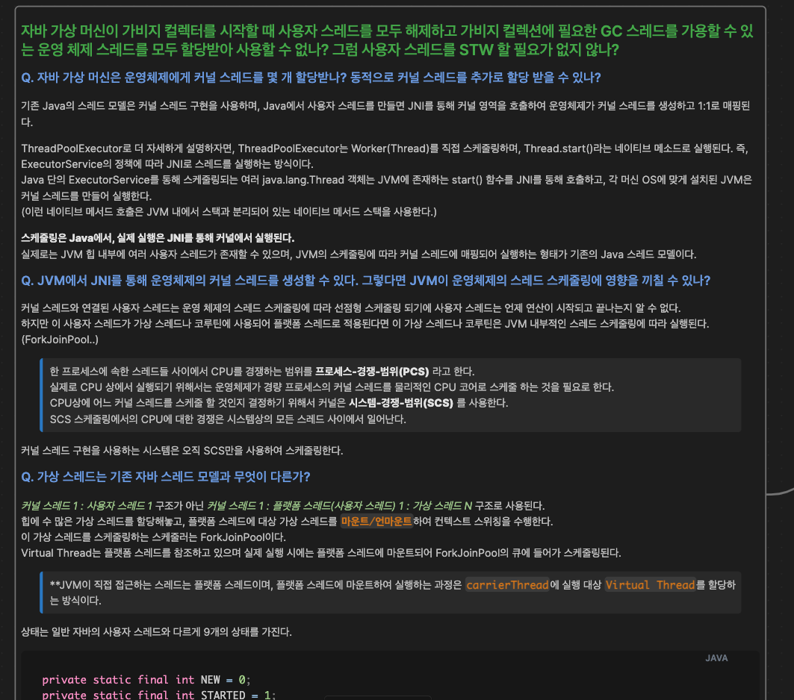

# F-Lab을 신청하게 된 계기

이때까지를 되돌아보면 공부도 열심히하고 회사에 기여하기 위해 바쁘게 지낸 것 같은데, 스스로를 어필할 수 있는 필살기가 없다고 느꼈다.  
내가 가진 지식을 그래프(자료구조)에 비유하자면 기존의 그래프에 새로운 노드들을 견고하게 연결하는 학습 패턴을 가져야 하는데, 기존 학습 그래프랑 연결되지 않고 겉핥기 식으로 동떨어진 새로운 그래프를 계속 만들어 내고 있었다.  
(새로운 그래프를 만들더라도 그 그래프들을 연결할 수 있는 기회를 잡거나 노력을 해야 했는데 못한 것 같다.)  
그리고 흥미가 있거나 실무에서 사용되지 않는 새로운 분야를 학습하더라도 금방 잊어먹는 아주 비효율적인 학습을 계속했다.  
  
어떤 것을 학습해서 어떤 부분을 개선할 수 있는지 또는 이 부분을 개선하기 위해 어떤 학습,분석,모니터링 등이 필요한지를 혼자서는 아는 만큼 밖에 보이지 않기 때문에 이런 학습이 계속 되지 않았나 싶다.   
**내가 관심 가지는 도메인에 경험이 많고 학습 방향이나 깊이에 대해 조언을 받을 수 있는 기회를 만들고 싶어 F-Lab을 신청하게 되었다.**  

# 한 달의 과정

1. **이력서와 경력 기술서 피드백**
2. **JVM에서 코드가 실행되기까지 조사하기**
   1. 바이트 코드를 만들어내는 과정
   2. 자바에서 다이나믹 프록시를 사용할 수 있는 이유 (바이너리 바이트 스트림)
   3. 바이트 코드의 상수 풀과 런타임 상수 풀의 차이점
   4. JVM 런타임 데이터 영역
   5. 클래스 로딩 메커니즘
   6. 초기화 단계 `<clinit>()`의 블로킹 가능성
   7. 객체 생성에 대한 메모리 동시성 문제
   8. 객체의 메모리 레이아웃
3. **가비지 컬렉션**
   1. GC 대상에 메서드 영역이 포함되어야 하는가?
   2. 대상이 죽었는가? 참조 카운팅 알고리즘, 도당 가능성 분석 알고리즘
   3. 세대 단위 컬렉션 이론에 기반한 마크-스윕,마크-카피,마크-컴팩트 알고리즘
   4. GC 루트 노드 열거, 안전 지점, 안전 지역
   5. STW를 줄이기 위한 기법들 (삼색 표시 기법, 증분 업데이트, 시작 단계 스냅숏, 쓰기 장벽을 통한 기억 집합과 카드 테이블)
   6. 클래식 가비지 컬렉터 (신세대 : 시리얼,파뉴,패러렐 스캐빈지, 구세대: 시리얼 올드, CMS, 패러렐 올드)와 G1
   7. 최신 가비지 컬렉터 (셰넌도어, ZGC)
4. **자바 메모리 모델과 스레드**
   1. 작업 메모리와 메인 메모리간 상호 작용
   2. `volatile`의 원리와 동시성이 지켜지지 않는 케이스
   3. 자바 메모리 모델의 원자성, 가시성, 실행 순서
   4. 스레드 모델 (N:1, 1:1, N:M) 종류와 한계
   5. 가상 스레드와 코루틴을 이해하기 위한 커널 스레드와 사용자 스레드
5. **HashMap 분석**
6. **시나리오 작성**

# 느낀 점

아무리 뛰어난 개발자가 멘토라고 하더라도 학습하고 이해하고 소화하는 능력은 전적으로 나에게 달려있다.  
하지만 학습의 방향성과 학습의 깊이에 대한 조언을 받을 수 있다는 것은 학습자 입장에서는 크게 작용한다.  
예를 들어, `GC가 시작될 때 사용자 스레드를 STW 하지 말고 커널 스레드를 GC 스레드에 모두 매핑하는 것은 왜 안될까요?` 라는 질문을 통해 스스로 학습할 수 있도록 도와주신다.

