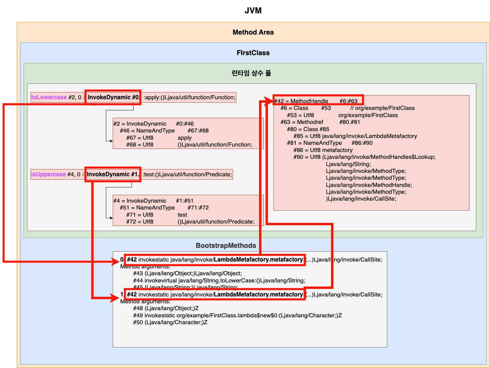

# 발단

자바와 코틀린에서 람다를 처리하는 방식이 다르다는 것을 알게됐다.  
코틀린을 먼저 확인해보자.  

```kotlin
fun main(args: Array<String>) {
    val numbers = listOf(1,2,4,5,6,7,8,9)
    val number = 7

    val result = numbers.filter { it == number }
}
private fun <T> Iterable<T>.filter(predicate: (T) -> Boolean): Iterable<T> {
    val destination = arrayListOf<T>()
    for (element in this) if (predicate(element)) destination.add(element)
    return destination
}
```

위의 확장함수에 람다를 전달하는 코틀린 코드는 아래와 같이 컴파일된다.  

```java
public final class MainKt {
   public static final void main(@NotNull String[] args) {
      ...
      Iterable result = filter((Iterable)numbers, (Function1)(new Function1() {
         // $FF: synthetic method
         // $FF: bridge method
         public Object invoke(Object var1) {
            return this.invoke(((Number)var1).intValue());
         }

         public final boolean invoke(int it) {
            return it == number;
         }
      }));
   }

   private static final Iterable filter(Iterable $this$filter, Function1 predicate) {
      ...
      while(var4.hasNext()) {
         Object element = var4.next();
         if ((Boolean)predicate.invoke(element)) {
            destination.add(element);
         }
      }
      ...
   }
}
```
  
`filter()`에 전달된 람다가 `Function1` 타입의 인스턴스로 생성되어 `invoke()` 함수를 통해 실행되는 것을 확인할 수 있다.  
이렇게 람다를 함수 유형의 인스턴스로 생성하여 사용하는 것은 단점이 존재한다.  

1. **컴파일러는 익명 클래스에 대응하는 새로운 클래스 파일을 생성화며, 이 클래스를 사용하려면 각각의 클래스를 로드하고 검증하는 과정이 필요하므로 애플리케이션 스타트업의 성능에 악영향을 미친다.**
2. **새로운 익명 클래스는 클래스나 인터페이스의 새로운 서브형식을 만든다.** Comparator를 표현하는 수백 개의 람다가 있다면 결국 수백 가지의 Comparator 서브형식이 생긴다는 의미다.

코틀린은 자바6 와의 호환성을 위해 기본적으로 람다를 항상 함수 유형의 인스턴스를 생성하여(익명 클래스) 사용하기 때문에 `inline` 키워드를 사용하여 성능상 이점을 누릴 수 있다.    
`filter()` 확장함수에 `inline` 키워드를 추가하면 컴파일러가 람다의 바이트 코드를 삽입하여 주기 때문에 아래와 같이 오버헤드를 줄일 수 있다.  

```java
public final class MainKt {
   public static final void main(@NotNull String[] args) {
      Intrinsics.checkNotNullParameter(args, "args");
      List numbers = CollectionsKt.listOf(new Integer[]{1, 2, 4, 5, 6, 7, 8, 9});
      int number = 7;
      Iterable $this$filter$iv = (Iterable)numbers;
      int $i$f$filter = false;
      ArrayList destination$iv = new ArrayList();
      Iterator var7 = $this$filter$iv.iterator();

      while(var7.hasNext()) {
         Object element$iv = var7.next();
         int it = ((Number)element$iv).intValue();
         int var10 = false;
         if (it == number) {
            destination$iv.add(element$iv);
         }
      }

      Iterable result = (Iterable)destination$iv;
   }
}
```

# 자바 바이트코드 확인하기

코틀린에서는 람다를 사용할 때 생기는 문제를 해결하기 위해 `inline` 키워드를 제공하는 것을 알아보았다.  
그럼 자바는 여전히 함수 인스턴스를 매번 생성해서 사용할까?  
익명 클래스와 람다를 바이트코드로 확인해보자.  

```java
public class InnerClass {
    Function<Object, String> toString1 = new Function<Object, String>() {
        @Override
        public String apply(Object o) {
            return o.toString();
        }
    };
    Function<Object, String> toString2 = Object::toString;

    public static void main(String[] args) {
        InnerClass innerClass = new InnerClass();
        innerClass.toString1.apply("test");
        innerClass.toString2.apply("test");
    }
}
```

```java
public class org.example.InnerClass {
  java.util.function.Function<java.lang.Object, java.lang.String> toString1;
  java.util.function.Function<java.lang.Object, java.lang.String> toString2;

  public org.example.InnerClass();
    Code:
       0: aload_0
       1: invokespecial #1      // Method java/lang/Object."<init>":()V
       4: aload_0
       5: new           #2      // class org/example/InnerClass$1
       8: dup
       9: aload_0
      10: invokespecial #3      // Method org/example/InnerClass$1."<init>":(Lorg/example/InnerClass;)V
      13: putfield      #4      // Field toString1:Ljava/util/function/Function;
      16: aload_0
      17: invokedynamic #5,  0  // InvokeDynamic #0:apply:()Ljava/util/function/Function;
      22: putfield      #6      // Field toString2:Ljava/util/function/Function;
      25: return

  public static void main(java.lang.String[]);
    Code:
       0: new           #7      // class org/example/InnerClass
       3: dup
       4: invokespecial #8      // Method "<init>":()V
       7: astore_1
       8: aload_1
       9: getfield      #4      // Field toString1:Ljava/util/function/Function;
      12: ldc           #9      // String test
      14: invokeinterface #10,2 // InterfaceMethod java/util/function/Function.apply:(Ljava/lang/Object;)Ljava/lang/Object;
      19: pop
      20: aload_1
      21: getfield      #6      // Field toString2:Ljava/util/function/Function;
      24: ldc           #9      // String test
      26: invokeinterface #10,2 // InterfaceMethod java/util/function/Function.apply:(Ljava/lang/Object;)Ljava/lang/Object;
      31: pop
      32: return
}
```

`InnerClass$1`이라는 이름은 컴파일러가 익명 클래스에 붙인 이름이며, `new` 연산을 통해 메모리를 힙 안에 할당하고, 할당된 위치를 가리키는 참조를 오퍼랜드 스택에 쌓는다.  
그리고 `invokespecial`을 통해 생성자를 호출한다.  
**하지만 람다는 `invokedynamic` 연산만 호출된다.**  

# invokedynamic 이란?

```ruby
def addtwo(a, b)
    a + b;
end
```

위의 코드를 컴파일할 때는 a와 b의 형식을 알 수 없듯이 동적 타입 언어 컴파일의 난제는 프로그램이 컴파일된 후 메서드나 함수의 가장 적절한 구현을 선택할 수 있는 런타임 시스템을 구현하는 방법이다.  
  
자바 7부터 JVM 자체에서 자바 언어뿐만 아니라 다른 언어, 특히 스크립트 언어들과 같이 타입이 고정되어 있지 않은 동적 타입 언어를 지원하기 위해 `invokedynamic`이 추가되었다.    
(이 명령어는 Java 8에서 람다 표현식을 구현하기 위한 기반을 마련했을 뿐만 아니라 동적 언어를 Java 바이트 코드 형식으로 변환하는 데 있어서도 큰 전환점이 되었다.)  
  
간단하게 **invokedynamic은 특이한 형태의 팩토리 메서드 호출 이라고 생각하면 된다.**  
실제 타입은 컴파일 시점에 존재하지 않고 런타임에 필요에 따라 생성되는데, 이 메커니즘을 이해하려면 `Call sites`, `Method handles`, `Bootstrapping`을 이해해야 한다.  

## Call sites

바이트 코드에서 메서드 호출 명령이 발생하는 위치를 `call site`라고 한다.  
이 메서드 호출에는 다양한 경우의 메서드 호출을 처리하기 위해 (기본적으로) 4가지의 opcode가 존재한다.  

```java
public class ParentClass {
    public void printMessage() { System.out.println("ParentClass"); }
}
public class ChildClass extends ParentClass {
    @Override
    public void printMessage() { System.out.println("ChildClass"); }
}

abstract class AbstractClass {
    public void printMessage() { System.out.println("AbstractClass"); }
}
public class AbstractChildClass extends AbstractClass { }

public interface Interface {
    void printMessage();
}
public class ImplementClass implements Interface {
    @Override
    public void printMessage() { System.out.println("ImplementClass"); }
}

public class Main {

    public static void printMessage() { System.out.println("Main"); }

    public static void main(String[] args) {
        ParentClass parentClass = new ParentClass();
        parentClass.printMessage();

        ParentClass parentClass1 = new ChildClass();
        parentClass1.printMessage();

        ChildClass childClass = new ChildClass();
        childClass.printMessage();

        AbstractClass abstractClass = new AbstractChildClass();
        abstractClass.printMessage();

        AbstractChildClass abstractClass1 = new AbstractChildClass();
        abstractClass1.printMessage();

        Interface implementClass = new ImplementClass();
        implementClass.printMessage();

        ImplementClass implementClass1 = new ImplementClass();
        implementClass1.printMessage();

        Main.printMessage();
    }
}
```

```java
// javap -v -p -s {class}
Constant pool:
  #1 = Methodref          #21.#49        // java/lang/Object."<init>":()V
  #2 = Fieldref           #50.#51        // java/lang/System.out:Ljava/io/PrintStream;
  #3 = String             #52            // Main
  #4 = Methodref          #53.#54        // java/io/PrintStream.println:(Ljava/lang/String;)V
  #5 = Class              #55            // org/example/ParentClass
  #6 = Methodref          #5.#49         // org/example/ParentClass."<init>":()V
  #7 = Methodref          #5.#56         // org/example/ParentClass.printMessage:()V
  #8 = Class              #57            // org/example/ChildClass
  #9 = Methodref          #8.#49         // org/example/ChildClass."<init>":()V
  #10 = Methodref          #8.#56         // org/example/ChildClass.printMessage:()V
  #11 = Class              #58            // org/example/AbstractChildClass
  #12 = Methodref          #11.#49        // org/example/AbstractChildClass."<init>":()V
  #13 = Methodref          #59.#56        // org/example/AbstractClass.printMessage:()V
  #14 = Methodref          #11.#56        // org/example/AbstractChildClass.printMessage:()V
  #15 = Class              #60            // org/example/ImplementClass
  #16 = Methodref          #15.#49        // org/example/ImplementClass."<init>":()V
  #17 = InterfaceMethodref #61.#56        // org/example/Interface.printMessage:()V
  #18 = Methodref          #15.#56        // org/example/ImplementClass.printMessage:()V
  #19 = Methodref          #20.#56        // org/example/Main.printMessage:()V
  #20 = Class              #62            // org/example/Main
  #21 = Class              #63            // java/lang/Object
  ...
{
  public org.example.Main();
    ...

  public static void printMessage();
    descriptor: ()V
    flags: ACC_PUBLIC, ACC_STATIC
    Code:
      stack=2, locals=0, args_size=0
         0: getstatic     #2                  // Field java/lang/System.out:Ljava/io/PrintStream;
         3: ldc           #3                  // String Main
         5: invokevirtual #4                  // Method java/io/PrintStream.println:(Ljava/lang/String;)V
         8: return
      LineNumberTable:
        line 5: 0

  public static void main(java.lang.String[]);
    descriptor: ([Ljava/lang/String;)V
    flags: ACC_PUBLIC, ACC_STATIC
    Code:
      stack=2, locals=8, args_size=1
         0: new           #5                  // class org/example/ParentClass
         3: dup
         4: invokespecial #6                  // Method org/example/ParentClass."<init>":()V
         7: astore_1
         8: aload_1
         9: invokevirtual #7                  // Method org/example/ParentClass.printMessage:()V
        12: new           #8                  // class org/example/ChildClass
        15: dup
        16: invokespecial #9                  // Method org/example/ChildClass."<init>":()V
        19: astore_2
        20: aload_2
        21: invokevirtual #7                  // Method org/example/ParentClass.printMessage:()V
        24: new           #8                  // class org/example/ChildClass
        27: dup
        28: invokespecial #9                  // Method org/example/ChildClass."<init>":()V
        31: astore_3
        32: aload_3
        33: invokevirtual #10                 // Method org/example/ChildClass.printMessage:()V
        36: new           #11                 // class org/example/AbstractChildClass
        39: dup
        40: invokespecial #12                 // Method org/example/AbstractChildClass."<init>":()V
        43: astore        4
        45: aload         4
        47: invokevirtual #13                 // Method org/example/AbstractClass.printMessage:()V
        50: new           #11                 // class org/example/AbstractChildClass
        53: dup
        54: invokespecial #12                 // Method org/example/AbstractChildClass."<init>":()V
        57: astore        5
        59: aload         5
        61: invokevirtual #14                 // Method org/example/AbstractChildClass.printMessage:()V
        64: new           #15                 // class org/example/ImplementClass
        67: dup
        68: invokespecial #16                 // Method org/example/ImplementClass."<init>":()V
        71: astore        6
        73: aload         6
        75: invokeinterface #17,  1           // InterfaceMethod org/example/Interface.printMessage:()V
        80: new           #15                 // class org/example/ImplementClass
        83: dup
        84: invokespecial #16                 // Method org/example/ImplementClass."<init>":()V
        87: astore        7
        89: aload         7
        91: invokevirtual #18                 // Method org/example/ImplementClass.printMessage:()V
        94: invokestatic  #19                 // Method printMessage:()V
        97: return
}
```

- `new` : 인자로 지정된 클래스의 새 인스턴스에 필요한 메모리를 힙 안에 할당한다.
- `invokespecial` : 생성자 또는 슈퍼 클래스의 생성자를 호출할 때 사용된다.
- `invokevirtual` : 상속 관계, 인스턴스의 메서드를 호출할 때 사용되며 동적 디스패치를 통한 런타임 해석을 담당한다.
- `invokeinterface` : 인터페이스 관계의 메서드를 호출할 때 사용된다.
- `invokestatic` : 정적 메소드를 호출할 때 사용된다.
  
자바 바이트코드에서 메서드를 호출하는 invokeinterface, invokespecial, invokestatic, invokevirtual의 4가지 opcode가 존재하며, 이렇게 메서드 호출 명령이 발생하는 위치를 **call site** 라고 한다.  
`invokedynamic`은 **이보다 훨씬 더 나아가 어떤 메서드가 실제로 호출될지 call site별로 결정할 수 있는 메커니즘을 제공한다.**  
해당 명령어가 실행되면 JVM은 해당 (실제로 호출하려는 메서드 핸들을 보유한) call site 객체를 찾는다. 만약 이 call site에 도달한 적이 없는 경우 객체를 생성한다.  
  


invokedynamic의 call site는 Java 힙에서 **[CallSite](https://docs.oracle.com/javase/8/docs/api/java/lang/invoke/CallSite.html) 객체로** 표현된다.  
람다 표현식은 이 CallSite의 구현 클래스인 **(처음 실행된 후에는 대상 메서드가 변경되지 않는) `ConstantCallSite`를 사용한다.**   

## Method Handles

Java 7은 새로운 API인 `java.lang.invoke`를 도입했다.  
이에 포함되는 **`MethodHandle`은 코드가 호출하고자 하는 메서드를 참조하는 클래스이다.**  
Reflection의 Method 객체와 유사하지만 더 효율적인 리플렉션 메커니즘이라고 볼 수 있다.  
  
즉, 메서드를 찾고, 조정하고, 호출하기 위한 저수준 메커니즘이다.  
`MethodHandle`을 사용하기 위해서는 4가지를 준비해야 한다.  

1. **Lookup 생성하기**
2. **MethodType 생성하기** : 반환 타입과 매개변수 유형으로 구성되며, 불변이다.
3. **MethodHandle 찾기** : 원본 클래스와 메서드 이름, MethodType을 Lookup 객체에 제공하여 조회할 수 있다.
4. **MethodHandle 호출하기**

```java
public class Main {

    private final List<Integer> numbers;

    public Main(List<Integer> numbers) {
        this.numbers = numbers;
    }

    public Integer sum() {
        return numbers.stream().mapToInt(it -> it).sum();
    }

    public static void main(String[] args) throws Throwable {
        // Main의 sum 메서드 실행하기
        Method sumMethod = Main.class.getDeclaredMethod("sum");
        MethodHandle sum = lookup().unreflect(sumMethod);
        final Main main = new Main(Arrays.asList(1, 3, 5, 6, 7));
        Object invoke4 = sum.invoke(main);
        Object invoke5 = sum.invokeWithArguments(main);
        Integer invoke6 = (Integer) sum.invokeExact(main);
        
        // String의 concat 메서드 실행하기
        Lookup publicLookup = lookup();
        MethodType methodType = MethodType.methodType(String.class, String.class);
        MethodHandle concat = publicLookup.findVirtual(String.class, "concat", methodType);
        final String s1 = "who are ";
        final String s2 = "you?";
        Object invoke1 = concat.invoke(s1, s2);
        Object invoke2 = concat.invokeWithArguments(s1, s2);
        String invoke3 = (String) concat.invokeExact(s1, s2);
    }
}
```

```java
abstract public class CallSite {
    static { MethodHandleImpl.initStatics(); }

    // The actual payload of this call site:
    /*package-private*/
    MethodHandle target;    // Note: This field is known to the JVM.  Do not change.

    public abstract MethodHandle dynamicInvoker();
    ...
}
```

## Bootstrapping

바이트코드 명령에서 특정 invokedynamic call site가 처음 호출될 때, JVM에는 명령과 연관된 call site 객체가 없기 때문에 어떤 메서드를 대상으로 실행해야 하는지 알지 못한다.  
즉, 이전에 보았던 invokestatic 및 invokespecial의 경우 컴파일 시점에 정확한 호출 대상을 알 수 있지만, invokedynamic은 호출 대상을 모르는 것이다.  
  
**invokedynamic은 [BootstrapMethods(BSM)](https://docs.oracle.com/javase/specs/jvms/se11/html/jvms-4.html#jvms-4.7.23)라고하는 동적 특성 호출을 지원하는 추가 정보를 참조한다.**  
**특정 invokedynamic call site에 BSM을 연결할 수 있도록** Java 7부터 클래스 파일 형식에 InvokeDynamic라는 새로운 항목 유형이 추가되었다.  

```java
public class FirstClass {
    private final Function<String, String> toLowercase = String::toLowerCase;
    private final Predicate<Character> isUppercase = ch -> ch >= 65 && ch <= 90;

    public static void main(String[] args) {
        FirstClass firstClass = new FirstClass();
        firstClass.toLowercase.apply("TEST");
        firstClass.isUppercase.test('A');
    }
}
```

<details>
<summary>모든 바이트코드 펼치기</summary>

```java
Constant pool:
   #1 = Methodref          #13.#40        // java/lang/Object."<init>":()V
   #2 = InvokeDynamic      #0:#46         // #0:apply:()Ljava/util/function/Function;
   #3 = Fieldref           #6.#47         // org/example/FirstClass.toLowercase:Ljava/util/function/Function;
   #4 = InvokeDynamic      #1:#51         // #1:test:()Ljava/util/function/Predicate;
   #5 = Fieldref           #6.#52         // org/example/FirstClass.isUppercase:Ljava/util/function/Predicate;
   #6 = Class              #53            // org/example/FirstClass
   #7 = Methodref          #6.#40         // org/example/FirstClass."<init>":()V
   #8 = String             #54            // TEST
   #9 = InterfaceMethodref #55.#56        // java/util/function/Function.apply:(Ljava/lang/Object;)Ljava/lang/Object;
  #10 = Methodref          #57.#58        // java/lang/Character.valueOf:(C)Ljava/lang/Character;
  #11 = InterfaceMethodref #59.#60        // java/util/function/Predicate.test:(Ljava/lang/Object;)Z
  #12 = Methodref          #57.#61        // java/lang/Character.charValue:()C
  #13 = Class              #62            // java/lang/Object
  #14 = Utf8               toLowercase
  #15 = Utf8               Ljava/util/function/Function;
  #16 = Utf8               Signature
  #17 = Utf8               Ljava/util/function/Function<Ljava/lang/String;Ljava/lang/String;>;
  #18 = Utf8               isUppercase
  #19 = Utf8               Ljava/util/function/Predicate;
  #20 = Utf8               Ljava/util/function/Predicate<Ljava/lang/Character;>;
  #21 = Utf8               <init>
  #22 = Utf8               ()V
  #23 = Utf8               Code
  #24 = Utf8               LineNumberTable
  #25 = Utf8               LocalVariableTable
  #26 = Utf8               this
  #27 = Utf8               Lorg/example/FirstClass;
  #28 = Utf8               main
  #29 = Utf8               ([Ljava/lang/String;)V
  #30 = Utf8               args
  #31 = Utf8               [Ljava/lang/String;
  #32 = Utf8               firstClass
  #33 = Utf8               lambda$new$0
  #34 = Utf8               (Ljava/lang/Character;)Z
  #35 = Utf8               ch
  #36 = Utf8               Ljava/lang/Character;
  #37 = Utf8               StackMapTable
  #38 = Utf8               SourceFile
  #39 = Utf8               FirstClass.java
  #40 = NameAndType        #21:#22        // "<init>":()V
  #41 = Utf8               BootstrapMethods
  #42 = MethodHandle       #6:#63         // invokestatic java/lang/invoke/LambdaMetafactory.metafactory:(Ljava/lang/invoke/MethodHandles$Lookup;Ljava/lang/String;Ljava/lang/invoke/MethodType;Ljava/lang/invoke/MethodType;Ljava/lang/invoke/MethodHandle;Ljava/lang/invoke/MethodType;)Ljava/lang/invoke/CallSite;
  #43 = MethodType         #64            //  (Ljava/lang/Object;)Ljava/lang/Object;
  #44 = MethodHandle       #5:#65         // invokevirtual java/lang/String.toLowerCase:()Ljava/lang/String;
  #45 = MethodType         #66            //  (Ljava/lang/String;)Ljava/lang/String;
  #46 = NameAndType        #67:#68        // apply:()Ljava/util/function/Function;
  #47 = NameAndType        #14:#15        // toLowercase:Ljava/util/function/Function;
  #48 = MethodType         #69            //  (Ljava/lang/Object;)Z
  #49 = MethodHandle       #6:#70         // invokestatic org/example/FirstClass.lambda$new$0:(Ljava/lang/Character;)Z
  #50 = MethodType         #34            //  (Ljava/lang/Character;)Z
  #51 = NameAndType        #71:#72        // test:()Ljava/util/function/Predicate;
  #52 = NameAndType        #18:#19        // isUppercase:Ljava/util/function/Predicate;
  #53 = Utf8               org/example/FirstClass
  #54 = Utf8               TEST
  #55 = Class              #73            // java/util/function/Function
  #56 = NameAndType        #67:#64        // apply:(Ljava/lang/Object;)Ljava/lang/Object;
  #57 = Class              #74            // java/lang/Character
  #58 = NameAndType        #75:#76        // valueOf:(C)Ljava/lang/Character;
  #59 = Class              #77            // java/util/function/Predicate
  #60 = NameAndType        #71:#69        // test:(Ljava/lang/Object;)Z
  #61 = NameAndType        #78:#79        // charValue:()C
  #62 = Utf8               java/lang/Object
  #63 = Methodref          #80.#81        // java/lang/invoke/LambdaMetafactory.metafactory:(Ljava/lang/invoke/MethodHandles$Lookup;Ljava/lang/String;Ljava/lang/invoke/MethodType;Ljava/lang/invoke/MethodType;Ljava/lang/invoke/MethodHandle;Ljava/lang/invoke/MethodType;)Ljava/lang/invoke/CallSite;
  #64 = Utf8               (Ljava/lang/Object;)Ljava/lang/Object;
  #65 = Methodref          #82.#83        // java/lang/String.toLowerCase:()Ljava/lang/String;
  #66 = Utf8               (Ljava/lang/String;)Ljava/lang/String;
  #67 = Utf8               apply
  #68 = Utf8               ()Ljava/util/function/Function;
  #69 = Utf8               (Ljava/lang/Object;)Z
  #70 = Methodref          #6.#84         // org/example/FirstClass.lambda$new$0:(Ljava/lang/Character;)Z
  #71 = Utf8               test
  #72 = Utf8               ()Ljava/util/function/Predicate;
  #73 = Utf8               java/util/function/Function
  #74 = Utf8               java/lang/Character
  #75 = Utf8               valueOf
  #76 = Utf8               (C)Ljava/lang/Character;
  #77 = Utf8               java/util/function/Predicate
  #78 = Utf8               charValue
  #79 = Utf8               ()C
  #80 = Class              #85            // java/lang/invoke/LambdaMetafactory
  #81 = NameAndType        #86:#90        // metafactory:(Ljava/lang/invoke/MethodHandles$Lookup;Ljava/lang/String;Ljava/lang/invoke/MethodType;Ljava/lang/invoke/MethodType;Ljava/lang/invoke/MethodHandle;Ljava/lang/invoke/MethodType;)Ljava/lang/invoke/CallSite;
  #82 = Class              #91            // java/lang/String
  #83 = NameAndType        #92:#93        // toLowerCase:()Ljava/lang/String;
  #84 = NameAndType        #33:#34        // lambda$new$0:(Ljava/lang/Character;)Z
  #85 = Utf8               java/lang/invoke/LambdaMetafactory
  #86 = Utf8               metafactory
  #87 = Class              #95            // java/lang/invoke/MethodHandles$Lookup
  #88 = Utf8               Lookup
  #89 = Utf8               InnerClasses
  #90 = Utf8               (Ljava/lang/invoke/MethodHandles$Lookup;Ljava/lang/String;Ljava/lang/invoke/MethodType;Ljava/lang/invoke/MethodType;Ljava/lang/invoke/MethodHandle;Ljava/lang/invoke/MethodType;)Ljava/lang/invoke/CallSite;
  #91 = Utf8               java/lang/String
  #92 = Utf8               toLowerCase
  #93 = Utf8               ()Ljava/lang/String;
  #94 = Class              #96            // java/lang/invoke/MethodHandles
  #95 = Utf8               java/lang/invoke/MethodHandles$Lookup
  #96 = Utf8               java/lang/invoke/MethodHandles
{
  private final java.util.function.Function<java.lang.String, java.lang.String> toLowercase;
    descriptor: Ljava/util/function/Function;
    flags: ACC_PRIVATE, ACC_FINAL
    Signature: #17                          // Ljava/util/function/Function<Ljava/lang/String;Ljava/lang/String;>;

  private final java.util.function.Predicate<java.lang.Character> isUppercase;
    descriptor: Ljava/util/function/Predicate;
    flags: ACC_PRIVATE, ACC_FINAL
    Signature: #20                          // Ljava/util/function/Predicate<Ljava/lang/Character;>;

  public org.example.FirstClass();
    descriptor: ()V
    flags: ACC_PUBLIC
    Code:
      stack=2, locals=1, args_size=1
         0: aload_0
         1: invokespecial #1                  // Method java/lang/Object."<init>":()V
         4: aload_0
         5: invokedynamic #2,  0              // InvokeDynamic #0:apply:()Ljava/util/function/Function;
        10: putfield      #3                  // Field toLowercase:Ljava/util/function/Function;
        13: aload_0
        14: invokedynamic #4,  0              // InvokeDynamic #1:test:()Ljava/util/function/Predicate;
        19: putfield      #5                  // Field isUppercase:Ljava/util/function/Predicate;
        22: return
      LineNumberTable:
        line 6: 0
        line 7: 4
        line 8: 13
      LocalVariableTable:
        Start  Length  Slot  Name   Signature
            0      23     0  this   Lorg/example/FirstClass;

  public static void main(java.lang.String[]);
    descriptor: ([Ljava/lang/String;)V
    flags: ACC_PUBLIC, ACC_STATIC
    Code:
      stack=2, locals=2, args_size=1
         0: new           #6                  // class org/example/FirstClass
         3: dup
         4: invokespecial #7                  // Method "<init>":()V
         7: astore_1
         8: aload_1
         9: getfield      #3                  // Field toLowercase:Ljava/util/function/Function;
        12: ldc           #8                  // String TEST
        14: invokeinterface #9,  2            // InterfaceMethod java/util/function/Function.apply:(Ljava/lang/Object;)Ljava/lang/Object;
        19: pop
        20: aload_1
        21: getfield      #5                  // Field isUppercase:Ljava/util/function/Predicate;
        24: bipush        65
        26: invokestatic  #10                 // Method java/lang/Character.valueOf:(C)Ljava/lang/Character;
        29: invokeinterface #11,  2           // InterfaceMethod java/util/function/Predicate.test:(Ljava/lang/Object;)Z
        34: pop
        35: return
      LineNumberTable:
        line 11: 0
        line 12: 8
        line 13: 20
        line 14: 35
      LocalVariableTable:
        Start  Length  Slot  Name   Signature
            0      36     0  args   [Ljava/lang/String;
            8      28     1 firstClass   Lorg/example/FirstClass;

  private static boolean lambda$new$0(java.lang.Character);
    descriptor: (Ljava/lang/Character;)Z
    flags: ACC_PRIVATE, ACC_STATIC, ACC_SYNTHETIC
    Code:
      stack=2, locals=1, args_size=1
         0: aload_0
         1: invokevirtual #12                 // Method java/lang/Character.charValue:()C
         4: bipush        65
         6: if_icmplt     22
         9: aload_0
        10: invokevirtual #12                 // Method java/lang/Character.charValue:()C
        13: bipush        90
        15: if_icmpgt     22
        18: iconst_1
        19: goto          23
        22: iconst_0
        23: ireturn
      LineNumberTable:
        line 8: 0
      LocalVariableTable:
        Start  Length  Slot  Name   Signature
            0      24     0    ch   Ljava/lang/Character;
      StackMapTable: number_of_entries = 2
        frame_type = 22 /* same */
        frame_type = 64 /* same_locals_1_stack_item */
          stack = [ int ]
}
SourceFile: "FirstClass.java"
InnerClasses:
     public static final #88= #87 of #94; //Lookup=class java/lang/invoke/MethodHandles$Lookup of class java/lang/invoke/MethodHandles
BootstrapMethods:
  0: #42 invokestatic java/lang/invoke/LambdaMetafactory.metafactory:(Ljava/lang/invoke/MethodHandles$Lookup;Ljava/lang/String;Ljava/lang/invoke/MethodType;Ljava/lang/invoke/MethodType;Ljava/lang/invoke/MethodHandle;Ljava/lang/invoke/MethodType;)Ljava/lang/invoke/CallSite;
    Method arguments:
      #43 (Ljava/lang/Object;)Ljava/lang/Object;
      #44 invokevirtual java/lang/String.toLowerCase:()Ljava/lang/String;
      #45 (Ljava/lang/String;)Ljava/lang/String;
  1: #42 invokestatic java/lang/invoke/LambdaMetafactory.metafactory:(Ljava/lang/invoke/MethodHandles$Lookup;Ljava/lang/String;Ljava/lang/invoke/MethodType;Ljava/lang/invoke/MethodType;Ljava/lang/invoke/MethodHandle;Ljava/lang/invoke/MethodType;)Ljava/lang/invoke/CallSite;
    Method arguments:
      #48 (Ljava/lang/Object;)Z
      #49 invokestatic org/example/FirstClass.lambda$new$0:(Ljava/lang/Character;)Z
      #50 (Ljava/lang/Character;)Z
```

</details>



즉, `#2`와 `#4`의 상수는 `CONSTANT_InvokeDynamic` 유형의 상수이며, 이 call site의 bootstrap method는 상수 풀의 `#42` 항목이다.  
**BSM으로 사용될 메서드 핸들은 `LambdaMetafactory.metafactory(...)`이다.**  

```java
public class LambdaMetafactory {
    /**
     * 적절한 유형 조정 및 인수의 부분 평가 후 제공된 MethodHandle에 대한 위임을 통해 하나 이상의 인터페이스를 구현하는 간단한 "함수 개체" 생성을 용이하게 합니다.
     * 일반적으로 Java 프로그래밍 언어의 람다식 및 메서드 참조식 기능을 지원하기 위해 invokedynamic 호출 ​​사이트의 부트스트랩 메서드로 사용됩니다.
     * 이 메서드에서 반환된 CallSite의 대상이 호출되면 결과 함수 객체는 invokedType의 반환 유형으로 명명된 인터페이스를 구현하고, invokedName으로 지정된 이름과 samMethodType으로 지정된 서명으로 메서드를 선언하는 클래스의 인스턴스입니다.
     */
    public static CallSite metafactory(MethodHandles.Lookup caller,
                                       String invokedName,
                                       MethodType invokedType,
                                       MethodType samMethodType,
                                       MethodHandle implMethod,
                                       MethodType instantiatedMethodType)
            throws LambdaConversionException {
        AbstractValidatingLambdaMetafactory mf;
        mf = new InnerClassLambdaMetafactory(caller, invokedType,
                                             invokedName, samMethodType,
                                             implMethod, instantiatedMethodType,
                                             false, EMPTY_CLASS_ARRAY, EMPTY_MT_ARRAY);
        mf.validateMetafactoryArgs();
        return mf.buildCallSite();
    }
    ...
}
```

**BSM은 이 정적 메서드를 호출하여 CallSite 객체를 반환하며, invokedynamic 명령이 실행되면 CallSite에 포함된 MethodHandle은 람다의 대상 유형을 구현하는 클래스의 인스턴스를 반환한다.**  

# BSM 만들어보기

```java
public class Ops {
    public static Integer adder(Integer x, Integer y) {
        return x + y;
    }
    public static String adder(String x, String y) {
        return x + y;
    }
}

class MethodHandleTest {

    // 이 메서드는 호출된 invokedynamic call site를  adder 메서드에 연결하는 부트스트랩 메서드이다.
    public static CallSite mybsm(MethodHandles.Lookup callerClass, String dynamicMethodName, MethodType dynamicMethodType) throws Throwable {
        // adder 메서드에 대한 정적 메서드 핸들을 생성한다.
        MethodHandle methodHandle = callerClass.findStatic(
            Ops.class,
            dynamicMethodName,
            dynamicMethodType
        );
        return new ConstantCallSite(methodHandle);
    }

    @Test
    void intAdder() throws Throwable {
        CallSite adder = mybsm(lookup(), "adder", MethodType.methodType(Integer.class, Integer.class, Integer.class));
        MethodHandle methodHandle = adder.dynamicInvoker();

        assertThat(methodHandle.invoke(1, 7)).isEqualTo(8);
    }

    @Test
    void stringAdder() throws Throwable {
        CallSite adder = mybsm(lookup(), "adder", MethodType.methodType(String.class, String.class, String.class));
        MethodHandle methodHandle = adder.dynamicInvoker();

        assertThat(methodHandle.invoke("1", "7")).isEqualTo("17");
    }

    @Test
    void wrongAdder() {
        assertThatThrownBy(() ->
            mybsm(lookup(), "adder", MethodType.methodType(Integer.class, String.class, String.class))
        ).isExactlyInstanceOf(NoSuchMethodException.class);
    }
}
```

> `java.lang.invoke.MethodHandles` 및 `java.lang.invoke.MethodHandle` 클래스에는 기존 메서드 핸들을 기반으로 메서드 핸들을 생성하는 다양한 메서드가 포함되어 있다.  
> 런타임 시스템에서 사용할 수 있는 메서드가 여러 개 있고 각각 다른 인수 유형을 처리하는 경우 부트스트랩 메서드 mybsm은 **dynamicMethodType 인수에 따라 메서드를 동적으로 선택할 수 있다.**  
> invokedynamic 명령어는 컴파일러와 런타임 시스템의 동적 언어 구현을 단순화하며, 이는 Java 클래스 및 인터페이스에 특정한 연결 동작이 JVM에 의해 하드와이어링 되는 invokevirtual과 같은 다른 JVM 명령어와 대조된다.  

부트스트랩 메서드가 반환하는 `ConstantCallSite` 인스턴스는 호출된 **invokedynamic 명령어**와 **연결할 CallSite**를 의미하며 고유하다. ConstantCallSite 인스턴스의 대상(target)은 영구적이며 절대 변경할 수 없다.  
  
invokedynamic 명령으로 동적으로 연결된 메서드를 호출하려면 아래의 단계가 필요하다.  

1. **Defining the Bootstrap Method** (부트스트랩 메서드 정의하기)
2. **Specifying Constant Pool Entries** (상수 풀 항목 지정하기)
3. **Using the invokedynamic Instruction** (호출된 동적 인스트럭션 사용)

## 부트스트랩 메서드 정의하기

JVM이 런타임에 invokedynamic 명령을 '처음'만나면 부트스트랩 메서드를 호출한다.  
이 부트스트랩 메서드는 동적으로 입력된 언어에 대해 컴파일러가 지정한 메서드로, JVM에서 site를 연결하기 위해 한 번 호출된다.  
그리고 호출된 invokedynamic 명령어에 지정된 이름을 실행해야 하는 코드(대상 메서드)와 MethodHandle에 의해 참조되는 메서드를 연결한다.  
부트스트랩 메서드의 반환 유형은 `java.lang.invoke.CallSite`여야 한다.  
  
즉, CallSite 객체는 호출된 invokedynamic 명령의 연결된 상태와 연결된 메서드 핸들을 나타낸다.  
**JVM이 동일한 호출된 동적 명령어를 다시 실행하면 부트스트랩 메서드를 호출하지 않고 연결된 메서드 핸들을 자동으로 호출한다.**  
  

컴파일러는 람다 식을 캡처하기 위해 생성하는 코드는 람다 식 자체와 해당 식이 할당되는 함수형 인터페이스 유형에 따라 달라진다.  
람다 식을 구현하는 객체를 생성하기 위해 바이트코드를 생성하는 대신(예: 내부 클래스의 생성자 호출), 람다를 구성하는 레시피를 설명하고 실제 구성은 언어 런타임에 위임합니다. 이 레시피는 호출된 동적 명령어의 정적 및 동적 인수 목록에 인코딩됩니다.  
  
호출된 다이나믹을 사용하면 번역 전략 선택을 런타임까지 연기할 수 있습니다. 런타임 구현은 람다 식을 평가하기 위해 동적으로 전략을 자유롭게 선택할 수 있습니다. 런타임 구현 선택은 람다 구성을 위한 표준화된(즉, 플랫폼 사양의 일부인) API 뒤에 숨겨져 있으므로 정적 컴파일러는 이 API에 대한 호출을 내보낼 수 있으며, JRE 구현은 선호하는 구현 전략을 선택할 수 있습니다. 호출된 동적 메커니즘을 사용하면 이러한 후기 바인딩 접근 방식이 부과할 수 있는 성능 비용 없이 이 작업을 수행할 수 있습니다.
  
컴파일러는 람다 표현식을 만나면 먼저 람다 본문을 람다 표현식의 인자 목록과 반환 유형이 일치하는 메서드로 낮추고(설탕 제거), 추가 인자(있는 경우 어휘 범위에서 캡처한 값)를 추가합니다. 람다 표현식이 캡처되는 지점에서 호출된 invokedynamic call site를 생성하고, 호출되면 람다가 변환되는 함수형 인터페이스의 인스턴스를 반환합니다. 이 호출 사이트를 주어진 람다에 대한 람다 팩토리라고 합니다. 람다 팩토리에 대한 동적 인수는 어휘 범위에서 캡처된 값입니다. 람다 팩토리의 부트스트랩 메서드는 Java 언어 런타임 라이브러리에서 람다 메타팩토리라고 하는 표준화된 메서드입니다. 정적 부트스트랩 인수는 컴파일 시점에 람다에 대해 알려진 정보(변환될 함수 인터페이스, 파생된 람다 본문에 대한 메서드 핸들, SAM 유형이 직렬화 가능한지 여부에 대한 정보 등)를 캡처합니다.

람다 팩토리의 부트스트랩 메서드는 람다 메타팩토리라고 하는 Java 언어 런타임 라이브러리의 표준화된 메서드입니다. 정적 부트스트랩 인수는 컴파일 시점에 람다에 대해 알려진 정보(변환될 함수 인터페이스, 디서깅된 람다 본문에 대한 메서드 핸들, SAM 유형이 직렬화 가능한지 여부에 대한 정보 등)를 캡처합니다.
  
메서드 참조는 람다 표현식과 동일한 방식으로 처리되지만, 대부분의 메서드 참조를 새 메서드로 디서깅할 필요가 없으며 참조된 메서드의 상수 메서드 핸들을 로드하여 메타팩토리로 전달하면 됩니다.
  
`invokedynamic`은 메서드를 호출할 때 **더 깊은 수준의 재전송과 동적 언어에 의존하는 로직이 대상 호출을 결정할 수 있는 기능을 제공한다.**  

 실제 호출할 메서드를 결정하는 언어 종속적 로직을 구현하는 부트스트랩 메서드의 형태로 구성된다.  
부트스트랩 메서드는 연결된 CallSite를 반환한다.  
두 개의 int로 add 메서드를 호출하면 이후로 이어지는 호출에도 두 개의 int가 전달된다.  
결과적으로 매 호출마다 호출할 메서드를 다시 찾을 필요가 없다.  
호출 사이트는 언제 호출 연결을 다시 계산해야 하는지 정의하는 로직을 포함할 수 있다.  
  
`invokedynamic`으로 람다 표현식을 바이트코드로 변환하는 작업을 런타임까지 고의로 지연했다.  
즉, 이 같은 방식으로 람다 표현식을 구현하는 코드의 생성을 런타임으로 미룰 수 있다.  
이러한 설계 덕분에 다음과 같은 장점을 얻게 된다.  

1. 람다 표현식의 바디를 바이트코드로 변환하는 작업이 독립적으로 유지된다.
   - 따라서 변환 작업이 동적으로 바뀌거나 나중에 JVM 구현에서 이를 더 최적화하거나 변환 작업을 고칠 수 있다.
   - 변환 작업은 독립적이므로 바이트코드의 과거버전 호환성을 염려할 필요가 없다.
2. 람다 덕분에 추가적인 필드나 정적 초기자 등의 오버헤드가 사라진다.
3. 상태 없는(캡처하지 않는) 람다에서 람다 객체 인스턴스를 만들고, 캐시하고, 같은 결과를 반환할 수 있다.
   - 자바 8 이전에도 사람들은 이런 방식을 사용했다.
   - 예를 들어, 정적 final 변수에 특정 Comparator 인스턴스를 선언할 수 있다.
4. 람다를 처음 실행할 때만 반환과 결과 연결 작업이 실행되므로 추가적인 성능 비용이 들지 않는다.
   - 즉, 두 번째 호출부터는 이전 호출에서 연결된 구현을 바로 이용할 수 있다.

상태를 포함하지 않는 람다는 컴파일러가 람다 표현식과 같은 시그니처를 갖는 메서드를 생성한다.  
만약 상태를 포함한다면 그 상태를 람다 표현식의 인수에 캡처한 각 변수를 추가하는 것이다.  

# 참고

- [Java Virtual Machine Support for Non-Java Languages](https://docs.oracle.com/javase/8/docs/technotes/guides/vm/multiple-language-support.html)
- [Back to the Essence - Java 컴파일에서 실행까지 - (2)](https://homoefficio.github.io/2019/01/31/Back-to-the-Essence-Java-%EC%BB%B4%ED%8C%8C%EC%9D%BC%EC%97%90%EC%84%9C-%EC%8B%A4%ED%96%89%EA%B9%8C%EC%A7%80-2/)
- [Behind the scenes: How do lambda expressions really work in Java?](https://blogs.oracle.com/javamagazine/post/behind-the-scenes-how-do-lambda-expressions-really-work-in-java)
- [Understanding Java method invocation with invokedynamic](https://blogs.oracle.com/javamagazine/post/understanding-java-method-invocation-with-invokedynamic)
- [Mastering the mechanics of Java method invocation](https://blogs.oracle.com/javamagazine/post/mastering-the-mechanics-of-java-method-invocation)
- [Dismantling invokedynamic](https://dzone.com/articles/dismantling-invokedynamic)
- [Translation of Lambda Expressions](https://cr.openjdk.org/~briangoetz/lambda/lambda-translation.html)
- [Baeldung : Method Handles in Java](https://www.baeldung.com/java-method-handles)
- [Inline Functions in Kotlin](https://www.baeldung.com/kotlin/inline-functions)
- [JVM Internal](https://d2.naver.com/helloworld/1230)
- [모던 자바 인 액션](https://m.yes24.com/Goods/Detail/77125987) : 부록 D
- [JSR 292: Supporting Dynamically Typed Languages on the JavaTM Platform](https://jcp.org/en/jsr/detail?id=292)
- [Why Kotlin decompiler generates null.INSTANCE](https://discuss.kotlinlang.org/t/why-kotlin-decompiler-generates-null-instance/10426)