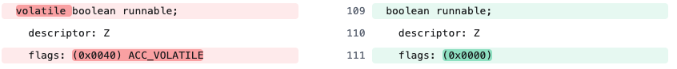

언어 레벨에서 동시성 문제를 해결할 때 `syncrhonized` 키워드나 블록을 사용하게 되는데, 단순히 객체들의 모니터에 대한 잠금을 기준으로 동기화 된다고 이해하고 있다.  
이번 글을 통해 조금 더 자세하게 알아보자. [JVM 밑바닥까지 파헤치기][book] 12,13장과 [김영한의 실전 자바 - 고급 1편, 멀티스레드와 동시성][inflearn]을 참고하였다.  

# 공유 메모리 멀티 프로세서 시스템

CPU는 프로세서의 처리 속도와 메모리 I/O 속도의 격차 문제를 완화하기 위해 둘 사이에 캐시 계층(하나 이상)을 활용한다.  
필요한 데이터를 캐시에 복사해두어 작업을 빠르게 수행하고, 작업이 완료되면 결과 데이터를 캐시에서 메인 메모리로 동기화하기에 프로세서는 메모리의 느린 I/O를 기다릴 필요가 없어진다.  
  
```
프로세서 <-> 캐시 <->
프로세서 <-> 캐시 <->  캐시 일관성 프로토콜  <-> 메인 메모리
프로세서 <-> 캐시 <->
```

이 멀티 프로세서 시스템에서는 **프로세서 각각이 자신만의 캐시를 갖춘 채 똑같은 메인 메모리를 공유한다.**  
그렇기에 **여러 프로세서가 메인 메모리의 같은 영역을 보며 작업하더라도 프로세서별 캐시 데이터는 서로 다를 수 있다.**  
이 경우 데이터를 메인 메모리로 동기화할 때 어느 프로세서의 데이터를 기준으로 삼아야 할까?  
  
이 일관성 문제를 해결하기 위해서는 메인 메모리를 이용할 때 정해진 프로토콜을 따라야 하며, JVM은 자체 메모리 모델을 가지고 있다.  
('메모리 모델'은 특정 프로토콜을 이용하여 특정 메모리나 캐시를 읽고 쓰는 절차를 말한다.)  

# 자바 메모리 모델

JVM은 자체 메모리 모델을 가졌기 때문에 플랫폼에 상관없이 메모리를 일관된 방식으로 사용할 수 있다.  
  
```
자바 스레드 <-> 작업 메모리 <->
자바 스레드 <-> 작업 메모리 <->
자바 스레드 <-> 작업 메모리 <-> 저장, 읽기 <-> 메인 메모리
자바 스레드 <-> 작업 메모리 <->
자바 스레드 <-> 작업 메모리 <->
```

자바 메모리 모델은 일관성 문제, 동시성 문제를 해결하기 위해 메모리 접근 규칙을 엄격하게 정의해놓았다.  
즉, **가상 머신의 메모리에서 변수에 값을 저장하고 가져오는 저수준의 세세한 정보를 정의한것이다.**  
(위에서 말한 변수는 스레드별 고유 지역을 활용하는 지역 변수와 메서드 매개변수를 제외한 변수를 의미한다.)  
  
1. 작업 메모리에는 해당 스레드가 사용하는 변수가 저장된 메인 메모리의 복사본이 담긴다.
2. 스레드가 변수를 읽고 쓰는 모든 연산은 작업 메모리에서 수행되며 메인 메모리를 직접 읽고 쓸 수 없다.
3. 스레드간 서로의 작업 메모리에 접근할 수 없으며 반드시 메인 메모리를 거쳐 값을 전송해야 한다.

그렇다면 메인 메모리에 접근하기 위한 방법은 무엇일까?

# 메모리 간 상호 작용

메인 메모리와 작업 메모리 사이의 프로토콜, 즉 메인 메모리에서 작업 메모리로 변수를 복사하고 작업 메모리의 내용을 메인 메모리로 다시 동기화하는 구체적인 방법을 자바 메모리 모델은 여덟 가지로 정의했다.  
(각 단계의 연산이 원자적으로 이루어지도록 보장해야 한다.)

1. **잠금** (lock) : 메인 메모리에 존재하는 변수를 특정 스레드만 사용할 수 있는 상태로 만든다.
2. **잠금 해제** (unlock) : 잠겨 있는 변수를 잠금 해제한다.
3. **읽기** (read) : 뒤이어 수행되는 적재 연산을 위해 메인 메모리의 변숫값을 특정 스레드의 작업 메모리로 전송한다.
4. **적재** (load) : 읽기 연산으로 메인 메모리에서 얻어온 값을 작업 메모리의 변수에 복사해 넣는다.
5. **사용** (use) : 작업 메모리의 변숫값을 실행 엔진으로 전달한다. 가상 머신이 변숫값을 사용하는 바이트 코드 명령어를 만날 때마다 실행된다.
6. **할당** (assign) : 실행 엔진에서 받은 값을 작업 메모리의 변수에 할당한다. 가상 머신이 변수에 값을 할당하는 바이트코드 명령어를 만날 때마다 실행된다.
7. **저장** (store) : 뒤이어 수행되는 쓰기 연산을 위해 작업 메모리의 변숫값을 메인 메모리로 전송한다.
8. **쓰기** (write) : 저장 연산으로 작업 메모리에서 얻어온 값을 메인 메모리의 변수에 기록한다.

이 여덟 가지의 기본 연산을 수행할 때 지켜야하는 규칙들도 존재하지만, 여기서는 메모리 간 상호작용을 위해 원자적으로 지원하는 연산이 있다고만 이해하자.  
이런 연산이 존재한다는 것을 이해하였으면 가시성 문제를 이해할 수 있다.

# 가시성 문제

스레드는 특정 변수가 필요하다면 메인 메모리에서 `읽기` 작업 후 `적재` 작업으로 정보를 읽어오고, 변수 갱신이 필요하다면 다른 스레드가 동기화된 변수를 가져가도록 메인 메모리에 저장하기 위해 `저장` 작업 후 `쓰기` 작업이 필요하다는 것을 알아보았다.  
하지만 스레드의 작업 메모리간 동기화가 보장되지 않아 문제가 발생하는 경우가 존재하는데, 이 문제를 **가시성 문제** 라고 한다.  
  
```java
/**
 * volatile 키워드 없이 발생하는 메모리 가시성 문제 예제
 * 문제: 메인 스레드가 runnable을 false로 변경해도,
 *      워커 스레드는 CPU 캐시에 저장된 true 값을 계속 읽어서 무한 루프에 빠짐
 */
public class VolatileTest {
    private boolean runnable = true;

    public void work() {
        System.out.println("[워커 스레드] 작업 시작");
        long count = 0;
        while (runnable) {
            count++;
        }
        System.out.println("[워커 스레드] 작업 종료! 총 카운트: " + count);
    }

    public void stop() {
        System.out.println("[메인 스레드] 중지 신호 전송 (runnable = false)");
        runnable = false;
    }

    public static void main(String[] args) throws InterruptedException {
        VolatileTest test = new VolatileTest();
        Thread worker = new Thread(test::work, "Worker");
        worker.start();

        Thread.sleep(1000);

        test.stop();

        // 5초 더 대기하며 스레드가 종료되는지 확인
        System.out.println("[메인 스레드] 5초 동안 대기 중...");
        Thread.sleep(5000);

        if (worker.isAlive()) {
            System.out.println("[메인 스레드] 워커 스레드가 여전히 실행 중!");
        } else {
            System.out.println("[메인 스레드] ✓ 워커 스레드가 정상 종료됨");
        }
    }
}

// [워커 스레드] 작업 시작
// [메인 스레드] 중지 신호 전송 (runnable = false)
// [메인 스레드] 5초 동안 대기 중...
// [메인 스레드] 워커 스레드가 여전히 실행 중!
```

메인 스레드는 `count`를 1씩 증가시키는 자식 스레드를 생성하고 500ms후에 자식 스레드가 종료될 수 있도록 `runnable` 상태를 false로 변경하기에 자식 스레드가 종료될 것이라고 예상할 수 있다.  
하지만 위의 예제에서 **자식 스레드가 종료되지 않거나 종료되더라도 출력되는 count의 값이 서로 다르다.**  

```
task runnable false, count = 535399566
Thread-0 end, count = 600000000
```
  
이유는 각 스레드가 참조하고 있는 `runnable`변수가 서로 다르기 때문이다. 메인 스레드가 메인 메모리에 반영하는 시점이 언제인지, 자식 스레드가 메인 메모리에서 변수를 재조회할 시점이 언제인지 보장할 수 없는 것이다.  
주로 컨텍스트 스위칭이 발생할 때 작업 메모리(캐시)도 함께 갱신되는데, 이 부분도 환경에 따라 달라질 수 있다.  
이런 가시성 문제의 경우 `runnable` 변수에 `volatile` 키워드만 작성해주면 해결된다.  

```
task runnable false, count = 419842762
Thread-0 end, count = 419842762
```

그렇다면 `volatile` 키워드가 무슨 역할을 하는 것일까?



(바이트 코드에 직접적인 흔적을 찾을 수 있을 줄 알았지만.. 로우 레벨의 영역이라고 한다. [참고](https://stackoverflow.com/questions/16898367/how-to-decompile-volatile-variable-in-java))  
[field flags](https://docs.oracle.com/javase/specs/jvms/se8/html/jvms-4.html#jvms-4.5-200-A.1)의 내용을 확인하면 `ACC_VOLATILE - Declared volatile; cannot be cached.` 내용을 확인할 수 있다.  
즉, **물리적 저장소 관점에서 보면 각 스레드의 작업 메모리 내 volatile 변수들도 일치하지 않을 수 있다. 다만 사용하기 전에 매번 새로 고치므로 일관되지 않은 값을 사용할 일이 없다는 것이다.**  
이렇듯 메모리 가시성 문제는 **멀티스레드 환경에서 한 스레드가 변경한 값이 다른 스레드에서 보지 못하는 문제를 뜻한다.**  
  
하지만 `volatile`을 사용하여도 아래와 같은 동시성 문제는 해결할 수 없다.  

```java
public class Counter {

    volatile int count = 0;

    public void increase() {
        count++;
    }

    public static void main(String[] args) throws InterruptedException {
        final Counter counter = new Counter();
        final ExecutorService executorService = Executors.newFixedThreadPool(20);
        for (int i = 0 ; i < 10_000; i++) {
            executorService.submit(counter::increase);
        }
        executorService.awaitTermination(2, TimeUnit.SECONDS);
        executorService.shutdown();
    }
}
```

언뜻 보면 `count`는 정상적으로 증가할 것이라고 보이지만 실제로 10000이 되지 못한다. 그 이유는 바이트 코드를 보면 알 수 있다.  

```
public void increase();
descriptor: ()V
flags: (0x0001) ACC_PUBLIC
Code:
    stack=3, locals=1, args_size=1
        0: aload_0
        1: dup
        2: getfield      #7                  // Field count:I
        5: iconst_1
        6: iadd
        7: putfield      #7                  // Field count:I
        10: return
```

2번부터 7번까지 count와 1을 스택에 로드하여 두 개의 정수를 합한 결과를 count 필드에 저장하게 된다.  
`volatile` 키워드 덕분에 다른 스레드에서 저장한 값은 바로 확인할 수 있지만, 변수를 로드하고 저장하는 사이에 다른 스레드가 값을 저장하여 현재 스레드가 참조하고 있는 값이 변경 전의 값이 될 수 있기 때문이다.  
이 문제는 새로운 해결 방법을 적용해야 한다.  

# 동시성 문제

만약 두 번의 출금이 한 개의 계좌에 동시에 일어난다고 가정해보자.

```java
class Account {
    private volatile long balance;

    public Account(long balance) {
        this.balance = balance;
    }

    public void withdraw(long amount) {
        if (this.balance < amount) {
            return;
        }
        this.balance -= amount;
    }
}

class WithdrawTask implements Runnable {
    private final Account account;
    private final long amount;

    public WithdrawTask(Account account, long amount) {
        this.account = account;
        this.amount = amount;
    }

    @Override
    public void run() {
        this.account.withdraw(amount);
    }
}

@Test
void test() throws InterruptedException {
    Account account = new Account(5000);

    Thread thread1 = new Thread(new WithdrawTask(account, 3000));
    Thread thread2 = new Thread(new WithdrawTask(account, 4000));

    thread1.start();
    thread2.start();

    thread1.join();
    thread2.join();

    Assertions.assertThat(account.getBalance()).isIn(1000L, 2000L);
}
```

`balance`변수에 `volatile` 키워드를 작성하였기에 5000원이 들어있는 계좌에 3000원, 4000원의 출금 태스크를 실행한 결과는  정상적인 결과인 1000원 또는 2000원이 남아있을 것이라고 기대할 수 있다. 하지만 실제로는 두 번의 출금이 모두 실행되어 -2000원이 남게된다.  
  
`volatile` 키워드는 한 스레드에서 변수를 수정하였을 때 다른 스레드에서 이 변수의 값을 바로 알아차릴 수 있도록 가시성 문제만을 해결하는 것이다. 위와 같이 두 스레드가 한 변수에 업데이트하는 조건에만 의존하여 변수의 값을 업데이트하는 문제는 다른 문제이다.  
즉, `if (this.balance < amount)` 조건이 실행되는 시점에 실제로 5000원이 있었고, 두 스레드가 모두 `balance`를 업데이트하는 로직을 실행하도록 되었기에 문제가 되는 것이다.  
`volatile` 키워드로 다른 스레드의 업데이트한 값은 실시간으로 참조 가능하기에 -2000원이 되는 것이다.  
  
한 마디로 **변수를 조회하는 시점과 업데이트 하는 시점을 한 개의 임계영역으로 지정해야 하는 것이다.**  
아래와 같이 `synchronized` 키워드를 메서드에 작성하면 이 메서드를 실행할 수 있는 메서드는 한 개로 제한되며, 나머지 스레드는 먼저 실행 중인 스레드가 끝날 때까지 기다리게 된다.  

```java
public synchronized void withdraw(long amount) {
    if (this.balance < amount) {
        return;
    }
    this.balance -= amount;
}
```

이 `synchronized` 키워드를 메서드에 작성하면 아래와 같이 `ACC_SYNCHRONIZED` flag가 추가된다.  

```
public synchronized void withdraw(long);

    descriptor: (J)V
    flags: (0x0021) ACC_PUBLIC, ACC_SYNCHRONIZED
    ...
```

[method flags](https://docs.oracle.com/javase/specs/jvms/se8/html/jvms-4.html#jvms-4.6)를 참조하면 `ACC_SYNCHRONIZED - Declared synchronized; invocation is wrapped by a monitor use.` **메서드 실행 함수가 monitor를 사용하도록 래핑되는 것을 알 수 있다.**  
`block synchronized`를 확인해보자.  

```java
public void withdraw(long amount) {
    synchronized (this) {
        if (this.balance < amount) {
            return;
        }
        this.balance -= amount;
    }
}
```

위의 메소드를 역어셈블러로 확인해보면 새로운 intruction이 등장한다.  

```
3: monitorenter
4: aload_0
5: getfield      #7     // Field balance:J
8: lload_1
9: lcmp
10: ifge          16    // 잔액 차감 로직 실행               
13: aload_3
14: monitorexit
```

잔액 차감 로직 전후에 `monitorenter`와 `monitorexit`을 볼 수 있다.  
[jvm spec](https://docs.oracle.com/javase/specs/jvms/se15/html/jvms-6.html#jvms-6.5.monitorenter)을 참고해보면 **Object는 모니터와 연결되어 있으며, 모니터는 소유자가 있는 경우에만 잠긴다. 스레드는 이 모니터의 소유권을 얻으려고 시도하며 시도에 성공한다면 모니터 락 카운터 값을 0에서 1로 설정하고 해당 스레드가 모니터의 소유자가 된다. 다른 스레드는 이 모니터 락 카운터 값이 0이 될 때까지 차단된다.**  

1. 같은 스레드라면 `synchronized`로 동기화된 블록에 다시 진입할 수 있다. 즉, 락을 이미 소유한 스레드는 동기화된 블록에 여러 번 진입해도 블록되지 않는다.
2. `synchronized`로 동기화된 블록은 락 소유자가 작업을 마치고 락을 해제할 때까지 다른 스레드의 진입을 무조건 차단한다. 그렇기에 락을 소유한 스레드에 문제가 발생해도 강제할 방법이 없다. 또한 락을 기다리는 다른 스레드를 인터럽트해 깨울 방법도 없다.  

**핵심은 메모리간 상호 작용에서 알아본 잠금과 잠금 해제 연산을 직접 사용자에게 제공하지 않고, 한 단계 추상화된 바이트코드 명령어인  `monitorenter`와 `monitorexit`을 이용하도록 하는 것이다.**  
  
# 정리

무심코 사용하던 `volatile`과 `synchronized`를 왜 사용하는지, 사용하면 어떻게 되는지에 대해 조금 알게 되었다.  
언어 레벨에서 가장 일반적이면서 가장 중요한 동시성 보장을 위해 상호 배제 동기화인 `synchronized`를 제공하긴 하지만 `synchronized` 단점을 개선하기 위해 JDK 1.5부터 `java.util.concurrent`가 추가되었다.  
상호 배제 동기화는 비관적 동시성 전략에 속하기에 경합이 실제로 벌어지는지와 상관없이 락을 건다. 그렇게 되면 사용자 모드에서 커널 모드로 전환되고, 락 카운터를 계산하고, 블록된 스레드를 깨워야 하는지 확인하는 작업이 뒤따른다.  
  
더 유연한 낙관적 동시성 전략도 있다. 이 전략은 잠재적으로 위험할 수 있더라도 일단 작업을 진행하며 충돌이 발생하면 보완 조치를 취하는 것이다.  

1. TAS(test-and-set) : 검사와 지정
2. FAA(fetch-and-add) : 페치와 증가
3. Swap : 교환
4. CAS(compare-and-swap) : 비교와 교환
5. LL/SC(load-linked/store-conditional) : 적재와 저장
  
위의 내용도 추가로 학습해보자.


[book]: https://www.yes24.com/product/goods/126564592 
[inflearn]: https://www.inflearn.com/course/%EA%B9%80%EC%98%81%ED%95%9C%EC%9D%98-%EC%8B%A4%EC%A0%84-%EC%9E%90%EB%B0%94-%EA%B3%A0%EA%B8%89-1/dashboard