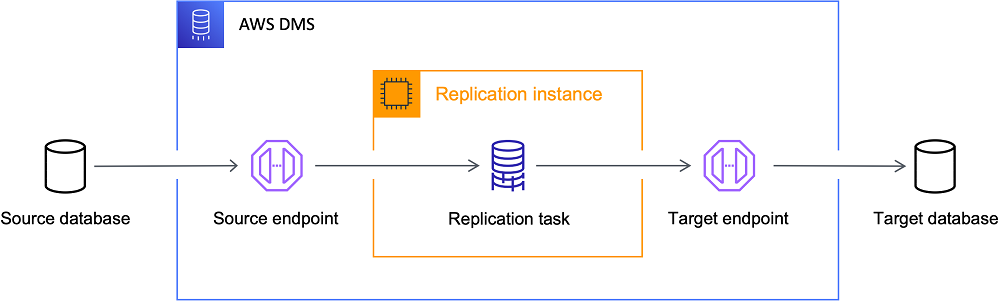

IDC에서 운용중이던 단일 데이터베이스를 AWS Aurora로 이관하는 동시에 MySQL 버전업도 이루어져야 했기 때문에 신경써야할 것이 많았다.  
어떤 의사결정을 거쳐 어떤 부분들을 확인해야 했는지 정리해보려한다.  
  
# 직접 클러스터 구성하기

읽기 전용 DB(Secondary)들을 Primary DB의 Replication DB로 구성하여 **[ProxySQL](https://proxysql.com/)을 사용하여 RW를 분리**하고 **[Orchestrator](https://github.com/openark/orchestrator)를 통하여 페일백/페일오버**를 직접 구성하여 클러스터를 직접 구축하는 것을 고민했다.  


하지만 큰 단점이 있었다.  

1. Proxy SQL에 문제가 생긴다면 모든 DB를 사용할 수 없게 되는 **단일 장애 지점** 이 생긴다.
2. 애플리케이션 외부에서 사용될 DB가 결정되기 때문에 애플리케이션에서 작업 단위(트랜잭션)를 지정하기 힘들어진다.

위의 두 문제가 있어 AWS Aurora 클러스터를 분석하여 사용해보기로 하였다.  
혹시 이 구성에 대해 더 자세히 알고 싶다면 [따라하며 배우는 MySQL on Docker](https://www.inflearn.com/course/mysql-docker/dashboard) 강의를 참고하길 바란다.

# AWS Aurora 클러스터 분석

Aurora 클러스터를 사용하기 위해서는 확인해야 할 부분들이 있었다.

<h3>Aurora 클러스터의 페일오버와 페일백은 어떻게 진행되는가?</h3>

기본 인스턴스에 문제가 발생하는 경우 읽기 인스턴스 중 하나가 기본 인스턴스 역할을 인수한다.  
Aurora는 데이터베이스 문제를 감지하고 필요한 경우 장애 조치 메커니즘을 자동으로 활성화하여 장애 조치 중에 쓰기 작업을 처리하지 못하는 시간이 최소화된다.  
Aurora는 다음 두 가지 방법 중 하나를 사용하여 자동으로 새 기본 인스턴스로 장애 조치한다.  

1. 우선순위가 높은 기존 Aurora 복제본을 새 기본 인스턴스로 승격시킴
2. 새로운 기본 인스턴스 만들기

DB 클러스터에 Aurora 복제본이 하나 이상인 경우에는 장애가 발생하더라도 Aurora 복제본이 기본 인스턴스로 승격되며 **이 실패 이벤트로 인해 예외적으로 실패하는 읽기 및 쓰기 작업 동안 짧은 중단이 발생한다.**  
**일반적인 서비스 복구 시간은 60초 미만이지만 대부분 30초 미만에 복원된다.** (read only connection 예외 발생)  
최소 하나 이상의 Aurora 복제본을 둘 이상의 다른 가용 영역에 생성하는 것이 바람직하다.  
  
DB 클러스터에 Aurora 복제본이 포함되어 있지 않으면 기본 인스턴스가 동일한 AZ에 다시 생성되기 때문에 보통 10분 미만의 시간이 걸리며 그 동안 예외적으로 실패하는 읽기 및 쓰기 작업 동안 중단이 발생한다.  
Aurora 복제본을 기본 인스턴스로 승격시키는 것이 기본 인스턴스를 새로 생성하는 것보다 훨씬 빠르다.  

**출처** : [Amazon Aurora의 고가용성](https://docs.aws.amazon.com/ko_kr/AmazonRDS/latest/AuroraUserGuide/Concepts.AuroraHighAvailability.html)  
  
운영 중 DB 스케일 업에 대한 트러블 슈팅 글도 읽어보면 도움이 될 것이다. [29CM 의 이굿위크 장애대응 기록](https://medium.com/29cm/29cm-%EC%9D%98-%EC%9D%B4%EA%B5%BF%EC%9C%84%ED%81%AC-%EC%9E%A5%EC%95%A0%EB%8C%80%EC%9D%91-%EA%B8%B0%EB%A1%9D-177b6b2f07a0)

<h3>Secondary의 동기화 지연율은 어느정도인가?</h3>

먼저 쓰기 연산은 Primary에서 관리하며 Aurora 복제본(Secondary)은 클러스터 볼륨의 읽기 연산에 사용되므로 읽기 조정에 유용하다.  
데이터들은 단일 AWS 리전에서 다중 가용 영역에 걸쳐 DB 클러스터에 데이터 복사본을 저장하며, DB 클러스터의 인스턴스가 여러 가용성 영역에 걸쳐 있는지 여부에 관계없이 복사본을 저장한다.  


DB 클러스터 볼륨은 DB 클러스터의 여러 데이터 사본으로 구성되어 있지만, DB 클러스터의 Primary 및 Aurora 복제본(Secondary)에는 클러스터 볼륨 데이터가 단 하나의 볼륨으로 표시된다.  
신규 인스턴스가 추가되어도 기존 데이터를 새로 복사하지 않고 DB 클러스터 볼륨에 연결만하기 때문에 인스턴스를 추가하기 용이하다.  
전통적인(기존 MySQL) 방식으로 읽기 인스턴스를 스케일링 하기 위해서는 인스턴스들은 볼륨을 각각 소유하며 binlog를 이용해 SQL문을 복제본으로 전달하여 Primary에서는 멀티 스레드로 수행하던 쿼리를 Secondary에서는 싱글 스레드로 처리하기 때문에 동기화 지연율이 존재할 수 밖에 없다.  
  


> 동기식 복제에서는 하나의 쓰기가 내구성을 갖추려면, 모든 복사본을 확인해야 합니다.  
> 이 방법에서 속도는 디스크, 노드 또는 네트워크 경로에 중 가장 느린 요소에서 얼마나 느린가에 의해 결정됩니다.  
> 반면, 비동기식 복제는 지연 시간을 낮출 수 있지만 데이터를 복제하고 데이터 내구성을 확인하기 전에 장애가 발생하면 데이터가 손실될 수 있습니다.  
> **사실 두 방식 모두 완벽하지 않습니다.** 또한, 장애가 발생하면 복제 구성원 집합에 변경이 발생하게 되므로 쉽지 않습니다.  
  
Amazon Aurora는 **쿼럼 모델**을 사용하여 3개의 가용 영역(AZ)에 걸쳐 4개의 쓰기 세트와 3개의 읽기 세트가 있는 6개 복사본 쿼럼을 사용하며, Pirmary에서 쓰기가 발생하면 6개의 스토리지 노드에 REDO 로그 레코드가 작성되며 **이중 4개의 노드가 쓰기 완료 응답(ACK)을 전송하면 해당 쓰기가 완료된 것으로 확인한다.**  
3개의 AZ에 걸쳐 노드를 분산하기 때문에, 하나의 AZ에 문제가 발생허다러도 내결함성을 유지할 수 있으며, 느린 노드가 존재하더라도 다른 노드가 신속하게 응답하기 때문에 가용성이 떨어지지 않는다.  
  
즉, **Aurora의 읽기 전용 복제본은 마스터 데이터베이스 노드와 동일한 스토리지 볼륨을 공유하며, 마스터의 실행 로그를 비동기로 전달받아 캐시내 데이터 페이지를 갱신한다.**  
그렇기 때문에 읽기 복제본의 데이터 유실이나 마스터 노드로 승격 시키는 비용도 줄어든다.  
  
마스터(쓰기) 노드에서 커밋된 모든 변경사항이 복제본으로 미처 전파되지 않았더라도 영구적으로 저장되며 복제 노드들은 독자적으로 읽기를 수행할 때 읽어야 할 데이터의 쓰기 및 쓰기 완료 응답 등의 현황에 대해 알 수 없다.  
그렇기에 마스터에서 복제본으로 실행 레코드들을 전달할 때 읽기 뷰와 개념적으로 동일한 기능을 함께 제공한다.  
이러한 뷰는 **커밋 LSN** 과 **어떤 세그먼트들이 어떤 LSN으로 영구 저장 되었는지** 의 정보를 보유하고 있으며, 일반적으로 커밋 LSN는 `10 밀리초`마다 반영될 수 있기에 **복제본들은 최소한의 조정으로 마스터 노드와 거의 동일한 정보를 제공할 수 있다.**  
  
> **읽기 뷰**  
> 읽기 뷰는 SQL문 수행 시 커밋된 모든 변경사항을 볼 수 있고, 아직 커밋되지 않은 변경사항은 보지 못하게 하기 위한 논리적인 시점을 설정합니다.  
> MySQL은 가장 최근 커밋의 로그시퀀스번호(LSN)을 설정하여 이를 구현하며, 이러한 방식을 통해 이미 커밋된 모든 변경사항들은 조회 가능하게 하고, 조회되지 말아야 할 변경사항들은 활성 트랜잭션 리스트를 사용하여 확인합니다.  
> 특정 읽기 뷰를 가진 SQL문이 데이터 페이지를 조회할 때, 읽기 뷰 생성 당시 활성화된 트랜잭션들의 변경 사항은 조회되지 말아야 합니다.  
> 이는 변경 사항이 현재 커밋되었거나 읽기 시점 커밋 LSN 이후에 시작된 어떠한 트랜잭션들에 대해서도 동일하게 적용됩니다.  
> 트랜잭션이 읽기 뷰를 생성하면, 시스템 내 발생한 모든 다른 변경 사항들로부터 격리될 수 있습니다. —일관된 특정 시점을 참조할 수 있습니다.
  
**출처**  

1. [Amazon Aurora MySQL을 사용한 복제](https://docs.aws.amazon.com/ko_kr/AmazonRDS/latest/AuroraUserGuide/AuroraMySQL.Replication.html)
2. [Amazon Aurora 내부 들여다보기(1) – 쿼럼 및 상관 오류 해결 방법](https://aws.amazon.com/ko/blogs/korea/amazon-aurora-under-the-hood-quorum-and-correlated-failure/)
3. [Amazon Aurora 내부 들여다보기(2) – 쿼럼 읽기 및 상태 변경](https://aws.amazon.com/ko/blogs/korea/amazon-aurora-under-the-hood-quorum-reads-and-mutating-state/)
4. [AWS Aurora 아키텍처](https://medium.com/garimoo/aws-aurora-%EC%95%84%ED%82%A4%ED%85%8D%EC%B2%98-6ff87b0d48c5)
5. [Amazon Aurora Storage](https://blog.asquareb.com/blog/2021/01/10/amazon-aurora-storage/)

<h3>Aurora 클러스터 스토리지는 어느것을 사용하나?</h3>

Aurora 클러스터 스토리지에는 **Aurora Standard** 와 **Aurora I/O-Optimized** 가 존재한다.  
  
**Aurora Standard**는 I/O 사용량이 낮거나 보편적인 대부분의 환경에서 효율적인 요금으로 사용할 수 있는 구성이기에 많이 선택되는 것 같다.    
**Aurora I/O-Optimized**는 I/O를 많이 사용하는 애플리케이션(결제 처리 시스템, 전자상거래 시스템, 금융 애플리케이션 등)에 우수한 가격 대비 성능을 제공하는 데이터베이스 클러스터 구성이다.  
또한 I/O 지출이 총 Aurora 데이터베이스 지출의 25%를 초과하는 경우 Aurora I/O-Optimized를 이용하면 I/O 집약적 워크로드의 비용을 최대 40% 절감할 수 있다.  
  
클러스터 구성에서 스토리지 구성 수정이 가능하기 때문에 현재는 Standard로 설정했으며, 운영 반영 후에 CloudWatch를 사용하여 비용을 추정해보려 한다.  
[Amazon CloudWatch를 이용한 Amazon Aurora I/O Optimized 기능에 대한 비용 절감 예상하기](https://aws.amazon.com/ko/blogs/tech/estimate-cost-savings-for-the-amazon-aurora-i-o-optimized-feature-using-amazon-cloudwatch/)
  
**출처**  
1. [Aurora FAQ](https://aws.amazon.com/ko/rds/aurora/faqs/)
2. [Aurora 클러스터 스토리지 구성](https://docs.aws.amazon.com/ko_kr/AmazonRDS/latest/AuroraUserGuide/Aurora.Overview.StorageReliability.html)
3. [Aurora 클러스터 스토리지 요금](https://aws.amazon.com/ko/rds/aurora/pricing/)

<h3>정리</h3>

AWS Aurora 클러스터의 장점들을 확인할 수 있었다.

1. **동기화 지연율**
2. **안정적인 백업**
3. **고가용성(페일오버)**

위의 장점들만 보아도 클러스터를 직접 구성하여 관리 포인트가 늘어나는 것 보다 AWS Aurora를 사용하는 것이 타당한 선택이란 것을 확인할 수 있다.  

## Aurora 인스턴스 스펙 선정을 위한 부하 테스트

Aurora 클러스터를 사용하기로 결정했다면 이제 쓰기 인스턴스의 기본 스펙을 어느정도로 사용할지 추산해야 한다.  
부하 테스트 결과를 통해 운영 환경과 비슷한 스펙의 DB와 AWS 인스턴스를 비교하기에는 **mysqlslap** 의 테스트 결과 내용은 **sysbench**에 비해 테스트 결과 내용이 빈약하다고 느꼈다.  

```
# mysqlslap
Benchmark
        Average number of seconds to run all queries: 217.151 seconds
        Minimum number of seconds to run all queries: 213.368 seconds
        Maximum number of seconds to run all queries: 220.934 seconds
        Number of clients running queries: 20
        Average number of queries per client: 50


User time 58.16, System time 18.31
Maximum resident set size 909008, Integral resident set size 0
Non-physical pagefaults 2353672, Physical pagefaults 0, Swaps 0
Blocks in 0 out 0, Messages in 0 out 0, Signals 0
Voluntary context switches 102785, Involuntary context switches 43
```
mysqlslap에 더 자세한 내용은 [mysqlslap으로 MySQL 쿼리 성능을 측정하는 방법](https://www.digitalocean.com/community/tutorials/how-to-measure-mysql-query-performance-with-mysqlslap)을 참고하길 바란다.  
  
```
# sysbench
Running the test with following options:				
Number of threads: 1				
Initializing random number generator from current time				
            
            
Initializing worker threads...				
            
Threads started!				
            
SQL statistics:				
    queries performed:				
        read:                            23282				
        write:                           0				
        other:                           3326				
        total:                           26608				
    transactions:                        1663   (166.17 per sec.)				
    queries:                             26608  (2658.80 per sec.)				
    ignored errors:                      0      (0.00 per sec.)				
    reconnects:                          0      (0.00 per sec.)				
            
General statistics:				
    total time:                          10.0022s				
    total number of events:              1663				
            
Latency (ms):				
         min:                                    4.93				
         avg:                                    6.01				
         max:                                   12.26				
         95th percentile:                        6.79				
         sum:                                 9992.34				
            
Threads fairness:				
    events (avg/stddev):           1663.0000/0.00				
    execution time (avg/stddev):   9.9923/0.00				
```

sysbench는 테스트에 실행된 총 쿼리수(초당 쿼리수), 총 소요시간, 지연율, [95 백분위수](https://www.percona.com/blog/computing-95-percentile-in-mysql/)까지 자동으로 계산해주기에 성능 비교에는 sysbench가 유용할 것이라고 판단했다.  
그리고 **sysbench는 테스트에 사용할 task의 종류를 지정할 수 있다.**  

- bulk_insert.lua
- oltp_common.lua
- oltp_delete.lua
- oltp_insert.lua
- oltp_point_select.lua
- **oltp_read_only.lua**
- oltp_read_only_custom.lua
- **oltp_read_write.lua**
- oltp_update_index.lua
- oltp_update_non_index.lua
- **oltp_write_only.lua**
- **select_random_points.lua**
- **select_random_ranges.lua**

```shell
#!/bin/bash
host=$1
port=$2
user=$3
password=$4
task=$5
filename=$6

sysbench --mysql-host=$host --mysql-port=$port --mysql-user=$user --mysql-password=$password --mysql-db=test --table-size=444444 /usr/share/sysbench/$task cleanup
sysbench --mysql-host=$host --mysql-port=$port --mysql-user=$user --mysql-password=$password --mysql-db=test --table-size=444444 /usr/share/sysbench/$task prepare

sysbench --mysql-host=$host --mysql-port=$port --mysql-user=$user --mysql-password=$password --mysql-db=test --threads=1 --table-size=444444 /usr/share/sysbench/$task run >> /stress_test/$filename.txt
...
sysbench --mysql-host=$host --mysql-port=$port --mysql-user=$user --mysql-password=$password --mysql-db=test --threads=2000 --table-size=444444 /usr/share/sysbench/$task run >> /stress_test/$filename.txt
```

테스트를 실행하기전 `prepare`를 꼭 거쳐야하며, 테스트가 끝나고 기존에 사용한 테이블과 데이터를 `cleanup`단계에서 제거해야 한다.  
테스트에 사용한 쉘 스크립트이며, `cleanup` → `prepare` → `task` 순서로 정의했다.  

```sql
-- prepare 단계
create table sbtest1
(
   id int auto_increment
   primary key,
   k int default 0 not null,
   c char(120) default '' not null,
   pad char(60) default '' not null
);
create index k_1 on sbtest1 (k);

-- readonly 태스크
SELECT c FROM sbtest1 WHERE id=44
SELECT c FROM sbtest1 WHERE id=55
SELECT c FROM sbtest1 WHERE id BETWEEN 51 AND 150
SELECT SUM(k) FROM sbtest1 WHERE id BETWEEN 51 AND 150
SELECT c FROM sbtest1 WHERE id BETWEEN 51 AND 150 ORDER BY c
SELECT DISTINCT c FROM sbtest1 WHERE id BETWEEN 50 AND 149 ORDER BY c

-- writeonly 태스크
UPDATE sbtest1 SET k=k+1 WHERE id=2
UPDATE sbtest1 SET c='03600646353' WHERE id=2
DELETE FROM sbtest1 WHERE id=2
INSERT INTO sbtest1 (id, k, c, pad) VALUES (2, 2, '38823248060', '42610989539')

-- select_random_points 태스크
SELECT id, k, c, pad FROM sbtest1 WHERE k IN (1, 2, 1, 2, 1, 1, 2, 1, 2, 2)

-- select_random_range 태스크
SELECT count(k)
FROM sbtest1
WHERE k BETWEEN 50 AND 55 OR k BETWEEN 50 AND 55 OR k BETWEEN 54 AND 59 OR k BETWEEN 51 AND 56 OR k BETWEEN 60 AND 65 OR k BETWEEN 50 AND 55 OR k BETWEEN 50 AND 55 OR k BETWEEN 51 AND 56 OR k BETWEEN 57 AND 62 OR k BETWEEN 50 AND 55
```

prepare 단계에서 `sbtest1`과 같은 테이블을 생성하고 각 `task`에 맞는 쿼리들을 부하 테스트에 사용한다.  


**총 5개의 task** 를 사용하여 스레드를 `1 ~ 2000개`까지 늘리면서 테스트를 진행하고 **평균 실행 쿼리 개수**와 **평균 지연율**, **95 백분위수**를 기준으로 비교하였다.  

> 즉, **3개의 스펙 서버(AWS 인스턴스 2개, 운영 DB와 비슷한 스펙 서버) * 5개의 task * 10번의 스레드별 테스트** 를 진행하였다.  
> 각 서버들의 버퍼풀 크기가 상이하여 동일한 식별자를 가진 쿼리를 기준으로 테스트하지 않았으며 버퍼풀 워밍업은 고려하지 않았다.  

부하 테스트를 통해 인스턴스 스펙간 차이는 어느정도 확인되었지만 현재 운영 중인 DB에 얼마정도의 요청이 들어오는지 확인이 필요했다.  
현재 모니터링 툴로 와탭을 사용중인데, 와탭은 짧은 시간에 다량으로 처리되는 쿼리는 확인하기 힘들다.  

> 5초마다 조회된 시점의 액티브 세션 기준으로 조회되기 때문에 조회 시점에 액티브 세션이 존재하지 않는 건이라면 MySQL 통계에는 보이지 않을 수 있다.  
> 와탭을 이용해서 단시간에 빠르게 처리된 쿼리들을 모두 확인은 할 수 없다.

위와 같은 이유로 운영 DB에 유입되는 질의문의 양을 측정할 수 있는 것은 MySQL의 [`Com_xxx` 서버 상태 변수](https://dev.mysql.com/doc/refman/8.0/en/server-status-variables.html)가 가장 믿을만하다고 판단하여 한 달 동안의 명령 횟수와 위에서 산출된 부하 테스트의 처리량을 비교하여 추산하였다.  
  
> 전역 `Com_xxx` 변수는 서버가 실행되는 동안 특정 질의문이 실행된 횟수를 나타낸다.  


# 스프링에서 읽기/쓰기 분리

읽기/쓰기 커넥션을 분리하기 위해 [권남님의 replication-datasource](https://github.com/kwon37xi/replication-datasource)를 참고하였다.  
Primary와 Secondary의 DataSource 정보를 주입받아 읽기/쓰기 라우팅을 시켜줄 `AbstractRoutingDataSource`를 상속받았다.  

> **AbstractRoutingDataSource?**  
> 조회 키를 기반으로 getConnection() 호출을 다양한 대상 DataSource 중 하나로 라우팅하는 추상 DataSource 구현입니다.  
> 후자는 일반적으로 일부 스레드 바인딩 트랜잭션 컨텍스트를 통해 결정됩니다.  

즉, 현재 컨텍스트에 따라 데이터 소스를 동적으로 결정할 수 있는 방법을 제공하는 추상 클래스이다.  

```kotlin
class TransactionRoutingDataSource(
    primary: DataSource,
    secondary: DataSource
) : AbstractRoutingDataSource() {

    init {
        super.setTargetDataSources(mapOf(
            READ_WRITE to primary,
            READ_ONLY to secondary
        ))
        super.setDefaultTargetDataSource(primary)
    }

    override fun determineCurrentLookupKey(): Any {
        return DataSourceType.from(TransactionSynchronizationManager.isCurrentTransactionReadOnly())
    }

    private enum class DataSourceType {
        READ_WRITE,
        READ_ONLY;

        companion object {
            fun from(isReadOnly: Boolean) = if (isReadOnly) READ_ONLY else READ_WRITE
        }
    }
}
```

상속받아 구현한 라우팅의 책임을 가진 TransactionRoutingDataSource를 스프링에서 사용할 DataSource로 등록할 때 `LazyConnectionDataSourceProxy`로 랩핑하여 등록한다.  

> **LazyConnectionDataSourceProxy?**  
> 실제 JDBC 연결을 느리게 가져오는 대상 데이터 소스에 대한 프록시입니다.  
> 즉, 처음으로 명령문을 생성할 때까지는 가져오지 않습니다. 자동 커밋 모드, 트랜잭션 격리 및 읽기 전용 모드와 같은 연결 초기화 속성은 실제 연결을 가져오는 즉시(있는 경우) 실제 JDBC 연결에 유지되고 적용됩니다.  
> ...  
> 이 DataSource 프록시를 사용하면 실제로 필요한 경우가 아니면 풀에서 JDBC 연결을 가져오는 것을 방지할 수 있습니다. JDBC 트랜잭션 제어는 풀에서 연결을 가져오거나 데이터베이스와 통신하지 않고도 발생할 수 있습니다.  
> 이는 JDBC 문을 처음 생성할 때 느리게 수행됩니다.

즉, 실제로 커넥션이 필요한 경우가 아니라면 풀에서 커넥션을 점유하지 않고 실제로 필요한 시점에 커넥션을 점유하도록 할 수 있다.  
트랜잭션 진입 시점에 커넥션을 결정하지 않고 실제로 필요할 때 (`readonly` 속성에 따라) `TransactionSynchronizationManager.isCurrentTransactionReadOnly()` 결과를 기반으로 데이터 소스를 선택할 수 있게 된 것이다.  

```kotlin
@Bean
@ConfigurationProperties(prefix = "spring.datasource.primary")
open fun primaryDataSource(): DataSource {
   return DataSourceBuilder.create().build()
}

@Bean
@ConfigurationProperties(prefix = "spring.datasource.secondary")
open fun secondaryDataSource(): DataSource {
   return DataSourceBuilder.create().build()
}

@Primary
@Bean
@DependsOn("primaryDataSource", "secondaryDataSource")
open fun routingDataSource(): DataSource {
   return TransactionRoutingDataSource(primaryDataSource(), secondaryDataSource())
}

@Bean
open fun dataSourceTransactionManager(routingDataSource: DataSource): PlatformTransactionManager {
   return DataSourceTransactionManager(LazyConnectionDataSourceProxy(routingDataSource))
}
```

더 자세한 이해와 원리는 다른 글로 정리하겠다.  

# AWS DMS를 이용한 데이터 이관



DMS는 데이터 마이그레이션 서비스로, 다양한 소스 데이터베이스에서 AWS 클라우드로 데이터를 안전하고 쉽게 마이그레이션할 수 있도록 제공되는 서비스다.  
이관을 진행하기 위해서는 아래의 오브젝트를 준비해야 한다.  

1. 소스 DB와 타겟 DB의 **엔드포인트**
2. 이관을 진행할 때 사용될 **복제 인스턴스**
3. 두 개의 엔드포인트와 복제 인스턴스를 사용하여 실제 이관할 이관 전략을 지정하는 **데이터베이스 마이그레이션 태스크**

제일 중요한 것은 **데이터베이스 마이그레이션 태스크** 지정인데, 이와 관련해서 유의해야 할 점들을 살펴보자.

<h3>1. 적재 모드 선택과 데이터 검증</h3>

**초기 적재** 와 **변경 사항 복제** 를 선택할 수 있으며 두 작업을 함께 진행하도록 할 수도 있다.  

1. **기존 데이터 마이그레이션(전체 로드만)** - 소스 엔드포인트에서 대상 엔드포인트로 한 번만 마이그레이션을 수행
2. **기존 데이터 마이그레이션 및 진행 중인 변경 사항 복제(전체 로드 및 CDC)** - 소스에서 대상으로 한 번 마이그레이션을 수행한 다음, 소스에서 대상으로 데이터 변경 사항을 계속 복제
3. **데이터 변경 사항만 복제(CDC만 해당)** - 일회성 마이그레이션을 수행하지 않고 소스에서 타깃으로 데이터 변경 사항을 계속 복제
  
변경 사항 복제는 초기 적재가 끝나면 소스 DB의 binlog를 기반으로 타겟 DB에 동기화 시키는 작업을 의미한다.  
해당 기능을 실행하기 위해서는 소스 DB의 binlog가 활성화되어 있어야 하며, [binlog 보존 시간](https://docs.aws.amazon.com/AmazonRDS/latest/UserGuide/mysql-stored-proc-configuring.html#mysql_rds_set_configuration-usage-notes.binlog-retention-hours)을 확인해야 한다.  
  
그리고 초기 적재가 끝나면 소스 DB와 타겟 DB의 **데이터 검증** 작업도 지정할 수 있다.  
데이터 검증에 문제가 발생하면 어떤 문제가 발생했는지 `awsdms_control.awsdms_validation_failures_v1` 테이블에서 확인할 수 있다.  

```
+---------+-----------+----------+-----------------------+--------+-----------------------------------+--------------+
|TASK_NAME|TABLE_OWNER|TABLE_NAME|FAILURE_TIME           |KEY_TYPE|KEY                                |FAILURE_TYPE  |
+---------+-----------+----------+-----------------------+--------+-----------------------------------+--------------+
|...      |...        |...       |2024-03-29 04:28:55.367|Row     |{ "key":	["key1", "key2", ...] }   |MISSING_TARGET|
|...      |...        |...       |2024-03-29 04:28:55.409|Row     |{ "key":	["key1", "key2", ...] }   |MISSING_SOURCE|
+---------+-----------+----------+-----------------------+--------+-----------------------------------+--------------+
```

어떤 DB에서 실패하였는지, 어떤 레코드인지 식별하기 위한 정보들이 모두 들어있다.  
실제로 이관이 끝나고 해당 로그를 기반으로 어떤 레코드에 문제가 있었는지 확인하기 편하다.  
  
<h3>2. 파티셔닝 테이블 이관</h3>

DMS는 분할된 테이블에 대한 DDL을 지원하지 않기 때문에 이관 대상 테이블에 파티셔닝된 테이블이 있다면, 대상 DB에 미리 생성해놓아야 한다.  
그리고 꼭 **대상 테이블 준비 모드는 `"아무 작업 안함"` 또는 `"자르기"`를 선택** 하여 이관 시작시 대상 DB의 메타데이터를 삭제하지 않도록 해야 한다.  

<h3>3. LOB 컬럼</h3>

이관 테이블 중 LOB 컬럼이 존재한다면 아래의 설정에 신경써야 한다.  


해당 컬럼의 최대 사이즈가 13kb인 것을 확인하여서 기본 값인 64kb를 넘지 않아 전체 LOB 모드로 실행하였다.  

```sql
SELECT MAX(OCTET_LENGTH({lob_column})) / 1024 AS max_size_kb
FROM {table};
```

그리고 LOB 컬럼은 테이블에 데이터 INSERT 시점에 이관되지 않고 **삽입된 레코드에 UPDATE로 이관**되기 때문에 만약 LOB 컬럼이 NOT NULL이라면 **이관할 때에는 NULL을 허용하고 이관 끝난 후에 UPDATE** 해줘야 한다.  

<h3>4. 이관 시 소스 엔드포인트 ServerTimeZone 설정</h3>

소스 DB의 timezone이 UTC가 아니고 TIMESTAMPE 컬럼을 사용중이라면 소스 엔드포인트의 ServerTimeZone을 설정해줘야 한다.  
[How do I migrate a MySQL database in a non-UTC time zone using AWS DMS tasks?](https://repost.aws/knowledge-center/dms-migrate-mysql-non-utc)  

# MySQL 버전업을 진행하면서 고려해야할 점

<h3>1. 예약어</h3>

작성된 쿼리 중에 예약어가 포함되어 있는지 확인해야 한다. [MySQL 예약어](https://dev.mysql.com/doc/refman/8.0/en/keywords.html#keywords-8-0-detailed-C)에서 사용 중인 예약어가 있는지 확인하는 것이 좋다.  
MySQL 8.0.2에 추가된 `RANK` 예약어가 포함되어 있어서 모두 백틱으로 처리해주었다.  
  
그리고 아래와 같이 Map의 Entry를 순회하며 생성하는 동적 쿼리에서 `${key}`에 예약어가 포함되는 경우가 있어서 해당 쿼리도 백틱으로 처리해주었다.  

```xml
<update id="update..." parameterType="java.util.Map">
    UPDATE ...
    <foreach item="value" index="key" collection="data.entrySet()" separator=",">
        `${key}` = #{value}
    </foreach>
    WHERE ...
</update>
```

<h3>2. SSL 설정</h3>

각 애플리케이션에서 여러 DB를 사용하는데 DB 중에 MySQL 5.6이 포함되어 있어 해당 연결에서 `useSSL=false` 속성을 사용 중이였다.  
MySQL 5.6은 SSL 설정을 직접 해주어야 하는데 따로 설정하지 않고 사용 중이라서 해당 속성을 지정한 것 같다.  
  
이번에 추가한 AWS Aurora MySQL 8.0.28은 1.2와 1.3버전을 지원하고 Java 8부터 1.2를 지원하기 때문에 `useSSL=false` 속성을 모두 제거해도 무방하다.  

| Java Version | SSL/TLS Default | Other Supported Versions                         |
|:--------------:|:-----------------:|:--------------------------------------------------:|
| Java 6       | TLS 1.0         | TLS 1.1 (update 111 and later), SSLv3.0*         |
| Java 7       | TLS 1.0         | TLS 1.2, TLS 1.1, SSLv3.0*                       |
| Java 8       | TLS 1.2         | TLS 1.1, TLS 1.0, SSLv3.0*                       |


```sql
show global variables like '%tls%'

+----------------------+---------------+
|Variable_name         |Value          |
+----------------------+---------------+
|admin_tls_ciphersuites|               |
|admin_tls_version     |TLSv1.2,TLSv1.3|
|aurora_zd_tls_v1_3    |ON             |
|tls_ciphersuites      |               |
|tls_version           |TLSv1.2,TLSv1.3|
+----------------------+---------------+
```

아래의 쿼리로 모든 연결이 SSL로 연결되었는지 확인할 수 있다.  

```sql
select b.processlist_user,
       b.processlist_id,
       b.connection_type,
       b.PROCESSLIST_HOST,
       a.ssl_version,
       a.ssl_cipher
from sys.session_ssl_status a join performance_schema.threads b
   on a.thread_id= b.thread_id
order by ssl_version desc;

+----------------+--------------+---------------+----------------+-----------+---------------------------+
|processlist_user|processlist_id|connection_type|PROCESSLIST_HOST|ssl_version|ssl_cipher                 |
+----------------+--------------+---------------+----------------+-----------+---------------------------+
|user            |811513        |SSL/TLS        |...             |TLSv1.3    |TLS_AES_256_GCM_SHA384     |
|user            |811738        |SSL/TLS        |...             |TLSv1.3    |TLS_AES_256_GCM_SHA384     |
|user            |810957        |SSL/TLS        |...             |TLSv1.2    |ECDHE-RSA-AES256-GCM-SHA384|
|user            |810965        |SSL/TLS        |...             |TLSv1.2    |ECDHE-RSA-AES256-GCM-SHA384|
|user            |810970        |SSL/TLS        |...             |TLSv1.2    |ECDHE-RSA-AES256-GCM-SHA384|
+----------------+--------------+---------------+----------------+-----------+---------------------------+
```

<h3>3. utf8mb3 → utf8mb4</h3>

MySQL 8.0 부터는 기본적으로 utf8mb4를 지원하며 utf8mb3는 deprecate될 예정이므로 마이그레이션 하면서 테이블 collation을 변경하여야 한다.  
최대 문자 길이가 3바이트에서 4바이트로 더 많이 차지하기 때문에 확인할 것이 있다.  
  
첫 번째로 **테이블의 컬럼 최대 사이즈를 확인** 하여야 한다.  
[VARCHAR는 최대 65535 바이트를 저장](https://dev.mysql.com/doc/refman/8.0/en/char.html)할 수 있기에 최대 길이를 줄여야 한다.  
테이블에 `VARCHAR(20000)` 컬럼을 `VARCHAR(15000)`으로 수정하였다. 수정하기전에 당연히 해당 컬럼의 최대 길이를 확인해야 한다.  
  
두 번째로 최대 문자 수가 줄어들면서 인덱스의 사이즈도 줄어들기 때문에 **인덱스 사이즈를 확인** 하여야 한다.  
ROW_FORMAT에 따라 최대 인덱스 사이즈가 다르기 때문에 ROW_FORMAT을 먼저 확인하여야 한다.  
  
```sql
SELECT TABLE_NAME, ROW_FORMAT
FROM INFORMATION_SCHEMA.TABLES

+----------+----------+
|TABLE_NAME|ROW_FORMAT|
+----------+----------+
|...       |Dynamic   |
|...       |Dynamic   |
|...       |Dynamic   |
+----------+----------+
```

Dynamic으로 구성되어 있는 경우 최대 3072바이트까지 가능하다.  
사용중인 모든 인덱스 구성의 컬럼 길이 합이 3072바이트를 초과하는지 확인하면 된다.  

```sql
SELECT
    S.TABLE_SCHEMA,
    S.TABLE_NAME,
    INDEX_NAME,
    SUM(COALESCE(SUB_PART, CHARACTER_MAXIMUM_LENGTH)) AS TOTAL_INDEX_LENGTH
FROM
    INFORMATION_SCHEMA.STATISTICS AS S JOIN INFORMATION_SCHEMA.COLUMNS AS C
        ON S.TABLE_SCHEMA = C.TABLE_SCHEMA
        AND S.TABLE_NAME = C.TABLE_NAME
        AND S.COLUMN_NAME = C.COLUMN_NAME
WHERE S.TABLE_SCHEMA = 'business'
GROUP BY TABLE_SCHEMA,TABLE_NAME,INDEX_NAME;
```
  
**참고**  
1. [Converting Between 3-Byte and 4-Byte Unicode Character Sets](https://dev.mysql.com/doc/refman/8.0/en/charset-unicode-conversion.html)
2. [DYNAMIC Row Format](https://dev.mysql.com/doc/refman/8.0/en/innodb-row-format.html#innodb-row-format-dynamic)
3. [InnoDB Limits](https://dev.mysql.com/doc/refman/8.0/en/innodb-limits.html)

<h3>4. ZEROFILL</h3>

MySQL 8.0.17부터 숫자 데이터 유형에 대한 ZEROFILL 속성과 정수 데이터 유형에 대한 표시 너비 속성은 더 이상 사용되지 않기 때문에 테이블 DDL에 `INT(4)`와 같이 너비를 지정해주면 경고 메시지가 발생한다.  
추가로 FLOAT 및 DOUBLE 열에 대한 AUTO_INCREMENT 지원도 향후 MySQL 버전에서 제거될 예정이기 때무에 정수 유형으로 변환해야한다.  
  
**참고**  
1. [Numeric Type Attributes](https://dev.mysql.com/doc/refman/8.0/en/numeric-type-attributes.html)
