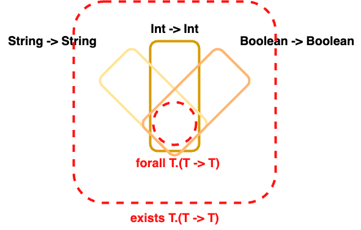

> [타입으로 견고하게 다형성으로 유연하게](https://www.yes24.com/Product/Goods/122890814) 책을 정리한 내용입니다.

이 글을 통해 
1. **타입**
2. 여러 종류의 **다형성**과 **가변성**
3. **제네릭 가변성**

대해 알아보자. 자연스럽게 타입 검사기와 더 친해질 수 있을 것이다.  
(예제 코드는 기본적으로 코틀린을 사용하지만 코틀린에 제공되지 않는 기능들은 첫 줄에 사용한 언어를 표시해놓았다.)  

# 다형성

다형성은 프로그램의 **한 개체**가 여러 타입에 속하도록 만드는 것이다.  
개체는 값, 함수, 클래스, 메서드 등 여러 가지가 될 수 있다.  
  
하나의 값이 여러 타입에 속할 수도 있고, 한 함수를 여러 타입의 함수로 사용할 수도 있는 것이다.  
**다형성은 거의 모든 정적 타입 언어에서만 발견할 수 있는 매우 널리 사용되는 개념이다.**  
`"어떤 개체에 다형성을 부여하는지"` , `"어떻게 다형성을 부여하는지"` 를 이해하는 것이 중요하다.  

## 서브타입에 의한 다형성

이 주제는 객체를 다룰 때 유용하며 **서브타입** 이라는 개념을 통해 다형성을 실현한다.    
서브타입은 타입 사이의 관계이며, `"A는 B이다."` 라는 설명이 올바르다면 `A는 B의 서브타입` , `B는 A의 슈퍼타입`이다.  
반대로 `"B는 A이다."`는 성립하지 않는다.    
  
A는 B의 서브타입일 때 B 타입의 부품을 A 타입의 부품으로도 간주할 수 있게 하는 기능이 서브타입에 의한 다형성이다.  
즉, **슈퍼타입이 요구되는 자리에 서브타입이 위치하더라도 타입 검사기가 문제삼지 않는다는 것이다.**  
타입 검사기가 객체 타입의 서브타입 관계를 판단할 때 **이름에 의한 서브타입**과 **구조에 의한 서브타입**이 존재한다.  
  
### 이름에 의한 서브타입


클래스의 이름과 클래스 사이의 상속 관계만 고려한다.
  
```kotlin
open class Person(val name: String)
class Marathoner(name: String): Person(name)
```
```kotlin
fun run(person: Person) {
    ..
}

run(Person(...))
run(Marathoner(...))
```
```kotlin
fun run(marathoner: Marathoner) {
    ..
}

run(Person(name))       // 컴파일 에러
run(Marathoner(name))
```
  
### 구조에 의한 서브타입


만약 Person과 Marathoner라는 콘크리트 클래스가 서로 관계가 맺어져 있지 않고 다른 라이브러리에 존재한다고 가정하면 함수를 같이 사용할 수 없게된다.  
이 문제를 **구조를 드러내는 타입**을 사용하여 `"A가 B에 정의된 필드와 메서드를 모두 정의한다면 A는 B의 서브타입이다."` 라는 규칙을 적용하게 하여 해결할 수 있다.  
언어가 구조에 의한 서브타입을 제공하면 추상 메서드를 대체할 수 있기 때문에 추상 메서드의 필요성이 줄어든다.  
  
```kotlin
// scala
class Person(val name: String) {
  def greeting(word: String): Unit = {
    println(word)
  }
}
class Marathoner(val name: String, val awards: List[String]) {
  def greeting(word: String): Unit = {
    println(word)
  }
}

// 필드 구조를 드러내어 다형성을 해결
def run(person: { val name: String }): Unit = {
   // person.name
}

run(new Person(name))
run(new Marathoner(name, null))

// 메서드 구조를 드러내어 다형성을 해결
def _greeting(person: { def greeting(word: String): Unit }, word: String): Unit = {
   person.greeting(word)
}

_greeting(new Person(name), "hello")
_greeting(new Marathoner(name, null), "hi")
```

### 집합론적 서브타입

> 타입은 프로그램에 존재하는 값들을 그 능력에 따라 분류한 것이다. 여기서 값은 변수에 저장되거나 함수에서 반환될 수 있는 모든 것들을 말한다.

<h3>최대 타입 (전체 집합, top type)</h3>

**`"아무 값이나 가능하다"`는 사실을 타입으로 표현하기 위함이다.**  
가장 큰 타입이며 모든 값을 포함하는 타입이다.  
이 정의에 따라 **모든 타입은 최대 타입의 서브타입이며, 최대 타입은 모든 타입의 슈퍼타입이다.**  
  
자바에서는 `Object`, 코틀린에서는 `Any?`를 의미한다.  

<h3>최소 타입 (공집합, bottom type)</h3>

예외가 발생하여 실행이 즉시 끝나는 경우, 타입 검사를 통과한 프로그램이더라도 예외가 발생해 실행이 갑작스럽게 중단되는 경우를 다루기 위함이다.  

```kotlin
fun error() {
    throw RuntimeException()
}

fun assertEquals(num1: Int, num2: Int) : Boolean = 
   if (num1 == num2) true else error() // 컴파일 에러
```

위의 `assertEquals`는 정상적인 경우 `true`를 반환하므로 `Boolean`을 반환하는 것이 합당해 보일 수 있지만 컴파일 에러가 발생한다.  

```kotlin
fun error(): Boolean {
    throw RuntimeException()
}

fun assertEquals(num1: Int, num2: Int) : Boolean = 
    if (num1 == num2) true else error()

fun assertEqualsYesOrThrowException(num1: Int, num2: Int) : String = 
    if (num1 == num2) "Y" else error()    // 컴파일 에러
```

`error()` 함수를 `Boolean`을 반환하도록 수정하면 컴파일을 완료할 수 있다.  
하지만 `error()` 함수가 다른 타입에서도 사용되어야 한다면 그 타입에 맞는 타입을 반환하는 함수가 계속 추가되어야 한다.  
  
error() 함수는 **값을 반환하지 못한 채 예외가 발생하는 함수**이므로 어디서든 사용할 수 있도록 하는 것이 맞다.  
이때 **`"계산을 끝마치지 못한다"`를 표현하기 위한 타입, 어떤 값도 속하지 않는 타입이 최소 타입을 사용할 수 있다.**  
   
```kotlin
fun error(): Nothing {
    throw RuntimeException()
}

fun assertEquals(num1: Int, num2: Int) : Boolean =
    if (num1 == num2) true else error()
fun assertEqualsYesOrThrowException(num1: Int, num2: Int) : String =
    if (num1 == num2) "Y" else error()
```


[Kotlin의 Nothing](https://github.com/jdalma/footprints/tree/main/%EC%BD%94%ED%8B%80%EB%A6%B0#%EB%84%90-%EA%B0%80%EB%8A%A5%EC%84%B1%EC%97%90-%EB%8C%80%ED%95%9C-%EC%8A%A4%EB%A7%88%ED%8A%B8-%EC%BA%90%EC%8A%A4%ED%8A%B8%EC%99%80-nothing-%ED%83%80%EC%9E%85)을 사용하여 예외를 던지는 함수를 어디서든 호출할 수 있도록 하여 문제를 해결할 수 있다.  
**최대 타입이 "아무 값이나 될 수 있다."를 의미한다면 최소 타입은 "아무 곳에나 사용될 수 있다."를 의미한다.**  
  
<h3>이거나 타입 (합집합, union type)</h3>

한 함수가 받는 인자 타입이 여러 가지가 되어야 하는 경우 유용하게 사용할 수 있는 타입이다.  

```typescript
// typescript
function write(data: string | number): void {
    if (typeof data === "string") {
        let str: string = data;
        // ...
    } else {
        let num: number = data;
        // ...
    }
}

write(1)
write("abcd")
```

<h3>이면서 타입 (교집합, intersection type)</h3>


다중 상속을 다룰 때 유용하다. 위의 그림과 같이 어떤 함수를 `Trainer`와 `Developer`를 동시에 인자로 받도록 지정하고 싶을 때 편리하게 사용할 수 있다.  

```typescript
// typescript
interface Person {
  name: string;
}
interface Marathoner {
  awards: string[];
}
class Trainer implements Person, Marathoner {
    awards: string[]=[];
    name!: string;
}
class Developer implements Person, Marathoner {
    awards: string[]=[];
    name!: string;
}

function getName(person: Trainer & Developer): String {
    return person.name;
}
```

### 함수와 서브타입

언어가 함수를 값으로 사용할 수 있는 일급 함수를 지원하고 객체와 서브타입에 의한 다형성이 존재하면 **함수 타입 사이의 서브타입 관계를 따질 필요가 생긴다.**  
  
```kotlin
open class Person
class Marathoner : Person()

val selectBySupertype: (Person) -> Marathoner = ..
val selectBySubtype: (Marathoner) -> Marathoner = ..

fun select(selector: (Marathoner) -> Person) {
   val person = selector(Marathoner())
   ..
}

@Test
fun call() {
   select(selectBySupertype)
   select(selectBySubtype)
}
```

이전에 배운 `"A는 B이다."`에 입각하여 위의 예제를 보면 `(Person) -> Boolean`은 `(Marathoner) -> Boolean`의 서브타입이다.  
**"사람을 인자로 받을 수 있는 함수는 마라토너를 인자로 받을 수 있는 함수다."** 가 성립되기 때문이다.  
  
하지만 그 반대인 `(Marathoner) -> Boolean`은 `(Person) -> Boolean`의 서브타입이 아니다.  
**"마라토너를 인자로 받을 수 있는 함수는 사람을 인자로 받을 수 있는 함수다."** 가 성립되지 않기 때문이다.  
  

  
| 람다 \ 함수 인자 | selectSuperToSuper | selectSubToSuper | selectSuperToSub | selectSubToSub |
| :----- | :-----: | :-: | :-: | :-: |
| `(Sub) -> Sub`       | ❌ | O | ❌ | O |
| `(Sub) -> Super`     | ❌ | O | ❌ | ❌ |
| `(Super) -> Super`   | O  | O | ❌ | ❌ |
| `(Super) -> Sub`     | O  | O | O | O |

즉, A가 B의 서브타입일 떄 `B -> C`가 `A -> C`의 서브타입이며 그 반대는 성립하지 않는다.  
따라서 **함수 타입은 매개변수 타입의 서브타입 관계를 뒤집는다.**  
결과 타입의 서브타입 관계가 유지된다는 사실은 나름 직관적인것에 비해, 매개변수 타입의 서브타입 관계가 뒤집히는게 이상할 수 있지만 논리적으로 타당하다.  
  
`selectSubToSuper`의 함수는 4가지의 람다를 모두 허용하는 이유가 **"함수 타입은 매개변수 타입의 서브타입 관계를 뒤집고 결과 타입의 서브타입 관계는 유지하기 때문이다."** ⭐️  

## 매개변수에 의한 다형성

매개변수에 의한 다형성은 **타입 매개변수를 통해 다형성을 만드는 기능으로, 제네릭스라고도 부른다.**  

```kotlin
fun <T> choose(v1: T, v2: T): T {
   println(v1)
   println(v2)
   return if(readln() == "Y") v1 else v2
}
```

`T`를 매개변수 타입 표시와 결과 타입 표시에 사용했다. 이와 같이 한 개 이상의 타입 매개변수를 가지는 함수를 **제네릭 함수** 라고 부른다.  
타입 매개변수를 추가할 수 있는 곳은 함수뿐이 아니라 타입에 타입 매개변수를 추가하여 **제네릭 타입** 을 지정할 수 있고,  
타입 매개변수를 가진 클래스를 정의하여 **제네릭 클래스** 도 만들 수 있다.  
  
하지만 제네릭 `T`가 아무 타입이나 될 수 있기 때문에 특정 타입에서 제공하는 기능을 사용할 수 없다.  
**타입 매개변수로 지정된 타입은 함수 또는 클래스 안에서 특정 능력이 필요한 자리에 사용된다면 제네릭으로 선언할 필요가 없다.**  
  
### 무엇이든 타입

```kotlin
fun <T> first(list: List<T>): T = list.first()
fun <T> last(list: List<T>): T = list.last()

fun <T> compute(selector: (List<T>) -> T) {
   selector(listOf(1,2,3))          // 컴파일 에러
   selector(listOf("A","B","C"))    // 컴파일 에러
}

@Test
fun task() {
   compute<Int>(::first)
   compute<String>(::last)
}
```

`simulate` 함수 안에서 selector의 타입이 2가지가 동시에 존재하기 때문에 컴파일 에러가 발생한다.  
타입 검사기가 `simulate`의 `T`가 무엇인지 알 수 없는 이와 같은 상황을 해결할 수 있는 방법은 무엇일까?  
(simulate에 list를 파라미터로 추가하면 되지만.. 2가지 타입이 동시에 존재하는 상황에 집중해보자)  
  
```haskell
# haskell
compute :: (forall a.[a] -> a) -> ()
compute selector = 
    let number = selector [1, 2, 3] in
    let char = selector ["A", "B", "C"] in
```

이때 하스켈의 `forall` 키워드인 **무엇이든 타입** 을 사용할 수 있다.  
**제네릭 함수를 바로 인자로 넘길 수 있다.**

### 무엇인가 타입

```kotlin
class TimeStamper{
    fun Init(): Int = 0
    fun next(t: Int) = t + 1;
    fun compare(o1: Int, o2: Int) = o1 - o2
}
```

내가 라이브러리 개발자라고 가정해보자
(위의 클래스는 문제가 많지만 상황을 설명하기 위해 어쩔 수 없이 사용해야 한다고 생각해보자.)  
  
만약 TimeStamper의 반환 타입을 String으로 바꿔야 한다면 라이브러리 사용자는 내부 필드의 타입까지 모두 알고있기 때문에 라이브러리 수정으로 인한 파급력이 클 수 있다.  
이때 **무엇인가 타입** 을 활용하면 라이브러리 사용자에게 TimeStamper의 타입이 되는 `무엇인가`가 있다는 사실은 알지만, 그 타입을 특정하여 사용할 수 없도록 할 수 있다.  
  
```kotlin
exists T.{ T init(); T next(T t); T compare(T o1, T o2); } create() {
    return TimeStamper()
}
```

이렇게 `exists T.A` 형태로 생긴 타입이 무엇인가 타입이며, **T는 타입 매개변수, A는 타입을 의미한다.** 여기서 `T`가 무엇인지는 알 수 없다.  
그저 `create` 함수 반환 값의 타입이 `{ T init(); T next(T t); T compare(T o1, T o2); } 구조이다.` 라는 사실이 되도록 만드는 T가 존재한다는 사실만 알려줄 뿐이다.  
**라이브러리 사용자는 타입에 의존하는 것이 아니라 구조에 의존하도록 의도하여 행동이 제약된다.**  
  
실제로 `exists T.A` 키워드가 존재하는 것은 아니고 언어마다 이 타입을 지원하는 방법이 다르기 때문에 따로 확인이 필요할 것이다.  
이런 문제를 해결하기 위해 이런 방법을 지원하는 언어들이 있다고 기억하면 좋을것이다. (하스켈, 오캐멀 참고)  
  

  
> 무엇인가 타입의 값은 만들기 쉽지만 사용하기 어렵고, 무엇이든 타입의 값은 만들기는 어려워도 사용하기는 쉽다.

# 두 다형성의 만남

전통적으로 서브타입에 의한 다형성은 객체 지향 언어가 지원하고, 매개변수에 의한 다형성은 함수형 언어가 지원했다.  
요즘은 한 언어가 **두 종류의 다형성을 지원한다.**  
서로 다른 특징을 가진 두 개의 다형성이 유용한 기능들이 탄생한다.  

## 제네릭 클래스와 상속

알다시피 어떤 클래스를 상속해 새로운 클래스를 정의하면 기존 클래스에 정의된 필드와 메서드가 새 클래스에도 자동으로 정의된다.  

```kotlin
abstract class List<T> {
    abstract fun get(index: Int): T
}
class ArrayList<T>: List<T>() {
    override fun get(index: Int): T = ..
}
class AnotherList: List<Boolean>() {
    override fun get(index: Int): Boolean = ..
}

val stringList = ArrayList<String>()
val intList = ArrayList<Int>()
val anotherList = AnotherList()

fun <T> findFirst(list: List<T>): T = ..
fun isExist(list: List<Boolean>): Boolean = ..

@Test
fun name2() {
    findFirst(stringList)
    findFirst(intList)
    findFirst(anotherList)

    isExist(stringList)     // 컴파일 에러
    isExist(intList)        // 컴파일 에러
    isExist(anotherList)
}
```
  
기존의 `List<T>`를 구현하는 `ArrayList<T>` 와 다르게 **특정 타입의 List에 대한 서브타입** 을 추가해야하는 경우이다.  
제네릭 클래스가 있을 때 타입들 사이의 서브타입 관계가 `C<T> extends D<T>`라면 `C<A>`는 **타입 `D`에 등장하는 모든 `T`를 `A`로 바꿔서 만든 타입의 서브타입** 이라고 정리할 수 있다.  

## 타입 매개변수 제한

제네릭 함수를 정의한다는 것은 여러 타입으로 사용될 수 있는 함수를 만드는 일이니, **인자로 주어질 값이 특별한 능력을 가진다고 가정할 수 없다.**  
반대로 인자가 특별한 능력을 가져야만 한다면 그 함수는 제네릭 함수일 필요가 없다.  
  
```kotlin
open class Person(private val age: Int): Comparable<Person>{
    override fun compareTo(other: Person): Int = compareValuesBy(this, other, Person::age)
}
class Marathoner(age: Int): Person(age)

fun elder(person: Person, other: Person): Person =
    if(person > other) person else other

val person: Person = elder(person1, person2)
val marathoner: Marathoner = elder(marathoner1, marathoner1)    // 컴파일 에러
```
  
`elder`의 파라미터는 서브타입에 의한 다형성으로 컴파일을 통과하지만 반환 타입이 `Marathoner`이기 때문에 컴파일 에러가 발생한다.  
실제로 반환 타입인 `Person`은 `Marathoner`의 서브타입이 아니기 때문이다.  
  
이때 제네릭 함수를 적용하려 할 수 있다. 하지만 제네릭 타입은 모든 타입을 수용하기 때문에 `>` 연산 같은 특별한 능력을 사용할 수 없다.  
이때 **타입 매개변수 제한의 상한(upper bound)** 을 지정하여 **"T가 최대 Person 타입까지 커질 수 있다."** 라는 의미를 부여할 수 있다.  
즉, **T가 Person의 `서브타입`이다.** (제네릭 함수뿐 아니라 제네릭 클래스도 마찬가지다.)


```kotlin
fun <T: Person> elder(person: T, other: T): T =
    if(person > other) person else other

val person: Person = elder<Person>(person1, person2)
val marathoner: Marathoner = elder<Marathoner>(marathoner1, marathoner1)
```
  


1. 오버로딩에 의한 다형성
2. 오버라이딩에 의한 다형성


