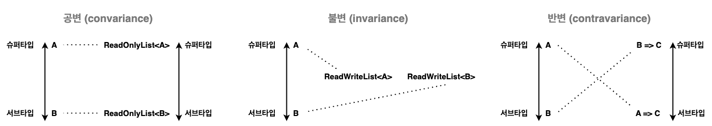
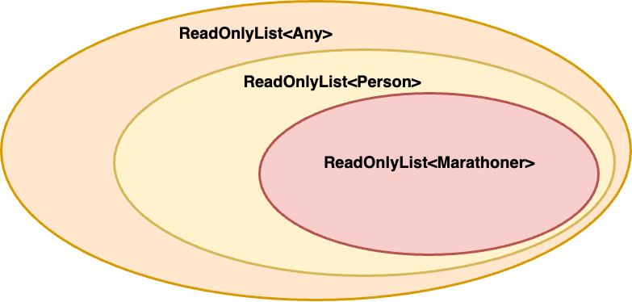
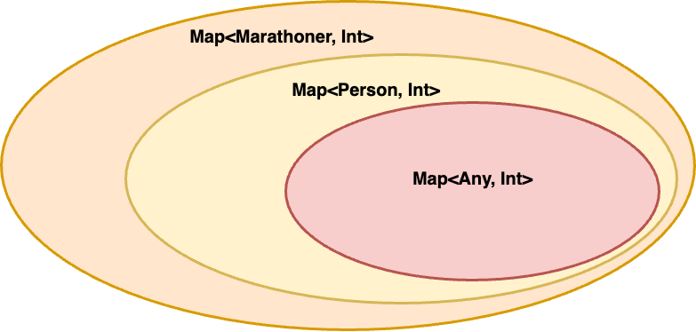
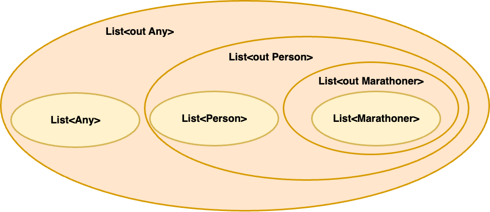
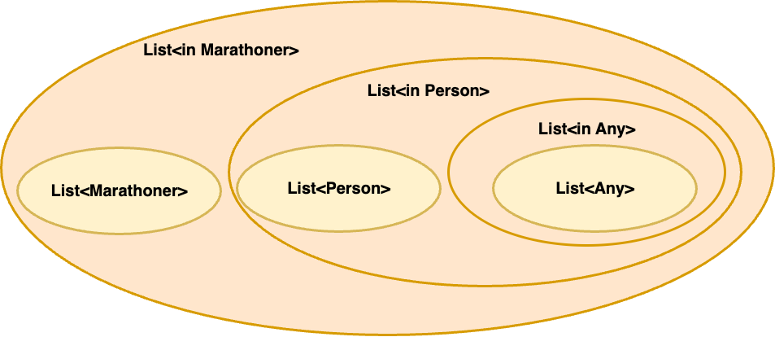

> [타입으로 견고하게 다형성으로 유연하게](https://www.yes24.com/Product/Goods/122890814) 책을 정리한 내용입니다.

개발하면서 타입 검사기가 거부하는 상황이 발생하면 IDE의 도움을 받아 어영부영 넘어간 경험 또는 제네릭이나 제네릭을 통한 타입 매개변수 제한을 사용할 때 타입 검사기가 왜 거부하는지 이해하지 못 했던 경험, 타입에 대한 이해를 통하여 조금 더 유연한 개발을 하고 싶다면 이 책은 큰 도움이 될 것이다.  
이 글을 통해 아래의 내용을 학습할 수 있다.  

1. **여러 종류의 다형성**
2. (JVM 언어에서는 지원하지 않는) **다른 언어의 기능**
3. **최대, 최소 타입**
4. **제네릭 가변성** 
5. **PECS를 지켜야하는 이유**

# 다형성

다형성은 프로그램의 **한 개체**가 여러 타입에 속하도록 만드는 것이다.  
개체는 값, 함수, 클래스, 메서드 등 여러 가지가 될 수 있다.  
  
하나의 값이 여러 타입에 속할 수도 있고, 한 함수를 여러 타입의 함수로 사용할 수도 있는 것이다.  
**다형성은 거의 모든 정적 타입 언어에서만 발견할 수 있는 매우 널리 사용되는 개념이다.**  
`"어떤 개체에 다형성을 부여하는지"` , `"어떻게 다형성을 부여하는지"` 를 이해하는 것이 중요하다.  

## 서브타입에 의한 다형성

이 주제는 객체를 다룰 때 유용하며 **서브타입** 이라는 개념을 통해 다형성을 실현한다.    
서브타입은 타입 사이의 관계이며, `"A는 B이다."` 라는 설명이 올바르다면 `A는 B의 서브타입` , `B는 A의 슈퍼타입`이다.  
반대로 `"B는 A이다."`는 성립하지 않는다.    
  
A는 B의 서브타입일 때 B 타입의 부품을 A 타입의 부품으로도 간주할 수 있게 하는 기능이 서브타입에 의한 다형성이다.  
즉, **슈퍼타입이 요구되는 자리에 서브타입이 위치하더라도 타입 검사기가 문제삼지 않는다는 것이다.**  
타입 검사기가 객체 타입의 서브타입 관계를 판단할 때 **이름에 의한 서브타입**과 **구조에 의한 서브타입**이 존재한다.  
  
### 이름에 의한 서브타입


클래스의 이름과 클래스 사이의 상속 관계만 고려한다.
  
```kotlin
open class Person(val name: String)
class Marathoner(name: String): Person(name)
```
```kotlin
fun run(person: Person) {
    ..
}

run(Person(..))
run(Marathoner(..))
```
```kotlin
fun run(marathoner: Marathoner) {
    ..
}

run(Person(name))   "컴파일 에러"
run(Marathoner(name))
```
  
### 구조에 의한 서브타입


만약 Person과 Marathoner라는 콘크리트 클래스가 서로 관계가 맺어져 있지 않고 다른 라이브러리에 존재한다고 가정하면 함수를 같이 사용할 수 없게된다.  
이 문제를 **구조를 드러내는 타입**을 사용하여 `"A가 B에 정의된 필드와 메서드를 모두 정의한다면 A는 B의 서브타입이다."` 라는 규칙을 적용하게 하여 해결할 수 있다.  
언어가 구조에 의한 서브타입을 제공하면 추상 메서드를 대체할 수 있기 때문에 추상 메서드의 필요성이 줄어든다.  
  
```kotlin
// scala
class Person(val name: String) {
  def greeting(word: String): Unit = {
    println(word)
  }
}
class Marathoner(val name: String, val awards: List[String]) {
  def greeting(word: String): Unit = {
    println(word)
  }
}

"필드 구조를 드러내어 다형성을 해결"
def run(person: { val name: String }): Unit = {
    person.name
}

run(new Person(name))
run(new Marathoner(name, null))

"메서드 구조를 드러내어 다형성을 해결"
def _greeting(person: { def greeting(word: String): Unit }, word: String): Unit = {
   person.greeting(word)
}

_greeting(new Person(name), "hello")
_greeting(new Marathoner(name, null), "hi")
```

### 집합론적 서브타입

> 타입은 프로그램에 존재하는 값들을 그 능력에 따라 분류한 것이다. 여기서 값은 변수에 저장되거나 함수에서 반환될 수 있는 모든 것들을 말한다.

<h3>최대 타입 (전체 집합, top type)</h3>

**`"아무 값이나 가능하다"`는 사실을 타입으로 표현하기 위함이다.**  
가장 큰 타입이며 모든 값을 포함하는 타입이다.  
이 정의에 따라 **모든 타입은 최대 타입의 서브타입이며, 최대 타입은 모든 타입의 슈퍼타입이다.**  
  
자바에서는 `Object`, 코틀린에서는 `Any?`를 의미한다.  

<h3>최소 타입 (공집합, bottom type)</h3>

예외가 발생하여 실행이 즉시 끝나는 경우, 타입 검사를 통과한 프로그램이더라도 예외가 발생해 실행이 갑작스럽게 중단되는 경우를 다루기 위함이다.  

```kotlin
fun error() {
    throw RuntimeException()
}

fun assertEquals(num1: Int, num2: Int) : Boolean = 
   if (num1 == num2) true else error() "컴파일 에러"
```

위의 `assertEquals`는 정상적인 경우 `true`를 반환하므로 `Boolean`을 반환하는 것이 합당해 보일 수 있지만 컴파일 에러가 발생한다.  

```kotlin
fun error(): Boolean {
    throw RuntimeException()
}

fun assertEquals(num1: Int, num2: Int) : Boolean = 
    if (num1 == num2) true else error()

fun assertEqualsYesOrThrowException(num1: Int, num2: Int) : String = 
    if (num1 == num2) "Y" else error() "컴파일 에러"
```

`error()` 함수를 `Boolean`을 반환하도록 수정하면 컴파일을 완료할 수 있다.  
하지만 `error()` 함수가 다른 타입에서도 사용되어야 한다면 그 타입에 맞는 타입을 반환하는 함수가 계속 추가되어야 한다.  
  
error() 함수는 **값을 반환하지 못한 채 예외가 발생하는 함수**이므로 어디서든 사용할 수 있도록 하는 것이 맞다.  
이때 **`"계산을 끝마치지 못한다"`를 표현하기 위한 타입, 어떤 값도 속하지 않는 타입이 최소 타입을 사용할 수 있다.**  
   
```kotlin
fun error(): Nothing {
    throw RuntimeException()
}

fun assertEquals(num1: Int, num2: Int) : Boolean =
    if (num1 == num2) true else error()
fun assertEqualsYesOrThrowException(num1: Int, num2: Int) : String =
    if (num1 == num2) "Y" else error()
```


[Kotlin의 Nothing](https://github.com/jdalma/footprints/tree/main/%EC%BD%94%ED%8B%80%EB%A6%B0#%EB%84%90-%EA%B0%80%EB%8A%A5%EC%84%B1%EC%97%90-%EB%8C%80%ED%95%9C-%EC%8A%A4%EB%A7%88%ED%8A%B8-%EC%BA%90%EC%8A%A4%ED%8A%B8%EC%99%80-nothing-%ED%83%80%EC%9E%85)을 사용하여 예외를 던지는 함수를 어디서든 호출할 수 있도록 하여 문제를 해결할 수 있다.  
**최대 타입이 "아무 값이나 될 수 있다."를 의미한다면 최소 타입은 "아무 곳에나 사용될 수 있다."를 의미한다.**  
  
<h3>이거나 타입 (합집합, union type)</h3>

한 함수가 받는 인자 타입이 여러 가지가 되어야 하는 경우 유용하게 사용할 수 있는 타입이다.  

```typescript
"typescript"
function write(data: string | number): void {
    if (typeof data === "string") {
        let str: string = data;
        ..
    } else {
        let num: number = data;
        ..
    }
}

write(1)
write("abcd")
```

<h3>이면서 타입 (교집합, intersection type)</h3>


다중 상속 또는 구현을 다룰 때 유용하다. 위의 그림과 같이 어떤 함수를 `Trainer`와 `Developer`를 동시에 인자로 받도록 지정하고 싶을 때 편리하게 사용할 수 있다.  
(코틀린에서도 `where` 키워드를 이용하여 상한을 동시에 지정할 수 있다. ["타입 매개변수 제한"](https://jdalma.github.io/2024y/polymorphism/#%ED%83%80%EC%9E%85-%EB%A7%A4%EA%B0%9C%EB%B3%80%EC%88%98-%EC%A0%9C%ED%95%9C) 내용에서 설명한다.)  

```typescript
"typescript"
interface Person {
  name: string;
}
interface Marathoner {
  awards: string[];
}
class Trainer implements Person, Marathoner {
    awards: string[]=[];
    name!: string;
}
class Developer implements Person, Marathoner {
    awards: string[]=[];
    name!: string;
}

function getName(person: Trainer & Developer): String {
    return person.name;
}
```

### 함수와 서브타입

언어가 함수를 값으로 사용할 수 있는 일급 함수를 지원하고 객체와 서브타입에 의한 다형성이 존재하면 **함수 타입 사이의 서브타입 관계를 따질 필요가 생긴다.**  
  
```kotlin
open class Person
class Marathoner : Person()

val selectBySupertype: (Person) -> Marathoner = ..
val selectBySubtype: (Marathoner) -> Marathoner = ..

fun select(selector: (Marathoner) -> Person) {
   val person = selector(Marathoner())
   ..
}

@Test
fun call() {
   select(selectBySupertype)
   select(selectBySubtype)
}
```

이전에 배운 `"A는 B이다."`에 입각하여 위의 예제를 보면 `(Person) -> Boolean`은 `(Marathoner) -> Boolean`의 서브타입이다.  
**"사람을 인자로 받을 수 있는 함수는 마라토너를 인자로 받을 수 있는 함수다."** 가 성립되기 때문이다.  
  
하지만 그 반대인 `(Marathoner) -> Boolean`은 `(Person) -> Boolean`의 서브타입이 아니다.  
**"마라토너를 인자로 받을 수 있는 함수는 사람을 인자로 받을 수 있는 함수다."** 가 성립되지 않기 때문이다.  
  

  
| 람다 \ 함수 인자 | selectSuperToSuper | selectSubToSuper | selectSuperToSub | selectSubToSub |
| :----- | :-----: | :-: | :-: | :-: |
| `(Sub) -> Sub`       | ❌ | O | ❌ | O |
| `(Sub) -> Super`     | ❌ | O | ❌ | ❌ |
| `(Super) -> Super`   | O  | O | ❌ | ❌ |
| `(Super) -> Sub`     | O  | O | O | O |

즉, A가 B의 서브타입일 떄 `B -> C`가 `A -> C`의 서브타입이며 그 반대는 성립하지 않는다.  
따라서 **함수 타입은 매개변수 타입의 서브타입 관계를 뒤집는다.**  
결과 타입의 서브타입 관계가 유지된다는 사실은 나름 직관적인것에 비해, 매개변수 타입의 서브타입 관계가 뒤집히는게 이상할 수 있지만 논리적으로 타당하다.  
  
`selectSubToSuper`의 함수는 4가지의 람다를 모두 허용하는 이유가 **"함수 타입은 매개변수 타입의 서브타입 관계를 뒤집고 결과 타입의 서브타입 관계는 유지하기 때문이다."** ⭐️  

## 매개변수에 의한 다형성

매개변수에 의한 다형성은 **타입 매개변수를 통해 다형성을 만드는 기능으로, 제네릭스라고도 부른다.**  

```kotlin
fun <T> choose(v1: T, v2: T): T {
   println(v1)
   println(v2)
   return if(readln() == "Y") v1 else v2
}
```

`T`를 매개변수 타입 표시와 결과 타입 표시에 사용했다. 이와 같이 한 개 이상의 타입 매개변수를 가지는 함수를 **제네릭 함수** 라고 부른다.  
타입 매개변수를 추가할 수 있는 곳은 함수뿐이 아니라 타입에 타입 매개변수를 추가하여 **제네릭 타입** 을 지정할 수 있고,  
타입 매개변수를 가진 클래스를 정의하여 **제네릭 클래스** 도 만들 수 있다.  
  
하지만 제네릭 `T`가 아무 타입이나 될 수 있기 때문에 특정 타입에서 제공하는 기능을 사용할 수 없다.  
**타입 매개변수로 지정된 타입은 함수 또는 클래스 안에서 특정 능력이 필요한 자리에 사용된다면 제네릭으로 선언할 필요가 없다.**  
  
### 무엇이든 타입

```kotlin
fun <T> first(list: List<T>): T = list.first()
fun <T> last(list: List<T>): T = list.last()

fun <T> compute(selector: (List<T>) -> T) {
   selector(listOf(1,2,3))          "컴파일 에러"
   selector(listOf("A","B","C"))    "컴파일 에러"
}

@Test
fun task() {
   compute<Int>(::first)
   compute<String>(::last)
}
```

`simulate` 함수 안에서 selector의 타입이 2가지가 동시에 존재하기 때문에 컴파일 에러가 발생한다.  
타입 검사기가 `simulate`의 `T`가 무엇인지 알 수 없는 이와 같은 상황을 해결할 수 있는 방법은 무엇일까?  
(simulate에 list를 파라미터로 추가하면 되지만.. 2가지 타입이 동시에 존재하는 상황에 집중해보자)  
  
```haskell
# haskell
compute :: (forall a.[a] -> a) -> ()
compute selector = 
    let number = selector [1, 2, 3] in
    let char = selector ["A", "B", "C"] in
```

이때 하스켈의 `forall` 키워드인 **무엇이든 타입** 을 사용할 수 있다.  
**제네릭 함수를 바로 인자로 넘길 수 있다.**

### 무엇인가 타입

```kotlin
class TimeStamper{
    fun Init(): Int = 0
    fun next(t: Int) = t + 1;
    fun compare(o1: Int, o2: Int) = o1 - o2
}
```

내가 라이브러리 개발자라고 가정해보자
(위의 클래스는 문제가 많지만 상황을 설명하기 위해 어쩔 수 없이 사용해야 한다고 생각해보자.)  
  
만약 TimeStamper의 반환 타입을 String으로 바꿔야 한다면 라이브러리 사용자는 내부 필드의 타입까지 모두 알고있기 때문에 라이브러리 수정으로 인한 파급력이 클 수 있다.  
이때 **무엇인가 타입** 을 활용하면 라이브러리 사용자에게 TimeStamper의 타입이 되는 `무엇인가`가 있다는 사실은 알지만, 그 타입을 특정하여 사용할 수 없도록 할 수 있다.  
  
```kotlin
exists T.{ T init(); T next(T t); T compare(T o1, T o2); } create() {
    return TimeStamper()
}
```

이렇게 `exists T.A` 형태로 생긴 타입이 무엇인가 타입이며, **T는 타입 매개변수, A는 타입을 의미한다.** 여기서 `T`가 무엇인지는 알 수 없다.  
그저 `create` 함수 반환 값의 타입이 `{ T init(); T next(T t); T compare(T o1, T o2); } 구조이다.` 라는 사실이 되도록 만드는 T가 존재한다는 사실만 알려줄 뿐이다.  
**라이브러리 사용자는 타입에 의존하는 것이 아니라 구조에 의존하도록 의도하여 행동이 제약된다.**  
  
실제로 `exists T.A` 키워드가 존재하는 것은 아니고 언어마다 이 타입을 지원하는 방법이 다르기 때문에 따로 확인이 필요할 것이다.  
이런 문제를 해결하기 위해 이런 방법을 지원하는 언어들이 있다고 기억하면 좋을것이다. (하스켈, 오캐멀 참고)  
  

  
> 무엇인가 타입의 값은 만들기 쉽지만 사용하기 어렵고, 무엇이든 타입의 값은 만들기는 어려워도 사용하기는 쉽다.

# 두 다형성의 만남

전통적으로 서브타입에 의한 다형성은 객체 지향 언어가 지원하고, 매개변수에 의한 다형성은 함수형 언어가 지원했다.  
요즘은 한 언어가 **두 종류의 다형성을 지원한다.**  
서로 다른 특징을 가진 두 개의 다형성이 유용한 기능들이 탄생한다.  

## 제네릭 클래스와 상속

알다시피 어떤 클래스를 상속해 새로운 클래스를 정의하면 기존 클래스에 정의된 필드와 메서드가 새 클래스에도 자동으로 정의된다.  

```kotlin
abstract class List<T> {
    abstract fun get(index: Int): T
}
class ArrayList<T>: List<T>() {
    override fun get(index: Int): T = ..
}
class AnotherList: List<Boolean>() {
    override fun get(index: Int): Boolean = ..
}

val stringList = ArrayList<String>()
val intList = ArrayList<Int>()
val anotherList = AnotherList()

fun <T> findFirst(list: List<T>): T = ..
fun isExist(list: List<Boolean>): Boolean = ..

@Test
fun name2() {
    findFirst(stringList)
    findFirst(intList)
    findFirst(anotherList)

    isExist(stringList)     "컴파일 에러"
    isExist(intList)        "컴파일 에러"
    isExist(anotherList)
}
```
  
기존의 `List<T>`를 구현하는 `ArrayList<T>` 와 다르게 **특정 타입의 List에 대한 서브타입** 을 추가해야하는 경우이다.  
제네릭 클래스가 있을 때 타입들 사이의 서브타입 관계가 `C<T> extends D<T>`라면 `C<A>`는 **타입 `D`에 등장하는 모든 `T`를 `A`로 바꿔서 만든 타입의 서브타입** 이라고 정리할 수 있다.  

## 타입 매개변수 제한

제네릭 함수를 정의한다는 것은 여러 타입으로 사용될 수 있는 함수를 만드는 일이니, **인자로 주어질 값이 특별한 능력을 가진다고 가정할 수 없다.**  
반대로 인자가 특별한 능력을 가져야만 한다면 그 함수는 제네릭 함수일 필요가 없다.  
  
```kotlin
open class Person(private val age: Int): Comparable<Person>{
    override fun compareTo(other: Person): Int = compareValuesBy(this, other, Person::age)
}
class Marathoner(age: Int): Person(age)

fun elder(person: Person, other: Person): Person =
    if(person > other) person else other

val person: Person = elder(person1, person2)
val marathoner: Marathoner = elder(marathoner1, marathoner1)    "컴파일 에러"
```
  
`elder`의 파라미터는 서브타입에 의한 다형성으로 컴파일을 통과하지만 반환 타입이 `Marathoner`이기 때문에 컴파일 에러가 발생한다.  
실제로 반환 타입인 `Person`은 `Marathoner`의 서브타입이 아니기 때문이다.  
  
이때 제네릭 함수를 적용하려 할 수 있다. 하지만 제네릭 타입은 모든 타입을 수용하기 때문에 `>` 연산 같은 특별한 능력을 사용할 수 없다.  
이때 **타입 매개변수 제한의 상한(upper bound)** 을 지정하여 **"T가 최대 Person 타입까지 커질 수 있다."** 라는 의미를 부여할 수 있다.  
즉, **T가 Person의 `서브타입`이다.** (제네릭 함수뿐 아니라 제네릭 클래스도 마찬가지다.)


```kotlin
fun <T: Person> elder(person: T, other: T): T =
    if(person > other) person else other

val person: Person = elder<Person>(person1, person2)
val marathoner: Marathoner = elder<Marathoner>(marathoner1, marathoner1)
```
위와 같이 상한을 `<T: Person>`으로 지정하여 반환 타입으로 `Marathoner`를 받을 수 있고, 특별한 `>` 연산을 사용할 수 있게 되었다.  
  
기본적으로 `<>`에 하나의 상한만 지정이 가능하지만 둘 이상의 상한이 필요한 경우 `where`을 사용할 수 있다. [`kotlinlang` Upper Bounds](https://kotlinlang.org/docs/generics.html#upper-bounds)  
**전달된 유형은 절의 모든 조건을 동시에 만족해야한다.** 아래의 예제를 확인해보자.  
  
```kotlin
interface Person
interface Marathoner

class Trainer: Person, Marathoner
class Developer: Person, Marathoner

interface Intersection<T> where T : Person, T : Marathoner

fun main() {
    val person = object : Intersection<Person> {}           "Type argument is not within its bounds. Compile Error !!!"
    val marathoner = object : Intersection<Marathoner> {}   "Type argument is not within its bounds. Compile Error !!!"
    val trainer = object : Intersection<Trainer> {}
    val developer = object : Intersection<Developer> {}
}
```

`Intersection` 인터페이스를 구현하는 타입은 `Person`와 `Marathoner` 둘 다 만족해야 한다.  
   
아래는 함수의 인자를 동시에 제한하여 **`CharSequence`와 `Comparable`을 구현하는 타입만 받을 수 있는 함수**이다.  

```kotlin
fun <T> copyWhenGenerator(list: List<T>, threshold: T): List<String>
    where T: CharSequence, T: Comparable<T> {
        return list.filter {
            it > threshold
        }.map { it.toString() }
    }

describe("copyWhenGenerator 함수는") {
    val param1: Pair<List<String>, String> = listOf("a", "b", "c", "d") to "b"
    val param2: Pair<List<StringBuilder>, StringBuilder> = listOf(
        StringBuilder("A"),
        StringBuilder("B"),
        StringBuilder("C")
    ) to StringBuilder("B")

    context("threshold 보다 큰 값만 반환한다.") {

        copyWhenGenerator(param1.first, param1.second) shouldBe listOf("c" , "d")
        copyWhenGenerator(param2.first, param2.second) shouldBe listOf("C")
    }
}
```

## 재귀적 타입 매개변수 제한

타입 매개변수가 자기 자신을 상한으로 하는 타입 매개변수를 **재귀적 타입 매개변수 제한** 이라고 부른다.  
정렬하는 코드를 예제로 보자.  

```kotlin
abstract class Comparable<T> {
    abstract fun gt(that: T): Boolean
}
class Person(private val age: Int): Comparable<Person>(){
    override fun gt(that: Person): Boolean = this.age > that.age
}

fun <T: Comparable<T>> sort(list: List<T>) {
    list.forEachIndexed { index, element ->
        var min = index
        for (innerIndex in index + 1 until list.size) {
            if (element.gt(list[innerIndex])) {
                min = innerIndex
            }
        }
        "index와 min의 원소를 교체"
    }
}

sort(listOf(Person(10), Person(5)))
```

객체를 정렬 가능한 객체로 구현할 때 접하는 익숙한 코드이다.  
어떤 리스트를 정렬하려면 그 리스트를 구성하는 값들이 서로 비교 가능해야 하기 때문에  
- **Comparable 추상 클래스는 자신과 동일한 타입의 다른 객체와 비교할 수 있는 클래스이다.**
- **Comparable 추상 클래스는 자신의 타입 매개변수 T를 자신의 상한으로 지정하고 있다.**
- **T가 Comparable\<T\>의 서브타입일 때 T 타입의 값을 T 타입의 값과 비교할 수 있다**

이 규칙을 모두 만족하므로 `sort` 함수는 컴파일된다.  
Comparable의 gt 메서드가 (`that: T`) 자기 자신과 같은 타입의 매개변수를 참조하는 것과 `sort` 함수가 요구하는 `<T: Comparable<T>>` 제네릭이 **재귀적 타입 매개변수 제한** 이다.  

## 가변성

**지금까지 제네릭 함수를 정의할 때는 대개 매개변수 타입과 결과 타입의 관계를 유지해야 한다는 명확한 목표가 있었다.**  
아래의 `choose`와 `elder` 같이 받은 타입을 그대로 반환해야 하는 함수 **매개변수에 의한 다형성이 반드시 필요했다.**  

```kotlin
fun <T> choose(v1: T, v2: T): T = if ( .. ) v1 else v2
fun <T: Person> elder(person: T, other: T): T = if( .. ) person else other
```

반면 그냥 Person 객체를 인자로 받아 소비만하는 `run`과 같은 함수는 **서브타입에 의한 다형성이면 충분하다.**  

```kotlin
fun run(person: Person) {
    person.age ..
}
```

`Marathoner`는 `Person`의 서브타입이 맞지만, **`List<Marathoner>`는 `List<Person>`의 서브타입이 아니기 때문에 `List<Marathoner>`와 `List<Person>` 타입의 리스트를 모두 사용하기 위한 함수는 `averageAge`함수처럼 제네릭 함수로 정의하고 타입 매개변수 제한을 사용하였다.**  

```kotlin
fun <T: Person> averageAge(people: List<T>): Int = ..
```

하지만 이 방법대로라면 아래와 같은 귀찮은 점이 있다.  

1. **`List<A>` 타입의 인자를 받는 함수를 정의할 때 마다 매개변수 타입을 `List<A>`로 하는 대신, 상한이 `A`인 타입 매개변수 `T`를 정의하고 매개변수 타입을 `List<T>`로 해야 한다.**
2. **제네릭 타입의 값을 인자로 받는 모든 함수를 동일하게 제네릭 함수로 만들어야 한다.**  
  
> 그럼 그냥 `Marathoner`가 `Person`의 서브타입인 것처럼 `List<Marathoner>`도 `List<Person>`의 서브타입이면 안 될까?  
    
즉, **"B가 A의 서브타입일 때 `List<B>`가 `List<A>`의 서브타입이도 될까?"**  
`List<Marathoner>`가 `List<Person>`의 서브타입이 된다고 가정하고 ReadOnlyList와 ReadWriteList의 예제를 보자.  
  
```kotlin
open class Person(val age: Int)
class Marathoner(age: Int) : Person(age)

"가지고 있는 원소들을 알려줄 뿐, 원소를 추가하거나 제거할 수 없는 리스트다."
abstract class ReadOnlyList<T> {
    abstract fun get(index: Int): T
}

"[1]"
val marathoners: ReadOnlyList<Marathoner> = ..
val people: ReadOnlyList<Person> = marathoners
val person = people.get(0)
person.age ..
```

`[1]`의 상황을 보면 `Marathoner`의 객체들로 구성된 List이지만 `people`에 대입이 가능하고, `people`에서 꺼낸 원소는 `Person` 타입으로 사용할 수 있다.  
런타임에는 `Marathoner` 객체이지만 타입 검사기가 알 수 있는 타입은 `Person`이다.  
하지만 이 상황은 문제가 되지 않는다. Marathoner는 이미 Person의 서브타입이므로 **Marathoner 객체를 Person 객체처럼 사용해도 문제 없다.**  
즉, **ReadOnlyList\<Marathoner\> 를 ReadOnlyList\<Person\> 로 취급함으로써 일어날 수 있는 일은 Person 객체를 기대한 곳에서 Marathoner 객체가 나오는 것 뿐이다.**  
  
```kotlin
"가지고 있는 원소들을 알려주고 새 원소를 추가할 수 있다."
abstract class ReadWriteList<T> {
    abstract fun get(index: Int): T
    abstract fun add(element: T)
}

"[2]"
val marathoners: ReadWriteList<Marathoner> = ..
val people: ReadWriteList<Person> = marathoners
people.add(Person(..))

val marathoner: Marathoner = marathoners.get(0)
```

`[2]`의 상황을 보면 `Marathoner`의 객체들로 구성된 List를 `people`에 대입하고, `people`에 `Person`을 추가할 때 **Marathoner와 Person이 같은 리스트를 나태나는 문제가 발생한다.**  
`people`에 Marathoner 객체와 Person 객체가 동시에 존재할 수 있게 되면서 **`marathoners`에 Person 객체가 추가되게 되었다.**  
타입 검사기는 `marathoners`에서 꺼낸 원소의 타입은 `Marathoner`라고 믿고있지만 실제로는 `Person` 객체가 반환될 수 있기 때문에 **타입 안전성을 깨트리는 큰 문제다.**  
  
즉, B가 A의 서브타입일 때  
`ReadOnlyList<B>`는 `ReadOnlyList<A>`의 서브타입이 가능하지만,  
`ReadWriteList<B>`는 `ReadWriteList<A>`의 서브타입이 불가능하다는 것이다.  
  
> 원소 읽기만 허용하면 `List<B>`는 `List<A>`의 서브타입이 될 수 있지만, 원소 쓰기를 허용하면 서브타입이 될 수 없다.
  
이 내용들로 알 수 있는 사실은 **"어떤 제네릭 타입은 타입 인자의 서브타입 관계를 보존하지만, 어떤 제네릭 타입은 그렇지 않다."** 라는 것이다.  
그러므로 제네릭 타입과 타입 인자 사이의 관계를 분류할 수 있다. 이 분류를 **가변성** 이라고 부른다.  
  
**가변성은 제네릭 타입과 타입 인자 사이의 관계를 뜻하며, 제네릭 타입 사이의 서브타입 관계를 추가로 정의하는 기능이다.**  
(하나의 제네릭 타입에서 타입 인자만 다르게 하여 얻은 타입들 사이의 서브타입 관계를 만든다.)  
  
<h3>공변</h3>

제네릭 타입이 타인 인자의 서브타입 관계를 보존하는 것이며, **타입 인자가 `A`에서 서브타입인 `B`로 변할 때 `List<A>` 역시 `List<B>`로 변한다고 말할 수 있다.**  
그래서 "제네릭 타입이 타입 인자와 함께 변한다"는 뜻을 담아, 이런 가변성을 **공변 (convariance)** 라고 부른다.  

<h3>불변</h3>

제네릭 타입이 타입 인자의 서브타입 관계를 무시하는 것이며, **`B`가 `A`의 서브타입이더라도 `List<B>`와 `List<A>`는 아무런 관계가 없는 것이다.**  
서로 다른 타입인 것이다. 따라서 "타입 인자가 서브타입으로 변해도 제네릭 타입은 서브타입으로 안 변한다"는 뜻을 담아, 이런 가변성을 **불변 (invariance)** 이라 부른다.  

<h3>반변</h3>

여러 번 사용했지만 제네릭 타입이라고 표현하지 않았던 **함수 타입** 이다.  
**"함수 타입은 매개변수 타입의 서브타입 관계를 뒤집고 결과 타입의 서브타입 관계를 유지한다."**  
즉, 함수 타입과 결과 타입 사이의 관계는 공변이다. 한편 함수 타입과 매개변수 타입 사이의 관계는 공변도 불변도 아니다.  
여기서 세 번째 가변성이 등장한다.  
  
세 번째 가변성은 **제네릭 타입이 타입 인자의 서브타입 관계를 뒤집는 것이다.**  
결과 타입을 `C`로 고정할 때 `B`가 `A`의 서브타입이면 `B -> C`는 `A -> C`의 **슈퍼 타입이다.**  
타입 인자가 `A`에서 서브타입인 `B`로 변할 때 `A -> C`는 타입 인자와는 반대 반향으로 움직여 슈퍼 타입인 `B -> C`로 변한다고도 할 수 있다.  



즉, `ReadOnlyList`는 원소 타입에 대해 **공변** 이며, `ReadWriteList`는 **불변** 이다.  
마지막으로 함수 타입은 매개변수 타입에 대해서는 **반변** 이고, 결과 타입에 대해서는 **공변** 이다.  
  
<h3>각 제네릭 타입의 가변성을 결정하는 일반적인 방법</h3>

논의를 간단하게 만들기 위해 타입 매개변수가 하나뿐인 제네릭 타입만 고려한다.  
제네릭 타임의 이름은 `G`, 타입 매개변수의 이름은 `T`라고 하자.  

> `G`가 `T`를 출력에만 사용하면 **공변** , 입력에만 사용하면 **반변** , 출력과 입력 모두에 사용하면 **불변** 이다.

| `G`에 해당하는 타입 | `T`를 출력에 사용 | `T`를 입력에 사용 | **가변성** |
| :---: | :---: | :---: | :---: |
| ReadOnlyList\<T\> | O | X | **공변** |
| ReadWriteList\<T\> | O | O | **불변** |
| Int -> T | O | X | **공변** |
| T -> Int | X | O | **반변** |

즉, **타입 매개변수를 출력에만 사용하는지, 입력에만 사용하는지, 둘 모두에 사용하는지 보면 가변성을 판단할 수 있다.**  
타입 매개변수를 사용한 곳에 따라 달라진다는 것이다.  
  
### 정의할 때 가변성 지정하기

가변성은 각 제네릭 타입의 고유한 속성이다. 따라서 **제네릭 타입을 정의할 때 가변성을 지정하는게 가장 직관적이다.**  
개발자는 제네릭 타입의 각 매개변수에 가변성을 표시함으로써 공변, 반변, 불변 중 하나를 고를 수 있다.  

<h3>불변</h3>

```kotlin
abstract class List<T> {
    abstract fun length(): Int
    abstract fun get(index: Int): T
    abstract fun add(element: T)
}
```

<h3>공변</h3>

```kotlin
abstract class ReadOnlyList<out T> {
    abstract fun get(index: Int): T
}

val marathoners: ReadOnlyList<Marathoner> = ..
val people: ReadOnlyList<Person> = marathoners
val person = people.get(0)

fun averageAge(people: ReadOnlyList<Person>): Int = ..

averageAge(marathoners)
averageAge(people)
```

`ReadOnlyList<out T>`는 해당 타입 매개변수가 출력에만 사용됨을 뜻하며 원소를 추가할 수 없는 대신 공변인 리스트를 정의할 수 있다.  
`T`를 출력에만 사용한다고 했으니, `T`를 메서드 결과 타입으로 사용할 수 있는 있어도 매개변수 타입으로 사용할 수는 없다.  
`ReadOnlyList`는 **공변이므로 타입 인자의 서브타입 관계를 보존한다.**  
  
이제 `averageAge` 함수를 제네릭 함수로 만들지 않고 타입 매개변수 제한없이 사용할 수 있다.  



```kotlin
abstract class ReadOnlyList<T> {
    abstract fun get(index: Int): T
}
```

위와 같이 선언된 List는 원소를 추가할 수도 없는 주제에 불변이기까지 한 불편한 리스트일 뿐이다.  
`T`를 입력에 사용하는 메서드를 추가하려고 계획 중인 게 아니라면, 굳이 이런 리스트를 정의할 필요는 없다.  
  
<h3>반변</h3>

```kotlin
abstract class Map<in K, V> {
    abstract fun size(): Int
    abstract fun get(key: K): V
    abstract fun add(key: K, value: V)
}
```

타입 매개변수를 반변으로 만들고 싶을 때는 `in`을 붙여 **그 타입 매개변수를 입력에만 사용한다는 뜻이다.**  
`abstract fun getKey(value: V): K` 이 메서드는 컴파일 에러를 발생시킨다.  
  
`Map<in K, V>` 클래스는 두 개의 타입 매개변수를 가지며, `in`으로 가변성이 지정된 `K`는 `get()`과 `add()`에서 입력으로만 사용되었기 때문에 **반변** 으로 정의해도 타입 검사기가 문제 삼지 않는다.  
반면 `V`는 `get()`에서는 출력, `add()`에서는 입력으로 사용되었기 때문에 **반드시 불변이어야 한다.**  

열쇠 타입에 대해 반변이므로 `B`가 `A`의 서브타입일 때 `Map<A, V>`가 `Map<B, V>`의 서브타입이다.  
예를 들면 `Map<Person, Int>`가 `Map<Marathoner, Int>`의 서브타입이다.  

```kotlin
val personKey: Map<Person, Int> = ..
personKey.add(Person(10), 1)
personKey.add(Marathoner(10), 1)

val marathonerKey: Map<Marathoner, Int> = ..
marathonerKey.add(Person(10), 1)        "컴파일 에러"
marathonerKey.add(Marathoner(10), 1)
```



**정의할 때 가변성을 지정하는 방법은 이해하기 쉬운 대신 클래스를 정의할 때 큰 제약이 생긴다는 문제가 있다.**  
타입을 공변으로 만든다면 타입 매개변수를 입력에 사용하는 절반을 모두 포기해야 하고, 반변으로 만든나면 나머지 절반을 포기해야 한다.  
그러니 공변이나 반변을 선택하면 **반쪽짜리 클래스를 만들 수 밖에 없는 것이다.**  
함수형 프로그래밍에서는 대부분의 경우 수정할 수 없는 자료구조만 사용해 프로그램을 작성하기 때문에 함수형 언어에서는 이 단점이 상대적으로 덜 드러난다.  
  
> 서브타입 관계를 추가하는 대신 기능이 빠진 타입을 만들거나, 기능을 다 갖춘 타입을 만드는 대신 서브타입 관계를 포기하거나, 개발자는 반드시 이 둘 중 하나를 골라야 한다.
  
### 사용할 때 가변성 지정하기

제네릭 타입을 사용할 때 가변성을 지정하는 경우, 제네릭 타입을 정의할 때는 가변성을 지정할 수 없다.  
**모든 제네릭 타입은 불변으로 정의되며 타입 매개변수를 아무 데서나 사용할 수 있다.**  

```kotlin
abstract class ReadWriteList<T> {
    abstract fun length(): Int
    abstract fun get(index: Int): T
    abstract fun add(element: T)
}
```

```kotlin
val onlyReadPeople: ReadWriteList<out Person> = ..
val size = onlyReadPeople.length()
val person: Person = onlyReadPeople.get(0)
onlyReadPeople.add(Person(10)) "컴파일 에러"
```

`onlyReadPeople`은 출력 기능만 사용할 수 있고, 원소 타입이 매개변수 타입으로 사용되지 않는 메서드만 사용할 수 있다는 뜻이다.  
그리고 **"A를 출력과 입력에 모두 사용할 수 있는 불변 `List<A>`는 A를 출력에 사용할 수 있는 리스트다."** 가 사실이기 때문에 `List<A>`는 `List<out A>`의 서브타입이다.  
`ReadWriteList<T>`는 불변이지만 `ReadWriteList<out Person>`는 공변이다. 따라서 **`B`가 `A`의 서브타입일 때 `List<out B>`는 `List<out A>`의 서브타입이다.**  

```kotlin
fun averageAge(people: ReadWriteList<out Person>): Int {
    people.get(0)
    people.add(Person(10)) "컴파일 에러"
}

val onlyReadPeople: ReadWriteList<out Person> = ..
averageAge(onlyReadPeople)

val onlyReadMarathoners: ReadWriteList<out Marathoner> = ..
averageAge(onlyReadMarathoners)

val readWriteMarathoner: ReadWriteList<Marathoner> = ..
averageAge(readWriteMarathoner)
```



`averageAge()` 함수와 같이 새로운 `<out Person>` 타입을 통해 함수 내부에서는 출력의 용도로만 사용하겠다고 선언하여 공변으로 지정하여 사용할 수 있다.  
  
`ReadWriteList<in A>` 역시 `ReadWriteList<A>`와 비슷하게 `A` 타입의 원소들로 구성된 리스트를 나타내지만 **입력 기능만 사용할 수 있다는 차이가 있다.**  
정확히 말하면 **메서드 중 원소 타입이 결과 타입으로 사용되지 않는 메서드만 사용할 수 있다.**  

```kotlin
val readWritePeople: ReadWriteList<in Person> = ..
val people: Any? = readWritePeople.get(0)
readWritePeople.add(Person(10))
readWritePeople.add(Marathoner(10))

val readWriteMarathoners: ReadWriteList<in Marathoner> = ..
val marathoner: Any? = readWriteMarathoners.get(0)
readWriteMarathoners.add(Marathoner(10))
```

**"A를 출력과 입력에 모두 사용할 수 있는 불변 `List<A>`는 A를 입력에 사용할 수 있는 리스트다."** 가 사실이기 때문에 `List<A>`는 `List<in A>`의 서브타입이다.  
따라서 **`B`가 `A`의 서브타입일 때 `List<in A>`는 `List<in B>`의 서브타입이다.**  



```kotlin
fun addPerson(people: ReadWriteList<in Person>) {
    people.add(Person(..))
    people.add(Marathoner(..))
}

val readWritePeople1: ReadWriteList<in Person> = ..
val readWritePeople2: ReadWriteList<Person> = ..
addPerson(readWritePeople1)
addPerson(readWritePeople2)

val readWriteMarathoners1: ReadWriteList<in Marathoner> = ..
val readWriteMarathoners2: ReadWriteList<Marathoner> = ..
addPerson(readWriteMarathoners1)    "컴파일 에러"
addPerson(readWriteMarathoners2)    "컴파일 에러"
```

`addPerson` 함수는 `ReadWriteList<in Person>` 반변으로 지정되어 있기 때문에 `ReadWriteList<Marathoner>`는 `Person`의 서브타입이긴 하지만 `addPerson`의 인자로 사용될 수 없다.  
  
```kotlin
fun addMarathoner(people: ReadWriteList<in Marathoner>) {
    people.add(Person(..))      "컴파일 에러"
    people.add(Marathoner(..))
}

val readWritePeople1: ReadWriteList<in Person> = ..
val readWritePeople2: ReadWriteList<Person> = ..
addMarathoner(readWritePeople1)
addMarathoner(readWritePeople2)

val readWriteMarathoners1: ReadWriteList<in Marathoner> = ..
val readWriteMarathoners2: ReadWriteList<Marathoner> = ..
addMarathoner(readWriteMarathoners1)
addMarathoner(readWriteMarathoners2)
```

`ReadWriteList<in Marathoner>` 반변으로 지정하면 `List<Person>`은 `List<in Marathoner>`의 서브타입이기 때문에 `addMarathoner` 함수 호출이 다 가능해진다.  
`List<in Marathoner>`에는 `Marathoner`가 보장되어야 하기 때문에 더 작은 의미를 가지는 `Person`을 직접 추가하지는 못한다.  
이는 **Person 리스트에 Marathoner 객체를 추가해도 괜찮고 Marathoner 리스트에 Person 객체를 추가하지 못한다는 직관과 일치한다.**  
  
추가적으로 자바에서는 `out` 대신 `? extends`, `in` 대신 `? super`를 사용하여 공변과 반변을 나타낸다.  
`G<? extends A>`와 `G<? super A>` 형태의 타입은 만들 수 있지만, `G<A extends ?>`나 `G<A super B>` 등 여타 형태의 타입은 만들 수 없다.  
그러니 `? extends`와 `? super`에서 `?`와 `extends/super`를 **분리하여 생각하지 말고 하나의 키워드로 바라보는 것이 좋다.**  

# 오버로딩에 의한 다형성

한 함수가 여러 타입의 인자를 받아야 할 때 사용할 수 있다.  
같은 이름의 함수들을 매개변수 타입을 서로 다르게 하여 여러 개 정의하는 것이다.  
함수 오버로딩도 다형성을 만들어내는 방법 중 한 가지다.  

```kotlin
fun aging(person: Person) = Person(person.age + 1)
fun aging(marathoner: Marathoner) = Marathoner(marathoner.age + 1)
```

`aging` 두 함수 중에 어느 것을 호출할지는 언어 수준에서 자동으로 결정된다.  
함수 선택의 가장 기본적인 규칙은 **인자의 타입에 맞는 함수를 고른다.**  
  
오버로딩은 어려운 개념이 아니다. 하지만 오버로딩에 의한 다형성을 서브타입에 의한 다형성이나 매개변수에 의한 다형성과 함께 사용하면 더 많은 개념이 등장한다.  
  
예제는 정수를 관리하는 `Numbers` 클래스와 양수의 인덱스를 따로 가지는 `PositiveNumbers` 클래스가 있다고 가정하자.  
  
```kotlin
open class Numbers(val elements: List<Int>)
class PositiveNumbers(elements: List<Int>): Numbers(elements) {
    val positiveNumberIndexes: List<Int> = elements.mapIndexedNotNull { .. }
}

fun positiveNumberSum(numbers: Numbers): Int = ..
fun positiveNumberSum(numbers: PositiveNumbers): Int = ..

val elements = listOf(1, -1, 0, 3, 5)
positiveNumberSum(Numbers(elements))
positiveNumberSum(PositiveNumbers(elements))

val numbers: Numbers = PositiveNumbers(elements)
positiveNumberSum(numbers)    "정적 선택 (static dispatch)"
```
  
오버로딩된 양수의 사이즈를 반환하는 `positiveNumberCount()` 함수를 확인할 수 있다.  
  
> 1. **인자의 타입에 맞는 함수를 고른다.**
> 2. **인자의 타입에 가장 특화된 함수를 고른다.**
> 3. **함수를 고를 때는 인자의 정적 타입만 고려한다.**
  
한 함수가 다른 하나보다 `"더 특화되었다."`는 말은 한 함수의 매개변수 타입이 다른 함수의 매개변수 타입의 서브타입이라는 뜻이다.  
매개변수가 여러 개라면 순서대로 각 매개변수 타입이 서브타입 관계에 있는지 확인하여 가장 정확한 함수를 선택한다.    
  
그리고 함수 선택 시 정적 타입에 대한 이해가 없다면 버그를 발생시키기 쉽다.  
`B`가 `A`의 서브타입일 때 **`A`를 위한 함수가 이미 있다면 `B`를 위한 같은 이름의 함수를 추가로 정의하는 일을 가급적 피하는 것이 버그를 방지하는 간단한 방법이다.**  
즉, 함수 오버로딩은 서로 완전히 다른 타입들의 값을 인자로 받는 함수를 정의하는 용도로 사용하는 게 좋다.  
굳이 함수 오버로딩에 서브타입에 의한 다형성을 활용하여 복잡한 상황을 만들지 말고 이럴 떄는 **메서드 오버로딩을 활용하는 것이 좋다.**  
  
# 오버라이딩에 의한 다형성

메서드 오버라이딩은 클래스를 상속해서 자식 클래스에 메서드를 새로 정의할 때 메서드의 이름과 매개변수 타입을 부모 클래스에 정의되어 있는 메서드와 똑같게 정의하여 **자식 클래스에 특화된 방법을 정의하는 좋은 방법이다.**  
양수의 개수를 반환하는 `Numbers`의 `length()`함수를 최적화한 `PositiveNumbers`가 있다고 가정하자.  
  
```kotlin
open class Numbers(val elements: List<Int>) {
    open fun length(): Int = ..
}
class PositiveNumbers(elements: List<Int>): Numbers(elements) {
    val positiveNumberIndexes: List<Int> = ..

    override fun length(): Int = ..
}

val elements = listOf(1,2,3,4)
val numbers: Numbers = Numbers(elements)
numbers.length()

val positiveNumbers: PositiveNumbers = PositiveNumbers(elements)
positiveNumbers.length()

val numbers2: Numbers = PositiveNumbers(elements)
numbers2.length()   "동적 선택 (dynamic dispatch)"
```

오버로딩과 다르게 **오버라이딩은 동적 타입에 대해 더 특화된 메서드가 선택되기 때문에, 정적 타입에 상관없이 언제나 그 특화된 동작이 사용되도록 만들 수 있다.**  
즉, 함수 선택은 인자의 정적 타입만 고려하지만 메서드 선택은 인자의 정적 타입도 고려하고 **수신자(메서드를 호출하는 객체)의 동적 타입도 고려된다는 것이다.**  

> 1. **인자의 타입에 맞는 메서드를 고른다.**
> 2. **인자의 타입에 가장 특화된 메서드를 고른다.**
> 3. **메서드를 고를 때는 인자의 정적 타입을 고려한다.**
> 4. **메서드를 고를 때는 수신자의 동적 타입도 고려한다.**

<h3>메서드 선택의 한계</h3>

메서드 선택은 수신자의 동적 타입을 고려하기 때문에 특화된 동작을 선택할 수 있긴 하지만 인자의 동적 타입은 고려하지 않기에 한계가 있다.  
두 개의 정수 리스트를 합산하여 결과 리스트를 반환하는 `add()`메서드를 최대한 최적화하기 위해 아래와 같은 두 개의 메서드가 있다고 가정해보자.  
(이런 양방향 의존성을 가지는 경우는 가능한 없어야 하지만 인자의 동적 타입을 고려하지않는 상황을 이해하기 위함이다.)

```kotlin
open class Numbers(val elements: List<Int>) {
    open fun length(): Int = ..
    open fun add(that: Numbers): Numbers = ..
    open fun add(that: PositiveNumbers): Numbers = ..
}
class PositiveNumbers(elements: List<Int>): Numbers(elements) {
    val positiveNumberIndexes: List<Int> = ..

    override fun length(): Int = ..
    override fun add(that: Numbers): PositiveNumbers = ..
    override fun add(that: PositiveNumbers): PositiveNumbers = ..
}

val numbers: Numbers = Numbers(..)
val dynamicNumber: Numbers = PositiveNumbers(..)
val positiveNumbers: PositiveNumbers = PositiveNumbers(..)

val receiveNumbers: Numbers = Numbers(..)
receiveNumbers.add(dynamicNumber)
"expect: Numbers.add(PositiveNumbers), real: Numbers.add(Numbers)"

val receiveDynamicNumbers: Numbers = PositiveNumbers(..)
receiveDynamicNumbers.add(dynamicNumber)
"expect: PositiveNumbers.add(PositiveNumbers), real: PositiveNumbers.add(Numbers)"

val receivePositiveNumbers: PositiveNumbers = PositiveNumbers(..)
receivePositiveNumbers.add(dynamicNumber)
"expect: PositiveNumbers.add(PositiveNumbers), real: PositiveNumbers.add(Numbers)"
```

(`dynamic`은 정적 타입과 동적 타입이 서로 다른 의미이며, `receive`는 수신 객체를 의미한다.)  
인자의 동적 타입은 고려하지 않기 때문에 위와 같이 기대하는 메서드가 호출되지 않는다.  
언어 수준에서 도와주지 않기 때문에 개발자가 코드를 잘 작성해야 한다.  
  
기본 전략은 **메서드 안에서 수신자와 인자의 위치를 바꾸어 다시 한번 메서드를 호출하는 것이다.**  

```kotlin
open class Numbers(val elements: List<Int>) {
    open fun length(): Int = ..
    open fun add(that: Numbers): Numbers = that._add(this)
    open fun _add(that: Numbers): Numbers = ..
    open fun _add(that: PositiveNumbers): Numbers = ..
}
class PositiveNumbers(elements: List<Int>): Numbers(elements) {
    val positiveNumberIndexes: List<Int> = ..

    override fun length(): Int = ..
    override fun add(that: Numbers): PositiveNumbers = that._add(this)
    override fun _add(that: Numbers): PositiveNumbers = ..
    override fun _add(that: PositiveNumbers): PositiveNumbers = ..
}

val numbers: Numbers = Numbers(..)
val dynamicNumber: Numbers = PositiveNumbers(..)
val positiveNumbers: PositiveNumbers = PositiveNumbers(..)

val receiveNumbers: Numbers = Numbers(..)
receiveNumbers.add(dynamicNumber)
"expect: Numbers.add(PositiveNumbers), real: PositiveNumbers.add(Numbers)"

val receiveDynamicNumbers: Numbers = PositiveNumbers(..)
receiveDynamicNumbers.add(dynamicNumber)
"expect: PositiveNumbers.add(PositiveNumbers), real: PositiveNumbers.add(PositiveNumbers)"

val receivePositiveNumbers: PositiveNumbers = PositiveNumbers(..)
receivePositiveNumbers.add(dynamicNumber)
"expect: PositiveNumbers.add(PositiveNumbers), real: PositiveNumbers.add(PositiveNumbers)"
```

클라이언트에게 불필요한 `_add` 함수가 노출되고 다른 개발자가 보기에는 난해할 수 있다.  
하지만 백킹 메서드 `_add`를 사용하여 `add()`의 인자의 동적 메서드를 선택하도록 하여 기대한대로 호출되는 것을 알 수 있다.  
  
추가로 **자식 클래스에 있는 메서드의 결과 타입이 부모 클래스에 있는 메서드의 결과 타입의 서브타입이어야 한다.**    
오버라이딩된 자식 메서드의 결과 타입이 부모 메서드의 결과 타입에 반하는 아래와 같은 상황은 런타임에 문제가 발생할 수 있어 타입 검사기가 허용하지 않는다.  
이때까지의 내용을 읽었다면 왜 허용하지 않는지 이해할 수 있을것이다.  

```kotlin
open class Numbers(val elements: List<Int>) {
    open fun add(that: PositiveNumbers): PositiveNumbers = ..
}
class PositiveNumbers(elements: List<Int>): Numbers(elements) {
    val positiveNumberIndexes: List<Int> = ..

    override fun add(that: PositiveNumbers): Numbers = ..
}

val dynamicNumbers: Numbers = PositiveNumbers(..)
val positiveNumbers: PositiveNumbers = PositiveNumbers(..)
dynamicNumbers.add(positiveNumbers).positiveNumberIndexes
```
