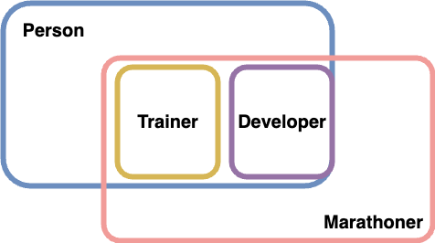
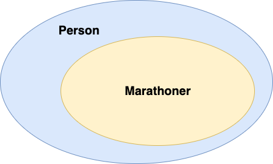
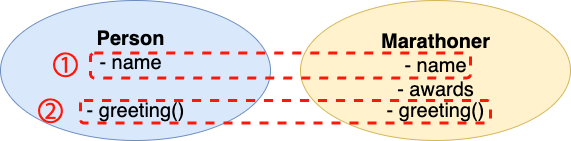
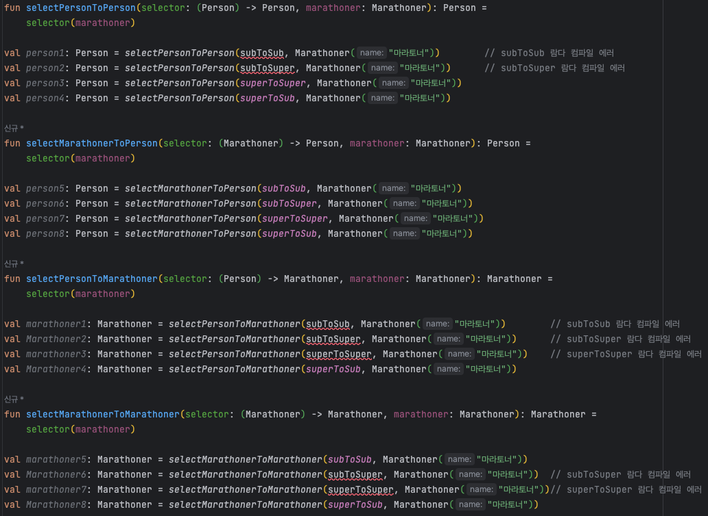

> 이 글의 내용은 [타입으로 견고하게 다형성으로 유연하게](https://www.yes24.com/Product/Goods/122890814) 책을 참고하여 작성하였습니다.  

이 글을 통해 
1. **타입**
2. 여러 종류의 **다형성**과 **가변성**
3. **제네릭 가변성**

대해 알아보자. 자연스럽게 타입 검사기와 더 친해질 수 있을 것이다.  
(예제 코드는 기본적으로 코틀린을 사용하지만 코틀린에 제공되지 않는 기능들은 첫 줄에 사용한 언어를 표시해놓았다.)  
  

# 집합론적 타입

> 타입은 프로그램에 존재하는 값들을 그 능력에 따라 분류한 것이다. 여기서 값은 변수에 저장되거나 함수에서 반환될 수 있는 모든 것들을 말한다.

<h3>최대 타입 (전체 집합, top type)</h3>

**`"아무 값이나 가능하다"`는 사실을 타입으로 표현하기 위함이다.**  
가장 큰 타입이며 모든 값을 포함하는 타입이다.  
이 정의에 따라 **모든 타입은 최대 타입의 서브타입이며, 최대 타입은 모든 타입의 슈퍼타입이다.**  
  
자바에서는 `Object`, 코틀린에서는 `Any?`를 의미한다.  

<h3>최소 타입 (공집합, bottom type)</h3>

예외가 발생하여 실행이 즉시 끝나는 경우, 타입 검사를 통과한 프로그램이더라도 예외가 발생해 실행이 갑작스럽게 중단되는 경우를 다루기 위함이다.  

```kotlin
fun error() {
    throw RuntimeException()
}

fun assertEquals(num1: Int, num2: Int) : Boolean = 
   if (num1 == num2) true else error() // 컴파일 에러
```

위의 `assertEquals`는 정상적인 경우 `true`를 반환하므로 `Boolean`을 반환하는 것이 합당해 보일 수 있지만 컴파일 에러가 발생한다.  

```kotlin
fun error(): Boolean {
    throw RuntimeException()
}

fun assertEquals(num1: Int, num2: Int) : Boolean = 
    if (num1 == num2) true else error()

fun assertEqualsYesOrThrowException(num1: Int, num2: Int) : String = 
    if (num1 == num2) "Y" else error()    // 컴파일 에러
```

`error()` 함수를 `Boolean`을 반환하도록 수정하면 컴파일을 완료할 수 있다.  
하지만 `error()` 함수가 다른 타입에서도 사용되어야 한다면 그 타입에 맞는 타입을 반환하는 함수가 계속 추가되어야 한다.  
  
error() 함수는 **값을 반환하지 못한 채 예외가 발생하는 함수**이므로 어디서든 사용할 수 있도록 하는 것이 맞다.  
이때 **`"계산을 끝마치지 못한다"`를 표현하기 위한 타입, 어떤 값도 속하지 않는 타입이 최소 타입을 사용할 수 있다.**  
   
```kotlin
fun error(): Nothing {
    throw RuntimeException()
}

fun assertEquals(num1: Int, num2: Int) : Boolean =
    if (num1 == num2) true else error()
fun assertEqualsYesOrThrowException(num1: Int, num2: Int) : String =
    if (num1 == num2) "Y" else error()
```


[Kotlin의 Nothing](https://github.com/jdalma/footprints/tree/main/%EC%BD%94%ED%8B%80%EB%A6%B0#%EB%84%90-%EA%B0%80%EB%8A%A5%EC%84%B1%EC%97%90-%EB%8C%80%ED%95%9C-%EC%8A%A4%EB%A7%88%ED%8A%B8-%EC%BA%90%EC%8A%A4%ED%8A%B8%EC%99%80-nothing-%ED%83%80%EC%9E%85)을 사용하여 예외를 던지는 함수를 어디서든 호출할 수 있도록 하여 문제를 해결할 수 있다.  
**최대 타입이 "아무 값이나 될 수 있다."를 의미한다면 최소 타입은 "아무 곳에나 사용될 수 있다."를 의미한다.**  
  
<h3>이거나 타입 (합집합, union type)</h3>

한 함수가 받는 인자 타입이 여러 가지가 되어야 하는 경우 유용하게 사용할 수 있는 타입이다.  

```typescript
// typescript
function write(data: string | number): void {
    if (typeof data === "string") {
        let str: string = data;
        // ...
    } else {
        let num: number = data;
        // ...
    }
}

write(1)
write("abcd")
```

<h3>이면서 타입 (교집합, intersection type)</h3>



다중 상속을 다룰 때 유용하다. 위의 그림과 같이 어떤 함수를 `Trainer`와 `Developer`를 동시에 인자로 받도록 지정하고 싶을 때 편리하게 사용할 수 있다.  

```typescript
// typescript
interface Person {
  name: string;
}
interface Marathoner {
  awards: string[];
}
class Trainer implements Person, Marathoner {
    awards: string[]=[];
    name!: string;
}
class Developer implements Person, Marathoner {
    awards: string[]=[];
    name!: string;
}

function getName(person: Trainer & Developer): String {
    return person.name;
}
```

# 다형성

다형성은 프로그램의 **한 개체**가 여러 타입에 속하도록 만드는 것이다.  
개체는 값, 함수, 클래스, 메서드 등 여러 가지가 될 수 있다.  
  
하나의 값이 여러 타입에 속할 수도 있고, 한 함수를 여러 타입의 함수로 사용할 수도 있는 것이다.  
**다형성은 거의 모든 정적 타입 언어에서만 발견할 수 있는 매우 널리 사용되는 개념이다.**  
`"어떤 개체에 다형성을 부여하는지"` , `"어떻게 다형성을 부여하는지"` 를 이해하는 것이 중요하다.  

## 서브타입에 의한 다형성

이 주제는 객체를 다룰 때 유용하며 **서브타입** 이라는 개념을 통해 다형성을 실현한다.    
서브타입은 타입 사이의 관계이며, `"A는 B이다."` 라는 설명이 올바르다면 `A는 B의 서브타입` , `B는 A의 슈퍼타입`이다.  
반대로 `"B는 A이다."`는 성립하지 않는다.    
  
A는 B의 서브타입일 때 B 타입의 부품을 A 타입의 부품으로도 간주할 수 있게 하는 기능이 서브타입에 의한 다형성이다.  
즉, **슈퍼타입이 요구되는 자리에 서브타입이 위치하더라도 타입 검사기가 문제삼지 않는다는 것이다.**  
타입 검사기가 객체 타입의 서브타입 관계를 판단할 때 **이름에 의한 서브타입**과 **구조에 의한 서브타입**이 존재한다.  
  
### 이름에 의한 서브타입



클래스의 이름과 클래스 사이의 상속 관계만 고려한다.
  
```kotlin
open class Person(val name: String)
class Marathoner(name: String): Person(name)
```
```kotlin
fun run(person: Person) {
    TODO()
}

run(Person(...))
run(Marathoner(...))
```
```kotlin
fun run(marathoner: Marathoner) {
    TODO()
}

run(Person(name))       // 컴파일 에러
run(Marathoner(name))
```
  
### 구조에 의한 서브타입



만약 Person과 Marathoner라는 콘크리트 클래스가 서로 관계가 맺어져 있지 않고 다른 라이브러리에 존재한다고 가정하면 위의 `run` 함수를 같이 사용할 수 없게된다.  
이 문제를 **구조를 드러내는 타입**을 사용하여 `"A가 B에 정의된 필드와 메서드를 모두 정의한다면 A는 B의 서브타입이다."` 라는 규칙을 적용하게 하여 해결할 수 있다.  
  
```kotlin
// scala
class Person(val name: String) {
  def greeting(word: String): Unit = {
    println(word)
  }
}
class Marathoner(val name: String, val awards: List[String]) {
  def greeting(word: String): Unit = {
    println(word)
  }
}

// 필드 구조를 드러내어 다형성을 해결
def run(person: { val name: String }): Unit = {
   // person.name
}

run(new Person(name))
run(new Marathoner(name, null))

// 메서드 구조를 드러내어 다형성을 해결
def _greeting(person: { def greeting(word: String): Unit }, word: String): Unit = {
   person.greeting(word)
}

_greeting(new Person(name), "hello")
_greeting(new Marathoner(name, null), "hi")
```

언어가 구조에 의한 서브타입을 제공하면 추상 메서드를 대체할 수 있기 때문에 추상 메서드의 필요성이 줄어든다.  

### 함수와 서브타입

언어가 함수를 값으로 사용할 수 있는 일급 함수를 지원하고 객체와 서브타입에 의한 다형성이 존재하면 **함수 타입 사이의 서브타입 관계를 따질 필요가 생긴다.**  
위에서 배운 `"A는 B이다."`에 입각하면 `(Marathoner) -> Marathoner`는 `(Marathoner) -> Person`의 서브타입이다.  
그리고 A가 B의 서브타입일 때 `C → A`가 `C → B`의 서브타입이다.  
  
```kotlin
open class Person(val name: String)
class Marathoner(name: String): Person(name)

val subToSub : (Marathoner) -> Marathoner = { it }
val subToSuper : (Marathoner) -> Person = { it }
val superToSuper : (Person) -> Person = { it }
val superToSub : (Person) -> Marathoner = { Marathoner(it.name) }
```


  
이때까지 배운 다형성의 서브타입으로 이해하면 `superToSuper` 와 `superToSub`는 타입 검사기를 통과하지 않아야 하지만 통과한다.  
`(Person) -> Person` 과 `(Person) -> Marathoner`가 `(Marathoner) -> Person`의 서브타입인지를 이해하려면 **"적어도 사람을 인자로 받을 수 있는 함수는 학생을 인자로 받을 수 있는 함수다."**

***

1. 매개변수에 의한 다형성
2. 제네릭
3. 오버로딩에 의한 다형성
4. 오버라이딩에 의한 다형성


