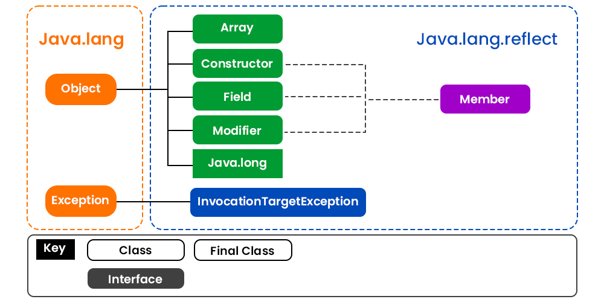
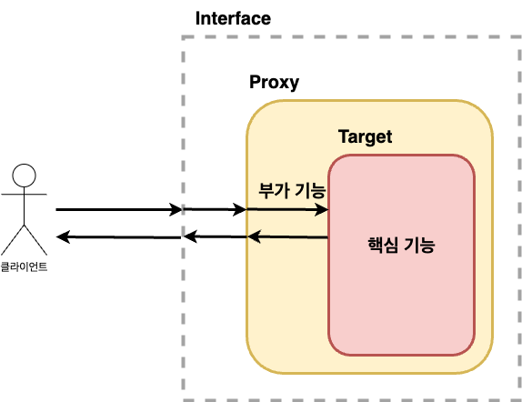
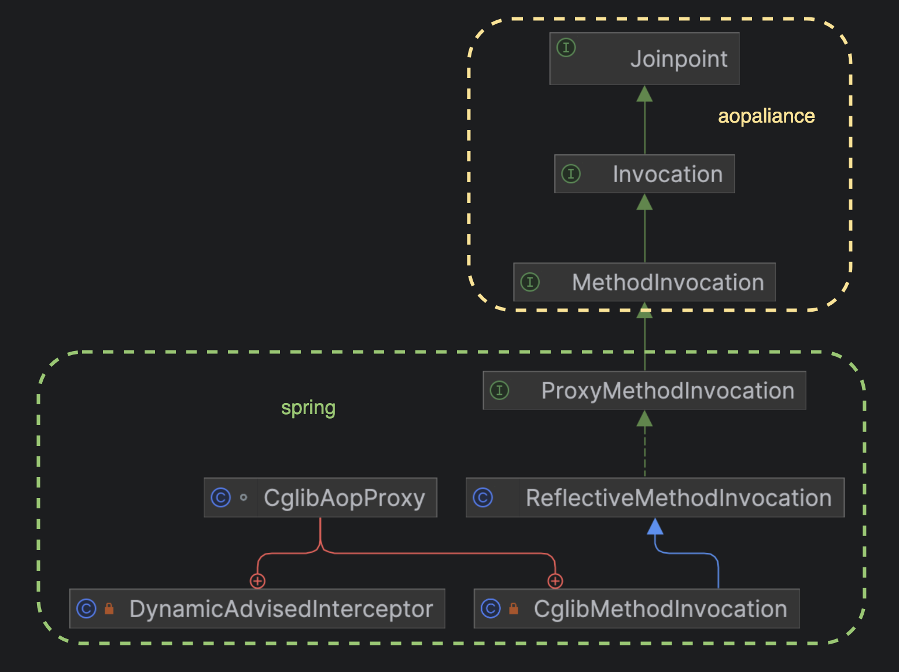
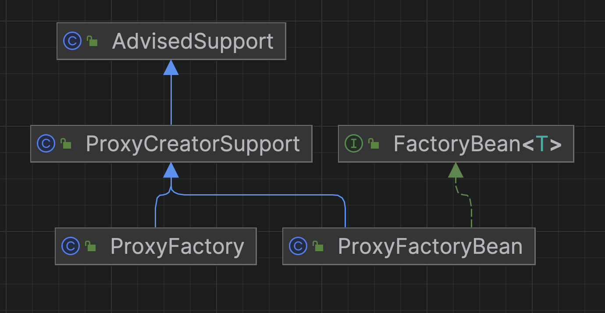
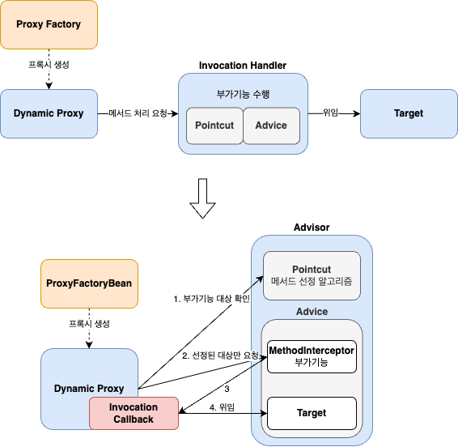
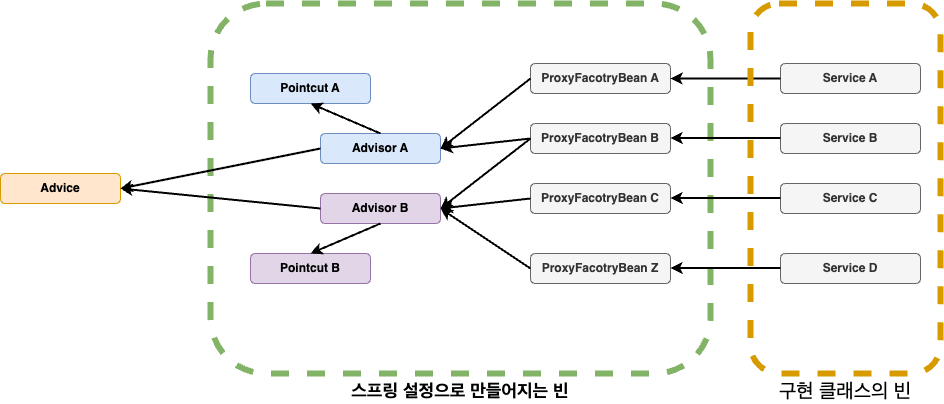
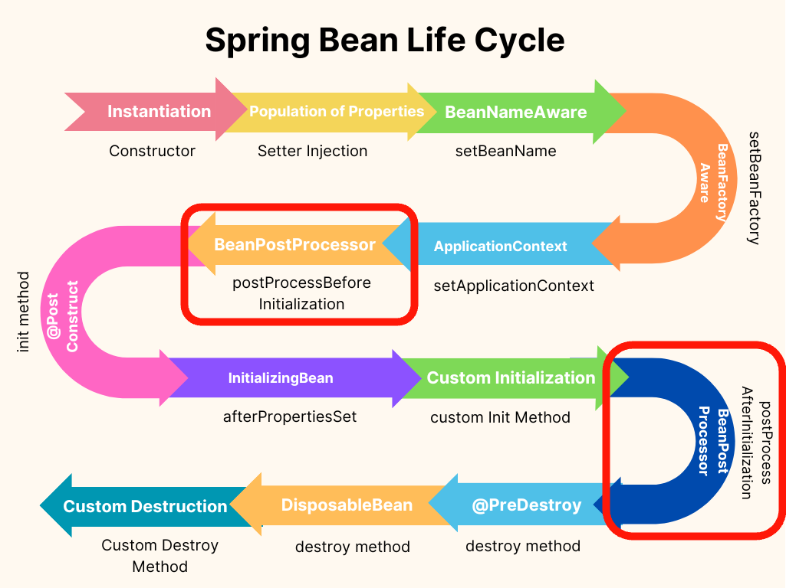
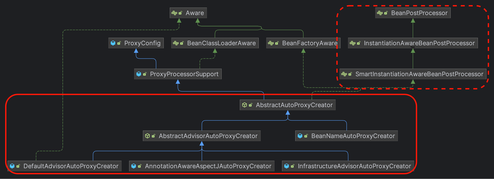
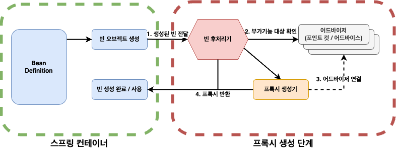

스프링의 프록시 방식으로 AOP를 생성하는 가장 기본적인 방법을 이해하기 위해서는 사전지식이 필요하다.  

1. Reflection
2. Java Dynamic Proxy
3. CGLIB
4. ProxyFactory
5. FactoryBean
6. ProxyFactoryBean

**스프링을 더 깊게 이해하기 위해서는 필수적인 선수 지식이라고 생각한다.**  
이 글에서는 스프링 AOP를 사용하는 법, 포인트 컷, 어드바이스를 자세하게 설명하진 않으며, 스프링의 빈 후처리기를 통해 프록시가 어떻게 자동으로 생성되는지를 중점으로 다룬다.  
이 글을 통해 프록시가 무엇인지, 프록시를 관리하고 생성할 때 불편한 방법들을 스프링은 어떻게 해결했는지 알 수 있을 것이다.  
차근차근 단계별로 알아보자.  

# 1단계: Java Reflection

자바의 리플렉션(Reflection)은 런타임 시에 클래스의 속성, 메소드, 생성자 등의 메타데이터를 조회하여 활용할 수 있는 강력한 기능이다.  
즉 **런타임 시에 동적으로 객체를 생성하고, 가시성에 관계없이 메소드를 호출하거나, 필드에 접근할 수 있다.**  
  

[출처 geeksforgeeks](https://www.geeksforgeeks.org/reflection-in-java/)
  
-   필드(목록) 가져오기
-   메소드(목록) 가져오기
-   상위 클래스 가져오기
-   인터페이스(목록) 가져오기
-   어노테이션 가져오기
-   생성자 가져오기
-   ...

이 리플렉션을 사용하는 것은 **메타 프로그래밍** 이라고 하며 위와 같은 행위를 할 수 있다.  
자바의 모든 클래스는 그 클래스 자체의 구성 정보를 담은 `Class 타입`의 오브젝트를 하나씩 갖고 있다.  
`Class` 오브젝트를 이용하면 **클래스 코드에 대한 메타 정보** 를 가져오거나 **객체를 조작** 할 수 있다.   
테스트 코드로 확인해보자.  

```kotlin
data class Address(
    private val state: String,
    private val city: String
)

data class Person(
    private val name: String,
    var age: Int,
    private val address: Address
) {
    constructor(name: String, age: Int): this(name, age, Address("empty", "empty"))

    @Throws(IllegalArgumentException::class)
    constructor(age: Int): this("Admin", age, Address("Admin", "Admin"))

    fun greeting() = "안녕하세요."
}

describe("Person 클래스") {
    val personClass: Class<Person> = Person::class.java

    it("Constructor를 통해 Person 만들기") {
        val constructors: Array<Constructor<Person>>  = personClass.constructors as Array<Constructor<Person>>
        constructors[0].toString() shouldBe 
            "public _22_Reflection.ReflectionTest\$1\$Person(java.lang.String,int)"
        constructors[1].toString() shouldBe 
            "public _22_Reflection.ReflectionTest\$1\$Person(int) throws java.lang.IllegalArgumentException"
        
        val nameAndAgeConstructor = constructors[0]
        val ageConstructor = constructors[1]

        nameAndAgeConstructor.newInstance("Reflection", 10) shouldBe Person("Reflection", 10)
        ageConstructor.newInstance(10) shouldBe Person(10)
    }

    it("Field로 객체 내부 멤버변수 조회하기") {
        val fields: Array<Field> = personClass.declaredFields
        fields[0].toString() shouldBe 
            "private final java.lang.String _22_Reflection.ReflectionTest$1\$Person.name"
        fields[1].toString() shouldBe 
            "private int _22_Reflection.ReflectionTest$1\$Person.age"
        fields[2].toString() shouldBe 
            "private final _22_Reflection.ReflectionTest$1\$Address _22_Reflection.ReflectionTest$1\$Person.address"

        val person = Person(100)

        fields.forEach { it.trySetAccessible() }

        val nameField = fields[0]
        val ageField = fields[1]
        val addressField = fields[2]

        nameField.get(person) shouldBe "Admin"
        ageField.get(person) shouldBe 100
        addressField.get(person) shouldBe Address("Admin", "Admin")
    }

    it("Method 정보로 객체 실행하기") {
        val methods: Array<Method> = personClass.methods

        val getAgeMethod = methods.find { it.name == "getAge" }!!
        val setAgeMethod = methods.find { it.name == "setAge" }!!
        val greetingMethod = methods.find { it.name == "greeting" }!!

        val person = Person(100)

        person.age shouldBe 100
        getAgeMethod.invoke(person) shouldBe 100

        setAgeMethod.invoke(person, 50)

        person.age shouldBe 50
        getAgeMethod.invoke(person) shouldBe 50

        greetingMethod.invoke(person) shouldBe "안녕하세요."
    }
}
```

위와 같이 `Class` 정보를 이용하여 실제 인스턴스를 조작하거나 생성할 수 있다. (더 자세한 예제는 [여기](https://github.com/jdalma/kotlin-playground/blob/main/src/test/kotlin/_22_Reflection/ReflectionTest.kt)를 확인하자.)  
  
리플렉션을 간단하게 확인해보았는데 강력한 기능이라는 것을 느낄 수 있다.  
이 강력한 기능을 통해 자바에서는 **[Dynamic Proxy Class API](https://docs.oracle.com/javase/8/docs/technotes/guides/reflection/proxy.html)** 를 제공한다.  
다이나믹 프록시에 대해 확인하기 전에 먼저 프록시에 대해 알아보자.  

# 2단계: Proxy란?

단순히 확장성을 고려해서 한 가지 기능을 분리한다면 아래와 같이 전형적인 전략 패턴(`condition: (Member) -> Boolean`)을 사용할 수 있을 것이다.  

```kotlin
fun register(member: Member, condition: (Member) -> Boolean) {
    if(condition(member)) {
        // business logic
    }
}
```

하지만 여러 곳에서 동일한 기능이 필요하다면 아주 번거로워질 것이다. 대표적으로 옛날 방식의 커넥션 관리가 있다.  

```java
public void accountTransfer(String fromId, String toId, int money) throws SQLException {
    Connection con = dataSource.getConnection();
    try {
        con.setAutoCommit(false);
        bizLogic(con, fromId, toId, money); // 핵심 기능
        con.commit();
    } catch (Exception e) {
        con.rollback();
        throw new IllegalStateException(e);
    } finally {
        release(con);
    }
}
```

핵심 기능인 `bizLogic()`을 실행시키기 위한 부가기능이 많이 존재한다.  
이 문제를 **위임** 을 통해 해결하면 어떨까?  



```kotlin
interface UserService {
    fun accountTransfer(fromId: String, toId: String, money: Int)
}

class UserServiceProxy (
    private val userServiceTarget: UserService
): UserService {
    override fun accountTransfer(fromId: String, toId: String, money: Int) {
        // 부가기능
        userServiceTarget.accountTransfer(...)
        // 부가기능
    }
}

class UserServiceTarget: UserService {
    override fun accountTransfer(fromId: String, toId: String, money: Int) {
        // 핵심 기능
    }
}
```

위임을 통해 부가기능은 마치 **자신이 핵심 기능 클래스인 것처럼 꾸며서, 클라이언트가 자신을 거쳐서 핵심 기능을 사용하도록 만드는 것이다.**  
클라이언트는 인터페이스를 통해서만 핵심 기능을 사용하게 하여, 부가기능은 자신도 같은 인터페이스를 구현한 뒤에 자신이 그 사이에 끼어들어 타깃을 직접 제어하는 것이다.  
  
이렇게 마치 `자신이 클라이언트가 사용하려고 하는 실제 대상인 것처럼 위장해서 클라이언트의 요청을 받아주는 것`을 대리자,대리인 과 같은 역할을 한다고 해서 **프록시** 라고 부르며, 프록시를 통해 최종적으로 요청을 위임받아 처리하는 실제 오브젝트를 **타깃** 이라고 부른다.  
  
1. 타깃과 동일한 인터페이스를 구현하고
2. 클라이언트와 타깃 사이에 존재하면서
3. 기능의 부가 또는 접근 제어를 담당하면 모두 **프록시** 라고 볼 수 있다.
  
이 **프록시의 사용 목적에 따라 디자인 패턴에서는 다른 패턴으로 구분된다.**  

<h3>데코레이터 패턴</h3>

**타깃에 부가적인 기능을 런타임에 동적으로 부여하기 위해 프록시를 사용하는 패턴을 말한다.**  
대표적으로 [자바 IO패키지의 InputStream 구현 클래스](https://github.com/jdalma/footprints/blob/main/%EB%94%94%EC%9E%90%EC%9D%B8%ED%8C%A8%ED%84%B4/%EA%B5%AC%EC%A1%B0_%EA%B4%80%EB%A0%A8.md#%EB%8D%B0%EC%BD%94%EB%A0%88%EC%9D%B4%ED%84%B0-%ED%8C%A8%ED%84%B4)이다.  
  
프록시로서 동작하는 각 데코레이터는 위임하는 대상에도 인터페이스로 접근하기 때문에 자신이 최종 타깃으로 위임하는지, 아니면 다음 단계의 데코레이터 프록시로 위임하는지 알지 못한다.  
그래서 데코레이터의 다음 위임 대상은 인터페이스로 선언하고 생성자나 수정자 메소드를 통해 위임 대상을 외부에서 런타임 시에 주입받을 수 있도록 만들어야 한다.  
프록시가 꼭 한 개로 제한되지 않으며, 여러 개의 프록시를 **순서를 정해서 단계적으로 위임하는 구조로 만들어야 한다.**  
데코레이터는 스스로 존재할 수 없고 항상 꾸며줄 대상이 있어야 하며 **타겟에 대한 기능을 확장시키는 개념이다.**  
  
위의 `UserServiceTarget`에 부가기능을 제공하는 `UserServiceProxy`를 추가한 것도 데코레이터 패턴을 적용했다고 볼 수 있다.  

<h3>프록시 패턴</h3>

**클라이언트와 타깃 사이에서 대리 역할을 맡는 오브젝트를 두는 방법을 총칭하는 것이다.**  
디자인 패턴에서 말하는 프록시 패턴은 **프록시를 사용하는 방법 중에 타깃에 대한 접근 방법을 제어하려는 목적을 가진 경우** 를 가리킨다.  
즉, 프록시 패턴의 프록시는 타깃의 기능을 확장하거나 추가하지 않고 클라이언트가 타깃에 대한 접근 권한을 제어하거나 접근하는 방식을 변경해주는 것이다.  
  
위에서 봤던 **실제 타깃 오브젝트를 만드는 대신 프록시를 넘겨주는 것, 그리고 프록시의 메소드를 통해 타깃을 사용하려고 시도하면, 그떄 프록시가 타깃 오브젝트를 (생성하고) 요청을 위임해주는 식이다.**  
대표적으로 `Collections.unmodifiableCollection()`을 통해 만들어지는 객체가 전형적인 접근 권한 제어용 프록시라고 볼 수 있다.  

```java
public static <T> Collection<T> unmodifiableCollection(Collection<? extends T> c) {
    if (c.getClass() == UnmodifiableCollection.class) {
        return (Collection<T>) c;
    }
    return new UnmodifiableCollection<>(c);
}
```

이렇게 프록시 패턴은 타깃의 기능 자체에는 관여하지 않으면서 접근하는 방법을 제어해주는 프록시를 `이용`하는 것이다.  
  
> 위임을 통한 프록시를 생성하여 부가기능과 핵심 기능을 분리했지만 프록시를 만드는 일은 번거롭고 타깃 인터페이스에 의존적이여서 타깃이 여러 개라면 인터페이스 API가 수정될 수 밖에 없을 것이다.  

# 3단계: Proxy 생성 방법

## Java Dynamic Proxy

일일이 프록시 클래스를 정의하는 것은 한계가 있다는 것을 알 수 있다.  
이 한계를 **프록시처럼 동작하는 오브젝트를 동적으로 생성하는 JDK의 다이내믹 프록시** 와 **리플렉션** 으로 해결할 수 있다.  
  
이 프록시는 두 가지 기능으로 구성된다.  

1. **타깃과 같은 메소드를 구현하고 있다가 메소드가 호출되면 타깃 오브젝트로 위임한다.**
2. **지정된 요청에 대해서는 부가기능을 수행한다.**

다이나믹 프록시를 이용해 프록시를 만들어보자.  

> `Hello` 인터페이스를 구현한 프록시를 만들어보자.  
> 프록시에는 데코레이터 패턴을 적용해서 타깃인 `HelloTarget`에 부가기능을 추가해보자.  
> 리턴하는 문자를 모두 대문자로 바꾸는 부가기능을 만들어보자.

```kotlin
interface Hello {
    fun sayHello(name: String): String
    fun sayHi(name: String): String
    fun sayThankYou(name: String): String
}
interface Goodbye {
    fun sayGoodbye(name: String): String
    fun sayThankYou(name: String): String
}
class HelloTarget: Hello {
    override fun sayHello(name: String): String = "Hello $name"
    override fun sayHi(name: String): String = "Hi $name"
    override fun sayThankYou(name: String): String = "Hello Thank You $name"
}

class GoodbyeTarget: Goodbye {
    override fun sayGoodbye(name: String): String = "Goodbye $name"
    override fun sayThankYou(name: String): String = "Goodbye Thank You $name"
}

class UppercaseHandler(
    helloTarget: Hello,
    goodbyeTarget: Goodbye
): InvocationHandler {

    private val lookupTarget = mapOf(
        Hello::class.java to helloTarget,
        Goodbye::class.java to goodbyeTarget,
    )

    override fun invoke(proxy: Any, method: Method, args: Array<out Any>): Any {
        val result: String = method.invoke(lookupTarget[method.declaringClass], *args) as String
        return result.uppercase()
    }
}

"Hello 동적 프록시 테스트하기" {
    val proxy = Proxy.newProxyInstance(
        javaClass.classLoader,
        arrayOf(Hello::class.java, Goodbye::class.java),
        UppercaseHandler(HelloTarget(), GoodbyeTarget())
    )

    (proxy is HelloTarget) shouldBe false
    (proxy is GoodbyeTarget) shouldBe false
    (proxy is Hello) shouldBe true
    (proxy is Goodbye) shouldBe true

    val hello = proxy as Hello
    hello.sayHello("admin") shouldBe "HELLO ADMIN"
    hello.sayHi("admin") shouldBe "HI ADMIN"
    hello.sayThankYou("admin") shouldBe "HELLO THANK YOU ADMIN"

    val goodbye = proxy as Goodbye
    goodbye.sayGoodbye("admin") shouldBe "GOODBYE ADMIN"
    goodbye.sayThankYou("admin") shouldBe "HELLO THANK YOU ADMIN"
}
```

`Proxy.newProxyInstance()`로 중요한 두 가지의 값을 전달해야 한다.  

1. `InvocationHandler`를 구현한 부가기능을 가진 **프록시**
2. `Hello`와 `Goodbye`와 같은 **인터페이스**

런타임 중에 주어진 인터페이스들을 구현하는 프록시 인스턴스를 생성하며, 프록시 인스턴스는 하나의 `InvocationHandler` 인스턴스와 연결된다.  
프록시 인스턴스에 대한 모든 메소드 호출은 `InvocationHandler`의 `invoke()` 메소드로 호출되며, 여기서 타갯 메소드를 호출하기 전에 **추가 기능을 가로채거나 추가할 수 있다.**  
  
> 리플렉션 메소드인 invoke()를 이용해 타깃 오브젝트의 메소드를 호출할 때는 타깃 오브젝트에서 발생하는 예외가 `InvocationTargetException`으로 한 번 포장돼서 전달된다.  
> 따라서 InvocationTargetException으로 받은 후 `getTargetException()` 메소드로 **중첩되어 있는 예외를 가져와야 한다.**
  
`Method`를 이용한 타깃의 오브젝트의 메소드 호출을 구분하거나 `args` 인자들의 정보를 확인하거나 조작할 수 있다.  
리플렉션의 매우 유연하고 막강한 기능을 사용하여 동적 프록시를 조금 더 편하게 만들어보았다.  
하지만 인터페이스 기반이라는 단점이 있다. 이 단점을 해결하는 CGLIB에 대해 알아보자.  

## CGLIB(Code Generation Library)

자바 클래스의 바이트코드를 런타임에 조작하여 새로운 클래스나 객체를 동적으로 생성하고 수정할 수 있는 강력한 라이브러리다.  
이 라이브러리는 스프링 AOP 프레임워크, ORM 툴, 그리고 다양한 테스팅 라이브러리 등에서 널리 사용되고 있다.  
**클래스 기반으로 타겟 객체의 클래스를 상속 받아 새로운 서브 클래스로 프록시를 생성하는 방식이다.**  
인터페이스가 없는 클래스에도 적용할 수 있기에 자바의 동적 프록시의 단점을 해결한다.  
  
```kotlin
open class Person: Hello, Goodbye {
    open fun greeting() = "안녕하세요!"
    override fun sayHello(name: String): String = "Hello $name"
    override fun sayHi(name: String): String = "Hi $name"
    override fun sayThankYou(name: String): String = "Thank you $name"
    override fun sayGoodbye(name: String): String = "Goodbye $name"
}

class MyMethodInterceptor: MethodInterceptor {
    override fun intercept(proxy: Any, method: Method, args: Array<out Any>, methodProxy: MethodProxy): Any =
        // 프록시의 슈퍼클래스의 타겟 메서드를 호출한다.
        "(Intercepted) " + methodProxy.invokeSuper(proxy, args)
}

"Person 클래스 Cglib 테스트" {
    val proxy = Enhancer.create(
        Person::class.java,
        MyMethodInterceptor()
    )

    (proxy is Hello) shouldBe true
    (proxy is Goodbye) shouldBe true
    (proxy is Person) shouldBe true

    val person = proxy as Person
    person.greeting() shouldBe "(Intercepted) 안녕하세요!"
    person.sayHello("admin") shouldBe "(Intercepted) Hello admin"
    person.sayHi("admin") shouldBe "(Intercepted) Hi admin"
    person.sayThankYou("admin") shouldBe "(Intercepted) Thank you admin"
    person.sayGoodbye("admin") shouldBe "(Intercepted) Goodbye admin"
}
```

프록시 클래스는 구체적인 클래스와 인터페이스의 서브 클래스이므로, 모든 메서드를 가로챌 수 있다.  
인터페이스를 구현하지 않는 클래스를 프록시하고 싶을 때 유용하다.  
하지만 CGLIB을 통하여 프록시를 생성할 때 지켜야하는 규칙들이 있다.  

1. **클래스를 상속하고 메서드를 오버라이드 하기 때문에 클래스와 메서드가 final이 선언되어 있지 않아야 한다.**
2. **기본 생성자가 꼭 있어야 한다.**

CGLIB은 자바 동적 프록시에 비해 추가적인 기능도 제공한다.  

```kotlin
class MyFixedValue: FixedValue {
    override fun loadObject(): Any = "Intercepted and always return \"Fixed\""
}

class MyCallbackFilter : CallbackFilter {
    override fun accept(method: Method): Int =
        when(method.name) {
            "greeting" -> 1 // FixedValue 콜백 사용
            else -> 0       // MethodInterceptor 사용
        }

}

"Person 클래스 Cglib Callback, FixedValue 테스트" {
    val proxy = Enhancer.create(
        Person::class.java,
        arrayOf(Hello::class.java, Goodbye::class.java),
        MyCallbackFilter(),
        arrayOf<Callback>(MyMethodInterceptor(), MyFixedValue())
    )

    val person = proxy as Person
    person.greeting() shouldBe "Intercepted and always return \"Fixed\""
    person.sayHello("admin") shouldBe "(Intercepted) Hello admin"
    person.sayHi("admin") shouldBe "(Intercepted) Hi admin"
    person.sayThankYou("admin") shouldBe "(Intercepted) Thank you admin"
    person.sayGoodbye("admin") shouldBe "(Intercepted) Goodbye admin"
}
```

`Enhancer.create()`에서 전달하는 Callback 순서대로 (`arrayOf<Callback>(MyMethodInterceptor(), MyFixedValue())`) `CallbackFilter`에서 어떤 콜백을 실행할지 지정할 수 있다.  

# 4단계: 프록시의 구현체 생성 방법을 선택하는 ProxyFactory

스프링에서 제공하는 AOP 프록시용 팩토리는 인터페이스가 있을 때는 JDK 동적 프록시를 사용하고, 그렇지 않은 경우에는 CGLIB을 사용한다.  
이제는 부가기능을 적용할 때 `Advice (부가기능)`만 지정해주면된다. `InvocationHandler`나 `MethodInterceptor`를 알 필요가 없다.  
프록시 팩토리가 내부에서 JDK 동적 프록시일 경우 InvocationHandler가 Advice를 호출하도록 하고, CGLIB인 경우 MethodInterceptor가 Advice를 호출하도록 기능을 개발해두었기 때문이다.

```kotlin
interface Hello {
    fun sayHello(name: String): String
    fun sayHi(name: String): String
    fun sayThankYou(name: String): String
}

open class Person: Hello {
    open fun greeting() = "안녕하세요!"
    override fun sayHello(name: String): String = "Hello $name"
    override fun sayHi(name: String): String = "Hi $name"
    override fun sayThankYou(name: String): String = "Thank you $name"
}

open class ConcretePerson {
    open fun greeting() = "Concrete 안녕하세요!"
    open fun sayHello(name: String): String = "Concrete Hello $name"
    open fun sayHi(name: String): String = "Concrete Hi $name"
    fun sayThankYou(name: String): String = "Concrete Thank you $name"
}

class MyMethodInterceptor1: MethodInterceptor {
    override fun invoke(invocation: MethodInvocation): String = 
        "(Intercepted1)" + invocation.proceed()
}

class MyMethodInterceptor2: MethodInterceptor {
    override fun invoke(invocation: MethodInvocation): String = 
        "(Intercepted2)" + invocation.proceed()
}

"인터페이스가 있으면 JDK 동적 프록시 사용" {
    val proxyFactory: ProxyFactory = ProxyFactory(Person())
    proxyFactory.addAdvice(MyMethodInterceptor1())
    proxyFactory.addAdvice(MyMethodInterceptor2())

    shouldThrowExactly<ClassCastException> { proxyFactory.proxy as Person }

    val proxy = proxyFactory.proxy as Hello

    proxy.javaClass.toString() shouldBe "class jdk.proxy2.\$Proxy7"

    proxy.sayHello("admin") shouldBe "(Intercepted1)(Intercepted2)Hello admin"
    proxy.sayHi("admin") shouldBe "(Intercepted1)(Intercepted2)Hi admin"
    proxy.sayThankYou("admin") shouldBe "(Intercepted1)(Intercepted2)Thank you admin"
}

"구체 클래스만 있으면 CGLIB 사용" {w
    val proxyFactory: ProxyFactory = ProxyFactory(ConcretePerson())
    proxyFactory.addAdvice(MyMethodInterceptor1())
    proxyFactory.addAdvice(MyMethodInterceptor2())

    val proxy = proxyFactory.proxy as ConcretePerson

    proxy.javaClass.toString() shouldBe "class ConcretePerson$\$SpringCGLIB$$0"

    proxy.greeting() shouldBe "(Intercepted1)(Intercepted2)Concrete 안녕하세요!"
    proxy.sayHello("admin") shouldBe "(Intercepted1)(Intercepted2)Concrete Hello admin"
    proxy.sayHi("admin") shouldBe "(Intercepted1)(Intercepted2)Concrete Hi admin"
    // open 되지 않은 메서드는 프록시가 실행되지 않는다.
    proxy.sayThankYou("admin") shouldBe "Concrete Thank you admin"
}

"인터페이스가 있어도 클래스 기반 CGLIB 프록시 사용" {
    val proxyFactory: ProxyFactory = ProxyFactory(Person())
    proxyFactory.isProxyTargetClass = true
    proxyFactory.addAdvice(MyMethodInterceptor1())
    proxyFactory.addAdvice(MyMethodInterceptor2())

    val proxy = proxyFactory.proxy as Person

    proxy.javaClass.toString() shouldBe "class Person$\$SpringCGLIB$$0"

    proxy.greeting() shouldBe "(Intercepted1)(Intercepted2)안녕하세요!"
    proxy.sayHello("admin") shouldBe "(Intercepted1)(Intercepted2)Hello admin"
    proxy.sayHi("admin") shouldBe "(Intercepted1)(Intercepted2)Hi admin"
    proxy.sayThankYou("admin") shouldBe "(Intercepted1)(Intercepted2)Thank you admin"
}
```

```
-- JDK 동적 프록시를 사용하는 경우
invoke:36, MyMethodInterceptor1
invoke:35, MyMethodInterceptor1
proceed:184, ReflectiveMethodInvocation (org.springframework.aop.framework)
invoke:220, JdkDynamicAopProxy (org.springframework.aop.framework)
sayHello:-1, $Proxy7 (jdk.proxy2)

-- CGLIB을 사용하는 경우
invoke:36, MyMethodInterceptor1
invoke:35, MyMethodInterceptor1
proceed:184, ReflectiveMethodInvocation (org.springframework.aop.framework)
proceed:765, CglibAopProxy$CglibMethodInvocation (org.springframework.aop.framework)
intercept:717, CglibAopProxy$DynamicAdvisedInterceptor (org.springframework.aop.framework)
greeting:-1, Person$$SpringCGLIB$$0
```

```java
@FunctionalInterface
public interface MethodInterceptor extends Interceptor {
	@Nullable
	Object invoke(@Nonnull MethodInvocation invocation) throws Throwable;
}
```

`invoke()`의 파라미터인 `MethodInvocation` 내부에는 **다음 메서드를 호출하는 방법**, **현재 프록시 객체 인스턴스**, **args**, **메서드 정보**등이 포함되어 있다.  
Target이 MethodInvocation안에 포함되어 있기 때문에 이전 방법과 다르게 프록시 내부에서 Target을 신경쓰지 않아도 된다.  
  
스프링 부트는 AOP를 적용할 때 기본적으로 `proxyTargetClass=true`로 설정해서 사용하기 때문에 **인터페이스가 있어도 CGLIB을 사용해서 구체 클래스를 기반으로 프록시를 생성한다.**  
  
# 5단계: FactoryBean

스프링을 대신해서 오브젝트의 생성 로직을 담당하도록 만들어진 특별한 빈이다.  
생성할 프록시가 다른 빈을 주입 받을 필요가 있거나 스프링의 기능을 사용해야 한다면 스프링 빈으로 등록해야 한다.  
이때 **스프링은 `FactoryBean` 인터페이스를 구현한 클래스가 Bean의 클래스로 지정되면 `getObject()`를 통해 오브젝트를 가져오고, 이를 빈 오브젝트로 사용한다.**  
- 복잡한 초기화가 필요한 빈을 생성 시
- AOP 프록시와 같이 런타임에 생성되는 프록시 객체를 스프링 빈으로 등록할 때  
  
이런 경우 유용하게 사용할 수 있다.  
`@Transactional`과 같은 역할을 하는 특정 패턴의 메서드는 정상 처리가 되었다면 commit을 하고 예러가 발생되면 rollback하는 프록시를 만들어보자.  
아래의 예제를 확인해보자.  
  
```kotlin
/**
 * 프록시로 등록할 인터페이스와 구현체
 */
interface Hello {
    fun sayGreeting(name: String): String
    fun sayHello(name: String): String
    fun sayHi(name: String): String
    fun sayThankYou(name: String): String
}
open class Person: Hello {
    open fun greeting() = "안녕하세요!"
    override fun sayGreeting(name: String) = "안녕하세요! $name"
    override fun sayHello(name: String): String = "Hello $name"
    override fun sayHi(name: String): String = "Hi $name"
    override fun sayThankYou(name: String): String = "Thank you $name"
}

/**
 * 등록할 프록시를 스프링에서 관리할 수 있도록 빈으로 등록하는 FactoryBean 구현체
 * 범용적으로 대상은 Any로 했고, Class 타입도 * 이다.
 */
class PersonFactoryBean(
    private val target: Any,
    private val `interface`: Class<*>
): FactoryBean<Any> {

    // 인터페이스 기반이 아닌 Person 구현체의 프록시를 생성하기 ProxyFactory로 프록시를 생성
    // ProxyFactory로 프록시를 생성하기 위해서는 (TransactionMethodInterceptor와 같은) 부가기능은 org.aopalliance.intercept.MethodInterceptor를 구현해야 한다.
    override fun getObject() = ProxyFactory(target).apply {
        this.addAdvice(TransactionMethodInterceptor("say"))
        this.isProxyTargetClass = true
    }.proxy

    override fun getObjectType(): Class<*> = `interface`
}

/**
 * 부가기능을 정의한 MethodInterceptor 구현체이다.
 * 메소드 이름이 주입받은 pattern으로 시작하는 메소드만 부가기능을 실행하도록 한다.
 */
class TransactionMethodInterceptor(
    private val target: Any,
    private val pattern: String
): MethodInterceptor {

    override fun invoke(invocation: MethodInvocation) =
        if (invocation.method.name.startsWith(pattern)) invokeInTransaction(invocation)
        else invocation.proceed()

    private fun invokeInTransaction(invocation: MethodInvocation): String =
        try {
            "(Commit)" + invocation.proceed()
        } catch (e: InvocationTargetException) {
            throw e.targetException
        }
}

/**
 * Hello와 Person 빈을 등록할 때 프록시로 감싼 빈으로 등록한다.
 */
@Configuration
class AppConfig {
    @Bean
    fun hello() = PersonFactoryBean(Person(), Hello::class.java)
    @Bean
    fun person() = PersonFactoryBean(Person(), Person::class.java)
}

@SpringBootTest("spring.profiles.active=local", classes = [AppConfig::class])
class FactoryBeanTest(
    private val context: ApplicationContext,
    private val hello: Hello,
    private val person: Person
): AnnotationSpec() {

    private val NAME: String = "admin"

    init {
        extension(SpringExtension)
    }

    @Test
    @DisplayName("인터페이스 기반 프록시")
    fun interfaceProxy() {
        hello.sayGreeting(NAME) shouldBe "(Commit)안녕하세요! admin"
        hello.sayHello(NAME) shouldBe "(Commit)Hello admin"
        hello.sayHi(NAME) shouldBe "(Commit)Hi admin"
        hello.sayThankYou(NAME) shouldBe "(Commit)Thank you admin"
    }

    @Test
    @DisplayName("클래스 기반 프록시")
    fun concreteProxy() {
        person.greeting() shouldBe "안녕하세요!"
        person.sayGreeting(NAME) shouldBe "(Commit)안녕하세요! admin"
        person.sayHello(NAME) shouldBe "(Commit)Hello admin"
        person.sayHi(NAME) shouldBe "(Commit)Hi admin"
        person.sayThankYou(NAME) shouldBe "(Commit)Thank you admin"
    }

    @Test
    @DisplayName("팩토리 빈과 빈을 직접 조회하기")
    fun searchFactoryBean() {
        val factoryBean = context.getBean("&person", PersonFactoryBean::class.java)
        (factoryBean.`object` is Person) shouldBe true
        (factoryBean.`object` is Hello) shouldBe true

        val helloBean = context.getBean("hello", Hello::class.java)
        helloBean.sayGreeting(NAME) shouldBe "(Commit)안녕하세요! admin"
        helloBean.sayHello(NAME) shouldBe "(Commit)Hello admin"
        helloBean.sayHi(NAME) shouldBe "(Commit)Hi admin"
        helloBean.sayThankYou(NAME) shouldBe "(Commit)Thank you admin"

        val personBean = context.getBean("person", Person::class.java)
        personBean.greeting() shouldBe "안녕하세요!"
        personBean.sayGreeting(NAME) shouldBe "(Commit)안녕하세요! admin"
        personBean.sayHello(NAME) shouldBe "(Commit)Hello admin"
        personBean.sayHi(NAME) shouldBe "(Commit)Hi admin"
        personBean.sayThankYou(NAME) shouldBe "(Commit)Thank you admin"

        System.identityHashCode(hello) shouldBe System.identityHashCode(helloBean)
        System.identityHashCode(person) shouldBe System.identityHashCode(personBean)
    }
}
```

`say`로 시작하는 메서드의 반환값에 `(Commit)` 문자열을 추가하여 반환하는 부가기능을 `TransactionMethodInterceptor`로 정의하여 빈을 등록할 때 `PersonFactoryBean`을 통해 프록시로 감싼 빈을 등록하였다.  
  
하지만 빈을 직접 등록해야 하는 불편함이 있다.  
- **한 번에 여러 개의 클래스에 공통적인 부가기능을 제공해야 한다면?** 비즈니스 로직을 담은 많은 클래스의 메소드에 부가기능을 적용하려 한다면 팩토리 빈의 설정 코드도 같이 늘어난다.
- **하나의 타깃에 여러 개의 부가기능을 적용해야 한다면?** 프록시를 생성하는 FactoryBean 구현체마다 advice를 직접 추가해줘야 한다.
  
이렇게 번거로운 작업을 없애고 프록시를 모든 타깃에 적용 가능한 싱글톤 빈으로 만드는 방법을 알아보자.

# 6단계: 부가기능을 구현하는 차이점

이때까지 작성한 예제를 보면 어떤 부가기능은 `java.lang.reflect.InvocationHandler`를 구현하였고 어떤 부가기능은 `org.aopalliance.intercept.MethodInterceptor`를 구현하였다.    

```kotlin
class MyInvocationHandler(
    private val target: Any
): InvocationHandler {
    override fun invoke(proxy: Any, method: Method, args: Array<out Any>): Any =
        method.invoke(target, *args)
}
```
  
자바에서 제공하는 `InvocationHandler`는 타겟이 달라지거나 메서드 선정 조건이 달라진다면 여러 프록시가 공유할 수 없었다.  
즉, **부가기능 내부에서 타겟과 메소드 선정을 함께하고 있기 떄문에 오브젝트 차원에서 특정 타깃을 위한 프록시에 제한된다는 것이다.**  
  
```kotlin
class MyMethodInterceptor: MethodInterceptor {
    override fun invoke(invocation: MethodInvocation) = invocation.proceed()
}
```
  
그에 반해, `MethodInterceptor.invoke()`는 `MethodInvocation`을 통해 타깃 오브젝트에 대한 의존이 사라졌다.  
그 이유는 **스프링이 aopaliance에서 제공하는 `MethodInvocation`을 확장하고 구현하여 타겟에 대한 정보, 메서드, 인자, 부가기능 등을 가진 Advice를 필드에 가지고 있기 때문이다.**  
  

  
즉, 이제 부가기능을 정의하던 `MethodInterceptor`는 부가기능 자체에만 집중할 수 있게 되므로 많은 곳에서 재사용할 수 있게 되었다.  
`ProxyFactoryBean`은 MethodInterceptor 방식을 사용하고 있다.    

# 7단계: ProxyFactoryBean


  
Pointcut과 Advice를 재사용할 수 있는 `MethodInterceptor`에 대해 알아보았다. **스프링은 Pointcut과 Advice를 사용하여 프록시 오브젝트를 생성해주는 기술을 추상화한 팩토리 빈을 제공한다.**  
(ProxyFactory와 비슷한 기능을 제공하지만 `FactoryBean`을 추가로 구현하는 것이다.)  
  

```kotlin
@Configuration
class AppConfig {
    @Bean
    fun personProxyFactoryBean() = ProxyFactoryBean().apply {
        this.setTarget(Person())
        this.addAdvisor(advisor())
        this.isProxyTargetClass = true
    }

    // Pointcut과 Advice를 묶어서 Advisor 타입으로 전달하는 이유는
    // 여러 개의 어드바이스와 포인트컷이 추가될 수 있기 때문에 "이 포인트컷은 이 어드바이스에 적용한다" 라고 알리기 위해서다
    @Bean
    fun advisor() = DefaultPointcutAdvisor(pointcut(), advice())

    @Bean
    fun pointcut() = NameMatchMethodPointcut().apply {
        this.setMappedName("sayH*")
    }

    @Bean
    fun advice() = MethodInterceptor { it: MethodInvocation ->
        "intercept!!! " + (it.proceed() as String)
    }
}

@SpringBootTest("spring.profiles.active=local", classes = [AppConfig::class])
class FactoryBeanTest(
    private val context: ApplicationContext,
    private val person: Person
): AnnotationSpec() {

    private val NAME: String = "admin"

    init {
        extension(SpringExtension)
    }

    @Test
    @DisplayName("ProxyFactoryBean 테스트")
    fun proxyFactoryBean() {
        person.greeting() shouldBe "안녕하세요!"
        person.sayGreeting(NAME) shouldBe "안녕하세요! admin"
        person.sayHello(NAME) shouldBe "intercept!!! Hello admin"
        person.sayHi(NAME) shouldBe "intercept!!! Hi admin"
        person.sayThankYou(NAME) shouldBe "Thank you admin"
        shouldThrow<java.lang.RuntimeException> { person.throwException() }
            .message shouldBe "예외 테스트!"

        val proxyFactoryBean = context.getBean("&personProxyFactoryBean", ProxyFactoryBean::class.java)
        val person2 = proxyFactoryBean.`object` as Person

        person2.greeting() shouldBe "안녕하세요!"
        person2.sayGreeting(NAME) shouldBe "안녕하세요! admin"
        person2.sayHello(NAME) shouldBe "intercept!!! Hello admin"
        person2.sayHi(NAME) shouldBe "intercept!!! Hi admin"
        person2.sayThankYou(NAME) shouldBe "Thank you admin"
        shouldThrow<java.lang.RuntimeException> { person2.throwException() }
            .message shouldBe "예외 테스트!"

        System.identityHashCode(person) shouldBe System.identityHashCode(person2)
    }
}

interface Hello {
    fun sayGreeting(name: String): String
    fun sayHello(name: String): String
    fun sayHi(name: String): String
    fun sayThankYou(name: String): String
    fun throwException(): Nothing
}

open class Person: Hello {
    open fun greeting() = "안녕하세요!"
    override fun sayGreeting(name: String): String = "안녕하세요! $name"
    override fun sayHello(name: String): String = "Hello $name"
    override fun sayHi(name: String): String = "Hi $name"
    override fun sayThankYou(name: String): String = "Thank you $name"
    override fun throwException(): Nothing = throw RuntimeException("예외 테스트!")
}
```
  
Pointcut과 Advice는 여러 프록시에서 공유가 가능하도록 만들 수 있기 때문에 스프링의 싱글톤 빈으로 등록이 가능하다.  
그렇기에 **프록시를 생성할 때 사용되는 Pointcut과 Advice는 스프링의 DI로 주입하여 사용 할 수 있다.**  
InvocationHandler와 다르게 부가기능 구현체는 클라이언트로부터 받는 요청을 일일이 전달받을 필요가 없어졌다.  
  

  
- `[1]` : `CglibAopProxy.ProxyCallbackFilter`에서 등록된 Pointcut을 통해 부가기능 대상인지 확인한다.
- `[2,3]` : `CglibAopProxy.DynamicAdvisedInterceptor`에서 부가기능들을 관리하고 실행시키는 역할을 한다.
- `[4]` : `CglibMethodInvocation` → `ReflectiveMethodInvocation` 에서 부가기능과 타겟을 실행한다.
  
> 실제 위임 대상인 타깃 오브젝트의 레퍼런스를 갖고 있고, 이를 이용해 타깃 메소드를 직접 호출하는 것은 프록시가 메소드 호출에 따라 만드는 `Invocation Callback`의 역할이다.  
> 재사용 가능한 기능을 만들어두고 "바뀌는 부분 (콜백 오브젝트와 메소드 호출정보)"만 외부에서 주입해서 이를 "작업 흐름 (부가기능 부여)" 중에 사용하도록 하는 전형적인 **템플릿/콜백** 구조다.
  


Pointcut과 Advice, 이 둘을 묶는 Advisor 각각 빈으로 등록하여 중복을 제거할 수 있게 되었다.  
하지만 **부가기능의 적용이 필요한 타깃 오브젝트마다 거의 비슷한 내용의 ProxyFactoryBean 빈 설정정보를 직접 작성해줘야하는 단점이 있다.**  
타겟을 제외하면 빈 클래스의 종류, Advice, Pointcut의 설정이 거의 동일하며 빈으로 관리가 가능한데 이러한 중복을 제거할 수 있는 방법은 없을까?  

# 8단계: 빈 후처리기를 이용한 자동 프록시 생성기

이제 스프링에서 프록시를 자동으로 생성하는 방법에 대해 알아볼 차례다.  
말 그대로 **스프링 빈 오브젝트로 만들어지고 난 후에, 빈 오브젝트를 다시 가공할 수 있게 해주는 것이다.**  
`BeanPostProcessor`를 직접 구현한 아래의 예제를 보자.  
  
```kotlin
/**
 * 생성자로 pattern을 주입받아 빈의 이름이 해당 pattern으로 시작하는 빈만 프록시를 감싸서 반환하고 그렇지 않으면 빈 자체를 반환한다.
 */
class ClassLogTracePostProcessor(
    private val pattern: String,
    private val advisor: Advisor
): BeanPostProcessor {

    private val log = logger()
    override fun postProcessBeforeInitialization(bean: Any, beanName: String): Any {
        log.info("[before] pattern = $pattern, beanName = $beanName, bean = ${bean.javaClass}")
        return bean
    }

    override fun postProcessAfterInitialization(bean: Any, beanName: String): Any {
        log.info("[after] pattern = $pattern, beanName = $beanName, bean = ${bean.javaClass}")
        if(!beanName.startsWith(pattern)) return bean

        val proxy = ProxyFactory(bean).apply {
            this.addAdvisor(advisor)
            this.isProxyTargetClass = true
        }.proxy

        log.info("[after - proxy] target = ${bean.javaClass}, proxy = ${proxy.javaClass}")
        return proxy
    }
}

@Configuration
class PostProcessorConfig {
    @Bean
    fun classLogTracePostProcessor() = ClassLogTracePostProcessor("p", advisor())
    @Bean
    fun advisor() = DefaultPointcutAdvisor(pointcut(), advice())
    @Bean
    fun pointcut() = NameMatchMethodPointcut().apply {
        this.setMappedName("sayH*")
    }
    @Bean
    fun advice() = MethodInterceptor { it: MethodInvocation ->
        "intercept!!! " + (it.proceed() as String)
    }
    @Bean
    fun hello(): Hello = Person()
    @Bean
    fun person(): Person = Person()
}

@SpringBootTest("spring.profiles.active=local", classes = [PostProcessorConfig::class])
class MemberServiceTest(
    private val hello: Hello,
    private val person: Person
): AnnotationSpec() {

    private val NAME: String = "admin"

    init {
        extension(SpringExtension)
    }

    @Test
    fun beanPostProcessor() {
        hello.sayGreeting(NAME) shouldBe "안녕하세요! admin"
        hello.sayHello(NAME) shouldBe "Hello admin"
        hello.sayHi(NAME) shouldBe "Hi admin"
        hello.sayThankYou(NAME) shouldBe "Thank you admin"

        person.greeting() shouldBe "안녕하세요!"
        person.sayGreeting(NAME) shouldBe "안녕하세요! admin"
        person.sayHello(NAME) shouldBe "intercept!!! Hello admin"
        person.sayHi(NAME) shouldBe "intercept!!! Hi admin"
        person.sayThankYou(NAME) shouldBe "Thank you admin"

        hello.javaClass.toString() shouldBe "class Person"
        person.javaClass.toString() shouldBe "class Person$\$SpringCGLIB$$0"
    }
}
```

BeanPostProcessor를 통해 빈의 이름이 `p`로 시작하는 빈만 프록시를 감싸서 반환하도록 하였고, Pointcut을 통해 `sayH`로 시작하는 메서드만 부가기능이 실행되도록 지정하였다.  
위의 테스트 코드를 보면 `hello`로 등록된 빈은 프록시가 적용되지 않았고, `person`으로 등록된 빈만 프록시가 적용되었고 `sayH`로 시작하는 메서드만 부가기능이 실행되는 것을 확인할 수 있다.  
  
```
[before] pattern = p, beanName = hello, bean = class Person
[after] pattern = p, beanName = hello, bean = class Person
[before] pattern = p, beanName = person, bean = class Person
[after] pattern = p, beanName = person, bean = class Person
[after - proxy] target = class Person, proxy = class Person$$SpringCGLIB$$0
```


[출처](https://bootcamptoprod.com/spring-bean-life-cycle-explained/)

**빈 후처리기는 빈의 생명주기에 대한 두 가지 단계의 훅을 제공한다.**  
스프링은 이 빈 후처리기를 통해 프록시를 자동으로 생성하는 여러가지의 후처리기를 제공한다.  



기본적으로 `DefaultAdvisorAutoProxyCreator`을 빈으로 등록하여 빈 후처리기 가공 시점에 프록시를 자동으로 생성하도록 할 수 있다.  

```kotlin
@Bean
fun defaultAdvisorAutoProxyCreator() = DefaultAdvisorAutoProxyCreator().apply {
    this.isProxyTargetClass = true
}
```

`BeanFactoryAdvisorRetrievalHelper.findAdvisorBeans()`을 통해 **`Advisor.class` 타입을 구현하는 모든 빈을 찾고 빈으로 등록된 모든 구현 클래스(타겟)들을 순회하면서 대상선별을 통하여 프록시를 적용한다.**  
스프링 AOP (`org.springframework.boot:spring-boot-starter-aop`) 의존성을 추가한다면 이것조차 작성하지 않아도 된다.  
의존성을 추가하면 자동으로 `AnnotationAwareAspectJAutoProxyCreator` 빈 후처리기가 등록되어 빈으로 등록된 Advisor와 `@AspectJ`로 선언된 Advisor도 처리한다.  
  
이제는 Advisor만 빈으로 등록한다면 자동으로 모든 빈들을 순회하면서 Pointcut에 해당하는 대상이라면 Advice를 적용한 프록시를 등록한다.  
프록시 생성 단계와 사용 단계의 Pointcut을 구분할 수 있어야 한다.  
  
- **생성 단계: 프록시 적용 여부 판단**
  - AutoProxyCreator는 Pointcut을 사용해서 **해당 빈의 프록시를 생성할 필요가 있는지 없는지 체크한다.**
  - 클래스와 메서드 조건을 모두 비교한다. Pointcut 하나하나에 매칭하여 해당되는 것이 하나라도 있으면 프록시를 생성한다.
  - 10개의 메서드 중에 하나만 Pointcut 조건에 만족해도 프록시 적용 대상이 된다.
- **사용 단계: 어드바이스 적용 여부 판단**
  - 프록시가 호출되었을 때 부가 기능인 **Advice를 적용할지 판단한다.**
  


1. 등록되어 있는 빈 후처리기가 있다면 스프링 컨테이너는 빈 생성 후 빈 후처리기에게 빈을 전달한다.
2. (일반적인) 빈 후처리기는 빈으로 등록된 모든 Advisor내의 Pointcut을 이용해 빈으로 등록된 모든 빈들을 **프록시 적용 대상인지 확인한다.**
3. 적용 대상이면 (내장된) 프록시 생성기에게 **현재 빈에 대한 프록시를 만들고, 만들어진 프록시에 어드바이저를 연결한다.**
4. 빈 후처리기는 스프링 컨테이너에게 전달받은 빈이 아니라 **프록시를 컨테이너에게 돌려준다.**

# 스프링 AOP 맛보기

프록시를 생성할 때 직접 빈으로 등록해주지 않고 Advisor만 등록하여도 빈 후처리기가 프록시를 생성해준다는 것을 배웠다.  
하지만 Pointcut, Advice, Advisor를 재활용하기 위해서는 각각 빈으로 직접 등록해줘야 하다는 단점이 있다.  
  
이것도 Spring의 `@Aspect`가 해결해준다. 간단한 예제를 보자.  

```kotlin
@Aspect
@Component
class MyAspect {

    /**
     * execution: 메소드 실행 조인 포인트에 대한 매칭을 지정합니다.
     * *: 메소드의 반환 타입을 나타내며, 여기서는 모든 반환 타입을 의미합니다.
     * *..*.*: 첫 번째 *는 모든 패키지를 의미하며, ..는 패키지의 모든 서브 패키지를 포함한다는 의미입니다. 두 번째 *는 모든 클래스를 의미합니다.
     * sayH*: 메소드 이름이 sayH로 시작하는 것을 의미합니다. *는 그 뒤에 오는 어떤 문자열과도 매칭될 수 있음을 나타냅니다.
     * (..): 메소드의 파라미터를 나타내며, 여기서는 어떤 타입과 어떤 개수의 파라미터도 허용한다는 의미입니다.
     */
    @Around("execution(* *..*.*sayH*(..))")
    fun execute(joinPoint: ProceedingJoinPoint): Any {
        println("MyAspect!!!")
        return joinPoint.proceed()
    }
}

```

- **JoinPoint**
  - 어드바이스가 적용될 수 있는 위치를 말한다
  - 스프링의 프록시 AOP에서 조인 포인트는 메소드의 실행 단계 뿐이다
  - 타깃 오브젝트가 구현한 인터페이스의 모든 메소드가 조인 포인트가 된다
- **Aspect**
  - 한 개 또는 그 이상의 포인트컷과 어드바이스의 조합으로 만들어지며 보통 싱글톤 형태의 오브젝트로 존재한다.
  - 스프링의 Advisor는 아주 단순한 Aspect라고 볼 수 있다
  
# 정리

1. 프록시를 구현하기 위해 사용되는 **Reflection**
2. 프록시의 개념
3. 프록시를 구현하는 두 가지의 방법 (**JDK Dynamic Proxy** 와 **CGLIB**)
4. 부가기능과 메소드 선별 기능을 스프링이 추상화한 **ProxyFactory** 와 **ProxyFactoryBean**
5. 빈 후처리기를 통해 프록시를 편리하게 등록하는 방법
6. `@Aspect` (AspectJ)를 사용하여 프록시를 등록하는 방법

위와 같은 내용들을 순서대로 알아보았다. 많은 내용이고 더 깊게 조사할 수 있는 부분들도 존재하지만 자주 사용하는 `@Transactional`과 같은 AOP 기능에 대해 더 가까워질 수 있었다.  
이런 프록시에 대한 이해가 없다면 스프링이 제공하는 많은 편리한 기능들을 이해할 수 없고 그저 마법같은 일이라고만 생각하고 넘어갈 것이다.  

- 프록시가 무엇인지?
- 프록시를 구현하는 방법에는 무엇이 있는지?
- 스프링은 프록시를 어떻게 생성하는지?
- 스프링은 부가기능의 타겟에 대한 의존성을 어떻게 끊었는지?
- 스프링이 프록시를 만들기 위해 제공하는 두 가지의 방법은 무엇인지?
  
이 글에서는 스프링의 AOP와 AspectJ는 더 자세하게 설명하지 않았다. 준비가 된다면 다른 글로 정리할 예정이다.  