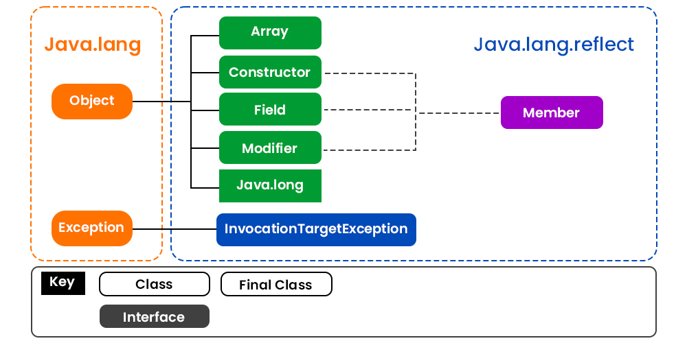
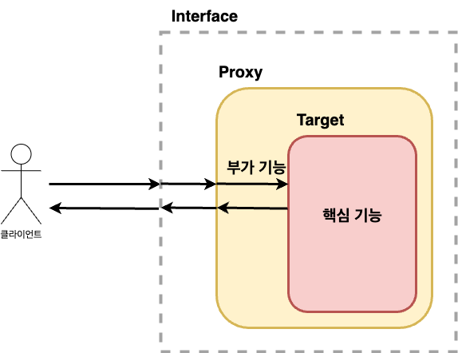

자바의 Reflection과 Dynamic Proxy, CGLIB은 스프링의 많은 곳에서 활용되고 있다.  
그렇기에 **스프링을 더 깊게 이해하기 위해서는 필수적인 선수 지식이라고 생각한다.**  
스프링의 ProxyFactory와 AOP를 이해함을 목표로 차근차근 학습해보자.  

# Java Reflection

자바의 리플렉션(Reflection)은 런타임 시에 클래스의 속성, 메소드, 생성자 등의 메타데이터를 조회하거나 수정할 수 있는 강력한 기능이다.  
또한, **리플렉션을 사용하여 런타임 시에 동적으로 객체를 생성하고, 가시성에 관계없이 메소드를 호출하거나, 필드에 접근할 수 있다.**  
  

[출처 geeksforgeeks](https://www.geeksforgeeks.org/reflection-in-java/)
  
-   필드(목록) 가져오기
-   메소드(목록) 가져오기
-   상위 클래스 가져오기
-   인터페이스(목록) 가져오기
-   어노테이션 가져오기
-   생성자 가져오기
-   ...

이 리플렉션을 사용하는 것은 **메타 프로그래밍** 이라고 하며 위와 같은 행위를 할 수 있다.  
자바의 모든 클래스는 그 클래스 자체의 구성 정보를 담은 `Class 타입`의 오브젝트를 하나씩 갖고 있다.  
`Class` 오브젝트를 이용하면 **클래스 코드에 대한 메타 정보** 를 가져오거나 **객체를 조작** 할 수 있다.   
테스트 코드로 확인해보자.  

```kotlin
data class Address(
    private val state: String,
    private val city: String
)

data class Person(
    private val name: String,
    var age: Int,
    private val address: Address
) {
    constructor(name: String, age: Int): this(name, age, Address("empty", "empty"))

    @Throws(IllegalArgumentException::class)
    constructor(age: Int): this("Admin", age, Address("Admin", "Admin"))

    fun greeting() = "안녕하세요."
}

describe("Person 클래스") {
    val personClass: Class<Person> = Person::class.java

    it("Constructor를 통해 Person 만들기") {
        val constructors: Array<Constructor<Person>>  = personClass.constructors as Array<Constructor<Person>>
        constructors[0].toString() shouldBe "public _22_Reflection.ReflectionTest\$1\$Person(java.lang.String,int)"
        constructors[1].toString() shouldBe "public _22_Reflection.ReflectionTest\$1\$Person(int) throws java.lang.IllegalArgumentException"
        
        val nameAndAgeConstructor = constructors[0]
        val ageConstructor = constructors[1]

        nameAndAgeConstructor.newInstance("Reflection", 10) shouldBe Person("Reflection", 10)
        ageConstructor.newInstance(10) shouldBe Person(10)
    }

    it("Field로 객체 내부 멤버변수 조회하기") {
        val fields: Array<Field> = personClass.declaredFields
        fields[0].toString() shouldBe "private final java.lang.String _22_Reflection.ReflectionTest$1\$Person.name"
        fields[1].toString() shouldBe "private int _22_Reflection.ReflectionTest$1\$Person.age"
        fields[2].toString() shouldBe "private final _22_Reflection.ReflectionTest$1\$Address _22_Reflection.ReflectionTest$1\$Person.address"

        val person = Person(100)

        fields.forEach { it.trySetAccessible() }

        val nameField = fields[0]
        val ageField = fields[1]
        val addressField = fields[2]

        nameField.get(person) shouldBe "Admin"
        ageField.get(person) shouldBe 100
        addressField.get(person) shouldBe Address("Admin", "Admin")
    }

    it("Method 정보로 객체 실행하기") {
        val methods: Array<Method> = personClass.methods

        val getAgeMethod = methods.find { it.name == "getAge" }!!
        val setAgeMethod = methods.find { it.name == "setAge" }!!
        val greetingMethod = methods.find { it.name == "greeting" }!!

        val person = Person(100)

        person.age shouldBe 100
        getAgeMethod.invoke(person) shouldBe 100

        setAgeMethod.invoke(person, 50)

        person.age shouldBe 50
        getAgeMethod.invoke(person) shouldBe 50

        greetingMethod.invoke(person) shouldBe "안녕하세요."
    }
}
```

위와 같이 `Class` 정보를 이용하여 실제 인스턴스를 조작하거나 생성할 수 있다. (더 자세한 예제는 [여기](https://github.com/jdalma/kotlin-playground/blob/main/src/test/kotlin/_22_Reflection/ReflectionTest.kt)를 확인하자.)  
  
리플렉션을 간단하게 확인해보았는데 강력한 기능이라는 것을 느낄 수 있다.  
이 강력한 기능을 통해 자바에서는 **[Dynamic Proxy Class API](https://docs.oracle.com/javase/8/docs/technotes/guides/reflection/proxy.html)** 를 제공한다.  
다이나믹 프록시에 대해 확인하기 전에 먼저 프록시에 대해 알아보자.  

# Proxy란?

단순히 확장성을 고려해서 한 가지 기능을 분리한다면 아래와 같이 전형적인 전략 패턴(`condition: (Member) -> Boolean`)을 사용할 수 있을 것이다.  

```kotlin
fun register(member: Member, condition: (Member) -> Boolean) {
    if(condition(member)) {
        // business logic
    }
}
```

하지만 여러 곳에서 동일한 기능이 필요하다면 아주 번거로워질 것이다. 대표적으로 옛날 방식의 커넥션 관리가 있다.  

```java
public void accountTransfer(String fromId, String toId, int money) throws SQLException {
    Connection con = dataSource.getConnection();
    try {
        con.setAutoCommit(false);
        bizLogic(con, fromId, toId, money); // 핵심 기능
        con.commit();
    } catch (Exception e) {
        con.rollback();
        throw new IllegalStateException(e);
    } finally {
        release(con);
    }
}
```

핵심 기능인 `bizLogic()`을 실행시키기 위한 부가 기능이 많이 존재한다.  
이 문제를 **위임** 을 통해 해결하면 어떨까?  



```kotlin
interface UserService {
    fun accountTransfer(fromId: String, toId: String, money: Int)
}

class UserServiceProxy (
    private val userServiceTarget: UserService
): UserService {
    override fun accountTransfer(fromId: String, toId: String, money: Int) {
        // 부가 기능
        userServiceTarget.accountTransfer(...)
        // 부가 기능
    }
}

class UserServiceTarget: UserService {
    override fun accountTransfer(fromId: String, toId: String, money: Int) {
        // 핵심 기능
    }
}
```

위임을 통해 부가 기능은 마치 **자신이 핵심 기능 클래스인 것처럼 꾸며서, 클라이언트가 자신을 거쳐서 핵심 기능을 사용하도록 만드는 것이다.**  
클라이언트는 인터페이스를 통해서만 핵심 기능을 사용하게 하여, 부가 기능은 자신도 같은 인터페이스를 구현한 뒤에 자신이 그 사이에 끼어들어 타깃을 직접 제어하는 것이다.  
  
이렇게 마치 `자신이 클라이언트가 사용하려고 하는 실제 대상인 것처럼 위장해서 클라이언트의 요청을 받아주는 것`을 대리자,대리인 과 같은 역할을 한다고 해서 **프록시** 라고 부르며, 프록시를 통해 최종적으로 요청을 위임받아 처리하는 실제 오브젝트를 **타깃** 이라고 부른다.  
  
1. 타깃과 동일한 인터페이스를 구현하고
2. 클라이언트와 타깃 사이에 존재하면서
3. 기능의 부가 또는 접근 제어를 담당하면 모두 **프록시** 라고 볼 수 있다.
  
이 **프록시의 사용 목적에 따라 디자인 패턴에서는 다른 패턴으로 구분된다.**  

<h3>데코레이터 패턴</h3>

**타깃에 부가적인 기능을 런타임에 동적으로 부여하기 위해 프록시를 사용하는 패턴을 말한다.**  
대표적으로 [자바 IO패키지의 InputStream 구현 클래스](https://github.com/jdalma/footprints/blob/main/%EB%94%94%EC%9E%90%EC%9D%B8%ED%8C%A8%ED%84%B4/%EA%B5%AC%EC%A1%B0_%EA%B4%80%EB%A0%A8.md#%EB%8D%B0%EC%BD%94%EB%A0%88%EC%9D%B4%ED%84%B0-%ED%8C%A8%ED%84%B4)이다.  
  
프록시로서 동작하는 각 데코레이터는 위임하는 대상에도 인터페이스로 접근하기 때문에 자신이 최종 타깃으로 위임하는지, 아니면 다음 단계의 데코레이터 프록시로 위임하는지 알지 못한다.  
그래서 데코레이터의 다음 위임 대상은 인터페이스로 선언하고 생성자나 수정자 메소드를 통해 위임 대상을 외부에서 런타임 시에 주입받을 수 있도록 만들어야 한다.  
프록시가 꼭 한 개로 제한되지 않으며, 여러 개의 프록시를 **순서를 정해서 단계적으로 위임하는 구조로 만들어야 한다.**  
데코레이터는 스스로 존재할 수 없고 항상 꾸며줄 대상이 있어야 하며 **타겟에 대한 기능을 확장시키는 개념이다.**  
  
위의 `UserServiceTarget`에 부가 기능을 제공하는 `UserServiceProxy`를 추가한 것도 데코레이터 패턴을 적용했다고 볼 수 있다.  

<h3>프록시 패턴</h3>

**클라이언트와 타깃 사이에서 대리 역할을 맡는 오브젝트를 두는 방법을 총칭하는 것이다.**  
디자인 패턴에서 말하는 프록시 패턴은 **프록시를 사용하는 방법 중에 타깃에 대한 접근 방법을 제어하려는 목적을 가진 경우** 를 가리킨다.  
즉, 프록시 패턴의 프록시는 타깃의 기능을 확장하거나 추가하지 않고 클라이언트가 타깃에 대한 접근 권한을 제어하거나 접근하는 방식을 변경해주는 것이다.  
  
위에서 봤던 **실제 타깃 오브젝트를 만드는 대신 프록시를 넘겨주는 것, 그리고 프록시의 메소드를 통해 타깃을 사용하려고 시도하면, 그떄 프록시가 타깃 오브젝트를 (생성하고) 요청을 위임해주는 식이다.**  
대표적으로 `Collections.unmodifiableCollection()`을 통해 만들어지는 객체가 전형적인 접근 권한 제어용 프록시라고 볼 수 있다.  

```java
public static <T> Collection<T> unmodifiableCollection(Collection<? extends T> c) {
    if (c.getClass() == UnmodifiableCollection.class) {
        return (Collection<T>) c;
    }
    return new UnmodifiableCollection<>(c);
}
```

이렇게 프록시 패턴은 타깃의 기능 자체에는 관여하지 않으면서 접근하는 방법을 제어해주는 프록시를 `이용`하는 것이다.  
  
> 위임을 통한 프록시를 생성하여 부가 기능과 핵심 기능을 분리했지만 프록시를 만드는 일은 번거롭고 타깃 인터페이스에 의존적이여서 타깃이 여러 개라면 인터페이스 API가 수정될 수 밖에 없을 것이다.  

# Java Dynamic Proxy

일일이 프록시 클래스를 정의하는 것은 한계가 있다는 것을 알 수 있다.  
이 한계를 **프록시처럼 동작하는 오브젝트를 동적으로 생성하는 JDK의 다이내믹 프록시** 와 **리플렉션** 으로 해결할 수 있다.  
  
이 프록시는 두 가지 기능으로 구성된다.  

1. **타깃과 같은 메소드를 구현하고 있다가 메소드가 호출되면 타깃 오브젝트로 위임한다.**
2. **지정된 요청에 대해서는 부가 기능을 수행한다.**

다이나믹 프록시를 이용해 프록시를 만들어보자.  

> `Hello` 인터페이스를 구현한 프록시를 만들어보자.  
> 프록시에는 데코레이터 패턴을 적용해서 타깃인 `HelloTarget`에 부가 기능을 추가해보자.  
> 리턴하는 문자를 모두 대문자로 바꾸는 부가 기능을 만들어보자.

```kotlin
interface Hello {
    fun sayHello(name: String): String
    fun sayHi(name: String): String
    fun sayThankYou(name: String): String
}
interface Goodbye {
    fun sayGoodbye(name: String): String
    fun sayThankYou(name: String): String
}
class HelloTarget: Hello {
    override fun sayHello(name: String): String = "Hello $name"
    override fun sayHi(name: String): String = "Hi $name"
    override fun sayThankYou(name: String): String = "Hello Thank You $name"
}

class GoodbyeTarget: Goodbye {
    override fun sayGoodbye(name: String): String = "Goodbye $name"
    override fun sayThankYou(name: String): String = "Goodbye Thank You $name"
}

class UppercaseHandler(
    helloTarget: Hello,
    goodbyeTarget: Goodbye
): InvocationHandler {

    private val lookupTarget = mapOf(
        Hello::class.java to helloTarget,
        Goodbye::class.java to goodbyeTarget,
    )
    override fun invoke(proxy: Any, method: Method, args: Array<out Any>): Any {
        val result: String = method.invoke(lookupTarget[method.declaringClass], *args) as String
        return result.uppercase()
    }
}

"Hello 동적 프록시 테스트하기" {
    val proxy = Proxy.newProxyInstance(
        javaClass.classLoader,
        arrayOf(Hello::class.java, Goodbye::class.java),
        UppercaseHandler(HelloTarget(), GoodbyeTarget())
    )

    (proxy is HelloTarget) shouldBe false
    (proxy is GoodbyeTarget) shouldBe false
    (proxy is Hello) shouldBe true
    (proxy is Goodbye) shouldBe true

    val hello = proxy as Hello
    hello.sayHello("admin") shouldBe "HELLO ADMIN"
    hello.sayHi("admin") shouldBe "HI ADMIN"
    hello.sayThankYou("admin") shouldBe "HELLO THANK YOU ADMIN"

    val goodbye = proxy as Goodbye
    goodbye.sayGoodbye("admin") shouldBe "GOODBYE ADMIN"
    goodbye.sayThankYou("admin") shouldBe "HELLO THANK YOU ADMIN"
}
```

`Proxy.newProxyInstance()`로 중요한 두 가지의 값을 전달해야 한다.  

1. `InvocationHandler`를 구현한 부가 기능을 가진 **프록시**
2. `Hello`와 `Goodbye`와 같은 **인터페이스**

런타임 중에 주어진 인터페이스들을 구현하는 프록시 인스턴스를 생성하며, 프록시 인스턴스는 하나의 `InvocationHandler` 인스턴스와 연결된다.  
프록시 인스턴스에 대한 모든 메소드 호출은 `InvocationHandler`의 `invoke()` 메소드로 호출되며, 여기서 타갯 메소드를 호출하기 전에 **추가 기능을 가로채거나 추가할 수 있다.**  
  
> 리플렉션 메소드인 invoke()를 이용해 타깃 오브젝트의 메소드를 호출할 때는 타깃 오브젝트에서 발생하는 예외가 `InvocationTargetException`으로 한 번 포장돼서 전달된다.  
> 따라서 InvocationTargetException으로 받은 후 `getTargetException()` 메소드로 **중첩되어 있는 예외를 가져와야 한다.**
  
`Method`를 이용한 타깃의 오브젝트의 메소드 호출을 구분하거나 `args` 인자들의 정보를 확인하거나 조작할 수 있다.  
리플렉션의 매우 유연하고 막강한 기능을 사용하여 동적 프록시를 조금 더 편하게 만들어보았다.  
하지만 인터페이스 기반이라는 단점이 있다. 이 단점을 해결하는 CGLIB에 대해 알아보자.  

# CGLIB(Code Generation Library)

자바 클래스의 바이트코드를 런타임에 조작하여 새로운 클래스나 객체를 동적으로 생성하고 수정할 수 있는 강력한 라이브러리다.  
이 라이브러리는 스프링 AOP 프레임워크, ORM 툴, 그리고 다양한 테스팅 라이브러리 등에서 널리 사용되고 있다.  
**클래스 기반으로 타겟 객체의 클래스를 상속 받아 새로운 서브 클래스로 프록시를 생성하는 방식이다.**  
인터페이스가 없는 클래스에도 적용할 수 있기에 자바의 동적 프록시의 단점을 해결한다.  
  
```kotlin
open class Person: Hello, Goodbye {
    open fun greeting() = "안녕하세요!"
    override fun sayHello(name: String): String = "Hello $name"
    override fun sayHi(name: String): String = "Hi $name"
    override fun sayThankYou(name: String): String = "Thank you $name"
    override fun sayGoodbye(name: String): String = "Goodbye $name"
}

class MyMethodInterceptor: MethodInterceptor {
    override fun intercept(proxy: Any, method: Method, args: Array<out Any>, methodProxy: MethodProxy): Any =
        // 프록시의 슈퍼클래스의 타겟 메서드를 호출한다.
        "(Intercepted) " + methodProxy.invokeSuper(proxy, args)
}

"Person 클래스 Cglib 테스트" {
    val proxy = Enhancer.create(
        Person::class.java,
        MyMethodInterceptor()
    )

    (proxy is Hello) shouldBe true
    (proxy is Goodbye) shouldBe true
    (proxy is Person) shouldBe true

    val person = proxy as Person
    person.greeting() shouldBe "(Intercepted) 안녕하세요!"
    person.sayHello("admin") shouldBe "(Intercepted) Hello admin"
    person.sayHi("admin") shouldBe "(Intercepted) Hi admin"
    person.sayThankYou("admin") shouldBe "(Intercepted) Thank you admin"
    person.sayGoodbye("admin") shouldBe "(Intercepted) Goodbye admin"
}
```

프록시 클래스는 구체적인 클래스와 인터페이스의 서브 클래스이므로, 모든 메서드를 가로챌 수 있다.  
인터페이스를 구현하지 않는 클래스를 프록시하고 싶을 때 유용하다.  
하지만 CGLIB을 통하여 프록시를 생성할 때 지켜야하는 규칙들이 있다.  

1. **클래스를 상속하고 메서드를 오버라이드 하기 때문에 클래스와 메서드가 final이 선언되어 있지 않아야 한다.**
2. **기본 생성자가 꼭 있어야 한다.**

CGLIB은 자바 동적 프록시에 비해 추가적인 기능도 제공한다.  

```kotlin
class MyFixedValue: FixedValue {
    override fun loadObject(): Any = "Intercepted and always return \"Fixed\""
}

class MyCallbackFilter : CallbackFilter {
    override fun accept(method: Method): Int =
        when(method.name) {
            "greeting" -> 1 // FixedValue 콜백 사용
            else -> 0       // MethodInterceptor 사용
        }

}

"Person 클래스 Cglib Callback, FixedValue 테스트" {
    val proxy = Enhancer.create(
        Person::class.java,
        arrayOf(Hello::class.java, Goodbye::class.java),
        MyCallbackFilter(),
        arrayOf<Callback>(MyMethodInterceptor(), MyFixedValue())
    )

    val person = proxy as Person
    person.greeting() shouldBe "Intercepted and always return \"Fixed\""
    person.sayHello("admin") shouldBe "(Intercepted) Hello admin"
    person.sayHi("admin") shouldBe "(Intercepted) Hi admin"
    person.sayThankYou("admin") shouldBe "(Intercepted) Thank you admin"
    person.sayGoodbye("admin") shouldBe "(Intercepted) Goodbye admin"
}
```

`Enhancer.create()`에서 전달하는 Callback 순서대로 (`arrayOf<Callback>(MyMethodInterceptor(), MyFixedValue())`) `CallbackFilter`에서 어떤 콜백을 실행할지 지정할 수 있다.  

# ProxyFactory

스프링에서 제공하는 AOP 프록시용 팩토리는 인터페이스가 있을 때는 JDK 동적 프록시를 사용하고, 그렇지 않은 경우에는 CGLIB을 사용한다.  
이제는 부가 기능을 적용할 때 `Advice (부가 기능)`만 지정해주면된다. `InvocationHandler`나 `MethodInterceptor`를 알 필요가 없다.  
프록시 팩토리가 내부에서 JDK 동적 프록시일 경우 InvocationHandler가 Advice를 호출하도록 하고, CGLIB인 경우 MethodInterceptor가 Advice를 호출하도록 기능을 개발해두었기 때문이다.

```kotlin
interface Hello {
    fun sayHello(name: String): String
    fun sayHi(name: String): String
    fun sayThankYou(name: String): String
}

open class Person: Hello {
    open fun greeting() = "안녕하세요!"
    override fun sayHello(name: String): String = "Hello $name"
    override fun sayHi(name: String): String = "Hi $name"
    override fun sayThankYou(name: String): String = "Thank you $name"
}

open class ConcretePerson {
    open fun greeting() = "Concrete 안녕하세요!"
    open fun sayHello(name: String): String = "Concrete Hello $name"
    open fun sayHi(name: String): String = "Concrete Hi $name"
    fun sayThankYou(name: String): String = "Concrete Thank you $name"
}

class MyMethodInterceptor1: MethodInterceptor {
    override fun invoke(invocation: MethodInvocation): String = "(Intercepted1)" + invocation.proceed()
}

class MyMethodInterceptor2: MethodInterceptor {
    override fun invoke(invocation: MethodInvocation): String = "(Intercepted2)" + invocation.proceed()
}

"인터페이스가 있으면 JDK 동적 프록시 사용" {
    val proxyFactory: ProxyFactory = ProxyFactory(Person())
    proxyFactory.addAdvice(MyMethodInterceptor1())
    proxyFactory.addAdvice(MyMethodInterceptor2())

    shouldThrowExactly<ClassCastException> {  proxyFactory.proxy as Person }

    val proxy = proxyFactory.proxy as Hello

    proxy.javaClass.toString() shouldBe "class jdk.proxy2.\$Proxy7"

    proxy.sayHello("admin") shouldBe "(Intercepted1)(Intercepted2)Hello admin"
    proxy.sayHi("admin") shouldBe "(Intercepted1)(Intercepted2)Hi admin"
    proxy.sayThankYou("admin") shouldBe "(Intercepted1)(Intercepted2)Thank you admin"
}

"구체 클래스만 있으면 CGLIB 사용" {
    val proxyFactory: ProxyFactory = ProxyFactory(ConcretePerson())
    proxyFactory.addAdvice(MyMethodInterceptor1())
    proxyFactory.addAdvice(MyMethodInterceptor2())

    val proxy = proxyFactory.proxy as ConcretePerson

    proxy.javaClass.toString() shouldBe "class ConcretePerson$\$SpringCGLIB$$0"

    proxy.greeting() shouldBe "(Intercepted1)(Intercepted2)Concrete 안녕하세요!"
    proxy.sayHello("admin") shouldBe "(Intercepted1)(Intercepted2)Concrete Hello admin"
    proxy.sayHi("admin") shouldBe "(Intercepted1)(Intercepted2)Concrete Hi admin"
    // open 되지 않은 메서드는 프록시가 실행되지 않는다.
    proxy.sayThankYou("admin") shouldBe "Concrete Thank you admin"
}

"인터페이스가 있어도 클래스 기반 CGLIB 프록시 사용" {
    val proxyFactory: ProxyFactory = ProxyFactory(Person())
    proxyFactory.isProxyTargetClass = true
    proxyFactory.addAdvice(MyMethodInterceptor1())
    proxyFactory.addAdvice(MyMethodInterceptor2())

    val proxy = proxyFactory.proxy as Person

    proxy.javaClass.toString() shouldBe "class Person$\$SpringCGLIB$$0"

    proxy.greeting() shouldBe "(Intercepted1)(Intercepted2)안녕하세요!"
    proxy.sayHello("admin") shouldBe "(Intercepted1)(Intercepted2)Hello admin"
    proxy.sayHi("admin") shouldBe "(Intercepted1)(Intercepted2)Hi admin"
    proxy.sayThankYou("admin") shouldBe "(Intercepted1)(Intercepted2)Thank you admin"
}
```

```
-- JDK 동적 프록시를 사용하는 경우
invoke:36, MyMethodInterceptor1
invoke:35, MyMethodInterceptor1
proceed:184, ReflectiveMethodInvocation (org.springframework.aop.framework)
invoke:220, JdkDynamicAopProxy (org.springframework.aop.framework)
sayHello:-1, $Proxy7 (jdk.proxy2)

-- CGLIB을 사용하는 경우
invoke:36, MyMethodInterceptor1
invoke:35, MyMethodInterceptor1
proceed:184, ReflectiveMethodInvocation (org.springframework.aop.framework)
proceed:765, CglibAopProxy$CglibMethodInvocation (org.springframework.aop.framework)
intercept:717, CglibAopProxy$DynamicAdvisedInterceptor (org.springframework.aop.framework)
greeting:-1, Person$$SpringCGLIB$$0
```

```java
@FunctionalInterface
public interface MethodInterceptor extends Interceptor {
	@Nullable
	Object invoke(@Nonnull MethodInvocation invocation) throws Throwable;
}
```

`invoke()`의 파라미터인 `MethodInvocation` 내부에는 **다음 메서드를 호출하는 방법**, **현재 프록시 객체 인스턴스**, **args**, **메서드 정보**등이 포함되어 있다.  
Target이 MethodInvocation안에 포함되어 있기 때문에 이전 방법과 다르게 프록시 내부에서 Target을 신경쓰지 않아도 된다.  
  
스프링 부트는 AOP를 적용할 때 기본적으로 `proxyTargetClass=true`로 설정해서 사용하기 때문에 **인터페이스가 있어도 CGLIB을 사용해서 구체 클래스를 기반으로 프록시를 생성한다.**  
