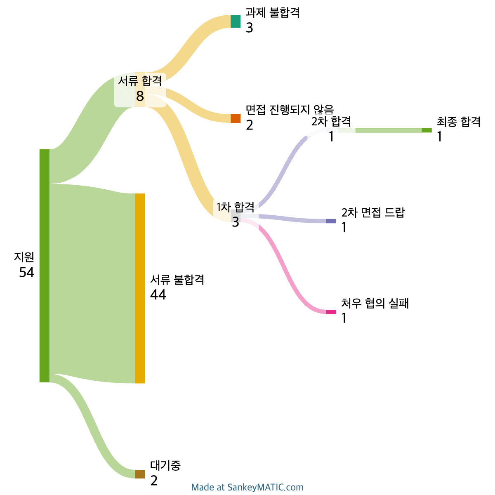
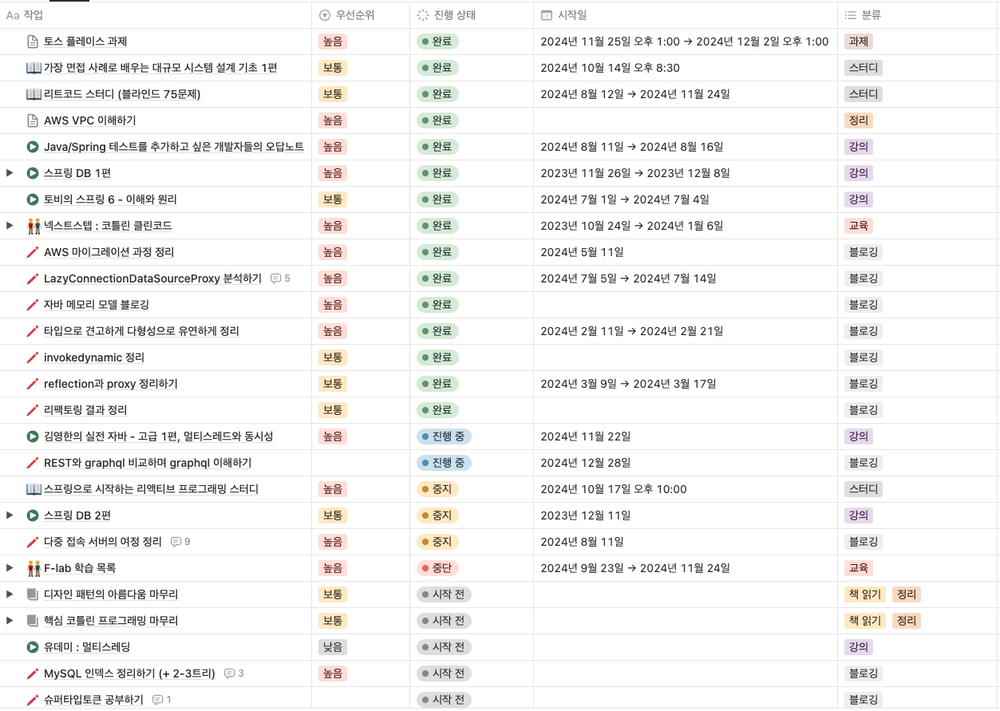

# 들어가며

매년 회고를 작성할 때마다 스스로에게 묻곤 한다. `"올해를 만족할 정도로 보냈나?"`  
하지만 대답은 항상 `"아니"` 인 것 같지만.. 이전에 작성했던 회고를 다시 읽어보면 성장이 느껴지기도 한다.  
조금씩 앞으로 나아가고 있다는 위안을 얻기에 회고가 큰 도움이 된다. 그래서 이번에도 올해 있었던 일들을 돌아보며, 올해를 어떻게 보냈는지 정리해 보려고 한다.  

# 퇴사

최근, 특허 검색 서비스를 제공하는 회사에서 퇴사했다.

첫 번째 이유는 `도메인`이다. 처음에는 특허 검색 서비스에 흥미를 느꼈지만, 시간이 지날수록 내가 성능을 개선하거나 기능을 추가해도 큰 보람을 느끼기 어려웠다. 이는 특허 검색이라는 도메인에 공감이 잘 되지 않았기 때문이다.  
한편으로는 기술적으로 해결해야 할 과제는 많았고, 실제로 기술적인 역량을 요구하는 작업에 많이 참여했다.  
하지만 개인적으로 결제나 정산 도메인을 경험해 보고 싶었고, 이 회사에서는 계약이나 결제를 다룰 가능성이 없어 그 경험을 쌓기 어렵다고 판단했다.  

두 번째 이유는 `업무 지시 방법`이다. 한 프로젝트를 진행하면서 실무자인 내가 작업 방향에 공감하지 못한 경험이 있었다.  
내가 생각하는 더 나은 방향을 제안했지만 받아들여지지 않았고 의사결정자들은 불편한 기색을 보이며 `"왜 이 작업을 이해하지 못하는지 이해가 안 된다."` 라는 말만했다.
내 제안을 받아들이지 않은 것 자체는 문제가 되지 않는다. 의사결정자들이 서비스와 개발 방향을 나보다 더 잘 이해하고 있을 가능성이 높으며, 작업이 잘못되더라도 (대부분) 책임은 결정자들이 질 것이기 때문이다.  
그러나 중요한 점은 **실무자를 설득하는 방법**이다. 왜 이 방향으로 작업을 진행해야 하는지에 대해 실무자를 납득시키는 과정이 필요하다고 생각한다. 하지만 `일을 주면 잔말말고 그냥 해`와 같은 업무 할당 방식은 나와 전혀 맞지 않다고 느꼈다.  
  
**현실 세계의 문제를 확실하게 내가 공감하고 능동적으로 일을 진행할 수 있는 환경으로 가고 싶다고 생각되었기에 퇴사를 결정하게 됐다.**  

# 최종 합격

내가 관심 있는 도메인에 대한 경험을 쌓고, 학습 방향이나 깊이에 대해 조언을 받을 기회를 만들기 위해 F-Lab을 진행했다.  
구직은 F-lab을 끝내고 2025년 1월부터 본격적으로 시작할 계획이었기에 채용 공고를 모으면서 이력서와 경력기술서를 갱신했고, 틈틈이 지원도 병행하고 있었다.  
아래는 지원 현황이다.  

운 좋게 한 회사에서 서류를 통과했고, 하루에 1차와 2차 면접을 연달아 진행하게 됐다.
사실 큰 기대를 하지 않았던 회사였지만, 서비스를 살펴보니 매우 흥미로웠고, 내가 경험하고 싶던 도메인을 모두 다룰 수 있을 것이라고 판단했다.  
  
면접 바로 다음 날 오퍼메일을 받았고, 처우 협상을 마친 뒤 2주 만에 합류했다.  
(처우협상 직후 토스 플레이스 과제를 1주일 동안 진행해서 여행을 가거나 놀진 못 했다 ㅠㅜ 과제도 결국 떨어졌다..)  
  
합류한 회사는 [더 스윙](https://swingmobility.co/)이라는 회사이고, 스윙 바이크 어드민 서비스 개발을 맡고 있다.  
바이크 계약, 결제, 자동결제, 정산 등 내가 경험하고 싶었던 모든 도메인을 다루며 일하고 있다.  
또한, 스크럼에 직접 참여해 현실 세계의 문제를 공감하고, 이를 해결하기 위해 고민하며 일하는 환경에 매우 만족하고 있다.  
  
수습 기간이 끝나면, 현재 회사에 대한 자세한 회고를 작성할 계획이다.  

# 러닝

개발 공부는 꾸준히 해도 스스로 성장했는지 판단하기 굉장히 힘든데 러닝은 하면 할수록 성장이 확실히 느껴져서 재밌는 것 같다. 그리고 스트레스나 불안을 해소하기에도 굉장히 좋기에 꾸준히 하고 있는 운동이다.  

| 월   | 거리     | 월   | 거리    |
|:------:|:--------:|:------:|:--------:|
| 1월  | 31.35  | 7월  | 59.55  |
| 2월  | 30.68  | 8월  | 103.98 |
| 3월  | 58.83  | 9월  | 73.03  |
| 4월  | 59.50  | 10월 | 154.81 |
| 5월  | 71.92  | 11월 | 144.70 |
| 6월  | 63.31  | 12월 | 77.98  |
| **합계** | **315.59** | **합계** | **614.05** |
|  |  | **총합계** | **929.64** |

총 `929.64km`를 뛰었고 퇴사 이후인 하반기에 확실히 많이 뛰었다.  
폼이 금방 올라서 조깅 거리를 `9km`로 늘리고 페이스도 `5분 ~ 6분`으로 안정적으로 뛸 수 있게 되었다.  

마라톤 성적도 조금씩 좋아진 것을 확인할 수 있다.  
개인 PB가 `10km : 51분 56초`, `20km : 1시간 54분 26초`로 목표했던 10km 한 시간 이내, 하프 두 시간 이내 뛰기 목표도 이루었다.  
  
첫 하프가 2시간 27분였지만 세 번째 하프에서 1시간 54분으로 단축한 것이 제일 뿌듯하다.  
2025년에도 마일리지 꾸준히 쌓아서 풀코스 완주가 목표다.  

# 책 읽기와 스터디

[2024년 기록](https://jdalma.github.io/2024y/bookReview/bookReview/)에 읽은 책과 강의에 대한 후기를 꾸준히 작성하고 있다.  
대부분 출퇴근 시간을 활용해 독서를 하기 때문에, 퇴사 후 취업 준비 기간 동안에는 읽은 책의 양이 크게 줄어들기도 했다. 그럼에도 올해는 총 31권의 책을 읽었다.  
그중 기술서적은 17권, 기술 외의 책은 14권이었다.  
  
퇴사 전, 사내 스터디를 주도하며 다음 3권의 책을 함께 읽었다.
1. 네티 인 액션
2. Real MySQL 1권
3. 엘라스틱서치 바이블

코드 스피츠와 코드숨 스터디를 통해 다음 6권의 책을 읽었다.
1. 이벤트 소싱과 마이크로서비스 아키텍처
2. 네티 인 액션
3. 코틀린 디자인 패턴 2/e
4. HTTP/2 인 액션
5. OAuth2 인 액션
6. 가상 면접 사례로 배우는 대규모 시스템 설계 기초

너무 기술적인 책만 읽지 않으려고, 문학과 비문학을 가리지 않고 흥미가 조금이라도 생기면 여러 종류의 책을 읽으려 노력하고 있다.  
그래서 조금 읽다가 덮는 책들이 있긴 하지만, 올해는 특히 두 권의 책이 깊은 인상을 남겼다.  
  
첫 번째 책은 알랭 드 보통의 **'불안'** 이다.  
이 책은 군대 훈련소 시절 한 번 읽었었는데, 이번에 개정판이 나와 다시 읽었다.  
특히 퇴사를 고민하던 시기에 큰 위로와 용기를 준 책이었다. 퇴사 후 내가 원하는 경험을 할 수 있는 회사를 찾기 위한 불확실한 도전을 준비하며 느꼈던 스트레스와 불안을 덜어주는 데 많은 도움이 되었다.  
이 책은 주변 지인이나 가족에게 선물할 만큼 좋아하는 책이며, 매년 초에 읽을 책 리스트에 추가해 두었다.  
스트레스나 불안으로 힘들어하는 사람들에게 강력 추천한다.  
  
두 번째 책은 한강 작가의 **'소년이 온다'** 이다.  
짧은 계엄 기간을 경험한 후, 책장에 꽂아두기만 했던 이 책을 드디어 읽게 되었다.  
읽는 내내 감정적으로 매우 힘들었다. 책을 읽으면서 눈물이 날 것 같아 중간중간 멈춰야 할 정도였다.  
읽고 느낀 점은 [2024년 기록 - 소년이 온다](https://jdalma.github.io/2024y/bookReview/bookReview/#%EC%86%8C%EB%85%84%EC%9D%B4-%EC%98%A8%EB%8B%A4)를 참고하자. (계엄 관련한 ['작별하지 않는다'](https://www.yes24.com/product/goods/103495056)도 읽어볼 예정이다.)  
  
책을 읽으면서 내면이 조금씩 단단해지고 있음을 느낀다.  
감정과 상황을 다양한 관점에서 해석하는 시각이 생겼고, 예민했던 성격이 무던해지고 있다는 생각이 든다.  
책을 꾸준히 읽는 습관이 생긴 스스로가 신기하기도 하지만, 책을 읽는다는 게 대수인가 싶기도 하다.  
  
내년에도 꾸준히 책을 읽으며 이 습관을 이어가고자 한다.

# TODO 리스트

2023년 말 처음으로 TODO 리스트를 관리하기 시작했고, 올해는 이를 꾸준히 활용하며 학습과 작업에 큰 도움을 받았다.  
TODO 리스트를 사용하면서 느낀 장점은 다음과 같다.  
1. 학습해야 할 내용을 까먹는 일이 줄어들었다. 평소 접한 유용한 게시글도 링크로 정리해두니 쉽게 관리할 수 있었다.
2. 목록화된 학습 내역을 보며, 지금까지 무엇을 배웠는지 되돌아보기 쉬워졌다.
3. 태스크의 우선순위를 정리하고, 무엇을 먼저 해야 할지 결정하는 과정이 훨씬 명확해졌다.
  
이러한 관리 방법은 학습에 대한 동기부여로 이어졌고, 그 결과 올해 블로그에 10개의 기술 글을 작성하는 성과를 거두었다.  
  
하지만, TODO 리스트를 활용하면서 한 가지 단점을 발견했다. **'하기 싫거나 흥미 없는 태스크는 진행하지 않는다.'**는 점이다.  
내 관심사가 반영된 태스크만 완료하다 보니, 중요한 작업이 밀리거나 골고루 진행하지 못하는 경우가 있었다.  
  
이를 보완하기 위해, 다음과 같은 규칙을 스스로 만들어볼 생각이다.  
`"작업을 시작하기 전, 태스크를 랜덤으로 선택해 선택된 태스크는 반드시 완료한다."`  
이 규칙을 통해 편향된 진행 방식을 개선할 수 있지 않을까 싶다.  
  
TODO 리스트는 단순한 작업 관리 도구 그 이상이었다.  
나의 학습과 작업에 체계성을 더해주고, 동기부여를 강화해주는 중요한 도구라고 느끼고 있다.  
앞으로도 이 방식을 발전시키며 더 나은 결과를 만들어가고 싶다.  

# 총평

2023년에 작성한 2024년 목표를 얼마나 달성했을까

1. [x] 하프 마라톤 완주하기
2. [x] 책 20권 읽기
3. [ ] 인프런 강의 5편 이상 보기 → 3개를 완강하고 1개를 아직 보고 있다.
4. [ ] 사람들 앞에서 기술 발표 해보기 
5. [x] 도전을 두려워 하지말기 → 퇴사하고 원하는 도메인을 다루고 있으니 이뤘다고 보자
6. [ ] (간단한) 서비스 만들기

3개 밖에 못 이루었다..

## 2025년 목표

1. 풀코스 완주하기
2. 러닝 마일리지 총 1000km 쌓기
3. 책 30권 읽기
4. 인프런 강의 5편 이상 보기
5. 사람들 앞에서 기술 발표 해보기
6. 월에 1개씩 기술 블로깅하기 (총 12개)
7. 회사에서 내가 맡은 서비스는 무조건 해내고, 다른 서비스도 업무 처리하기
8. (개인적으로) 사내 개선 태스크 10개 만들어서 해내기
9. 도전을 두려워 하지 말기
10. (간단한) 서비스 만들기

## 느낀점

어느덧 개발자로서 5년차가 되었다. 내가 생각하는 5년차의 기준에는 아직 부족한 점이 많다고 느끼지만, 그 부족함을 채우기 위해 꾸준히 노력하고 있다.  
불과 얼마 전까지만 해도 이름 있는 회사에 들어가고 싶다는 욕심에 스스로를 압박하며 스트레스를 받곤 했다. 그런데 요즘은 그런 목표에 집착하거나 불안감을 느끼지 않는다.  
  
스윙에서의 경험이 이러한 변화에 큰 영향을 주었다. 사용자와 가까운 서비스를 개발하고 운영하는 팀원들의 모습을 옆에서 보면서 `"저런 서비스를 개발하는 건 정말 재밌겠다."` 라는 생각이 들었다.  
그러다 보니 자연스럽게 대기업 이직에 대한 욕심은 줄어들었고, 오히려 내가 하고 싶은 개발에 더 집중하게 되었다.  
현재 실시간 사용자 서비스를 직접 개발하고 있지는 않지만, 내가 맡은 서비스가 안정적인 궤도에 오른다면 스윙의 주요 서비스들을 더 깊이 이해하고 직접 개발해보고 싶다는 욕심도 생긴다.  
  
내가 가장 중요하게 생각하는 것은 하루의 1/3, 많게는 2/3을 보내는 회사에서의 업무에 대한 흥미다.  
만약 회사에서 하는 일이 재미없고 고역처럼 느껴진다면 그 시간은 얼마나 고통스러울까?  
다행히도 나는 개발자로서 일과 학습에서 재미를 느끼고 있다는 점에서 큰 행복을 느낀다. 주변 사람들은 이런 점을 잘 이해하지 못하는 경우도 있지만, 나는 그저 내가 하는 일을 즐길 수 있다는 사실에 감사하고 있다.  
  
최근에는 클린 코드, 테스트 코드, 그리고 개발 문화에 대한 현실과 이상 사이의 괴리감을 절실히 느끼고 있다.  
이것들이 중요하지 않다는 뜻은 결코 아니다. 다만 비즈니스가 존재해야 개발이 존재한다는 점에서, 스스로 너무 이상에만 집착했던 것은 아닌지 돌아보게 되었다.  
개발이라는 행위는 결국 비즈니스를 완성하기 위한 수단이며, 비즈니스가 우선이라는 사실을 명심하자.  
  
이제 회사에 빠르게 적응하여 비즈니스와 개발 모두에 기여하고 2025년 목표를 이루기 위해 꾸준히 노력할 예정이다.  
2025년에도 사소한 것에 동요하지말고 하는 일에 재미를 느끼면서 보낼 수 있으면 좋겠다.  