IDC 환경의 MySQL 서버를 AWS로 마이그레이션하면서 [스프링에서 읽기/쓰기 분리](https://jdalma.github.io/2024y/mysqlMigration/#%EC%8A%A4%ED%94%84%EB%A7%81%EC%97%90%EC%84%9C-%EC%9D%BD%EA%B8%B0%EC%93%B0%EA%B8%B0-%EB%B6%84%EB%A6%AC)를 스프링에서 제공하는 [LazyConnectionDataSourceProxy](https://docs.spring.io/spring-framework/docs/current/javadoc-api/org/springframework/jdbc/datasource/LazyConnectionDataSourceProxy.html) 클래스를 활용해서 해결하였다.  
  
이번 글을 통해 JDBC와 스프링이 제공하는 PSA에 대해 정리해보고 어떤 원리로 읽기/쓰기가 분리된 것인지 이해해보려한다.  

# JDBC

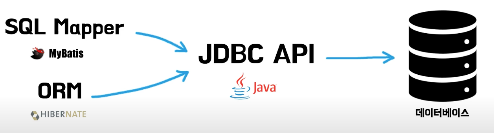

우리가 쉽게 접하고 사용하는 MyBatis와 하이버네이트에서도 기저에는 JDBC API를 사용하여 데이터베이스와 통신하기에 먼저 JDBC가 무엇인지 이해할 필요가 있다.  
  
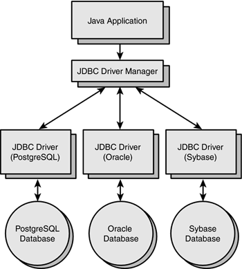

**JDBC(Java Database Connectivity)** 는 클라이언트가 모든 종류의 표 형식 데이터, 특히 관계형 데이터베이스에 액세스할 수 있는 방법을 정의하는 Java용 응용 프로그래밍 인터페이스이다.  
Java 애플리케이션과 데이터베이스 간의 **중간 계층 인터페이스 역할** 을 하며, 데이터 소스에 연결하거나 쿼리를 실행하고 데이터베이스 질의 결과를 처리하기 위한 가이드이다.  
  
**JDBC 드라이버** 는 Java 애플리케이션의 요청을 DBMS가 이해할 수 있는 프로토콜로 변환하는 `클라이언트 측 어댑터`이다.  
즉, JDBC 드라이버는 Java 애플리케이션과 데이터베이스가 상호 작용할 수 있도록 JDBC API의 인터페이스를 구현하는 소프트웨어 구성 요소이다.  
이 드라이버의 유형에는 Sun Microsystem에서 정의한 4개의 유형이 있다.  
(자세한 설명은 [JDBC 드라이버](https://www.geeksforgeeks.org/jdbc-drivers/)를 참고하자.)  

1. Type-1 드라이버 또는 JDBC-ODBC 브리지 드라이버
2. Type-2 드라이버 또는 Native-API 드라이버
3. Type-3 드라이버 또는 네트워크 프로토콜 드라이버
4. **Type-4 드라이버 또는 Thin 드라이버(완전 Java 드라이버)** : 데이터베이스에 직접 연결하여 JDBC 호출을 데이터베이스별 호출로 변환한다.

데이터베이스마다 고유한 프로토콜이 필요하다는 단점이 있긴 하지만, 데이터베이스 서버에 직접 연결하면 다른 Type에 비해 더 나은 성능을 제공하는 장점이 있는 Type-4가 가장 일반적으로 사용된다.  

## JDBC API 사용하기

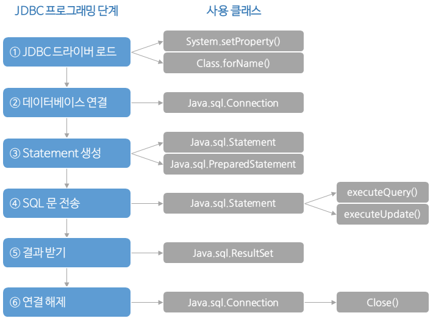

```java
    // 1. JDBC 드라이버 로드는 JDBC4.0부터 클래스 경로에 있는 모든 드라이버가 자동으로 로드되기 때문에 직접 Class.forName을 호출할 필요가 없다.
    public Member findById(String memberId) throws SQLException {
        String sql = "select * from member where member_id = ?";

        Connection con = null;
        PreparedStatement pstmt = null;
        ResultSet rs =  null;

        try {
            // 2. 데이터베이스 연결 (커넥션 생성)
            con = getConnection();

            // 3. SQL 명령을 전송하기 위한 Statement 준비 (PreparedStatement 또는 CallableStatment)
            pstmt = con.prepareStatement(sql);
            pstmt.setString(1, memberId);

            // 4. SQL문 전송
            // 5. 질의문 결과(ResultSet) 생성
            rs = pstmt.executeQuery();
            if (rs.next()) {
                Member member = new Member();
                member.setMemberId(rs.getString("member_id"));
                member.setMoney(rs.getInt("money"));
                return member;
            } else {
                throw new NoSuchElementException("member not found memberId = {}" + memberId);
            }
        } catch (SQLException e) {
            log.error("db error", e);
            throw e;
        } finally {
            // 6. 연결 해제 (사용된 리소스 해제)
            close(con, pstmt, rs);
        }
    }

    public Connection getConnection() {
        try {
            Connection connection = DriverManager.getConnection(URL, USERNAME, PASSWORD);
            log.info("get connection = {}, class = {}", connection, connection.getClass());
            return connection;
        } catch (SQLException e) {
            throw new IllegalStateException(e);
        }
    }
```

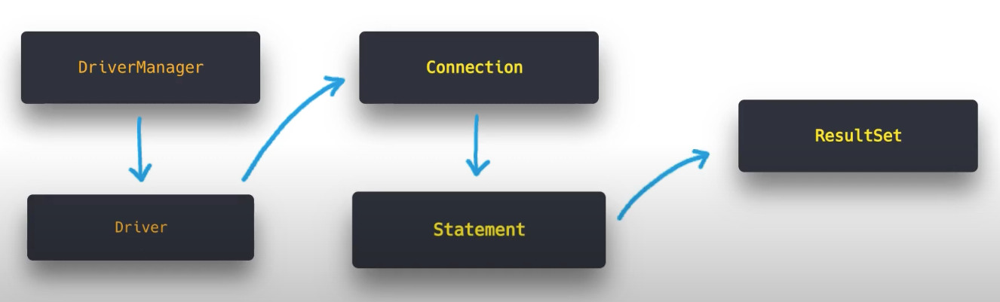

- **DriverManager와 Driver**
  - DriverManager가 모든 Driver를 로드한 다음, 연결 요청이 있을 때마다 각 드라이버에 차례대로 대상 URL에 연결을 시도하도록 요청한다. ([Service Provider Interface](https://www.baeldung.com/java-spi))
  - Driver는 모든 드라이버 클래스가 구현해야 하는 인터페이스이며, 실질적으로 데이터베이스에 연결을 시도하고 Connection을 반환하는 `connect()` 메서드가 있다.
- **Connection**
  - 특정 데이터베이스와의 연결(세션)을 유지하며, SQL문이 실행되고 결과가 반환되는 컨텍스트이다.
  - 데이터베이스의 메타정보를 조회하거나 트랜잭션의 격리 수준과 커밋 모드 등을 수정하는 책임을 가지고 있다.
- **PreparedStatement**
  - SQL문을 나타내는 객체이며, 파라미터를 바인딩할 수 있다.
  - SQL문을 실행하고 결과를 반환하는 책임이 있다.
- **ResultSet**
  - 데이터베이스 결과 집합을 나타내며, 결과 집합의 데이터 행을 가리키는 커서를 유지한다.
  - 레코드의 데이터를 특정 데이터 타입으로 가져오는 방법을 제공한다.

아래와 같이 사용하는 데이터베이스 드라이버에 따라 다른 구현체가 선택되어 실행된다.  

|JDBC API|H2|MySQL|
|------|---|---|
|java.sql.Driver|org.h2.Driver|com.mysql.cj.jdbc.NonRegisteringDriver|
|java.sql.Connection|org.h2.jdbc.JdbcConnection|com.mysql.cj.jdbc.ConnectionImpl|
|java.sql.PreparedStatement|org.h2.jdbc.JdbcPreparedStatement|com.mysql.cj.jdbc.ClientPreparedStatement|
|java.sql.ResultSet|org.h2.jdbc.ResultSet|com.mysql.cj.jdbc.result.ResultSetInternalMethods|

# 커넥션 생성 추상화

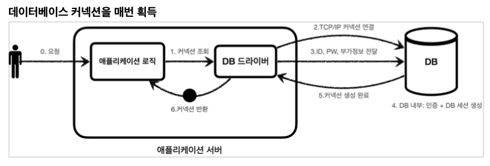

이전에 알아보았던 `DriverManager.getConnection(...)`을 통한 커넥션 생성은 항상 새로운 커넥션을 생성한다.  
이런 비효율적인 작업을 **Connection Pool을 통해 개선할 수 있다.**  
하지만 Connection Pool을 사용해서 Connection을 얻어오는 방법과 DriverManager를 사용해서 Connection을 얻어오는 방법이 서로 다를 수 있기에 자바는 **Connection을 획득하는 방법을 추상화 시킬 수 있는 `javax.sql.DataSource` 인터페이스를 제공한다.**  
JDBC API처럼 드라이버 공급업체에서 해당 DataSource 인터페이스를 구현해놓았다.  
  
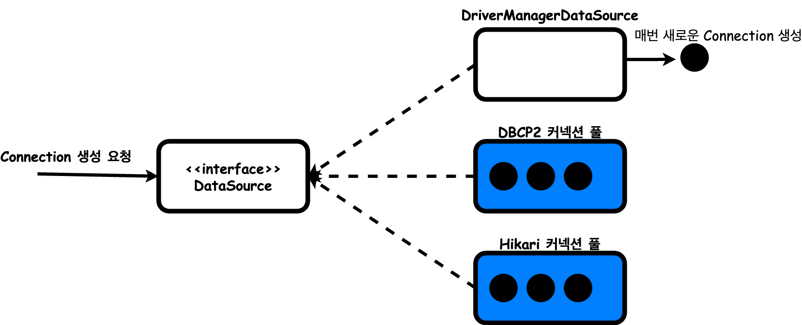

```java
    @Test
    void dataSourceDriverManager() throws SQLException {
        DataSource dataSource = new DriverManagerDataSource(URL, USERNAME, PASSWORD);
        
        useDataSource(dataSource);
    }

    @Test
    void dataSourceConnectionPool() throws SQLException {
        HikariDataSource dataSource = new HikariDataSource();
        dataSource.setJdbcUrl(URL);
        dataSource.setUsername(USERNAME);
        dataSource.setPassword(PASSWORD);
        dataSource.setMaximumPoolSize(10);
        dataSource.setPoolName("My Pool!!!");

        useDataSource(dataSource);
    }

    private void useDataSource(DataSource dataSource) throws SQLException {
        Connection con1 = dataSource.getConnection();
        Connection con2 = dataSource.getConnection();
        ...
    }
```

```
// DrivetManager를 통한 요청할 때마다 Connection 새로 생성
[main] DEBUG o.s.j.d.DriverManagerDataSource -- Creating new JDBC DriverManager Connection to [..]
[main] DEBUG o.s.j.d.DriverManagerDataSource -- Creating new JDBC DriverManager Connection to [..]

// HikariCP 초기화를 위한 Connection 생성
[main] INFO  com.zaxxer.hikari.pool.HikariPool -- My Pool!!! - Added connection conn0: ...
[connection adder] DEBUG ...HikariPool -- My Pool!!! - Added connection conn1: ...
[connection adder] DEBUG ...HikariPool -- My Pool!!! - Added connection conn2: ...
[connection adder] DEBUG ...HikariPool -- My Pool!!! - Added connection conn3: ...
[connection adder] DEBUG ...HikariPool -- My Pool!!! - Added connection conn4: ...
[connection adder] DEBUG ...HikariPool -- My Pool!!! - Added connection conn5: ...
[connection adder] DEBUG ...HikariPool -- My Pool!!! - Added connection conn6: ...
[connection adder] DEBUG ...HikariPool -- My Pool!!! - Added connection conn7: ...
[connection adder] DEBUG ...HikariPool -- My Pool!!! - Added connection conn8: ...
[connection adder] DEBUG ...HikariPool -- My Pool!!! - Added connection conn9: ...
```

이 추상화 덕분에 클라이언트 입장에서는 인터페이스에만 의존하기 때문에 Connection을 반환하는 DataSource의 구현체가 변경되어도 상관없다.  

# 스프링 서비스 추상화

Connection에 대한 추상화를 통해 데이터베이스 의존성에 대한 결합도가 약해졌지만 아직 문제가 있다.  

3. 데이터 접근 기술(JDBC, JPA...)마다 다른 트랜잭션 사용 방법은 어떻게 통일할 수 있을까? → **트랜잭션 추상화**
1. 애플리케이션의 서비스 로직에 DB 트랜잭션 경계 설정을 사용하기 위해서는 어떻게 해야 할까? → **리소스 동기화**
2. 반복되는 JDBC API 코드는 어떻게 해결할 수 있을까? → **트랜잭션 AOP**

스프링은 이미 모두 해결해놓았다.

## 트랙잭션 추상화

Spring 프레임워크는 트랜잭션 관리를 위한 일관된 추상화를 제공한다. 대표적인 인터페이스들을 알아보자.  
트랜잭션 상태를 질의할 수 있고 트랜잭션 Commit,Rollback에 사용되는 `TransactionStatus` 인터페이스를 제공한다.  

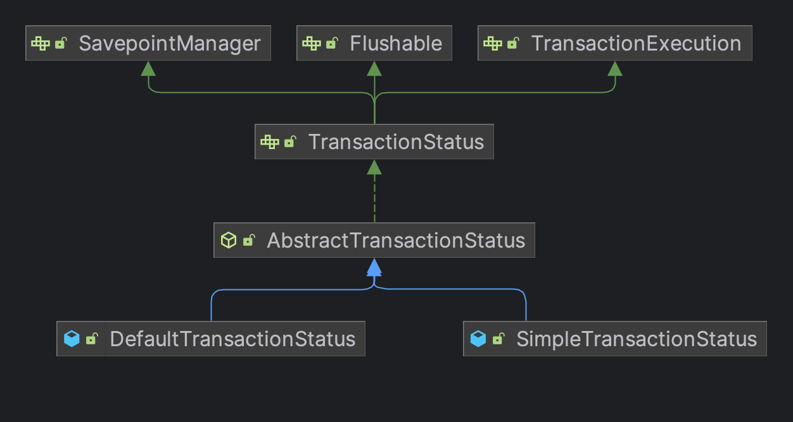

그리고 DataSource와 TransactionStatus를 사용하는 `PlatformTransactionManager` 인터페이스를 제공한다.  
`org.springframework.transaction.PlatformTransactionManager` 인터페이스는 명령형 트랜잭션 관리를 위한   트랜잭션 추상화의 핵심이다.  
(반응형을 위한 ReactiveTransactionManager 인터페이스도 존재한다.)  
  
```java
public interface PlatformTransactionManager extends TransactionManager {

    TransactionStatus getTransaction(TransactionDefinition definition) 
        throws TransactionException;
    void commit(TransactionStatus status) throws TransactionException;
    void rollback(TransactionStatus status) throws TransactionException;
}
```

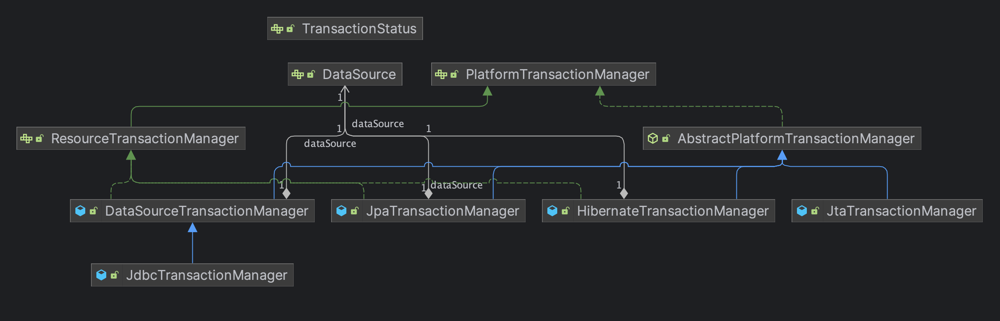
  
## 리소스 동기화

스프링은 Connection 동기화를 위해 `ThreadLocal`을 사용하는 **TransactionSynchronizationManager** 를 제공한다.  
AbstractPlatformTransactionManager와 이 추상 클래스를 상속하고 있는 하위 클래스는 템플릿 메서드 패턴으로 협력하며, TransactionSynchronizationManager를 이용한다.  
  
```java
public class MemberService {

    private final PlatformTransactionManager transactionManager;

    public void accountTransfer(String fromId, String toId, int money) {
        // TransactionStatus를 생성하면서 트랜잭션을 시작한다.
        TransactionStatus status = transactionManager.getTransaction(
            new DefaultTransactionDefinition()
        );

        try {
            bizLogic(fromId, toId, money);
            transactionManager.commit(status);
        } catch (Exception e) {
            transactionManager.rollback(status);
            throw new IllegalStateException(e);
        }
    }
    ...
}
```

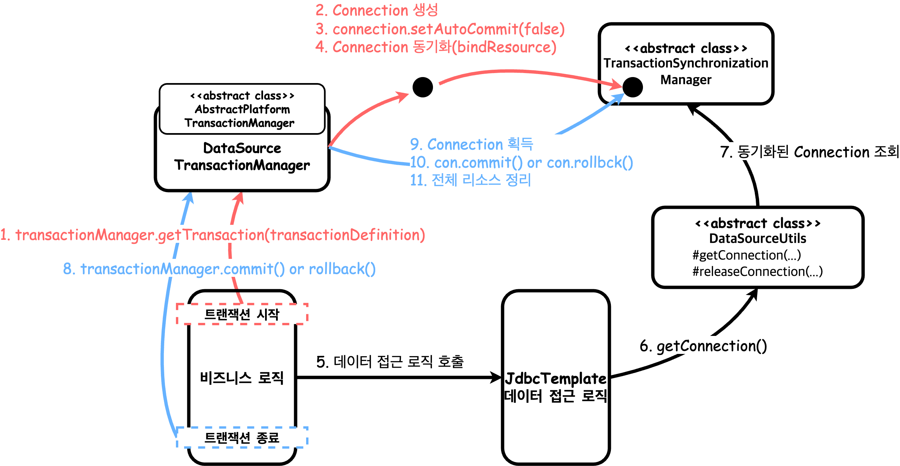

> `DataSourceUtils.getConnection()` : TransactionSynchronizationManager가 관리하는 Connection이 있으면 해당 Connection을 반환한다. 없으면 생성해서 반환한다.  
> `DataSourceUtils.releaseConnection()` : 동기화된 Connection은 닫지 않고, 동기화되지 않은 Connection은 닫아버린다.

## 트랜잭션 AOP

서비스 추상화를 통해 유연해졌고, 트랜잭션 동기화 매니저를 통해 Connection도 동기화하였다.  
하지만 아직 서비스 계층에서 트랜잭션 관련 코드가 남아있는데, 이 문제를 `@Transacitonal`을 통해 해결할 수 있다.  
일반적으로 데이터베이스, 트랜잭션 관련 API를 직접 사용하는 것보다 Spring 추상화를 통한 작업이 훨씬 더 유연하기 때문에 DataSourceUtils나 다른 헬퍼 클래스 사용을 자제하는 것이 좋다.  

```java
// [4]
public interface Service {
    // [3]
    void method1();
    // [3]
    void method2();
}

// [2]
public class ServiceImpl implements Service {
    // [1]
    public void method1(){ ... }
    // [1]
    public void method2() { ... }
}
```

`@Transactional`을 적용할 때 **4단계의 대체정책** 을 이용한다.  
타깃 오브젝트의 메소드 → 타깃 클래스 → 선언 메소드 → 선언 클래스(또는 인터페이스)의 순서에 따라서 적용됐는지 차례대로 확인하고,
가장 먼저 발견되는 속성정보를 사용하게된다.  
그리고 `public`으로 정의된 메서드만 트랜잭션이 걸리게 스프링이 제한해놓았다.  
  
이 AOP를 적용하기 위해 아래의 클래스가 제공된다.  
1. **어드바이저** : `BeanFactoryTransactionAttributeSourceAdvisor`
2. **포인트컷** : `TransactionAttributeSourcePointcut`
3. **어드바이스** : `TransactionInterceptor`

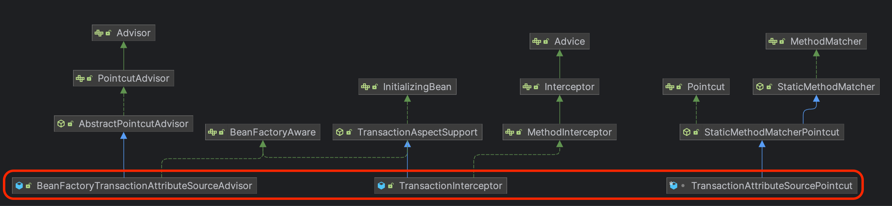

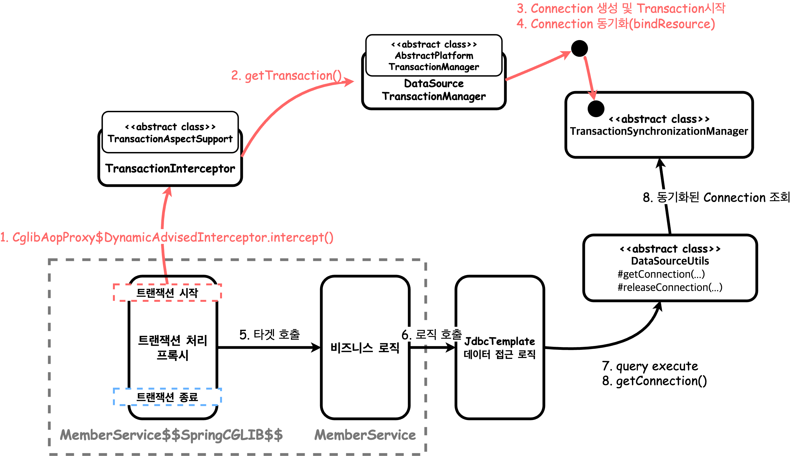

Spring AOP 덕분에 비즈니스 로직까지 모두 해결하였다. 프록시 생성에 대한 자세한 내용은 [빈 후처리기를 이용한 프록시 생성에 대해](https://jdalma.github.io/2024y/postprocessor/#%EB%B9%88-%ED%9B%84%EC%B2%98%EB%A6%AC%EA%B8%B0%EB%A5%BC-%EC%9D%B4%EC%9A%A9%ED%95%9C-%EC%9E%90%EB%8F%99-%ED%94%84%EB%A1%9D%EC%8B%9C-%EC%83%9D%EC%84%B1%EA%B8%B0)를 참고하자.

***

# Spring 6.1 이전 읽기/쓰기 분리

JDBC부터 스프링이 Connection을 가져오는 방법을 추상화한 것과 ThreadLocal + TransactionSynchronizationManager를 통해 리소스 동기화를 하는 방법 그리고 스프링 AOP를 통해 트랜잭션 관련 로직과 비즈니스 로직을 완벽히 분리해내는 것까지 알아보았다.  
이제 본론으로 돌아가서 읽기/쓰기 분리한 방법에 대해 알아보자.  
테스트 환경은 Spring Boot 3.2.2, 도커 컨테이너로 직접 실행한 MySQL 컨테이너 2개, JdbcTemplate을 사용하였다.  
자세한 예제는 [datasource-routing-test](https://github.com/jdalma/datasource-routing-test)에서 확인할 수 있다.  

```yml
spring:
  datasource:
    primary:
      driverClassName: com.mysql.cj.jdbc.Driver
      jdbcUrl: jdbc:mysql://localhost:3306/test
      username: root
      password: root
    secondary:
      driverClassName: com.mysql.cj.jdbc.Driver
      jdbcUrl: jdbc:mysql://localhost:3307/test
      username: root
      password: root
```

```kotlin
@Configuration
class ReplicationDataSourceConfig {
    @Bean
    @Primary
    @DependsOn("primaryDataSource", "secondaryDataSource", "routingDataSource")
    fun dataSource(): DataSource = LazyConnectionDataSourceProxy(routingDataSource())

    @Bean
    fun routingDataSource(): DataSource = RoutingDataSource(primaryDataSource(), secondaryDataSource())

    @Bean
    @ConfigurationProperties(prefix = "spring.datasource.primary")
    fun primaryDataSource(): DataSource {
        return DataSourceBuilder.create().build()
    }

    @Bean
    @ConfigurationProperties(prefix = "spring.datasource.secondary")
    fun secondaryDataSource(): DataSource {
        return DataSourceBuilder.create().build()
    }
}
```

각 DB로 라우팅 역할을 하는 `RoutingDataSource`에 primary, secondary DataSource를 주입하고 `LazyConnectionDataSourceProxy`로 감싼 DataSource를 `@Primary`로 등록한다.  

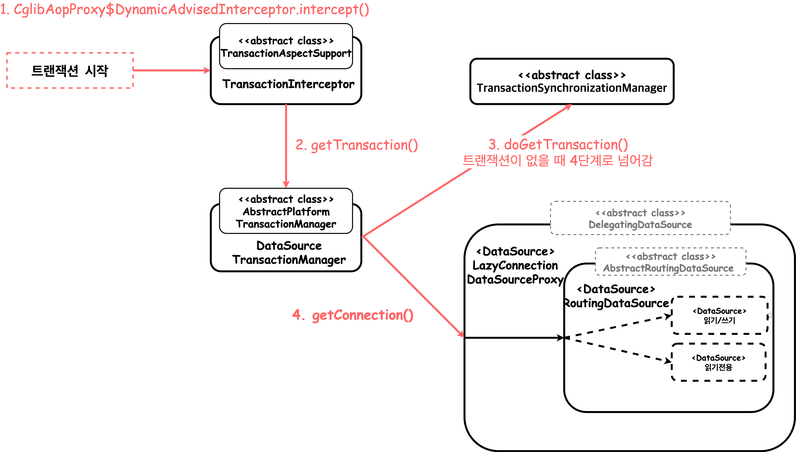

대략적인 구조는 위와 같다.  
일반적인 경우에는 `4. getConnection()`에서 반환되는 것이 `java.sql.Connection`의 구현체가 반환되지만 현재 기본 DataSource로 등록된 `LazyConnectionDataSourceProxy.getConnection()`을 사용하면 Proxy를 반환한다.  
  
> **LazyConnectionDataSourceProxy.getConnection()**  
> Statement(또는 PreparedStatement나 CallableStatement)에 대한 요청이 있을 때 실제 JDBC Connection을 느리게 가져오는 Connection 핸들을 반환합니다.  
> 반환된 Connection 핸들은 ConnectionProxy 인터페이스를 구현하여 기본 대상 Connection을 검색할 수 있습니다.  

```java
public class LazyConnectionDataSourceProxy extends DelegatingDataSource {
    
    @Override
    public Connection getConnection() throws SQLException {
        checkDefaultConnectionProperties();
        return (Connection) Proxy.newProxyInstance(
            ConnectionProxy.class.getClassLoader(),
            new Class<?>[] {ConnectionProxy.class},
            new LazyConnectionInvocationHandler()
        );
    }
    ...
}
```

어떤 흐름으로 사용할 Connection을 선택하는지 확인해보자.

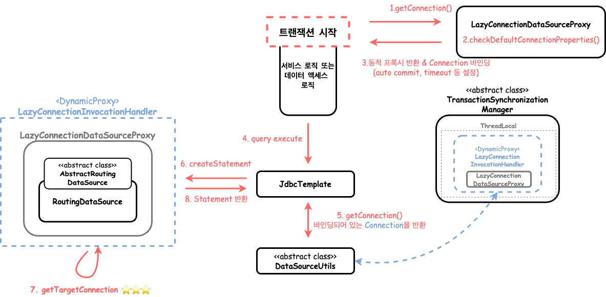


> 1번부터 3번까지의 자세한 행위는 [이 이미지](https://jdalma.github.io/static/5233d78fec13777390de802c6374de46/64ef0/lazyConnection.png)와 같다.

1. 커넥션을 요청한다.
2. 메소드에서 targetDataSource의 Connection을 통해 DB 세션의 자동 커밋 유무와 트랜잭션 격리수준을 저장한다. 이때 최초 Connection을 생성(커넥션 풀 준비)한다.
3. ConnectionProxy를 구현한 타겟 클래스를 `LazyConnectionInvocationHandler` 구현체로 동적 프록시를 생성하여 Connection 타입으로 반환하며 Connection을 바인딩한다.
4. 데이터 로직 처리에서 Query를 실행한다.
5. 바인딩되어 있는 Connection을 조회하여 반환한다.
6. 반환받은 Connection으로 Statement를 요청한다.
7. RoutingDataSource를 생성할 때 `setTargetDataSources()`를 통해 정의해놓은 `resolvedDataSources`필드인 라우팅 맵을 이용하여 사용할 Connection을 조회한다.

`2번`단계는 Connection이 최초 사용되는 경우라면 LazyConnectionDataSourceProxy의 auto-commit 유무와 격리수준 레벨을 세팅하기 위한 Connection을 최초로 생성하는 과정이 발생한다.  
이때 구현 드라이버에 따라 Connectipn Pool이 준비되고 바인딩된다.  
이 targetDataSource는 내가 커스텀한 RoutingDataSource가 주입되어 있으며 `determineCurrentLookupKey()`를 통해 readonly가 아닌 경우에는 항상 primary DB를 사용하도록 하여서 primary HikariCP가 먼저 준비된다.  
  
일반적인 경우에는 `3번`단계에서 바인딩되는 DataSource는 사용할 DataSource 구현체 자체가 저장되지만, LazyConnectionDataSourceProxy로 래핑된 DataSource를 저장하여 **Statement를 생성할 때 등록된 DataSource 라우팅을 통해 결정하는 것이 핵심이다.**  
  
즉, **`7번`에서 LazyConnectionDataSourceProxy$LazyConnectionInvocationHandler.getConnection()을 통한 determineTargetDataSource() 메서드에서 RoutingDataSource가 오버라이딩한 `determineCurrentLookupKey()` 메소드를 실행시켜 어떤 DataSource를 사용할지 query가 실행되어 실제로 Connection이 필요한 경우에 결정하는 것이다.**  

# DataSource router not initialized 예외 발생

조금 더 깔끔하게 작성하고 싶어 DataSource를 등록할 때 `LazyConnectionDataSourceProxy`와 `RoutingDataSource`를 한 번에 등록하면 아래와 같이 예외가 발생한다.  

```kotlin
@Configuration
class ReplicationDataSourceConfig {
    @Bean
    @Primary
    @DependsOn("primaryDataSource", "secondaryDataSource")
    fun routingDataSource(): DataSource = LazyConnectionDataSourceProxy(
        RoutingDataSource(primaryDataSource(), secondaryDataSource())
    )

    ...
}
```

```
java.lang.IllegalArgumentException: DataSource router not initialized
...lookup.AbstractRoutingDataSource.determineTargetDataSource(AbstractRoutingDataSource.java:255)
...lookup.AbstractRoutingDataSource.getConnection(AbstractRoutingDataSource.java:213)
...LazyConnectionDataSourceProxy.checkDefaultConnectionProperties(LazyConnectionDataSourceProxy.java:212)
```

원인은 RoutingDataSource가 상속받은 `AbstractRoutingDataSource`의 `resolvedDataSource` 필드가 초기화되지 않아 발생한 문제다.  
초기화되는 시점은 `InitializingBean` 인터페이스를 통한 `afterPropertiesSet()` 시점에 (RoutingDataSource 초기화 시점에 정의한) `targetDataSource`를 복사하여 `resolvedDataSource`를 초기화한다.  
  
[Interface BeanFactory](https://docs.spring.io/spring-framework/docs/current/javadoc-api/org/springframework/beans/factory/BeanFactory.html)를 보면 BeanFactory의 12번째 단계에서 `afterPropertiesSet()`를 호출하여 준다.  
즉, **AbstractRoutingDataSource를 상속한 RoutingDataSource 자체가 Bean으로 정의되지 않아 BeanFactory를 통한 초기화 과정이 생략되었기에 위와 같은 예외가 발생하는 것이다.**  
그렇기에 꼭 Bean으로 등록해주여야 한다.  

# Spring 6.1 이후 추가된 읽기/쓰기 분리 개선

이번에 Spring 6.1.2 부터 `setReadOnlyDataSource()` 메소드가 추가되었으며, 자세한 히스토리는 아래의 이슈 내용을 확인하길 바란다.  
- [#31785 Support for a read-only DataSource in LazyConnectionDataSourceProxy](https://github.com/spring-projects/spring-framework/issues/31785)  
- [#21415 Document LazyConnectionDataSourceProxy setup for routing datasource to act on transaction definition read-only flag](https://github.com/spring-projects/spring-framework/issues/21415)  
  
이전에 사용했던 읽기/쓰기 분리 기준을 정의해 놓았던 `RoutingDataSource`는 필요하지 않고 아래와 같이 작성하면 끝이다.  

```kotlin
@Configuration
class ReplicationDataSourceConfig {
    @Bean
    @Primary
    @DependsOn("primaryDataSource", "secondaryDataSource")
    fun dataSource(): DataSource = LazyConnectionDataSourceProxy(primaryDataSource()).apply {
        setReadOnlyDataSource(secondaryDataSource())
    }
}
```

Connection을 생성할 DataSource를 결정할 때 추가된 `getDataSourceToUse()` 메소드로 가져오게 된다.  

```java
public class LazyConnectionDataSourceProxy extends DelegatingDataSource {
    private DataSource readOnlyDataSource;
    ...

    private class LazyConnectionInvocationHandler implements InvocationHandler {
        private boolean readOnly = false;

        private DataSource getDataSourceToUse() {
            return (this.readOnly && readOnlyDataSource != null ? 
                readOnlyDataSource : obtainTargetDataSource()
            );
        }
        ...
    }
}
```

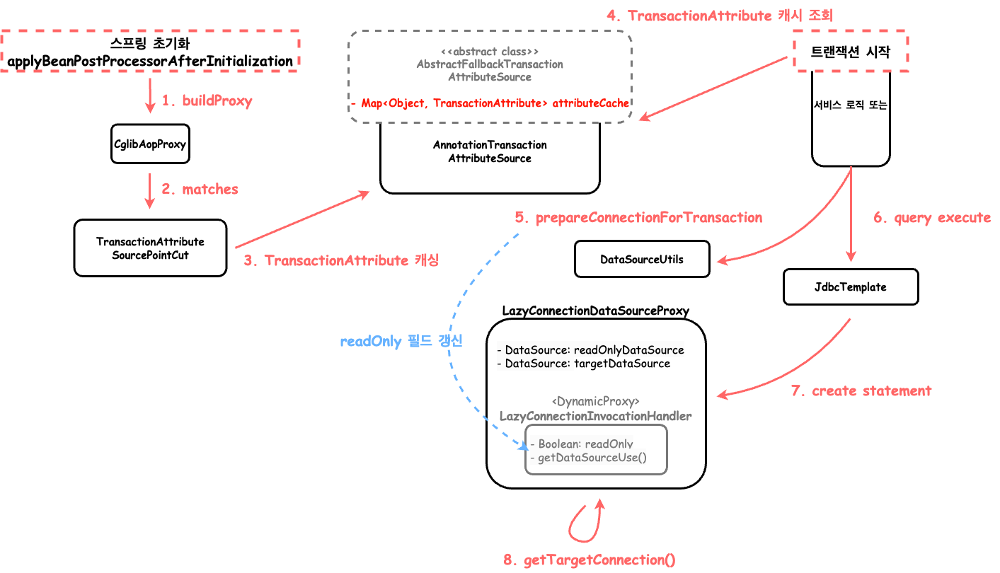

`1 ~ 3번`은 스프링이 초기화하면서 `SpringTransactionAnnotationParser`에서 `TransactionAttribute`를 생성하며 생성에 성공한다면 해당 `TransactionAttribute`를 캐싱한다.  
캐싱되는 내용은 간략하게 아래와 같다. 자세한 내용은 [SpringTransactionAnnotationParser #L59](https://github.com/spring-projects/spring-framework/blob/main/spring-tx/src/main/java/org/springframework/transaction/annotation/SpringTransactionAnnotationParser.java#L59)를 확인하면 된다.  
`4 ~ 5번`은 캐시되어 있는 `TransactionAttribute` 목록에서 현재 실행되고 있는 메소드 또는 클래스 기준으로 캐시 정보를 조회하며, 준비 작업을 한다.  
이때 `LazyConnectionDataSourceProxy`의 `readonly` 속성을 `TransactionAttribute` 기준으로 업데이트 해준다.  

> TransactionAttribute에는 Transaction의 격리 수준, 전파 속성, **읽기 전용 유무** , 타임아웃, 롤백할 클래스 이름 등이 저장되어 있다.  
> 한마디로 `@Transactional`에서 기입할 수 있는 정보들을 묶어 놓은 것이다.

```
{MethodClassKey@10042} "...MemberService.findAllPrimary() -> 
    {RuleBasedTransactionAttribute@10043} "PROPAGATION_REQUIRED,ISOLATION_DEFAULT"
{MethodClassKey@9559} "...MemberService.findAllSecondary() -> 
    {RuleBasedTransactionAttribute@9560} "PROPAGATION_REQUIRED,ISOLATION_DEFAULT,readOnly"
```

`7번`의 동적 프록시 `LazyConnectionInvocationHandler`는 매 요청마다 매번 새로 생성된다.  
`8번` 과정에서 DataSource를 가져올 때 `readOnly`와 `readOnlyDataSource` 유무를 기준으로 어떤 DataSource를 사용할지 결정된다.  
  
즉, **`readOnlyDataSource` 관리를 `LazyConnectionDataSourceProxy`가 해주면서 추가적인 작업이 필요없어졌다.**  
만약 readonly 힌트로 라우팅할 것이 아니라면 이전 방법처럼 `determineCurrentLookupKey()`를 오버라이딩해야 한다.  

# 참고

1. [JDBC Architecture Overview](https://etutorials.org/SQL/Postgresql/Part+II+Programming+with+PostgreSQL/Chapter+13.+Using+PostgreSQL+from+a+Java+Client+Application/JDBC+Architecture+Overview/)
1. [Introduction to JDBC](https://www.baeldung.com/java-jdbc)
2. [Loading JDBC Drivers](https://www.baeldung.com/java-jdbc-loading-drivers)
3. [[10분 테코톡] 코코닥의 JDBC](https://www.youtube.com/watch?v=ONYVhJGl48U&ab_channel=%EC%9A%B0%EC%95%84%ED%95%9C%ED%85%8C%ED%81%AC)
4. [JDBC Connection 에 대한 이해, HikariCP 설정 팁](https://jiwondev.tistory.com/291)
5. [스프링 DB 1편 - 데이터 접근 핵심 원리](https://www.inflearn.com/course/%EC%8A%A4%ED%94%84%EB%A7%81-db-1)
6. [Synchronizing Resources with Transactions](https://docs.spring.io/spring-framework/reference/data-access/transaction/tx-resource-synchronization.html)
7. [Understanding the Spring Framework Transaction Abstraction](https://docs.spring.io/spring-framework/reference/data-access/transaction/strategies.html#page-title)