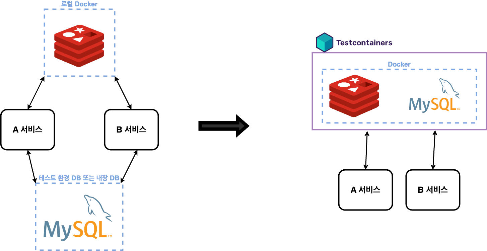

CI/CD를 고민하면서 서로 의존 관계에 있는 서비스들은 통합 테스트를 어떻게 진행할지 생각해본적이 있다.  


위의 그림에서 **A 서비스** 를 수정하고 배포한다고 가정할 때 통합 테스트 환경에서 사용자의 요청을 처리하기 위해 이해관계에 놓여있는 B 서비스는 모킹으로 처리하고 DB는 내장 DB를 사용하거나 모킹으로 처리할 것이다.  
개인적으로 모킹을 좋아하지 않는다. 필요하다면 모킹을 사용하긴 하지만 모킹 라이브러리를 추가하지 않기 위해 추상 계층, 위임을 활용하는 편이다.  
실제 실행환경이 아니기 때문에 신뢰가 가지 않는다고 생각한다.  
  
이번에 [리팩토링](https://jdalma.github.io/2024y/refactoring/refactoring1)을 진행하면서 통합 테스트를 작성하게 되었는데, 위와 같은 고민을 해소해주는 **Testcontainers** 를 접하게 되었다.  
  
# Testcontainers란?

- 출처: [What is Testcontainers, and why should you use it?](https://testcontainers.com/guides/introducing-testcontainers/), [What is Testcontainers](https://testcontainers.com/getting-started/)

> 단위 테스트는 데이터베이스, 메시징 시스템 등과 같은 외부 서비스와 분리하여 비즈니스 로직 및 구현 세부 사항을 테스트하는 데 도움이 되지만, 애플리케이션 코드의 대부분은 여전히 이러한 외부 서비스와 통합되어 있을 수 있습니다.  
> **애플리케이션에 대한 완전한 확신을 가지려면 단위 테스트와 함께 통합 테스트를 작성하여 애플리케이션이 완벽하게 작동하는지 확인해야 합니다.**  
> 테스트 컨테이너는 데이터베이스, 메시지 브로커 등과 같은 **애플리케이션 종속성을 Docker 컨테이너에서 실행하여 이러한 문제를 해결하고 실제 서비스와 대화하고 테스트 코드에 프로그래밍 방식의 API를 제공함으로써 안정적이고 반복 가능한 테스트를 실행할 수 있도록 도와줍니다.**  

테스트를 실행하는 환경에서 아래의 세 개 중 한 개만 준비되어 있으면 사용 가능하다.

1. Docker Desktop
2. Docker Engine on Linux
3. Testcontainers Cloud

흐름은 세 단계로 나뉜다.  


1. **테스트 실행 전**: 테스트 컨테이너 API를 사용하여 필요한 서비스(데이터베이스, 메시징 시스템 등)를 Docker 컨테이너로 시작한다.
2. **테스트 실행 중**: 이러한 컨테이너화된 서비스를 사용하여 테스트를 실행한다.
3. **테스트 실행 후**: 테스트가 성공적으로 실행되었는지 또는 실패가 있었는지 여부에 관계없이 Testcontainers가 컨테이너를 파기한다.

즉, **Dokcer 컨테이너를 코드 레벨에서 제어하여 테스트의 생명 주기에 맞게 컨테이너를 생성하고 종료하는 것이다.**  
현재 사내에서는 내부 Docker 레지스트리를 구축하여 모든 애플리케이션과 인프라를 이미지로 관리하고 있기 때문에 적용하기에 알맞다고 생각했다.  

# Testcontainers 사용해보기

기존에는 필요한 인프라를 로컬에 Docker 컨테이너를 직접 실행시켜놓고 애플리케이션의 프로파일을 `local`, `test` 등으로 구분하여 사용 중이였다.  
먼저 local 테스트 환경에서 세션을 관리하는 Redis를 아래의 그림과 같이 Testcontainer를 적용해 보았다.  



## Redis 컨테이너 생성하기

```kotlin
// [3]
class RedisTestContainers: ApplicationContextInitializer<ConfigurableApplicationContext> {

    override fun initialize(applicationContext: ConfigurableApplicationContext) {
        redis.start()

        val redisContainerIP = "spring.redis.host=${redis.host}"
        val redisContainerPort = "spring.redis.port=${redis.getMappedPort(REDIS_PORT)}" // [2]

        TestPropertySourceUtils.addInlinedPropertiesToEnvironment(
            applicationContext,
            redisContainerIP,
            redisContainerPort
        )
    }

    companion object {
        private const val REDIS_IMAGE = "redis:latest"
        private const val REDIS_PORT = 6379
        private val redis = RedisContainer(DockerImageName.parse(REDIS_IMAGE))
            .withExposedPorts(REDIS_PORT) // [1]
    }
}
```

- `[1]` : Redis의 이미지 정보와 Redis의 컨테이너 내부 포트를 지정한다.
- `[2]` : Testcontainers를 통하여 컨테이너를 실행시키면 호스트의 **랜덤 포트**로 컨테이너가 실행되기 때문에 Property를 동적으로 변경하기 위함이다.
- `[3]` : `[2]`번을 수행하기 위한 훅을 제공하는 콜백 인터페이스인 `ApplicationContextInitializer`를 구현하였다.
  - ApplicationContext가 준비되고 빈 정의가 로드되기 전에 ApplicationContextInitializer가 호출된다. 
  - [Application Events and Listeners](https://docs.spring.io/spring-boot/docs/current/reference/html/features.html#features.spring-application.application-events-and-listeners), [TestPropertySourceUtils](https://www.baeldung.com/spring-tests-override-properties#testPropertySourceUtils)

## MySQL 컨테이너 생성하기

```kotlin
class MysqlTestContainer: ApplicationContextInitializer<ConfigurableApplicationContext> {

    override fun initialize(applicationContext: ConfigurableApplicationContext) {
        mysql.start()

        // [1]
        val primaryUrl = "spring.datasource.primary.jdbc-url=${mysql.jdbcUrl}"
        val primaryUsername = "spring.datasource.primary.username=${mysql.username}"
        val primaryPassword = "spring.datasource.primary.password=${mysql.password}"

        val secondaryUrl = "spring.datasource.secondary.jdbc-url=${mysql.jdbcUrl}"
        val secondaryUsername = "spring.datasource.secondary.username=${mysql.username}"
        val secondaryPassword = "spring.datasource.secondary.password=${mysql.password}"

        TestPropertySourceUtils.addInlinedPropertiesToEnvironment(
            applicationContext,
            primaryUrl,
            primaryPassword,
            primaryUsername,
            secondaryUrl,
            secondaryPassword,
            secondaryUsername
        )
    }

    companion object {
        private const val MYSQL_IMAGE = "mysql:8"
        private const val MYSQL_PORT = 3306
        private val mysql = MySQLContainer<Nothing>(MYSQL_IMAGE).apply {
            this.withExposedPorts(MYSQL_PORT)
            this.withInitScript("init.sql")     // [2] src/test/resources/init.sql
            this.withUsername("test")
            this.withPassword("test")
            this.withDatabaseName("testdatabase")
        }
    }
}
```

Redis 컨테이너 생성과 비슷하지만 다른 점은
- `[1]` : 테스트를 작성하는 애플리케이션은 읽기와 쓰기를 분리하는 환경이라서 primary와 secondary를 각각 지정하였다.
- `[2]` : 테스트에 필요한 스키마와 데이터를 준비하는 SQL문이 정의된 파일이다.

## 통합 테스트 실행

```kotlin
@SpringBootTest("spring.profiles.active=local")
@AutoConfigureMockMvc
@ContextConfiguration(initializers = [RedisTestContainer::class, MysqlTestContainer::class])
class IntegrationTest: FunSpec() {

    @Autowired
    private lateinit var redisTemplate: StringRedisTemplate
    @Autowired
    private lateinit var mockMvc: MockMvc

    private val key = "spring:session:sessions:expires:test"
    private val value = "{\"username\":\"hjjeong\"}"
    private val cookie = Cookie("SESSION", "test")

    init {
        extension(SpringExtension)

        beforeSpec {
            redisTemplate.opsForValue().set(key, value)
        }

        test("GET ...") {
            val mvcResult = mockMvc.perform(MockMvcRequestBuilders.get("{url}").cookie(cookie))
                .andExpect { status().isOk }
                .andDo(MockMvcResultHandlers.print())
                .andReturn()
            // ...
        }
    }
}
```

위의 `test`를 실행하면 Redis 컨테이너와 MySQL 컨테이너가 실행되고 테스트가 실행되기 전에 세션을 준비하고 통합 테스트가 실행된다.  


컨테이너/네트워크/볼륨/이미지를 제거할 수 있도록 도와주는 `ryuk` 컨테이너와 지정한 `redis`, `mysql` 컨테이너가 생성되었다.  
host 포트는 모두 랜덤 포트로 생성된 것을 확인할 수 있다.  
  
로그도 확인해보자.  
  
```
-- 스프링 테스트 로그 --
org.testcontainers.DockerClientFactory   : Docker host IP address is localhost
org.testcontainers.DockerClientFactory   : Connected to docker: 
  Server Version: 24.0.2
  API Version: 1.43
  Operating System: Docker Desktop
  Total Memory: 7851 MB
Container testcontainers/ryuk:0.6.0 is starting
Container testcontainers/ryuk:0.6.0 started in PT1.175S
Ryuk started - will monitor and terminate Testcontainers containers on JVM exit
Checking the system...
✔︎ Docker server version should be at least 1.6.0
Creating container for image: redis:latest
Container redis:latest is starting
Container redis:latest started in PT0.206S
Creating container for image: mysql:8
Container mysql:8 is starting
Waiting for database connection to become available at jdbc:mysql://localhost:61593/testdatabase using query 'SELECT 1'
Container mysql:8 started in PT7.378S
Container is started (JDBC URL: jdbc:mysql://localhost:61593/testdatabase)
Executing database script from init.sql
Executed database script from init.sql in 157 ms.

-- 도커 이벤트 로그 --
container create (image=testcontainers/ryuk:0.6.0 ...)
network connect (name=bridge, type=bridge)
container start (image=testcontainers/ryuk:0.6.0 ...)
volume create (driver=local)
container create (image=redis:latest ...)
network connect (name=bridge, type=bridge)
volume mount (destination=/data, driver=local, propagation=, read/write=true)
container start (image=redis:latest ...)

[테스트 진행]

container kill (image=testcontainers/ryuk:0.6.0 ...)
container kill (image=redis:latest ...)
network disconnect (name=bridge, type=bridge)
volume unmount (driver=local)
container die (image=redis:latest ...)
volume destroy (driver=local)
container destroy (image=redis:latest ...)
network disconnect (name=bridge, type=bridge)
container die (image=testcontainers/ryuk:0.6.0 ...)
container destroy (image=testcontainers/ryuk:0.6.0 ...)
```

컨테이너 생성 후 초기 SQL 스크립트가 실행되고 테스트가 끝나면 컨테이너가 소멸되는 것들을 볼 수 있다.  

# 정리

테스트 코드로 필요한 Docker 컨테이너를 생성하여 운영과 동일한 환경에서 테스트가 가능한 것을 확인할 수 있다.  
이 글에서는 Redis와 MySQL을 대체하였지만 **실제 의존하고 있는 서비스들을 컨테이너로 실행시켜서 운영과 동일한 환경을 세팅하여 테스트를 진행할 수 있다는 것이 큰 장점으로 보인다.**  
테스트가 전혀 작성되어 있지 않은 환경에서 Testcontainers를 적용해보았다. 팀원들을 설득시키기 충분할 정도로 강력한 도구로 보이며 다음에는 Testcontainers를 적용한 실제 통합 테스트 작성기를 쓰도록 노력해봐야겠다.  
  
사용 사례는 [컬리의 TestContainers로 유저시나리오와 비슷한 통합테스트 만들어 보기](https://helloworld.kurly.com/blog/delivery-testContainer-apply/)를 참고하라.  
  