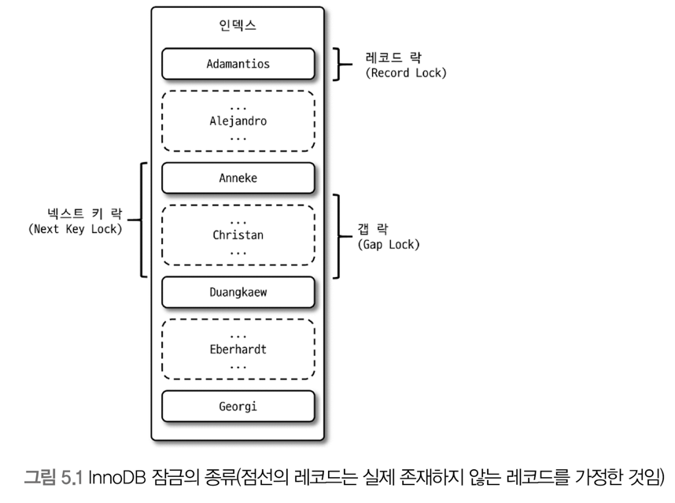
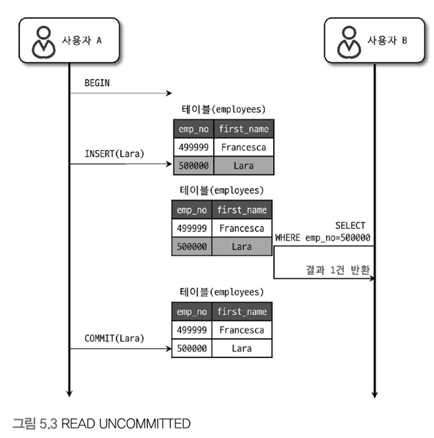
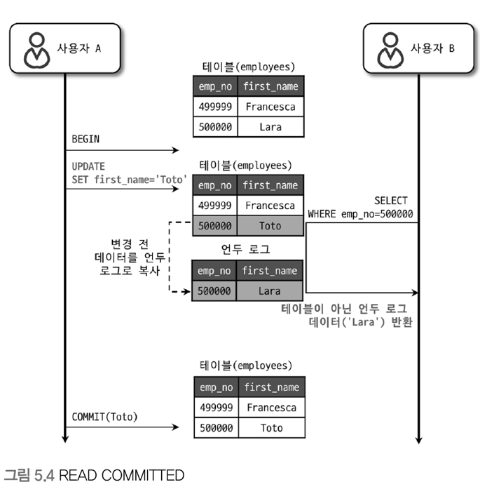
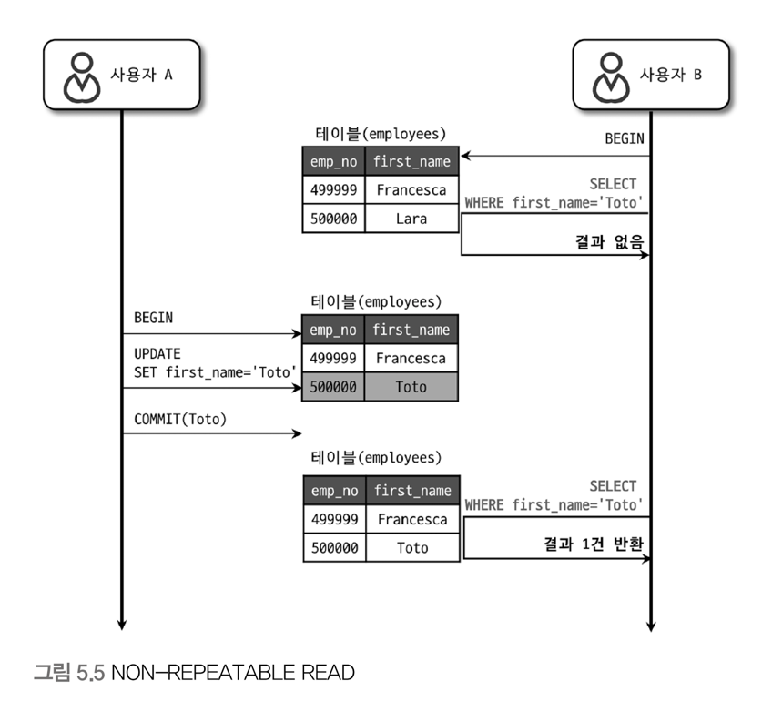
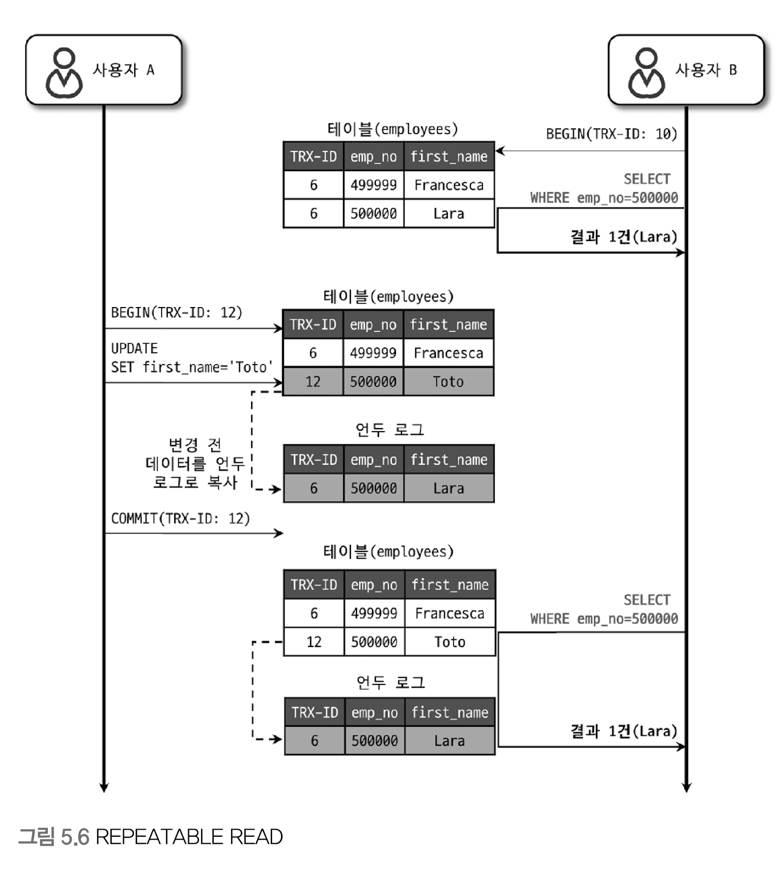
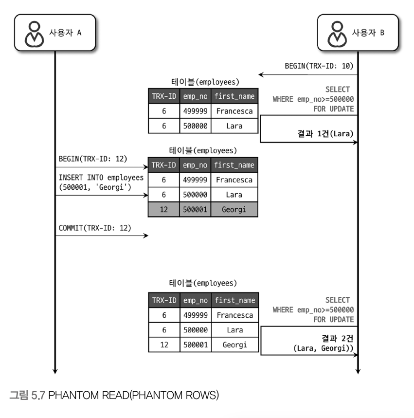

- **[InnoDB Locking](https://dev.mysql.com/doc/refman/8.0/en/innodb-locking.html)**
- **[Dirty read, Non-repeatable read, and Phantom read](https://jennyttt.medium.com/dirty-read-non-repeatable-read-and-phantom-read-bd75dd69d03a)**

# 트랜잭션

트랜잭션은 **작업의 완전성을 보장 (COMMIT, ROLLBACK)** 해주는 것이다.  
즉 논리적인 작업 셋을 모두 완벽하게 처리하거나 처리하지 못할 경우에는 원 상태로 복구해서 작업의 일부만 적용되는 현상(Partial update)이 발생하지 않게 만들어주는 기능이다.  
  
- **트랜잭션** : 데이터의 정합성을 보장하기 위한 기능
- **잠금** : 동시성을 제어하기 위한 기능
- **격리 수준** : 하나의 트랜잭션 내에서 또는 여러 트랜잭션 간의 작업 내용을 어떻게 공유하고 차단할 것인지 결정하는 레벨
  
이 트랜잭션은 개발자에게 엄청난 혜택을 주지만 주의해야 할 점이 있다.  
**트랜잭션 또한 DBMS의 커넥션과 동일하게 꼭 필요한 최소한의 코드에만 적용하도록 신경써야 한다.**  
([최범균님이 DB 커넥션 풀 부족 장애](https://www.youtube.com/watch?v=xc0tnJVGQEw&ab_channel=%EC%B5%9C%EB%B2%94%EA%B7%A0) 트러블 슈팅 내용을 업로드하셨는데 이 영상을 보는것도 좋다.)  
트랜잭션 내에 외부 네트워크 통신과 같은 작업을 최대한 제거해야 한다.  
  
# MySQL 엔진의 잠금

MySQL에서 사용되는 잠금은 크게 **MySQL 엔진** 레벨과 **스토리지 엔진** 레벨로 나눌 수 있다.  
MySQL 엔진 레벨의 잠금은 모든 스토리지 엔진에 영향을 미치지만, 스토리지 엔진 레벨의 잠금은 스토리지 엔진 간 상호 영향을 미치지 않는다.  
  
MySQL 엔진
- 테이블 데이터 동기화를 위한 **테이블 락**
- 테이블의 구조를 잠그는 **메타데이터 락**
- 사용자의 필요에 맞게 사용할 수 있는 **네임드 락**

## 글로벌 락

글로벌 락은 `FLUSH TABLES WITH READ LOCK` 명령으로 획득할 수 있으며, 가장 범위가 큰 잠금이다.  
한 세션에서 글로벌 락을 획득하면 다른 세션에서 `SELECT`를 제외한 대부분의 DDL, DML은 글로벌 락이 해제될 때까지 대기 상태로 기다린다.  
대표적으로 여러 데이터베이스, 테이블 대상으로 일관된 백업을 받기 위해 사용할 수 있다.  
  
이 글로벌 락보다 조금 더 가벼운 백업 락이 도입됐다.  
특정 세션에서 백업 락을 획득하면 모든 세션에서 테이블의 스키마나 사용자의 인증 관련 정보를 변경할 수 없게된다.  
하지만 일반적인 테이블의 데이터 번경은 허용된다. 백업 락을 잡고 백업 진행 중에 DDL이 유입되면 백업은 실패한다.  
`LOCK INSTANCE FOR BACKUP` 명령으로 백업 락을 획득하고 `UNLOCK INSTANCE` 명령으로 락을 반납한다.  
 
## 테이블 락 

개별 테이블 단위로 설정되는 잠금이며, 명시적 또는 묵시적으로 특정 테이블의 락을 획득할 수 있다.  
`LOCK TABLES table_name [ READ | WRITE ]` 명령으로 락을 획득하고 `UNLOCK TABLES` 명령으로 락을 반납한다.  
InnoDB 테이블의 경우 **스토리지 엔진 차원에서 레코드 기반의 잠금** 을 제공하기 때문에 단순 데이터 변경 쿼리로 인해 묵시적인 테이블 락이 설정되지는 않으며 스키마를 변경하는 쿼리(DDL)의 경우에만 영향을 미친다.  
  
## 네임드 락

`GET_LOCK()` 함수를 이용해 임의의 문자열에 대해 잠금을 설정할 수 있다.  
이 잠금의 특징은 잠금 대상이 테이블이나 레코드 또는 AUTO_INCREMENT와 같은 데이터베이스 객체가 아니라는 것이다.  
**단순히 사용자가 지정한 문자열에 대해 획득하고 반납하는 잠금** 이다.  

```sql
-- <트랜잰셕 A>
select GET_LOCK('test1', -1);
+-----------------------+
| GET_LOCK('test1', -1) |
+-----------------------+
|                     1 |
+-----------------------+
1 row in set (0.01 sec)

-- <트랜잰셕 B>
select GET_LOCK('test1', -1);
-- 무한 대기 중

-- <트랜잰셕 A>
select RELEASE_LOCK('test1');
-- </트랜잰셕 A>

-- <트랜잰셕 B>
+-----------------------+
| GET_LOCK('test1', -1) |
+-----------------------+
|                     1 |
+-----------------------+
"1 row in set (2 min 47.74 sec)"
-- </트랜잰셕 B>
```

## 메타데이터 락

데이터베이스 객체 (대표적으로 테이블이나 뷰 등)의 이름이나 구조를 변경하는 경우에 획득하는 잠금이다.  
**메타데이터 락은 명시적으로 획득하거나 해제할 수 있는 락은 아니고 테이블을 수정할 때 자동으로 획득하는 잠금이다.**  

```sql
-- <트랜잰셕 A>
set autocommit = FALSE;

select * from MEMBER;
+----+----------+
| id | name     |
+----+----------+
|  1 | primary1 |
|  2 | primary2 |
|  3 | primary3 |
|  4 | primary4 |
+----+----------+

rename table member TO updated_member;
"Query OK, 0 rows affected (0.05 sec)"

-- <트랜잰셕 B>
select * from member;
"ERROR 1146 (42S02): Table 'test.member' doesn't exist"

select * from updated_member;
+----+----------+
| id | name     |
+----+----------+
|  1 | primary1 |
|  2 | primary2 |
|  3 | primary3 |
|  4 | primary4 |
+----+----------+

-- </트랜잰셕 A>
-- </트랜잰셕 B>
```

위의 예시와 같이 트랜잭션 A에서 발생한 DDL은 트랜잭션과 무관하게 실행 즉시 커밋되며 롤백할 수 없다.  
"일부" DDL 명령(ALTER TABLE)에 대해서만 트랜잭션을 지원하지만 이것도 사용자가 명시적으로 트랜잭션을 제어할 수 있는 것은 아니고 내부적으로 실패하면 롤백한다.  
DDL은 단일 스레드로 작동한다.  

# InnoDB 스토리지 엔진 잠금

MySQL에서 제공하는 잠금과는 별개로 스토리지 엔진 내부에서 레코드 기반의 잠금 방식을 제공하며, 잠금 정보가 상당히 작은 공간으로 관리되기 때문에 락이 페이지 락으로, 또는 테이블 락으로 레벨업되는 경우(락 에스컬레이션)는 없다.  
InnoDB는 **레코드 기반의 잠금 방식 덕분에 MyISAM보다는 훨씬 뛰어난 동시성 처리를 제공할 수 있다.**  
  


레코드 수준 잠금은 레코드 각각에 잠금이 걸리므로 테이블 수준의 잠금보다는 조금 더 복잡하다.

## 레코드 락

레코드 자체만을 잠그는 것을 의미하며, InnoDB 스토리지 엔진은 **레코드 자체가 아니라 인덱스의 레코드를 잠근다는 점이다.**  
인덱스가 하나도 없는 테이블이더라도 내부적으로 자동 생성된 클러스터 인덱스를 이용해 잠금을 설정한다.  
  
InnoDB에서는 대부분 보조 인덱스를 이용한 변경 작업은 넥스트 키 락 또는 갭 락을 사용하지만 **프라이머리 키 또는 유니크 인덱스에 의한 변경 작업에서는 갭에 대해서는 잠그지 않고 레코드 자체에 대해서만 락을 건다.**  

레코드를 잠그는 것과 인덱스를 잠그는 것은 중요한 차이를 만들어낸다.  
즉, **변경해야 할 레코드를 찾기 위해 검색한 인덱스의 레코드를 모두 락을 걸어야 한다.**  
  
```sql
CREATE TABLE employees (
    id int NOT NULL AUTO_INCREMENT,
    first_name varchar(255) DEFAULT NULL,
    last_name varchar(255) DEFAULT NULL,
    PRIMARY KEY (id),
    KEY idx_first_name (first_name)
) ENGINE=InnoDB

+----+------------+----------------+
| id | first_name | last_name      |
+----+------------+----------------+
|  1 | John       | Doe1           |
|  2 | John       | Doe2           |
|  3 | John       | Doe3           |
|  4 | John       | Doe4           |
|  5 | John       | Doe5           |
|  6 | John       | Doe6           |
|  7 | John       | Doe7           |
|  8 | John       | Doe8           |
|  9 | John       | Doe9           |
| 10 | John       | Doe10          |
| 11 | Jane       | Ann1           |
| 12 | Jane       | Ann2           |
+----+------------+----------------+
```

```sql
update employees SET last_name = 'Updated Jane4' where first_name = 'Jane' and last_name = 'Ann1';
```

```
+-------------+----------------+-----------+---------------+-------------+------------+
| OBJECT_NAME | INDEX_NAME     | LOCK_TYPE | LOCK_MODE     | LOCK_STATUS | LOCK_DATA  |
+-------------+----------------+-----------+---------------+-------------+------------+
| employees   | NULL           | TABLE     | IX            | GRANTED     | NULL       |
| employees   | idx_first_name | RECORD    | X             | GRANTED     | 'Jane', 11 |
| employees   | idx_first_name | RECORD    | X             | GRANTED     | 'Jane', 12 |
| employees   | PRIMARY        | RECORD    | X,REC_NOT_GAP | GRANTED     | 11         |
| employees   | PRIMARY        | RECORD    | X,REC_NOT_GAP | GRANTED     | 12         |
| employees   | idx_first_name | RECORD    | X,GAP         | GRANTED     | 'John', 1  |
+-------------+----------------+-----------+---------------+-------------+------------+

IX : Intentional Exclusive, 특정 레코드에 대해 쓰기 잠금을 가지고 있음
REC_NOT_GAP : 갭 락이 포함되지 않음 순수 레코드에 대한 잠금
```

Jane에 대해서 UPDATE를 실행하면 위와 같이 잠금이 활성화된다.  
**UPDATE시 where 절에 index 컬럼으로 특정 지으면 해당 index에 해당하는 레코드들이 락이 걸리고 update에 해당하는 레코드와 동일한 보조 인덱스의 값들을 가지는 로우들도 모두 락이 걸린다.**  
테이블에 인덱스가 없으면 모든 행들이 락이 걸리며, where 절에 포함된 최소한의 범위로 락을 잡으려고 한다.  
클러스터 인덱스와 보조 인덱스를 같이 where 절에 추가한다면 클러스터 인덱스 기준으로 락을 건다.  
[보조 인덱스의 경우 InnoDB가 더 많은 레코드를 차단하는 이유는 무엇입니까?](https://stackoverflow.com/questions/60007863/why-does-innodb-block-more-records-in-case-of-a-secondary-index)  
  
하지만 조금 의아한 점은 아래의 SQL은 모든 레코드를 잠근다.

```sql
-- <트랜잭션 A>
update employees SET last_name = 'Updated Doe' where first_name = 'John' and last_name = 'Doe1';

-- <트랜잭션 B>
update employees SET last_name = 'Updated Jane' where first_name = 'Jane';
-- 트랜잭션 A의 UPDATE문을 기다린다.
```

위와 같이 UPDATE문을 작성하면 10건만 레코드 락이 걸려야하겠지만 아래와 같이 모든 레코드를 잠그게 된다.  

```
SELECT OBJECT_NAME, INDEX_NAME, LOCK_TYPE, LOCK_MODE, LOCK_STATUS, LOCK_DATA FROM performance_schema.data_locks;
+-------------+------------+-----------+-----------+-------------+------------------------+
| OBJECT_NAME | INDEX_NAME | LOCK_TYPE | LOCK_MODE | LOCK_STATUS | LOCK_DATA              |
+-------------+------------+-----------+-----------+-------------+------------------------+
| employees   | NULL       | TABLE     | IX        | GRANTED     | NULL                   |
| employees   | PRIMARY    | RECORD    | X         | GRANTED     | supremum pseudo-record |
| employees   | PRIMARY    | RECORD    | X         | GRANTED     | 11                     |
| employees   | PRIMARY    | RECORD    | X         | GRANTED     | 12                     |
| employees   | PRIMARY    | RECORD    | X         | GRANTED     | 1                      |
| employees   | PRIMARY    | RECORD    | X         | GRANTED     | 2                      |
| employees   | PRIMARY    | RECORD    | X         | GRANTED     | 3                      |
| employees   | PRIMARY    | RECORD    | X         | GRANTED     | 4                      |
| employees   | PRIMARY    | RECORD    | X         | GRANTED     | 5                      |
| employees   | PRIMARY    | RECORD    | X         | GRANTED     | 6                      |
| employees   | PRIMARY    | RECORD    | X         | GRANTED     | 7                      |
| employees   | PRIMARY    | RECORD    | X         | GRANTED     | 8                      |
| employees   | PRIMARY    | RECORD    | X         | GRANTED     | 9                      |
| employees   | PRIMARY    | RECORD    | X         | GRANTED     | 10                     |
+-------------+------------+-----------+-----------+-------------+------------------------+
```

## 갭 락

갭 락은 레코드 자체가 아니라 **레코드와 바로 인접한 레코드 사이의 간격만을 잠그는 것을 의미한다.**  
갭 락의 역할은 **레코드와 레코드 사이의 간격에 새로운 레코드가 생성되는 것을 제어하는 것** 이며, 넥스트 키 락의 일부로 자주 사용된다.  

## 넥스트 키 락

레코드 락과 갭 락을 합쳐 놓은 형태의 잠금이며, **갭 락이나 넥스트 키 락은 바이너리 로그에 기록되는 쿼리가 레플리카 서버에서 실행될 때 소스 서버에서 만들어 낸 결과와 동일한 결과를 만들어내도록 보장하는 것이 주 목적이다.**  
하지만 의외로 넥스트 키 락과 갭 락으로 인해 데드락이 발생하거나 다른 트랜잭션을 기다리게 만드는 일이 자주 발생하기 때문에 해당 락은 줄이는 것이 좋다.  
그래서 MySQL 8.0에서는 ROW 포맷의 바이너리 로그가 기본 설정으로 변경됐다. 바이너리 로그 포맷 관련 내용은 [Setting The Binary Log Format](https://dev.mysql.com/doc/refman/8.0/en/binary-log-setting.html) 참고하자.

## 자동 증가 락

자동 증가하는 숫자 값을 추출(채번)하기 위해 AUTO_INCREMENT라는 컬럼 속성을 제공한다.  
**해당 컬럼이 존재하는 테이블에 여러 레코드가 동시에 INSERT 되는 경우, 저장되는 각 레코드는 중복되지 않고 저장된 순서대로 증가하는 일련번호 값을 가져야하기 때문에 내부적으로 Auto increment lock 이라고 하는 테이블 수준의 잠금을 사용한다.**  
  
새로운 레코드를 저장하는 쿼리에서만 필요하며, UPDATE나 DELETE의 쿼리에서는 잠금이 실행되지 않는다.  
**이 락은 트랜잭션과 관계없이 INSERT나 REPLACE 문장에서 AUTO_INCREMENT 값을 가져오는 순간만 락이 걸렸다가 즉시 해제된다.**  
  
위의 설명은 MySQL 5.0이하 버전에서 사용하던 방식이고 `innodb_autoinc_lock_mode`라는 시스템 변수를 이용해 자동 증가 락의 작동 방식을 변경할 수 있다.  
자세한 내용은 [AUTO_INCREMENT Handling in InnoDB](https://dev.mysql.com/doc/refman/8.0/en/innodb-auto-increment-handling.html)을 참고하자.  

# DB 트랜잭션 격리 수준

여러 트랜잭션이 동시에 처리될 때 **특정 트랜잭션이 다른 트랜잭션에서 변경하거나 조회하는 데이터를 볼 수 있게 허용할지 말지를 결정하는 것이다.**  
Thread에서 공유 자원에 동시 접근을 제한하기 위해 **Lock**을 걸듯이 DB에서도 **`Transaction`간에 같은 동일한 데이터에 대한 동시 접근을 제한**하기 위하여 **Lock**을 설정할 수 있다  
*`Lock`을 건다는 것은 동시처리량이 줄어든다는 의미이기 때문에 과도하게 사용하면 성능에 문제가 생길 수 있다*  
  
가장 낮은 **레벨 0**의 경우 `Lock`이 걸리지 않기 때문에 속도는 매우 빠르나 동시 접근을 허용하기 때문에 데이터 정합성에 문제가 생길 수 있다  
가장 높은 **레벨 3**의 경우 완전히 `Lock`을 걸어 동시 접근을 차단하고 순차적으로 처리하기 때문에 정합성은 완벽하지만 동시에 처리할 수 있는 양이 적어 속도가 매우 느리다  

| **Isolation Level**                            | **Dirty Read** | **Nonrepeatable Read** | **Phantom Read**        |
| :--------------------------------------------- | :------------- | :--------------------- | :---------------------- |
| `레벨0` **Read Uncommited** 커밋되지 않은 읽기 | 발생           | 발생                   | 발생                    |
| `레벨1` **Read Committed**	커밋된 읽기         | X              | 발생                   | 발생                    |
| `레벨2` **Repeatable Read** 반복 가능한 읽기   | X              | X                      | 발생  `InnoDB는 발생 X` |
| `레벨3` **Serializable**	직렬화 가능           | X              | X                      | X                       |

## READ-UNCOMMITED



**각 트랜잭션에서의 변경 내용이 `COMMIT`이나 `ROLLBACK`여부에 상관없이 다른 트랜잭션에서 보여지게 된다**  
RDBMS 표준 에서는 트랜잭션의 격리 수준으로 인정하지 않을 정도로 문제가 많으며 `Dirty Read`가 허용되는 격리 수준이다  

### Dirty Read 문제

**한 트랜잭션에서 처리한 작업이 완료되지 않았음에도 불구하고 다른 트랜잭션에서 볼 수 있게 되는 현상**

```sql
set autocommit = FALSE;

set transaction_isolation = 'READ-UNCOMMITTED';
SHOW VARIABLES LIKE '%isolation';

-- <트랜잰셕 A>
start transaction;

update bookmark set name = '탈출' where id = '1';
-- </트랜잰셕 A>

-- <트랜잭션 B> Dirty Read 발생
select * from bookmark;
-- </트랜잭션 B>

-- <트랜잭션 A>
rollback;
-- </트랜잭션 A>
```

`A 트랜잭션`의 작업단위를 최종적으로 끝내지않아도 다른 트랜잭션들도 해당 변경사항에 대해 노출된다.  

## READ-COMMITTED



**온라인 서비스에서 가장 많이 선택되는 격리수준** *오라클 DBMS에서 기본적으로 사용되고 있다*  
**Undo 영역**을 통해서 데이터를 가져오기 때문에 Dirty Read는 발생하지 않지만 , `NON_REPEATABLE READ` 문제가 발생한다  

### NON-REPEATABLE READ 문제



**동일한 SELECT 쿼리를 실행했을 때 항상 같은 결과를 보장해야 한다는 `"REPEATABLE READ"` 정합성에 어긋난다**

```sql
set autocommit = FALSE;

set transaction_isolation = 'READ-COMMITTED';
SHOW VARIABLES LIKE '%isolation';

-- <트랜잭션 A>
start transaction;

select * from bookmark;
-- </트랜잭션 A>

-- <트랜잭션 B>
start transaction;

update bookmark set name = '탈출' where id = '1';

COMMIT;
-- </트랜잭션 B>

-- <트랜잭션 A> NON-REPEATABLE READ 문제 발생
select * from bookmark;
-- </트랜잭션 A>
```

`트랜잭션 A`의 `첫 번째 SELECT`와 `두 번째 SELECT`의 결과가 서로 달라 **하나의 트랜잭션 내에서 항상 똑같은 결과를 가져와야 하는 `REPEATABLE-READ`가 보장되지 않는 것이다.**  

> 일반적인 웹 프로그램에서는 크게 문제되지 않을 수 있지만, **하나의 트랜잭션에서 동일 데이터를 여러 번 읽고 변경하는 작업이 금전적인 처리와 연결되면 문제가 될 수도 있다.**  
> 예를 들어, 다른 트랜잭션에서 입금과 출금 처리가 계속 진행될 때 다른 트랜잭션에서 오늘 입금된 금액의 총합을 조회한다고 가정해보면  
> `REPEATABLE-READ`가 보장되지 않기 때문에 총합을 계산하는 `SELECT`쿼리는 실행될 때 마다 다른 결과를 가져올 것이다.  
  
**중요한 것은 사용 중인 트랜잭션의 격리 수준에 의해 실행하는 SQL문장이 어떤 결과를 가져오게 되는지를 정확히 예측할 수 있어야 한다는 것이다.**  
`READ-COMMITTED`에서는 트랜잭션 외부에서 실행되는 `SELECT`문과 내부에서 실행되는 것과 차이가 없다.  
하지만 `REPEATABLE-READ` 트랜잭션 내부에서는 온종일 동일한 결과가 반환된기 때문에 큰 차이가 있다. 

## REPEATABLE-READ



**MySQL의 InnoDB 스토리지 엔진에서 기본적으로 사용되는 격리 수준** `"NON-REPEATABLE READ"` 부정합이 발생하지 않는다  
**InnoDB 스토리지 엔진**은 트랜잭션이 `ROLLBACK`될 가능성에 대비해 **변경되기 전 레코드를 언두(Undo) 영역에 백업해두고 실제 레코드 값을 변경한다**  
이러한 변경 방식을 [`MVCC(Multi Version Concurrency Control)`](https://dev.mysql.com/doc/refman/8.0/en/innodb-multi-versioning.html)이라고 한다  
  
> ✋ `MVCC(Multi Version Concurrency Control)` - **잠금을 사용하지 않는 일관된 읽기를 제공**  
> MVCC는 다중 버전 병행수행 제어의 약자로 DBMS에서는 쓰기(Write) 세션이 읽기(Read) 세션을 블로킹하지 않고,  
> 읽기 세션이 쓰기 세션을 블로킹하지 않게 서로 다른 세션이 동일한 데이터에 접근했을 때 각 세션마다 스냅샷 이미지를 보장해주는 메커니즘이며 하나의 레코드에 대해 여러 개의 버전이 동시에 관리된다는 의미다.  
> 변경되기 이전의 내용을 보관하고 있는 언두 영역의 데이터를 반환하는 과정을 DBMS에서는 **MVCC**라고 표현한다.  
> `COMMIT`명령을 실행한다면 현재 시점의 상태를 영구적인 데이터로 만들어버리지만, (COMMIT이 된다고 항상 바로 삭제되지 않고, 해당 언두 영역을 필요로 하지 않는 트랜잭션이 더는 없을 때 삭제한다.)  
> `ROLLBACK`을 실행한다면 **언두 영역에 있는 백업된 데이터를 InnoDB 버퍼 풀로 다시 복구하고, 언두 영역의 내용을 삭제해 버린다.**  

**REPEATABLE READ**는 이 `MVCC`를 위해 **언두 영역에 백업된 이전 데이터를 통해 동일한 트랜잭션 내에서는 동일한 결과를 보여줄 수 있도록 보장한다**  
**모든 InnoDB의 트랜잭션은 고유한 트랜잭션 번호(순차적으로 증가하는 값)를 가지며**, 언두 영역에 백업된 모든 레코드에는 변경을 발생시킨 트랜잭션의 번호가 포함되어 있다  
**REPEATABLE READ 격리 수준**에서는 `MVCC`를 보장하기 위해 실행중인 트랜잭션 가운데 가장 오래된 트랜잭션 번호보다 트랜잭션 번호가 앞선 언두 영역의 데이터는 삭제할 수 없다  


### PHANTOM READ 문제



**다른 트랜잭션에서 수행한 변경 작업에 의해 레코드가 보였다가 안보였다가 하는 현상을 `PHANTOM READ(PHANTOM ROW)`**

```sql
set transaction_isolation = 'REPEATABLE-READ';
SHOW VARIABLES LIKE '%isolation';

-- <트랜잭션 B>
start transaction;
select * from bookmark where ... for update;
-- </트랜잭션 B>

-- <트랜잭션 A>
start transaction;

insert into bookmark(id , create_timestamp , name , star , domain , path) values(10 , NOW() , '스프링' , 1 , 'docs.spring.io' , 'break');

commit;
-- </트랜잭션 A>

-- <트랜잭션 B>
select * from bookmark for where ... update;
commit;
-- </트랜잭션 B>
```

`트랜잭션 B`의 `첫 번째 SELECT FOR UPDATE`와 `두 번째 SELECT FOR UPDATE`의 결과가 서로 다르다.  
**`SELECT ... FOR UPDATE`, `SELECT ... LOCK IN SHARE MODE`는 레코드에 쓰기 잠금을 걸어야 하는데, 언두 레코드에는 잠금을 걸 수 없기 때문에 조회되는 레코드는 언두 영역의 변경 전 데이터를 가져오는 것이 아니라 현재 레코드의 값을 가져오게 되는 것이다.**  

> 하지만 InnoDB 스토리지 엔진에서는 **갭 락**과 **넥스트 키 락** 덕분에 `PHANTOM READ`문제가 발생하지는 않는다.

## SERIALIZABLE

가장 단순한 격리 수준이면서 동시에 가장 엄격한 격리 수준이다.  
그만큼 동시 처리 성능도 다른 격리 수준에 비해 떨어진다.  
위에서 말했던 **Non-Locking consistent read (잠금이 필요 없는 일관된 읽기)**를 지키지 않으며, **읽기 작업도 공유 잠금(읽기 잠금)을 획득해야만 하며, 동시에 다른 트랜잭션은 접근하지 못한다.**  

# Locking Read

**MySQL InnoDB 엔진**은 사용자가 필요에 따라 명시적으로 `locking read`를 할 수 있도록 두가지 쿼리를 제공한다

<h3>SELECT ... LOCK IN SHARE MODE</h3>

한 트랜잭션에서 읽어간 데이터를 **다른 트랜잭션에서 배타적으로 수정하기 위해 락을 획득하려 할때** (읽어가는 것은 허용)

<h3>SELECT ... FOR UPDATE</h3>

한 트랜잭션에서 읽어간 데이터를 **다른 트랜잭션에서 배타적으로 읽거나, 수정하기 위해 락을 획득하려할 때 기다리게 한다**

> MySQL 8.0 부터는 기존 *LOCK IN SHARE MODE* 대신 `FOR SHARE`라고 간략하게 적어줘도 된다.  *(하위 호환성을 위해 기존 구문도 문제 없이 실행됨)*

## MySQL InnoDB 락의 종류

**Inno DB내부에서는 경우 여러 트랜잭션들이 경합하고 있는 상황에서 최대한의 성능을 위해서 `여러 방식의 다양한 락(Lock)을 조합`해서 사용하고 있다**

<h3>Shared Lock (S)</h3> 

- **Row-Level Lock**
- `SELECT` 위한 **Read Lock**
- **Shared Lock**이 걸려있는 동안 다른 트랜잭션이 해당 row에 대해 `X` lock 획득 (`exclusive write`)은 불가능하지만 `S` lock 획득 (`shared read`)은 가능
- 한 row에 대해 **여러 트랜잭션이 동시에 `S` lock 획득이 가능**


<h3>Exclusive Lock (X)</h3>

- **Row-Level Lock**
- `UPDATE` , `DELETE` 위한 **Write Lock**
- `exclusive lock`이 걸려있으면 다른 트랜잭션이 해당 row에 대해 `X` , `S` lock을 모두 획득하지 못하고 대기해야 한다


<h3>Intention Lock (I)</h3>

- **Table-Level Lock**
- 테이블안의 row에 대해 `Row-Level Lock`을 걸 것이라는 의도를 알려주기 위해 미리 **Table-Level Lock**을 거는 것
- `SELECT ... LOCK IN SHARE MODE`이 실행되면,
  - **Intention Shared Lock** (`IS`)이 테이블에 걸림
  - 그 후 row-level에 `S` lock이 걸림
- `SELECT ... FOR UPDATE` , `INSERT` , `DELETE` , `UPDATE`가 실행되면,
  - **Intention Exclusive Lock** (`IX`)이 테이블에 걸림
  - 그 후 row-level에 `X` lock이 걸림
- `IS` , `IX` lock은 여러 트랜잭션에서 동시에 접근이 가능하다 (*서로 block하지 않는다*)
- 하지만 동일한 row에 **Row-Level Lock**의 실제 lock (`S` 또는 `X`)을 획득하는 과정에서 동시 접근을 막거나 허용하는 제어를 하게 된다
- `LOCK TABLES` , `ALTER TABLE` , `DROP TABLE`이 실행될 때는 `IS` , `IX`를 모두 **block**하는 **Table-Level Lock**이 걸린다 (즉 , `IS` 또는 `IX` lock을 획득하려는 트랜잭션은 대기상태로 빠진다)