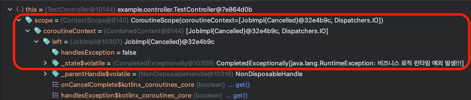
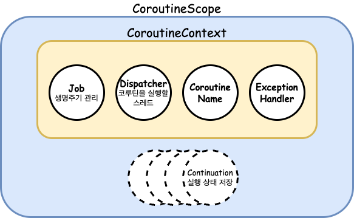
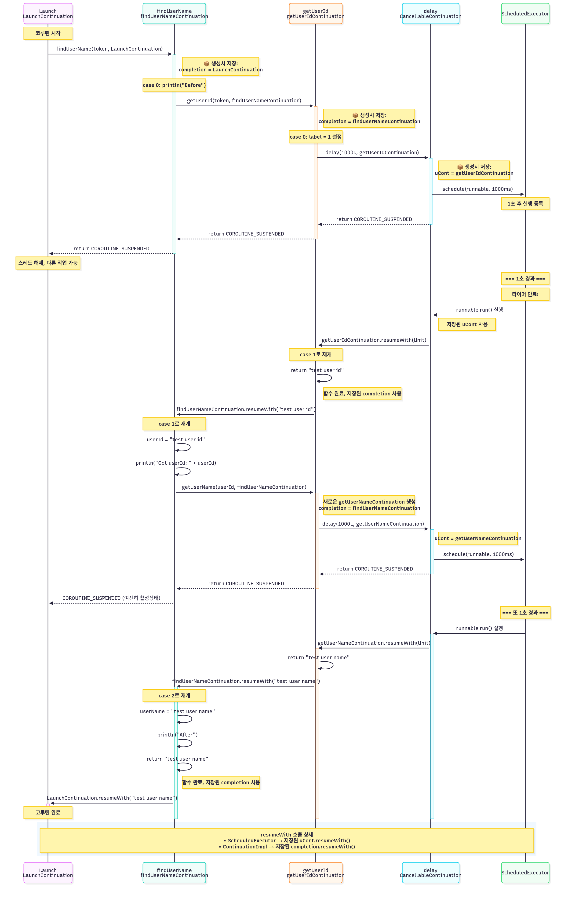
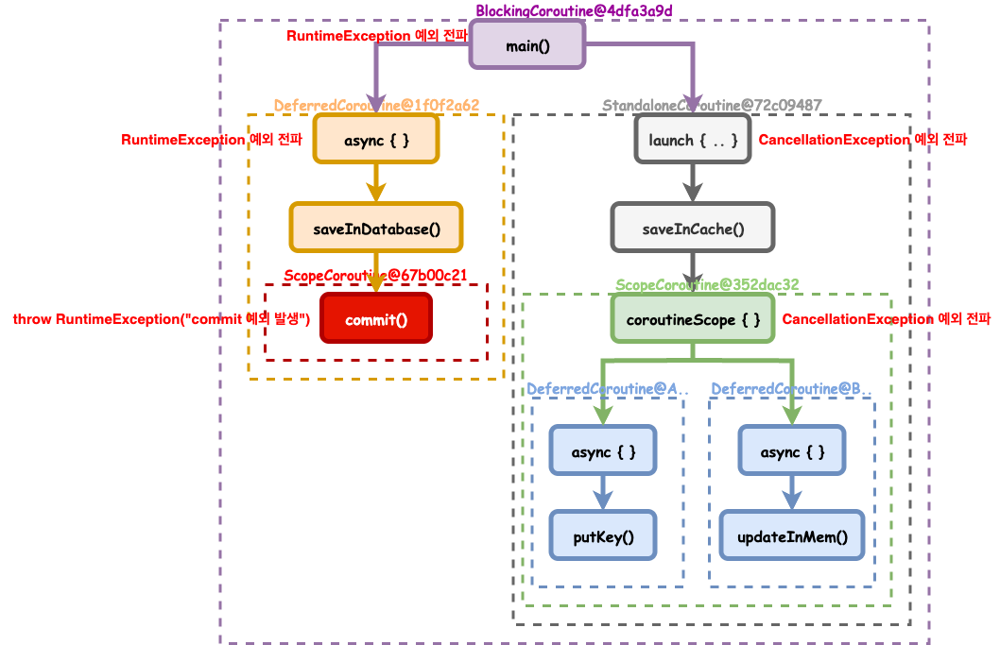
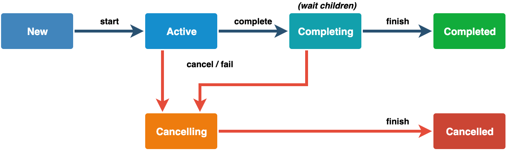
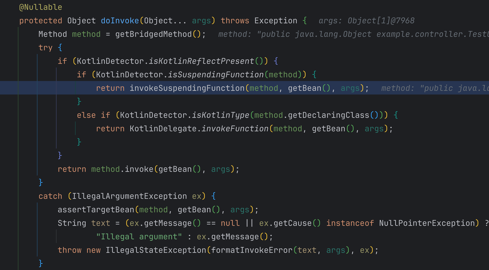
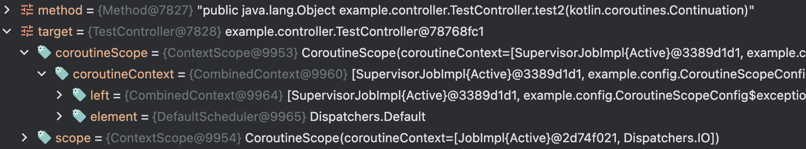

CS팀에서 특정 기능에 대한 사용자 문의 인입이 증가하고 있다고 백엔드 팀에 문의가 들어왔다.  

1. 사용량이 갑자기 늘어나서 병목이 생긴건가?
2. 지연되고 있는 API가 있나?
3. DB에 부하가 발생해서 지연되는 쿼리가 있나?
4. 가용할 수 있는 스레드가 없나?
5. 메모리 또는 CPU로 인해 서버가 다운되었나?
6. ECS 태스크가 증설중인가?
  
특이사항은 발견하지 못했지만 해당 API의 기능은 계속 먹통이였다.  
애플리케이션 로그를 통해 배포가 완료된 뒤에 정상적으로 호출되다가 런타임 예외가 발생한 시점부터 해당 API가 반응이 없었다.  

## 문제 지점

```kotlin
@RestController
class TestController {
    private val scope = CoroutineScope(Dispatchers.IO)
    
    @GetMapping("/test")
    fun test() {
        scope.launch {
            // business logic ...
            throw RuntimeException("비즈니스 로직 런타임 예외 발생!!!")
        }
    }
}
```

CoroutineScope를 생성하는 오버헤드를 줄이기 위해 싱글톤 빈 내부에 선언하여 재사용한것으로 보인다.    
**문제는 이 scope 자식 코루틴에서 발생한 예외가 적절히 처리되지 않아 scope의 Job도 `cancelled`로 상태를 전이시키기 때문이다.**  
  
아래의 코드를 통해 코루틴 내부에서 예외를 어떻게 처리하는지, 취소 상태가 되면 왜 코루틴이 실행되지 않는지 알 수 있다.  

```kotlin
// 1. BaseContinuationImpl에서 코루틴 블록 내부에서 발생한 런타임 예외를 failure result로 resume 한다.
public final override fun resumeWith(result: Result<Any?>) {
    var current = this
    var param = result
    while (true) {
        probeCoroutineResumed(current)
        with(current) {
            // fail fast when trying to resume continuation without completion
            val completion = completion!!
            val outcome: Result<Any?> =
                try {
                    val outcome = invokeSuspend(param)
                    if (outcome === COROUTINE_SUSPENDED) return
                    Result.success(outcome)
                } catch (exception: Throwable) {
                    Result.failure(exception)
                }
            releaseIntercepted()
            if (completion is BaseContinuationImpl) {
                current = completion
                param = outcome
            } else {
                completion.resumeWith(outcome)
                return
            }
        }
    }
}

// 2. AbstractCoroutine에서 resume을 실행하면서 전달받은 result를 CompletedExceptionally로 변환하여 전달한다.
public final override fun resumeWith(result: Result<T>) {
    val state = makeCompletingOnce(result.toState())
    if (state === COMPLETING_WAITING_CHILDREN) return
    afterResume(state)
}
internal fun <T> Result<T>.toState(
    onCancellation: ((cause: Throwable) -> Unit)? = null
): Any? = fold(
    onSuccess = { if (onCancellation != null) CompletedWithCancellation(it, onCancellation) else it },
    onFailure = { CompletedExceptionally(it) }
)


// 3. JobSupport에서 예외가 감지된다면 모든 형제,부모 Job에게 예외를 전달하고 상태를 취소,완료 상태로 변경한다.
private fun tryMakeCompletingSlowPath(state: Incomplete, proposedUpdate: Any?): Any? {
    val list = getOrPromoteCancellingList(state) ?: return COMPLETING_RETRY
    val finishing = state as? Finishing ?: Finishing(list, false, null)
    var notifyRootCause: Throwable? = null
    synchronized(finishing) {
        ...
        notifyRootCause = finishing.rootCause.takeIf { !wasCancelling }
    }
    notifyRootCause?.let { notifyCancelling(list, it) }
    val child = firstChild(state)
    if (child != null && tryWaitForChild(finishing, child, proposedUpdate))
        return COMPLETING_WAITING_CHILDREN
    return finalizeFinishingState(finishing, proposedUpdate)
}
private fun notifyCancelling(list: NodeList, cause: Throwable) {
    // first cancel our own children
    onCancelling(cause)
    notifyHandlers<JobCancellingNode>(list, cause)
    cancelParent(cause) // tentative cancellation -- does not matter if there is no parent
}
```



처음 예외가 발생한 이후 코루틴 스코프의 Job은 취소된 상태이고, 상세 상태에는 예외 정보가 저장된것을 볼 수 있다.  
만약 이 취소된 코루틴 스코프를 재호출하면, 내부 상태를 확인하고 비어있는 구현체인 NonDisposableHandle을 반환하기 때문에 코루틴이 실행되지 않는다.    

```kotlin
loopOnState { state ->
    when (state) {
        is Empty -> {
            ...
        }
        is Incomplete -> {
            ...
        }
        else -> { // is complete
            if (invokeImmediately) {
                // ChildHandleNode.childJob.parentCancelled(job) 부모 Job을 취소한다.
                handler.invoke((state as? CompletedExceptionally)?.cause)
            }
            return NonDisposableHandle
        }
    }
}
```
  
테스트 코드로 확인해보면 더 이해하기 쉬울 것이다.

```kotlin
given("코루틴 빌더별 예외 처리 방식") {
    `when`("스코프 내에서 launch 빌더를 사용할 때") {
        then("예외가 parentJob에 전파되며, 취소된 스코프는 실행되지 않는다.") {
            var caughtException = false
            val handler = CoroutineExceptionHandler { _, _ ->
                // 예외 핸들러를 통해 스코프 내의 에외를 잡아도 부모 Job에 그대로 전파된다.
                caughtException = true
            }
            val parentJob = Job()
            val scope = CoroutineScope(parentJob + Dispatchers.IO + handler)

            parentJob.isActive shouldBe true
            parentJob.isCancelled shouldBe false
            parentJob.isCompleted shouldBe false

            val childJob = scope.launch {
                delay(50)
                throw RuntimeException("launch 내부 예외")
            }

            childJob.isActive shouldBe true
            childJob.isCancelled shouldBe false
            childJob.isCompleted shouldBe false
            caughtException shouldBe false

            childJob.join()

            parentJob.isActive shouldBe false
            parentJob.isCancelled shouldBe true
            parentJob.isCompleted shouldBe true

            childJob.isActive shouldBe false
            childJob.isCancelled shouldBe true
            childJob.isCompleted shouldBe true
            caughtException shouldBe true

            scope.launch {
                throw RuntimeException("이 코드는 실행되지 않습니다.")
            }
        }
    }
}
```

## 첫 번째. 코루틴의 구조



간략하게 보면 위의 구조와 같다.

1. **CoroutineScope** : 코루틴의 실행 범위를 정의하며, 모든 코루틴은 특정 Scope 내에서 실행된다. CoroutineContext를 포함하고 있어 코루틴의 실행 환경을 제공한다.
    - `supervisorScope {}`, `coroutineScope {}`, `CoroutineScope()`, `runBlocking {}`, `withContext {}`
2. **CoroutineContext** : 코루틴 실행에 필요한 **컨텍스트 정보들의 집합** 이다.
    - **Job** : 코루틴의 생명주기를 관리할 수 있는 `시작`, `취소`, `완료`등의 상태를 가지며, 부모와 자식 Job을 참조한다.
    - **Dispatcher** : 코루틴이 어떤 스레드에서 실행될지 결정한다.
      - `Dispatchers.Main`, `IO`, `Default`, `Unconfined` 
    - **CoroutineExceptionHandler**
3. **Continuation** : 코루틴의 중단, 재개 메커니즘을 담당하며, `suspend` 함수가 호출될 때 현재 실행 상태를 저장하고, 작업 완료 후 해당 지점부터 재개할 수 있게 해준다.

코루틴을 중단하면 스레드를 반환해 콜 스택에 있는 정보가 사라지기 때문에 어딘가에 실행 지점을 저장해놓아야 한다.  
그 역할이 Continuation이다.  
**중단이 되었을 때의 상태(label)와 함수의 지역 변수와 파라미터(필드), 그리고 중단 함수를 호출한 함수가 재개될 위치 정보를 가지고 있다.**  
그렇기에 하나의 Continuation 객체가 다른 Continuation 객체를 참조하는 거대한 양파와 같다.  
  
아래의 코드를 통해 중단함수가 디컴파일되는 경우 Continuation이 어떻게 상태를 구분하는지, 또한 continuation은 어떻게 resume되는지 확인할 수 있다.  

```kotlin
suspend fun findUserName(token: String): String {
    println("Before")
    val userId = getUserId(token) // suspending
    println("Got userId: $userId")
    val userName = getUserName(userId)
    println("After")
    return userName
}

suspend fun getUserId(token: String): String {
    delay(1000)
    return "test user id"
}

suspend fun getUserName(userId: String): String {
    delay(1000)
    return "test user name"
}

private val executor = Executors.newSingleThreadScheduledExecutor {
    Thread(it, "scheduler").apply { isDaemon = true }
}

suspend fun delay(timeMillis: Long): Unit = suspendCancellableCoroutine { cont ->
    executor.schedule({
        cont.resume(Unit)
    }, timeMillis, TimeUnit.MILLISECONDS)
}
```




> 코루틴은 Continuation의 실행 가능한 단위(블록)라고 볼 수 있다.

## 두 번째. 코루틴의 구조적 동시성

코루틴간 하나의 block으로 감싸져있는 형태로 계층적인 구조를 갖도록하여, 생명주기와 에러 처리, 취소 전파를 통해 예측 가능하도록 하기 위함이다.  
그렇기 때문에, Coroutine이 손실되거나 누수되지 않도록 보장하며, 발생하는 오류도 제대로 보고되도록 보장할 수 있다.  
CoroutineContext의 Job이 아래와 같은 생명주기를 가지면서 코루틴의 구조적 동시성을 지원하고 있다.  



```kotlin
suspend fun start() {
    val userData = UserData()
    var parentJob: Job? = null
    var dbJob: Deferred<UserData>? = null
    var cacheJob: Job? = null
    shouldThrow<RuntimeException> {
        coroutineScope {
            parentJob = currentCoroutineContext()[Job]!!
            parentJob.isActive shouldBe true
            parentJob.isCancelled shouldBe false
            parentJob.isCompleted shouldBe false

            cacheJob = launch { saveInCache(userData) }
            dbJob = async { saveInDatabase(userData) }
            dbJob.await()
        }
    }.shouldHaveMessage("commit 예외 발생")

    parentJob!!.isActive shouldBe false
    parentJob.isCancelled shouldBe true
    parentJob.isCompleted shouldBe true
    dbJob!!.isActive shouldBe false
    dbJob.isCancelled shouldBe true
    dbJob.isCompleted shouldBe true
    cacheJob!!.isActive shouldBe false
    cacheJob.isCancelled shouldBe true
    cacheJob.isCompleted shouldBe true
}

suspend fun saveInDatabase(userData: UserData): UserData {
    return coroutineScope {
        commit()    // 예외 발생 !!!
        userData
    }
}

suspend fun saveInCache(userData: UserData): UserData {
    coroutineScope {
        val job1 = async { putKey() }
        val job2 = async { updateInMem() }

        try {
            awaitAll(job1, job2)
        } catch (e: Exception) {
            e.shouldBeInstanceOf<CancellationException>()
            e.message shouldBe "Parent job is Cancelling"
            throw e
        }
    }
    return userData
}

suspend fun commit() {
    throw RuntimeException("commit 예외 발생")
}
```

`commit()` 메소드에서 런타임 예외가 발생하여 관계된 코루틴의 Job 상태들이 `Cancelled`로 전이된 것을 확인할 수 있다.



# 해결방법

## 1. SupervisorJob 적용 👍

```kotlin
@RestController
class TestController {
    // SupervisorJob을 사용하여 자식 코루틴의 실패가 부모에 영향을 주지 않도록 함
    private val scope = CoroutineScope(Dispatchers.IO + SupervisorJob())
    
    @GetMapping("/test")
    fun test() {
        scope.launch {
            // 예외가 발생해도 scope는 계속 활성 상태 유지
            throw RuntimeException("예외 발생!")
        }
    }
}

given("간단한 SupervisorJob 테스트") {
    `when`("SupervisorJob을 사용한 스코프에서 자식이 실패하면") {
        then("다른 자식과 스코프는 영향받지 않는다") {
            runBlocking {
                var child2Completed = false
                val scope = CoroutineScope(SupervisorJob())
                
                // 첫 번째 자식 - 실패
                scope.launch {
                    throw RuntimeException("자식1 실패")
                }
                
                // 두 번째 자식 - 정상 실행
                scope.launch {
                    delay(100)
                    child2Completed = true
                }.join()
                
                child2Completed shouldBe true
                scope.coroutineContext[Job]?.isActive shouldBe true
                
                scope.cancel()
            }
        }
    }
}
```

## 2. supervisorScope 사용

```kotlin
@RestController
class TestController {
    private val scope = CoroutineScope(Dispatchers.IO)
    
    @GetMapping("/test")
    fun test() {
        scope.launch {
            supervisorScope {
                // supervisorScope 내부의 자식 코루틴 실패가 부모에 영향 없음
                throw RuntimeException("예외 발생!")
            }
        }
    }
}
```

코루틴 스코프 안에 코루틴 빌더가 한 개 더 생성되어야 해서 굳이 이렇게 해결하진 않을 것 같다.

## 3. Spring suspend + 코루틴 빌더

```kotlin
@RestController
class TestController {
    @GetMapping("/test")
    suspend fun test() {

        // 1. 컨텍스트 전환이 필요한 경우
        withContext(Dispatchers.IO) {
            // ...
        }

        // 2. 모든 자식이 완료될 때까지 대기, 하나라도 실패하면 모두 취소
        return coroutineScope {
            val data1 = async { fetchData1() }
            val data2 = async { fetchData2() }
            Result(data1.await(), data2.await())
        }

        // 3. 자식 실패가 다른 자식에 영향 없음
        supervisorScope {
            launch { .. }
            launch { .. }
        }
    }
}
```



Controller API가 suspend 함수인지 확인하여 `reactor.core.publisher.Mono<T>`가 실행된다.  



이때 사용되는 코루틴 스코프는 `SupervisorJob` + `Dispatchers.Default`로 구성되어 있기에, 예외가 발생해도 부모 스코프는 취소되지 않는다.

## 4. 예외 처리 👍

```kotlin
@RestController
class TestController {
    private val scope = CoroutineScope(Dispatchers.IO)
    
    @GetMapping("/test")
    fun test() {
        scope.launch {
            try {
                // business logic
                throw RuntimeException("예외 발생!")
            } catch (e: Exception) {
                // 예외를 처리하여 스코프 취소 방지
                logger.error("Error occurred: ", e)
            }
        }
    }
}
```

Job간 예외가 전파되기 때문에 `scope.launch {}` 밖에서 예외를 잡으면 의미없다.

```kotlin
given("코루틴 스코프 독립성 테스트") {
    `when`("launch 바깥에서 try-catch로 예외를 잡으려고 하면") {
        then("예외는 잡히지 않고 Job 계층으로 전파된다") {
            val tryBlockException = AtomicBoolean(false)
            val handlerException = AtomicBoolean(false)
            
            runBlocking {
                val scope = CoroutineScope(Job() + CoroutineExceptionHandler { _, _ ->
                    handlerException.set(true)
                })
                
                // try-catch로 launch를 감싸도 예외는 잡히지 않음
                try {
                    scope.launch {
                        delay(50)
                        throw RuntimeException("launch 내부 예외")
                    }
                    // launch는 즉시 반환되므로 여기서 예외가 발생하지 않음
                } catch (e: Exception) {
                    tryBlockException.set(true)  // 실행되지 않음
                }
                
                delay(100)
                
                // 검증: try-catch는 예외를 잡지 못하고, ExceptionHandler가 처리
                tryBlockException.get() shouldBe false  // try-catch로 잡지 못함
                handlerException.get() shouldBe true    // CoroutineExceptionHandler가 처리
                scope.coroutineContext[Job]?.isCancelled shouldBe true
            }
        }
    }
}
```

# 마무리

이번 장애를 계기로 코루틴을 더 깊게 분석해보았다.  
실무에 적용된 코루틴 안티 패턴을 걷어내고 동료들에게 공유할 수 있도록 노력해야겠다.  
요즘 AI가 작성해주는 코드를 사용하게 되면서 이런 일이 쉽게 발생하는 것 같다. 여전히 딥 다이브하는 능력은 필수임을 잊지 말자.