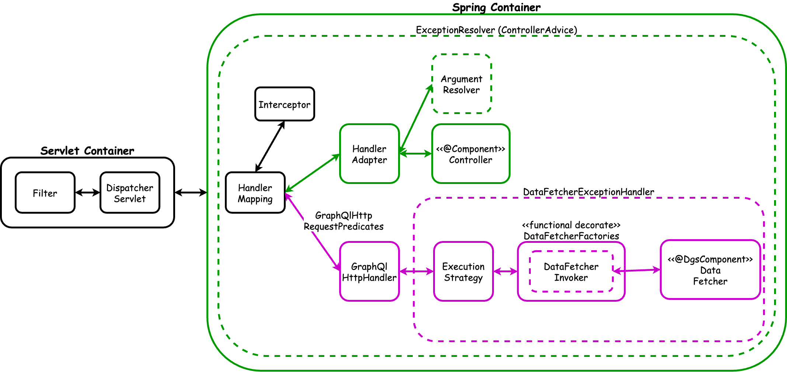
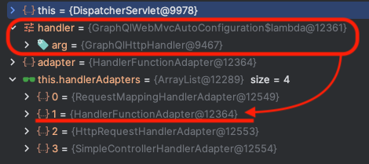

GraphQL 기반 서비스를 처음으로 접하면서 다음과 같은 고민을 한적이 있다.

- `"스키마를 어떤 기준으로 작성해야 할까?"`
- `"조회 쿼리가 너무 많이 발생하는데 어떻게 개선할 수 있을까?"`
- `"Selection Set의 필드는 어떤 원리로 채워지는 걸까?"`
- `"/graphql은 누가 라우팅할까?"`
- `"예외는 어떻게 처리할까?"`

이 글에서는 Netflix DGS Framework를 기준으로 이러한 고민들을 해소해보고자 한다.

> 이 글을 통해 아래의 내용을 학습할 수 있다.
> 1. GraphQL API의 호출 구조 이해
> 2. Query의 `Selection set` 동작 원리
> 3. `Data Loaders`를 통한 N+1 문제 해결 방법
> 4. GraphQL의 예외 처리 방식

# Company-Employee 예제로 보는 GraphQL

간단한 회사-직원 관계`(Company 1:N Employee)` 예제를 통해 GraphQL의 데이터 조회와 변경 작업을 살펴보자.

> GraphQL에서는 `schema`를 통해 클라이언트와 서버 간의 통신을 명시적으로 정의하여 안전한 타입 체킹, 자동 문서화, 코드 생성 등을 가능하게 한다.  
> 아래의 코드 블록에서 `# schema`는 `*.graphql`에 작성된 schema 정보임을 뜻한다.

## @DgsQuery와 @DgsData를 이용한 조회


이 이미지의 의미는 아래와 같다.  

```kotlin
@DgsComponent
class CompanyFetcher {

    @DgsQuery
    fun findAllCompanies(@InputArgument filter: CompanyFilter): Connection<Company> {
        ...
    }

    @DgsData(parentType = "CompanyResponse", field = "staffs")
    fun staff(environment: DgsDataFetchingEnvironment): CompletableFuture<List<Staff>> {
        val dataLoader = environment.getDataLoader<String, List<Employee>>(EmployeeDataLoader.EMPLOYEE_LOADER_NAME)
        return dataLoader.load(..)
    }
}
```

```graphql
# schema
type Query {
    findAllCompanies(filter: CompanyFilter): CompanyConnection!
}

type CompanyConnection {
    totalCount: Int!
    responses: [CompanyResponse!]!
}

type CompanyResponse {
    id: ID!
    alias: String!
    state: CompanyState!,
    employees: [Employee]
}

type Employee {
    id: Int,
    companyId: String
    name: String
}

# request
query {
    findAllCompanies(filter: {
        statusIn: [NORMAL]
    }) {
        totalCount
        responses {
            id
            alias
            state
            employees {
                name
            }
        }
    }
}

# response
{
  "data": {
    "findAllCompanies": {
      "totalCount": 3,
      "responses": [
        {
          "id": "별빛기술",
          "alias": "STAR",
          "state": "NORMAL",
          "employees": [
            {
              "name": "하늘솔"
            },
            {
              "name": "달빛솔"
            }
          ]
        },
        { ... }
      ]
    }
  }
}
```

주요 특징은 `CompanyResponse`를 `@DgsQuery`와 `@DgsData`의 응답을 합쳐서 만든다는 것이다.  
(이 기능을 지원하는 BatchLoader에 대해서는 뒤에서 자세히 다룬다.)  
GraphQL의 가장 큰 특징인 `selection set`을 필요한 것만 선택하여 지정할 수 있다.  
  
`selection set`이란, **GraphQL 쿼리에서 어떤 필드를 선택할지 지정하는 중괄호(`{}`) 내부의 집합이다.**  

```graphql
query {
    findAllCompanies(filter: {
        ...
    }) {
        # <selections set>
        totalCount
        responses {
            id
            alias
            state
            employees {
                name
            }
        }
        # </selection set>
    }
}
```

`<selection set>` 영역에 있는 최상위 필드 또는 중첩된 필드를 필요한 것만 선택하여 응답을 받을 수 있기에 오버페칭과 언더페칭을 해결할 수 있다.  
당연히 schema에 type으로 응답 타입의 필드에 작성된 필드를 기준으로 선택해야 한다.  

## @DgsMutation을 이용한 조작

```kotlin
@DgsComponent
class CompanyMutation {
    @DgsMutation
    fun createCompany(createRequest: CreateCompanyRequest): Company {
        val company = ...
        return company
    }
}
```
```graphql
# schema
type Mutation {
    createCompany(createCompanyRequest: CreateCompanyRequest!): CompanyResponse!
}
input CreateCompanyRequest {
    id: String!
    alias: String!
    employees: [EmployeeInput!]!
}
input EmployeeInput {
    name: String
}
```

위와 같이 schema를 정의하고 그에 맞게 Mutation을 등록한 후에, Spring Web API 작성하듯이 `@DgsComponent`와 `@DgsMutation`을 작성하면 호출할 수 있게 된다.  
  
```graphql
# request
mutation {
 createCompany(createCompanyRequest: {
   id: "company-123"
   alias: "신규회사" 
   employees: [
     {
       name: "김철수"
     },
     {
       name: "이영희"  
     }
   ]
 }) {
   id
   alias
   state
   employees {
     id
     name
   }
 }
}

# response
{
  "data": {
    "createCompany": {
      "id": "company-123",
      "alias": "신규회사",
      "state": "NORMAL",
      "employees": [
        {
          "id": 9,
          "name": "김철수"
        },
        {
          "id": 10,
          "name": "이영희"
        }
      ]
    }
  }
}
```

## 정리

각 어노테이션의 주요 특징과 사용 목적을 정리하면 다음과 같다.

| 어노테이션 | 용도 | 사용 위치 | 특징 |
|---------|------|---------|------|
| `@DgsQuery` | 데이터 조회 작업 | 최상위 레벨 | 1. Query 타입 구현 (1:1 관계)<br>2. 읽기 전용 작업 |
| `@DgsData` | 타입의 필드 구현 | 중첩 필드 | 1. 특정 Query 타입 내부의 필드를 구현 (1:1 또는 1:N 관계)<br>2. `parentType` 지정 필요<br>3. DataLoader와 함께 사용하여 N+1 문제 해결<br>4. DgsDataFetchingEnvironment로 부모 컨텍스트 접근 가능 |
| `@DgsMutation` | 데이터 변경 작업 | 최상위 레벨 | 1. Mutation 타입 구현 및 (1:1 관계)<br>2. 생성/수정/삭제 작업 |

GraphQL의 내부 동작 원리와 최적화 방법에 대해 더 자세히 알아보자.

***

# GraphQL 분석하기



## GraphQL Request는 다른 Spring Request와 어떻게 구분될까?

DispatcherServlet은 요청이 들어오면 아래의 과정을 거친다.

1. API 요청을 처리할 수 있는 `핸들러`를 조회한다.
2. 핸들러를 실행시킬 수 있는 `핸들러 어댑터`를 조회한다.
3. 핸들러 어댑터를 이용하여 `핸들러를 실행`한다.

GraphQL도 DispatcherServlet을 통해 실행되기에 Spring Boot의 Auto Configuration을 통해 GraphQL의 요청을 처리하기 위해 필요한 구성들을 자동으로 등록한다.  

<h3>1. GraphQL 요청을 처리하는 핸들러 찾기</h3>

아래는 GraphQL 요청을 처리할 수 있는 `핸들러`를 조회할 때 사용되는 조건이다.  
`GraphQlHttpRequestPredicate` 구현체는 DispatcherServlet에서 Handler를 조회할 때 사용된다.  

```java
public final class GraphQlRequestPredicates {
    ...
    private static class GraphQlHttpRequestPredicate implements RequestPredicate {

        @Override
        public boolean test(ServerRequest request) {
            return httpMethodMatch(request, HttpMethod.POST)
                    && contentTypeMatch(request, this.contentTypes)
                    && acceptMatch(request, this.acceptedMediaTypes)
                    && pathMatch(request, this.pattern);
        }
        ...
    }
}
```

1. `POST` 요청
2. `content-type` : application/json || applciation/graphql
3. `media-type` : application/json || application/graphql-response+json
4. `/graphql` 경로

위 4가지 조건에 모두 만족한다면 `GraphQlHttpHandler`를 반환한다.  
(GraphQlHttpHandler는 `GraphQlWebMvcAutoConfiguration`에서 자동으로 등록된 빈이다.)  

<h3>2. GraphQlHttpHandler를 이용해 핸들러 어댑터 찾기</h3>



DispatcherServlet에서는 4개의 HandlerAdapter를 보유하고 있다.  

- RequestMappingHandlerAdapter (일반적인 스프링 어노테이션 기반 Web API)
- **HandlerFunctionAdapter (함수형 스타일)**
- HttpRequestHandlerAdapter (HTTP 요청 직접 처리)
- SimpleControllerHandlerAdapter (레거시 Controller 인터페이스 구현체 지원)

GraphQL은 Spring에서 지원하는 `RouterFunction`을 통해 함수형으로 라우팅 기능을 구현해놓았기에 `HandlerFunctionAdapter`를 사용한다.  
GraphQL은 4개의 RouterFunction이 존재하며, 일반적인 요청은 `GraphQlHttpHandler`가 처리한다.


## TODO

### ExecutionStrategy

HandlerFunctionAdapter가 GraphQlHttpHandler를 통하여 GraphQl의 요청을 처리하게 된다.  
- 중첩 필드가 실행될 때 재귀적으로 실행하는 것을 확인했음. 더 분석 필요

### BatchLoader 규칙

```java
// DataLoaderHelper

private void assertResultSize(List<K> keys, List<V> values) {
    assertState(keys.size() == values.size(), () -> "The size of the promised values MUST be the same size as the key list");
}
```

- 각 companyId에 대해 빈 리스트라도 반환해야 함
- 결과는 반드시 입력 keys와 같은 순서를 유지해야 함
- 반환 타입이 List<List<Staff>>이어야 함 (각 companyId당 하나의 List)

```
// 입력 keys
companyIds = [1, 2, 3]

// 올바른 결과 (size = 3)
[
    [staff1, staff2],  // company1의 직원들
    [],                // company2의 직원 (없음)
    [staff3]           // company3의 직원
]

// 잘못된 결과 (size = 4 != keys.size)
[staff1, staff2, staff3, staff4]
```
  
- DgsContext
- DataLoaderRegistry
