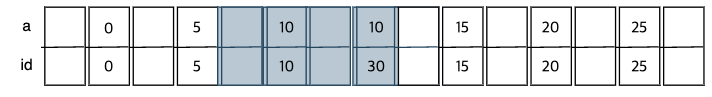

> [InnoDB 행 잠금의 2원 2규칙](https://devocean.sk.com/blog/techBoardDetail.do?ID=167948&boardType=techBlog)
> - **원칙 1**: InnoDB의 기본 잠금 단위는 넥스트 키 락이며, 넥스트 키 락의 잠금 범위는 좌측으로는 개구간, 우측으로는 폐구간이다. `ex) (R1, R10]`
>    - InnoDB 잠금의 시작은 넥스트 키 락이다. 이후에 갭 락과 레코드 락을 따져보는 것이다.
> - **원칙 2**: 잠금은 쿼리를 수행하는 과정에서 접근한 객체에만 걸린다.
> - **규칙 1**: 인덱스(고유, 비고유)를 사용하는 동등 조건의 쿼리를 수행할 때 레코드 스캔 방향은 오른쪽이며, 마지막 레코드가 동등 조건을 만족하지 않으면 넥스트 키 락은 갭 락으로 강등된다.
> - **규칙 2**: 고유 인덱스를 사용하는 동등 조건의 쿼리를 수행할 때, 레코드가 동등 조건을 만족하면 넥스트 키 락은 레코드 락으로 강등된다.

<details>
<summary>🔐 잠금 상태 조회 쿼리</summary>

```sql
-- 잠금 상태 조회하기
SELECT 
    dl.object_name AS `table`,
    dl.lock_type,
    dl.index_name,
    dl.lock_mode,
    CASE 
        WHEN dl.lock_mode LIKE '%REC_NOT_GAP%' THEN 'Record Lock'
        WHEN dl.lock_mode LIKE '%GAP%' AND dl.lock_mode NOT LIKE '%REC_NOT_GAP%' THEN 'Gap Lock'
        WHEN dl.lock_mode NOT LIKE '%GAP%' AND dl.lock_mode NOT LIKE '%REC_NOT_GAP%' THEN 'Next-Key Lock'
        ELSE dl.lock_mode
    END AS lock_type_detail,
    dl.lock_data AS locked_data
FROM performance_schema.data_locks dl
ORDER BY dl.object_name, dl.lock_data;
```

</details>

## 갭 락으로 인한 INSERT 실패

```sql
CREATE TABLE t (
  id int NOT NULL,
  a int NULL,
  b int NULL,
  PRIMARY KEY (id),
  KEY ix_a (a)
) ENGINE=InnoDB;

+----+------+------+
| id | a    | b    |
+----+------+------+
|  0 |    0 |    0 |
|  5 |    5 |    5 |
| 10 |   10 |   10 |
| 15 |   15 |   15 |
| 20 |   20 |   20 |
| 25 |   25 |   25 |
+----+------+------+

-- <A 세션> 존재하지 않는 id = 7를 업데이트 
BEGIN;
UPDATE t SET b=b+1 WHERE id=7;

+-----------+------------+-----------+------------------+-------------+
| lock_type | index_name | lock_mode | lock_type_detail | locked_data |
+-----------+------------+-----------+------------------+-------------+
| TABLE     | NULL       | IX        | Next-Key Lock    | NULL        |
| RECORD    | PRIMARY    | X,GAP     | Gap Lock         | 10          |
+-----------+------------+-----------+------------------+-------------+

-- <B 세션>
INSERT INTO t VALUES (8, 8, 8);     -- BLOCKED
INSERT INTO t VALUES (9, 9, 9);     -- BLCOKED

INSERT INTO t VALUES (4, 4, 4);     -- 성공
INSERT INTO t VALUES (11, 11, 11);  -- 성공
UPDATE t SET b=b+1 WHERE id=5;      -- 성공
UPDATE t SET b=b+1 WHERE id=10;     -- 성공
```

먼저 넥스트 키 락에 의해 `(5, 10]`으로 잠금되고, 마지막 레코드 10이 id=7 조건에 만족하지 않기 때문에 넥스트 키 락은 갭 락으로 강등되어 `(5, 10)`의 잠금이 발생한다.  
그리하여 마지막 업데이트 쿼리는 둘 다 성공한다.  

## non-unique 세컨더리 인덱스 동등 잠금 (FOR SHARE)

```sql
CREATE TABLE t (
  id int NOT NULL,
  a int NULL,
  b int NULL,
  PRIMARY KEY (id),
  KEY ix_a (a)
) ENGINE=InnoDB;

+----+------+------+
| id | a    | b    |
+----+------+------+
|  0 |    0 |    0 |
|  5 |    5 |    5 |
| 10 |   10 |   10 |
| 15 |   15 |   15 |
| 20 |   20 |   20 |
| 25 |   25 |   25 |
+----+------+------+

-- <A 세션>
BEGIN;
select id from t where a = 5 for share;

+-----------+------------+-----------+------------------+-------------+
| lock_type | index_name | lock_mode | lock_type_detail | locked_data |
+-----------+------------+-----------+------------------+-------------+
| TABLE     | NULL       | IS        | Next-Key Lock    | NULL        |
| RECORD    | ix_a       | S,GAP     | Gap Lock         | 10, 10      | <- (5, 10)
| RECORD    | ix_a       | S         | Next-Key Lock    | 5, 5        | <- (0, 5]
+-----------+------------+-----------+------------------+-------------+

-- <B 세션>
INSERT INTO t VALUES (-1, -1, -1);  -- 성공
INSERT INTO t VALUES (0,0,0);   -- BLOCKED
INSERT INTO t VALUES (3,3,3);   -- BLOCKED
INSERT INTO t VALUES (7,7,7);   -- BLOCKED

UPDATE t SET b=b+1 WHERE id=5;  -- 성공
UPDATE t SET b=b+1 WHERE id=10; -- 성공

+----+------+------+
| id | a    | b    |
+----+------+------+
| -1 |   -1 |   -1 |
|  0 |    0 |    0 |
|  5 |    5 |    6 |
| 10 |   10 |   11 |
+----+------+------+

UPDATE t SET a=a+1 WHERE id=10; -- 성공
UPDATE t SET a=a+1 WHERE id=5;  -- BLOCKED

+----+------+------+
| id | a    | b    |
+----+------+------+
| -1 |   -1 |   -1 |
|  0 |    0 |    0 |
|  5 |    5 |    6 |
| 10 |   11 |   11 |
+----+------+------+
```

- **Q: 왜 5미만의 INSERT 쿼리는 실행하지 못할까?**  
  - 원칙 1에 따라 기본 잠금 단위는 넥스트 키 락이기 때문에 `(0,5]`에 넥스트 키 락이 설정된다.
- **Q: 왜 `id = (5 < N < 10)`의 INSERT 쿼리는 실행하지 못할까?**  
  - a 컬럼 인덱스는 유니크하지 않은 세컨더리 인덱스이기 때문에 `a = 5`에 해당하는 레코드만 찾아서 바로 종료하는 것이 아니라 오른쪽으로 계속 스캔하여 레코드 10을 찾을 때까지 이동하기에 `(5,10]`에 넥스트 키 락이 설정된다. **이 과정에서 접근한 모든 객체에 잠금을 걸게 되기 때문이다**
- **Q: 왜 `id=10`에 대한 a,b 컬럼 UPDATE는 성공할까?**  
  - 10은 `a = 5` 조건을 만족하지 않기 때문에 넥스트 키 락이 갭 락으로 강등되어 `(5,10)`으로 잠금 범위가 변경되기 때문이다.
- **Q: FOR SHARE로 `a = 5`에 대한 명시적 공유 잠금을 걸었는데 b 컬럼에 대한 업데이트는 왜 실행될까?**
  - A 세션의 FOR SHARE 쿼리는 커버링 인덱스를 활용하고 있고 조회 가능 잠금이기 때문에 프라이머리 키 인덱스에 어떠한 잠금도 설정되지 않는다.
  - 잠금에 대한 정보를 통해 `ix_a 인덱스의 (5,10) 구간에 걸린 Gap Lock`으로 인해 a 컬럼은 UPDATE가 실행되지 않았고, b 컬럼에 대한 UPDATE는 실행 가능한 것이다.
  - 만약 `a = 5`에 대한 조회 가능 잠금을 통해 레코드가 업데이트 되는 것을 원하지 않으면 FOR SHARE 쿼리를 수정하면 된다.
  
```sql
select * from t where a = 5 for share; -- 또는
select id, a, b from t where a = 5 for share;

+-----------+------------+---------------+------------------+-------------+
| lock_type | index_name | lock_mode     | lock_type_detail | locked_data |
+-----------+------------+---------------+------------------+-------------+
| TABLE     | NULL       | IS            | Next-Key Lock    | NULL        |
| RECORD    | ix_a       | S,GAP         | Gap Lock         | 10, 10      |
| RECORD    | PRIMARY    | S,REC_NOT_GAP | Record Lock      | 5           | -> 레코드 락을 확인할 수 있다!
| RECORD    | ix_a       | S             | Next-Key Lock    | 5, 5        |
+-----------+------------+---------------+------------------+-------------+
```


## non-unique 세컨더리 인덱스 동등 장금 (FOR UPDATE)

```sql
CREATE TABLE t (
  id int NOT NULL,
  a int NULL,
  b int NULL,
  PRIMARY KEY (id),
  KEY ix_a (a)
) ENGINE=InnoDB;

+----+------+------+
| id | a    | b    |
+----+------+------+
|  0 |    0 |    0 |
|  5 |    5 |    5 |
| 10 |   10 |   10 |
| 15 |   15 |   15 |
| 20 |   20 |   20 |
| 25 |   25 |   25 |
+----+------+------+

-- <A 세션>
BEGIN;
select id from t where a = 5 for update;

+-----------+------------+---------------+------------------+-------------+
| lock_type | index_name | lock_mode     | lock_type_detail | locked_data |
+-----------+------------+---------------+------------------+-------------+
| TABLE     | NULL       | IX            | Next-Key Lock    | NULL        |
| RECORD    | ix_a       | X,GAP         | Gap Lock         | 10, 10      |
| RECORD    | PRIMARY    | X,REC_NOT_GAP | Record Lock      | 5           |
| RECORD    | ix_a       | X             | Next-Key Lock    | 5, 5        |
+-----------+------------+---------------+------------------+-------------+

-- <B 세션>

INSERT INTO t VALUES (7,7,7);   -- BLOCKED
UPDATE t SET b=b+1 WHERE id=5;  -- BLOCKED
UPDATE t SET b=b+1 WHERE id=10; -- 성공

UPDATE t SET a=a+1 WHERE id=5;   -- BLOCKED
UPDATE t SET a=a+1 WHERE id=10;  -- 성공
```

## 프라이머리 키 인덱스 범위 잠금

조회 결과는 같지만 잠금 범위가 서로 다른 케이스를 확인해보자.  

```sql
CREATE TABLE t (
  id int NOT NULL,
  a int NULL,
  b int NULL,
  PRIMARY KEY (id),
  KEY ix_a (a)
) ENGINE=InnoDB;

+----+------+------+
| id | a    | b    |
+----+------+------+
|  0 |    0 |    0 |
|  5 |    5 |    5 |
| 10 |   10 |   10 |
| 15 |   15 |   15 |
+----+------+------+

-- <A 세션>
BEGIN;
SELECT * FROM t WHERE id=10 FOR UPDATE;

+-----------+------------+---------------+------------------+-------------+
| lock_type | index_name | lock_mode     | lock_type_detail | locked_data |
+-----------+------------+---------------+------------------+-------------+
| TABLE     | NULL       | IX            | Next-Key Lock    | NULL        |
| RECORD    | PRIMARY    | X,REC_NOT_GAP | Record Lock      | 10          |
+-----------+------------+---------------+------------------+-------------+

-- <B 세션>
UPDATE t SET b=b+1 WHERE id=5;  -- 성공
INSERT INTO t VALUES (7,7,7);   -- 성공
INSERT INTO t VALUES (11,11,11);    -- 성공
```

처음엔 `(5, 10]` 넥스트 키 락이 설정되고, id는 프라이머리 키 인덱스이고 `id = 10` 조건에 해당하는 레코드가 존재하므로 레코드 락으로 강등된다.  

```sql
-- <A 세션>
BEGIN;
SELECT * FROM t WHERE id >= 10 AND id < 11 FOR UPDATE;

+-----------+------------+---------------+------------------+-------------+
| lock_type | index_name | lock_mode     | lock_type_detail | locked_data |
+-----------+------------+---------------+------------------+-------------+
| TABLE     | NULL       | IX            | Next-Key Lock    | NULL        |
| RECORD    | PRIMARY    | X,REC_NOT_GAP | Record Lock      | 10          |
| RECORD    | PRIMARY    | X,GAP         | Gap Lock         | 15          |
+-----------+------------+---------------+------------------+-------------+

-- <B 세션>
INSERT INTO t VALUES (8, 8, 8);     -- 성공
INSERT INTO t VALUES (9, 9, 9);     -- 성공
INSERT INTO t VALUES (11, 11, 11);  -- BLOCKED

UPDATE t SET b=b+1 WHERE id = 15;   -- 성공
UPDATE t SET a=a+1 WHERE id = 15;   -- 성공
UPDATE t SET a=a+1 WHERE id = 10;   -- BLOCKED
```

`id >= 10 AND id < 11` 조건에 해당하는 레코드를 찾게 되는데, 먼저 `id >= 10`에 대한 `(5, 10]` 넥스트 키 락이 설정된다. 하지만 `id = 10`인 레코드가 존재하므로 레코드 락으로 강등된다.  
  
`id < 11` 같은 범위 검색은 조건을 만족하는지 안하는지 다음 첫 번째 레코드까지 접근해야만 알 수 있기 때문에 오른쪽으로 범위 검색을 계속해서 수행하며 `id=15` 레코드를 찾게된다.  
이미 `id=10`레코드를 찾았으므로 `(10, 15)`에 갭락이 설정된다.  
  
즉, 최종 잠금 범위는 `10, (10, 15)`가 된다.  

## non-unique 세컨더리 인덱스 범위 잠금

```sql
CREATE TABLE t (
  id int NOT NULL,
  a int NULL,
  b int NULL,
  PRIMARY KEY (id),
  KEY ix_a (a)
) ENGINE=InnoDB;

+----+------+------+
| id | a    | b    |
+----+------+------+
|  0 |    0 |    0 |
|  5 |    5 |    5 |
| 10 |   10 |   10 |
| 15 |   15 |   15 |
+----+------+------+

-- <A 세션>
BEGIN;
SELECT * FROM t WHERE a >= 10 AND a < 11 FOR UPDATE;

+-----------+------------+---------------+------------------+-------------+
| lock_type | index_name | lock_mode     | lock_type_detail | locked_data |
+-----------+------------+---------------+------------------+-------------+
| TABLE     | NULL       | IX            | Next-Key Lock    | NULL        |
| RECORD    | PRIMARY    | X,REC_NOT_GAP | Record Lock      | 10          |
| RECORD    | ix_a       | X             | Next-Key Lock    | 10, 10      |
| RECORD    | ix_a       | X             | Next-Key Lock    | 15, 15      |
+-----------+------------+---------------+------------------+-------------+

-- <B 세션>
INSERT INTO t VALUES (6, 6, 6);     -- BLOCKED
INSERT INTO t VALUES (8, 8, 8);     -- BLOCKED
INSERT INTO t VALUES (4, 4, 4);     -- 성공

UPDATE t SET b=b+1 WHERE a = 15;    -- BLOCKED
UPDATE t SET b=b+1 WHERE a = 10;    -- BLOCKED
UPDATE t SET b=b+1 WHERE a = 5;     -- 성공
UPDATE t SET b=b+1 WHERE a = 4;     -- 성공
```

먼저 `a=10`인 레코드를 찾아 `(5, 10]` 넥스트 키 락이 설정된다. `ix_a` 인덱스는 유니크 인덱스가 아니기 때문에 레코드 락으로 끝나지 않는다. (규칙 2를 적용할 수 없다.)  
그렇기에 동등 조건을 만족하지 않는 다음 레코드까지 범위 검색을 수행하며, `a=15`에 해당하는 레코드를 찾아 검색이 중단되고 `(10, 15]`에 넥스트 키 락이 설정된다.  
동등 조건이 아닌 범위 검색에 해당하기 때문에 갭 락으로 강등되지 않는다.  
  
즉, 최종 잠금 범위는 `(5, 10], (10, 15]`이다.

## unique 세컨더리 인덱스 업데이트 잠금

```sql
CREATE TABLE t2 (
  id int NOT NULL,
  a int NULL,
  b int NULL,
  PRIMARY KEY (id),
  UNIQUE ix_a (a)
) ENGINE=InnoDB;

+----+------+------+
| id | a    | b    |
+----+------+------+
|  0 |    0 |    0 |
|  5 |    5 |    5 |
| 10 |   10 |   10 |
| 15 |   15 |   15 |
| 20 |   20 |   20 |
| 25 |   25 |   25 |
+----+------+------+

-- <A 세션>
BEGIN;
UPDATE t2 set b = b + 1 where a = 10;

+-----------+------------+---------------+------------------+-------------+
| lock_type | index_name | lock_mode     | lock_type_detail | locked_data |
+-----------+------------+---------------+------------------+-------------+
| TABLE     | NULL       | IX            | Next-Key Lock    | NULL        |
| RECORD    | PRIMARY    | X,REC_NOT_GAP | Record Lock      | 10          |
| RECORD    | ix_a       | X,REC_NOT_GAP | Record Lock      | 10, 10      |
+-----------+------------+---------------+------------------+-------------+

-- <B 세션>

insert into t2 values (9, 9, 9);    -- 성공
insert into t2 values (11, 11, 11); -- 성공
update t2 set b = 15 where a = 10;  -- BLOCKED
```

`a` 컬럼의 인덱스는 유니크함을 보장하기 때문에 `a = 10`을 찾게되면 넥스트 키 락은 레코드 락으로 강등되기 때문에 왼쪽과 오른쪽에 대한 갭락 또는 넥스트 키 락이 발생하지 않는다.


## non-unique 세컨더리 인덱스 중복된 행 잠금

```sql
CREATE TABLE t (
  id int NOT NULL,
  a int NULL,
  b int NULL,
  PRIMARY KEY (id),
  KEY ix_a (a)
) ENGINE=InnoDB;

+----+------+------+
| id | a    | b    |
+----+------+------+
|  0 |    0 |    0 |
|  5 |    5 |    5 |
| 10 |   10 |   10 |
| 15 |   15 |   15 |
| 20 |   20 |   20 |
| 25 |   25 |   25 |
| 30 |   10 |   30 |
+----+------+------+

-- <A 세션>
BEGIN;
SELECT * FROM t WHERE a=10 FOR UPDATE;

+-----------+------------+---------------+------------------+-------------+
| lock_type | index_name | lock_mode     | lock_type_detail | locked_data |
+-----------+------------+---------------+------------------+-------------+
| TABLE     | NULL       | IX            | Next-Key Lock    | NULL        |
| RECORD    | PRIMARY    | X,REC_NOT_GAP | Record Lock      | 10          |
| RECORD    | PRIMARY    | X,REC_NOT_GAP | Record Lock      | 30          |
| RECORD    | ix_a       | X             | Next-Key Lock    | 10, 10      |
| RECORD    | ix_a       | X             | Next-Key Lock    | 10, 30      |
| RECORD    | ix_a       | X,GAP         | Gap Lock         | 15, 15      |
+-----------+------------+---------------+------------------+-------------+

-- <B 세션>
INSERT INTO t VALUES (4, 4, 4);      -- 성공
INSERT INTO t VALUES (6, 6, 6);      -- BLOCKED
INSERT INTO t VALUES (9, 9, 9);      -- BLOCKED
INSERT INTO t VALUES (12, 12, 12);   -- BLOCKED
INSERT INTO t VALUES (17, 17, 17);   -- 성공
INSERT INTO t VALUES (24, 24, 24);   -- 성공
INSERT INTO t VALUES (27, 27, 27);   -- 성공

UPDATE t SET b=b+1 WHERE a = 5;     -- 성공
UPDATE t SET b=b+1 WHERE a = 10;    -- BLOCKED
UPDATE t SET b=b+1 WHERE a = 15;    -- 성공
UPDATE t SET b=b+1 WHERE a = 20;    -- 성공
UPDATE t SET b=b+1 WHERE a = 25;    -- 성공

UPDATE t SET a=a+1 WHERE id = 0;
UPDATE t SET a=a+1 WHERE id = 5;     -- BLOCKED
UPDATE t SET a=a+1 WHERE id = 10;    -- BLOCKED
UPDATE t SET a=a+1 WHERE id = 15;
UPDATE t SET a=a+1 WHERE id = 20;
UPDATE t SET a=a+1 WHERE id = 25;
UPDATE t SET a=a+1 WHERE id = 30;    -- BLOCKED

UPDATE t SET b=b+1 WHERE id = 0;
UPDATE t SET b=b+1 WHERE id = 5;
UPDATE t SET b=b+1 WHERE id = 10;    -- BLOCKED
UPDATE t SET b=b+1 WHERE id = 15;
UPDATE t SET b=b+1 WHERE id = 20;
UPDATE t SET b=b+1 WHERE id = 25;
UPDATE t SET b=b+1 WHERE id = 30;    -- BLOCKED
```

먼저 `a=10` 조건에 해당하는 레코드를 찾아 `(5, 10]` 넥스트 키 락을 설정한다.  
정확히는 `(a=5, id=5)부터 (a=10, id=10)`까지 넥스트 키 락이 설정된다.  
  
그리고 넌유니크 세컨더리 인덱스이기 때문에 다음 레코드 `a=15`를 찾을 때 까지 오른쪽으로 검색을 수행하며, 이 과정에서 `a=10, id=30` 레코드를 거치기 때문에 `(a=10, id=10) ~ (a=10, id=30)`까지 넥스트 키 락이 설정된다.  
  
계속 오른쪽으로 검색하며 `a=15, id=15` 레코드를 만나면 검색 루프는 종료되고 `(a=10, id=30) ~ (a=15, id=15)` 까지 넥스트 키 락이 설정된다.  
하지만 검색 조건 `a=10` 조건에 해당되지 않으므로 최종적으로 갭 락으로 강등된다.  
  
즉 최종 잠금 범위는

```sql
-- ix_a, X (Next-Key Lock)
( (a=5, id=5), (a=10, id=10) ],

-- ix_a, X (Next-Key Lock)
( (a=10, id=10), (a=10, id=30) ], 

-- ix_a, X,GAP (Gap Lock)
( (a=10, id=30), (a=15, id=15) )
```

## non-unique 세컨더리 인덱스 중복된 행 잠금 (추가 케이스)

```sql
CREATE TABLE employees (
    id int NOT NULL AUTO_INCREMENT,
    first_name varchar(255) DEFAULT NULL,
    last_name varchar(255) DEFAULT NULL,
    PRIMARY KEY (id),
    KEY idx_first_name (first_name)
) ENGINE=InnoDB

+----+------------+-----------+
| id | first_name | last_name |
+----+------------+-----------+
| 34 | E          | E1        |
| 35 | E          | E2        |
| 36 | E          | E3        |
| 37 | B          | B1        |
| 38 | B          | B2        |
+----+------------+-----------+
```

```sql
-- <A 세션>
BEGIN;
update employees SET last_name = 'Updated E' where first_name = 'E' and last_name = 'E2';

+-----------+----------------+---------------+------------------+------------------------+
| lock_type | index_name     | lock_mode     | lock_type_detail | locked_data            |
+-----------+----------------+---------------+------------------+------------------------+
| TABLE     | NULL           | IX            | Next-Key Lock    | NULL                   |
| RECORD    | idx_first_name | X             | Next-Key Lock    | 'E', 34                |
| RECORD    | idx_first_name | X             | Next-Key Lock    | 'E', 35                |
| RECORD    | idx_first_name | X             | Next-Key Lock    | 'E', 36                |
| RECORD    | PRIMARY        | X,REC_NOT_GAP | Record Lock      | 34                     |
| RECORD    | PRIMARY        | X,REC_NOT_GAP | Record Lock      | 35                     |
| RECORD    | PRIMARY        | X,REC_NOT_GAP | Record Lock      | 36                     |
| RECORD    | idx_first_name | X             | Next-Key Lock    | supremum pseudo-record |
+-----------+----------------+---------------+------------------+------------------------+

-- <B 세션>
insert into employees (first_name, last_name) values ('A', 'A1');    -- 성공
insert into employees (first_name, last_name) values ('B', 'B1');    -- BLOCKED
insert into employees (first_name, last_name) values ('C', 'C1');    -- BLOCKED
insert into employees (first_name, last_name) values ('D', 'D1');    -- BLOCKED
insert into employees (first_name, last_name) values ('F', 'F1');    -- BLOCKED
insert into employees (first_name, last_name) values ('Z', 'Z1');    -- BLOCKED

update employees set last_name = 'updated B1' where id = 37;   -- 성공
update employees set last_name = 'updated B2' where id = 38;   -- 성공
update employees set last_name = 'updated B2' where first_name = 'B';    -- 성공
update employees set first_name = 'C' where id = 37;   -- BLOCKED
update employees set first_name = 'A' where id = 37;   -- 성공
```

먼저 `first_name = 'E'`를 찾기 위해 오른쪽으로 검색하지만 `E`보다 큰 데이터는 없기에 supremum 락이 걸린다.

```
('B', 37)
('B', 38) ← 마지막 B 레코드
    ↓
  [갭1] ← ('B', 38) ~ ('E', 34)
    ↓
('E', 34) ← Next-Key Lock = 레코드 + 갭1
('E', 35) ← Next-Key Lock = 레코드 + 갭2
('E', 36) ← Next-Key Lock = 레코드 + 갭3
    ↓
  [갭4] ← ('E', 36) ~ supremum
    ↓
supremum  ← Next-Key Lock = supremum + 갭4
```

**실제 락 범위**  
1. `('E', 34)` **Next-Key Lock**
   - 레코드: `('E', 34)`
   - 갭: `(('B', 38) ~ ('E', 34))`
2. `('E', 35)` **Next-Key Lock**
   - 레코드: `('E', 35)`
   - 갭: `(('E', 34) ~ ('E', 35))`
3. `('E', 36)` **Next-Key Lock**
   - 레코드: `('E', 36)`
   - 갭: `(('E', 35) ~ ('E', 36))`
4. **supremum Next-Key Lock**
   - supremum 자체
   - 갭: `(('E', 36) ~ supremum)`

## non-unique 세컨더리 인덱스 LIMIT 잠금

```sql
CREATE TABLE t (
  id int NOT NULL,
  a int NULL,
  b int NULL,
  PRIMARY KEY (id),
  KEY ix_a (a)
) ENGINE=InnoDB;

+----+------+------+
| id | a    | b    |
+----+------+------+
|  0 |    0 |    0 |
|  5 |    5 |    5 |
| 10 |   10 |   10 |
| 15 |   15 |   15 |
| 20 |   20 |   20 |
| 25 |   25 |   25 |
| 30 |   10 |   30 |
| 35 |   10 |   35 |
+----+------+------+

-- <A 세션>
BEGIN;
select * from t where a = 10 limit 2 FOR UPDATE;

+-----------+------------+---------------+------------------+-------------+
| lock_type | index_name | lock_mode     | lock_type_detail | locked_data |
+-----------+------------+---------------+------------------+-------------+
| TABLE     | NULL       | IX            | Next-Key Lock    | NULL        |
| RECORD    | PRIMARY    | X,REC_NOT_GAP | Record Lock      | 10          |
| RECORD    | ix_a       | X             | Next-Key Lock    | 10, 10      |
| RECORD    | ix_a       | X             | Next-Key Lock    | 10, 30      |
| RECORD    | PRIMARY    | X,REC_NOT_GAP | Record Lock      | 30          |
+-----------+------------+---------------+------------------+-------------+

-- <B 세션>
insert into t values (9, 9, 9);       -- BLOCKED
insert into t values (13, 13, 13);    -- 성공
insert into t values (14, 9, 14);     -- BLOCKED
insert into t values (16, 16, 16);    -- 성공

UPDATE t SET b=b+1 WHERE id = 15;     -- 성공
```



1. 처음으로 좌측 개구간 `(a=5, id=5)부터 (a=10, id=10)` 까지 넥스트 키 락이 설정된다.
2. 우측으로 탐색하며 `(a=10, id=30)` 레코드에 접근학데 되므로 `(a=10, id=10)부터 (a=10, id=30)`까지 넥스트 키 락이 설정된다.
3. LIMIT 2에 대한 조건을 만족했기 때문에 더 이상 검색을 진행하지 않고 종료한다.

## 넥스트 키 락(갭 락 + 레코드 락)으로 인한 데드락 발생 케이스

```sql
CREATE TABLE t (
  id int NOT NULL,
  a int NULL,
  b int NULL,
  PRIMARY KEY (id),
  KEY ix_a (a)
) ENGINE=InnoDB;

+----+------+------+
| id | a    | b    |
+----+------+------+
|  0 |    0 |    0 |
|  5 |    5 |    5 |
| 10 |   10 |   10 |
| 15 |   15 |   15 |
| 20 |   20 |   20 |
| 25 |   25 |   25 |
+----+------+------+

-- <A 세션>
BEGIN;
select * from t where a = 10 for update;

+-----------+------------+---------------+------------------+-------------+
| lock_type | index_name | lock_mode     | lock_type_detail | locked_data |
+-----------+------------+---------------+------------------+-------------+
| TABLE     | NULL       | IX            | Next-Key Lock    | NULL        |
| RECORD    | PRIMARY    | X,REC_NOT_GAP | Record Lock      | 10          |
| RECORD    | ix_a       | X             | Next-Key Lock    | 10, 10      |
| RECORD    | ix_a       | X,GAP         | Gap Lock         | 15, 15      |
+-----------+------------+---------------+------------------+-------------+

-- <B 세션>
UPDATE t SET b=b+1 WHERE a=10;   -- BLOCKED

-- <A 세션>
insert into t values (8,8,8);    -- 데드락을 감지하여 B 세션의 트랜잭션을 재시작해버리면서 성공한다.

-- <B 세션>
ERROR 1213 (40001): Deadlock found when trying to get lock; try restarting transaction
```

1. A 세션이 `a=10 FOR UPDATE`를 실행하면, 인덱스 ix_a 기준 `(5,10], (10,15)`에 넥스트 키 락(갭 락+레코드 락)이 설정된다.
2. B 세션이 `UPDATE t SET b=b+1 WHERE a=10;`을 실행하면, 이미 A 세션이 소유한 레코드 락 때문에 세션 2는 대기한다.
3. 이후 A 세션이 커밋/롤백 없이 `INSERT INTO t VALUES (8,8,8);`을 실행하면, 해당 값은 ix_a 인덱스의 `(5,10) 갭`에 삽입되어야 하므로, B 세션이 이미 `(5,10) 구간의 갭 락`을 소유하고 있을 경우 세션 1의 INSERT도 대기(블로킹)하게 된다.

결과적으로, A 세션은 B 세션의 갭 락을 기다리고, B 세션은 A 세션의 레코드 락을 기다리는 데드락이 성립하여 MySQL이 둘 중 하나의 트랜잭션을 강제 롤백시키면서 B 세션에 에러가 발생한다.  
  
> 💡 **핵심**  
> InnoDB는 팬텀 리드 등 트랜잭션 고립성을 위해 넥스트 키 락(갭 락+레코드 락) 구조를 채택  
> 갭 락과 레코드 락이 분리되어 동작하기 때문에, 세션 간 대기가 서로 꼬이면 데드락이 자주 발생함  
> 데드락 발생 시 애플리케이션에서 트랜잭션 재시도 처리를 해주는 것이 필요함  