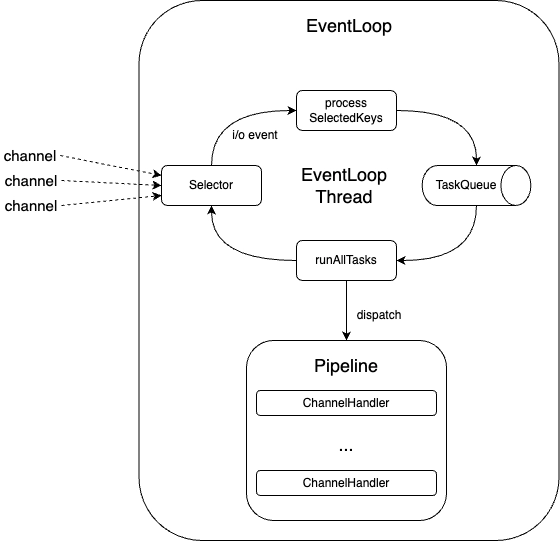

# 멀티플렉싱

먼저 TCP 소켓에 대해 이해하자.  
소켓은 네트워크에서 서버와 클라이언트, 두 개의 프로세스가 특정 포트를 통해 양방향 통신이 가능하도록 만들어 주는 추상화된 장치이다.  
`{srcIP, srcPort, destIP, destPort}`로 이루어져 있다.  
(사용하는 입장에서는) 위의 정보가 유일함이 보장된다.  
하지만 실제 구현에서는 조금 다르다. 외부적으로 알릴 IP와 Port로 소켓을 만들고 해당 소켓을 리스닝 소켓으로 등록한다.  
**리스닝 소켓으로 들어오는 클라이언트 연결 요청을 받고 수락한다면 클라이언트와 연결된 새로운 소켓이 생성된다.**  
  

  
한 개의 서버에 여러 클라이언트가 접속 요청을 보낸다면 서버는 어떻게 수용할 수 있을까?    
문제를 해결하기 위해 아래의 방법들이 있다.  
  
## 멀티프로세싱(multiprocessing) 기반 서버

**'프로세스를 다수 생성'하는 방식으로 서비스를 제공한다.**


> 부모 프로세스는 리스닝 소켓으로 accept 함수를 호출해서 연결 요청을 수락한다.  
> 이때 얻는 소켓의 파일 디스크립터(클라이언트와 연결된 연결 소켓)를 자식 프로세스를 생성해 넘겨준다.  
> 자식 프로세스는 전달받은 파일 디스크립터를 바탕으로 서비스를 제공한다.  

**단점**  
클라이언트가 연결하는 만큼 프로세스를 복사하기 때문에 리소스를 많이 사용한다.  
프로세스는 서로 독립적인 메모리 공간을 갖기 때문에 정보 교환이 어렵다.  
이 단점을 멀티스레딩으로 처리하면 해결할 수 있다.  

## 멀티스레딩(multithreading) 기반 서버

**'스레드를 다수 생성'하는 방식으로 서비스를 제공한다.**


> 메인 스레드는 리스닝 소켓으로 accept 함수를 호출해서 연결 요청을 수락한다.  
> 이때 얻는 소켓의 파일 디스크립터(클라이언트와 연결된 연결 소켓)를 별도 워커 스레드를 생성해 넘겨준다.  
> 워커 스레드는 전달받은 파일 디스크립터를 바탕으로 서비스를 제공한다.  

**단점**  
한 개의 프로세스 내에 다수의 스레드가 존재하기 때문에 하나의 스레드에서 발생한 문제가 전체에 영향을 미쳐 나머지 다수의 스레드에 영향을 끼칠 수 있다.  
일정 크기의 스레드를 생성해 풀로 관리하며 운영할 수 있지만 클라이언트의 요청마다 스레드를 무한정 생성할 수 없기 때문에 많은 수의 요청을 동시에 처리할 수 없다.  
또한 스레드들이 idle한 시간동안 불필요하게 블로킹되기에 낭비가 많다.  
  
I/O 멀티플렉싱 기법을 사용한다면 각 클라이언트마다 별도 스레드를 이용하는게 아니라,  
**하나의 스레드에서 다수의 클라이언트에 연결된 소켓(파일 디스크립터)을 관리하면서 소켓에 이벤트 (`read`/`write`)가 발생할 때만 해당 이벤트를 처리하도록 구현해서 더 적은 리소스를 사용하도록 개선할 수 있다.**  

## 멀티플렉싱(multiplexing) 기반 서버

**'입출력 대상을 묶어서 관리'하는 방식으로 서비스를 제공한다.**  
  
**입출력 다중화**란?  
하나의 프로세스 혹은 스레드에서 입력과 출력을 모두 다룰 수 있는 기술을 말한다.  
커널에서는 하나의 스레드가 여러 개의 소켓을 핸들링 할 수 있는 `select`, `poll`, `epoll`, `io_uring`과 같은 시스템 콜을 제공하고 있다.  
**그럼에도 지금까지 하나의 클라이언트에 대한 입출력만 처리할 수 있었던 이유는, 입출력 함수가 블록되면 입출력 데이터가 준비될 때까지 무한정 블록돼 여러 클라이언트의 입출력을 처리할 수 없었기 때문이다.**  
  
**I/O 멀티플렉싱 기법**을 사용하면, 비록 입출력 함수 자체는 여전히 블록하는 것으로 작동하지만, 입출력 함수를 호출하기 전에 어떤 파일에서 입출력이 준비됐는지를 확인할 수 있다.  
  
블로킹 I/O 에서는 프로세스(스레드)가 하나의 소켓에 대해 `read` 함수를 호출(시스템 콜)을 하면 데이터가 도착할 때 까지 기다린다.  
패킷이 도착하면 커널 내 버퍼에 복사되고, 이 데이터를 사용하기 위해서는 사용자 공간에 다시 복사해야 한다.  
**이 작업들이 끝날 때까지 시스템 콜이 반환되지 않는다.**  
  

  
I/O 멀티플렉싱 시스템 콜들은 여러 파일 디스크립터를 감시하여, 어떤 파일에서 읽기, 쓰기 또는 예외 이벤트가 발생했는지를 확인하는 시스템 콜이다.  
즉, 이벤트(입력, 출력, 에러)가 준비된 파일에 대해 입출력을 수행하기 때문에 **무한정 대기해야하는 블록이 발생하지 않을 것이라는게 보장된다.**  
  
1. **파일 디스크립터 준비**: 감시할 파일 디스크립터를 fd_set이라는 구조체에 등록합니다.
2. **이벤트 대기**: select 함수를 호출하여 등록된 파일 디스크립터 중 이벤트가 발생할 때까지 대기합니다.
3. **이벤트 처리**: 이벤트가 발생한 파일 디스크립터에 대해 적절한 입출력 작업을 수행합니다.
  
아래는 I/O 멀티플렉싱의 select와 epoll의 주요 차이점을 정리한 마크다운 테이블입니다.

| 특성              | select                         | epoll                                    |
|-------------------|--------------------------------|-----------------------------------------|
| **감시 대상 등록**      | 매 호출 시마다 전체 FD 집합 전달         | 한 번 등록 후 커널 내에서 유지                 |
| **이벤트 감지 방식**    | 전체 파일 디스크립터 순회 검사            | 이벤트 발생한 FD만 알림                       |
| **최대 파일 디스크립터 수** | 일반적으로 1024개 제한               | 사실상 제한 없음                             |
| **CPU 및 메모리 오버헤드** | 매 호출마다 FD 집합 복사 및 전체 검사 발생 | 변화 있는 FD만 처리, 복사 및 검사 비용 매우 적음  |
| **지원 운영체제**       | 대부분 OS 지원                   | 리눅스 커널 2.6 이상                         |
| **성능 및 확장성**      | 제한적, 대규모 연결에 비효율적         | 대규모 연결 처리에 매우 효율적                   |
| **API 복잡도**          | 단순                          | 상대적으로 복잡                              |
  
요약하면, `epoll`은 대규모 소켓 처리와 높은 효율성이 요구되는 리눅스 환경에서 `select` 대비 월등한 성능과 확장성을 제공하도록 설계된 시스템 호출이다.  
반면, select는 낮은 이식성과 확장성 문제로 인해 소규모 혹은 범용 환경에서만 주로 사용된다.  
   
Java NIO가 시스템 수준의 I/O 멀티플렉싱 기술(특히 select, poll, epoll 등)을 추상화하여 자바 개발자가 쉽게 비동기 입출력을 구현할 수 있게 해준다  

# Java NIO

## 채널과 버퍼
- kernel 버퍼를 직접 핸들링 할 수 없어 복사 오버헤드가 존재했지만, ByteBuffer가 등장하면서 개선됐다. (zero copy)
- FileChannel, DatagramChaneel, SocketChannel, ServerSocketChannel
- 채널은 양방향으로 사용하기 때문에 버퍼에 데이터를 쓰다가 이후 데이터를 읽어야 한다면 `filp()`을 호출해서 버퍼를 쓰기 모드에서 읽기 모드로 전환해야 한다.  
- `clear()`로 전체 버퍼를 지울 수 있다.
  
## 논블로킹(non-blocking) I/O
- Java NIO에서는 논블로킹 I/O를 사용할 수 있다. 
- 예를 들어, 스레드가 버퍼로 데이터를 읽어달라고 채널에 요청하면, 채널이 버퍼에 데이터를 채워 넣는 동안 해당 스레드는 다른 작업을 수행할 수 있다.  
- 이후 채널이 버퍼에 데이터를 채워 넣고 나면 스레드는 해당 버퍼를 이용해 계속 처리를 진행할 수 있다.  
- 반대로 데이터를 채널로 보내는 경우에도 논블로킹으로 처리할 수 있다.
  
## 셀렉터
- Java NIO에는 여러 개의 채널에서 이벤트(예: 연결 생성, 데이터 도착 등)를 모니터링할 수 있는 셀렉터가 포함돼 있기 때문에 하나의 스레드로 여러 채널을 모니터링할 수 있다.
- 내부적으로 SelectorProvider에서 운영체제와 버전에 따라 사용 가능한 **멀티플렉싱 기술을 선택해 사용한다**.  
- **하나 이상의 채널을 셀렉터에 등록하고 `select()`를 호출하면, 등록된 채널 중 이벤트 준비가 완료된 하나 이상의 채널이 생길 때까지 블록된다.**  
  
Java NIO에는 이 외에도 더 많은 클래스와 컴포넌트가 있지만 **채널**과 **버퍼**, **셀렉터**가 API의 핵심이다.  
  
```java
ServerSocketChannel channel = ServerSocketChannel.open();
channel.bind(new InetSocketAddress("localhost", 8080));
channel.configureBlocking(false); // 논블로킹 모드로 변경

Selector selector = Selector.open();

// 하나의 Selector는 여러 Channel을 관리할 수 있습니다
// 각 Channel마다 독립적으로 관심 이벤트(interest ops)를 설정합니다
// 이 코드는 해당 channel에 대해 OP_READ만 등록한 것입니다
SelectionKey key = channel.register(selector, SelectionKey.OP_READ); // 채널을 셀렉터에 등록
```

ServerSocketChannel을 열고 Channel에 IP와 Port를 바인딩한다.  
Selector에 Channel을 등록하고, 준비된 채널의 집합을 받는다.  

> **ServerSocketChannel**
>  - 역할: 클라이언트의 연결 요청을 **듣고(listen) 수락(accept)**하는 채널
>  - 생성: 한 번만 생성 (서버당 포트당 1개)
>  - 이벤트: OP_ACCEPT (연결 요청 감지)
>  **SocketChannel**
>  - 역할: 실제 클라이언트와 데이터를 주고받는 채널
>  - 생성: 클라이언트마다 생성 (클라이언트 수만큼)
>  - 이벤트: OP_READ, OP_WRITE (데이터 읽기/쓰기)
> **SelectionKey**
>  - 역할: Channel과 Selector의 연결 관계 표현, 관심 이벤트 관리, 핸들러 저장
>  - 생성: Channel을 Selector에 등록하는 경우 반환

```java
Set<SelectionKey> selectedKeys = selector.selectedKeys();
Iterator<SelectionKey> keyIterator = selectedKeys.iterator();
 
while(keyIterator.hasNext()) {
     
    SelectionKey key = keyIterator.next();
 
    if(key.isAcceptable()) {
        // a connection was accepted by a ServerSocketChannel.
    } else if (key.isConnectable()) {
        // a connection was established with a remote server.
    } else if (key.isReadable()) {
        // a channel is ready for reading
    } else if (key.isWritable()) {
        // a channel is ready for writing
    }
 
    keyIterator.remove();
}
```

key의 상태에 따라 분기된다.  

# Reactor 패턴 (이벤트 핸들링 패턴)

[Observer 패턴 참고](https://github.com/jdalma/footprints/blob/main/%EB%94%94%EC%9E%90%EC%9D%B8%ED%8C%A8%ED%84%B4/%ED%96%89%EB%8F%99_%EA%B4%80%EB%A0%A8.md#observer-pattern)  

> Reactor: 무한 반복문을 실행해 이벤트가 발생할 때까지 대기하다가 이벤트가 발생하면 처리할 수 있는 핸들러에게 디스패치합니다. 이벤트 루프라고도 부릅니다.  
> 핸들러: 이벤트를 받아 필요한 비즈니스 로직을 수행합니다.  
> 세부적인 구현은 상황에 맞게 변경할 수 있습니다.  
> 따라서 세부 구현 내용에 초점을 맞추기보다는 리소스에서 발생한 이벤트를 처리하기까지의 과정과, 그 과정에서 Reactor와 핸들러가 어떤 역할을 하는지 이해하는 것이 Reactor 패턴을 이해하는 데 더 많은 도움이 됩니다.
> - [예제](https://github.com/jdalma/reactor/tree/main/src/main/java/org/example)

```java
@Override
public void run() {
    try {
        while (true) {
            selector.select();
            Set<SelectionKey> selected = selector.selectedKeys();
            for (SelectionKey selectionKey : selected) {
                dispatch(selectionKey);
            }
            selected.clear();
        }
    } catch (IOException e) {
        e.printStackTrace();
    }
}
```

# EventLoop

> 이벤트 루프(event loop)는 동시성(concurrency)을 제공하기 위한 프로그래밍 모델 중 하나로,  
> 특정 이벤트가 발생할 때까지 대기하다가 이벤트가 발생하면 디스패치해 처리하는 방식으로 작동합니다.  


*출처: [Netty Deep Dive](https://mark-kim.blog/netty_deepdive_1/)*
  

**내부적으로 `Selector`를 이용해 특정 이벤트가 발생할 때까지 대기하다가 이벤트가 발생하면 적절한 핸들러로 이벤트를 전달(dispatch)해 처리하는 역할을 무한 루프로 실행해 반복하던 Reactor가 바로 이벤트 루프이다.**  

1. 이벤트가 발생하기를 대기한다.
2. 이벤트가 발생하면 처리할 수 있는 핸들러에 이벤트를 디스패치한다.
3. 핸들러에서 이벤트를 처리한다.
4. 다시 1~3 단계를 반복한다.

---

> **참고** 
> 1. [이벤트 루프를 블록하면 안되는 이유 - 파트1](https://engineering.linecorp.com/ko/blog/do-not-block-the-event-loop-part1)
> 2. [이벤트 루프를 블록하면 안되는 이유 - 파트2](https://engineering.linecorp.com/ko/blog/do-not-block-the-event-loop-part2)
> 3. [사례를 통해 이해하는 네트워크 논블로킹 I/O와 Java NIO](https://mark-kim.blog/understanding-non-blocking-io-and-nio/)
> 4. [Netty Deep Dive](https://mark-kim.blog/netty_deepdive_1/)
> 5. [Netty의 핵심 컴포넌트](https://github.com/jdalma/footprints/blob/main/Netty/%EB%84%A4%ED%8B%B0%EC%9D%98%20%ED%95%B5%EC%8B%AC%20%EC%BB%B4%ED%8F%AC%EB%84%8C%ED%8A%B8.md)
> 6. [ChannelHandler와 ChannelPipeline](https://github.com/jdalma/footprints/blob/main/Netty/ChannelHandler%EC%99%80%20ChannelPipeline.md)