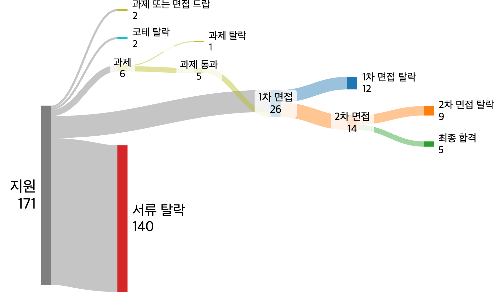
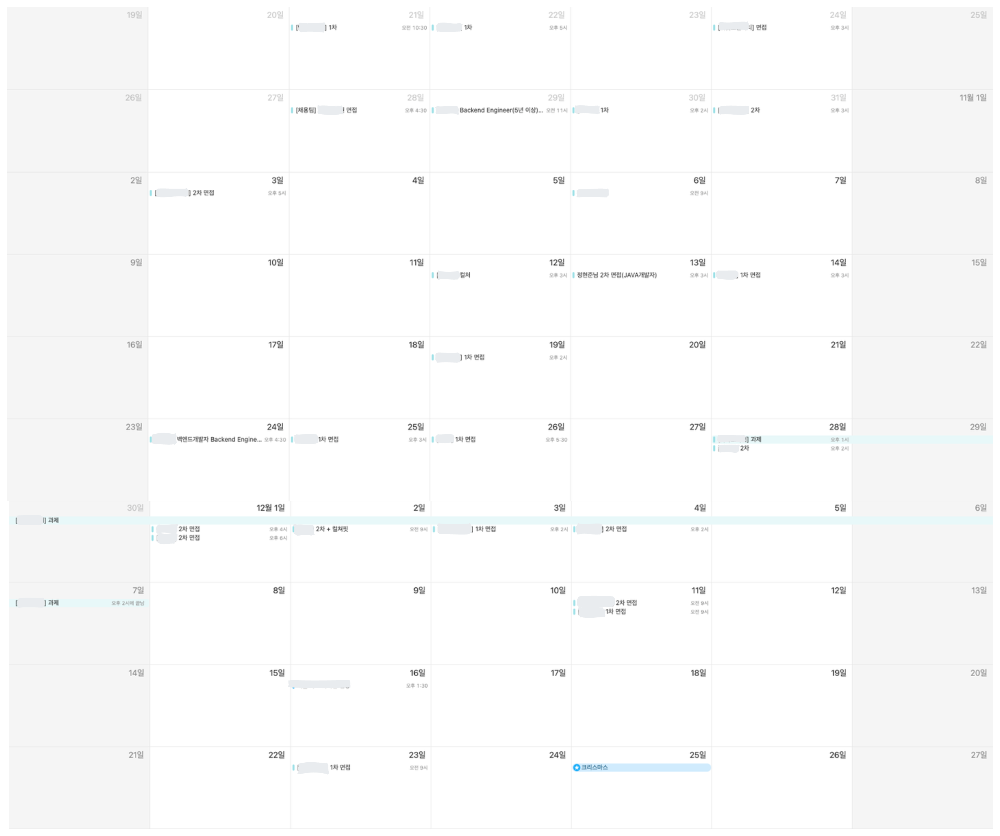
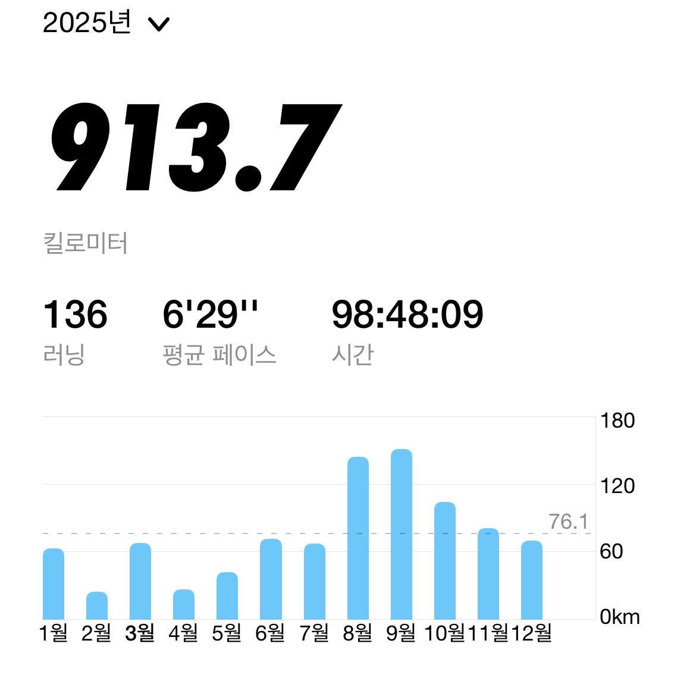
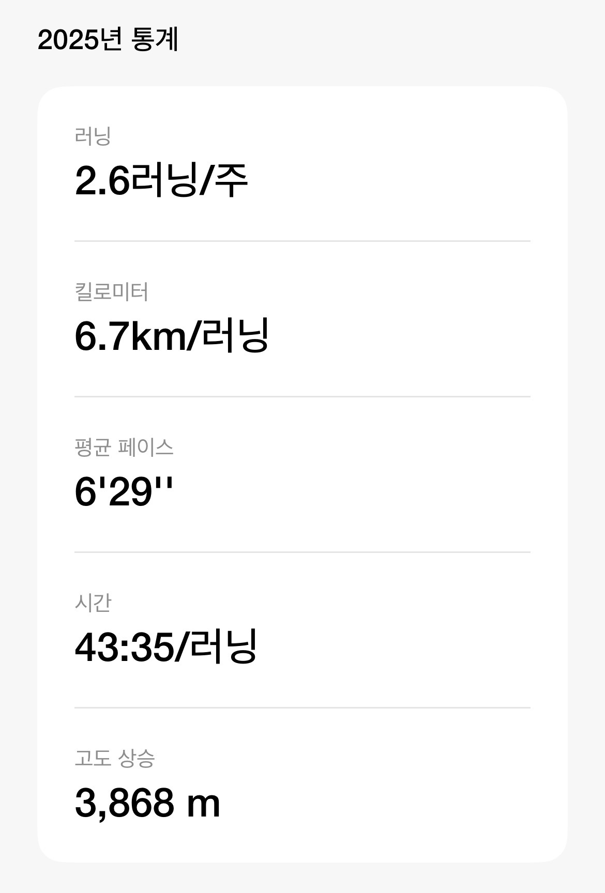
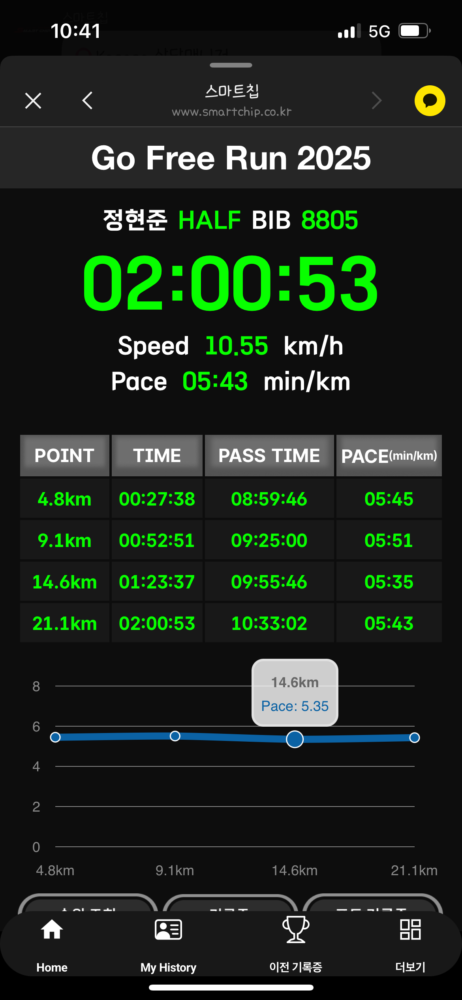

# 들어가며

올해 1월에 회사를 새로 입사하고 수습 기간을 보내느라 이제야 늦은 2025년 회고를 작성한다.  
어쩌다보니 회고를 적을 때 마다 퇴사로 시작하고 있지만.. 2025년에 배우고 느낀 점을 정리해보자.  

# 퇴사

입사한 지 9개월 만인 2025년 8월, 더스윙에서 퇴사했다.  
작년 회고에 작성한 것 처럼 입사할 때 기대했던 스윙 서비스가 아닌 스윙 바이크를 혼자 담당하게 되어 아쉬운건 사실이였지만, 퇴사 사유는 아니다.  
오히려 내가 맡은 스윙 바이크 서비스를 궤도에 올리겠다는 목표를 갖게 됐다.  
  
당시 스윙 바이크는 엑셀 시트만으로 200억이 넘는 매출을 내고 있었다. 기존에 개발된 어드민이 있긴 했지만 실무자들의 요구사항에 맞게 개발되어 있지 않아 오히려 엑셀과 어드민에 이중으로 작업해야 하는 상황이었다.  
필요한 기능이 정확하게 개발되어 있지 않고 에러가 발생해도 이를 처리해 줄 개발 담당자가 없었다. 기존 개발자들도 이미 퇴사한 뒤라 인수인계를 받을 수 있는 상황도 아니였다.  
                                       
이런 상황을 처음 들었을 때 막막하긴 했지만, 오히려 도전 욕구가 샘솟았다. 아무리 힘들어도 이 어드민을 실무자들이 실제로 사용할 수 있는 수준으로 만들고 나서 퇴사하겠다는 마음을 먹게 됐다.  
  
쉽지 않은 과정이었다. 실제로 어드민을 사용하는 담당자들은 대구에서 근무했기에 협업이 어려웠고, 바이크 구독,계약 관리라는 도메인 자체도 생소해서 이해하는 데 시간이 많이 걸렸다. 
그럼에도 결국 실무자들이 사용할 수 있는 수준의 어드민을 만들어냈고, 스윙 바이크가 업계 1위를 달성하는 데 기여할 수 있었다.  
  
맡은 서비스에만 머무르지 않으려 했다. 스윙, 디어 (공유 모빌리티 서비스), IoT 파이프라인, 인프라에도 꾸준히 관심을 가졌다.  
해당 업무를 경험할 기회를 달라고 팀장님께 자주 어필했고, 이슈나 장애가 발생하면 새벽에도 나타나 어깨너머로 배우며 도움을 주기도 했다.  
다행히 바이크에 신규 IoT 모델을 추가하는 작업을 맡게 되면서 IoT 인프라를 경험하고 이해할 수 있었다.  
  
바이크 어드민을 궤도에 올리고 IoT 작업까지 경험하면서부터 다른 서비스와 회사에 조금씩 눈이 갔다.  
더스윙에서는 기술적 의사결정 대부분을 혼자 진행하다 보니, 협업의 밀도가 높고 도메인 복잡도가 큰 서비스를 경험하고 싶다는 갈증이 생겼다.  
이전부터 돈을 다루는 커머스나 핀테크 서비스에 관심이 있었기에 이직을 준비하기로 마음먹었다.  
회사를 다니면서 면접을 여러 차례 봤지만, 실무와 면접 준비를 같이 하기에는 어느 한 개에도 집중할 수 없었다.  
결국 퇴사 후 내가 원하는 도메인과 서비스에 온전히 집중하며 준비하기로 결심했다.  

# 스타트업에서 성장한 것

더스윙은 근무 강도가 높고 직설적인 피드백이 오가는 회사였다. 쉬운 환경은 아니었지만, 좋은 동료들 덕분에 힘든 만큼 값진 경험을 할 수 있었다.

1. **사업적 이해**
   - 실무자들과 협업하면서 지금 당장 필요한 기능이 무엇인지 파악하고, 가장 적은 비용으로 가장 큰 효과를 줄 수 있는 기능을 개발하는 게 나의 임무였다.
   - 이런 환경에서 일하다 보니 내가 개발하는 기능이 어떤 문제를 해결하는지, 지금 가장 급한 문제가 맞는지를 자연스럽게 따지게 됐고, 실무자들의 업무 흐름을 더 깊이 이해하게 됐으며 내가 누구를 위해 존재하는지 다시 생각하게 된 계기였다.
   - 이 경험을 통해 **결국 사업이 존재해야 개발이 존재할 수 있다**는 걸 깨달았다.
2. **문제를 해결하는 방법**
   - 문제를 해결하다 보면 새로운 문제를 맞닥뜨리는 경우가 많다. 새로운 문제에 빠져들면 병목이 생기거나 원래 풀려던 문제가 뭐였는지 방향을 잃기 쉽다.
   - 스윙에서는 해결해야 할 본질적인 문제를 먼저 확실하게 이해하는 습관이 생겼다. 새로운 문제가 나타나면 왜 발생했는지, 지금 해결해야 하는 건지, 애초에 진짜 문제가 맞는지, 가장 빠르게 해결할 방법은 뭔지를 따져보게 됐다.
   - 이런 사고방식 덕분에 오버엔지니어링을 피하면서 사업적 임팩트를 빠르게 낼 수 있었다. (물론 그 반대로 기술 부채가 빠르게 쌓이는 구조이기도 했다.)
3. **몰입의 가치**
   - 주 5일 기준 60~70시간 정도를 9개월간 일했다. 자연스럽게 집,회사를 반복하면서 문제를 해결하기 위한 고민을 많이 했다.
   - 그때는 힘들었는데, 지금 돌이켜보면 몰입 자체를 즐겼던 것 같다. 업무에 대한 체력과 고통을 견디는 역치가 확실히 높아졌다.
   - 일이 일처럼 느껴지지 않는 순간도 있었다. 문제를 풀어내는 재미를 알게 된 시간이었다.
4. **책임감**
   - 혼자 서비스를 맡다 보니 자연스럽게 프로덕트에 대한 책임감이 생겼다.
   - 빠른 개발 속도 탓에 기술 부채가 쌓였고, 코드 퀄리티나 아키텍처 개선, 사용자에게 치명적인 결제 에러 수정 등을 주말이나 공휴일, 개인 시간을 할애하며 처리했다.
   - 이런 개선 내용을 주변에 공유하고 혼자서 마무리까지 해내면서 보람을 많이 느꼈다.

더스윙에서 좋은 인연도 만나게 됐고, 개발자로서 직업을 대하는 자세도 배울 수 있었던 시간이었다. 퇴사하면서도 감사한 마음이 컸다.

# 취업 준비

퇴사하고 본격적으로 취업 준비를 시작했다. 세 번의 이직을 하면서 항상 최종 면접을 통과한 첫 번째 회사에 입사해왔기에, 이번에는 여러 회사에 붙어보고 직접 골라서 가보고 싶었다.  
  
가장 먼저 한 일은 실무에서 장애를 해결하면서 깊게 파보지 못했던 부분들을 딥다이브하는 것이었다.

1. 코루틴 딥다이브
2. 네트워크 통신 에러 딥다이브
3. DBCP 풀사이즈 튜닝하기
4. MySQL 실험해보기

이렇게 정리한 내용들은 기술 면접에서 실제로 질문을 많이 받았고, 딥다이브하는 습관과 능력을 긍정적으로 평가해주시는 분들이 많았다.  
2025년 4월부터 꾸준히 지원하면서 총 171개를 지원했다.  

11월 말부터 12월 초까지는 면접이 몰려서 체력적으로 굉장히 힘든 기간이었다.

최종적으로 5개 회사에 합격했다.

1. **A회사, B회사** : 도메인이 흥미로워 지원했지만, 1차·2차 면접에서 의미 있는 대화를 많이 나누지 못해 입사를 포기했다.
2. **C회사** : 3차 면접까지 있는 회사였는데, 1차를 통과한 뒤 2·3차를 하루에 몰아서 5시간 정도 봤다. (도중에 식사 시간이 있어서 김밥도 사주셨다.)
   - 협업할 모든 팀의 인원과 면접을 봐야 했다. 그런데 마지막 3차에서 인사 팀장님과의 면접이 굉장히 불쾌해서, 최종 합격 전화를 받았을 때 입사를 포기하겠다고 말씀드렸다.
   - 전화를 주신 개발 팀장님이 나를 많이 마음에 들어해주셔서 아쉬웠고, 나중에 생각이 바뀌면 다시 연락 달라고 해주셔서 감사했다.
3. **D회사** : 마지막까지 정말 고민한 회사다. 관심 있던 도메인이었고 트래픽이나 기술적 복잡도도 높았다.
   - 뛰어난 동료들이 많아 보였고, 백엔드 개발자들의 재직 기간도 길어서 개발자 만족도가 높은 회사로 느껴졌다.
   - 입사를 고민하고 있다고 하니 인사팀에서 백엔드 팀장과 직접 통화할 수 있게 연결해주기도 했다.
   - 하지만 정리해고를 진행한 적이 있었고, 손익분기점을 이제 막 넘겼다는 점, 그리고 도전적인 업무를 할 수 있을 것 같은 느낌이 들지 않아 입사를 포기했다.
4. **E회사** : 평소 관심 있던 도메인이었고, 면접에서부터 도전적인 업무를 진행하고 있다고 말씀해주셔서 입사를 결정했다.

퇴사라는 선택이 무모할 수도 있었지만, 4개월간 열심히 준비한 보람이 있었다.  

# 런닝

올해는 회사 일이 바빠서 많이 못 뛰었는데, 퇴사 이후에 자주 뛰면서 평균 주 2회까지 끌어올렸다.
회사에서 주말 사내 스터디를 만들었는데, 이때 팀원들을 런닝으로 꼬셔서 주말에 1번이라도 꾸준히 뛴 게 도움이 됐다.

마라톤 대회는 5번 정도 나갔는데, 기록 사진을 캡처해놓지 않아서 그나마 캡쳐해놓은 하프 대회 기록을 올린다.

확실히 체중이 안 줄어서 그런지 기록이 크게 좋아지지 않는 것 같다. 그래도 3년 동안 꾸준히 달리고 있는 것에 만족한다.

# 총평

2024년에 작성한 2025년 목표를 얼마나 달성했을까

1. [ ] 풀코스 완주하기
2. [ ] 러닝 마일리지 총 1000km 쌓기 → 913km로 87km 부족하다.
3. [ ] 책 30권 읽기 → 5권 밖에 못 읽었다.
4. [ ] 인프런 강의 5편 이상 보기 → 필요한 부분만 뛰엄뛰엄 봐서 완강은 한 개도 못했다.
5. [ ] 사람들 앞에서 기술 발표 해보기 → 딱히 발표한 적은 없는 것 같다.
6. [ ] 월에 1개씩 기술 블로깅하기 (총 12개) → 총 8개 작성해서 4개 부족하다.
7. [x] 회사에서 내가 맡은 서비스는 무조건 해내고, 다른 서비스도 업무 처리하기 → 완수했다!
8. [ ] (개인적으로) 사내 개선 태스크 10개 만들어서 해내기 → 10개는 아니고 3,4개 정도 한 것 같다.
9. [x] 도전을 두려워 하지 말기 → 퇴사와 취업준비에 도전하여 취업하였으니 완수했다!
10. [ ] (간단한) 서비스 만들기 → 생각만하고 실천을 못 했다.
  
# 느낀점

요즘 AI의 발전에 따라 개발자의 역할이 변하고 있다는 걸 체감하고, FOMO도 함께 느끼고 있다.  
IDE를 사용하는 시간이 줄어들고 직접 코드를 작성하는 비중이 줄면서, 개발자의 무게중심이 더 거시적인 방향으로 이동하고 있다고 본다.  
  
아직은 개발 지식이 없는 사람이 일정 수준 이상의 복잡도를 가진 애플리케이션을 만드는 데 한계가 있다.  
코드베이스를 이해하지 않아도 되고, 고가용성과 내결함성에 대한 지식 없이도 적절한 트레이드오프를 알아서 잡아주는 AI가 나온다면 개발 지식이 정말 필요 없어질 수도 있다.  
하지만 아직까지는 개발자의 업무 범위가 달라지고 있을 뿐, 역할 자체가 사라질 단계는 아니다.  
  
겁먹고 움츠러들기보다는 더 열심히 뛰어들고 많이 경험해봐야 한다고 생각한다. (꽤 재밌다고 생각한다.)  
회사에서 에이전틱 코딩 TF 리드를 맡게 됐는데, 이 기회에 더 열심히 할 명분도 생겼다.  
  
하던 대로 꾸준히 노력하자.

## 2026년 목표

1. 러닝 마일리지 총 1000km 쌓기
2. 책 20권 읽기
3. 사람들 앞에서 기술 발표 해보기
4. 올해 6개 기술 블로깅하기
5. 회사에서 내가 맡은 서비스는 무조건 해내고, 다른 서비스도 업무 처리하기
6. 사내 개선 태스크 10개 만들어서 해내기
7. 도전을 두려워 하지 말기
8. (간단한) 서비스 만들기
