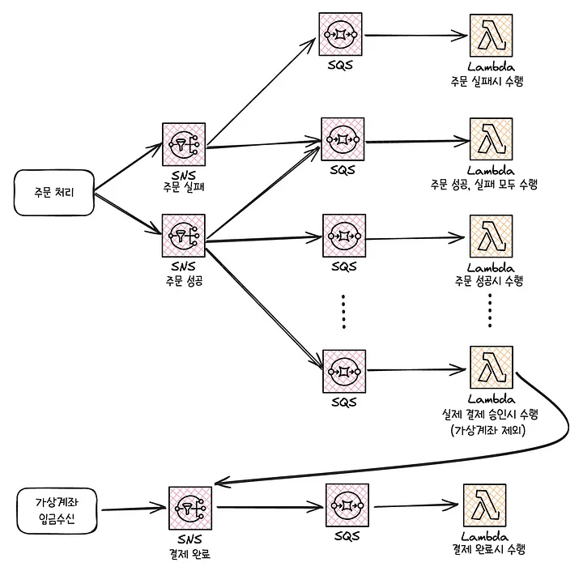

# 올리브영 기술 블로그 : 비동기 요청-응답 패턴으로 풀어낸 발주 서비스 개발기

동기적으로 처리되는 API로 인해 너무 느린 문제와 다른 서비스에서 해당 API를 호출해야 할 상황이 발생했다.  
유연하게 해결하기 위해 카프카를 이용한 비동기 아키텍처를 고민해본 내용이다.  
(카프카를 썻을 때 장점 `메세지 유실 방지`, `재시도 정책/실패 대처`, `분산 처리로 인한 성능 향상`)  
  
- **request-reply 아키텍처**
  - Requestor : 요청 메세지를 보내고, 응답 메시지를 기다린다.
  - Supplier : 요청 메시지를 받아서 응답 메세지를 보낸다.
  - 요청자는 Point-to-Point나 Publish-Subscribe 채널로 구성한다.
  - 응답자는 대체로 응답 데이터를 브로드캐스팅 할 필요가 없으므로 Point-to-Point로 한정되는 것이 일반적이다.
  - **응답 처리 방식**
     - 동기 블록 방식 : 요청자가 응답을 받을 때까지 대기
     - 비동기 콜백 방식 : 요청을 보낸 후 콜백을 등록하고, 별도의 스레드가 응답 메시지를 대기
- **async-request-reply 아키텍처**
  - 클라이언트가 백엔드에 작업을 요청하고, 즉시 응답 받은 뒤 나중에 결과를 확인할 수 있도록 하는 구조
  - 클라이언트가 요청하면 서버는 작업을 큐 등에서 비동기로 처리하고, 응답(202 Accepted)을 통해 “작업 접수됨”을 안내
  - Location 헤더와 Retry-After 헤더를 통해 결과를 조회할 수 있는 엔드포인트와 폴링 주기를 전달하는 방법
  - 클라이언트의 최초 요청에 자원을 조회할 수 있는 식별자를 반환할 수 없는 구조라면 이 아키텍처는 못함

request-reply 아키텍처를 지원하는 카프카에서 제공하는 ReplyingKafkaTemplate을 사용하면 쉽게 구현 가능하지만, 요청 정보를 메모리에 올려놓고 사용하기 때문에 유실 가능성이 있다.  
  
두 아키텍처를 합쳐서 해결했다고 한다.  

1. 클라이언트(백오피스 등)가 발주 요청을 API로 전송하면,
2. 서버는 **요청 이력 ID(예: 전표번호 또는 요청키)**를 생성해 DB에 저장한 뒤,
3. 즉시 요청 이력 ID를 응답으로 반환한다.
4. 이후, 실제 발주,검증 등 비동기 처리는 내부적으로 Kafka Consumer에서 진행되어, 처리 결과(성공/실패 등)가 DB에 업데이트된다
5. 클라이언트는 요청 이력 ID를 활용해 `요청 결과 조회 API`를 호출하여, DB에 반영된 처리 결과(진행 상태, 성공여부, 실패 사유 등)를 안전하게 확인한다.

발주 처리에 성공하게 되면 Reply Topic에 공급되고, 실패되면 Dead Letter Topic에 공급되어 DLT Listener가 슬랙 알림/실패 이력 적재 등 처리 후 다시 Reply Topic에 공급한다.  
의아한 점은 클라이언트는 Reply Topic에 의해 응답을 받는것이 아니라 API Polling으로 결과를 조회하는데 Reply Topic이 왜 존재하는지 의문이다.  


# 코틀린 코루틴

실무에서 코루틴 장애를 경험하게 되어서 원인을 확실히 이해하고 코루틴을 확실히 짚고 넘어가고 싶어 읽어보았다.  
[API가 왜 멈췄을까? 코루틴 이해하기](https://jdalma.github.io/2025y/coroutinescope/)글을 참고하라.  
  
단순히 사용하는 방법만 알려주지 않고 코루틴의 메커니즘까지 설명해줘서 좋았다.  
실제로 어떻게 중단되고 재개되는지 알 수 있고, 이 중단 함수를 통해서 스레드를 어떻게 효율적으로 사용하게 되는지 이해할 수 있게 됐다.  

1. Continuation 메커니즘
2. CoroutineScope, CoroutineBuilder
3. CoroutineContext (Job, Dispatchers)
4. Job을 통한 예외 전파

어떤 원리로 성능이 개선된건지 몰라서 답답했는데 이 책을 읽고 안개가 조금 걷힌 느낌이다.  
추가로 Sequnece, Channel, Flow도 설명하기에, 코틀린을 효과적으로 사용하고 싶다면 꼭 읽어야 할 책이다.  

# 무신사 기술 블로그: 무진장 힘들었지만 무진장 성장한 개발 이야기

> 이벤트 피크 타임의 **분당 매출 1억 원, 분당 주문 약 1만 건**을 안정적으로 처리하는 것  
> 이벤트 전시 페이지에만 **분당 약 400만 건의 요청(RPM**, Requests Per Minute**)** 초로 환산하면 대략 약 6만 7천 건의 요청(RPS, Requests Per Second)
> [무진장 힘들었지만 무진장 성장한 개발 이야기](https://medium.com/musinsa-tech/%EB%AC%B4%EC%A7%84%EC%9E%A5-%ED%9E%98%EB%93%A4%EC%97%88%EC%A7%80%EB%A7%8C-%EB%AC%B4%EC%A7%84%EC%9E%A5-%EC%84%B1%EC%9E%A5%ED%95%9C-%EA%B0%9C%EB%B0%9C-%EC%9D%B4%EC%95%BC%EA%B8%B0-e445888579a9)

<h2>첫 번째. 전시 페이지</h2>

막대한 읽기(Read) 트래픽을 효율적이고 안정적으로 처리하면서, 핵심적인 **쓰기(Write)** 작업인 주문 시스템을 보호하는 것이 목표

1. **읽기(Read)와 쓰기(Write)의 분리, CQRS 아키텍처 도입**
   - 모놀리식 구조에서는 이벤트가 시작되면 대량의 읽기 요청으로 인해 커넥션 풀이 고갈되어 중요한 쓰기 작업(주문 처리) 불가능해지고 전체 서비스가 마비되는 상황이 반복되었다.
   - 이 문제를 `CQRS` 패턴으로 해결하려 한다.
   - Redis를 이용하여 이벤트에 필요한 모든 상품 데이터(상품명, 가격, 할인가, 이미지 URL 등)를 사전에 가공하여 **머티리얼라이즈드 뷰(Materialized View)** 형태로 별도의 조회 전용 데이터 저장소를 사용한다.
   - 읽기 모델의 **최종적 일관성**은 CDC로 해결. 이로 인해 발생하는 몇 초간의 데이터 지연은, 서비스 전체가 마비될 수 있는 위험을 감수하는 것보다 훨씬 합리적인 비즈니스 **트레이드오프(Trade-off)**
2. **Redis 데이터 압축 최적화**
   - Redis 도입으로 데이터베이스 병목은 해결했지만, 엄청난 양의 데이터 이동으로 인해 **네트워크 대역폭** 과 **Redis 메모리** 사용량 문제가 발생했다.
   - 그렇기에 압축 최적화를 진행, 압축률과 압축/압축해제 속도, CPU 사용률들을 고려해서 압축률이 약간 낮지만 압도적으로 빠른 압축 해제 속도와 낮은 CPU 점유율 → LZ4 알고리즘
3. **캐시 전략**
   - **콜드 스타트** : 캐시가 **완전히 비어있는 상태**에서 시작되어, 초기에는 모든 요청이 캐시 미스(Cache Miss)가 발생하는 문제
   - **캐시 스템피드** : 인기 있는 캐시 키가 **동시에 만료**되었을 때, 여러 요청이 **동일한 데이터를 동시에 조회**하면서 모두 DB에 접근하는 현상
   - 예방 방법 : 캐시 워밍 업, 캐시 만료 시간 분산, 확률적 TTL 갱신, 다단계 캐시, DB 쿼리 비용이 락 대기 비용보다 비싸다면 분산 락도 고려해볼만 함, 멀티 버전 캐시 → 핵심은 일관성을 어느정도로 허용할 수 있는지가 중요하다.
   - **이벤트 시작 수십분 전, 예열 스크립트를 실행하여 가공된 최종 데이터를 캐시에 미리 채워놓기로 해결**

<h2>두 번째. 주문/재고/쿠폰 시스템 고도화</h2>

> [**나야, 주문 - 주문시스템의 도전과 성장 이야기**](https://medium.com/musinsa-tech/%EB%82%98%EC%95%BC-%EC%A3%BC%EB%AC%B8-%EC%A3%BC%EB%AC%B8%EC%8B%9C%EC%8A%A4%ED%85%9C%EC%9D%98-%EB%8F%84%EC%A0%84%EA%B3%BC-%EC%84%B1%EC%9E%A5-%EC%9D%B4%EC%95%BC%EA%B8%B0-744b4bece5b8)

<h3>문제점</h3>

하나의 데이터베이스를 공유하는 모놀리식 아키텍처 한계에 부딪혔다.

1. 주요 도메인들이 하나의 어플리케이션 내에 통합되어 있었기 때문에 복잡하고 유지보수하기 어렵다.
2. DB 의존도가 높아 이벤트로 인해 쓰기 요청이 몰리면 서버가 다운되는 일이 잦았다.
   - 주문 시 재고 처리를 위해 DB Lock으로 인한 병목도 존재함

<h3>개선 내용</h3>

1. 지속적인 모니터링으로 슬로우 쿼리 개선
2. 레디스 분산 락으로 DB Lock 방식의 한계를 극복
   - 읽기 요청은 스케일 아웃을 통해 문제를 해결할 수 있었지만, 쓰기 요청은 여러 도메인에서 한 데이터베이스를 사용했기에 쓰기 요청에 대한 병목은 계속 존재함
3. 일반 MVC 구조에서 DDD 구조 도입

<h3>MSA 도입</h3>

주문 시스템은 여러 비즈니스와 연계되어 있어 API 통신의 안정성과 트랜잭션 일관성을 유지할 수 있는 설계가 필수적이였다.

- **장애 전파 방지 및 SAGA 패턴을 통한 분산 트랜잭션 관리**
   - MSA로 전환하면서 많은 기능이 DB 기반에서 API 중심으로 변경되면서, 특정 API 서비스에 장애가 발생하면 다른 서비스로 전파되는 문제가 있었다.
   - 이때 서킷 브레이커 패턴을 적용하여 장애가 발생한 서비스에 대한 호출을 차단했다.
   - 데이터 일관성은 SAGA 패턴으로 실패 보상 트랜잭션을 활용하여 서비스간 의존도를 줄이고, 확장성과 안정성을 강화할 수 있었다.



- **이벤트 기반 아키텍처로의 도약, 리소스 분산**
  - 주문 처리의 성능 최적화를 위해 필수 수행 영역과 비필수 수행 영역을 구분하여, 비필수 영역은 SNS, SQS, Lambda 비동기 처리로 전환했다.
  - SNS → (팬아웃) SQS 구독 → 람다
  - **메세지 중복 문제 (멱등성 설계 필요)**
    - 람다 메세지 중복 문제는 Redis의 SETNX를 사용하여 분산 락을 통해 중복 메세지를 방지
  - 오류 처리와 장애 대응을 위해 DLQ를 연결

결과적으로 주문 처리 시스템의 안정성과 성능은 크게 개선되었지만, 이후 연계된 서버리스 기능들에 대해 모니터링과 트러블슈팅 복잡성이 증가하는 새로운 고민이 생김

- **Kafka 도입**
  - 비동기 유즈케이스가 추가될 때 마다 람다가 계속 늘어나서 모니터링과 트러블 슈팅 복잡성이 증가했다.
  - 카프카를 도입하여 람다 컨슈머를 자바 컨슈머로 변환했다.

<h2>세 번째. 실시간 재고 시스템의 안정성 및 확장성 강화</h2>

> [**재고 서비스의 진화와 혁신: 지속적인 개선을 통한 안정성과 확장성 강화**](https://medium.com/musinsa-tech/%EC%9E%AC%EA%B3%A0-%EC%84%9C%EB%B9%84%EC%8A%A4%EC%9D%98-%EC%A7%84%ED%99%94%EC%99%80-%ED%98%81%EC%8B%A0-%EC%A7%80%EC%86%8D%EC%A0%81%EC%9D%B8-%EA%B0%9C%EC%84%A0%EC%9D%84-%ED%86%B5%ED%95%9C-%EC%95%88%EC%A0%95%EC%84%B1%EA%B3%BC-%ED%99%95%EC%9E%A5%EC%84%B1-%EA%B0%95%ED%99%94-cb851f1ff782)

1. 사용자 인증, 재고확인, 결제완료확인 등 최소한의 필수 검증만 수행한 뒤, 주문완료 이벤트를 Kafka 토픽에 발행
2. 그리고 즉시 사용자에게는 ‘주문이 완료되었습니다’라는 화면을 보여줍니다. 사용자는 빠른 시간에 쾌적한 응답
3. 그 후, ‘재고’, ‘쿠폰’, ‘결제’, ‘알림’ 등 각각의 마이크로서비스들이 주문완료 이벤트를 구독(subscribe)하여 각자의 역할을 비동기적으로, 그리고 독립적으로 수행
  
한정된 수량의 상품을 구매하기 위해 수천, 수만 명의 사용자가 동시에 몰릴 때, 단순한 `UPDATE inventory SET quantity = quantity - 1` 쿼리는 데이터베이스의 락 경합(Lock Contention)과 데드락(Deadlock)을 유발하며 시스템 전체를 마비시키는 주범이 된다.  
성능과 데이터 정합성을 모두 지키기 위해 **다층 방어** 전략을 구축했다.  
  
- **1차. 캐시 계층 : Redis를 활용한 비관적 재고 검사**
  - 사용자의 구매의사가 확정되지 않은 상태(장바구니에 담거나 주문서 페이지에 진입하는 경우)는 레디스의 원자적 연산을 통해 관리
  - 구매 가능성이 낮은 대다수의 트래픽을 효과적으로 걸러냄
  - Redis의 데이터 타입은 hash를 이용하였으며 hash를 이용할 경우 장점은 스캔 시 value도 함께 조회하여 데이터 조회에 O(n)으로 처리 가능
  - Redis에 적재한 재고 데이터는 데일리 대사를 진행하고 병렬처리 방식으로 전체 재고의 대사를 진행
  - INCR/DECR을 활용하여 stock:product_sku_123과 같은 키의 값을 관리
- **2차. 분산락 : Redlock을 이용한 임계 영역 보호**
  - 사용자가 최종적으로 ‘결제하기’ 버튼을 눌러 구매 의사를 확정한 순간, 이제는 데이터 정합성을 보장해야 한다.
  - 데이터베이스 재고를 차감하는 코드 블록을 분산 락으로 감싸놓았기에, 사용자가 결제하기 버튼을 눌러 구매 의사를 확정한 순간 특정 상품에 대한 락을 획득한 스레드만이 코드 블록에 진입할 수 있도록 했다.
  - 이를 통해 동일 상품에 대한 동시 재고 차감 시도를 직렬화하여, 레이스 컨디션(Race Condition)을 원천적으로 방지한다.
- **3차. 데이터베이스 계층 : 낙관적 락을 통한 최종**
  - 분산 락이 완벽하게 동작하지 않을 가능성은 언제나 존재하기에 낙관적 락을 사용
  - 실패한다면 재시도할 수 있도록 처리

<h2>네 번째. 대용량 트래픽을 위한 쿠폰 시스템 개선</h2>

> [**무신사 성장과 함께 거대해져온 600줄짜리 쿠폰 쿼리와의 아름다운 이별**](https://medium.com/musinsa-tech/%EB%AC%B4%EC%8B%A0%EC%82%AC-%EC%84%B1%EC%9E%A5%EA%B3%BC-%ED%95%A8%EA%BB%98-%EA%B1%B0%EB%8C%80%ED%95%B4%EC%A0%B8%EC%98%A8-600%EC%A4%84%EC%A7%9C%EB%A6%AC-%EC%BF%A0%ED%8F%B0-%EC%BF%BC%EB%A6%AC%EC%99%80%EC%9D%98-%EC%95%84%EB%A6%84%EB%8B%A4%EC%9A%B4-%EC%9D%B4%EB%B3%84-e689d7d932b5)

이 600줄 쿼리는 사용자와 장바구니에 담긴 상품들에 대해 적용 가능한 모든 쿠폰을 실시간으로 계산하는 로직  
사용자 정보, 상품, 브랜드, 카테고리, 프로모션 등 수많은 테이블을 `JOIN`하는 이 쿼리는 이벤트 기간에 어김없이 데이터베이스 CPU 사용률을 100%로 치솟게 만드는 주범  
상품 상세 페이지에서 최적의 쿠폰을 실시간으로 제공해야하는 요구가 생기면서 이 쿼리를 개선해야 했음  

**‘실시간 계산’에서 ‘사전 계산(Pre-computation)’으로의 전환 작업**

1. **쿠폰 인덱서(Coupon Indexer) 도입**
   - 쿠폰 발급, 프로모션 생성, 사용자 등급 변경 등 쿠폰 적용 조건에 영향을 미치는 모든 이벤트가 발생할 때마다 이를 감지하여 동작하는 백그라운드 서비스를 만듦
   - 이 인덱서는 모든 쿠폰의 적용 규칙을 미리 분석하고 인덱싱하는 역할을 한다.
2. **Redis를 활용한 머티리얼라이즈드 뷰**
   - 인덱서의 계산 결과는 Redis에 단순하고 비정규화된 데이터 구조로 저장된다.
   - 예를 들어, 특정 쿠폰을 사용할 수 있는 사용자 ID 목록을 담은 `Set` (`coupons:id:applicable_users`),
   - 특정 상품에 적용 가능한 쿠폰 ID 목록을 담은 `Set` (`products:id:applicable_coupons`) 등을 미리 만들어 둡니다.
   - 변화가 많지 않고 자주 요청되는 데이터는 캐시된 정보를 사용하도록 변경 (쿠폰 유형, 회원 등급)
3. **연산의 주체 변경** : DB 연산을 최소화하고 애플리케이션으로 변경
   - Redis에 몇 번의 간단한 Set 연산을 통해 적용 가능한 모든 쿠폰 목록을 정확하게 찾아낼 수 있도록 한다.

## 생각해볼 점

1. CQRS를 통해 읽기 부하를 분리하였지만 추가적인 고민은 더 있었다.
   - 최종적 일관성 지키기
   - 네트워크 대역폭과 메모리 이용량
   - 캐시 전략
2. 람다로 EDA와 비슷한 비동기를 구현하였지만 관리 포인트가 너무 많이 늘어났기에 카프카로 변경했다.
   - 메세지 중복 문제 해결 → 멱등성 설계(DB 제약조건 등), 분산 락
   - 메시지 유실 또는 오류, 장애 대응을 위한 추가적인 방법 → 아웃박스 패턴, DLQ, 공급/소비 전략 설정, 사가, 이벤트소싱
3. 분산 락과 원자적 연산으로 동시성 지키기
   - Lettuce의 SETNX
      - 키 존재 여부 확인 → 존재하지 않으면 값 설정
      - 이 작업은 중간에 다른 작업이 끼어들 수 없도록 원자적으로 실행된다.
   - 원자적인 HINCRBY를 활용해도 가능하지 않나?
4. 레디스의 재고 데이터 유실은 어떻게 대응할 수 있나?
   - RDS? AOF?
6. 레디스와 RDB에 재고를 양쪽에서 관리하는 경우 동기화를 어떻게 할 것인가?
   - 레디스의 재고를 성공적으로 차감한 후에 결제를 완료하지 못 했다면 재고 증가는 어떻게 처리할 것인가?
   - 결제를 완료하지 못해 재고를 증가시키는 처리와 사용자의 결제 시도 처리가 겹친다면?
6. CQRS용 머티리얼라이즈드 뷰와 일반적인 캐싱은 목적과 동작 방식이 다르다.
   - CQRS : 쓰기 시점에 읽기용 데이터 미리 준비
      - `[쓰기 요청] → [Command 처리] → [이벤트 발행] → [뷰 갱신] (Redis에 읽기용 데이터 저장)`
      - 읽기/쓰기 모델 완전 분리
      - 복잡한 비즈니스 로직을 뷰에 미리 반영하기 때문에 맞춤형 뷰를 제공
   - 일반 캐싱 : 읽기 시점에 성능 향상을 위한 임시 저장
      - `[읽기 요청] → [캐시 확인] → [미스 시 DB 조회] → [캐시 저장]`
      - 쉽게 적용 가능하며, TTL로 자동 일관성 관리
7. 사전 계산을 적용한다면 쿠폰이나 프로모션이 추가되면 모든 사용자의 적용 여부를 계산하여 레디스에 저장해놓는다.
8. 분산 락으로도 완전한 재고 일관성을 지킬 수 없다.
   - 계층별로 락을 구현

# 보상 트랜잭션으로 분산 환경에서도 안전하게 환전하기

> [토스ㅣSLASH 24 - 보상 트랜잭션으로 분산 환경에서도 안전하게 환전하기](https://www.youtube.com/watch?v=xpwRTu47fqY)

양방향 무료 환전! MSA 환경에서 서로 데이터베이스도 다르게 보고 있을 때 트랜잭션을 어떻게 지켜내야할까?

<h3>분산 트랜잭션</h3>

1. **2PC**
   - Commit 가능 여부를 질의 (Voting)
   - DB가 가능하다고 응답, 한 개라고 불가능하다고 응답한다면 이전 작업들을 모두 롤백한다.
   - 강한 일관성, 낮은 가용성, 낮은 확장성
2. **사가 패턴**
   - 각 서비스의 작은 트랜잭션들을 실행하면서 진행
   - 특정 단계에서 실패하면 보상 트랜잭션 실행
   - **높은 가용성, 높은 확장성, 중간 상태가 노출되고 보상 트랜잭션 구현을 필요로 한다.**
   - **코레오그래피 사가**
      - 중앙제어자 없이 메세지 브로커를 통해 이벤트를 교환하는 방식 
      - 단일장애지점이 없고 각 서비스가 느슨하게 결합됨
      - 하지만 현재 진행중인 트랜잭션의 상태를 추적하거나 디버깅하기 어렵다.
   - **오케스트레이션 사가**
      - 중간제어자가 직접 서비스에게 트랜잭션과 보상 트랜잭션을 명령하는 방식
      - 중간제어자가 단일장애지점이 되고 모든 서비스들이 결합된다.
      - 하지만 현재 진행중인 상태를 추적하기가 쉽다.
3. **예외 핸들링**
   - 정상적인 실패 : 잔액 부족, 계좌해지, 거래제한
   - 비정상적인 실패 : 서버에러, 타임아웃
4. **배지 재처리**
   - 환전 지연 이벤트를 발행하지도 못하고 서버가 죽은 경우 배치를 통해 ‘출금 취소’ → ‘환전 실패’ 처리
5. **결과적 일관성**
   - 출금 취소에 실패한다면 CDL에 적재하여 지정한 횟수만큼 재시도 한다.
   - 그래도 실패한다면 개발자가 직접 개입하여 DL 서버를 통해 다시 메시지를 발행한다.
6. **DB: State Path**
   - 이벤트 조율을 오케스트레이터로 관리하기 때문에 매 상태를 확인하여 중간에 멈춘 환전을 알림으로 보낸다.
7. **트랜잭셔널 메세징**
   - 입금 실패로 인한 환전 실패 처리와 출금 취소 메세지 발행은 항상 같이 이루어져야 한다!  
   - 즉, 로컬 트랜잭션 커밋과 메세지 발행이 원자적으로 이루어져야 한다.  
   - 트랜잭셔널 아웃박스 패턴으로 해결할 수 있지만, 토스는 프로듀서 데드 레터(PDL)로 해결한다.  
   - 출금취소 메시지 발행에 실패한다면 PDL에 메시지를 발행한다. DL서버가 PDL을 컨슘하여 브로커로 다시 메세지를 발행한다.  

사가패턴에서는 중간 상태가 노출되기 때문에 출금부터 진행해야 한다.  
입금,출금은 HTTP로 동기처리로 진행하기 때문에 타임아웃 구현이 필요하다.  
만약 출금은 성공했지만 입금에 실패한 경우 출금 취소로 처리한다.  
상대 계좌 서버나 네트워크 문제로 출금 결과 확인에 실패한다면 어떻게 처리해야 하나?  
카프카 메세지를 지연 발송하여 상대 계좌 서버나 네트워크 문제가 회복되는 시간을 벌 수 있다. (30초 → 1분 ..)  


> **트랜잭셔널 아웃박스 패턴과 PDL에 대한 질문**  
> **Q. 내부적으로 메시징 발행 재처리가 DL 중심으로 잡혀 있는지?**  
> A. 토스뱅크는 모든 토픽에 대하여 기본적으로 PDL이 적용되어 있기에 따라서 추가적인 아웃박스 패턴 등을 적용하지 않았다.  
> **Q. DL 서버에서 메시지 발행에 실패하면 어떻게 되는지?**  
> A. DL 서버의 PDL 메시지 처리도 컨슈머로 동작하므로, CDL을 이용하여 재처리할 수 있다.  
> **Q. PDL이 아웃박스 패턴보다 나은 점**  
> A. 모든 서비스에서 일괄 적용하기 쉽다는 장점이 있다. 아웃박스 패턴은 서비스 변경과 아웃박스 데이터 저장을 트랜잭션으로 묶어 처리해야 하므로, 서비스 DB 내에 아웃박스 테이블이 존재해야한다.   
> 토스뱅크에서는 수백개의 MSA 서버가 독립된 스키마(db)를 바라보고 있고, 이 스키마들은 수십개의 분리된 물리 서버 위에 그룹핑되어 존재한다.   
> 또, 사용하는 DB 역시 Oracle, MySQL, Mongo 등으로 다양하기에, 모든 MSA에 일괄적으로 아웃박스 패턴을 적용하려면, DB종류, 물리서버, 스키마마다 아웃박스 테이블들을 만들어줘야하고, 테이블에서 메시지를 발행하는 어플리케이션도 각각 작성해야 한다. 반면 PDL은 모든 서버에서 동일한 메시지 브로커를 바라볼 수 있기 때문에, 라이브러리 형태로 제공되어 일괄 적용하는데 편리한 점이 있다.  
> **Q. PDL 메시지 브로커도 고가용성이 보장되는지, 그렇다면 불필요한 인프라 비용이 생기는 것은 아닌지?**  
> A. PDL 메시지 브로커로 서버에서 로그를 남길때 사용하는 로그 Kafka 클러스터를 사용하고 있다. 즉 고가용성을 위한 세팅이 적용되어 있으며 평상시에도 항상 사용하고 있기 때문에, PDL 메시지가 발행되지 않더라도 메시지 브로커에 문제가 생기면 그 즉시 알게 된다.
    

## 생각할 점

- 데이터 일관성을 아웃박스 패턴으로 해결할 수 있지만, 이 방법의 단점을 이해하고 PDL을 고려할 수 있음

# 선물하기 시스템의 상품 재고는 어떻게 관리되어질까?

> [우아한 기술블로그 링크](https://techblog.woowahan.com/2709/)

1. **총 4가지 시스템**
   - 서비스는 상품의 속성을 정의하고, 관리하는 `상품시스템`
       - 상품 엔티티 : 상품명, 상품 이미지 등 보여지는 요소
       - 판매상품 엔티티 : 상품이 어떤식 (판매기간)으로 판매될지를 결정
       - **가격정책 엔티티 : 어떻게 판매될지 결정된 판매상품을 어떠한 가격에 얼만큼 팔지 (원금액, 할인금액, 인당재고, 총재고)**
   - 정의된 상품을 어느 카테고리에 매핑시켜 노출시킬지를 결정하는 `전시시스템`
   - 상품을 상품권화 시키기 위해 고객님의 구매가 이루어질 수 있도록 하는 `구매시스템`
   - 상품권을 음식주문시 사용할 수 있도록 하는 `상품권 시스템`
2. **요구사항**
   - 상품의 권종별로 전체 재고수량과 인당 재고수량이 관리되어야 한다.
   - 상품의 권종은 전체 재고량을 초과하여 판매되면 안된다.
   - 판매가 한번 시작된 상품의 경우에는 재고량 수정이 가능하나 최초 설정된 재고량 이상을 설정할 수 없어야 한다.
   - 상품권은 한 개씩 구매한다.
3. **설계**
   - 전체 재고량의 경우 RDB에 저장하여 관리하고, 트랜잭션이 일어나는 재고사용량의 관리는 연산속도가 빠른 in-memory DB를 사용한다.
   - 연산처리는 단일 스레드에서 처리하는 Redis를 이용하여 동시성 이슈를 해결한다.
   - 레디스의 데이터 유실이 일어날 수 있으므로, 재고 사용량 데이터를 RDB에 싱크한다.
   - 구매번호는 유니크한 값이고, Redis의 Set 자료구조는 중복을 허용하지 않기때문에 구매번호를 Set에 저장할 경우 SCARD 오퍼레이션을 통해 손쉽게 사용량을 가져올 수 있다.
   - 재고량 증가 혹은 감소시점에 (삽입만 발생하는) 재고량 히스토리 정보를 누적한다.

<h3>구현</h3>
  
```
`{상품번호}:{권종}:stock:{타입}`

# 전체 재고 관리
S0630000RU:5000:stock:total

# 개인별 재고 관리  
S0630000RU:5000:stock:{회원번호}
```

- **S0630000RU**: 상품번호 (오늘도 수고했어 상품)
- **5000**: 권종 (5000원권)
- **stock**: 재고 구분자
- **total**: 전체 재고 / **201209320003**: 회원번호
- `ADD 구매번호`

<h3>재고 사용량 증가</h3>

구매 과정에 필요한 타 시스템의 API와 동기 방식으로 진행

> 이 플로우는 동기화된 메소드로 실행됨 (배민이지만 상품권 구매는 빈번하지 않다고 판단한듯)

- **상품 시스템 플로우**
    - `트랜잭션 시작`
        - 구매가 가능한 상태인지 (왜 트랜잭션 열고 유효성 검증하지?)
            - 총 재고수량 & 인당 제한수량 확인
        - 가능한 경우 Redis에 구매번호 ADD
            - 총 재고수량 & 인당 재고 사용량 증가를 트랜잭션으로 묶음
        - 가능한 경우 RDB에 재고 히스토리 테이블 INSERT
    - `트랜잭션 커밋`
- **재고를 차감한 이후에 구매가 실패한 경우**
  - 재고사용량을 차감시키라는 이벤트를 `재고사용량 감소 큐`에 발행
  - `트랜잭션 시작`
     - 레디스에서 전체 재고, 인당 재고 사용량을 구매번호로 제거
     - 재고 히스토리 테이블에 재고량 감소
     - 메세지 ack 처리
  - `트랜잭션 커밋`

<h3>생각할 점</h3>

1. 재고 관리가 빡빡하지 않은 것 같음
   - 상품권을 한 개씩 구매함
   - 레디스 재고 사용량 변경에 대한 동시성 문제를 메소드 동기화로 해결했음
   - 외부 서비스 연동을 동기로 처리함
2. 만약
   - 상품을 한 번에 여러 개 구매 가능하고
   - 재고 변경에 대한 동시성 문제를 분산 환경에 대응해야 하고
   - 외부 서비스 연동을 비동기로 처리해야 할만큼 요청이 많이 몰린다면?
3. **재고를 확인하는 시점과 실제로 차감하는 시점 사이에 시간 차이가 존재하기 때문에, 두 요청이 거의 동시에 들어와서 같은 재고 상태를 확인한 후, 각각 재고를 차감하는 상황**
   - 조회와 업데이트가 분리된 두 개의 독립적인 Redis 명령어로 이루어짐
   - Synchronized가 JVM 레벨에서만 동작하여 Redis 레벨의 원자성은 보장하지 못함
4. **Redis 업데이트는 성공했지만 RDB 트랜잭션이 실패하여 롤백되는 경우**
   - Redis의 MULTI/EXEC와 Spring의 @Transactional은 완전히 독립적인 트랜잭션 시스템이므로, RDB 예외 발생 시 Redis 트랜잭션은 롤백되지 않음
   - EXEC를 실행하는 시점에 큐잉되어있던 명령어들 모두 실행
5. **분산 환경에서 Synchronized가 의미가 없음**

# 프롬프트 엔지니어링 논문

[구글, 화제의 프롬프트 엔지니어링 논문 공개](https://www.perplexity.ai/page/google-shares-viral-prompt-eng-TEzNkJMNSm2kdu.xiZ8YWQ?login-source=oneTapPage&login-new=false)에서 소개하는 [프롬프트 엔지니어링 논문](https://www.kaggle.com/whitepaper-prompt-engineering)을 읽어보았다.  

1. 해피 케이스, 에지 케이스 예제를 제공하여 견고한 출력을 생성할 수 있다.
2. **시스템 프롬프트** : 언어 모델에 대한 전반적인 컨텍스트와 목적을 설정한다. (모델이 수행해야 하는 작업에 대한 '큰 그림'을 정의)
    - 특정 요구 사항을 충족하는 출력을 생성하는데 유용하다. (코드 스니펫 생성 등)
4. **문맥 프롬프트** : 현재 상황이나 세부 정보를 제공하여 질문의 뉘앙스를 이해하고 그에 따른 답변을 맞춤화하는데 도움된다.
5. **역할 프롬프트** : 특정 캐릭터 또는 신원을 할당하여 관련 지식 및 핼동과 일치하는 응답을 생성하는데 도움된다.
6. **스텝백 프롬프트** : 당면한 문제와 관련된 일반적인 문제를 먼저 고려하도록 유도한 다음, 그 일반적인 질문에 대한 답을 특정 작업에 대한 후속 프롬프트에 제공함으로써 성능을 향상시키는 기법이다.
    - **Step 1: 추상화** : "이 문제에 적용되는 일반적인 원칙/개념/배경지식은 무엇인가?"
    - **Step 2: 구체적 문제 해결** : "위에서 도출한 원칙을 바탕으로 원래 질문에 답해줘."
7. **생각의 사슬 (CoT) 프롬프트** : 중간 추론 단계를 생성하여 추론 능력을 향상시키는 기법이다. 수학적 과제 같은 경우 단계별로 논리적인 내용을 예제로 제공하는 것이 좋다.
8. **Self-consistency 프롬프트**
9. **ReAct (reason & act) 프롬프트** : 인간의 실제 작동 방식을 모방한다. 추론과 행동을 사고-행동 루프로 결합하는 방식으로 작동하기에 문제에 대해 추론하고 행동 계획을 생성한다. 그리고 작업을 수행하고 결과를 관찰한다. 해결책에 도달할 때 까지 반복한다.

핵심은

1. 직관적인 단어를 사용하고 필요한 정보만 제공하라.
2. 출력에 대해 구체적으로 설명해라.
3. 제약 조건을 설정하는 것은 유용하긴 하지만 제약 조건이 충돌할 수도 있고 잠재력을 제한시킬 수 있기 때문에 유의해야 한다.

# 도메인 주도 설계 첫걸음

현재 회사에서 PM, 기획자없이 혼자 도메인 전문가와 긴밀하게 협업하면서 바이크 계약 어드민을 거의 새로 만드는 수준으로 개발하고 있다.  
요구하는 기술 수준이 높은 작업은 아니였지만 계약이라는 도메인 자체가 처음이기도 하고 기존에 구현되어있던 계약 어드민에 대한 데이터 구조, 아키텍처를 스스로 파악해가면서 개발하기란 쉽지 않았다.  
문득 이 상황에 도메인주도설계가 도움이 되지 않을까?라는 생각에 읽어보았다.  
기술적인 내용도 좋았지만 협업하는 자세와 방법에 대해서 인사이트를 얻을 수 있어 좋았다.  
  
이 책을 통해 도메인주도설계가 기술적인 문제를 해결하기 보다는 프로젝트를 성공시키기 위한 방법이라는 것을 깨달았다.  

> "우리가 해결하고자 하는 문제가 무엇인지 합의하기 전에 해결책을 얘기하는 것은 의미가 없다."  
> "또한 해결책에 대해 합의하기 전에 어떻게 구현하는지 얘기하는 것도 의미가 없다."  

1. `무엇?`과 `왜?`라는 질문에 대한 정답을 찾는 전략적 설계와 `어떻게?`라는 방법에 대한 정답을 찾는 전술적 설계
2. 스테이크 홀더(도메인 전문가 등)와 효과적인 협업과 소통을 하는 방법으로 먼저 용어집을 만들자!
3. 도메인에서 핵심, 일반, 하위 도메인을 구분할 수 있어야 하며, 어떤 것에 집중할지 결정해야한다!
4. 바운디드 컨텍스트는 MSA가 될 수 없지만, MSA가 바운디드 컨텍스트일 수는 있다.
5. 애그리게이트는 작업 단위 기준으로 구분되며, 최대한 좁게 설계되어야 한다.
6. 비즈니스 로직 패턴에 만능은 없다!. 트랜잭션 스크립트, 액티브 레코드, 도메인 모델, 이벤트 소싱 순으로 적절한 복잡도에 적절한 패턴을 선택해야 한다.

MSA와 EDA, 이벤트 소싱에 대해서도 더 설명하는데 아직 경험이 부족하여 와닿지는 않은 것 같다.  
이 책을 읽고 흥미가 생긴 지점은 비즈니스 로직 복잡도를 도메인 모델로 해결하는 방법이다.  
용어집을 만들어 바운디드 컨텍스트를 보호하고, 더 작은 단위인 유즈케이스로 애그리게이트 루트를 만들어 작업 단위와 유즈케이스를 뚜렷하게 경계지어서 복잡도를 낮출 수 있는 방법에 대해 궁금해졌다.  
애그리게이트는 외부 기술에 의존하지 않고 순수한 도메인 영억으로 만들어야 하는지? 그렇다면 애그리게이트를 생성할 때 필요한 데이터를 모두 조회해서 다 주입해줘야 하는지? 애그리게이트는 빈이 될 수 없는지?과 같은 의문이 생겼다.  
  
다음 책으로 실제 구현하는 방법에 대해 학습해보고 실무에 스스로 적용해보아야겠다.  

# 개발자를 위한 레디스

사내 스터디를 진행하면서 읽어보았다. 내용이 무겁지 않고 글자가 커서 1주일에 한 번씩, 2회만에 완독했다.  

1. 레디스를 유용하게 사용하는 사례, 적절한 상황
2. 레디스 자료구조
3. 쓰기 전략
4. 키 삭제 방식
5. 메모리 관리와 maxmemory-policy 설정
6. 캐시 스탬피드를 완화하는 방법
7. 레디스의 pub/sub : `fire-and-forget` 패턴
8. 레디스의 stream : 카프카와 같은 팬아웃 데이터 분산 처리 가능, 소비자 그룹의 장점이 있음
9. 복제 방식
10. 클러스터 등

레디스 입문서로 적절하다고 생각한다.

# 길 위의 뇌

우연하게 [유산소 운동이 뇌에 미치는 놀라운 효과](https://www.youtube.com/watch?v=fU2cp-0vKWU&ab_channel=%EC%9E%A5%EB%8F%99%EC%84%A0%EC%9D%98%EA%B6%81%EA%B8%88%ED%95%9C%EB%87%8C)영상을 접하면서 책을 읽게 되었다.  
평소 러닝에 관심이 많기에 러닝에 대한 장점은 대충 알고 있었다. 심페지구력이과 근지구력이 좋아지고 뇌의 노화를 낮추고 뇌 가소성을 높힌다라는 것들 말이다.  
하지만 책으로 더 확실하게 알아본다면 나의 러닝 습관에 좋은 영향을 줄 수 있지 않을까 하고 읽어보았다.  
  
저자는 재활의학과에서 뇌신경질환을 겪는 환자들을 진료하기에 운동이 신체 건강과 뇌 건강에 끼치는 영향에 대해 잘 알고 있다.  
그렇기에 이 건강을 지키거나 얻기 위해서는 가만히 노력없이 얻을 수 없다고 설명한다. 전문가가 이렇게 설명하니 꾸준히 달리는 입장에서 기분이 좋았다.  
  
러닝이 명상같다고 느껴 머리가 복잡하거나 불안할 때 늦은 시간이라도 그냥 뛰러 나가 내 발소리를 들으면서 생각 정리를 한 적이 많다.  
부정적 감정을 없애고 머리에 불필요한 찌꺼기들을 지우기에도 좋다고 생각했다.  
저자도 `"운동하러 갔다올게"`를 `"생각하러 갔다올게"`라고 말할 수 있을 정도로 고요함을 느낀다고 하기에 동질감을 느꼈다.  
  
이 책은 단순히 '운동하면 건강이 좋아져요~'라는 이야기를 하기보다는 운동을 대하는 생각을 바꿔주기 위해 노력하고 있다고 느껴졌다.  
몸과 마음의 힘을 기르기 위해 운동을 통해 컴포트존을 벗어나 스트레스를 관리하는 것을 추천한다.  

> 스트레스라고 하면 다들 부정적으로 여기지만, 그렇다고 스트레스 진공 상태에서 지내는 것이 몸과 마음에 좋은 것만은 아니다.  
> 중요한 것은 내가 그 스트레스를 충분히 처리하고 대처할 수 있는가다.  
> '좋은 스트레스'는 힘들고 도전적이지만 긍정적인 결과를 얻게하는 스트레스다.  
> 결과가 좋지 않았어도 좋은 스트레스가 될 수 있는데, 성장하는 경험이 되었을 때다.  
> '견딜 만한 스트레스'는 결과는 부정적일지라도 이를 잘 처리할 수 있는 스트레스다.  
> '나쁜 스트레스'는 신체, 행동, 생각에 부정적인 영향을 미치는 스트레스다.  
> 결국 좋은 스트레스, 나쁜 스트레스를 결정하는 것은 **스트레스 그 자체가 아니라 스트레스를 처리하는 나의 능력치에 달렸다.**  


# 돈의 심리학

부제는 `"당신은 왜 부자가 되지 못했는가"`이다. 책의 제목만 보면 속물들이 읽을 법한 책으로 보일 수 있다.  
인문학적 소양은 제쳐두고 돈을 벌기에 혈안이 된 사람들이 좋아할 내용일 것처럼 보이지만, 읽는 동안 `총,균,쇠`, `불안`, `프레임` 같은 책들이 떠오를 만큼 의외로 깊이 있는 통찰과 여러 교훈을 제공한다.  

1. **투자에 대한 성향과 선호도는 개인의 지능이나 교육과 무관하다.** 사람의 성향은 그들이 언제, 어디서 태어나고 어떤 경험을 했는지에 따라 결정된다.
2. **성공에서 행운의 역할을 인정하라.** 개인의 노력만으로 모든 결과가 이루어진다는 믿음은 착각이다.
3. **스스로 느끼는 만족의 기준을 이해하고 현실과 타협하라.** 무조건 더 많은 것을 추구하기보다는 자신에게 진정한 만족감을 주는 것이 무엇인지 알아야 한다.
4. **다른 사람에게 잘 보이려 소비하지 마라.** 부는 당신이 소유한 것이 아니라 보이지 않게 축적된 자산이다.
5. **어마어마한 성공은 어마어마한 힘에서 오지 않는다.** 꾸준히 시간을 들이고 인내하는 과정이 성공의 핵심이다.
6. **내 시간을 내 뜻대로 사용할 수 있는 자유가 돈이 주는 가장 큰 가치다.**
7. **부의 진정한 척도는 소득이 아니라 지출과 만족의 균형이다.** 연간 5천 달러를 벌면서 4천 달러에 만족하는 사람은, 연간 1만 달러를 벌지만 1만1천 달러에 만족하는 사람보다 부자다.

이 책은 단기간에 돈을 벌 수 있는 비법을 알려주는 책이 아니다. 그런 목적이라면 이 책을 읽지 않는 것이 좋다.  
그러나 돈을 대하는 자세와 철학, 그리고 돈이 줄 수 있는 진정한 가치를 배우고 싶다면 강력히 추천한다. 책은 단순한 투자 전략을 넘어 삶의 방식과 가치관을 돌아보게 한다.  
  
**특히 돈을 통해 얻을 수 있는 가장 중요한 것이 "자유"임을 강조하며, 물질적 풍요가 아닌 내면적 만족을 중시한다는 점이 인상 깊다.**  

> 살다 보면 자신이 내린 선택으로 부와 가난이 결정된다고 생각하기가 쉽다.  
> ...  
> 나는 네가 열심히 노력하는 것의 가치와 그 보상을 믿었으면 좋겠다.  
> 그러나 모든 성공이 노력의 결실도 아니고, 모든 가난이 게으름의 결과도 아님을 깨닫기를 바란다.  
> ...  
> 돈이 주는 가장 큰 배당금은 네 시간을 마음대로 할 수 있는 능력이다.  
> 네가 원할 때, 원하는 일을, 원하는 곳에서, 원하는 사람과 함께, 원하는 만큼 오래할 수 있다는 사실은 그 어떤 고가의 물건이 주는 기쁨보다 더 크고 더 지속적인 행복을 준다.  
> 네가 모은 한 푼, 한 푼은 모두 남들 손에 맡겨질 수 있었던 네 미래 한 조각을 소유하는 것과 같단다.  
> - '나의 아이들에게 보내는 금융 조언' 중
