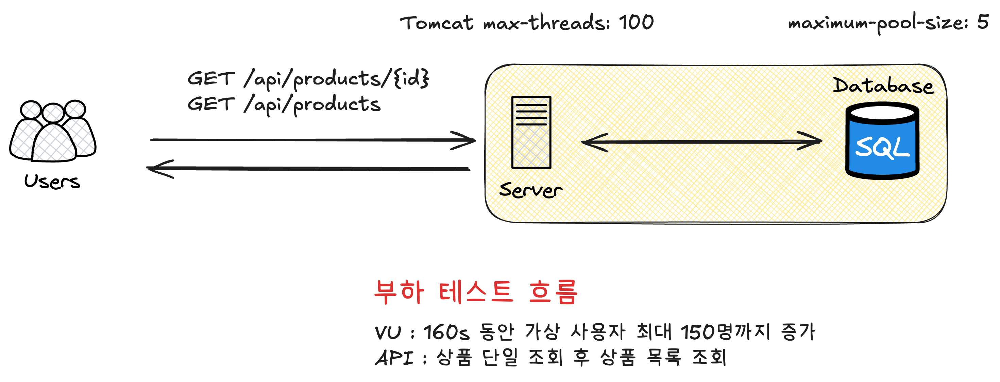
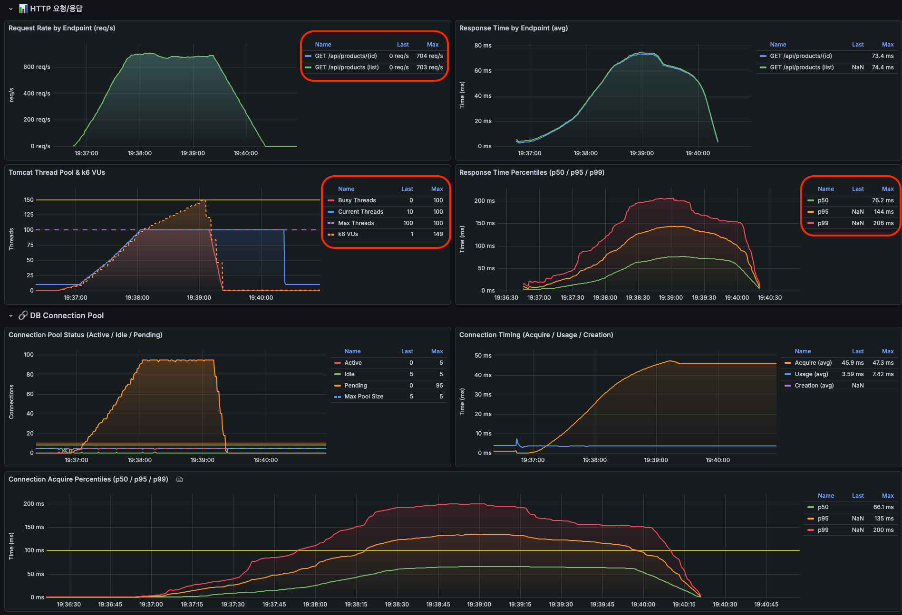
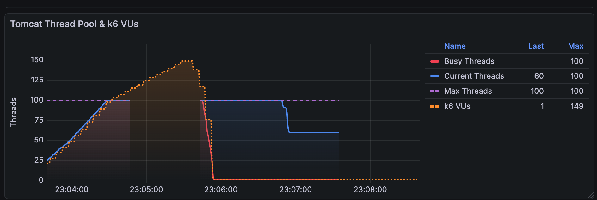
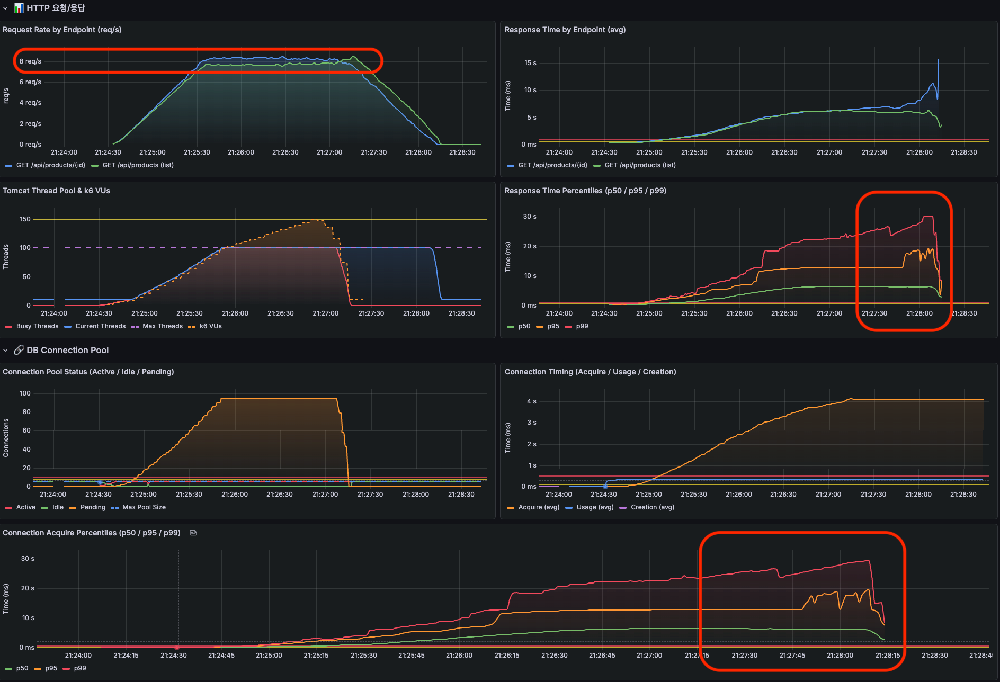
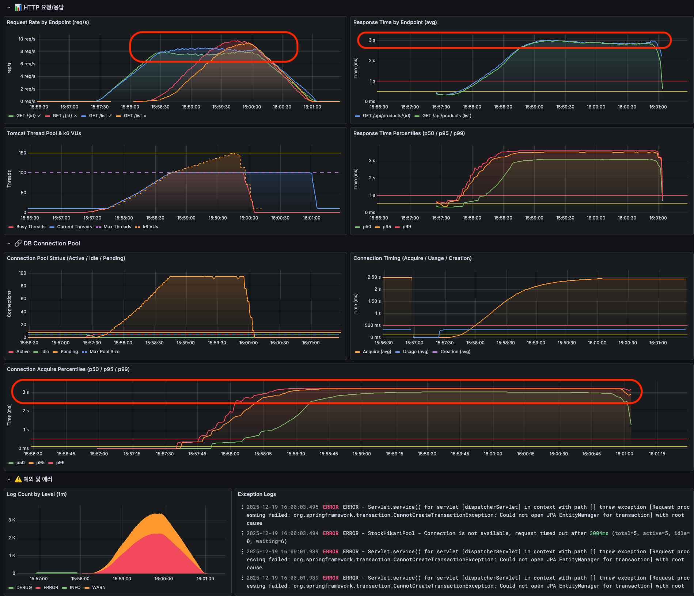

## 들어가며
  
[HikariCP About Pool Sizing](https://github.com/brettwooldridge/HikariCP/wiki/About-Pool-Sizing)을 통해 Pool Sizing에 대한 가이드를 읽을 수 있다.  

- 풀 사이즈 관련 설정들(**maximumPoolSize**, minimumIdle, idleTimeout)
- 커넥션 생명주기 관리(maxLifetime, **keepaliveTime**)
- 커넥션 요청 대기(**connectionTimeout**)
  
난 DBCP 튜닝을 해본적이 없다. 기본값을 그대로 사용하거나, 막연히 큰 값을 설정하는 것을 여러 프로젝트에서 봐왔다.  
하지만 최적의 설정은 애플리케이션의 특성, 쿼리 실행 시간, 동시 사용자 수에 따라 달라지기 때문에 튜닝을 연습해보려 한다.  
  
그래서 **의도적으로 병목 상황을 만들고**, k6 부하 테스트와 Grafana 모니터링을 통해 **임계점을 직접 확인**하면서 최적의 pool size를 찾아보려 한다.

> **참고**
> - [HikariCP GitHub - About Pool Sizing](https://github.com/brettwooldridge/HikariCP/wiki/About-Pool-Sizing)
> - [HikariCP Configuration](https://github.com/brettwooldridge/HikariCP#gear-configuration-knobs-baby)

## 부하 테스트 기준



```javascript
// k6/scripts/phase1-read-test.js
export const options = {
  scenarios: {
    ramping_load: {
      executor: 'ramping-vus',
      startVUs: 1,
      stages: [
        { duration: '20s', target: 10 },   // Warm-up
        { duration: '30s', target: 50 },   // Tomcat 스레드 포화 (max: 100)
        { duration: '30s', target: 100 },  // Tomcat 초과
        { duration: '30s', target: 125 },  // 고부하
        { duration: '30s', target: 150 },  // 최대 부하
        { duration: '20s', target: 0 },    // Cool-down
      ],
    },
  },
};
```

- **Tomcat 최대 스레드를 100개로 제한**
- **DBCP 최대 커넥션 수를 5개로 제한**

이 상황에서 점진적으로 부하를 줘보자

## 정상적인 상황



1. Tomcat 스레드보다 많이 요청됐지만 정상 처리됨
2. 초당 700개의 요청을 처리
3. 99%의 요청이 200ms 이내 처리

## 각 조회 API 300ms 지연 상황

처리를 300ms 지연시켜서 DB Connection 반환을 지연시켜보자

> 📌 **부하 테스트를 하면 메트릭 집계 안되는 경우**  
> 
> 부하 테스트를 진행하면서 메트릭이 안보이는 경우가 있었는데 `/actuator/prometheus` API도 8080 포트로 조회하고 있어서 이 API 요청을 처리할 스레드가 없어서 메트릭이 조회가 안되었다.  
> 다른 포트로 할당해주면 된다. `management.server.port` 설정을 8080 포트와 분리해주면 된다.  



1. Tomcat 스레드보다 많이 요청됐지만 정상 처리됨. 
2. DB Connection 대기 시간도 30초 직전까지 보임
3. 그렇기에 응답 시간도 최악 30초 직전

일단 이것을 보고 떠오른 속성은 `db connection timeout`이다.  
일반적인 상황에서 DB Connection을 얻기 위해 30초 동안 대기한다는 것은 부하가 몰리는 경우 심각한 장애를 일으킬 확률이 높다.  
  
- **Tomcat Thread Pool 고갈**
- **사용자가 너무 많은 재시도를 할 확률이 높음**
- **재시도를 많이하면 죽은 요청이 많이 발생함**

빠르게 실패하도록 (Fail Fast) 타임아웃을 지정하고 테스트해보자.

## connection-timeout 지정

```diff
hikari:
   pool-name: StockHikariPool
   maximum-pool-size: 5             # 병목 시뮬레이션용 (기본값: 10)
+  connection-timeout: 3000         # 3초로 지정 (기본값: 30,000)
```




정상 처리량은 이전과 비슷하지만 DB Connection을 얻기 위해 3초까지만 대기하기 때문에 (예외 응답이긴 하지만) 3초로 유지되고 있는 것을 확인할 수 있다.  
그럼에도 빠르게 응답을 반환하여 서버 자원을 빠르게 반환하고 예외를 통한 모니터링이나 서킷브레이커에 빠르게 전파하는게 좋다고 생각된다.  

```java
java.sql.SQLTransientConnectionException: StockHikariPool - Connection is not available, request timed out after 3001ms (total=5, active=5, idle=0, waiting=94)
	at com.zaxxer.hikari.pool.HikariPool.createTimeoutException(HikariPool.java:714)
	at com.zaxxer.hikari.pool.HikariPool.getConnection(HikariPool.java:184)
   ...
```
  
## maximum-pool-size 튜닝

이 글의 핵심인 pool size를 튜닝해보자. 각 API는 300ms 지연은 불가피한 상황에서 pool size를 튜닝해서 처리량을 증가시키고 에러율을 낮출 수 있을지, 그리고 pool size가 크면 클수록 이득인건지 확인해보자.

### pool size 5개인 현재 상황 분석

| 지표 | 관찰 결과 |
|------|----------|
| Request Rate | 정상 응답률은 피크 시 `8~9 req/s`로 제한됨 |
| Response Time (avg) | **3초로 고정** (db connection-timeout에 의해 제한됨) |
| Connection Acquire p99 | **3초에서 평탄화** (커넥션 획득 대기가 db connection-timeout에 의해 제한됨) |
| Pending Connections | 최대 **90개 이상** 대기 중 |
| Error Count | VU 25명 이상부터 **에러** 발생 (최대 2K) |

5개의 커넥션이 모두 active 상태이고, 대기 큐가 계속 쌓이고 있는 상황이다.  
현재 환경 기준으로 단계별 테스트를 진행해보자.  

### 테스트 결과

| Pool Size | 그라파나 | 초당 처리량 | 평균 응답 시간 | 응답 시간 (99% 기준) | 커넥션 대기 요청 수 | 에러 수 | MySQL 초당 쿼리 |
|:-----------|:--------:|:------------:|:---------------:|:---------------------:|:-------------------:|:--------:|:----------------:|
| **10개** (기본값, 현재 대비 2배) | <a href="/stress/pool-size-10.png" target="_blank">보기</a> | 16 req/s | 2.3s | 3.22s | 90 | 1K | 211 |
| **20개** | <a href="/stress/pool-size-20.png" target="_blank">보기</a> | 32 req/s | 1.4s | 3.17s | 80 | 560 | 418 |
| **30개** | <a href="/stress/pool-size-30.png" target="_blank">보기</a> | 48 req/s | 1.0s | 3.15s | 70 | 228 | 623 |
| **50개** (Tomcat 스레드의 50%) | <a href="/stress/pool-size-50.png" target="_blank">보기</a> | 80 req/s | 0.5s | 2.40s | 50 | 62 | 1.04K |
| **70개** | <a href="/stress/pool-size-70.png" target="_blank">보기</a> | 112 req/s | 0.45s | 1.07s | 30 | **0** | 1.45K |
| **100개** (Tomcat 스레드와 동일) | <a href="/stress/pool-size-100.png" target="_blank">보기</a> | 159 req/s | 0.36s | 0.62s | **0** | **0** | 2.06K |
  
```diff
+ 선형적 처리량 증가 (이 테스트에서는 Pool Size가 병목의 유일한 원인이었기 때문에 선형 증가가 나타난 것 같음)
Pool 10 → 20 → 30 → 50 → 70 → 100
TPS  16 → 32 → 48 → 80 → 112 → 159 (거의 비례 증가)

+ 응답 시간 급격한 개선
Pool 10: p99 = 3.22초
Pool 50: p99 = 2.40초
Pool 70: p99 = 1.07초
Pool 100: p99 = 0.62초

+ Pool 70부터 에러 0 달성
Pool 100에서 Pending 0

+ MySQL 부하 비례 증가
Pool 10: Connected 10, QPS 211
Pool 100: Connected 100, QPS 2.06K (10배 증가)
```

## Pool Size를 최대로 잡는 게 최선일까?

병목 상황을 만들기 위해 조회 API에서 300ms 지연된다고 가정했는데, 이 상황에서는 에러율이 0인 70개가 적절할 수 있다.  
만약 실제 운영 환경이라면 어떤 의사결정을 해야할까?
  
1. DB Connection 반환 지연을 줄일 수 있나?
2. 목표로하는 TPS가 몇인가?
3. 에러를 일부 허용할 수 있는 상황인가?
4. DB 서버 리소스 부담은 괜찮은가?
   - `(서버 수 × pool size) < db max_connections` 충분한가?
   - pool size만큼 한 번에 connection을 맺기에 커넥션 생성 시간은 괜찮은가?

### 목표 TPS 150으로 다시 테스트

> 커넥션 점유(API 지연)를 300ms에서 50ms로 개선에 성공하였고, 목표 TPS는 150이라고 가정한 상황에서 최적의 pool size를 찾아보자

| Pool Size | 그라파나 | 초당 처리량 | 평균 응답 시간 | 응답 시간 (99% 기준) | 커넥션 대기 요청 수 | 에러 수 | MySQL 초당 쿼리 | 목표 달성 |
|:----------|:--------:|:----------:|:-------------:|:-------------------:|:-----------------:|:------:|:--------------:|:--------:|
| **5개** | <a href="/stress/50ms-pool-size-5.png" target="_blank">보기</a> | 42 req/s | 1.17s | 2.50s | 95 | 94 | 546 | ❌ |
| **10개** | <a href="/stress/50ms-pool-size-10.png" target="_blank">보기</a> | 82 req/s | 608ms | 2.58s | 90 | 88 | 1.06K | ❌ |
| **15개** | <a href="/stress/50ms-pool-size-15.png" target="_blank">보기</a> | 125 req/s | 398ms | 1.43s | 85 | **0** | 1.62K | ❌ |
| **20개** | <a href="/stress/50ms-pool-size-20.png" target="_blank">보기</a> | 165 req/s | 306ms | 1.39s | 80 | **0** | 2.14K | ✅ |
| **25개** | <a href="/stress/50ms-pool-size-25.png" target="_blank">보기</a> | 216 req/s | 115ms | 814ms | 75 | **0** | 2.80K | ✅ |
| **30개** | <a href="/stress/50ms-pool-size-30.png" target="_blank">보기</a> | 257 req/s | 200ms | 765ms | 70 | **0** | 3.33K | ✅ |
| **35개** | <a href="/stress/50ms-pool-size-35.png" target="_blank">보기</a> | 303 req/s | 168ms | 635ms | 65 | **0** | 3.93K | ✅ |
| **50개** | <a href="/stress/50ms-pool-size-50.png" target="_blank">보기</a> | 427 req/s | 116ms | 374ms | 50 | **0** | 5.55K | ✅ |

15개 부터 에러가 발생하진 않았지만 목표한 TPS에 도달하진 못 했다.  
내가 원하는 성능은 pool size가 20개일 때, 사용 가능하다는 것을 확인했다.  

## 정리해보면

DB 자원이 허용된다면 Pool Size를 크게 잡아서 당장의 문제를 해결할 수 있다.  
하지만 Pool Size를 늘려야 하는 상황 자체가 이미 어딘가에 문제가 있다는 신호다. 대부분은 커넥션을 오래 점유하는 **롱 트랜잭션**이 원인이다.  
  
HikariCP에서 일반적으로 추천하는 공식이 있다.  

```
connections = (core_count × 2) + effective_spindle_count

core_count: 하이퍼스레딩 제외한 물리 코어 수
effective_spindle_count: 디스크 동시 처리 가능 수 (SSD면 0~1)
```

4코어 서버라면 `(4 × 2) + 1 = 9~10개` 정도가 적정하다는 이야기다. 그런데 단순히 이 공식대로 설정한다고 끝이 아니다.  
핵심은 **"소수의 커넥션이 빠르게 회전하면서 포화 상태를 유지하는 것"** 이다. 커넥션 수가 많은 게 중요한 게 아니라, 점유 시간이 짧아야 한다.  
  
결국 판단 기준은 **"시간"** 이다.
- **acquire_time (커넥션 획득 대기 시간)**: 이게 길어지면 Pool이 부족하거나 점유 시간이 길다는 의미
- **usage_time (커넥션 점유 시간)**: 이게 길면 쿼리 최적화가 필요하다는 신호
  
그래서 Pool Size를 결정할 때 이런 순서로 접근하는 게 맞는 것 같다.

1. **모니터링으로 현재 상태 파악** - acquire_time, usage_time, pending 확인
2. **점유 시간이 길다면 쿼리 최적화 먼저** - 인덱스, N+1, 트랜잭션 범위 점검
3. **그래도 목표 TPS가 안 나오면 부하 테스트** - 에러가 0이 되는 최소 Pool Size 찾기
4. **상한선 확인** - `(max_connections × 0.8) ÷ 인스턴스 수`를 넘지 않는지, DB에 설정된 최대 커넥션 수를 초과하지 않는지

## 신경써야하는 다른 속성도 있나?

> **maximumPoolSize (idle + in-use connection)와 연관된 속성**  
> - **minimumIdle** (default maximumPoolSize와 동일) : 풀에서 유지하는 최소 idle 커넥션 갯수
> - **idleTimeout** (최소 10초, default 10분) : 풀에서 커넥션이 idle 상태로 유지되는 최대 시간
> 즉, idle connection 수가 minimulIdle보다 작고, 전체 connection 수도 maximumPoolSize보다 작다면 신속하게 추가로 connection을 만든다.  
> 기본적으로 minimumIdle과 maximumPoolSize는 동일한 값으로 지정되어 있다.  
> minimumIdle을 maximumPoolSize보다 작게 설정한 경우 예상하지 못한 트래픽이 몰려오면 connection을 생성하는 비용 때문에 병목이 생길 수 있기 때문에 기본값을 활용하는 것이 좋다.
  
서비스 환경의 네트워크와 DB 속성을 확인하여 아래의 설정도 확인하는 것이 좋다.
1. **maxLifetime** (default 30분) : DB 혹은 네트워크 infra에서 설정된 "최대 커넥션 생존 시간(wait_timeout 등)"보다 수 초 짧게 설정 필요. pool로 반환이 안되면 connection을 제거할 수 없기 때문에 pool로 반환을 잘 시켜주는 것이 중요하다.
   - 데이터베이스 서버의 최신 변경사항을 반영하고 커넥션 유지 동안 발생할 수 있는 리소스의 누수를 막기 위한 선택이다.
2. **keepaliveTime** (default 2분) : idle 커넥션 생존을 위해 상태 확인 주기, db/network timeout보다 짧게
3. **connectionTimeout** (default 30초) : 풀에서 커넥션을 가져올 때 기다리는 최대 시간, 기본 값은 너무 커 트래픽이 몰리는 경우 서버 스레드가 커넥션을 획득하기 위해 대량으로 블로킹될 가능성이 있음
  
> 💡 DB 서버 설정은?
> - `connect_timeout` (default 10초) : MySQL 서버가 TCP 연결 수락 이후 클라이언트로부터 연결 패킷(인증 정보)을 받기까지 기다리는 시간
> - `max_connections` : client와 맺을 수 있는 최대 connection 수이다. 스케일 아웃에 대비하여 클라이언트들의 최대 사용 수를 확인하여 설정하는게 좋다.
> - `wait_timeout` (default 480분) : connection이 inactive할 때 다시 요청이 오기까지 얼마의 시간을 기다린뒤에 close 할 것인지를 결정한다. (애플리케이션의 keepaliveTime보다 길게 설정되어야 한다.)
