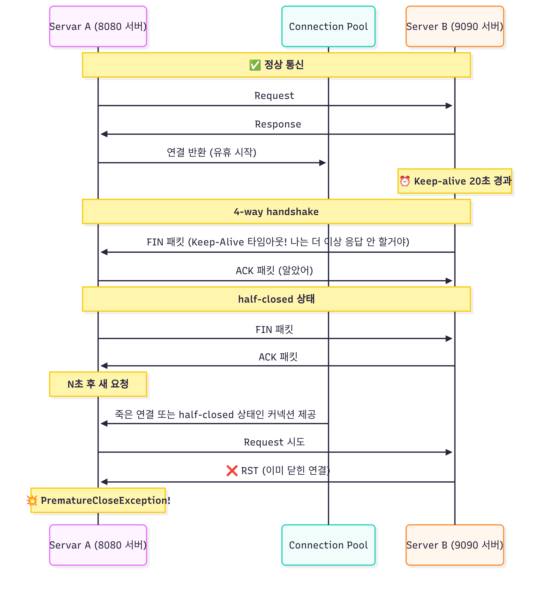
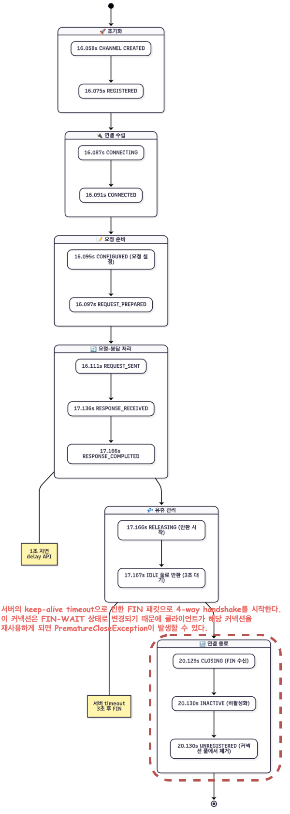

# 문제 발견

모니터링을 통해 1,2주 간격으로 한 번씩 PrematureCloseException 예외가 발생하는 것을 확인했다.  
외부 서비스를 초당 300 ~ 400회 정도, 요청하고 응답을 기다리지 않는 비동기 방식으로 부하가 몰릴 때 발생하는 것을 추가로 확인할 수 있었다.  
  
예외의 원인을 확실하게 이해하기 위해 WebClient의 커넥션 풀이 어떻게 관리되는지 정상적인 케이스를 먼저 확인해보자.

# WebClient Connection 상태 변화



> 8080포트의 서버에서 9090포트의 서버로 요청을 보내고 1초 후에 응답하는 API를 테스트해보았다.  
> (keep-alive timeout = 3000ms)


WebClient를 생성할 때 metrics를 활성화하여 로그를 확인해볼 수 있다.  

<details>
<summary>💡 WebClient Connection Pool 로그 자세히보기</summary>

```kotlin
val httpClient = HttpClient.create(connectionProvider)
    .metrics(true) { uriTagValue -> uriTagValue }
    .doOnConnected { conn ->
        conn.channel().closeFuture().addListener {
            logger.info("[Connection Closed] : $conn")
        }
        logger.info("[New Connection] : $conn")
    }
    .doOnConnect { config ->
        logger.info("[Connection Attempt] Attempting to connect...")
    }

return WebClient.builder()
    .baseUrl("http://localhost:9090")
    .clientConnector(ReactorClientHttpConnector(httpClient))
    .build()
```

```
Creating a new [my-provider] client pool [PoolFactory{evictionInterval=PT0S, leasingStrategy=fifo, maxConnections=1, maxIdleTime=-1, maxLifeTime=-1, metricsEnabled=false, pendingAcquireMaxCount=2, pendingAcquireTimeout=45000}] for [localhost/<unresolved>:9090]
[1965a96f] Created a new pooled channel, now: 0 active connections, 0 inactive connections and 0 pending acquire requests.
[1965a96f] REGISTERED
[1965a96f] CONNECT: localhost/127.0.0.1:9090
[1965a96f, L:/127.0.0.1:59768 - R:localhost/127.0.0.1:9090] Registering pool release on close event for channel
[1965a96f, L:/127.0.0.1:59768 - R:localhost/127.0.0.1:9090] Channel connected, now: 1 active connections, 0 inactive connections and 0 pending acquire requests.
[1965a96f, L:/127.0.0.1:59768 - R:localhost/127.0.0.1:9090] ACTIVE
[1965a96f, L:/127.0.0.1:59768 - R:localhost/127.0.0.1:9090] onStateChange(PooledConnection{channel=[id: 0x1965a96f, L:/127.0.0.1:59768 - R:localhost/127.0.0.1:9090]}, [connected])
[1965a96f-1, L:/127.0.0.1:59768 - R:localhost/127.0.0.1:9090] onStateChange(GET{uri=null, connection=PooledConnection{channel=[id: 0x1965a96f, L:/127.0.0.1:59768 - R:localhost/127.0.0.1:9090]}}, [configured])
[New Connection] : GET{uri=null, connection=PooledConnection{channel=[id: 0x1965a96f, L:/127.0.0.1:59768 - R:localhost/127.0.0.1:9090]}}
[1965a96f-1, L:/127.0.0.1:59768 - R:localhost/127.0.0.1:9090] Handler is being applied: {uri=http://localhost:9090/internal/delay/1, method=GET}
[1965a96f-1, L:/127.0.0.1:59768 - R:localhost/127.0.0.1:9090] onStateChange(GET{uri=/internal/delay/1, connection=PooledConnection{channel=[id: 0x1965a96f, L:/127.0.0.1:59768 - R:localhost/127.0.0.1:9090]}}, [request_prepared])
[1965a96f-1, L:/127.0.0.1:59768 - R:localhost/127.0.0.1:9090] WRITE: 102B GET /internal/delay/1 HTTP/1.1
user-agent: ReactorNetty/1.1.22
host: localhost:9090
accept: */*

[1965a96f-1, L:/127.0.0.1:59768 - R:localhost/127.0.0.1:9090] FLUSH
[1965a96f-1, L:/127.0.0.1:59768 - R:localhost/127.0.0.1:9090] WRITE: 0B
[1965a96f-1, L:/127.0.0.1:59768 - R:localhost/127.0.0.1:9090] FLUSH
[1965a96f-1, L:/127.0.0.1:59768 - R:localhost/127.0.0.1:9090] onStateChange(GET{uri=/internal/delay/1, connection=PooledConnection{channel=[id: 0x1965a96f, L:/127.0.0.1:59768 - R:localhost/127.0.0.1:9090]}}, [request_sent])
[1965a96f-1, L:/127.0.0.1:59768 - R:localhost/127.0.0.1:9090] READ: 142B HTTP/1.1 200 
Content-Type: text/plain;charset=UTF-8
Content-Length: 28
Date: Tue, 23 Sep 2025 06:09:17 GMT


delay api success. seconds=1
15:09:17.136+09:00 --- [r-http-kqueue-2] r.n.http.client.HttpClientOperations     : [1965a96f-1, L:/127.0.0.1:59768 - R:localhost/127.0.0.1:9090] Received response (auto-read:false) : RESPONSE(decodeResult: success, version: HTTP/1.1)
HTTP/1.1 200 
Content-Type: <filtered>
Content-Length: <filtered>
Date: <filtered>
[1965a96f-1, L:/127.0.0.1:59768 - R:localhost/127.0.0.1:9090] onStateChange(GET{uri=/internal/delay/1, connection=PooledConnection{channel=[id: 0x1965a96f, L:/127.0.0.1:59768 - R:localhost/127.0.0.1:9090]}}, [response_received])
[1965a96f-1, L:/127.0.0.1:59768 - R:localhost/127.0.0.1:9090] [terminated=false, cancelled=false, pending=0, error=null]: subscribing inbound receiver
[1965a96f-1, L:/127.0.0.1:59768 - R:localhost/127.0.0.1:9090] Received last HTTP packet
[1965a96f, L:/127.0.0.1:59768 - R:localhost/127.0.0.1:9090] onStateChange(GET{uri=/internal/delay/1, connection=PooledConnection{channel=[id: 0x1965a96f, L:/127.0.0.1:59768 - R:localhost/127.0.0.1:9090]}}, [response_completed])
[1965a96f, L:/127.0.0.1:59768 - R:localhost/127.0.0.1:9090] onStateChange(GET{uri=/internal/delay/1, connection=PooledConnection{channel=[id: 0x1965a96f, L:/127.0.0.1:59768 - R:localhost/127.0.0.1:9090]}}, [disconnecting])
[1965a96f, L:/127.0.0.1:59768 - R:localhost/127.0.0.1:9090] Releasing channel
[1965a96f, L:/127.0.0.1:59768 - R:localhost/127.0.0.1:9090] Channel cleaned, now: 0 active connections, 1 inactive connections and 0 pending acquire requests.
[1965a96f, L:/127.0.0.1:59768 - R:localhost/127.0.0.1:9090] READ COMPLETE

-- 3초 이후 --

[1965a96f, L:/127.0.0.1:59768 - R:localhost/127.0.0.1:9090] READ COMPLETE
[Connection Closed] : GET{uri=/internal/delay/1, connection=PooledConnection{channel=[id: 0x1965a96f, L:/127.0.0.1:59768 ! R:localhost/127.0.0.1:9090]}}
[1965a96f, L:/127.0.0.1:59768 ! R:localhost/127.0.0.1:9090] INACTIVE
[1965a96f, L:/127.0.0.1:59768 ! R:localhost/127.0.0.1:9090] onStateChange(PooledConnection{channel=[id: 0x1965a96f, L:/127.0.0.1:59768 ! R:localhost/127.0.0.1:9090]}, [disconnecting])
[1965a96f, L:/127.0.0.1:59768 ! R:localhost/127.0.0.1:9090] UNREGISTERED
```
</details>



로그와 다이어그램을 통해 Connection의 상태가 변화되는 단계를 확인해볼 수 있었다.  
이제 PrematureCloseException이 발생하는 원인에 대해 더 자세하게 확인해보자.  

# PrematureCloseException이 발생하는 케이스

`HttpClientOperations.onInboundClose()`는 원격 서버에서 FIN 패킷을 보내어 수신 서버에서 EOF 이벤트를 감지하여 정상적으로 연결을 닫는 경우 호출된다.  
  
1. (테스트 환경이 mac이라서) KQueueEventLoop 에서 FIN 패킷을 EV_EOF 이벤트로 감지
2. EV_EOF 이벤트로 인해 EOF 처리, Half-closure 설정에 따라 입력만 종료 또는 전체 종료 결정
3. Channel inputShutdown 플래그 설정 + 시스템 레벨 소켓 수신 부분 종료
4. 실제 소켓 fd 닫기 + closeInitiated 플래그 설정
5. channelInactive 이벤트가 파이프라인 통해 전파 EventLoop에서 채널 등록 해제
6. **ChannelHandler.channelInactive() 프로토콜별 정리 작업에서 onInboundClose() 호출** -> HTTP 프로토콜 레벨에서 어떤 단계에서 문제가 발생했는지 구분해서 적절한 예외를 발생시킨다.


> 1. 요청 헤더 전송
> 2. 요청 바디 전송   ← 여기서 닫히면 `"while sending request body"` **아직 요청도 완전히 못 보낸 상태**
> 3. 요청 완료
> 4. 서버 처리 중     ← 여기서 닫히면 `"BEFORE response"` **요청은 보냈지만 응답을 아직 못 받은 상태**
> 5. 응답 헤더 수신
> 6. 응답 바디 수신   ← 여기서 닫히면 `"DURING response"` **응답을 받기 시작했지만 응답이 완전히 안 온 상태**
> 7. 응답 완료

## 1. while sending request body

클라이언트 서버가 요청을 보내고 있는 경우 커넥션이 닫히면 발생한다.  

## 2. BEFORE response

송신 서버와 수신 서버가 연결된 이후에 수신 서버가 일방적으로 커넥션을 닫는 경우다.  
즉, ChannelActive 상태까지 도달한 후 클라이언트가 응답을 대기하고 있지만 서버가 해당 채널을 닫아버리는 경우이다.  

<details>
<summary>💡 Netty 예제 코드 및 로그 자세히 보기</summary>

```kotlin
fun main() {
    val parentGroup = NioEventLoopGroup()
    val workerGroup = NioEventLoopGroup()

    try {
        ServerBootstrap()
            .group(parentGroup, workerGroup)
            .channel(NioServerSocketChannel::class.java)
            .childHandler(object : ChannelInitializer<SocketChannel>() {
                override fun initChannel(ch: SocketChannel) {
                    ch.pipeline().addLast(RudeServerHandler())
                }
            })
            .bind(8080).sync()
            .channel().closeFuture().sync()
    } finally {
        parentGroup.shutdownGracefully()
        workerGroup.shutdownGracefully()
    }
}

private class RudeServerHandler : ChannelInboundHandlerAdapter() {

    private val logger = org.slf4j.LoggerFactory.getLogger(this::class.java)

    override fun channelRegistered(ctx: ChannelHandlerContext) {
        logger.info("[REGISTERED] Channel registered: ${ctx.channel()}")
        super.channelRegistered(ctx)
    }

    override fun channelUnregistered(ctx: ChannelHandlerContext) {
        logger.info("[UNREGISTERED] Channel unregistered: ${ctx.channel()}")
        super.channelUnregistered(ctx)
    }

    override fun channelActive(ctx: ChannelHandlerContext) {
        logger.info("[ACTIVE] Channel active (connected): ${ctx.channel()}")
        super.channelActive(ctx)
    }

    override fun channelInactive(ctx: ChannelHandlerContext) {
        logger.info("[INACTIVE] Channel inactive (disconnected): ${ctx.channel()}")
        super.channelInactive(ctx)
    }

    override fun channelRead(ctx: ChannelHandlerContext, msg: Any) {
        logger.info("[READ] Data received from client: ${ctx.channel()}")
        logger.info("[READ] Message content: ${msg}")

        // 데이터를 받자마자 즉시 연결을 끊음 (FIN 패킷 전송)
        ctx.close()
        logger.info("[READ] Connection close initiated")
    }

    override fun channelReadComplete(ctx: ChannelHandlerContext) {
        logger.info("[READ_COMPLETE] Channel read complete: ${ctx.channel()}")
        super.channelReadComplete(ctx)
    }
}
```
</details>


```
[REGISTERED] Channel registered: [id: 0x19ba8155, L:/127.0.0.1:8080 - R:/127.0.0.1:58625]
[ACTIVE] Channel active (connected): [id: 0x19ba8155, L:/127.0.0.1:8080 - R:/127.0.0.1:58625]
[READ] Data received from client: [id: 0x19ba8155, L:/127.0.0.1:8080 - R:/127.0.0.1:58625]
[READ] Message content: PooledUnsafeDirectByteBuf(ridx: 0, widx: 159, cap: 2048)
[READ] Connection close initiated
[READ_COMPLETE] Channel read complete: [id: 0x19ba8155, L:/127.0.0.1:8080 ! R:/127.0.0.1:58625]
[INACTIVE] Channel inactive (disconnected): [id: 0x19ba8155, L:/127.0.0.1:8080 ! R:/127.0.0.1:58625]
[UNREGISTERED] Channel unregistered: [id: 0x19ba8155, L:/127.0.0.1:8080 ! R:/127.0.0.1:58625]
```

1. `ChannelRegistered` : Channel 이 Event Loop에 등록됨
2. `ChannelActive` : Channel이 활성화됨, 이제 데이터를 주고받을 수 있음
3. `Channellnactive` : Channel이 원격 피어로 연결되지 않음
4. `ChannelUnregistered`: Channel이 생성됐지만 Event Loop에 등록되지 않음


송신 서버 (클라이언트)는 reactor.netty.http.client.PrematureCloseException: Connection prematurely closed BEFORE response 예외를 전달받지만 패킷상으로는 정상적인 통신이 완료된 것을 확인할 수 있다.  

## 3. DURING response

송신 서버가 수신 서버에게 헤더를 정상적으로 응답받고 바디를 대기하는 도중 커넥션이 송신 서버가 커넥션을 일방적으로 닫는 경우이다.  
즉 송신 서버가 헤더를 정상적으로 받고 바디를 완전히 받기 위해 대기하는 중에 수신 서버가 일방적으로 커넥션을 종료하는 경우이다.  

```kotlin
@GetMapping("/abort-connection")
fun abortConnection(response: HttpServletResponse) {
    logger.info("Starting abort connection...")
    
    try {
        val writer = response.writer
        
        // 응답 데이터를 한 번 전송하여 클라이언트가 정상적으로 읽기 시작하도록 유도
        writer.write("Starting response...")
        writer.flush()

        Thread.sleep(100)

        // 일방적으로 종료! FIN 패킷 전달
        response.outputStream.close()

        writer.write("This should not be sent")
        
    } catch (e: IOException) {
        logger.error("IOException during abort: ${e.message}")
    }
}
```

<details>
<summary>💡 WebClient Connection Pool 로그 자세히보기</summary>

```
Creating a new [my-provider] client pool [PoolFactory{evictionInterval=PT0S, leasingStrategy=fifo, maxConnections=1, maxIdleTime=-1, maxLifeTime=-1, metricsEnabled=false, pendingAcquireMaxCount=2, pendingAcquireTimeout=45000}] for [localhost/<unresolved>:9090]
[551113d8] Created a new pooled channel, now: 0 active connections, 0 inactive connections and 0 pending acquire requests.
[551113d8] REGISTERED
[551113d8] CONNECT: localhost/127.0.0.1:9090
[551113d8, L:/127.0.0.1:53169 - R:localhost/127.0.0.1:9090] Registering pool release on close event for channel
[551113d8, L:/127.0.0.1:53169 - R:localhost/127.0.0.1:9090] Channel connected, now: 1 active connections, 0 inactive connections and 0 pending acquire requests.
[551113d8, L:/127.0.0.1:53169 - R:localhost/127.0.0.1:9090] ACTIVE
[551113d8, L:/127.0.0.1:53169 - R:localhost/127.0.0.1:9090] onStateChange(PooledConnection{channel=[id: 0x551113d8, L:/127.0.0.1:53169 - R:localhost/127.0.0.1:9090]}, [connected])
[551113d8-1, L:/127.0.0.1:53169 - R:localhost/127.0.0.1:9090] onStateChange(GET{uri=null, connection=PooledConnection{channel=[id: 0x551113d8, L:/127.0.0.1:53169 - R:localhost/127.0.0.1:9090]}}, [configured])
[New Connection] : GET{uri=null, connection=PooledConnection{channel=[id: 0x551113d8, L:/127.0.0.1:53169 - R:localhost/127.0.0.1:9090]}}
[551113d8-1, L:/127.0.0.1:53169 - R:localhost/127.0.0.1:9090] Handler is being applied: {uri=http://localhost:9090/force/abort-connection, method=GET}
[551113d8-1, L:/127.0.0.1:53169 - R:localhost/127.0.0.1:9090] onStateChange(GET{uri=/force/abort-connection, connection=PooledConnection{channel=[id: 0x551113d8, L:/127.0.0.1:53169 - R:localhost/127.0.0.1:9090]}}, [request_prepared])
[551113d8-1, L:/127.0.0.1:53169 - R:localhost/127.0.0.1:9090] WRITE: 108B GET /force/abort-connection HTTP/1.1
user-agent: ReactorNetty/1.1.22
host: localhost:9090
accept: */*

[551113d8-1, L:/127.0.0.1:53169 - R:localhost/127.0.0.1:9090] FLUSH
[551113d8-1, L:/127.0.0.1:53169 - R:localhost/127.0.0.1:9090] WRITE: 0B
[551113d8-1, L:/127.0.0.1:53169 - R:localhost/127.0.0.1:9090] FLUSH
[551113d8-1, L:/127.0.0.1:53169 - R:localhost/127.0.0.1:9090] onStateChange(GET{uri=/force/abort-connection, connection=PooledConnection{channel=[id: 0x551113d8, L:/127.0.0.1:53169 - R:localhost/127.0.0.1:9090]}}, [request_sent])
[551113d8-1, L:/127.0.0.1:53169 - R:localhost/127.0.0.1:9090] READ: 108B HTTP/1.1 200 
Transfer-Encoding: chunked
Date: Sat, 27 Sep 2025 05:28:01 GMT
14
Starting response...    // 첫 번째 청킹 데이터 정상적으로 응답받음
[551113d8-1, L:/127.0.0.1:53169 - R:localhost/127.0.0.1:9090] Received response (auto-read:false) : RESPONSE(decodeResult: success, version: HTTP/1.1)
[551113d8-1, L:/127.0.0.1:53169 - R:localhost/127.0.0.1:9090] onStateChange(GET{uri=/force/abort-connection, connection=PooledConnection{channel=[id: 0x551113d8, L:/127.0.0.1:53169 - R:localhost/127.0.0.1:9090]}}, [response_received])
[551113d8-1, L:/127.0.0.1:53169 - R:localhost/127.0.0.1:9090] [terminated=false, cancelled=false, pending=0, error=null]: subscribing inbound receiver
[551113d8-1, L:/127.0.0.1:53169 - R:localhost/127.0.0.1:9090] READ COMPLETE
[551113d8-1, L:/127.0.0.1:53169 - R:localhost/127.0.0.1:9090] READ COMPLETE
[551113d8-1, L:/127.0.0.1:53169 ! R:localhost/127.0.0.1:9090] Channel closed, now: 0 active connections, 0 inactive connections and 0 pending acquire requests.
[Connection Closed] : GET{uri=/force/abort-connection, connection=PooledConnection{channel=[id: 0x551113d8, L:/127.0.0.1:53169 ! R:localhost/127.0.0.1:9090]}}
[551113d8-1, L:/127.0.0.1:53169 ! R:localhost/127.0.0.1:9090] INACTIVE
[551113d8-1, L:/127.0.0.1:53169 ! R:localhost/127.0.0.1:9090] onStateChange(GET{uri=/force/abort-connection, connection=PooledConnection{channel=[id: 0x551113d8, L:/127.0.0.1:53169 ! R:localhost/127.0.0.1:9090]}}, [response_incomplete])
[551113d8-1, L:/127.0.0.1:53169 ! R:localhost/127.0.0.1:9090] UNREGISTERED
Servlet.service() for servlet [dispatcherServlet] in context with path [] threw exception 
[Request processing failed: org.springframework.web.reactive.function.client.WebClientResponseException: 200 OK from GET http://localhost:9090/force/abort-connection, 
but response failed with cause: reactor.netty.http.client.PrematureCloseException: Connection prematurely closed DURING response] with root cause
```

</details>


# 커널 TCP 소켓 상태에 따른 처리

이때까지 정상적인 종료인 FIN 패킷만 보았는데, 4-way handshake 중에 해당 커넥션으로 데이터를 재전송하게 되면 RST 패킷을 전송하게 되는 경우도 있다.  


**Active Closer의 정상적인 상태 진행** ESTABLISHED → FIN_WAIT1 → FIN_WAIT2 → TIME_WAIT → CLOSE
  
1. `FIN-WAIT-1`: 원격 TCP 피어의 연결 종료 요청을 기다리거나, 자신이 보낸 종료 요청에 대한 승인을 기다리는 상태
2. `CLOSE-WAIT`: 응용프로그램이 더 이상 데이터 송수신이 필요 없다고 close() 또는 연결 종료(종료 관련 API 호출 등)를 실행할 때까지 기다리는 상태를 의미 (연결 종료 요청을 기다리는 상태)
3. `FIN-WAIT-2`: 원격 TCP 피어의 연결 종료 요청을 기다리는 상태
4. `LAST-ACK`: 원격 TCP 피어에게 보낸 종료 요청에 대한 승인을 기다리는 상태
5. `TIME-WAIT`: 상대방이 종료 요청에 대한 승인을 수신했음을 확실히 하고, **이전 연결에서 지연된 세그먼트가 새 연결에 영향을 주지 않도록 일정 시간 대기하는 상태**
6. `CLOSED`: 연결이 완전히 없는 상태
  
[tcp_ipv4.c `tcp_v4_do_rcv(...)`](https://github.com/torvalds/linux/blob/master/net/ipv4/tcp_ipv4.c#L1905)함수를 보면 소켓이 `TCP_ESTABLISHED` 상태가 아닌 경우 `tcp_rcv_state_process(...)`를 통해 처리한다.

```c
int tcp_v4_do_rcv(struct sock *sk, struct sk_buff *skb)
{
    enum skb_drop_reason reason;
    struct sock *rsk;

    // 1. 수신된 데이터를 사용자 영역에 전달할 수 있는 상태인 경우
    if (sk->sk_state == TCP_ESTABLISHED) { /* Fast path */
        // ...
        tcp_rcv_established(sk, skb);
        return 0;
    }

    // 2. 연결 요청을 기다리는 상태인 경우
    if (sk->sk_state == TCP_LISTEN) {
        // ...
    } else
        sock_rps_save_rxhash(sk, skb);

    // 3. 그 외의 상태인 경우
    reason = tcp_rcv_state_process(sk, skb);
    if (reason) {
        rsk = sk;
        goto reset;
    }
    return 0;

// RST 패킷 전송
reset:
    tcp_v4_send_reset(rsk, skb, sk_rst_convert_drop_reason(reason));

tcp_rcv_state_process(struct sock *sk, struct sk_buff *skb)
{
    ... (중략) ...
    switch (sk->sk_state) {
    case TCP_CLOSE:
        ... (중략) ...

    case TCP_LISTEN:
        if (th->ack)
            return 1;

        if (th->rst) {
            ... (중략) ...
        }
        if (th->syn) {
            ... (중략) ...
        }
        goto discard;

    case TCP_SYN_SENT:
        ... (중략) ...
        return 0;
    }
    ... (중략) ...

    switch (sk->sk_state) {
    case TCP_SYN_RECV:
        ... (중략) ...
    case TCP_FIN_WAIT1:
    case TCP_FIN_WAIT2:
        if (sk->sk_shutdown & RCV_SHUTDOWN) {
            // 서버가 close()를 호출했으므로 RCV_SHUTDOWN이 설정됨
            if (TCP_SKB_CB(skb)->end_seq != TCP_SKB_CB(skb)->seq &&
                after(TCP_SKB_CB(skb)->end_seq - th->fin, tp->rcv_nxt)) {
                // 데이터가 포함된 패킷이면
                NET_INC_STATS(sock_net(sk), LINUX_MIB_TCPABORTONDATA);
                tcp_reset(sk, skb);  // ← RST 전송!
                return SKB_DROP_REASON_TCP_ABORT_ON_DATA;
            }
        }
        ... (중략) ...
    case TCP_CLOSING:
        ... (중략) ...
    case TCP_LAST_ACK:
        ... (중략) ...
    }
}
```

1. TCP_FIN_WAIT1, TCP_FIN_WAIT2 상태 : 데이터가 포함되어 있다면 즉시 RST 패킷 전송
2. TCP_TIME_WAIT 상태 : RST 패킷 전송 [tcp_minisocks.c#L99](https://github.com/torvalds/linux/blob/master/net/ipv4/tcp_minisocks.c#L99)
   - TIME_WAIT은 마지막 ACK가 유실될 경우를 대비하여 상대방이 FIN을 재전송하는 경우 대응하기 위한 상태이다.

# 원인


WebClient를 생성할 때 maxIdleTime을 지정해주지 않아 무제한으로 설정되어, B서버의 keep-alive timeout이 초과한 경우 클라이언트가 stale connection을 사용할 경우가 생기기 때문이다.  

1. 클라이언트가 요청 완료 후 커넥션을 풀에 반환 (시각 `T0`)
2. 서버의 keep-alive timeout은 `20`초로 설정됨
3. 클라이언트 maxIdleTime은 무제한
4. `T0 + 20`초에 클라이언트가 해당 커넥션을 다시 사용하려고 시도
5. 서버는 이미 커넥션을 닫았거나 닫는 과정에 있거나 클라이언트가 응답을 완전하게 받지 못한 경우
6. **PrematureCloseException 발생**

서버가 커넥션을 닫기 전에 클라이언트가 proactive하게 커넥션을 정리해서 race condition을 방지할 수 있기에 maxIdleTime을 서버의 keep-alive timeout보다 작게 지정해주는 것이 좋다.  

# 정리 필요

1. maxIdleTime을 지정해줘서 해결될 거라고 판단
2. 하지만 커넥션 풀 고갈 문제 발생 (커넥션을 할당받기 위해 대기하다가 예외 발생. 이 예외로 인해 일반 Job 코루틴 스코프가 멈춤)

```
Exception in thread "DefaultDispatcher-worker-5" Exception in thread "DefaultDispatcher-worker-1" Exception in thread "DefaultDispatcher-worker-7" Exception in thread "DefaultDispatcher-worker-10" Exception in thread "DefaultDispatcher-worker-3" org.springframework.web.reactive.function.client.WebClientRequestException: Pending acquire queue has reached its maximum size of 32
```

```
// 기본값
ConnectionProvider.create()  // 기본 설정 사용 시
    .maxIdleTime(-1)         // 무제한 ⚠️
    .maxLifeTime(-1)         // 무제한 ⚠️  
    .evictInBackground(0)    // 비활성 ⚠️
    .maxConnections(500)     // 제한 있음
    .pendingAcquireMaxCount(32)  // 제한 있음
```


- 커넥션 풀의 맥스 커넥션 수만큼 Flow로 배압조절한다면 커넥션 고갈 문제는 없지 않을까? 근데 버퍼가 어느정도 감당가능한지?
- 커넥션을 먼저 끊는 Active Closer는 TIME_WAIT 소켓을 보유하게 되는 것을 이해했다


> 참고  
> 1. [[Kernel] 커널과 함께 알아보는 소켓과 TCP Deep Dive](https://brewagebear.github.io/linux-kernel-internal-3/)
> 2. [헷갈리는 WebClient Timeout](https://blog.cjlee.io/post/webclient-timeout/)
> 3. [RFC9293: Transmission Control Protocol (TCP) State Matchine Overview](https://datatracker.ietf.org/doc/html/rfc9293#name-state-machine-overview)
> 4. [How can I debug "Connection prematurely closed BEFORE response"?](https://projectreactor.io/docs/netty/release/reference/faq.html#faq.connection-closed)
> 5. [Concurrency in Spring WebFlux](https://www.baeldung.com/spring-webflux-concurrency)
> 6. [Linux IP Networking: A Guide to the Implementation and Modification of the Linux Protocol Stack](https://www.cs.unh.edu/cnrg/people/gherrin/linux-net.html)
