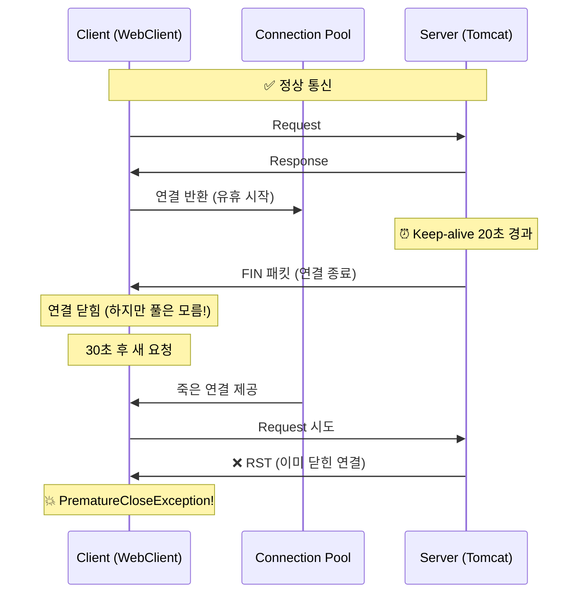

모니터링을 통해 보름에 한 번씩 PrematureCloseException 네트워크 예외가 발생하는 것을 확인했다.  

```mermaid
sequenceDiagram
    participant C as Client (WebClient)
    participant P as Connection Pool
    participant S as Server (Tomcat)
    
    Note over C,S: ✅ 정상 통신
    C->>S: Request
    S->>C: Response
    C->>P: 연결 반환 (유휴 시작)
    
    Note over S: ⏰ Keep-alive 20초 경과
    S->>C: FIN 패킷 (연결 종료)
    Note over C: 연결 닫힘 (하지만 풀은 모름!)
    
    Note over C: 30초 후 새 요청
    P->>C: 죽은 연결 제공
    C->>S: Request 시도
    S->>C: ❌ RST (이미 닫힌 연결)
    Note over C: 💥 PrematureCloseException!
```