# 문제 발견

모니터링을 통해 보름 간격으로 한 번씩 `PrematureCloseException` 예외가 발생하는 것을 확인했다.  
외부 서비스로 초당 400~500회 요청을 보내고, 응답을 기다리지 않는 비동기 방식으로 처리하는 중 부하가 몰릴 때 발생하는 것을 추가로 확인할 수 있었다.  
    
예외의 원인을 확실하게 이해하기 위해 WebClient의 커넥션 풀이 어떻게 관리되는지 정상적인 케이스를 먼저 확인해보자.  

# WebClient Connection 상태 변화

> 8080포트의 서버에서 9090포트의 서버로 요청을 보내고 1초 후에 응답하는 API를 테스트해보았다.  
> (keep-alive timeout = 3000ms)

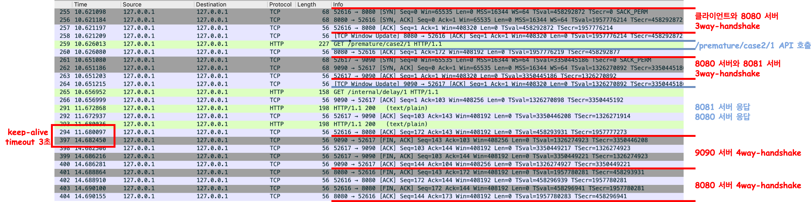

WebClient를 생성할 때 metrics를 활성화하여 로그를 확인해볼 수 있다.  

```kotlin
val httpClient = HttpClient.create(connectionProvider)
    .metrics(true) { uriTagValue -> uriTagValue }
```

```diff
+ 1. 커넥션 풀 생성
Creating a new [my-provider] client pool [PoolFactory{evictionInterval=PT0S, leasingStrategy=fifo, maxConnections=1, maxIdleTime=-1, maxLifeTime=-1, metricsEnabled=false, pendingAcquireMaxCount=2, pendingAcquireTimeout=45000}] for [localhost/<unresolved>:9090]
[1965a96f] Created a new pooled channel, now: 0 active connections, 0 inactive connections and 0 pending acquire requests.

+ 2. TCP 연결을 완료하고 커넥션 풀에 등록
[1965a96f] REGISTERED
[1965a96f] CONNECT: localhost/127.0.0.1:9090
[1965a96f] Registering pool release on close event for channel
[1965a96f] Channel connected, now: 1 active connections, 0 inactive connections and 0 pending acquire requests.
[1965a96f] ACTIVE
[1965a96f] onStateChange(PooledConnection{channel=[id: 0x1965a96f, L:/127.0.0.1:59768 - R:localhost/127.0.0.1:9090]}, [connected])

+ 3. 요청 준비
[1965a96f-1] onStateChange(GET{uri=null, connection=PooledConnection{channel=[id: 0x1965a96f, L:/127.0.0.1:59768 - R:localhost/127.0.0.1:9090]}}, [configured])
[1965a96f-1] Handler is being applied: {uri=http://localhost:9090/internal/delay/1, method=GET}
[1965a96f-1] onStateChange(GET{uri=/internal/delay/1, connection=PooledConnection{channel=[id: 0x1965a96f, L:/127.0.0.1:59768 - R:localhost/127.0.0.1:9090]}}, [request_prepared])

+ 4. 요청 전송
[1965a96f-1] WRITE: 102B GET /internal/delay/1 HTTP/1.1
user-agent: ReactorNetty/1.1.22
host: localhost:9090
accept: */*
[1965a96f-1] FLUSH
[1965a96f-1] WRITE: 0B
[1965a96f-1] FLUSH
[1965a96f-1] onStateChange(GET{uri=/internal/delay/1, connection=PooledConnection{channel=[id: 0x1965a96f, L:/127.0.0.1:59768 - R:localhost/127.0.0.1:9090]}}, [request_sent])

+ 5. 응답 헤더 수신
[1965a96f-1] READ: 142B HTTP/1.1 200 
Content-Type: text/plain;charset=UTF-8
Content-Length: 28
Date: Tue, 23 Sep 2025 06:09:17 GMT

+ 6. 응답 바디 수신
delay api success. seconds=1
[1965a96f-1] Received response (auto-read:false) : RESPONSE(decodeResult: success, version: HTTP/1.1)
HTTP/1.1 200 
Content-Type: <filtered>
Content-Length: <filtered>
Date: <filtered>
[1965a96f-1] onStateChange(GET{uri=/internal/delay/1, connection=PooledConnection{channel=[id: 0x1965a96f, L:/127.0.0.1:59768 - R:localhost/127.0.0.1:9090]}}, [response_received])
[1965a96f-1] [terminated=false, cancelled=false, pending=0, error=null]: subscribing inbound receiver

+ 6-1. 응답 바디 수신 완료
[1965a96f-1] Received last HTTP packet
[1965a96f] onStateChange(GET{uri=/internal/delay/1, connection=PooledConnection{channel=[id: 0x1965a96f, L:/127.0.0.1:59768 - R:localhost/127.0.0.1:9090]}}, [response_completed])

+ 7. 연결 해제 및 커넥션을 풀에 반환하여 idle 상태로 전환
[1965a96f] onStateChange(GET{uri=/internal/delay/1, connection=PooledConnection{channel=[id: 0x1965a96f, L:/127.0.0.1:59768 - R:localhost/127.0.0.1:9090]}}, [disconnecting])
[1965a96f] Releasing channel
[1965a96f] Channel cleaned, now: 0 active connections, 1 inactive connections and 0 pending acquire requests.
[1965a96f] READ COMPLETE

-- 3초 이후 --

+ 8. 커넥션 최종 연결 종료
[1965a96f] READ COMPLETE
[Connection Closed] : GET{uri=/internal/delay/1, connection=PooledConnection{channel=[id: 0x1965a96f, L:/127.0.0.1:59768 ! R:localhost/127.0.0.1:9090]}}
[1965a96f] INACTIVE
[1965a96f] onStateChange(PooledConnection{channel=[id: 0x1965a96f, L:/127.0.0.1:59768 ! R:localhost/127.0.0.1:9090]}, [disconnecting])
[1965a96f] UNREGISTERED
```


```diff
┌─────────────┐    ┌──────────────┐    ┌─────────────┐    ┌──────────────┐
│ 1. 풀 생성    │ →  │ 2. TCP 연결   │ →  │ 3. HTTP 요청 │ →  │ 4. HTTP 응답  │ →
└─────────────┘    └──────────────┘    └─────────────┘    └──────────────┘
  Pool Init         REGISTERED            configured          response
                    CONNECT               request_prepared    received
                    ACTIVE                request_sent        completed
                    (1 active)            (WRITE/FLUSH)       (200 OK)

┌──────────────┐    ┌─────────────┐    ┌──────────────┐
│ 5. 연결 해제   │ →  │ 6. 유휴 대기   │ →  │ 7. 최종 종료   │
└──────────────┘    └─────────────┘    └──────────────┘
  disconnecting     Keep-Alive          INACTIVE
  Release           (재사용 대기)        UNREGISTERED
  (0 active,        (~3초)              (Pool에서 제거)
   1 inactive)
```


로그와 다이어그램을 통해 Connection의 상태가 변화되는 주요 단계를 확인할 수 있다.  
이제 PrematureCloseException이 발생하는 원인에 대해 더 자세하게 확인해보자.

# PrematureCloseException이 발생하는 케이스

즉, `PrematureCloseException`은 HTTP 통신 중 예상하지 못한 시점에 연결이 종료될 때 발생하는 예외다.  
자세히는 네트워크의 입출력과 생명주기, 이벤트, 상태 관리 등을 관리하는 ChannelOperations를 상속한 `HttpClientOperations`에서 채널을 정리할 때 실행되는 `onInboundClose()`함수에서 EOF 이벤트를 감지하고 현재의 상태를 확인하여 예외를 생성한다.  
  
<h4>연결 종료 감지 과정</h4>

1. (테스트 환경이 mac이라서) KQueueEventLoop에서 FIN 패킷을 EV_EOF 이벤트로 감지
2. EV_EOF 이벤트로 인해 EOF 처리, Half-closure 설정에 따라 입력만 종료 또는 전체 종료 결정
3. Channel inputShutdown 플래그 설정 + 시스템 레벨 소켓 수신 부분 종료
4. 실제 소켓 fd 닫기 + closeInitiated 플래그 설정
5. channelInactive 이벤트가 파이프라인 통해 전파 EventLoop에서 채널 등록 해제
6. **ChannelHandler.channelInactive() 프로토콜별 정리 작업에서 onInboundClose() 호출** → HTTP 프로토콜 레벨에서 어떤 단계에서 문제가 발생했는지 구분해서 적절한 예외를 발생시킨다.

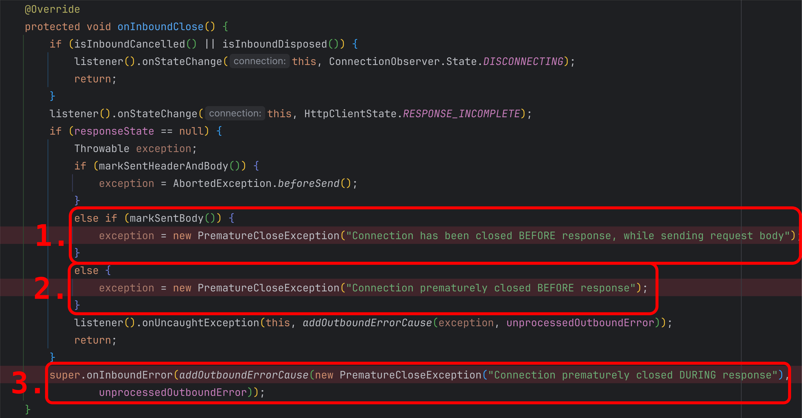

> 1. 요청 헤더 전송
> 2. 요청 바디 전송   ← 여기서 닫히면 `"while sending request body"` **아직 요청도 완전히 못 보낸 상태**
> 3. 요청 완료
> 4. 서버 처리 중     ← 여기서 닫히면 `"BEFORE response"` **요청은 보냈지만 응답을 아직 못 받은 상태**
> 5. 응답 헤더 수신
> 6. 응답 바디 수신   ← 여기서 닫히면 `"DURING response"` **응답을 받기 시작했지만 응답이 완전히 안 온 상태**
> 7. 응답 완료

## 1. BEFORE response while sending request body

송신 서버의 요청을 수신 서버가 수신 중에 (바디를 완전히 받기 전에) 연결을 종료하는 경우에 발생한다.  
**테스트 시나리오**: 스트리밍 바디를 전송하는 중에 서버가 두 번째 청크를 받으면 즉시 연결을 종료  
  
```kotlin
// WebClient Body
val chunkData = "X".repeat(4096) // 4KB per chunk
val streamingBody = Flux.interval(Duration.ofMillis(500))
    .take(20)  // 20개 청크 = 80KB
    .map { index ->
        logger.info("Preparing to send chunk ${index + 1}/20")
        chunkData
    }
    .doOnNext {
        logger.info("Sending chunk of ${it.length} bytes...")
    }
    .doOnComplete {
        logger.info("All chunks sent")
    }

// Netty 서버
fun main() {
    val parentGroup = NioEventLoopGroup()
    val workerGroup = NioEventLoopGroup()

    try {
        ServerBootstrap()
            .group(parentGroup, workerGroup)
            .channel(NioServerSocketChannel::class.java)
            .handler(LoggingHandler(LogLevel.DEBUG))    // 서버 자체 이벤트 로깅 (bind, accept 등)
            .childHandler(object : ChannelInitializer<SocketChannel>() {
                override fun initChannel(ch: SocketChannel) {           // ch는 연결된 클라이언트 채널
                    ch.pipeline().addLast(LoggingHandler(LogLevel.DEBUG))   // 클라이언트 데이터 송수신 체크
                    ch.pipeline().addLast(RudeServerHandler())
                }
            })
            .bind(9090).sync()
            .channel()
            .closeFuture().sync()
    } finally {
        parentGroup.shutdownGracefully()
        workerGroup.shutdownGracefully()
    }
}

private class RudeServerHandler : ChannelInboundHandlerAdapter() {
    private val logger = org.slf4j.LoggerFactory.getLogger("RudeServer")
    private var readCount = 0
    private var totalBytesReceived = 0

    override fun channelActive(ctx: ChannelHandlerContext) {
        super.channelActive(ctx)
        logger.info("Client connected: ${ctx.channel().remoteAddress()}")
    }

    override fun channelRead(ctx: ChannelHandlerContext, msg: Any) {
        val buffer = msg as io.netty.buffer.ByteBuf
        val readableBytes = buffer.readableBytes()
        readCount++
        totalBytesReceived += readableBytes
        
        logger.info("channelRead #$readCount: Received $readableBytes bytes (total: $totalBytesReceived)")
        
        // 첫 번째 read에서 헤더가 포함되어 있을 수 있음
        // 두 번째 read는 바디 데이터
        // 두 번째 청크를 받으면 연결 끊기
        if (readCount >= 2) {
            logger.info("Received 2nd chunk, closing connection WITHOUT sending response!")
            buffer.release()
            ctx.close().await()
        } else {
            logger.info("Waiting for more data...")
            buffer.release()
        }
    }
}
```
<br/>  
<details>
<summary>📋 WebClient와 Netty 로그 자세히보기 (클릭하여 펼치기)</summary>

```diff
+ <Spring WebClient 로그>

[reactor-http-kqueue-7] DEBUG r.n.r.PooledConnectionProvider - [c437bfe8] Created a new pooled channel, now: 0 active connections, 0 inactive connections and 0 pending acquire requests.
[reactor-http-kqueue-7] INFO  my-webclient - [c437bfe8] REGISTERED
[reactor-http-kqueue-7] DEBUG i.n.r.dns.DnsNameResolverBuilder - resolveCache and TTLs are mutually exclusive. TTLs are ignored.
[reactor-http-kqueue-7] DEBUG i.n.r.dns.DnsNameResolverBuilder - cnameCache and TTLs are mutually exclusive. TTLs are ignored.
[reactor-http-kqueue-7] DEBUG i.n.r.dns.DnsNameResolverBuilder - authoritativeDnsServerCache and TTLs are mutually exclusive. TTLs are ignored.
[reactor-http-kqueue-7] INFO  my-webclient - [c437bfe8] CONNECT: localhost/127.0.0.1:9090
[reactor-http-kqueue-7] DEBUG r.n.r.DefaultPooledConnectionProvider - [c437bfe8, L:/127.0.0.1:52226 - R:localhost/127.0.0.1:9090] Registering pool release on close event for channel
[reactor-http-kqueue-7] DEBUG r.n.r.PooledConnectionProvider - [c437bfe8, L:/127.0.0.1:52226 - R:localhost/127.0.0.1:9090] Channel connected, now: 1 active connections, 0 inactive connections and 0 pending acquire requests.
[reactor-http-kqueue-7] INFO  my-webclient - [c437bfe8, L:/127.0.0.1:52226 - R:localhost/127.0.0.1:9090] ACTIVE
[reactor-http-kqueue-7] DEBUG r.n.r.DefaultPooledConnectionProvider - [c437bfe8, L:/127.0.0.1:52226 - R:localhost/127.0.0.1:9090] onStateChange(PooledConnection{channel=[id: 0xc437bfe8, L:/127.0.0.1:52226 - R:localhost/127.0.0.1:9090]}, [connected])
[reactor-http-kqueue-7] DEBUG r.n.r.DefaultPooledConnectionProvider - [c437bfe8-1, L:/127.0.0.1:52226 - R:localhost/127.0.0.1:9090] onStateChange(GET{uri=null, connection=PooledConnection{channel=[id: 0xc437bfe8, L:/127.0.0.1:52226 - R:localhost/127.0.0.1:9090]}}, [configured])
[reactor-http-kqueue-7] DEBUG r.n.http.client.HttpClientConnect - [c437bfe8-1, L:/127.0.0.1:52226 - R:localhost/127.0.0.1:9090] Handler is being applied: {uri=http://localhost:9090/any-path, method=POST}
[reactor-http-kqueue-7] DEBUG r.n.r.DefaultPooledConnectionProvider - [c437bfe8-1, L:/127.0.0.1:52226 - R:localhost/127.0.0.1:9090] onStateChange(POST{uri=/any-path, connection=PooledConnection{channel=[id: 0xc437bfe8, L:/127.0.0.1:52226 - R:localhost/127.0.0.1:9090]}}, [request_prepared])
[reactor-http-kqueue-7] INFO  my-webclient - [c437bfe8-1, L:/127.0.0.1:52226 - R:localhost/127.0.0.1:9090] WRITE: 155B POST /any-path HTTP/1.1
[reactor-http-kqueue-7] INFO  my-webclient - [c437bfe8-1, L:/127.0.0.1:52226 - R:localhost/127.0.0.1:9090] FLUSH
[parallel-6] INFO  e.s.PrematureCloseExceptionService - Preparing to send chunk 1/20
[parallel-6] INFO  e.s.PrematureCloseExceptionService - Sending chunk of 4096 bytes...
[reactor-http-kqueue-7] INFO  my-webclient - [c437bfe8-1, L:/127.0.0.1:52226 - R:localhost/127.0.0.1:9090] WRITE: 6B 1000
[reactor-http-kqueue-7] INFO  my-webclient - [c437bfe8-1, L:/127.0.0.1:52226 - R:localhost/127.0.0.1:9090] WRITE: 4096B XXXX... // send data ...
[reactor-http-kqueue-7] INFO  my-webclient - [c437bfe8-1, L:/127.0.0.1:52226 - R:localhost/127.0.0.1:9090] WRITE: 2B 
[reactor-http-kqueue-7] INFO  my-webclient - [c437bfe8-1, L:/127.0.0.1:52226 - R:localhost/127.0.0.1:9090] FLUSH
[reactor-http-kqueue-7] INFO  my-webclient - [c437bfe8-1, L:/127.0.0.1:52226 - R:localhost/127.0.0.1:9090] READ COMPLETE
[reactor-http-kqueue-7] DEBUG r.n.r.PooledConnectionProvider - [c437bfe8-1, L:/127.0.0.1:52226 ! R:localhost/127.0.0.1:9090] Channel closed, now: 0 active connections, 0 inactive connections and 0 pending acquire requests.
[reactor-http-kqueue-7] INFO  my-webclient - [c437bfe8-1, L:/127.0.0.1:52226 ! R:localhost/127.0.0.1:9090] INACTIVE
[reactor-http-kqueue-7] DEBUG r.n.r.DefaultPooledConnectionProvider - [c437bfe8-1, L:/127.0.0.1:52226 ! R:localhost/127.0.0.1:9090] onStateChange(POST{uri=/any-path, connection=PooledConnection{channel=[id: 0xc437bfe8, L:/127.0.0.1:52226 ! R:localhost/127.0.0.1:9090]}}, [response_incomplete])
[reactor-http-kqueue-7] WARN  r.n.http.client.HttpClientConnect - [c437bfe8-1, L:/127.0.0.1:52226 ! R:localhost/127.0.0.1:9090] The connection observed an error
reactor.netty.http.client.PrematureCloseException: Connection has been closed BEFORE response, while sending request body
[reactor-http-kqueue-7] INFO  my-webclient - [c437bfe8-1, L:/127.0.0.1:52226 ! R:localhost/127.0.0.1:9090] UNREGISTERED
[http-nio-8080-exec-2] ERROR o.a.c.c.C.[.[.[.[dispatcherServlet] - Servlet.service() for servlet [dispatcherServlet] in context with path [] threw exception [Request processing failed: org.springframework.web.reactive.function.client.WebClientRequestException: Connection has been closed BEFORE response, while sending request body] with root cause
reactor.netty.http.client.PrematureCloseException: Connection has been closed BEFORE response, while sending request body
```

```diff
+ <Netty 서버 로그>

-- 리스너 포트 등록 및 활성화 완료
[nioEventLoopGroup-2-1] DEBUG i.n.handler.logging.LoggingHandler - [id: 0xc281fdae] REGISTERED
[nioEventLoopGroup-2-1] DEBUG i.n.handler.logging.LoggingHandler - [id: 0xc281fdae] BIND: 0.0.0.0/0.0.0.0:9090
[nioEventLoopGroup-2-1] DEBUG i.n.handler.logging.LoggingHandler - [id: 0xc281fdae, L:/[0:0:0:0:0:0:0:0]:9090] ACTIVE

-- 요청 수신
[nioEventLoopGroup-2-1] DEBUG i.n.handler.logging.LoggingHandler - [id: 0x5421fff9, L:/[0:0:0:0:0:0:0:0]:9090] READ: [id: 0x57861e0a, L:/127.0.0.1:9090 - R:/127.0.0.1:52226]
[nioEventLoopGroup-2-1] DEBUG i.n.handler.logging.LoggingHandler - [id: 0x5421fff9, L:/[0:0:0:0:0:0:0:0]:9090] READ COMPLETE
[nioEventLoopGroup-3-3] DEBUG i.n.handler.logging.LoggingHandler - [id: 0x57861e0a, L:/127.0.0.1:9090 - R:/127.0.0.1:52226] REGISTERED
[nioEventLoopGroup-3-3] DEBUG i.n.handler.logging.LoggingHandler - [id: 0x57861e0a, L:/127.0.0.1:9090 - R:/127.0.0.1:52226] ACTIVE
[nioEventLoopGroup-3-3] INFO  RudeServer - Client connected: /127.0.0.1:52226
[nioEventLoopGroup-3-3] DEBUG i.n.handler.logging.LoggingHandler - [id: 0x57861e0a, L:/127.0.0.1:9090 - R:/127.0.0.1:52226] READ: 155B
[nioEventLoopGroup-3-3] INFO  RudeServer - channelRead #1: Received 155 bytes (total: 155)
[nioEventLoopGroup-3-3] INFO  RudeServer - Waiting for more data...
[nioEventLoopGroup-3-3] DEBUG i.n.handler.logging.LoggingHandler - [id: 0x57861e0a, L:/127.0.0.1:9090 - R:/127.0.0.1:52226] READ COMPLETE
[nioEventLoopGroup-3-3] DEBUG i.n.handler.logging.LoggingHandler - [id: 0x57861e0a, L:/127.0.0.1:9090 - R:/127.0.0.1:52226] READ: 2048B
[nioEventLoopGroup-3-3] INFO  RudeServer - channelRead #2: Received 2048 bytes (total: 2203)
[nioEventLoopGroup-3-3] INFO  RudeServer - Received 2nd chunk, closing connection WITHOUT sending response!
[nioEventLoopGroup-3-3] DEBUG i.n.handler.logging.LoggingHandler - [id: 0x57861e0a, L:/127.0.0.1:9090 - R:/127.0.0.1:52226] CLOSE
[nioEventLoopGroup-3-3] DEBUG i.n.handler.logging.LoggingHandler - [id: 0x57861e0a, L:/127.0.0.1:9090 ! R:/127.0.0.1:52226] READ COMPLETE
[nioEventLoopGroup-3-3] DEBUG i.n.handler.logging.LoggingHandler - [id: 0x57861e0a, L:/127.0.0.1:9090 ! R:/127.0.0.1:52226] USER_EVENT: io.netty.channel.socket.ChannelInputShutdownReadComplete@6a0d7782
[nioEventLoopGroup-3-3] DEBUG i.n.handler.logging.LoggingHandler - [id: 0x57861e0a, L:/127.0.0.1:9090 ! R:/127.0.0.1:52226] INACTIVE
[nioEventLoopGroup-3-3] DEBUG i.n.handler.logging.LoggingHandler - [id: 0x57861e0a, L:/127.0.0.1:9090 ! R:/127.0.0.1:52226] UNREGISTERED
```
  
</details>
<br/>

1. `ChannelRegistered` : Channel 이 Event Loop에 등록됨
2. `ChannelActive` : Channel이 활성화됨, 이제 데이터를 주고받을 수 있음
3. `Channellnactive` : Channel이 원격 피어로 연결되지 않음
4. `ChannelUnregistered`: Channel이 생성됐지만 Event Loop에 등록되지 않음

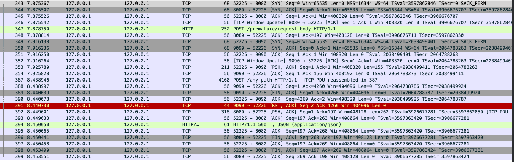

```diff
+ Netty 서버 로그
18:09:15.348 [nioEventLoopGroup-3-3] DEBUG i.n.handler.logging.LoggingHandler - [id: 0x57861e0a, L:/127.0.0.1:9090 ! R:/127.0.0.1:52226] USER_EVENT: io.netty.channel.socket.ChannelInputShutdownReadComplete@6a0d7782

+ RST 패킷
UTC Arrival Time: Oct  1, 2025 09:09:15.348334000 UTC
Transmission Control Protocol, Src Port: 9090, Dst Port: 52226, Seq: 2, Ack: 4260, Len: 0
Flags: 0x014 (RST, ACK)
```

## 2. BEFORE response

`BEFORE response while sending request body`와 비슷한 케이스이지만 요청 body가 없는 경우 이 메세지의 예외가 발생한다.  
**테스트 시나리오**: 요청 헤더만 받고 즉시 연결을 종료  
  
```kotlin
fun main() {
    val parentGroup = NioEventLoopGroup()
    val workerGroup = NioEventLoopGroup()

    try {
        ServerBootstrap()
            .group(parentGroup, workerGroup)
            .channel(NioServerSocketChannel::class.java)
            .handler(LoggingHandler(LogLevel.DEBUG))    // 서버 자체 이벤트 로깅 (bind, accept 등)
            .childHandler(object : ChannelInitializer<SocketChannel>() {
                override fun initChannel(ch: SocketChannel) {           // ch는 연결된 클라이언트 채널
                    ch.pipeline().addLast(LoggingHandler(LogLevel.DEBUG))   // 클라이언트 데이터 송수신 체크
                    ch.pipeline().addLast(RudeServerHandler())
                }
            })
            .bind(9090).sync()
            .channel()
            .closeFuture().sync()
    } finally {
        parentGroup.shutdownGracefully()
        workerGroup.shutdownGracefully()
    }
}

private class RudeServerHandler : ChannelInboundHandlerAdapter() {
    private val logger = org.slf4j.LoggerFactory.getLogger("RudeServer")

    override fun channelActive(ctx: ChannelHandlerContext) {
        super.channelActive(ctx)
        logger.info("Client connected: ${ctx.channel().remoteAddress()}")
    }

    override fun channelRead(ctx: ChannelHandlerContext, msg: Any) {
        logger.info("Received message: $msg")
        logger.info("Closing connection !!!")
        ctx.close().await()
    }
}
```

<br/>
<details>
<summary>📋 WebClient와 Netty 로그 자세히보기 (클릭하여 펼치기)</summary>

```diff
+ <Spring WebClient 로그>

[reactor-http-kqueue-4] DEBUG r.n.r.PooledConnectionProvider - [ace71497] Created a new pooled channel, now: 0 active connections, 0 inactive connections and 0 pending acquire requests.
[reactor-http-kqueue-4] INFO  my-webclient - [ace71497] REGISTERED
[reactor-http-kqueue-4] DEBUG i.n.r.dns.DnsNameResolverBuilder - resolveCache and TTLs are mutually exclusive. TTLs are ignored.
[reactor-http-kqueue-4] DEBUG i.n.r.dns.DnsNameResolverBuilder - cnameCache and TTLs are mutually exclusive. TTLs are ignored.
[reactor-http-kqueue-4] DEBUG i.n.r.dns.DnsNameResolverBuilder - authoritativeDnsServerCache and TTLs are mutually exclusive. TTLs are ignored.
[reactor-http-kqueue-4] INFO  my-webclient - [ace71497] CONNECT: localhost/127.0.0.1:9090
[reactor-http-kqueue-4] DEBUG r.n.r.DefaultPooledConnectionProvider - [ace71497, L:/127.0.0.1:50390 - R:localhost/127.0.0.1:9090] Registering pool release on close event for channel
[reactor-http-kqueue-4] DEBUG r.n.r.PooledConnectionProvider - [ace71497, L:/127.0.0.1:50390 - R:localhost/127.0.0.1:9090] Channel connected, now: 1 active connections, 0 inactive connections and 0 pending acquire requests.
[reactor-http-kqueue-4] INFO  my-webclient - [ace71497, L:/127.0.0.1:50390 - R:localhost/127.0.0.1:9090] ACTIVE
[reactor-http-kqueue-4] DEBUG r.n.r.DefaultPooledConnectionProvider - [ace71497, L:/127.0.0.1:50390 - R:localhost/127.0.0.1:9090] onStateChange(PooledConnection{channel=[id: 0xace71497, L:/127.0.0.1:50390 - R:localhost/127.0.0.1:9090]}, [connected])
[reactor-http-kqueue-4] DEBUG r.n.r.DefaultPooledConnectionProvider - [ace71497-1, L:/127.0.0.1:50390 - R:localhost/127.0.0.1:9090] onStateChange(GET{uri=null, connection=PooledConnection{channel=[id: 0xace71497, L:/127.0.0.1:50390 - R:localhost/127.0.0.1:9090]}}, [configured])
[reactor-http-kqueue-4] DEBUG r.n.http.client.HttpClientConnect - [ace71497-1, L:/127.0.0.1:50390 - R:localhost/127.0.0.1:9090] Handler is being applied: {uri=http://localhost:9090/any-path, method=POST}
[reactor-http-kqueue-4] DEBUG r.n.r.DefaultPooledConnectionProvider - [ace71497-1, L:/127.0.0.1:50390 - R:localhost/127.0.0.1:9090] onStateChange(POST{uri=/any-path, connection=PooledConnection{channel=[id: 0xace71497, L:/127.0.0.1:50390 - R:localhost/127.0.0.1:9090]}}, [request_prepared])
[reactor-http-kqueue-4] INFO  my-webclient - [ace71497-1, L:/127.0.0.1:50390 - R:localhost/127.0.0.1:9090] WRITE: 123B POST /any-path HTTP/1.1
[reactor-http-kqueue-4] INFO  my-webclient - [ace71497-1, L:/127.0.0.1:50390 - R:localhost/127.0.0.1:9090] FLUSH
[reactor-http-kqueue-4] INFO  my-webclient - [ace71497-1, L:/127.0.0.1:50390 - R:localhost/127.0.0.1:9090] WRITE: 5B 0
[reactor-http-kqueue-4] INFO  my-webclient - [ace71497-1, L:/127.0.0.1:50390 - R:localhost/127.0.0.1:9090] FLUSH
[reactor-http-kqueue-4] DEBUG r.n.r.DefaultPooledConnectionProvider - [ace71497-1, L:/127.0.0.1:50390 - R:localhost/127.0.0.1:9090] onStateChange(POST{uri=/any-path, connection=PooledConnection{channel=[id: 0xace71497, L:/127.0.0.1:50390 - R:localhost/127.0.0.1:9090]}}, [request_sent])
[reactor-http-kqueue-4] INFO  my-webclient - [ace71497-1, L:/127.0.0.1:50390 - R:localhost/127.0.0.1:9090] READ COMPLETE
[reactor-http-kqueue-4] DEBUG r.n.r.PooledConnectionProvider - [ace71497-1, L:/127.0.0.1:50390 ! R:localhost/127.0.0.1:9090] Channel closed, now: 0 active connections, 0 inactive connections and 0 pending acquire requests.
[reactor-http-kqueue-4] INFO  my-webclient - [ace71497-1, L:/127.0.0.1:50390 ! R:localhost/127.0.0.1:9090] INACTIVE
[reactor-http-kqueue-4] DEBUG r.n.r.DefaultPooledConnectionProvider - [ace71497-1, L:/127.0.0.1:50390 ! R:localhost/127.0.0.1:9090] onStateChange(POST{uri=/any-path, connection=PooledConnection{channel=[id: 0xace71497, L:/127.0.0.1:50390 ! R:localhost/127.0.0.1:9090]}}, [response_incomplete])
[reactor-http-kqueue-4] WARN  r.n.http.client.HttpClientConnect - [ace71497-1, L:/127.0.0.1:50390 ! R:localhost/127.0.0.1:9090] The connection observed an error
reactor.netty.http.client.PrematureCloseException: Connection prematurely closed BEFORE response
[reactor-http-kqueue-4] INFO  my-webclient - [ace71497-1, L:/127.0.0.1:50390 ! R:localhost/127.0.0.1:9090] UNREGISTERED
[http-nio-8080-exec-6] ERROR o.a.c.c.C.[.[.[.[dispatcherServlet] - Servlet.service() for servlet [dispatcherServlet] in context with path [] threw exception [Request processing failed: org.springframework.web.reactive.function.client.WebClientRequestException: Connection prematurely closed BEFORE response] with root cause
reactor.netty.http.client.PrematureCloseException: Connection prematurely closed BEFORE response
```

```diff
+ <Netty 서버 로그>

-- 리스너 포트 등록 및 활성화 완료
[nioEventLoopGroup-2-1] DEBUG i.n.handler.logging.LoggingHandler - [id: 0x1828781c] REGISTERED
[nioEventLoopGroup-2-1] DEBUG i.n.handler.logging.LoggingHandler - [id: 0x1828781c] BIND: 0.0.0.0/0.0.0.0:9090
[nioEventLoopGroup-2-1] DEBUG i.n.handler.logging.LoggingHandler - [id: 0x1828781c, L:/[0:0:0:0:0:0:0:0]:9090] ACTIVE

-- 요청 수신
[nioEventLoopGroup-2-1] DEBUG i.n.handler.logging.LoggingHandler - [id: 0x1828781c, L:/[0:0:0:0:0:0:0:0]:9090] READ: [id: 0xb065a578, L:/127.0.0.1:9090 - R:/127.0.0.1:50390]
[nioEventLoopGroup-2-1] DEBUG i.n.handler.logging.LoggingHandler - [id: 0x1828781c, L:/[0:0:0:0:0:0:0:0]:9090] READ COMPLETE
[nioEventLoopGroup-3-2] DEBUG i.n.handler.logging.LoggingHandler - [id: 0xb065a578, L:/127.0.0.1:9090 - R:/127.0.0.1:50390] REGISTERED
[nioEventLoopGroup-3-2] DEBUG i.n.handler.logging.LoggingHandler - [id: 0xb065a578, L:/127.0.0.1:9090 - R:/127.0.0.1:50390] ACTIVE
[nioEventLoopGroup-3-2] INFO  RudeServer - Client connected: /127.0.0.1:50390
[nioEventLoopGroup-3-2] DEBUG i.n.handler.logging.LoggingHandler - [id: 0xb065a578, L:/127.0.0.1:9090 - R:/127.0.0.1:50390] READ: 128B
[nioEventLoopGroup-3-2] INFO  RudeServer - Received message: PooledUnsafeDirectByteBuf(ridx: 0, widx: 128, cap: 2048)
[nioEventLoopGroup-3-2] INFO  RudeServer - Closing connection !!!
[nioEventLoopGroup-3-2] DEBUG i.n.handler.logging.LoggingHandler - [id: 0xb065a578, L:/127.0.0.1:9090 - R:/127.0.0.1:50390] CLOSE
[nioEventLoopGroup-3-2] DEBUG i.n.handler.logging.LoggingHandler - [id: 0xb065a578, L:/127.0.0.1:9090 ! R:/127.0.0.1:50390] READ COMPLETE
[nioEventLoopGroup-3-2] DEBUG i.n.handler.logging.LoggingHandler - [id: 0xb065a578, L:/127.0.0.1:9090 ! R:/127.0.0.1:50390] INACTIVE
[nioEventLoopGroup-3-2] DEBUG i.n.handler.logging.LoggingHandler - [id: 0xb065a578, L:/127.0.0.1:9090 ! R:/127.0.0.1:50390] UNREGISTERED
```
</details>
<br/>

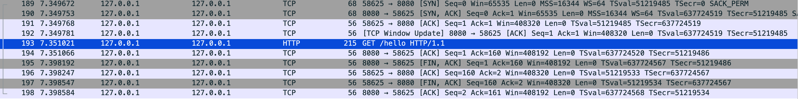

`BEFORE response while sending request body` 다른 점은 Netty 서버에서 USER_EVENT가 발생하지 않는 차이점이 있다.  

## 3. DURING response

송신 서버가 수신 서버에게 헤더를 정상적으로 응답받고 바디를 대기하는 도중 커넥션이 송신 서버가 커넥션을 일방적으로 닫는 경우이다.  
즉, 송신 서버가 헤더를 정상적으로 받고 바디를 완전히 받기 위해 대기하는 중에 수신 서버가 일방적으로 커넥션을 종료하는 경우이다.  
**테스트 시나리오**: 응답 헤더와 일부 바디를 전송한 후 연결 종료  
  
```kotlin
// 송신 서버의 API
@GetMapping("/abort-connection")
fun abortConnection(response: HttpServletResponse) {
    logger.info("Starting abort connection...")
    
    try {
        val writer = response.writer
        
        // 응답 데이터를 한 번 전송하여 클라이언트가 정상적으로 읽기 시작하도록 유도
        writer.write("Starting response...")
        writer.flush()

        Thread.sleep(100)

        // 일방적으로 종료! FIN 패킷 전달
        response.outputStream.close()

        writer.write("This should not be sent")
        
    } catch (e: IOException) {
        logger.error("IOException during abort: ${e.message}")
    }
}
```

<br/>
<details>
<summary>💡 WebClient Connection Pool 로그 자세히보기</summary>

```diff
Creating a new [my-provider] client pool [PoolFactory{evictionInterval=PT0S, leasingStrategy=fifo, maxConnections=1, maxIdleTime=-1, maxLifeTime=-1, metricsEnabled=false, pendingAcquireMaxCount=2, pendingAcquireTimeout=45000}] for [localhost/<unresolved>:9090]
[551113d8] Created a new pooled channel, now: 0 active connections, 0 inactive connections and 0 pending acquire requests.
[551113d8] REGISTERED
[551113d8] CONNECT: localhost/127.0.0.1:9090
[551113d8, L:/127.0.0.1:53169 - R:localhost/127.0.0.1:9090] Registering pool release on close event for channel
[551113d8, L:/127.0.0.1:53169 - R:localhost/127.0.0.1:9090] Channel connected, now: 1 active connections, 0 inactive connections and 0 pending acquire requests.
[551113d8, L:/127.0.0.1:53169 - R:localhost/127.0.0.1:9090] ACTIVE
[551113d8, L:/127.0.0.1:53169 - R:localhost/127.0.0.1:9090] onStateChange(PooledConnection{channel=[id: 0x551113d8, L:/127.0.0.1:53169 - R:localhost/127.0.0.1:9090]}, [connected])
[551113d8-1, L:/127.0.0.1:53169 - R:localhost/127.0.0.1:9090] onStateChange(GET{uri=null, connection=PooledConnection{channel=[id: 0x551113d8, L:/127.0.0.1:53169 - R:localhost/127.0.0.1:9090]}}, [configured])
[New Connection] : GET{uri=null, connection=PooledConnection{channel=[id: 0x551113d8, L:/127.0.0.1:53169 - R:localhost/127.0.0.1:9090]}}
[551113d8-1, L:/127.0.0.1:53169 - R:localhost/127.0.0.1:9090] Handler is being applied: {uri=http://localhost:9090/force/abort-connection, method=GET}
[551113d8-1, L:/127.0.0.1:53169 - R:localhost/127.0.0.1:9090] onStateChange(GET{uri=/force/abort-connection, connection=PooledConnection{channel=[id: 0x551113d8, L:/127.0.0.1:53169 - R:localhost/127.0.0.1:9090]}}, [request_prepared])
[551113d8-1, L:/127.0.0.1:53169 - R:localhost/127.0.0.1:9090] WRITE: 108B GET /force/abort-connection HTTP/1.1
user-agent: ReactorNetty/1.1.22
host: localhost:9090
accept: */*

[551113d8-1, L:/127.0.0.1:53169 - R:localhost/127.0.0.1:9090] FLUSH
[551113d8-1, L:/127.0.0.1:53169 - R:localhost/127.0.0.1:9090] WRITE: 0B
[551113d8-1, L:/127.0.0.1:53169 - R:localhost/127.0.0.1:9090] FLUSH
[551113d8-1, L:/127.0.0.1:53169 - R:localhost/127.0.0.1:9090] onStateChange(GET{uri=/force/abort-connection, connection=PooledConnection{channel=[id: 0x551113d8, L:/127.0.0.1:53169 - R:localhost/127.0.0.1:9090]}}, [request_sent])
[551113d8-1, L:/127.0.0.1:53169 - R:localhost/127.0.0.1:9090] READ: 108B HTTP/1.1 200 
Transfer-Encoding: chunked
Date: Sat, 27 Sep 2025 05:28:01 GMT
14
Starting response...    // 첫 번째 청킹 데이터 정상적으로 응답받음
[551113d8-1, L:/127.0.0.1:53169 - R:localhost/127.0.0.1:9090] Received response (auto-read:false) : RESPONSE(decodeResult: success, version: HTTP/1.1)
[551113d8-1, L:/127.0.0.1:53169 - R:localhost/127.0.0.1:9090] onStateChange(GET{uri=/force/abort-connection, connection=PooledConnection{channel=[id: 0x551113d8, L:/127.0.0.1:53169 - R:localhost/127.0.0.1:9090]}}, [response_received])
[551113d8-1, L:/127.0.0.1:53169 - R:localhost/127.0.0.1:9090] [terminated=false, cancelled=false, pending=0, error=null]: subscribing inbound receiver
[551113d8-1, L:/127.0.0.1:53169 - R:localhost/127.0.0.1:9090] READ COMPLETE
[551113d8-1, L:/127.0.0.1:53169 - R:localhost/127.0.0.1:9090] READ COMPLETE
[551113d8-1, L:/127.0.0.1:53169 ! R:localhost/127.0.0.1:9090] Channel closed, now: 0 active connections, 0 inactive connections and 0 pending acquire requests.
[Connection Closed] : GET{uri=/force/abort-connection, connection=PooledConnection{channel=[id: 0x551113d8, L:/127.0.0.1:53169 ! R:localhost/127.0.0.1:9090]}}
[551113d8-1, L:/127.0.0.1:53169 ! R:localhost/127.0.0.1:9090] INACTIVE
[551113d8-1, L:/127.0.0.1:53169 ! R:localhost/127.0.0.1:9090] onStateChange(GET{uri=/force/abort-connection, connection=PooledConnection{channel=[id: 0x551113d8, L:/127.0.0.1:53169 ! R:localhost/127.0.0.1:9090]}}, [response_incomplete])
[551113d8-1, L:/127.0.0.1:53169 ! R:localhost/127.0.0.1:9090] UNREGISTERED
Servlet.service() for servlet [dispatcherServlet] in context with path [] threw exception 
[Request processing failed: org.springframework.web.reactive.function.client.WebClientResponseException: 200 OK from GET http://localhost:9090/force/abort-connection, 
but response failed with cause: reactor.netty.http.client.PrematureCloseException: Connection prematurely closed DURING response] with root cause
```

</details>
<br/>

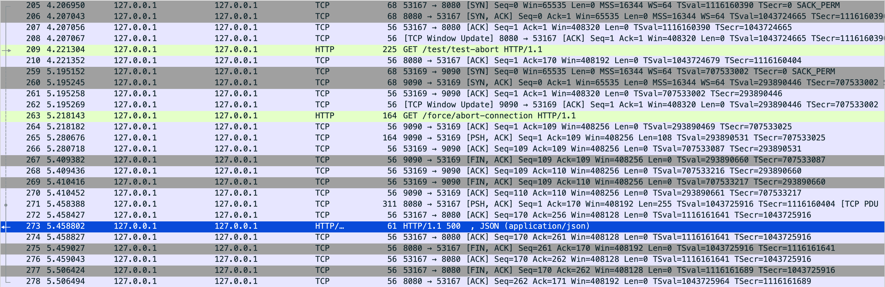

이 세 가지 다른 예외 메시지는 복잡한 네트워크 통신에서 발생하는 예외를 더 자세하게 표현하기 위해 나뉘어진 것을 확인할 수 있다.

# 커널 TCP 소켓 상태에 따른 처리

4-way handshake 단계를 진행 중인 커넥션을 사용하여 요청을 보내면 어떻게 되는지 확인해보자.  
실제로는 굉장히 짧은 시간에 이루어지기 때문에 재현하기 힘들어 TCP 커널 코드를 확인해보면서 유추해보자.

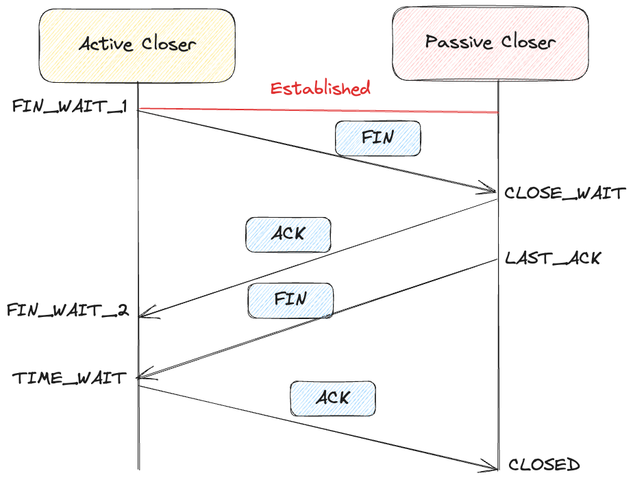

**Active Closer의 정상적인 상태 진행** ESTABLISHED → FIN_WAIT1 → FIN_WAIT2 → TIME_WAIT → CLOSE
  
## 커널 레벨 처리 로직
   
[tcp_ipv4.c `tcp_v4_do_rcv(...)`](https://github.com/torvalds/linux/blob/master/net/ipv4/tcp_ipv4.c#L1905) 함수를 보면 소켓 상태에 따른 처리 방식을 확인할 수 있다.
  
<h4>주요 TCP 상태 설명</h4>

1. **FIN-WAIT-1**: 자신이 보낸 종료 요청(FIN)에 대한 ACK을 기다리거나, 상대방의 FIN을 기다리는 상태
2. **CLOSE-WAIT**: 상대방으로부터 FIN을 받고 ACK를 보낸 후, 애플리케이션이 close()를 호출할 때까지 기다리는 상태
3. **FIN-WAIT-2**: 상대방의 FIN을 기다리는 상태 (자신의 FIN에 대한 ACK는 이미 받음)
4. **LAST-ACK**: 자신이 보낸 FIN에 대한 ACK를 기다리는 상태
5. **TIME-WAIT**: 상대방이 마지막 ACK를 확실히 받았음을 보장하고, 이전 연결의 지연된 패킷이 새 연결에 영향을 주지 않도록 일정 시간 대기하는 상태 (보통 2*MSL)
6. **CLOSED**: 연결이 완전히 종료된 상태
  
```c
int tcp_v4_do_rcv(struct sock *sk, struct sk_buff *skb)
{
    // 1. 수신된 데이터를 사용자 영역에 전달할 수 있는 상태인 경우
    if (sk->sk_state == TCP_ESTABLISHED) { /* Fast path */
        // ...
        tcp_rcv_established(sk, skb);
        return 0;
    }

    // 2. 연결 요청을 기다리는 상태인 경우
    if (sk->sk_state == TCP_LISTEN) {
        // ...
    } else
        sock_rps_save_rxhash(sk, skb);

    // 3. 그 외의 상태인 경우
    reason = tcp_rcv_state_process(sk, skb);
    if (reason) {
        rsk = sk;
        goto reset;
    }
    return 0;

// RST 패킷 전송
reset:
    tcp_v4_send_reset(rsk, skb, sk_rst_convert_drop_reason(reason));

tcp_rcv_state_process(struct sock *sk, struct sk_buff *skb)
{
    ... (중략) ...
    switch (sk->sk_state) {
    case TCP_CLOSE:
        ... (중략) ...

    case TCP_LISTEN:
        if (th->ack)
            return 1;

        if (th->rst) {
            ... (중략) ...
        }
        if (th->syn) {
            ... (중략) ...
        }
        goto discard;

    case TCP_SYN_SENT:
        ... (중략) ...
        return 0;
    }
    ... (중략) ...

    switch (sk->sk_state) {
    case TCP_SYN_RECV:
        ... (중략) ...
    case TCP_FIN_WAIT1:
    case TCP_FIN_WAIT2:
        if (sk->sk_shutdown & RCV_SHUTDOWN) {
            // 서버가 close()를 호출했으므로 RCV_SHUTDOWN이 설정됨
            if (TCP_SKB_CB(skb)->end_seq != TCP_SKB_CB(skb)->seq &&
                after(TCP_SKB_CB(skb)->end_seq - th->fin, tp->rcv_nxt)) {
                // 데이터가 포함된 패킷이면
                NET_INC_STATS(sock_net(sk), LINUX_MIB_TCPABORTONDATA);
                tcp_reset(sk, skb);  // ← RST 전송!
                return SKB_DROP_REASON_TCP_ABORT_ON_DATA;
            }
        }
        ... (중략) ...
    case TCP_CLOSING:
        ... (중략) ...
    case TCP_LAST_ACK:
        ... (중략) ...
    }
}
```

1. **TCP_FIN_WAIT1, TCP_FIN_WAIT2 상태** : 데이터가 포함되어 있다면 즉시 RST 패킷 전송
2. **TCP_TIME_WAIT 상태** : RST 패킷 전송 [tcp_minisocks.c#L99](https://github.com/torvalds/linux/blob/master/net/ipv4/tcp_minisocks.c#L99)
   - TIME_WAIT은 마지막 ACK가 유실될 경우를 대비하여 상대방이 FIN을 재전송하는 경우 대응하기 위한 상태이다.
  
이는 종료 절차가 진행 중인 연결에 새로운 데이터가 오는 것을 비정상적인 상황으로 간주하여 강제로 연결을 리셋하기 때문이다.

# 원인과 예방 방법

`PrematureCloseException`예외가 무엇인지, 예외의 메세지가 왜 서로 다른지 알아보았다.  
이 예외의 원인인 서버가 갑자기 연결을 끊는 경우는 어떤 경우가 있는지, 예방 방법은 무엇인지 알아보자.

## 로드밸런서와 서버간 timeout이 다른 경우

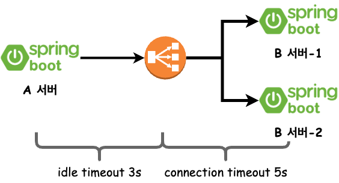

이 이미지와 같이 LB와 서버의 timeout 값이 서로 다를 때 RST 패킷으로 인해 PrematureCloseException 예외가 발생할 수 있다.  

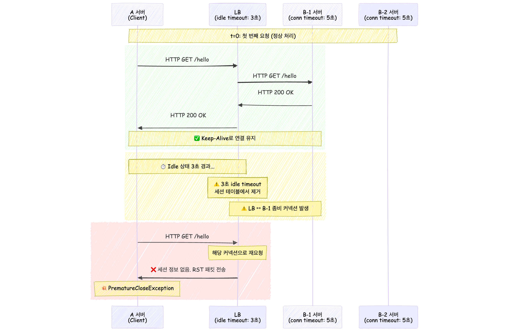

로드밸런서의 세션 테이블이 갱신되는 경우 직접적으로 FIN 이나 RST를 보내지 않고 조용히 세션 테이블을 갱신하기 때문이다.  
송신 서버는 이미 3-way handshake가 끝났다고 기억하고 있기 때문에 바로 바디를 전송하는 경우 로드밸런서는 RST 플래그를 반환하는 케이스가 발생할 수 있다.  
 

>  It’s also important to note that almost all firewalls will silently remove idle connections from their state and will not initiate a close (send a TCP FIN or RST) to the client or server.  
> The NLB has a fixed idle timeout of 350 seconds for TCP flows. Once the idle timeout is reached or a TCP connection is closed, it is removed from NLB’s connection state table.  
> [`AWS` Introducing configurable Idle timeout for Connection tracking](https://aws.amazon.com/ko/blogs/networking-and-content-delivery/introducing-configurable-idle-timeout-for-connection-tracking/)

## WebClient maxIdleTime 설정 부재

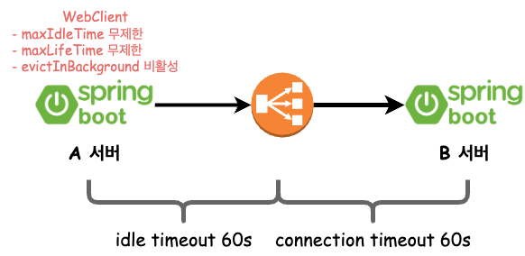

실무의 운영환경은 위와 같이 로드밸러서와 수신 서버의 timeout 설정이 동일했기 때문에 세션 테이블 갱신이 원인이 되지는 않을 것이다.  
또 다른 추정으로는 Reactor Netty 클라이언트가 커넥션 풀을 통해 Connection을 획득했을 때는 열려 있었지만 그 직후 외부 요인(네트워크 구성요소 등)으로 인해 연결이 닫힌 경우이다.  

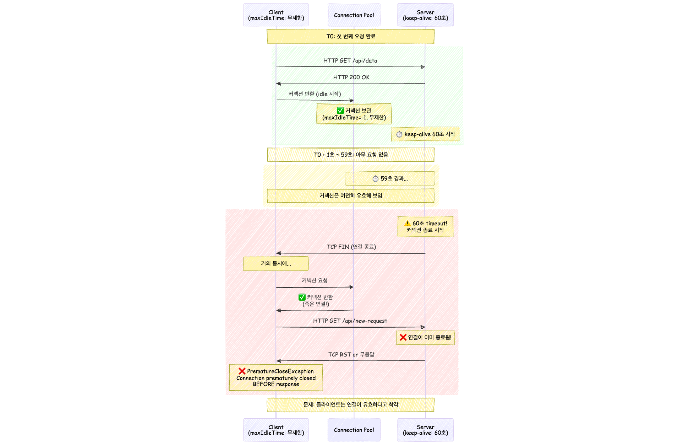

1. 클라이언트가 요청 완료 후 커넥션을 풀에 반환 (시각 `T0`)
2. 서버의 keep-alive timeout은 `60초`
3. 클라이언트 maxIdleTime은 무제한
4. `T0 + 60초 이상`에 클라이언트가 해당 커넥션을 다시 사용하려고 시도
5. 서버는 이미 커넥션을 닫았거나 닫는 과정에 있음
6. **Race Condition 발생**: 클라이언트가 요청을 보내는 시점과 서버의 연결 종료 시점이 겹침
7. **PrematureCloseException 발생**
  
이 경우 Reactor Netty의 timeout 관련 옵션을 적절히 조정하면 문제 해결에 도움이 될 수 있다.  

```kotlin
// AS-IS
private val client = WebClient.builder()
    .baseUrl({url})
    .build()

// TO-BE
private fun connectionProvider(): ConnectionProvider =
    ConnectionProvider.builder("client-pool")
        .maxIdleTime(Duration.ofSeconds(45)) // 서버 keep-alive timeout 보다 짧게 설정
        .build()

private val httpClient = HttpClient.create(connectionProvider())

private val client = WebClient
    .builder()
    .clientConnector(ReactorClientHttpConnector(httpClient))
    .baseUrl(baseURL)
    .build()
```

서버가 커넥션을 닫기 전에 클라이언트가 proactive하게 커넥션을 정리해서 race condition을 방지할 수 있기에 maxIdleTime을 서버의 keep-alive timeout보다 작게 지정하였다.  

## maxIdleTime 설정 이후 커넥션 풀 예외 발생

maxIdleTime을 설정한 이후 커넥션 풀의 커넥션 고갈 예외가 발생한 것을 확인했다.  

```diff
Exception in thread "DefaultDispatcher-worker-5" Exception in thread "DefaultDispatcher-worker-1" Exception in thread "DefaultDispatcher-worker-7" Exception in thread "DefaultDispatcher-worker-10" Exception in thread "DefaultDispatcher-worker-3" org.springframework.web.reactive.function.client.WebClientRequestException: Pending acquire queue has reached its maximum size of 32
```

```diff
Creating a new [client-pool] client pool 
[
    PoolFactory{
        evictionInterval=PT0S,
        leasingStrategy=fifo, 
+       maxConnections=16, 
        maxIdleTime=45000, 
        maxLifeTime=-1, 
        metricsEnabled=false, 
+       pendingAcquireMaxCount=32, 
        pendingAcquireTimeout=45000
    }
] 
for [{url}]
```
  
<h4>maxIdleTime 설정 전</h4>

- 연결은 충분히 재사용 가능하기에 불규칙한 트래픽에 유용함.
- 하지만 서버가 FIN 패킷을 보낼 때까지 Connection을 보유하기에 PrematureCloseException 발생 가능성 높았음.
- 또한 Stale Connection 문제로 Connection reset by peer 예외도 발생 가능성 있음.
  
<h4>maxIdleTime 설정 후</h4>

- PrematureCloseException 발생 가능성 및 Stale Connection 문제를 예방할 수 있음.
- 하지만 idle 시간 초과로 인해 Connection이 자주 제거되어 새 연결을 계속 생성하기에 TCP 오버헤드 증가.
- `연결 생성 속도 < 요청 속도` 대기 큐에 요청이 쌓여 Connection 고갈 문제 발생할 수 있음.
  
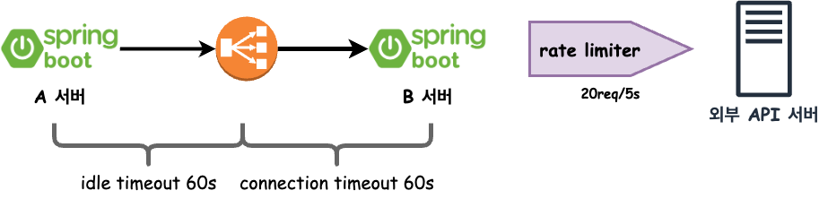
<br/>

이 상황을 고려해서 설정을 다시 했다.

1. **하루에 N번 정기적으로 호출**
2. **400 ~ 500명에 대한 배치성 부하**
3. **실시간이 보장되지 않아도 좋음**
4. **한 번쯤 전송되지 않아도 큰 문제가 있지 않음**
5. **B 서버의 응답은 300ms 이내 응답**
6. **외부 API 서버에 rate limiter가 존재함**

```diff
Creating a new [client-pool] client pool 
[
    PoolFactory{
        evictionInterval=PT0S,
        leasingStrategy=fifo, 
-       maxConnections=16,         
+       maxConnections=10, -- rate limiter가 존재하여 방어적으로 전송
        maxIdleTime=45000, 
        maxLifeTime=-1, 
        metricsEnabled=false, 
-       pendingAcquireMaxCount=32, 
+       pendingAcquireMaxCount=500,  -- 최대 요청에 수용 가능한 정도
-       pendingAcquireTimeout=45000
+       pendingAcquireTimeout=180000  -- 최대 요청이 증가함에 대비하여 여유롭게 대기
    }
] 
for [{url}]
```

# 💡 DB Connection Pool은 어떻게 설정하는게 좋을까?
  
그렇다면 DB Connection Pool은 어떻게 설정해야 할까?  
[HikariCP About Pool Sizing](https://github.com/brettwooldridge/HikariCP/wiki/About-Pool-Sizing)을 통해 Pool Sizing에 대한 가이드를 읽을 수 있다.  
  
- 풀 사이즈 관련 설정들(**maximumPoolSize**, minimumIdle, idleTimeout)
- 커넥션 생명주기 관리(maxLifetime, **keepaliveTime**)
- 커넥션 요청 대기(**connectionTimeout**)

풀 사이즈 관련 설정 중 maximumPoolSize에 대해 일반적으로 추천하는 사이즈는 아래와 같다.  

```
core_count: 하이퍼스레딩 제외한 물리 코어 수
effective_spindle_count: 실제 디스크 동시 처리 가능 수 (데이터가 메모리에 캐싱되어 있으면 0)

connections = ((core_count * 2) + effective_spindle_count)
```

그렇다고 풀 사이즈를 단순히 크게 지정한다고 해서 성능이 보장되는 것은 아니다.  
- 소수 커넥션이 스레드에 의해 포화될 때가 최적
- 나머지 스레드는 커넥션을 기다리도록 하고, **데이터베이스가 동시에 처리할 수 있는 쿼리 수(max)를 기준으로 풀 크기 산정**
- 기본 값은 10개 (4코어 + 1스핀들 -> 9 ~ 10개 적정)
  
또한 데드 락을 피할 수 있는 **최소 커넥션 수 산정 공식**도 확인할 수 있다.  
  
```
Tn: 동시에 실행되는 최대 쓰레드 수 (예: 동시 처리 요청 수)
Cm: 한 요청(Task)이 동시에 필요로 하는 커넥션 수 (예: ID 채번/메인 쿼리 등 다중 커넥션)

최소 커넥션 풀 사이즈 = Tn × (Cm − 1) + 1
```

예를 들어, 16개의 요청(Tn)이 각각 2개(Cm)의 커넥션을 필요로 하면 최소 17개의 커넥션 풀을 설정해야 데드락이 발생하지 않는다.  
- 동시 요청 10개(Tn=10), 요청당 최대 2개 커넥션 필요(Cm=2) → `10×(2−1)+1=11`
- 동시 요청 20개, 요청당 3개 커넥션 필요 → `20×(3−1)+1=41`
  
> **maximumPoolSize (idle + in-use connection)와 연관된 속성**  
> - minimumIdle: 풀에서 유지하는 최소 idle 커넥션 갯수 (default: maximumPoolSize와 동일)
> - idleTimeout: 풀에서 커넥션이 idle 상태로 유지되는 최대 시간 (minimum: 10초, default: 10분)
> 즉, idle connection 수가 minimulIdle보다 작고, 전체 connection 수도 maximumPoolSize보다 작다면 신속하게 추가로 connection을 만든다.  
> **기본적으로 minimumIdle과 maximumPoolSize는 동일한 값으로 지정되어 있다. minimumIdle을 maximumPoolSize보다 작게 설정한 경우 예상하지 못한 트래픽이 몰려오면 connection을 생성하는 비용 때문에 병목이 생길 수 있기 때문에 기본값을 활용하는 것이 좋다.**

서비스 환경의 네트워크와 DB 속성을 확인하여 아래의 설정도 확인하는 것이 좋다.
1. **maxLifetime** : DB 혹은 네트워크 infra에서 설정된 "최대 커넥션 생존 시간(wait_timeout 등)"보다 수 초 짧게 설정 필요 (default 30분). pool로 반환이 안되면 connection을 제거할 수 없기 때문에 pool로 반환을 잘 시켜주는 것이 중요하다.
2. **keepaliveTime** : idle 커넥션 생존을 위해 상태 확인 주기, db/network timeout보다 짧게 (default 2분)
3. **connectionTimeout** : 풀에서 커넥션을 가져올 때 기다리는 최대 시간, 기본 값은 너무 커 트래픽이 몰리는 경우 서버 스레드가 커넥션을 획득하기 위해 대량으로 블로킹될 가능성이 있음 (default 30초)
  
> 💡 DB 서버 설정은?
> - `max_connections` : client와 맺을 수 있는 최대 connection 수이다. 스케일 아웃에 대비하여 클라이언트들의 최대 사용 수를 확인하여 설정하는게 좋다.
> - `wait_timeout` (default 28800) : connection이 inactive할 때 다시 요청이 오기까지 얼마의 시간을 기다린뒤에 close 할 것인지를 결정한다. (애플리케이션의 keepaliveTime보다 길게 설정되어야 한다.)

실제 최적값을 찾기 위해 공식 가이드나 추천을 통해 도움을 받을 수 있지만, 서비스 특성에 따른 트래픽 패턴이나 쿼리 패턴은 다 다르기 때문에 꾸준한 모니터링과 테스트가 필요하다.  

maximumPoolSize: 5 <-> max_connections: 30
현재 처리하고 있는 트래픽의 두,세 배가 유입되면 현재 설정으로 대응이 가능할까?  
DB 서버 또는 애플리케이션 서버의 리소스를 더 잘 활용하고 싶은데 적절한 설정일까?  

1. 모니터링 환경 구축 (서버 리소스, 서버 스레드 수, DBCP 등등)
2. 백엔드 시스템 부하 테스트 (nGrinder, K6 등)
3. request per second와 avg response time 확인
4. 백엔드 서버, DB 서버의 CPU, Memory 등 리소스 사용률을 확인하여 인스턴스 스케일 아웃으로 대응 가능한지 확인
   - 백엔드의 스레드 풀의 상태를 모니터링하여 모든 스레드를 활용하는지, 아니면 idle이 있는지로 어디 부분이 병목인지 유추할 수 있을 것이다.
5. 스케일 아웃으로 대응 가능하지만 DB에서 병목이 생기는 경우 secondary 추가, cache 레이어 추가, 샤딩, 파티셔닝, 쿼리 튜닝 등등으로 개선점 확인


프로메테우스와 그라파나를 이용하여 자세한 메트릭 수집이 가능하기에 세팅해서 테스트를 실제로 해봐야겠다.  

# 느낀점

이번 PrematureCloseException 원인 분석을 통해 많은 것을 배울 수 있었다.  
기존에는 WebClient의 기본 설정을 그대로 사용했었는데, 이번 경험을 통해 운영 환경의 특성을 파악하고 적절한 설정을 적용해야함을 깨달았다.  

- **기본값 ≠ 최적값**: 기본 설정은 일반적인 상황을 가정하므로, 특정 환경에서는 적절하지 않을 수 있다
- **상황별 튜닝 필요**: 트래픽 패턴, 서버 환경, 비즈니스 환경, 네트워크 환경을 고려한 세밀한 조정이 필요하다
  
이번에 적용한 설정으로 문제가 상당히 개선되었지만, **모든 네트워크 예외를 완전히 방지할 수는 없다**.  
우리가 제어할 수 없는 영역인 외부 회사의 서비스 API는 불가피한 네트워크 예외에 대비한 적절한 재시도 전략과 알림 전략이 필요하다.  
  
실무에서는 시간 압박으로 인해 급하게 처리했지만, FIN/RST 패킷의 송신자를 정확히 파악하기 위해 TCP dump를 뜨는 것이 더 정확할 것이다.  
(ECS 환경에서의 TCP dump를 뜨기 위한 방법을 정리해야겠다.)  
  
> 참고  
> 1. [[Kernel] 커널과 함께 알아보는 소켓과 TCP Deep Dive](https://brewagebear.github.io/linux-kernel-internal-3/)
> 2. [헷갈리는 WebClient Timeout](https://blog.cjlee.io/post/webclient-timeout/)
> 3. [RFC9293: Transmission Control Protocol (TCP) State Matchine Overview](https://datatracker.ietf.org/doc/html/rfc9293#name-state-machine-overview)
> 4. [How can I debug "Connection prematurely closed BEFORE response"?](https://projectreactor.io/docs/netty/release/reference/faq.html#faq.connection-closed)
> 5. [Concurrency in Spring WebFlux](https://www.baeldung.com/spring-webflux-concurrency)
> 6. [Linux IP Networking: A Guide to the Implementation and Modification of the Linux Protocol Stack](https://www.cs.unh.edu/cnrg/people/gherrin/linux-net.html)
