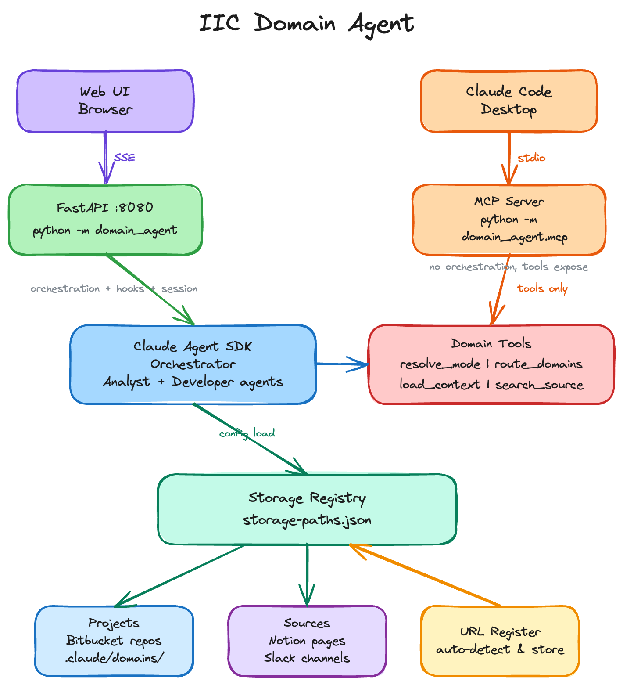

에이전틱 프로그래밍을 위해 내가 사용하는 방법을 기록하고 개선하기 위해 작성한다.

> **끝난 건 타이핑이지, 엔지니어링이 아니다. 좋은 설계의 레버리지는 커졌고, 나쁜 설계의 피해도 커졌다. 쇼의 주인공은 AI가 아니라 AI를 잘 다루는 엔지니어다.**

## 2026-03-29

### 팀 플러그인

현재 팀 플러그인에서는 크게 다섯 가지 유형의 기능을 제공하고 있다.

<h4>1. 도메인 지식 관리</h4>

처음에는 각 프로젝트마다 도메인 지식을 파일 형태로 세팅하고, 이 파일들이 연결된 프로젝트들을 기반으로 도메인 오케스트레이터를 구성하는 방식을 구상했다.  
이 오케스트레이터를 통해 여러 프로젝트와 여러 소스(노션, 슬랙 등)를 참고하여 도메인 질문에 답변하도록 만들고 싶었다.  
  
주변에 공유했을 때는 대체로 “효용성이 있을 것 같다”는 반응을 들었지만, 실제 업무에 바로 도움이 되는 수준은 아니었다.  
오히려 구축과 유지 비용이 더 크게 느껴졌다.  
  
가장 큰 문제는 동기화 피로도였다.

1. 코드베이스가 변경될 때마다 각 프로젝트의 도메인 파일을 함께 동기화해야 한다.
2. 도메인 파일이 바뀌면, 이를 참조하는 도메인 오케스트레이터 레이어도 다시 동기화해야 한다.

결국 각 프로젝트의 도메인 세팅, 도메인 오케스트레이터 세팅, 그리고 이 둘의 동기화를 지원하는 커맨드까지 각각 관리해야 했다.  
구조가 조금만 바뀌어도 플러그인을 다시 배포하고, 이해관계자들에게 변경 사항을 공유해야 하는 피로도 역시 컸다.  
  
이 방식은 내가 만들고 싶었던 AI-TPM의 방향과는 다소 거리가 있다고 느꼈다.  
여기에 더해 brand-specific MCP에 대한 요구사항까지 확인되면서, 플러그인 기반 접근의 한계도 점점 분명해졌다.  
  
그래서 지금은 AI-TPM + MCP per brand 구조를 Claude Agent SDK로 구현해보고 있다.  
이 내용은 아래의 AI-TPM 항목에서 조금 더 정리해보겠다.

<h4>2. 디버깅 · 분석 · 개발</h4>

현재 플러그인에는 다음과 같은 디버깅·분석·개발 흐름이 포함되어 있다.

1. `/graylog`: 에러 로그를 분석한 뒤 수정 방안을 제안
2. `/bottleneck`: 로그 기반으로 API 성능 병목을 분석
3. `/jira`: JIRA 티켓 이슈를 분석하고 수정 방안을 제안
4. `/graylog-trace`: 로그 기반으로 플로우 타임라인을 복원해 정상 흐름과 에러 흐름을 비교 분석
5. `/dev`: JIRA 티켓 또는 개발 기획 문서를 입력받아 TPM 멀티 프로젝트/소스 라우팅 → 분석/설계 → 사용자 승인 → worktree 구현 및 검증 → PR생성까지 수행
6. `/review`: 생성된 PR을 승인하거나, 코멘트를 기반으로 수정 사항을 반영한 뒤 다시 커밋하고 푸시

<h4>3. 테스트 자동화</h4>

단위 테스트와 통합 테스트의 코드 컨벤션, 그리고 테스트의 목적을 어느 정도 통일해보고 싶어서 관련 기능도 플러그인에 배포했다.  
하지만 아직 프로젝트별, 개인별 기준이 충분히 정립되지 않은 상태라 실제로는 거의 사용되지 않는 것을 확인했다.  
  
그래서 이 기능은 일단 플러그인에서 제거하고, 먼저 개인 차원에서 컨벤션을 더 축적한 뒤 팀원들과 논의해 다시 적용할 계획이다.  

<h4>4. 세션 관리</h4>

팀원들이 Claude Code와 나눈 대화의 세션 요약을 노션에 축적하고, 이를 바탕으로 피드백 루프를 만들고 싶어 관련 기능을 배포해 함께 사용하고 있다.  

요약 항목은 크게 다음 세 가지다.

1. `"무엇을 했는가"`: 작업 요약, 변경 파일 목록(git diff 기반), 의사결정 로그(상황 → 선택지 → 결정 → 근거), 시행착오 로그(시도 → 실패 → 전환 → 결과)
2. `"팀이 가져갈 것"`: 코드 컨벤션(규칙 + 이유 + Before/After + 적용 범위), 재사용 가능한 TIL(배경 + 핵심 + 왜 중요한가 + 팀 적용 방법)
3. `"사용자가 개선할 것"`: 도구 활용 리뷰, AI 활용 성숙도 3축 평가(프롬프트 품질 / 도구 활용도 / 자율 위임도), 프롬프트 개선 제안(Before → After), 마찰 기록(증상 → 원인 → 영향 → 해결 → 재발 방지)

이 요약본을 계속 누적하면서 주 1회 정도 보고서를 만들어 보고 있는데, 생각보다 유의미한 지점들이 보이고 있다.  
그래서 요약 생성과 보고서 생성 모두 계속 고도화하는 중이다.  

<h4>5. 자산화</h4>

외부 아티클이나 공식 문서 링크를 입력받아, 먼저 공신력을 검증한 뒤 핵심 원칙을 추출하여 자산화하는 기능도 제공하고 있다.  
이 기능의 기준은 다음과 같다.  

- Iron Law: 검증 없이 자산화하지 않는다.
- 컨텍스트 격리 검증: 별도의 Agent를 생성해 확증 편향 없이 출처 등급(A/B/C)과 내용 품질을 평가한다.
- 복수 소스 교차 검증: 원문, HN 토론, 요약글 등 여러 소스를 함께 검토할 수 있다.
- 검증 FAIL 시 즉시 중단하고, CONDITIONAL이면 한계를 명시한 뒤 사용자 확인을 받는다.

이 기능은 실제로 스킬이나 커맨드를 만들 때 꽤 많은 도움을 주고 있어서 개인적으로 만족도가 높다.

### AI-TPM to Agent

기존 플러그인 안에 있던 AI-TPM을 이제는 Agent SDK 기반으로 다시 구현하고 있다.  
어떻게 보면 Claude Desktop이나 ChatGPT 웹 인터페이스를 우리 회사 상황에 맞게 커스텀하는 작업에 가깝다.  

대략적인 구조는 위와 같다.  
  
현재 통합 커머스 작업을 진행하면서 서버 간 의존성을 OAS 명세 기반으로 전환하고 있는데, 이 명세 파일들을 MCP로 활용할 수 있을 것 같다는 생각이 들었다.  
즉, 정적인 도메인 파일을 수동으로 동기화하는 대신, 시스템이 이미 가지고 있는 명세를 더 직접적으로 활용하는 방향이다.  
  
무엇보다 이 작업 자체가 꽤 재미있어서, 당분간은 개인 시간도 계속 투자해볼 생각이다.  

### 느낀 점

최근 들어 서비스의 도메인 지식과 프로젝트 이해도가 AI 활용도와 거의 비례한다는 생각을 자주 하게 된다.  
  
우리 회사는 일반적인 이커머스 플랫폼이라기보다, 브랜드가 제품을 직접 생산하고 판매하는 엔드투엔드 운영 회사에 가깝다.  
그래서 단순한 온라인 판매 도메인만 이해해서는 부족하고, 제품의 생명주기와 공급망, 운영 구조까지 함께 이해해야 한다.  
  
문제는 내가 아직 그 부분에 꽤 무지하다는 점이다.  
그리고 이 무지함이 업무 자동화 워크플로우를 구상하고 실제로 밀어붙이는 데 분명한 브레이크로 작용하고 있다고 느낀다.  
  
예를 들어, JIRA 이슈를 자동으로 분석하고 front + back + OMS 프로젝트를 함께 훑어 수정 범위를 파악한 뒤 PR까지 생성하는 워크플로우를 상상할 수는 있다.  
하지만 지금의 내가 그것을 만들었을 때, 과연 실제로 얼마나 높은 효용을 낼 수 있을지는 확신하기 어렵다.  
  
그래도 일단은 플러그인에 다음 흐름을 추가했다.

1. `이슈 및 기획 이해 → 멀티 프로젝트 기반 분석 → 수정/개발 → PR 생성`
2. `생성된 PR에 피드백을 반영하여 재작업`

만약 내가 이 서비스를 오랫동안 직접 개발하고 운영해온 사람이라면, 아마 이런 자동화를 훨씬 더 공격적으로 구축했을 것 같다.  
그만큼 결국 자동화의 품질은 도메인 이해도와 운영 감각에 크게 의존한다.  
  
한편으로는, 완성도 높은 워크플로우 자동화에 가까워지려면 결국 내가 직접 0 to 1로 만든 서비스를 오래 운영해보는 경험도 필요하겠다는 생각이 든다.  
그런 의미에서 사내 플러그인을 관리하고, Agent SDK 기반 하네스를 다듬는 일은 지금의 나에게 꽤 중요한 훈련이다.  
  
요즘 하네스 엔지니어링과 에이전틱 프로그래밍에 많은 시간을 쓰고 있는데, 이 동기는 단순히 회사 생활을 더 잘하기 위한 것만은 아니다.  
장기적으로는 스스로 자립할 수 있는 역량을 만들기 위한 과정이라고 확신하고 있다.  

## 2026-03-16

업무적으로는 AI-TPM을 계속해서 만들고 있고, TPM 모드에서 의도한대로 프로젝트와 소스(노션, 슬랙 등)들을 정상적으로 참조하는지 모니터링 툴을 이용해서 확인하고 의도한대로 호출되지 않으면 다시 교정하는 작업을 반복 중이다.  
호출할 때 마다 지시한대로 움직이지 않을 확률이 존재하기 때문에, 이걸 정량적으로 확인하기 위한 시나리오 실행 툴도 만들고 있다.  
  
사용 흐름은 아래와 같다.  
1. 플러그인의 `domain-setup` 커맨드로 참조할 프로젝트들의 도메인들을 세팅한다.
2. AI-TPM 모드를 실행할 위치에서 project-paths.json을 작성한다.
3. project-paths.json에 프로젝트의 절대경로와 참조할 소스 링크(노션, 슬랙 링크 등)을 작성한다.
4. `domain-enrich` 커맨드를 이용해 project-paths.json에 작성한 프로젝트와 소스에 대한 description을 작성한다.
5. `domain-scenario-create` 커맨드와 세팅된 도메인 정보를 이용해서 시나리오를 생성한다.
6. `domain-scenario-run` 커맨드로 작성된 시나리오를 N회 실행하여 보고서를 출력한다.
  
시나리오를 생성하려면 도메인과 코드베이스에 대한 이해가 필요해서, 다른 분들에게 사용 가이드를 전달하고 피드백을 적용하면서 발전시킬 예정이다.  
최종적인 목표로는 회의에 참석시켜서 궁금한 것에 대한 빠르고 (꽤) 정확한 대답과 회의에 나온 컨텍스트를 적용해서 적용 가능 여부 & 변경 범위 파악 & 작업 진행을 시키는 것이 목표다.  

이렇게 만들면서 느낀 점과 보완해야 할 점들이 있다.

1. **플러그인을 운영하면서 수정하고 테스트하는 사이클을 만들기가 어렵다.**
    - 배포한 뒤 다시 업데이트 받고 테스트하기에는 너무 번거롭다.. 아니면 로컬 캐시를 직접 수정해야 하는데, 로컬 캐시의 플러그인과 로컬 플러그인의 내용이 동기화되지 않을 수 있지 않을까 하는 마음에 꺼려했지만, 로컬 캐시 플러그인을 빠르게 수정하고 테스트하는게 최선인 것 같다.
2. **바이브코딩에 대한 가드레일이 부족하다.**
    - 제일 시급한건 내가 생각하는 클린 코드, 클린 아키텍처, 트랜잭션 분리 등 나의 지식을 그대로 담은 에이전트(또는 컨벤션)를 만들어야한다.
    - superpowers를 제외한 나만의 워크플로가 없다. 스스로 작업 단위를 어떤 순서대로 나누는지 잘 확인해서 이걸 본따 스킬로 만들어야한다.
3. **내가 바이브코딩을 진행하는 습관을 되돌아봐야 한다.**
    - 작업을 태스크별로 쪼개서 병렬로 진행하는 것, 그러면서 내가 검수해야 할 내용들은 꼼꼼히 읽어보는 습관을 들여야 한다.
    - 한번씩 읽기에 지치면 그냥 진행할 때가 있는데 그런 경우 잘못된 방향을 다시 고치는게 비용이 더 크다.
    - 작업 단위를 잘 나누고 구현전 스펙을 자세하게 작성하고 구현 계획을 꼼꼼하게 읽는 것. 그리고 구현 계획 검수에 대한 비용을 줄이고 싶다면 제 2의 정현준을 만들어서 에이전트로 검증해야 한다. 이때 훅을 사용하는 방법을 고안해봐야한다.
  

## 2026-03-02

- **[에이전틱 엔지니어링 시대의 생존 스킬 9가지](https://news.hada.io/topic?id=27104)**
  - 요구사항을 명확히 쪼개고 엣지 케이스를 정리하는 능력
  - 아키텍처와 컨텍스트 설계 능력
  - AI 기준의 '완료'가 아니라 개발자, 지시하는 사람으로서의 '완료'를 정의하는 능력
  - 실패를 복구하는 능력
  - 관찰 및 롤백 가능한 단위로 작업을 나누고 실행시킬 수 있는 능력
  - 개인의 기억이 아니라 팀, 더 나아가 사내 구성원들의 기억이 에이전트에게 전달되는 구조
  - 병렬로 매니징하는 능력
  - 추상화 게층 설계 능력 (엔지니어링은 단거리 경주가 아니라 복리 게임)
- **[AI가 규칙을 "알잘딱" 지키는 백엔드 레포 만들기](https://channel.io/ko/team/blog/articles/ai-native-ddd-refactoring-98c23cdb)**
  - AI는 지시사항과 문서를 잘 안지킨다.
  - 자연어의 모호성, 규칙 충돌 등
  - **결정론적 코드 제어** : 아키텍처 강제, 린트 (의존성 규칙, 네이밍, 인터페이스 패턴, 구조), 테스트
  - 대칭성 (모든 계층이 동일한 패턴을 따르도록)
  - **규칙을 문서로 적지말고 DDD를 활용하여 결정론적 검증 시스템을 구축하라**

## 2026-02-17

사내 에이전틱 코딩 TF를 맡게 됐다. 개인적으로 주최한 스터디가 회사의 방향과 맞아떨어지면서 자연스럽게 TF로 전환됐다.
요즘은 `AI TPM`과 `에이전틱 코딩 컨벤션`에 관심을 두고 있다.

AI 관련 기술이 쏟아지는 상황에서 백엔드 개발자로서 가장 의미 있는 작업이 뭘까 고민하다 보니 에이전틱 코딩에 관심을 가지게 됐다.
현재 풀고 싶은 문제는 크게 세 가지다.

1. **오케스트레이션 모니터링** : 클로드 코드가 에이전트/스킬/훅을 의도대로 호출하는지 확인할 수 있는 도구
2. **도메인 컨텍스트 관리** : 도메인 지식과 코드베이스의 상호 의존성을 계층화하여 AI에게 전달하는 방법
   - CLAUDE.md 중첩, 라우팅 레이어, 서브에이전트 전용 컨텍스트 삽입, 상황별 에이전트 팀즈 활용 등
3. **검증 가능성 확보** : 에이전트 동작을 테스트할 수 있는 방법
   - 중복된 CLAUDE.md를 읽었는가?
   - 의도한 스킬이 트리거됐는가?
   - 서브에이전트에 올바른 컨텍스트가 전달됐는가?
   - 도메인 규칙을 실제로 적용했는가?

위 문제를 해결하기 위해 아래의 문서를 차근차근 읽어가고 있다.

> Codex 팀의 Ryan Lopopolo는 이걸 "Harness Engineering"이라고 부릅니다.  
> 엔지니어의 역할이 코드를 작성하는 사람에서, 에이전트가 일할 수 있는 환경을 설계하고 의도를 명세하고 피드백 루프를 만드는 사람으로 바뀌는 겁니다.  
> `Humans steer, agents execute`

- [OpenAI Harness](https://openai.com/ko-KR/index/unlocking-the-codex-harness/)
- [OpenAI Harness Engineering](https://openai.com/index/harness-engineering/)
- [OpenAI Harness 5원칙 - toneylee](https://tonylee.im/ko/blog/openai-harness-engineering-five-principles-codex/)
- [PLANS.md](https://developers.openai.com/cookbook/articles/codex_exec_plans)
- [ARCHITECTURE.md](https://architecture.md/)
- [AI는 좋은 코드를 강제한다](https://bits.logic.inc/p/ai-is-forcing-us-to-write-good-code)
  - 에이전트는 지치지 않고 꽤 똑똑하게 코딩하지만, 결국 놓여 있는 환경만큼만 잘한다.
  - 지저분한 코드베이스에서 자기가 망쳐놓은 걸 알아서 수습하는 능력이 약하므로, 사람이 더 촘촘한 가드레일을 깔아줘야 한다.
  - 그래서 그동안 “시간 없어서 미뤘던” 좋은 코드/인프라 작업을 이제는 진짜로 투자해야 하고, 이것을 에이전트 시대의 필수 엔지니어링 과제로 로드맵에 넣어야 한다.
  - **100% 테스트 커버리지** : 에이전트가 건드린 모든 코드 라인의 동작을 반드시 예시(테스트)로 검증하게 만드는 장치로 100% 커버리지를 요구
  - **파일/디렉터리 구조와 작은 모듈** : 에이전트는 결국 파일 시스템을 보며 탐색하므로, 의미 있는 디렉터리/파일 이름과 잘게 쪼개진 파일이 중요한 인터페이스가 된다.
  - **타입과 자동화된 베스트 프랙티스** : 린터/포매터를 최대한 엄격히 돌리고, 작업 종료나 커밋 시 자동으로 고치게 만드는 등 가급적 많은 규칙을 자동으로 강제한다.
  - API는 OpenAPI 기반 타입 세이프 클라이언트, 데이터는 타입,체크,트리거, ORM은 Kysely 같은 타이핑 좋은 툴을 통해 끝단까지 타입을 관통시키는 식으로 설계한다.

## 2026-02-10

처음에는 아키텍처, 클린 코드 같은 "사람을 위한 고민"이 AI에게 도움이 될지 의문이었다.  
하지만 사람에게 인지부하가 낮다는 건 AI 컨텍스트도 작게 차지한다는 의미라는 걸 깨달았다.  
  
멀티 모듈의 특정 모듈, 아키텍처의 특정 레이어, 특정 패키지에는 우리가 목적과 책임을 부여한다.  
이 목적과 책임을 에이전트별로 구분할 수 있다면, 에이전트의 컨텍스트 윈도우도 효율적으로 사용할 수 있다.  
Claude Code의 Agent Teams(실험적 기능)를 사용해보면서 결국 **에이전트를 어떻게 배치하고 활용하느냐**가 핵심이라는 생각이 들었다.  
  
테스트 코드, 클린 코드 같은 기술적 컨벤션은 이미 많은 SKILL이 대중화되어 적용하기 쉽다.  
그런데 **도메인 지식은 어떻게 계층화하여 AI 컨텍스트에 삽입할지**가 고민이다.  
  
부문장님의 [forge-prompt](https://github.com/JSON-OBJECT/claude-code/blob/main/plugins/deep-thinking/commands/forge-prompt.md)를 활용해서 도메인 에이전트를 설계해볼 생각이다.  
핵심 비즈니스의 도메인 정보를 자산화하는 것이 중요한 과제처럼 느껴진다.  
꾸준한 자산화를 통해 결국 도메인 정보도 AI에게 전적으로 의지할 수 있지 않을까?  
  
비즈니스별로 AI 컨텍스트를 잘 관리할 수 있다면, AI TPM(Technical Project Manager)을 만들 수 있지 않을까?  
프론트, 이커머스, OMS 프로젝트에 AI 컨텍스트 구조를 설계하여 TPM을 구현하는 것이 현재 목표다.  

## 2026-02-03

요즘 애플리케이션 아키텍처에 대한 고민을 하다가 문득, 이런 아키텍처 작업은 사람을 위한 행위인데 AI를 위한 고민이 중심이 되어야 하지 않나?  
사람이 코드를 언제까지 읽을 수 있을까? 아직 검수는 필수이지만 대부분 코드에 대한 이해를 AI에게 의존하고 있는데 애플리케이션 아키텍처가 중요할까?  
AI친화 아키텍처를 고민해야하지 않을까? 라는 생각을 했다.  
결국 아키텍처도 책임과 목적을 분리하고 인지부하를 낮추는 행위이기 때문에 AI의 토큰 절약이나 컨텍스트를 너무 많이 차지하지 않게 하여 해결이 필요한 부분의 적절한 크기만큼 메모리에 로딩하게 하는것도 전략이기 때문에 결국 아키텍처 고민도 적절하다고 생각하긴 한다.  
하지만 에이전틱 프로그래밍을 이루기 위해 어떤 문서를 어디에 위치시키고 어떤 전략을 가져야할까를 고민하게 됐다.

- [프롬프트 엔지니어링 개요](https://platform.claude.com/docs/ko/build-with-claude/prompt-engineering/overview)
- [의도를 드러내는 이름](https://wiki.c2.com/?IntentionRevealingNames)
- [OMS에서 Claude AI를 활용하여 변화된 업무 방식](https://helloworld.kurly.com/blog/oms-claude-ai-workflow/)
- ["배민은 이제 노가다 안 합니다" 1시간 업무를 1분만에 끝내는 AI 자산화의 비밀(우아한형제들 임동준님)](https://www.youtube.com/watch?v=3HzELVptsb4)

1. ADR.md : 의사결정 문서
2. TODO.md : 큰 작업을 한 번에 끝내기 힘든 경우 
3. CLAUDE.md : 모든 프롬프팅에서 공통적으로 주입하기 위한 내용
    - 추가로 주입하고 싶은 정보가 있으면 다른 파일들 링크 추가해도 됨
4. SKILLS : 한 번에 너무 많은 정보를 전달하기 보다는 필요한 작업에 필요한 내용을 주입하기
5. 커스텀 커맨드 : 예를 들어, 세션에서 나눈 기술적 의사결정을 ADR.md에 정리하도록 `/adr` 커맨드 추가 

