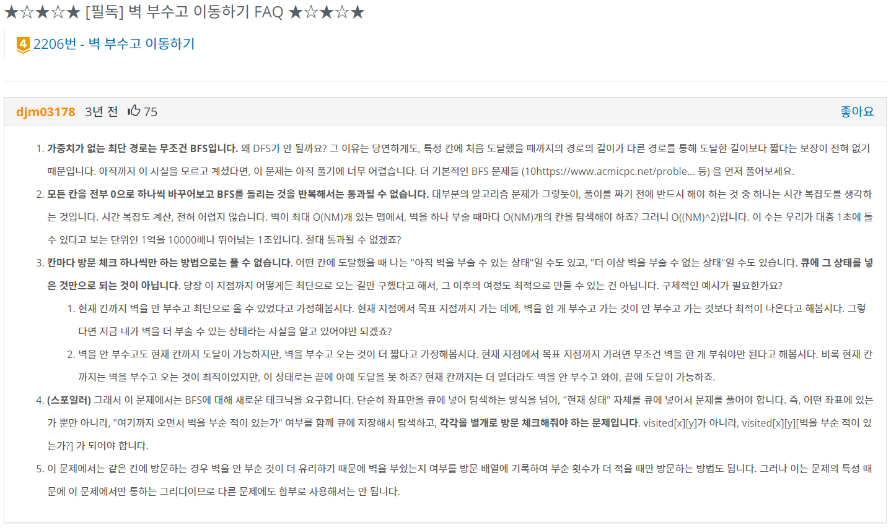

## Table of contents
{: .no_toc .text-delta }

1. TOC
{:toc}

---

# **🔥`[백준] 그래프 BFS` [이모티콘](https://www.acmicpc.net/problem/14226) 📝**

- 일반 **BFS**문제지만 `memoization` 때문에 고생
> - 📌 [출처](https://velog.io/@yanghl98/%EB%B0%B1%EC%A4%80-14226-%EC%9D%B4%EB%AA%A8%ED%8B%B0%EC%BD%98-JAVA)
> - '모든' 상태에 대해 BFS를 실행한다면 이미 확인한 상태를 다시 확인하는 경우가 생긴다. `화면의 이모티콘 개수가 4이고 클립보드에 있는 이모티콘 개수가 2이고 시간은 4인 상태` 가 있다고 해보자.
> - 여기서 **1번 붙혀넣고 삭제를 2번 하는 작업을 수행**했다면, `화면의 이모티콘 개수가 4이고 클립보드에 있는 이모티콘 개수가 2이고 시간은 7인 상태` 가 된다.
> - **화면과 클립보드의 이모티콘 개수는 같지만 시간은 늘어나있다.**
> - **이것처럼 이미 확인했던 [화면 이모티콘 개수][클립보드의 이모티콘 개수]의 쌍을 다시 본다면 시간이 늘어나기 때문에 최솟값을 찾을 수 없다.**

```java
import java.io.BufferedReader;
import java.io.IOException;
import java.io.InputStreamReader;
import java.util.*;

class Emoticon{
    int emoCount;
    int time;
    int clipboard;
    public Emoticon(int emoCount, int time, int clipboard) {
        this.emoCount = emoCount;
        this.time = time;
        this.clipboard = clipboard;

    }
    @Override
    public String toString() {
        return "Emoticon [emoCount=" + emoCount + ", time=" + time + ", clipboard=" + clipboard + "]";
    }

}

class Main {
    static List<ArrayList<Integer>> list;
    static boolean[][] checked = new boolean[2001][2001];
    static StringBuilder resultString = new StringBuilder();
    static int result = 0;

    public static void main(String[] args) throws IOException {
        BufferedReader br = new BufferedReader(new InputStreamReader(System.in));
        int target = Integer.parseInt(br.readLine());
        System.out.println(solve(target));
    }

    public static int solve(int target) {
        Queue<Emoticon> queue = new LinkedList<Emoticon>();
        queue.offer(new Emoticon(1 , 0 , 0));
        while(!queue.isEmpty()) {
            Emoticon now = queue.poll();
//            System.out.println(now);
            if(now.emoCount == target) return now.time;
            Emoticon after;
            if(now.emoCount >= 0 && now.emoCount < 1001) {
                if(!checked[now.emoCount][now.emoCount]) {
                	after = new Emoticon(now.emoCount , now.time + 1 , now.emoCount);
                    queue.offer(after);
                    checked[now.emoCount][now.emoCount] = true;
//                    System.out.println("copy - " + after);
                }
                if(!checked[now.emoCount + now.clipboard][now.clipboard]) {
                	after = new Emoticon(now.emoCount + now.clipboard , now.time + 1 , now.clipboard);
                    queue.offer(after);
                    checked[now.emoCount + now.clipboard][now.clipboard] = true;
//                    System.out.println("paste - " + after);
                }
                if(now.emoCount - 1 >= 1 && !checked[now.emoCount - 1][now.clipboard]) {
                	after = new Emoticon(now.emoCount - 1 , now.time + 1 , now.clipboard);
                    queue.offer(after);
                    checked[now.emoCount - 1][now.clipboard] = true;
//                    System.out.println("minus - " + after);
                }
            }
        }
        return 0;
    }
}
```

***

# **`[백준] 그래프 BFS` [적록색약](https://www.acmicpc.net/problem/10026)**

```java
import java.io.BufferedReader;
import java.io.IOException;
import java.io.InputStreamReader;
import java.util.*;


class Main {
    static int[] moveX = {-1 , 0 , 1 , 0};
    static int[] moveY = {0 , 1 , 0 , -1};
    static char[][] map , map2;
    static boolean[][] visited;
    static int size;
    static int colorBlindnessCount = 0 , colorCount = 0;
    public static void main(String[] args) throws IOException {
        BufferedReader br = new BufferedReader(new InputStreamReader(System.in));
        size = Integer.parseInt(br.readLine());
        map = new char[size][size];
        map2 = new char[size][size];
        for(int i = 0 ; i < size ; i++) {
            char[] line = br.readLine().toCharArray();
            for(int j = 0 ; j < size ; j++) {
                char value = line[j];
                map[i][j] = value;
                map2[i][j] = value == 'G' ? 'R' : value;
            }
        }
        for(int count = 0 ; count < 2 ; count++) {
            visited = new boolean[size][size];
            for(int i = 0 ; i < size ; i++) {
                for(int j = 0 ; j < size ; j++) {
                    if(!visited[i][j]) {
                        if(count == 0){
                            bfs(map , i , j , map[i][j] ,'N');
                        }
                        else bfs(map2 , i , j , map2[i][j] ,'Y');
                    }
                }
            }
        }
        System.out.println(colorCount + " " + colorBlindnessCount);
    }

    public static void bfs(char[][] map , int x , int y , char color , char flag) {
        Queue<int[]> queue = new LinkedList<int[]>();
        queue.offer(new int[] {x , y});
        visited[x][y] = true;
//        System.out.println("[" + x + " , " + y + "] " + map[x][y] + " - " + flag);
        if(flag == 'Y') colorBlindnessCount++;
        else colorCount++;
        while(!queue.isEmpty()) {
//            System.out.println(queue.size());
            int[] now = queue.poll();
            int nowX = now[0];
            int nowY = now[1];
            for(int i = 0 ; i < 4 ; i++) {
                int moveXpos = nowX + moveX[i];
                int moveYpos = nowY + moveY[i];
                if(moveXpos >= 0 && moveYpos >= 0 && moveXpos < size && moveYpos < size){
                    if(color == map[moveXpos][moveYpos] && !visited[moveXpos][moveYpos]) {
//                        System.out.println("[" + moveXpos + " , " + moveYpos + "] " + map[moveXpos][moveYpos]);
                        visited[moveXpos][moveYpos] = true;
                        queue.offer(new int[]{moveXpos , moveYpos});
                    }
                }
            }
        }
    }
}
```

***

# **`[백준] 그래프 BFS` [탈출](https://www.acmicpc.net/problem/3055)**

```java
import java.io.BufferedReader;
import java.io.IOException;
import java.io.InputStreamReader;
import java.util.*;


class Main {
    static int[] moveX = {-1 , 0 , 1 , 0};
    static int[] moveY = {0 , 1 , 0 , -1};
    static char[][] map;
    static boolean[][] visited;
    static int row , col;
    static int[] startPos;
    static List<int[]> waterPosList = new ArrayList<int[]>();
    public static void main(String[] args) throws IOException {
        BufferedReader br = new BufferedReader(new InputStreamReader(System.in));
        StringTokenizer st = new StringTokenizer(br.readLine());
        row = Integer.parseInt(st.nextToken());
        col = Integer.parseInt(st.nextToken());
        map = new char[row][col];
        visited = new boolean[row][col];
        for(int i = 0 ; i < row ; i++) {
            char[] line = br.readLine().toCharArray();
            for(int j = 0 ; j < col ; j++) {
                char ch = line[j];
                if(ch == 'S') startPos = new int[] {i , j , 0};
                else if(ch == '*') waterPosList.add(new int[] {i , j , 0});
                map[i][j] = ch;
            }
        }
        bfs();
    }

    public static void bfs() {
        int timeCount = 0;
        Queue<int[]> waterQueue = new LinkedList<int[]>();
        for(int[] waterPos : waterPosList) {
            waterQueue.add(waterPos);
            visited[waterPos[0]][waterPos[1]] = true;
        }

        Queue<int[]> movingQueue = new LinkedList<int[]>();
        movingQueue.add(startPos);
        visited[startPos[0]][startPos[1]] = true;

        while(true) {
            while(!waterQueue.isEmpty()) {
                int[] waterNow = waterQueue.peek();
                if(waterNow[2] == timeCount) {
                    // 물 이동
                    moving(waterQueue , waterQueue.poll() , 'w');
                }
                else break;
            }

            while(!movingQueue.isEmpty()) {
                int[] movingNow = movingQueue.peek();
                if(movingNow[2] == timeCount) {
                    // 고슴도치 이동
                    moving(movingQueue , movingQueue.poll() , 'm');
                }
                else break;
            }
            timeCount++;
            if(waterQueue.isEmpty() && movingQueue.isEmpty()) {
                System.out.println("KAKTUS");
                System.exit(0);
            }
        }
    }

    public static void moving(Queue<int[]> queue , int[] pos , char moveFlag) {
        for(int i = 0 ; i < 4 ; i++) {
            int moveXpos = pos[0] + moveX[i];
            int moveYpos = pos[1] + moveY[i];
            int time = pos[2] + 1;
            if(moveXpos >= 0 && moveYpos >= 0 && moveXpos < row && moveYpos < col && !visited[moveXpos][moveYpos]) {
                if(moveFlag == 'm' && map[moveXpos][moveYpos] == 'D') {
                    System.out.println(time);
                    System.exit(0);
                }
                if(map[moveXpos][moveYpos] == '.') {
                    queue.offer(new int[] {moveXpos , moveYpos , time});
                    visited[moveXpos][moveYpos] = true;
                }
            }
        }
    }
}
```

# **`[백준] 그래프 BFS` [벽 부수고 이동하기](https://www.acmicpc.net/problem/2206)**



- `memoization` 실패!!!
- 3차원 배열로 벽을 부순 상태까지 따로 방문 체크 하여야 했다.

***

```java
import java.io.BufferedReader;
import java.io.IOException;
import java.io.InputStreamReader;
import java.util.*;

class Move{
    int x;
    int y;
    int time;
    int breakWall;
    public Move(int x, int y, int time, int breakWall) {
        this.x = x;
        this.y = y;
        this.time = time;
        this.breakWall = breakWall;
    }
}

class Main {
    static int[] moveX = {-1 , 0 , 1 , 0};
    static int[] moveY = {0 , 1 , 0 , -1};
    static char[][] map;
    static boolean[][][] visited;
    static int row , col;
    static int result = Integer.MAX_VALUE;
    public static void main(String[] args) throws IOException {
        BufferedReader br = new BufferedReader(new InputStreamReader(System.in));
        StringTokenizer st = new StringTokenizer(br.readLine());
        row = Integer.parseInt(st.nextToken());
        col = Integer.parseInt(st.nextToken());
        map = new char[row][col];
        visited = new boolean[row][col][2];
        for(int i = 0 ; i < row ; i++) map[i] = br.readLine().toCharArray();
    	bfs();
        if(result == Integer.MAX_VALUE) System.out.println("-1");
        else System.out.println(result);
    }

    public static void bfs() {
        Queue<Move> queue = new LinkedList<Move>();
        queue.offer(new Move(0 , 0 , 1 , 0));
        visited[0][0][0] = true;
        while(!queue.isEmpty()){
            Move now = queue.poll();
            int nowX = now.x;
            int nowY = now.y;
            if(nowX == row - 1 && nowY == col - 1){
                result = Math.min(result , now.time);
            }
            for(int i = 0 ; i < 4 ; i++) {
                int moveXpos = nowX + moveX[i];
                int moveYpos = nowY + moveY[i];
                int time = now.time + 1;
                if(moveXpos >= 0 && moveYpos >= 0 && moveXpos < row && moveYpos < col && !visited[moveXpos][moveYpos][now.breakWall]) {
                    if(map[moveXpos][moveYpos] == '0') {
                        queue.offer(new Move(moveXpos , moveYpos , time , now.breakWall));
                        visited[moveXpos][moveYpos][now.breakWall] = true;
                    }
                    else if(map[moveXpos][moveYpos] == '1' && now.breakWall == 0){
                        queue.offer(new Move(moveXpos , moveYpos , time , 1));
                        visited[moveXpos][moveYpos][1] = true;
                    }
                }
            }
        }
    }
}
```

***

# **`[LeetCode] 그래프 - 스터디 1주차` [Find if Path Exists in Graph](https://leetcode.com/problems/find-if-path-exists-in-graph/)**

```java
class Solution {
    public boolean validPath(int n, int[][] edges, int start, int end) {
        List<ArrayList<Integer>> list = new ArrayList<>();
        Queue<Integer> queue = new LinkedList<Integer>();
        boolean[] visited = new boolean[n];
        if(start == end) return true;
        for(int i = 0 ; i <= n ; i++) list.add(new ArrayList<Integer>());
        for(int i = 0 ; i < edges.length ; i++){
            int x = edges[i][0];
            int y = edges[i][1];
            list.get(x).add(y);
            list.get(y).add(x);
        }

        queue.offer(start);

        while(!queue.isEmpty()){
            int now = queue.poll();
            visited[now] = true;
            for(int next : list.get(now)){
                if(next == end){
                    return true;
                }
                else if(!visited[next]){
                    queue.offer(next);
                }
            }
        }
        return false;
    }
}
```

***

# **`[LeetCode] 그래프 - 스터디 1주차` [Binary Tree Level Order Traversal](https://leetcode.com/problems/binary-tree-level-order-traversal/)**

```java
/**
 * Definition for a binary tree node.
 * public class TreeNode {
 *     int val;
 *     TreeNode left;
 *     TreeNode right;
 *     TreeNode() {}
 *     TreeNode(int val) { this.val = val; }
 *     TreeNode(int val, TreeNode left, TreeNode right) {
 *         this.val = val;
 *         this.left = left;
 *         this.right = right;
 *     }
 * }
 */
class Solution {
    public List<List<Integer>> levelOrder(TreeNode root) {
        List<List<Integer>> list = new ArrayList<>();
        dfs(list , root , 0);
        return list;
    }

    public void dfs(List<List<Integer>> list , TreeNode node , int level){
        if(node != null){
            // 노드의 개수를 바로 알 수 있는 방법이 있다면 리스트에 레벨 만큼 미리 넣어줄 수 있는데??
            if(list.size() <= level) list.add(new ArrayList<Integer>());
            list.get(level).add(node.val);
            // System.out.println(node.val + " " + level);
            dfs(list , node.left , level + 1);
            dfs(list , node.right , level + 1);
        }
    }
}
```

***

# 🔥 **`[LeetCode] 그래프 - 스터디 1주차` [Convert Sorted Array to Binary Search Tree](https://leetcode.com/problems/convert-sorted-array-to-binary-search-tree/)**

- 배열의 값들을 높이를 유지하며 이진 트리로 만드는 문제
  - `inorder = sorted(postorder) = sorted(preorder)`
  -  따라서 **정렬된 배열 -> BST** 문제에는 여러 솔루션이 있다

```java
/**
 * Definition for a binary tree node.
 * public class TreeNode {
 *     int val;
 *     TreeNode left;
 *     TreeNode right;
 *     TreeNode() {}
 *     TreeNode(int val) { this.val = val; }
 *     TreeNode(int val, TreeNode left, TreeNode right) {
 *         this.val = val;
 *         this.left = left;
 *         this.right = right;
 *     }
 * }
 */
class Solution {
    int[] nums;

    public TreeNode helper(int left, int right) {
        if (left > right) return null;

        // always choose left middle node as a root
        int p = (left + right) / 2;

        // preorder traversal: node -> left -> right
        TreeNode root = new TreeNode(nums[p]);
        root.left = helper(left, p - 1);
        root.right = helper(p + 1, right);
        return root;
    }

    public TreeNode sortedArrayToBST(int[] nums) {
        this.nums = nums;
        return helper(0, nums.length - 1);
    }
}
```

***


# 🔥 **`[LeetCode] 그래프 - 스터디 1주차` [Balanced Binary Tree](https://leetcode.com/problems/balanced-binary-tree/)**

- **높이의 균형을 확인하는 문제**
- 📌 `높이 균형이 맞는 이진 트리는 모든 노드들의 왼쪽 및 오른쪽 서브 트리의 높이 차이가 1을 초과하지 않는 트리를 의미한다.`
  - **형제 노드의 값의 차이가 1이하만 높이 균형 이진 트리라고 본다**
  - 조건부 확인 전에 재귀 호출이 있으면 상향식.
  - 조건부 확인 후 재귀 호출이면 하향식.


## **Top-down recursion**

```java
/**
 * Definition for a binary tree node.
 * public class TreeNode {
 *     int val;
 *     TreeNode left;
 *     TreeNode right;
 *     TreeNode() {}
 *     TreeNode(int val) { this.val = val; }
 *     TreeNode(int val, TreeNode left, TreeNode right) {
 *         this.val = val;
 *         this.left = left;
 *         this.right = right;
 *     }
 * }
 */
class Solution {
  // Recursively obtain the height of a tree. An empty tree has -1 height
  private int height(TreeNode root) {
    // An empty tree has height -1
    if (root == null) {
      System.out.println("null");
      return -1;
    }
    System.out.println(root.val);
    return 1 + Math.max(height(root.left), height(root.right));
  }

  public boolean isBalanced(TreeNode root) {
    // An empty tree satisfies the definition of a balanced tree
    if (root == null) {
      return true;
    }

    // Check if subtrees have height within 1. If they do, check if the
    // subtrees are balanced
    return Math.abs(height(root.left) - height(root.right)) < 2
        && isBalanced(root.left)
        && isBalanced(root.right);
  }
}
```

## **Bottom-up recursion**

```java
// Utility class to store information from recursive calls
final class TreeInfo {
  public final int height;
  public final boolean balanced;

  public TreeInfo(int height, boolean balanced) {
    this.height = height;
    this.balanced = balanced;
  }
}

class Solution {
  // Return whether or not the tree at root is balanced while also storing
  // the tree's height in a reference variable.
  private TreeInfo isBalancedTreeHelper(TreeNode root) {
    // An empty tree is balanced and has height = -1
    if (root == null) {
      return new TreeInfo(-1, true);
    }

    // Check subtrees to see if they are balanced.
    TreeInfo left = isBalancedTreeHelper(root.left);
    if (!left.balanced) {
      return new TreeInfo(-1, false);
    }
    TreeInfo right = isBalancedTreeHelper(root.right);
    if (!right.balanced) {
      return new TreeInfo(-1, false);
    }

    // Use the height obtained from the recursive calls to
    // determine if the current node is also balanced.
    if (Math.abs(left.height - right.height) < 2) {
      return new TreeInfo(Math.max(left.height, right.height) + 1, true);
    }
    return new TreeInfo(-1, false);
  }

  public boolean isBalanced(TreeNode root) {
    return isBalancedTreeHelper(root).balanced;
  }
};
```

***

# 🔥 **`[LeetCode] 그래프 - 스터디 1주차` [Validate Binary Search Tree](https://leetcode.com/problems/validate-binary-search-tree/)**


## 실패 코드 (`모든 왼쪽 자식들 <= n < 모든 오른쪽 자식들 속성`은 **모든 노드 대해서 반드시 참이어야 한다.**)

```java
/**
 * Definition for a binary tree node.
 * public class TreeNode {
 *     int val;
 *     TreeNode left;
 *     TreeNode right;
 *     TreeNode() {}
 *     TreeNode(int val) { this.val = val; }
 *     TreeNode(int val, TreeNode left, TreeNode right) {
 *         this.val = val;
 *         this.left = left;
 *         this.right = right;
 *     }
 * }
 */
class Solution {
    private boolean left(TreeNode node , TreeNode leftNode){
        if(leftNode != null && node.val <= leftNode.val) return false;
        else return true;
    }

    private boolean right(TreeNode node , TreeNode rightNode){
        if(rightNode != null && node.val >= rightNode.val) return false;
        else return true;
    }

    private boolean dfs(TreeNode node){
        if(node == null) return true;
        else if(!left(node , node.left) || !right(node , node.right)){
            return false;
        }
        else return dfs(node.left) && dfs(node.right);
    }

    public boolean isValidBST(TreeNode root) {
        return dfs(root);
    }
}
```

## **Solution**

```java
class Solution {
    public boolean validate(TreeNode root, Integer low, Integer high) {
        // Empty trees are valid BSTs.
        if (root == null) {
            return true;
        }
        // The current node's value must be between low and high.
        if ((low != null && root.val <= low) || (high != null && root.val >= high)) {
            return false;
        }
        // The left and right subtree must also be valid.
        return validate(root.right, root.val, high) && validate(root.left, low, root.val);
    }

    public boolean isValidBST(TreeNode root) {
        return validate(root, null, null);
    }
}
```

***

# 🔥 **`[LeetCode] 그래프 - 스터디 1주차` [Subtree of Another Tree](https://leetcode.com/problems/subtree-of-another-tree//) 진행 중**

```java
/**
 * Definition for a binary tree node.
 * public class TreeNode {
 *     int val;
 *     TreeNode left;
 *     TreeNode right;
 *     TreeNode() {}
 *     TreeNode(int val) { this.val = val; }
 *     TreeNode(int val, TreeNode left, TreeNode right) {
 *         this.val = val;
 *         this.left = left;
 *         this.right = right;
 *     }
 * }
 */
class Solution {
    boolean result = false;
    private void dfs(TreeNode node , TreeNode subRoot){
        if(!result && node != null){
            if(node.left != null && node.right != null && isSame(node , subRoot)){
                result = true;
            }            
            dfs(node.left , subRoot);
            dfs(node.right , subRoot);
        }
    }
    
    private boolean isSame(TreeNode node , TreeNode subRoot){
        return node.val == subRoot.val && node.left.val == subRoot.left.val && node.right.val == subRoot.right.val;
    }
    
    public boolean isSubtree(TreeNode root, TreeNode subRoot) {
        dfs(root , subRoot);
        return result;
    }
}
```

***

# **`[백준] DFS 백트래킹` [NM 과 K](https://www.acmicpc.net/problem/18290) 진행 중**

```java
import java.io.BufferedReader;
import java.io.IOException;
import java.io.InputStreamReader;
import java.util.*;


class Main {
    static int[] moveX = {-1 , 0 , 1 , 0};
    static int[] moveY = {0 , 1 , 0 , -1};
    static int[][] map;
    static boolean[][] check;
    static int row , col , select;
    static int result = Integer.MAX_VALUE;
    public static void main(String[] args) throws IOException {
        BufferedReader br = new BufferedReader(new InputStreamReader(System.in));
        StringTokenizer st = new StringTokenizer(br.readLine());
        row = Integer.parseInt(st.nextToken());
        col = Integer.parseInt(st.nextToken());
        select = Integer.parseInt(st.nextToken());
        map = new int[row][col];
        check = new boolean[row][col];
        for(int i = 0 ; i < row ; i++) {
        	st = new StringTokenizer(br.readLine());
        	for(int j = 0 ; j < col ; j++) {
        		map[i][j] = Integer.parseInt(st.nextToken());
        	}
        }
        dfs();
    }

    public static void dfs() {

    }
}
```
