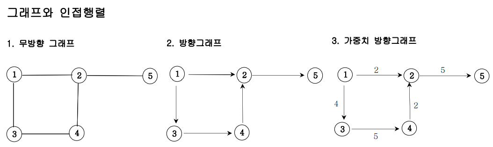
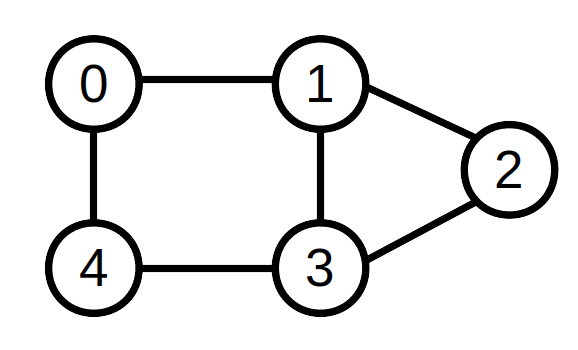
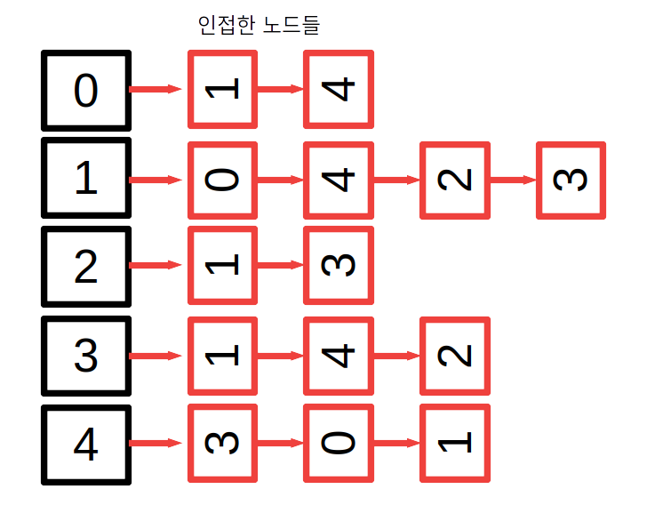
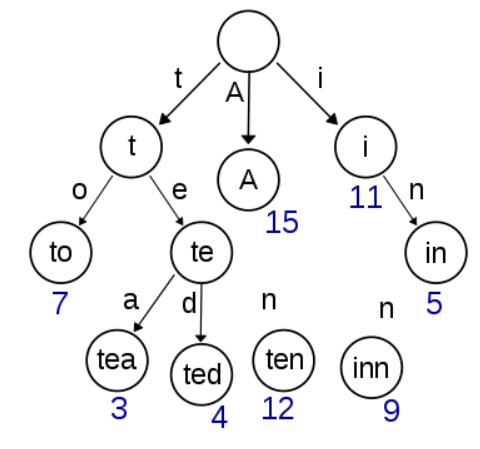

## Table of contents
{: .no_toc .text-delta }

1. TOC
{:toc}

---

# **정렬**


- [joshuajangblog.wordpress.com](https://joshuajangblog.wordpress.com/2016/09/21/time_complexity_big_o_in_easy_explanation/)
- **O(1) – 상수 시간** : 알고리즘이 문제를 해결하는데 오직 한 단계만 거칩니다.
- **O(log n) – 로그 시간** : 문제를 해결하는데 필요한 단계들이 연산마다 특정 요인에 의해 줄어듭니다.
- **O(n) – 직선적 시간** : 문제를 해결하기 위한 단계의 수와 입력값 n이 1:1 관계를 가집니다.
- **O(n<sup>2</sup>) – 2차 시간** : 문제를 해결하기 위한 단계의 수는 입력값 n의 제곱입니다.
- **O(C<sup>n</sup>) – 지수 시간** : 문제를 해결하기 위한 단계의 수는 주어진 상수값 C 의 n 제곱입니다. (상당히 큰수가 됩니다)


- **안정 정렬 (Stable Sort) , 불안정 정렬 (Unstable Sort)**
  - 정렬의 안정적 특성이란 **"정렬되지 않은 상태에서 같은 키값을 가진 원소의 순서가 정렬 후에도 유지되느냐"** 이다.
  - 정렬 방법 마다 **중복된 원소**가 본래 순서대로 정렬될 수도 있고 , 섞일 수도 있다.
  - **안정 정렬**
    - 중복된 값을 입력 순서와 동일하게 정렬되는 것
    - **삽입 정렬 , 병합 정렬 , 버블 정렬**
  - **불안정 정렬**
    - 중복된 값이 입력 순서와 동일하지 않게 정렬되는 것
    - **퀵 정렬 , 선택정렬 , 계수정렬**

## ✋ [TimSort에 대해 - NaverD2](https://d2.naver.com/helloworld/0315536)

## **버블 정렬**

- **서로 인접한 두 원소의 대소를 비교하고, 조건에 맞지 않다면 자리를 교환하며 정렬하는 알고리즘**

1. 1회전에 첫 번째 원소와 두 번째 원소를, 두 번째 원소와 세 번째 원소를, 세 번째 원소와 네 번째 원소를, … 이런 식으로 (마지막-1)번째 원소와 마지막 원소를 비교하여 조건에 맞지 않는다면 서로 교환합니다.
1. **1회전을 수행하고 나면 가장 큰 원소가 맨 뒤로 이동하므로 2회전에서는 맨 끝에 있는 원소는 정렬에서 제외되고, 2회전을 수행하고 나면 끝에서 두 번째 원소까지는 정렬에서 제외됩니다.** 이렇게 정렬을 1회전 수행할 때마다 정렬에서 제외되는 데이터가 하나씩 늘어납니다.


- **장점**
  - 정렬하고자 하는 배열 안에서 교환하는 방식이므로, 다른 메모리 공간을 필요로 하지 않는다.. ➜ 제자리 정렬(in-place sorting)
  - **안정 정렬(Stable Sort)**
- **단점**
  - **시간복잡도가 최악, 최선, 평균 모두 O(n^2)으로, 굉장히 비효율적입니다.**
  - 정렬 돼있지 않은 원소가 정렬 됐을때의 자리로 가기 위해서, 교환 연산(swap)이 많이 일어나게 됩니다.

## **선택 정렬**

- **해당 순서에 원소를 넣을 위치는 이미 정해져 있고, 어떤 원소를 넣을지 선택하는 알고리즘**
- **해당 자리를 선택하고 그 자리에 오는 값을 찾는 것**

1. 주어진 배열 중에 최소값을 찾는다.
1. 그 값을 맨 앞에 위치한 값과 교체한다. (pass)
1. 맨 처음 위치를 뺀 나머지 배열을 같은 방법으로 교체한다.


- **장점**
  - 정렬을 위한 비교 횟수는 많지만, Bubble Sort에 비해 실제로 교환하는 횟수는 적기 때문에 많은 교환이 일어나야 하는 자료상태에서 비교적 효율적이다.
  - 정렬하고자 하는 배열 안에서 교환하는 방식이므로, 다른 메모리 공간을 필요로 하지 않는다. ➜ 제자리 정렬(in-place sorting)

- **단점**
  - 시간복잡도가 O(n<sup>2</sup>)으로, 비효율적이다.
  - **불안정 정렬(Unstable Sort)**

## **삽입 정렬**

- **2번째 원소부터 시작하여 그 앞(왼쪽)의 원소들과 비교하여 삽입할 위치를 지정한 후, 원소를 뒤로 옮기고 지정된 자리에 자료를 삽입 하여 정렬하는 알고리즘**
- 최선의 경우 O(N)이라는 엄청나게 빠른 효율성을 가지고 있어, <span style="color:red; font-weight:bold">다른 정렬 알고리즘의 일부로 사용될 만큼 좋은 정렬 알고리즘</span>
  - 모두 정렬이 되어있는 경우(Optimal)한 경우, 한번씩 밖에 비교를 안하므로 O(n) 의 시간복잡도를 가지게 된다.
  - 또한, 이미 정렬되어 있는 배열에 자료를 하나씩 삽입/제거하는 경우에는, 현실적으로 최고의 정렬 알고리즘이 된다.

1. 정렬은 2번째 위치(index)의 값을 temp에 저장합니다.
1. temp와 이전에 있는 원소들과 비교하며 삽입해나갑니다.
1. '1'번으로 돌아가 다음 위치(index)의 값을 temp에 저장하고, 반복합니다.


- **장점**
  - 대부분의 원소가 이미 정렬되어 있는 경우, 매우 효율적일 수 있다.
  - 정렬하고자 하는 배열 안에서 교환하는 방식이므로, 다른 메모리 공간을 필요로 하지 않는다..  ➜ 제자리 정렬(in-place sorting)
  - **안정 정렬(Stable Sort)**
  - **Selection Sort나 Bubble Sort과 같은 O(n<sup>2</sup>) 알고리즘에 비교하여 상대적으로 빠르다.**
- **단점**
  - 평균과 최악의 시간복잡도가 O(n^2)으로 비효율적입니다.
  - Bubble Sort와 Selection Sort와 마찬가지로, 배열의 길이가 길어질수록 비효율적입니다.

## **퀵 정렬**

- **분할 정복(divide and conquer) 방법**
  - 문제를 작은 2개의 문제로 분리하고 각각을 해결한 다음, 결과를 모아서 원래의 문제를 해결하는 전략
  - Merge Sort와 달리 Quick Sort는 배열을 비균등하게 분할

- JAVA에서 Arrays.sort() 내부적으로도 Dual Pivot Quick Sort로 구현되어 있을 정도로 효율적인 알고리즘이고, 기술 면접에서 정말 빈번하게 나오는 주제이므로 반드시 숙지하시길 바랍니다.

1. 배열 가운데서 하나의 원소를 고릅니다. 이렇게 고른 원소를 피벗(pivot) 이라고 합니다.
2.  피벗 앞에는 피벗보다 값이 작은 모든 원소들이 오고, 피벗 뒤에는 피벗보다 값이 큰 모든 원소들이 오도록 피벗을 기준으로 배열을 둘로 나눕니다.
    - 이렇게 배열을 둘로 나누는 것을 **분할(Divide)** 이라고 합니다.
    - 분할을 마친 뒤에 피벗은 더 이상 움직이지 않습니다.
3. 분할된 두 개의 작은 배열에 대해 **재귀(Recursion)적으로 이 과정을 반복**합니다.
4. 재귀 호출이 한번 진행될 때마다 최소한 하나의 원소는 최종적으로 위치가 정해지므로, 이 알고리즘은 반드시 끝난다는 것을 보장할 수 있습니다.


- **장점**
  - 불필요한 데이터의 이동을 줄이고 먼 거리의 데이터를 교환할 뿐만 아니라, 한 번 결정된 피벗들이 추후 연산에서 제외되는 특성 때문에, 시간 복잡도가 O(nlog₂n)를 가지는 다른 정렬 알고리즘과 비교했을 때도 가장 빠르다.
  - 정렬하고자 하는 배열 안에서 교환하는 방식이므로, 다른 메모리 공간을 필요로 하지 않는다..  ➜ 제자리 정렬(in-place sorting)
- **단점**
  - **불안정 정렬(Unstable Sort)**
  - 정렬된 배열에 대해서는 Quick Sort의 불균형 분할에 의해 오히려 수행시간이 더 많이 걸린다.

***

# **`Binary Search` 이분,이진 탐색**
- 이진 탐색 알고리즘은 **정렬된 원소 리스트를 받아 리스트에 원하는 원소가 있을경우 그 원소의 위치를 반환**, 없을경우 null을 반환함.
- 시간복잡도는 O(log n)으로 매우 빠른편.


- [https://velog.io/@ming/](https://velog.io/@ming/%EC%9D%B4%EB%B6%84%ED%83%90%EC%83%89Binary-Search)


***

# **`Backtracking` 백트래킹 특징**
- 백트래킹은 말 그대로 **역추적**을 의미한다
- 문제 해결을 위한 모든 경우의 수를 따져보기 위해서 일반적으로 활용되는 기법 중 하나이다.
  - `(완전 검색 (Exhaustive search), 실제로 모든 케이스를 다 직접 확인한다는 의미는 아니다)`
- 백트래킹은 우선 어떤 하나의 가능한 케이스를 확인하고, 가능하지 않다면 다시 Back하고,
- 다시 다른 가능성있는 케이스를 확인하면서 Solution이 도출될 때까지 이런 과정이 계속적으로 반복되도록 구현하게 된다.
- 따라서 **일반적으로 백트래킹은 알고리즘의 구조 특성상 재귀함수를 사용하여 구현**된다.
- 백트래킹에 있어 중요한 것은 문제의 요구사항에 따라서, 구현된 알고리즘의 연산량이 제한 시간을 넘어버리게 되는 경우가 발생한다는 것이다.
- 무작정 전 검색을 수행하는 데에는 한계가 발생할 수 밖에 없다.
- 따라서, 더 이상 탐색할 필요가 없는 후보군에 대해서는 재귀 호출을 더 이상 하지 않고 **가지치기 (Pruning 또는 Branch and bound) 하는 것이 매우 중요**합니다.
- 굳이 체크할 필요가 없다고 판단되는 후보군들을 적절히 제외시켜서, 연산 시간은 줄이면서 완전 검색이 수행되도록 하는 것이 백트래킹의 핵심이라고 할 수 있다.
- [N Queen 문제 최적화 (Backtracking)](https://jayce-with.tistory.com/17)

[출처 Jayce's Blog](https://jayce-with.tistory.com/16)

***

# **`[Graph]` 인접 행렬과 인접 리스트**

## 인접행렬



- **인접 행렬은 그래프의 연결 관계를 이차원 배열로 나타내는 방식**

```java
무방향 그래프                   방향 그래프                      가중치 방향 그래프
| - | 1 | 2 | 3 | 4 | 5 |       | - | 1 | 2 | 3 | 4 | 5 |       | - | 1 | 2 | 3 | 4 | 5 |
| 1 | 0 | 1 | 1 | 0 | 0 |       | 1 | 0 | 1 | 1 | 0 | 0 |       | 1 | 0 | 2 | 4 | 0 | 0 |
| 2 | 1 | 0 | 0 | 1 | 1 |       | 2 | 0 | 0 | 0 | 0 | 1 |       | 2 | 0 | 0 | 0 | 0 | 5 |
| 3 | 1 | 0 | 0 | 1 | 0 |       | 3 | 0 | 0 | 0 | 1 | 0 |       | 3 | 0 | 0 | 0 | 5 | 0 |
| 4 | 0 | 1 | 1 | 0 | 0 |       | 4 | 0 | 1 | 0 | 0 | 0 |       | 4 | 0 | 2 | 0 | 0 | 0 |
| 5 | 0 | 1 | 0 | 0 | 0 |       | 5 | 0 | 0 | 0 | 0 | 0 |       | 5 | 0 | 0 | 0 | 0 | 0 |
```


- (행을 **i** 열을 **j**라고 가정한다.)
- 노드 i와 노드 j가 연결되어 있는지 확인하고 싶을 때, `graph[i][j]`가 1인지 0인지만 확인하면 되기 때문에 **O(1)**이라는 시간 복잡도에 확인할 수 있다는 점이 있다.
- 하지만, 전체 노드의 개수를 V개, 간선의 개수를 E개라고 하자.
- 노드 i에 연결된 모든 노드들에 방문해보고 싶은 경우 `graph[i][1]`부터 `graph[i][V]`를 모두 확인해야 하기 때문에 총 **O(V)** 의 시간이 걸린다.
- 만약, 노드의 개수는 총 1억개인데 각 노드마다 연결된 간선이 많아봤자 2개인 그래프가 있다고 해보자
- 그렇다면, 특정 노드와 연결된 노드들이 몇 번 노드인지 확인하기 위해 총 1억 개의 노드들을 모두 확인해야 하는 치명적인 문제가 발생하게 된다.
- **이러한 단점을 보완할 수 있는 연결 관계 표현 방식이 인접 리스트이다.**
- [출처 sarah950716.tistory.com](https://sarah950716.tistory.com/12)

## 인접리스트



- **정점(노드 , Vertex)들의 연결 관계를 각각 리스트를 생성한다.**



***

# **TreeSet**
- 객체를 중복해서 저장할 수 없고 저장 순서가 유지되지 않는다는 **Set**의 성질을 그대로 가지고 있다.
- **이진 탐색 트리** 구조로 되어 있다.
- 추가와 삭제에는 시간이 조금 더 걸리지만 **정렬,검색**에 높은 성능을 보이는 자료구조 이다.
- 생성자의 매개변수로 Comparator객체를 입력하여 정렬 방법을 임의로 지정해 줄 수도 있다.
- **레드-블랙트리**로 구현되어 있다.
  - 부모노드보다 작은 값을 가지는 노드는 왼쪽 자식으로 ,
  - 큰 값을 가지는 노드는 오른쪽 자식으로 배치하여 균형을 맞춘다.


## [문제 - K번째 큰 수](https://jeongcode.github.io/docs/algorithm/javaAlgorithm/section4/#treeset-k%EB%B2%88%EC%A7%B8-%ED%81%B0-%EC%88%98-%EC%8B%A4%ED%8C%A8)

**TreeSet 선언**

```java
TreeSet<Integer> set1 = new TreeSet<Integer>();//TreeSet생성
TreeSet<Integer> set2 = new TreeSet<>();//new에서 타입 파라미터 생략가능
TreeSet<Integer> set3 = new TreeSet<Integer>(set1);//set1의 모든 값을 가진 TreeSet생성
TreeSet<Integer> set4 = new TreeSet<Integer>(Arrays.asList(1,2,3));//초기값 지정
```

**TreeSet 값 추가**
  - 입력되는 값이 TreeSet 내부에 존재하지 않는다면 그 값을 추가한 뒤 true를 반환하고
  - 내부에 값이 존재한다면 false를 반환한다.
  - 7,4,9,2,5를 차례대로 TreeSet에 저장한다면 아래와같은 과정을 거치게 된다.

```java
  TreeSet<Integer> set = new TreeSet<Integer>();//TreeSet생성
  set.add(7); //값추가
  set.add(4);
  set.add(9);
  set.add(2);
  set.add(5);
```


**TreeSet 값 삭제**
  -  매개변수 value의 값이 존재한다면 그 값을 삭제한 후 true를 반환하고 없으면 false를 반환한다.

```java
TreeSet<Integer> set = new TreeSet<Integer>();//TreeSet생성
set.remove(1);//값 1 제거
set.clear();//모든 값 제거
```

**TreeSet 값 출력**

```java
TreeSet<Integer> set = new TreeSet<Integer>(Arrays.asList(4,2,3));//초기값 지정
System.out.println(set); //전체출력 [2,3,4]
System.out.println(set.first());//최소값 출력
System.out.println(set.last());//최대값 출력
System.out.println(set.higher(3));//입력값보다 큰 데이터중 최소값 출력 없으면 null
System.out.println(set.lower(3));//입력값보다 작은 데이터중 최대값 출력 없으면 null

Iterator iter = set.iterator();	// Iterator 사용
while(iter.hasNext()) {//값이 있으면 true 없으면 false
    System.out.println(iter.next());
}
```

***

# **`Heap` 힙**
- **`Complete Binary Tree` 완전 이진 트리 이다.**
- **모든 노드에 저장된 값들은 자식 노드들의 것보다 크거나 같다.**
- **일종의 반정렬 상태(느슨한 정렬 상태) 를 유지한다.**
  - 큰 값이 상위 레벨에 있고 작은 값이 하위 레벨에 있다는 정도
  - 간단히 말하면 부모 노드의 키 값이 자식 노드의 키 값보다 항상 큰(작은) 이진 트리를 말한다.
- **힙을 저장하는 표준적인 자료구조는 배열** 이다.
  - 구현을 쉽게 하기 위하여 배열의 첫 번째 인덱스인 0은 사용되지 않는다.
  - 특정 위치의 노드 번호는 새로운 노드가 추가되어도 변하지 않는다.
  - 예를 들어 루트 노드의 오른쪽 노드의 번호는 항상 3이다.
- **힙에서의 부모 노드와 자식 노드의 관계**
  - **왼쪽 자식의 인덱스 = (부모의 인덱스) * 2**
  - **오른쪽 자식의 인덱스 = (부모의 인덱스) * 2 + 1**
  - **부모의 인덱스 = (자식의 인덱스) / 2**


[출처](https://gmlwjd9405.github.io/2018/05/10/data-structure-heap.html)

***

# **`PriorityQueue` 우선순위 큐**
- **들어간 순서에 상관없이 우선순위가 높은 데이터가 먼저 나오는 것**이다.
- **Heap을 이용하여 구현**

***

# **`Kruskal Algorithm` 크루스칼 알고리즘**
- [참고 문제](https://jeongcode.github.io/docs/javaAlgorithm/section9/#-%EC%9B%90%EB%8D%94%EB%9E%9C%EB%93%9C)
- **가장 적은 비용으로 모든 노드를 연결** 하기 위해 사용 한다.
- **`Minimum Spanning Tree, MST` 최소 신장 트리**를 구하기 위해 사용한다.
  - 그래프에서 **모든 정점을 포함**
  - **정점 간 서로 연결이 되며 사이클이 존재하지 않는** 그래프
  - 따라서 **정점의 갯수가 n개일 때 , 간선이 n-1개가 된다.**
- 그리디 알고리즘의 일종이다.
  - 그래프 간선들을 **가중치의 오름차순**으로 정렬해 놓은 뒤 , 사이클을 형성하지 않는 선에서 정렬된 순서대로 간선을 선택한다.
- **`Union & Find 활용` 사이클 판단하기**
  - **Union-Find 란?**
    - Disjoint Set (서로소 집합) 을 표현하는 자료구조
    - **서로 다른 두 집합을 병합하는 Union 연산**, **집합 원소가 어떤 집합에 속해있는지 찾는 Find 연산**을 지원하기에 이러한 이름이 붙었다. [참고 문제](https://jeongcode.github.io/docs/javaAlgorithm/section9/#-disjoint-set%EC%84%9C%EB%A1%9C%EC%86%8C-%EC%A7%91%ED%95%A9--unionfind-%EC%95%8C%EA%B3%A0%EB%A6%AC%EC%A6%98-%EC%B9%9C%EA%B5%AC%EC%9D%B8%EA%B0%80--)

***

# **`LIS` 최장 증가 부분 수열 알고리즘**
- 원소가 n개인 배열의 일부 원소를 골라내서 만든 부분 수열 중,
- 각 원소가 이전 원소보다 크다는 조건을 만족하고, 그 길이가 최대인 부분 수열을 **최장 증가 부분 수열**이라고 합니다.

- 예를 들어, { 6, **2**, **5**, 1, **7**, 4, **8**, 3} 이라는 배열이 있을 경우, LIS는 **{ 2, 5, 7, 8 }** 이 됩니다.
- { 2, 5 }, { 2, 7 } 등 증가하는 부분 수열은 많지만 그 중에서 가장 긴 것이 { 2, 5, 7, 8 } 입니다.
-  일반적으로 최장 증가 부분 수열의 길이가 얼마인지 푸는 간편한 방법은 **DP**를 이용하는 것입니다.
    - 시간복잡도를 개선하기 위하여 LIS를 구성할 때 이분탐색을 활용한다.

[출처](https://chanhuiseok.github.io/posts/algo-49/)

***

# **`Napsack` 배낭 알고리즘**

***

# **Trie**



- 문자열을 저장하고 효율적으로 탐색하기 위한 트리 형태의 자료구조
- [출처 및 참고](https://twpower.github.io/187-trie-concept-and-basic-problem)


# **참고 및 출처**
- [https://coding-factory.tistory.com](https://coding-factory.tistory.com/555)
- [https://github.com/GimunLee](https://github.com/GimunLee/tech-refrigerator/tree/master/Algorithm)
- [https://hongl.tistory.com](https://hongl.tistory.com/9)
