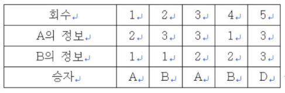
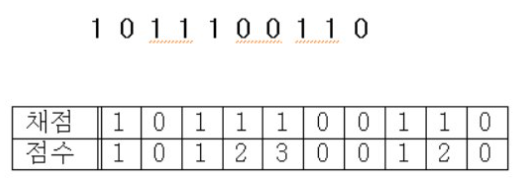
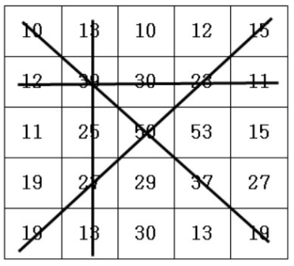
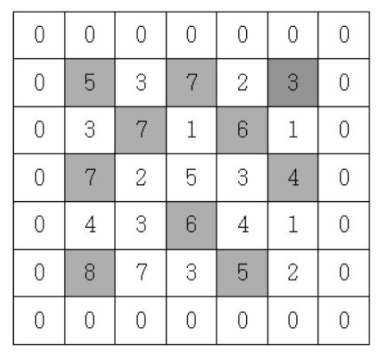
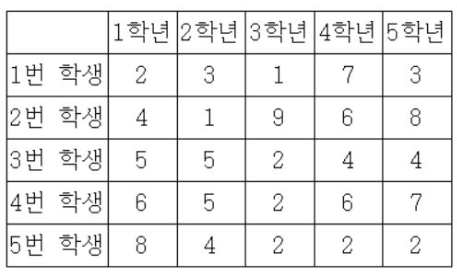

## Table of contents
{: .no_toc .text-delta }

1. TOC
{:toc}

---

# **큰 수 출력하기 (통과)**
- **설명**
  - N개의 정수를 입력받아, 자신의 바로 앞 수보다 큰 수만 출력하는 프로그램을 작성하세요.
  - (첫 번째 수는 무조건 출력한다)
- **입력**
  - 첫 줄에 자연수 N(1<=N<=100)이 주어지고, 그 다음 줄에 N개의 정수가 입력된다.
- **출력**
  - 자신의 바로 앞 수보다 큰 수만 한 줄로 출력한다.
- **예시 입력 1**
  - 6
  - 7 3 9 5 6 12
- **예시 출력 1**
  - 7 9 6 12

## 풀어보기

```java
public static void main(String[] args){
    Scanner kb = new Scanner(System.in);
    int n=kb.nextInt();
    int[] arr = new int[n];
    for(int i = 0 ; i < n ; i++){
        arr[i] = kb.nextInt();
    }
    solution(n, arr);
}

public static void solution(int n , int[] arr){
    StringBuilder result = new StringBuilder();
    result.append(arr[0]);
    for(int i = 1 ; i < arr.length ; i++){
        if(arr[i - 1] < arr[i]) {
            result.append(" ");
            result.append(arr[i]);
        }
    }
    System.out.println(result.toString());
}
```

## 해답

```java
public ArrayList<Integer> solution(int n, int[] arr){
  ArrayList<Integer> answer = new ArrayList<>();
  answer.add(arr[0]);
  for(int i=1; i<n; i++){
    if(arr[i] > arr[i - 1]) answer.add(arr[i]);
  }
  return answer;
}

public static void main(String[] args){
  Main T = new Main();
  Scanner kb = new Scanner(System.in);
  int n = kb.nextInt();
  int[] arr = new int[n];
  for(int i = 0 ; i < n ; i++){
    arr[i] = kb.nextInt();
  }
  for(int x : T.solution(n, arr)){
    System.out.print(x+" ");
  }
}
```

***

# **보이는 학생 (통과)**

- **설명**
  - 선생님이 N명의 학생을 일렬로 세웠습니다.
  - 일렬로 서 있는 학생의 키가 앞에서부터 순서대로 주어질 때, 맨 앞에 서 있는 선생님이 볼 수 있는 학생의 수를 구하는 프로그램을 작성하세요.
  - (앞에 서 있는 사람들보다 크면 보이고, 작거나 같으면 보이지 않습니다.)
- **입력**
  - 첫 줄에 정수 N(5<=N<=100,000)이 입력된다.
  - 그 다음줄에 N명의 학생의 키가 앞에서부터 순서대로 주어진다.
- **출력**
  - 선생님이 볼 수 있는 최대학생수를 출력한다.
- **예시 입력 1**
  - 8
  - 130 135 148 140 145 150 150 153
- **예시 출력 1**
  - 5

## 풀어보기

```java
public static void main(String[] args){
    Scanner kb = new Scanner(System.in);
    int n=kb.nextInt();
    int[] arr = new int[n];
    for(int i = 0 ; i < n ; i++){
        arr[i] = kb.nextInt();
    }
    System.out.println(solution(n, arr));
}

public static int solution(int n , int[] arr){
    int answer = 1;
    int prevMaxVal = 0;
    for(int i = 1 ; i < arr.length ; i++){
        if(arr[i - 1] < arr[i]) {
            if(prevMaxVal < arr[i]){
                answer++;
            }
        }
        else if(arr[i - 1] > prevMaxVal){
            prevMaxVal = arr[i - 1];
        }
    }
    return answer;
}
```

## 해답

```java
public int solution(int n, int[] arr){
  int answer = 1, max = arr[0];
  for(int i = 1 ; i < n ; i++){
    if(arr[i] > max){
      max = arr[i];
      answer++;
    }
  }
  return answer;
}
public static void main(String[] args){
  Main T = new Main();
  Scanner kb = new Scanner(System.in);
  int n = kb.nextInt();
  int[] arr = new int[n];
  for(int i = 0; i<n; i++){
    arr[i] = kb.nextInt();
  }
  System.out.print(T.solution(n, arr));
}
```

***

# **가위 바위 보 (통과)**

- **설명**
  - A, B 두 사람이 가위바위보 게임을 합니다.
  - 총 N번의 게임을 하여 A가 이기면 A를 출력하고, B가 이기면 B를 출력합니다.
  - 비길 경우에는 D를 출력합니다.
  - 가위, 바위, 보의 정보는 1:가위, 2:바위, 3:보로 정하겠습니다.
  - 예를 들어 N=5이면
    - 두 사람의 각 회의 가위, 바위, 보 정보가 주어지면 각 회를 누가 이겼는지 출력하는 프로그램을 작성하세요.



- **입력**
  - 첫 번째 줄에 게임 횟수인 자연수 N(1<=N<=100)이 주어집니다.
  - 두 번째 줄에는 A가 낸 가위, 바위, 보 정보가 N개 주어집니다.
  - 세 번째 줄에는 B가 낸 가위, 바위, 보 정보가 N개 주어집니다.
- **출력**
  - 각 줄에 각 회의 승자를 출력합니다. 비겼을 경우는 D를 출력합니다.
- **예시 입력 1**
  - 5
  - 2 3 3 1 3
  - 1 1 2 2 3
- **예시 출력 1**
  - A
  - B
  - A
  - B
  - D

## 풀어보기

```java
public static void main(String[] args){
    Scanner kb = new Scanner(System.in);
    int n=kb.nextInt();
    int[] arr1 = new int[n];
    int[] arr2 = new int[n];
    for(int i = 0 ; i < n ; i++){
        arr1[i] = kb.nextInt();
    }
    for(int i = 0 ; i < n ; i++){
        arr2[i] = kb.nextInt();
    }
    solution(n, arr1 , arr2);
}

public static int solution(int n , int[] arr1 , int[] arr2){
    int answer = 1;
    // 1 = 가위 , 2 = 바위 , 3 = 보
    for(int i = 0 ; i < n ; i++){
        if(arr1[i] == arr2[i]) System.out.println("D");
        else if(arr1[i] == 1){
            if(arr2[i] == 2) System.out.println("B");
            else System.out.println("A");
        }
        else if(arr1[i] == 2){
            if(arr2[i] == 3) System.out.println("B");
            else System.out.println("A");
        }
        else{
            if(arr2[i] == 1) System.out.println("B");
            else System.out.println("A");
        }
    }
    return answer;
}

```

## 해답

```java
public String solution(int n, int[] a, int[] b){
  String answer = "";
  for(int i = 0 ; i < n ; i++){
    if(a[i] == b[i]) answer += "D";
    else if(a[i] == 1 && b[i] == 3) answer += "A";
    else if(a[i] == 2 && b[i] == 1) answer += "A";
    else if(a[i] == 3 && b[i] == 2) answer += "A";
    else answer += "B";
  }
  return answer;
}
public static void main(String[] args){
  Main T = new Main();
  Scanner kb = new Scanner(System.in);
  int n = kb.nextInt();
  int[] a = new int[n];
  int[] b = new int[n];
  for(int i = 0 ; i < n ; i++){
    a[i] = kb.nextInt();
  }
  for(int i = 0 ; i < n ; i++){
    b[i] = kb.nextInt();
  }
  for(char x : T.solution(n, a, b).toCharArray()) System.out.println(x);
}
```

***

# **피보나치 수열 (통과)**

- **설명**
  - 피보나치 수열을 출력한다. 피보나치 수열이란 앞의 2개의 수를 합하여 다음 숫자가 되는 수열이다.
  - 입력은 피보나치 수열의 총 항의 수 이다. 만약 7이 입력되면 1 1 2 3 5 8 13을 출력하면 된다.
- **입력**
  - 첫 줄에 총 항수 N(3<=N<=45)이 입력된다.
- **출력**
  - 첫 줄에 피보나치 수열을 출력합니다.
- **예시 입력 1**
  - 10
- **예시 출력 1**
  - 1 1 2 3 5 8 13 21 34 55

## 풀어보기

```java
public static void main(String[] args){
    Scanner kb = new Scanner(System.in);
    int n=kb.nextInt();
    solution(n);
}

public static void solution(int n){
    int[] numArr = new int[n];
    numArr[0] = 1; numArr[1] = 1;
    System.out.print("1 1");
    for(int i = 2; i < n ; i++){
        numArr[i] = numArr[i - 1] + numArr[i - 2];
        System.out.print(" " + numArr[i]);
    }
}
```

## 해답

```java
public int[] solution(int n){
  int[] answer=new int[n];
  answer[0] = 1;
  answer[1] = 1;
  for(int i = 2 ; i < n ; i++){
    answer[i] = answer[i - 2] + answer[i - 1];
  }
  return answer;
}
public static void main(String[] args){
  Main T = new Main();
  Scanner kb = new Scanner(System.in);
  int n = kb.nextInt();
  for(int x :T.solution(n)) System.out.print(x+" ");
}
```

```java
public void solution(int n){
  int a = 1, b = 1, c;
  System.out.print(a + " " + b + " ");
  for(int i = 2 ; i < n ; i++){
    c = a + b;
    System.out.print(c + " ");
    a = b;
    b = c;
  }
}
public static void main(String[] args){
  Main T = new Main();
  Scanner kb = new Scanner(System.in);
  int n = kb.nextInt();
  T.solution(n);
}
```

***

# **소수(에라토스테네스 체) (실패)**

- **설명**
  - 자연수 N이 입력되면 1부터 N까지의 소수의 개수를 출력하는 프로그램을 작성하세요.
  - 만약 20이 입력되면 1부터 20까지의 소수는 2, 3, 5, 7, 11, 13, 17, 19로 총 8개입니다.
- **입력**
  - 첫 줄에 자연수의 개수 N(2<=N<=200,000)이 주어집니다.
- **출력**
  - 첫 줄에 소수의 개수를 출력합니다.
- **예시 입력 1**
  - 20
- **예시 출력 1**
  - 8

  ## ✋ 에라토스테네스 체
  - 2부터 소수를 구하고자 하는 구간의 모든 수를 나열한다.
  - 2는 소수이다.
  - 자기 자신을 제외한 2의 배수를 모두 지운다.
  - 남아있는 수 가운데 3은 소수이다.
  - 자기 자신을 제외한 3의 배수를 모두 지운다.
  - 남아있는 수 가운데 5는 소수이다.
  - 자기 자신을 제외한 5의 배수를 모두 지운다.
  - 남아있는 수 가운데 7은 소수이다.
  - 자기 자신을 제외한 7의 배수를 모두 지운다.
  - 위의 과정을 반복하면 구하는 구간의 모든 소수가 남는다.


## 해답

### 📌 `for(int j = i ; j <= n ; j = j + i) ch[j] = 1`

```java
public int solution(int n){
  int cnt = 0;
  int[] ch = new int[n+1];
  for(int i = 2 ; i <= n ; i++){
    if(ch[i] == 0){
      cnt++;
      for(int j = i ; j <= n ; j = j + i) ch[j] = 1;
    }
  }
  return cnt;
}
public static void main(String[] args){
  Main T = new Main();
  Scanner kb = new Scanner(System.in);
  int n = kb.nextInt();
  System.out.println(T.solution(n));
}
```

***

# **뒤집은 소수 (실패)**

- **설명**
  - N개의 자연수가 입력되면 각 자연수를 뒤집은 후 그 뒤집은 수가 소수이면 그 소수를 출력하는 프로그램을 작성하세요.
  - 예를 들어 32를 뒤집으면 23이고, 23은 소수이다. 그러면 23을 출력한다.
  - 단 910를 뒤집으면 19로 숫자화 해야 한다.
  - 첫 자리부터의 연속된 0은 무시한다.
- **입력**
  - 첫 줄에 자연수의 개수 N(3<=N<=100)이 주어지고, 그 다음 줄에 N개의 자연수가 주어진다.
  - 각 자연수의 크기는 100,000를 넘지 않는다.
- **출력**
  - 첫 줄에 뒤집은 소수를 출력합니다.
  - 출력순서는 입력된 순서대로 출력합니다.
- **예시 입력 1**
  - 9
  - 32 55 62 20 250 370 200 30 100
- **예시 출력 1**
  - 23 2 73 2 3


## 풀어보기

```java
public static void main(String[] args){
    Scanner kb = new Scanner(System.in);
    int n=kb.nextInt();
    int[] intArr = new int[n];
    for(int i = 0 ; i < n ; i++){
        intArr[i] = kb.nextInt();
    }
    solution(n , intArr);
}

public static void solution(int n , int[] intArr){
    int result = 0;
    int[] reverseArr = new int[n];
    List<Integer> resultList = new ArrayList<Integer>();

    for(int i = 0 ; i < n ; i++){
        int num = intArr[i];
        String numStr = "";
        while(num > 0){
            numStr += Integer.toString(num % 10);
            num = num / 10;
        }
        reverseArr[i] = Integer.parseInt(numStr);
    }
    for(int i = 0 ; i < reverseArr.length ; i++){
        int reverseNum = reverseArr[i];
        int printNum = 0;
        if(reverseNum == 2 || reverseNum == 3 || reverseNum == 5 || reverseNum == 7) resultList.add(reverseNum);
        else if(reverseNum != 1 && reverseNum % 2 != 0 && reverseNum % 3 != 0 && reverseNum % 5 != 0 && reverseNum % 7 != 0) resultList.add(reverseNum);

    }

    resultList.forEach(num -> {
        System.out.print(num + " ");
    });
}
```

## 해답

### ✋ `public boolean isPrime(int num)` 확인

```java
public boolean isPrime(int num){
  if(num == 1) return false;
  for(int i = 2 ; i < num ; i++){
    if(num % i == 0) return false;
  }
  return true;
}

public ArrayList<Integer> solution(int n, int[] arr){
  ArrayList<Integer> answer = new ArrayList<>();
  for(int i = 0 ;  i < n ; i++){
    int tmp = arr[i];
    int res = 0;
    while(tmp > 0){
      int t = tmp % 10;
      res = res * 10 + t;
      tmp = tmp / 10;
    }
    if(isPrime(res)) answer.add(res);
  }
  return answer;
}
public static void main(String[] args){
  Main T = new Main();
  Scanner kb = new Scanner(System.in);
  int n = kb.nextInt();
  int[] arr = new int[n];
  for(int i = 0 ; i < n ; i++){
    arr[i] = kb.nextInt();
  }
  for(int x : T.solution(n, arr)){
    System.out.print(x+" ");
  }
}
```

***

# **점수계산 (통과)**

- **설명**
  - OX 문제는 맞거나 틀린 두 경우의 답을 가지는 문제를 말한다.
  - 여러 개의 OX 문제로 만들어진 시험에서 연속적으로 답을 맞히는 경우에는 가산점을 주기 위해서 다음과 같이 점수 계산을 하기로 하였다.
  - 1번 문제가 맞는 경우에는 1점으로 계산한다.
  - 앞의 문제에 대해서는 답을 틀리다가 답이 맞는 처음 문제는 1점으로 계산한다.
  - 또한, 연속으로 문제의 답이 맞는 경우에서 두 번째 문제는 2점, 세 번째 문제는 3점, ..., K번째 문제는 K점으로 계산한다.
  - 틀린 문제는 0점으로 계산한다.
  - 예를 들어, 아래와 같이 10 개의 OX 문제에서 답이 맞은 문제의 경우에는 1로 표시하고, 틀린 경우에는 0으로 표시하였을 때,
  - 점수 계산은 아래 표와 같이 계산되어, 총 점수는 1+1+2+3+1+2=10 점이다.



  - 시험문제의 채점 결과가 주어졌을 때, 총 점수를 계산하는 프로그램을 작성하시오.
- **입력**
  - 첫째 줄에 문제의 개수 N (1 ≤ N ≤ 100)이 주어진다.
  - 둘째 줄에는 N개 문제의 채점 결과를 나타내는 0 혹은 1이 빈 칸을 사이에 두고 주어진다.
  - 0은 문제의 답이 틀린 경우이고, 1은 문제의 답이 맞는 경우이다.
- **출력**
  - 첫째 줄에 입력에서 주어진 채점 결과에 대하여 가산점을 고려한 총 점수를 출력한다.
- **예시 입력 1**
  - 10
  - 1 0 1 1 1 0 0 1 1 0
- **예시 출력 1**
  - 10

## 풀어보기

```java
public static void main(String[] args){
    Scanner kb = new Scanner(System.in);
    int n=kb.nextInt();
    int[] intArr = new int[n];
    for(int i = 0 ; i < n ; i++){
        intArr[i] = kb.nextInt();
    }
    System.out.println(solution(n , intArr));
}

public static int solution(int n , int[] intArr){
    int result = 0;
    int value = 1;
    for(int i = 0 ; i < intArr.length ; i++){
        if(intArr[i] == 1){
            result += value;
            value++;
        }
        else{
            value = 1;
        }
    }
    return result;
}
```

## 해답

```java
public int solution(int n, int[] arr){
  int answer = 0 , cnt = 0;
  for(int i = 0 ; i < n ; i++){
    if(arr[i] == 1){
      cnt++;
      answer += cnt;
    }
    else cnt = 0;
  }
  return answer;
}
public static void main(String[] args){
  Main T = new Main();
  Scanner kb = new Scanner(System.in);
  int n = kb.nextInt();
  int[] arr = new int[n];
  for(int i = 0 ; i < n ; i++){
    arr[i] = kb.nextInt();
  }
  System.out.print(T.solution(n, arr));
}
```

***

# **등수 구하기 (통과)**

- **설명**
  - N명의 학생의 국어점수가 입력되면 각 학생의 등수를 입력된 순서대로 출력하는 프로그램을 작성하세요.
  - 같은 점수가 입력될 경우 높은 등수로 동일 처리한다.
  - 즉 가장 높은 점수가 92점인데 92점이 3명 존재하면 1등이 3명이고 그 다음 학생은 4등이 된다.
- **입력**
  - 첫 줄에 N(3<=N<=100)이 입력되고, 두 번째 줄에 국어점수를 의미하는 N개의 정수가 입력된다.
- **출력**
  - 입력된 순서대로 등수를 출력한다.
- **예시 입력 1**
  - 5
  - 87 89 92 100 76
- **예시 출력 1**
  - 4 3 2 1 5

## 풀어보기

```java
public static void main(String[] args){
    Scanner kb = new Scanner(System.in);
    int n=kb.nextInt();
    int[] intArr = new int[n];
    for(int i = 0 ; i < n ; i++){
        intArr[i] = kb.nextInt();
    }
    solution(n , intArr);
}

public static void solution(int n , int[] intArr){
    int result = 0;

    for(int i = 0 ; i < n ; i++){
        int rank = n;
        for(int j = 0 ; j < n ; j++){
            if(i != j){
                if(intArr[i] >= intArr[j]) rank--;
            }
        }
        System.out.print(rank + " ");
    }
}
```

## 해답

```java
public int[] solution(int n, int[] arr){
  int[] answer = new int[n];
  for(int i = 0 ; i < n ; i++){
    int cnt = 1;
    for(int j = 0 ; j < arr.length ; j++){
      if(arr[j] > arr[i]) cnt++;
    }
    answer[i] = cnt;
  }
  return answer;
}
public static void main(String[] args){
  Main T = new Main();
  Scanner kb = new Scanner(System.in);
  int n = kb.nextInt();
  int[] arr = new int[n];
  for(int i = 0 ; i < n ; i++){
    arr[i] = kb.nextInt();
  }
  for(int x :T.solution(n, arr)) System.out.print(x+" ");
}
```

***

# **격자판 최대합 (통과)**

- **설명**
  - 5*5 격자판에 아래와 같이 숫자가 적혀있습니다.



  - N*N의 격자판이 주어지면 각 행의 합, 각 열의 합, 두 대각선의 합 중 가 장 큰 합을 출력합니다.
- **입력**
  - 첫 줄에 자연수 N이 주어진다.(2<=N<=50)
  - 두 번째 줄부터 N줄에 걸쳐 각 줄에 N개의 자연수가 주어진다. 각 자연수는 100을 넘지 않는다.
- **출력**
  - 최대합을 출력합니다.
- **예시 입력 1**
  - 5
  - 10 13 10 12 15
  - 12 39 30 23 11
  - 11 25 50 53 15
  - 19 27 29 37 27
  - 19 13 30 13 19
- **예시 출력 1**
  - 155

## 풀어보기

```java
public static void main(String[] args){
    Scanner kb = new Scanner(System.in);
    int n=kb.nextInt();
    int[][] intArr = new int[n][n];
    for(int i = 0 ; i < n ; i++){
        for(int j = 0 ; j < n ; j++){
            intArr[i][j] = kb.nextInt();
        }
    }
    solution(n , intArr);
}

public static void solution(int n , int[][] intArr){
    int result = 0;
    int rowTotal = 0  , colTotal = 0 , lrDiagonal = 0 , rlDiagonal = 0;
    int maxRowTotal = 0  , maxColTotal = 0;

    for(int i = 0 ; i < n ; i++){
        rowTotal = 0;
        colTotal = 0;
        for(int j = 0 ; j < n ; j++){
            rowTotal += intArr[i][j];
            colTotal += intArr[j][i];
            if(i == j) lrDiagonal += intArr[i][j];
            if(i + j == n - 1) rlDiagonal += intArr[i][j];

        }
        if(maxRowTotal < rowTotal) maxRowTotal = rowTotal;
        if(maxColTotal < colTotal) maxColTotal = colTotal;
    }
    System.out.print(Math.max(Math.max(Math.max(maxRowTotal , maxColTotal) , lrDiagonal) , rlDiagonal));
}

```

## 해답

```java
public int solution(int n, int[][] arr){
  int answer = -2147000000;
  int sum1 = 0 , sum2 = 0;
  for(int i = 0 ; i < n ; i++){
    sum1 = sum2 = 0;
    for(int j = 0 ; j < n ; j++){
      sum1 += arr[i][j];
      sum2 += arr[j][i];
    }
    answer = Math.max(answer, sum1);
    answer = Math.max(answer, sum2);
  }
  sum1 = sum2 = 0;
  for(int i = 0 ; i < n ; i++){
    sum1 += arr[i][i];
    sum2 += arr[i][n - i - 1];
  }
  answer = Math.max(answer, sum1);
  answer = Math.max(answer, sum2);
  return answer;
}

public static void main(String[] args){
  Main T = new Main();
  Scanner kb = new Scanner(System.in);
  int n = kb.nextInt();
  int[][] arr = new int[n][n];
  for(int i = 0 ; i < n ; i++){
    for(int j = 0 ; j < n ; j++){
      arr[i][j] = kb.nextInt();
    }
  }
  System.out.print(T.solution(n, arr));
}
```

***

# **봉우리 (통과)**

- **설명**
  - 지도 정보가 N*N 격자판에 주어집니다. 각 격자에는 그 지역의 높이가 쓰여있습니다.
  - 각 격자판의 숫자 중 자신의 상하좌우 숫자보다 큰 숫자는 봉우리 지역입니다.
  - 봉우리 지역이 몇 개 있는 지 알아내는 프로그램을 작성하세요.
  - 격자의 가장자리는 0으로 초기화 되었다고 가정한다.
  - 만약 N=5 이고, 격자판의 숫자가 다음과 같다면 봉우리의 개수는 10개입니다.



- **입력**
  - 첫 줄에 자연수 N이 주어진다.(2<=N<=50)
  - 두 번째 줄부터 N줄에 걸쳐 각 줄에 N개의 자연수가 주어진다. 각 자연수는 100을 넘지 않는다.
- **출력**
  - 봉우리의 개수를 출력하세요.
- **예시 입력 1**
  - 5
  - 5 3 7 2 3
  - 3 7 1 6 1
  - 7 2 5 3 4
  - 4 3 6 4 1
  - 8 7 3 5 2
- **예시 출력 1**
  - 10

## 풀어보기

### `int[][] intArr = new int[n + 2][n + 2];`

```java
public static void main(String[] args){
    Scanner kb = new Scanner(System.in);
    int n=kb.nextInt();
    int[][] intArr = new int[n + 2][n + 2];
    for(int i = 1 ; i <= n ; i++){
        for(int j = 1 ; j <= n ; j++){
            intArr[i][j] = kb.nextInt();
        }
    }
    solution(n , intArr);
}

public static void solution(int n , int[][] intArr){
    int result = 0;
    for(int i = 1 ; i < n + 1; i++){
        for(int j = 1 ; j < n + 1; j++){
            int value = intArr[i][j];
            if(value > intArr[i][j - 1] && value > intArr[i][j + 1]
                && value > intArr[i - 1][j] && value > intArr[i + 1][j]){
                result++;
            }
        }
    }
    System.out.println(result);
}
```

## 해답

### 📌 상하좌우를 반복문으로 처리 (8방향 대비)
### `int[] dx = {-1, 0, 1, 0};`
### `int[] dy = {0, 1, 0, -1};`

```java
int[] dx = {-1, 0, 1, 0};
int[] dy = {0, 1, 0, -1};
public int solution(int n, int[][] arr){
  int answer = 0;
  for(int i = 0 ; i < n ; i++){
    for(int j = 0 ; j < n ; j++){
      boolean flag = true;
      for(int k = 0 ; k < 4 ; k++){
        int nx = i + dx[k];
        int ny = j + dy[k];
        if(nx >= 0 && nx < n && ny >= 0 && ny < n && arr[nx][ny] >= arr[i][j]){
          flag = false;
          break;
        }
      }
      if(flag) answer++;
    }
  }
  return answer;
}

public static void main(String[] args){
  Main T = new Main();
  Scanner kb = new Scanner(System.in);
  int n = kb.nextInt();
  int[][] arr = new int[n][n];
  for(int i = 0 ; i < n ; i++){
    for(int j = 0; j < n ; j++){
      arr[i][j] = kb.nextInt();
    }
  }
  System.out.print(T.solution(n, arr));
}
```

***

# **임시반장 정하기 (통과)**

- **설명**
  - 그는 자기반 학생 중에서 1학년부터 5학년까지 지내오면서 한번이라도 같은 반이었던 사람이 가장 많은 학생을 임시 반장으로 정하려 한다.
  - 예를 들어 학생 수가 5명일 때의 표를 살펴보자.



  - 위 경우에 4번 학생을 보면 3번 학생과 2학년 때 같은 반이었고,
  - 3번 학생 및 5번 학생과 3학년 때 같은 반이었으며,
  - 2번 학생과는 4학년 때 같은 반이었음을 알 수 있다.
  - 그러므로 이 학급에서 4번 학생과 한번이라도 같은 반이었던 사람은 2번 학생, 3번 학생과 5번 학생으로 모두 3명이다.
  - 이 예에서 4번 학생이 전체 학생 중에서 같은 반이었던 학생 수가 제일 많으므로 임시 반장이 된다.
  - 각 학생들이 1학년부터 5학년까지 속했던 반이 주어질 때, 임시 반장을 정하는 프로그램을 작성하시오.
- **입력**
  - 첫째 줄에는 반의 학생 수를 나타내는 정수가 주어진다. 학생 수는 3 이상 1000 이하이다.
  - 둘째 줄부터는 1번 학생부터 차례대로 각 줄마다 1학년부터 5학년까지 몇 반에 속했었는지를 나타내는 5개의 정수가 빈칸 하나를 사이에 두고 주어진다.
  - 주어지는 정수는 모두 1 이상 9 이하의 정수이다.
- **출력**
  - 첫 줄에 임시 반장으로 정해진 학생의 번호를 출력한다.
  - 단, 임시 반장이 될 수 있는 학생이 여러 명인 경우에는 그 중 가장 작은 번호만 출력한다.
- **예시 입력 1**
  - 5
  - 2 3 1 7 3
  - 4 1 9 6 8
  - 5 5 2 4 4
  - 6 5 2 6 7
  - 8 4 2 2 2
- **예시 출력 1**
  - 4

## 풀어보기

### ✋통과는 하였지만 불필요한 배열 (`studentArr`) , if문 , for문 존재

```java
public static void main(String[] args){
    Scanner kb = new Scanner(System.in);
    int n=kb.nextInt();
    int[][] intArr = new int[n][5];
    for(int i = 0 ; i < n ; i++){
        for(int j = 0 ; j < 5 ; j++){
            intArr[i][j] = kb.nextInt();
        }
    }
    solution(n , intArr);
}

public static void solution(int n , int[][] intArr){
    int prevCount = 0 , nowCount;
    int nowStudent = 1;
    int[] studentArr;
    for(int i = 0 ; i < n ; i++){
        studentArr = new int[n];
        nowCount = 0;
        for(int j = 0 ; j < 5 ; j++){
            int val = intArr[i][j];
            for(int k = 0 ; k < n ; k++){
                if(k != i && intArr[k][j] == val) {
                    studentArr[k] = 1;
                }
            }
        }

        for(int j = 0 ; j < studentArr.length ; j++){
            nowCount += studentArr[j];
        }
        if(prevCount < nowCount){
            prevCount = nowCount;
            nowStudent = i + 1;
        }
    }
    System.out.println(nowStudent);
}
```

## 해답

```java
public int solution(int n, int[][] arr){
  int answer = 0, max = 0;
  for(int i = 1 ; i <= n ; i++){
    int cnt = 0;
    for(int j = 1 ; j <= n ; j++){
      for(int k = 1 ; k <= 5 ; k++){
        if(arr[i][k] == arr[j][k]){
          cnt++;
          break;
        }
      }
    }
    if(cnt > max){
      max = cnt;
      answer = i;
    }
  }
  return answer;
}

public static void main(String[] args){
  Main T = new Main();
  Scanner kb = new Scanner(System.in);
  int n = kb.nextInt();
  int[][] arr = new int[n+1][6];
  for(int i = 1 ; i <= n ; i++){
    for(int j = 1 ; j <= 5 ; j++){
      arr[i][j] = kb.nextInt();
    }
  }
  System.out.print(T.solution(n, arr));
}
```

***

# **멘토링**
- **설명**
  - 멘토링은 멘토(도와주는 학생)와 멘티(도움을 받는 학생)가 한 짝이 되어 멘토가 멘티의 수학공부를 도와주는 것입니다.
  - 선생님은 M번의 수학테스트 등수를 가지고 멘토와 멘티를 정합니다.
  - 만약 A학생이 멘토이고, B학생이 멘티가 되는 짝이 되었다면, A학생은 M번의 수학테스트에서 모두 B학생보다 등수가 앞서야 합니다.
  - M번의 수학성적이 주어지면 멘토와 멘티가 되는 짝을 만들 수 있는 경우가 총 몇 가지 인지 출력하는 프로그램을 작성하세요.
- **입력**
  - 첫 번째 줄에 반 학생 수 N(1<=N<=20)과 M(1<=M<=10)이 주어진다.
  - 두 번째 줄부터 M개의 줄에 걸쳐 수학테스트 결과가 학생번호로 주어진다. 학생번호가 제일 앞에서부터 1등, 2등, ...N등 순으로 표현된다.
  - 만약 한 줄에 N=4이고, 테스트 결과가 3 4 1 2로 입력되었다면 3번 학생이 1등, 4번 학생이 2등, 1번 학생이 3등, 2번 학생이 4등을 의미합니다.
- **출력**
  - 첫 번째 줄에 짝을 만들 수 있는 총 경우를 출력합니다.
- **예시 입력 1**
  - 4 3
  - 3 4 1 2
  - 4 3 2 1
  - 3 1 4 2
- **예시 출력 1**
  - 3

## 풀어보기
