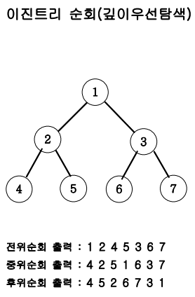

## Table of contents
{: .no_toc .text-delta }

1. TOC
{:toc}

---

# **재귀함수를 이용한 이진수 출력**
- 10진수 N이 입력되면 2진수로 변환하여 출력하는 프로그램을 작성하세요.
- **단, 재귀함수를 이용해서 출력해야 합니다.**
- **입력설명**
  - 첫 번째 줄에 10진수 N(1<=N<=1,000)이 주어집니다.
- **출력설명**
  - 첫 번째 줄에 이진수를 출력하세요.
- **입력예제 1**
  - 11
- **출력예제 1**
  - 1011


## 풀어보기

```java
import java.util.*;
class Main{
    public static void main(String[] args) {
        Scanner sc = new Scanner(System.in);
        int input1 = sc.nextInt();
        recursive(input1);
    }

    public static void recursive(int input1){
        if(input1 <= 0){
        }
        else{
            recursive(input1 / 2);
            System.out.print(input1 % 2 + " ");
        }
    }
}
```

## 해답

```java
import java.util.*;
class Main {
    public void DFS(int n){
        if(n == 0) return;
        else{
            DFS(n / 2);
            System.out.print(n % 2);
        }
    }

    public void solution(int n){
        DFS(n);
    }
    public static void main(String[] args){
        Main T = new Main();
        T.solution(11);
        //System.out.println(T.solution(3));
    }
}
```

***

# **팩토리얼**

- 자연수 N이 입력되면 N!를 구하는 프로그램을 작성하세요.
- 예를 들어 `5! = 5*4*3*2*1 = 120` 입니다.
- **입력예제 1**
  - 5
- **출력예제 1**
  - 120

## 풀어보기

```java
import java.util.*;
class Main{
    public static void main(String[] args) {
        Scanner sc = new Scanner(System.in);
        int input1 = sc.nextInt();
        System.out.println(recursive(input1));
    }

    public static int recursive(int input1){
        if(input1 == 1){
            return 1;
        }
        else{
            return input1 * recursive(input1 - 1) ;
        }
    }
}
```

## 해답

```java
import java.util.*;
class Main {
    public int DFS(int n){
        if(n == 1) return 1;
        else return n * DFS(n - 1);
    }
    public static void main(String[] args){
        Main T = new Main();
        System.out.println(T.DFS(5));
    }
}
```

***

# **`[메모이제이션]` 피보나치 수열 (실패)**
- 피보나치 수열이란 앞의 2개의 수를 합하여 다음 숫자가 되는 수열이다.
- 입력은 피보나치 수열의 총 항의 수 이다.
- 만약 7이 입력되면 1 1 2 3 5 8 13을 출력하면 된다.
- **입력예제 1**
  - 10
- **출력예제 1**
  - 1 1 2 3 5 8 13 21 34 55

## 해답 1

```java
class Main {
    public int DFS(int n){
        if(n==1) return 1;
        else if(n==2) return 1;
        else return DFS(n-2)+DFS(n-1);
    }
    public static void main(String[] args){
        Main T = new Main();
        int n=10;
        for(int i=1; i<=n; i++) System.out.print(T.DFS(i)+" ");
    }
}
```

## 해답 2 📌

```java
class Main {
    static int[] fibo;
    public int DFS(int n){
        if(fibo[n] > 0) return fibo[n];
        if(n == 1) return fibo[n] = 1;
        else if(n == 2) return fibo[n] = 1;
        else return fibo[n] = DFS(n-2) + DFS(n-1);
    }
    public static void main(String[] args){
        Main T = new Main();
        int n = 45;
        fibo = new int[n + 1];
        T.DFS(n);
        for(int i = 1 ; i <= n ; i++) System.out.print(fibo[i] + " ");
    }
}
```

***

# **`[DFS]` 부분 집합 구하기 (실패)**
- **입력예제 1**
  - 3
- **출력예제 1**
  - 1 2 3
  - 1 2
  - 1 3
  - 1
  - 2 3
  - 2
  - 3

## 📌 **이진트리순회**



```java
class Node{
    int data;
    Node lt, rt;
    public Node(int val) {
        data=val;
        lt=rt=null;
    }
}

public class Main{
    Node root;
    public void DFS(Node root){
        if(root==null)
            return;
        else{
            DFS(root.lt);
            System.out.print(root.data+" ");
            DFS(root.rt);
        }
    }

    public static void main(String args[]) {
        Main tree = new Main();
        tree.root = new Node(1);
        tree.root.lt = new Node(2);
        tree.root.rt = new Node(3);
        tree.root.lt.lt = new Node(4);
        tree.root.lt.rt = new Node(5);
        tree.root.rt.lt = new Node(6);
        tree.root.rt.rt = new Node(7);
        tree.DFS(tree.root);
    }
}
```

## 해답

```java
import java.util.*;
class Main {
    static int n;
    static int[] ch;
    public void DFS(int L){
        if(L == n + 1){
            String tmp = "";
            for(int i = 1; i <= n; i++){
                if(ch[i] == 1) tmp += (i + " ");
            }
            if(tmp.length() > 0) System.out.println(tmp);
        }
        else{
            ch[L] = 1;
            DFS(L + 1);
            ch[L] = 0;
            DFS(L + 1);
        }
    }

    public static void main(String[] args){
        Main T = new Main();
        n = 3;
        ch = new int[n + 1];
        T.DFS(1);
    }
}
```


# **`[BFS : 상태트리탐색]` 송아지 찾기**
- 현수의 위치와 송아지의 위치가 수직선상의 좌표 점으로 주어지면 현수는 현재 위치에서 송아지의 위치까지 다음 과 같은 방법으로 이동한다. 
    - 송아지는 움직이지 않고 제자리에 있다. 
    - 현수는 스카이 콩콩을 타고 가는데 한 번의 점프로 앞으로 1, 뒤로 1, 앞으로 5를 이동할 수 있다. 
    최소 몇 번의 점프로 현수가 송아지의 위치까지 갈 수 있는지 구하는 프로그램을 작성 하세요.
- **입력설명**
    - 첫 번째 줄에 현수의 위치 S와 송아지의 위치 E가 주어진다. 
    - 직선의 좌표 점은 1부터 10,000까지이다.
- **출력설명**
    - 점프의 최소횟수를 구한다. 
    - 답은 1이상이며 반드시 존재합니다.
- **입력예제 1**
    - 5 14
- **출력예제 1**
    - 3
- **입력예제 2**
    - 8 3
- **출력예제 2**
    - 5