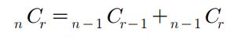

## Table of contents
{: .no_toc .text-delta }

1. TOC
{:toc}

---

# **`[DFS : 아마존 인터뷰]` [합이 같은 부분집합](https://cote.inflearn.com/contest/10/problem/08-01) (✅ ~~실패~~)**

## 풀어보기

```java

import java.util.*;

class Main {
    public static void main(String[] args) {
        Scanner sc = new Scanner(System.in);
        int input1 = sc.nextInt();
        arr1 = new int[input1];
        for(int i = 0 ; i < arr1.length ; i++){
            arr1[i] = sc.nextInt();
        }
        solution(input1 , arr1);
        if(isFind) System.out.println("YES");
        else System.out.println("NO");
    }

    public static void solution(int input1 , int[] arr1){
        total = Arrays.stream(arr1).sum();
        recursive( 0 , 0);
    }
    static int total;
    static int[] arr1;
    static boolean isFind = false;
    public static void recursive(int level , int sum){
        if(isFind) return;
        if(total / 2 < sum){
            return;
        }
        else if(level == arr1.length){
            if(total - sum == sum){
                isFind = true;
                return;
            }
        }
        else{
            recursive(level + 1 , sum + arr1[level]);
            recursive(level + 1 , sum);
        }
    }
}
```

## 해답

```java
import java.util.*;
class Main{
    static String answer="NO";
    static int n, total=0;
    boolean flag=false;
    public void DFS(int L, int sum, int[] arr){
        if(flag) return;
        if(sum > total / 2) return;
        if(L==n){
            if((total-sum)==sum){
                answer="YES";
                flag=true;
            }
        }
        else{
            DFS(L+1, sum+arr[L], arr);
            DFS(L+1, sum, arr);
        }
    }
    public static void main(String[] args){
        Main T = new Main();
        Scanner kb = new Scanner(System.in);
        n = kb.nextInt();
        int[] arr = new int[n];
        for(int i = 0 ; i < n ; i++){
            arr[i] = kb.nextInt();
            total += arr[i];
        }
        T.DFS(0, 0, arr);
        System.out.println(answer);
    }
}
```

***

# **`[DFS]` [바둑이 승차](https://cote.inflearn.com/contest/10/problem/08-02) (통과)**

## 풀어보기

```java

import java.util.*;

class Main {
    static int[] arr1;
    static int input1 , result;
    public static void main(String[] args) {
        Scanner sc = new Scanner(System.in);
        input1 = sc.nextInt();
        int input2 = sc.nextInt();
        arr1 = new int[input2];
        for(int i = 0 ; i < arr1.length ; i++){
            arr1[i] = sc.nextInt();
        }
        recursive( 0 , 0);
        System.out.println(result);
    }

    public static void recursive(int level , int sum){
        if(input1 < sum){}
        else{
            if(result < sum) result = sum;
            if(level == arr1.length){}
            else{
                recursive(level + 1 , sum + arr1[level]);
                recursive(level + 1, sum);
            }
        }
    }
}
```

## 해답

```java
import java.util.*;
class Main{
    static int answer=Integer.MIN_VALUE, c, n;
    public void DFS(int L, int sum, int[] arr){
        if(sum>c) return;
        if(L==n){
            answer=Math.max(answer, sum);
        }
        else{
            DFS(L+1, sum+arr[L], arr);
            DFS(L+1, sum, arr);
        }
    }

    public static void main(String[] args){
        Main T = new Main();
        Scanner kb = new Scanner(System.in);
        c=kb.nextInt();
        n=kb.nextInt();
        int[] arr=new int[n];
        for(int i=0; i<n; i++){
            arr[i]=kb.nextInt();
        }
        T.DFS(0, 0, arr);
        System.out.println(answer);
    }
}
```

***

# **`[DFS]` [최대점수 구하기](https://cote.inflearn.com/contest/10/problem/08-03) (통과)**

## 풀어보기
```java
// 2021.05.18
import java.util.*;

class Main {
    static int[] scoreArr , timeArr;
    static int problemCount , timeLimit , result = 0;
    static String tmp = "";
    public static void main(String[] args) {
        Scanner sc = new Scanner(System.in);
        problemCount = sc.nextInt();
        timeLimit = sc.nextInt();
        scoreArr = new int[problemCount];
        timeArr = new int[problemCount];
        for(int i = 0 ; i < problemCount ; i++){
            scoreArr[i] = sc.nextInt();
            timeArr[i] = sc.nextInt();
        }
        recursive(0 ,0 , 0);
        System.out.println(result);
    }

    public static void recursive(int cnt , int totalScore , int totalTime){
        if(cnt > problemCount || totalTime > timeLimit){
            return;
        }
        if(cnt == problemCount){
            result = Math.max(result , totalScore);
        }
        else{
            recursive(cnt + 1, totalScore + scoreArr[cnt] , totalTime + timeArr[cnt]);
            recursive(cnt + 1, totalScore, totalTime);
        }
    }
}


```


## 해답

```java
import java.util.*;
class Main{
    static int answer=Integer.MIN_VALUE, n, m;
    boolean flag=false;
    public void DFS(int L, int sum, int time, int[] ps, int[] pt){
        if(time>m) return;
        if(L==n){
            answer=Math.max(answer, sum);
        }
        else{
            DFS(L+1, sum+ps[L], time+pt[L], ps, pt);
            DFS(L+1, sum, time, ps, pt);
        }
    }

    public static void main(String[] args){
        Main T = new Main();
        Scanner kb = new Scanner(System.in);
        n=kb.nextInt();
        m=kb.nextInt();
        int[] a=new int[n];
        int[] b=new int[n];
        for(int i=0; i<n; i++){
            a[i]=kb.nextInt();
            b[i]=kb.nextInt();
        }
        T.DFS(0, 0, 0, a, b);
        System.out.println(answer);
    }
}
```

***

# **`[DFS]` 중복순열 구하기**
- 1부터 N까지 번호가 적힌 구슬이 있습니다.
- 이 중 중복을 허락하여 M번을 뽑아 일렬로 나열하는 방법을 모두 출력합니다.
- 출력순서는 사전순으로 오름차순으로 출력합니다.
- 첫 번째 줄에 자연수 N(3<=N<=10)과 M(2<=M<=N) 이 주어집니다.
- **입력예제 1**
  - 3 2
- **출력예제 1**
  - 1 1
  - 1 2
  - 1 3
  - 2 1
  - 2 2
  - 2 3
  - 3 1
  - 3 2
  - 3 3

## 풀어보기

```java
import java.util.*;

class Main {
//    private static int[] checkArr;
    static int limit;
    static int count;
    public static void main(String[] args) {
        Scanner sc = new Scanner(System.in);
        limit = sc.nextInt();
        count = sc.nextInt();
//        checkArr = new int[limit + 1];
        recursive(1);
    }

    public static void recursive(int num){
        if(num > limit){
            return;
        }
        else{
            for(int i = 1 ; i <= limit ; i++){
                System.out.println(num + " " + i);
            }
            recursive(num + 1);
        }
    }
}
```

## 해답

```java
import java.util.*;
class Main{
    static int[] pm;
    static int n, m;
    public void DFS(int L){
        if(L==m){
            for(int x : pm) System.out.print(x+" ");
            System.out.println();
        }
        else{
            for(int i=1; i<=n; i++){
                pm[L]=i;
                DFS(L+1);
            }
        }
    }
    public static void main(String[] args){
        Main T = new Main();
        Scanner kb = new Scanner(System.in);
        n=kb.nextInt();
        m=kb.nextInt();
        pm=new int[m];
        T.DFS(0);
    }
}
```

***

# **`[DFS]` [동전 교환](https://cote.inflearn.com/contest/10/problem/08-05) (실패)**

## 풀어보기

```java
import java.util.*;

class Main {
    static int[] coinArr;
    static int coinEa;
    static int totalAmt;
    static int result = 0;
    public static void main(String[] args) {
        Scanner sc = new Scanner(System.in);
        coinEa = sc.nextInt();
        coinArr = new int[coinEa];
        for(int i = 0 ; i < coinEa ; i++){
            coinArr[i] = sc.nextInt();
        }
        totalAmt = sc.nextInt();
        Arrays.sort(coinArr);
        recursive(coinEa - 1 , totalAmt);
        System.out.println(result);
    }

    public static void recursive(int index , int amt){
        if(index < 0 || amt <= 0){
            return;
        }
        else{
            while(coinArr[index] <= amt){
                amt -= coinArr[index];
                result++;
            }
            recursive(index - 1 , amt);
        }
    }
}
```

## 해답

### `Arrays.sort(Integer[] arr , Collections.reverseOrder())`

```java
import java.util.*;
class Main{
    static int n, m, answer=Integer.MAX_VALUE;
    public void DFS(int L, int sum, Integer[] arr){
        if(sum>m) return;
        if(L>=answer) return;
        if(sum==m){
            answer=Math.min(answer, L);
        }
        else{
            for(int i=0; i<n; i++){
                DFS(L+1, sum+arr[i], arr);
            }
        }
    }
    public static void main(String[] args){
        Main T = new Main();
        Scanner kb = new Scanner(System.in);
        n=kb.nextInt();
        Integer[] arr=new Integer[n];
        for(int i=0; i<n; i++) arr[i]=kb.nextInt();
        Arrays.sort(arr, Collections.reverseOrder());
        m=kb.nextInt();
        T.DFS(0, 0, arr);
        System.out.println(answer);
    }
}
```

***

# **순열 구하기 (실패)**
- 10이하의 N개의 자연수가 주어지면 이 중 M개를 뽑아 일렬로 나열하는 방법을 모두 출력
- 첫 번째 줄에 자연수 N(3<=N<=10)과 M(2<=M<=N) 이 주어집니다.
- 두 번째 줄에 N개의 자연수가 오름차순으로 주어집니다.
- 출력순서는 사전순으로 오름차순으로 출력합니다.
- **입력예제 1**
  - 3 2
  - 3 6 9
- **출력예제 1**
  - 3 6
  - 3 9
  - 6 3
  - 6 9
  - 9 3
  - 9 6

## 해답

```java
import java.util.*;
class Main{
    static int[] pm, ch, arr;
    static int n, m;
    public void DFS(int L){
        if(L==m){
            for(int x : pm) System.out.print(x+" ");
            System.out.println();
        }
        else{
            for(int i=0; i<n; i++){
                if(ch[i]==0){
                    ch[i]=1;
                    pm[L]=arr[i];
                    DFS(L+1);
                    ch[i]=0;
                }
            }
        }
    }
    public static void main(String[] args){
        Main T = new Main();
        Scanner kb = new Scanner(System.in);
        n=kb.nextInt();
        m=kb.nextInt();
        arr=new int[n];
        for(int i=0; i<n; i++) arr[i]=kb.nextInt();
        ch=new int[n];
        pm=new int[m];
        T.DFS(0);
    }
}
```

***

# **`[메모이제이션]` [조합의 경우 수](https://cote.inflearn.com/contest/10/problem/08-07) (통과)**



## 풀어보기

```java
import java.util.*;

class Main {
    static int[][] checkArr;
    public static void main(String[] args) {
        Scanner sc = new Scanner(System.in);
        int input1 = sc.nextInt();
        int input2 = sc.nextInt();
        checkArr = new int[input1 + 1][input2 + 1];
        System.out.println(recursive(input1 , input2));
    }

    public static int recursive(int n , int r){
        if(r == 0) return 1;
        else if(n == r) return 1;
        else if(checkArr[n][r] != 0) return checkArr[n][r];
        else{
            return checkArr[n][r] =  recursive(n - 1 , r - 1) + recursive(n - 1 , r);
        }
    }
}
```

## 해답

```java
import java.util.*;
class Main{
    int[][] dy=new int[35][35];
    public int DFS(int n, int r){
        if(dy[n][r]>0) return dy[n][r];
        if(n==r || r==0) return 1;
        else return dy[n][r]=DFS(n-1, r-1)+DFS(n-1, r);
    }
    public static void main(String[] args){
        Main T = new Main();
        Scanner kb = new Scanner(System.in);
        int n=kb.nextInt();
        int r=kb.nextInt();
        System.out.println(T.DFS(n, r));
    }
}
```

***

# 🔥 **`[순열 구하기 응용]` [수열 추측하기](https://cote.inflearn.com/contest/10/problem/08-08) (실패)**

## 해답

```java
import java.util.*;
class Main{
    static int[] b, p, ch;
    static int n, f;
    boolean flag=false;
    int[][] dy=new int[35][35];
    public int combi(int n, int r){
        if(dy[n][r]>0) return dy[n][r];
        if(n==r || r==0) return 1;
        else return dy[n][r]=combi(n-1, r-1)+combi(n-1, r);
    }

    public void DFS(int L, int sum){
        if(flag) return;
        if(L==n){
            if(sum==f){
                for(int x : p) System.out.print(x+" ");
                flag=true;
            }
        }
        else{
            for(int i=1; i<=n; i++){
                if(ch[i]==0){
                    ch[i]=1;
                    p[L]=i;
                    DFS(L+1, sum+(p[L]*b[L]));
                    ch[i]=0;
                }
            }
        }
    }

    public static void main(String[] args){
        Main T = new Main();
        Scanner kb = new Scanner(System.in);
        n=kb.nextInt();
        f=kb.nextInt();
        b=new int[n];
        p=new int[n];
        ch=new int[n+1];
        for(int i=0; i<n; i++){
            b[i]=T.combi(n-1, i);
        }
        T.DFS(0, 0);
    }
}

```

***

# **`[DFS]` 조합 구하기 (통과 - 비효율적)**
- 1부터 N까지 번호가 적힌 구슬이 있습니다.
- 이 중 M개를 뽑는 방법의 수를 출력하는 프로그램을 작성하세요.
- **입력예제 1**
  - 4 2
- **출력예제 1**
  - 1 2
  - 1 3
  - 1 4
  - 2 3
  - 2 4
  - 3 4


## 풀어보기

```java
import java.util.*;

class Main {
    static int[] checkArr , printArr , numArr;
    public static void main(String[] args) {
        Scanner sc = new Scanner(System.in);
        int input1 = sc.nextInt();
        int input2 = sc.nextInt();
        checkArr = new int[input1];
        printArr = new int[input2];
        numArr = new int[input1];
        for(int i = 0 ; i < input1 ; i++) numArr[i] = i + 1;
        recursive(0 , input1 , input2);
    }

    public static void recursive(int level , int n , int r){
        if(level > r){}
        else if(level == r){
            for(int p : printArr) System.out.print(p + " ");
            System.out.println();
        }
        else{
            for(int i = 0 ; i < n ; i++){
                if(checkArr[i] == 0 && numArr[i] - 1 <= i){
                    checkArr[i] = 1;
                    printArr[level] = numArr[i];
                    recursive(level + 1 , n , r);
                    for(int j = i + 1 ; j < n ; j++){
                        checkArr[j] = 0;
                    }
                }
            }
        }
    }
}
```


## 해답

```java
import java.util.*;
class Main{
    static int[] combi;
    static int n, m;
    public void DFS(int L, int s){
        if(L==m){
            for(int x : combi) System.out.print(x+" ");
            System.out.println();
        }
        else{
            for(int i=s; i<=n; i++){
                combi[L]=i;
                DFS(L+1, i+1);
            }
        }
    }
    public static void main(String[] args){
        Main T = new Main();
        Scanner kb = new Scanner(System.in);
        n=kb.nextInt();
        m=kb.nextInt();
        combi=new int[m];
        T.DFS(0, 1);
    }
}
```

***

# **`[DFS]` [미로탐색](https://cote.inflearn.com/contest/10/problem/08-10) (통과)**

## 풀어보기

### 시작지점을 1로 `board[0][0] = 1;`

```java
import java.util.*;

class Main {
    static int[][] board;
    static int[] dx = {-1 , 0 , 1 , 0};
    static int[] dy = {0 , 1 , 0 , -1};
    static int result = 0;
    public static void main(String[] args) {
        Scanner sc = new Scanner(System.in);
        board = new int[7][7];
        for(int i = 0 ; i < 7 ; i++){
            for(int j = 0 ; j < 7 ; j++){
                board[i][j] = sc.nextInt();
            }
        }
        board[0][0] = 1;
        recursive(0 , 0);
        System.out.println(result);
    }

    public static void recursive(int x , int y){
        if(x == 6 && y == 6){
            result++;
        }
        else{
            for(int i = 0 ; i < 4 ; i++){
                int moveX = x + dx[i];
                int moveY = y + dy[i];
                if(moveX >= 0 && moveX < 7 && moveY >= 0 && moveY < 7){
                    if(board[moveX][moveY] == 0){
                        board[moveX][moveY] = 1;
                        recursive(moveX , moveY);
                        board[moveX][moveY] = 0;
                    }
                }
            }
        }
    }
}
```

## 해답

```java
import java.util.*;
class Main {
    static int[] dx={-1, 0, 1, 0};
    static int[] dy={0, 1, 0, -1};
    static int[][] board;
    static int answer=0;

    public void DFS(int x, int y){
        if(x==7 && y==7) answer++;
        else{
            for(int i=0; i<4; i++){
                int nx=x+dx[i];
                int ny=y+dy[i];
                if(nx>=1 && nx<=7 && ny>=1 && ny<=7 && board[nx][ny]==0){
                    board[nx][ny]=1;
                    DFS(nx, ny);
                    board[nx][ny]=0;
                }
            }
        }
    }

    public static void main(String[] args){
        Main T = new Main();
        Scanner kb = new Scanner(System.in);
        board=new int[8][8];
        for(int i=1; i<=7; i++){
            for(int j=1; j<=7; j++){
                board[i][j]=kb.nextInt();
            }
        }
        board[1][1]=1;
        T.DFS(1, 1);
        System.out.print(answer);
    }
}
```

***

# **`[BFS]` [미로의 최단거리 탐색](https://cote.inflearn.com/contest/10/problem/08-11) (통과)**

## 풀어보기

```java
import java.util.*;

class Position{
    int x;
    int y;
    public Position(int x , int y){
        this.x = x;
        this.y = y;
    }
}

class Main {

    static int[][] board;
    static int[] dx = {-1 , 0 , 1 , 0};
    static int[] dy = {0 , 1 , 0 , -1};
    static Queue<Position> queue = new LinkedList<>();

    public static void main(String[] args) {
        Scanner sc = new Scanner(System.in);
        board = new int[7][7];
        for(int i = 0 ; i < 7 ; i++){
            for(int j = 0 ; j < 7 ; j++){
                board[i][j] = sc.nextInt();
            }
        }
        queue.offer(new Position(0 , 0));

        List<Integer> costList = new ArrayList<>();
        while(!queue.isEmpty()){
            Position pos = queue.poll();
            if(pos.x == 6 && pos.y == 6){
                costList.add(board[pos.x][pos.y]);
            }
            else{
                for(int i = 0 ; i < 4 ; i++){
                    int moveX = pos.x + dx[i];
                    int moveY = pos.y + dy[i];
                    if(moveX >= 0 && moveX < 7 && moveY >= 0 && moveY < 7){
                        if(board[moveX][moveY] == 0){
                            board[moveX][moveY] = board[pos.x][pos.y] + 1;
                            queue.offer(new Position(moveX , moveY));
                        }
                    }
                }
            }
        }
        if(costList.isEmpty()){
            System.out.println(-1);
        }
        else{
            System.out.println(costList.stream().min(Comparator.comparing(x -> x)).get());
        }
    }
}
```

## 해답

```java
import java.util.*;
class Point{
    public int x, y;
    Point(int x, int y){
        this.x=x;
        this.y=y;
    }
}
class Main {
    static int[] dx={-1, 0, 1, 0};
    static int[] dy={0, 1, 0, -1};
    static int[][] board, dis;
    public void BFS(int x, int y){
        Queue<Point> Q=new LinkedList<>();
        Q.offer(new Point(x, y));
        board[x][y]=1;
        while(!Q.isEmpty()){
            Point tmp=Q.poll();
            for(int i=0; i<4; i++){
                int nx=tmp.x+dx[i];
                int ny=tmp.y+dy[i];
                if(nx>=1 && nx<=7 && ny>=1 && ny<=7 && board[nx][ny]==0){
                    board[nx][ny]=1;
                    Q.offer(new Point(nx, ny));
                    dis[nx][ny]=dis[tmp.x][tmp.y]+1;
                }
            }
        }
    }

    public static void main(String[] args){
        Main T = new Main();
        Scanner kb = new Scanner(System.in);
        board=new int[8][8];
        dis=new int[8][8];
        for(int i=1; i<=7; i++){
            for(int j=1; j<=7; j++){
                board[i][j]=kb.nextInt();
            }
        }
        T.BFS(1, 1);
        if(dis[7][7]==0) System.out.println(-1);
        else System.out.println(dis[7][7]);
    }
}
```

***

# **`[BFS 활용]` [토마토](https://cote.inflearn.com/contest/10/problem/08-12) (통과)**

## 풀어보기
```java
import java.util.*;

class Position{
    int x;
    int y;
    public Position(int x , int y){
        this.x = x;
        this.y = y;
    }
}

class Main {

    static int[][] board;
    static int[][] cost;
    static int[] dx = {-1 , 0 , 1 , 0};
    static int[] dy = {0 , 1 , 0 , -1};
    static Queue<Position> queue = new LinkedList<>();

    public static void main(String[] args) {
        Scanner sc = new Scanner(System.in);
        int col = sc.nextInt();
        int row = sc.nextInt();
        board = new int[row][col];
        cost = new int[row][col];
        for(int i = 0 ; i < row ; i++){
            for(int j = 0 ; j < col ; j++){
                board[i][j] = sc.nextInt();
                if(board[i][j] == 1){
                    queue.offer(new Position(i , j));
                    cost[i][j] = 1;
                }
                else if(board[i][j] == -1){
                    cost[i][j] = -1;
                }
            }
        }

        while(!queue.isEmpty()){
            Position pos = queue.poll();
            for(int i = 0 ; i < 4 ; i++){
                int moveX = pos.x + dx[i];
                int moveY = pos.y + dy[i];
                if(moveX >= 0 && moveX < row && moveY >= 0 && moveY < col){
                    if(board[moveX][moveY] == 0){
                        board[moveX][moveY] = board[pos.x][pos.y] + 1;
                        cost[moveX][moveY] = board[pos.x][pos.y];
                        queue.offer(new Position(moveX , moveY));
                    }
                }
            }
        }
        int result = 0;
        loop:
        for(int i = 0 ; i < row ; i++){
            for(int j = 0 ; j < col ; j++){
//                System.out.print(cost[i][j]);
                if(cost[i][j] == 0) {
                    result = -1;
                    break loop;
                }
                else if(cost[i][j] > result) result = cost[i][j];
            }
//            System.out.println();
        }
        if(result == 1) System.out.println(0);
        else System.out.println(result);
    }

}
```

## 해답

```java
import java.util.*;
class Point{
    public int x, y;
    Point(int x, int y){
        this.x=x;
        this.y=y;
    }
}
class Main {
    static int[] dx={-1, 0, 1, 0};
    static int[] dy={0, 1, 0, -1};
    static int[][] board, dis;
    static int n, m;
    static Queue<Point> Q=new LinkedList<>();
    public void BFS(){
        while(!Q.isEmpty()){
            Point tmp=Q.poll();
            for(int i=0; i<4; i++){
                int nx=tmp.x+dx[i];
                int ny=tmp.y+dy[i];
                if(nx>=0 && nx<n && ny>=0 && ny<m && board[nx][ny]==0){
                    board[nx][ny]=1;
                    Q.offer(new Point(nx, ny));
                    dis[nx][ny]=dis[tmp.x][tmp.y]+1;
                }
            }
        }
    }

    public static void main(String[] args){
        Main T = new Main();
        Scanner kb = new Scanner(System.in);
        m=kb.nextInt();
        n=kb.nextInt();
        board=new int[n][m];
        dis=new int[n][m];
        for(int i=0; i<n; i++){
            for(int j=0; j<m; j++){
                board[i][j]=kb.nextInt();
                if(board[i][j]==1) Q.offer(new Point(i, j));
            }
        }
        T.BFS();
        boolean flag=true;
        int answer=Integer.MIN_VALUE;
        for(int i=0; i<n; i++){
            for(int j=0; j<m; j++){
                if(board[i][j]==0) flag=false;
            }
        }
        if(flag){
            for(int i=0; i<n; i++){
                for(int j=0; j<m; j++){
                    answer=Math.max(answer, dis[i][j]);
                }
            }
            System.out.println(answer);
        }
        else System.out.println(-1);
    }
}
```

***

# **[섬나라 아일랜드](https://cote.inflearn.com/contest/10/problem/08-13)**

## `[DFS]` 풀어보기 `[메모이제이션 배열 사용]`

```java
import java.util.*;

class Main {

    static int[][] board;
    static int[][] memoization;
    static int[] dx = {-1 , -1 , 0 , 1 , 1 , 1, 0 , -1};
    static int[] dy = {0 , 1 , 1 , 1 , 0 , -1 , -1 , -1};
    static int result = 0;
    public static void main(String[] args) {
        Scanner sc = new Scanner(System.in);
        int input1 = sc.nextInt();
        board = new int[input1][input1];
        memoization = new int[input1][input1];
        for(int i = 0 ; i < input1 ; i++){
            for(int j = 0 ; j < input1 ; j++){
                board[i][j] = sc.nextInt();
            }
        }

        for(int i = 0 ; i < input1 ; i++){
            for(int j = 0 ; j < input1 ; j++){
                if(memoization[i][j] != 1 && board[i][j] != 0){
                    recursive(input1 , i , j);
                    result++;
                }
            }
        }

        System.out.println(result);
    }

    public static void recursive(int size , int x , int y){
        if(memoization[x][y] == 1){}
        else if(board[x][y] == 0){}
        else{
            memoization[x][y] = 1;
            for(int i = 0 ; i < 8 ; i++){
                int moveX = x + dx[i];
                int moveY = y + dy[i];
                if(moveX >= 0 && moveX < size && moveY >= 0 && moveY < size){
                    if(board[moveX][moveY] == 1){
                        recursive(size , moveX , moveY);
                    }
                }
            }
        }
    }
}
```


## `[DFS]` 해답 `[메모이제이션 배열 미사용]`

```java
import java.util.*;
class Main {
    static int answer=0, n;
    static int[] dx={-1, -1, 0, 1, 1, 1, 0, -1};
    static int[] dy={0, 1, 1, 1, 0, -1, -1, -1};
    public void DFS(int x, int y, int[][] board){
        for(int i=0; i<8; i++){
            int nx=x+dx[i];
            int ny=y+dy[i];
            if(nx>=0 && nx<n && ny>=0 && ny<n && board[nx][ny]==1){
                board[nx][ny]=0;
                DFS(nx, ny, board);
            }
        }
    }
    public void solution(int[][] board){
        for(int i=0; i<n; i++){
            for(int j=0; j<n; j++){
                if(board[i][j]==1){
                    answer++;
                    board[i][j]=0;
                    DFS(i, j, board);
                }
            }
        }
    }

    public static void main(String[] args){
        Main T = new Main();
        Scanner kb = new Scanner(System.in);
        n=kb.nextInt();
        int[][] arr=new int[n][n];
        for(int i=0; i<n; i++){
            for(int j=0; j<n; j++){
                arr[i][j]=kb.nextInt();
            }
        }
        T.solution(arr);
        System.out.println(answer);
    }
}
```

## `[BFS]` 풀어보기


## `[BFS]` 해답

***

# **`[삼성 SW역량평가 기출문제 : DFS활용]` [피자 배달 거리](https://cote.inflearn.com/contest/10/problem/08-14)**
