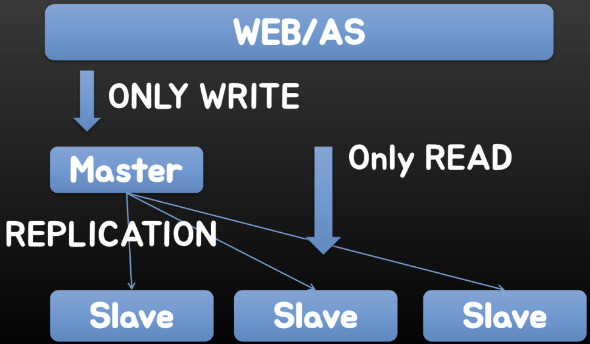
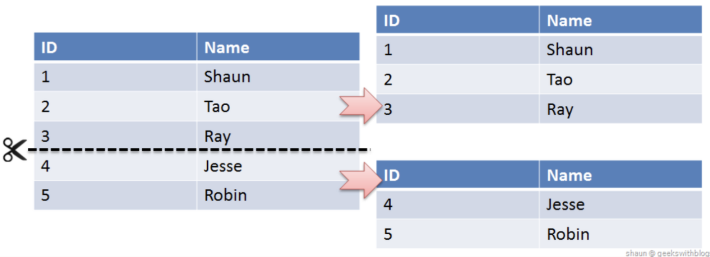
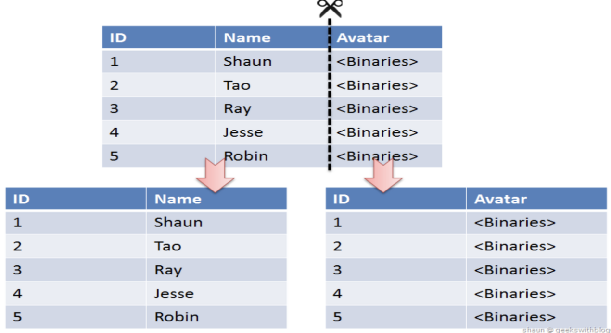
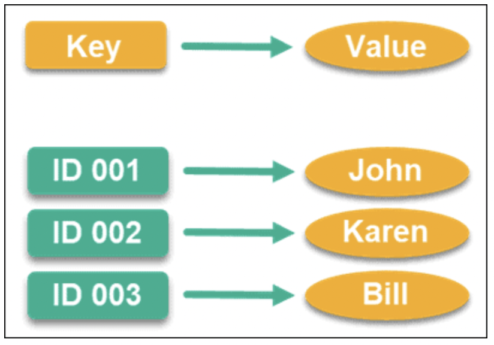
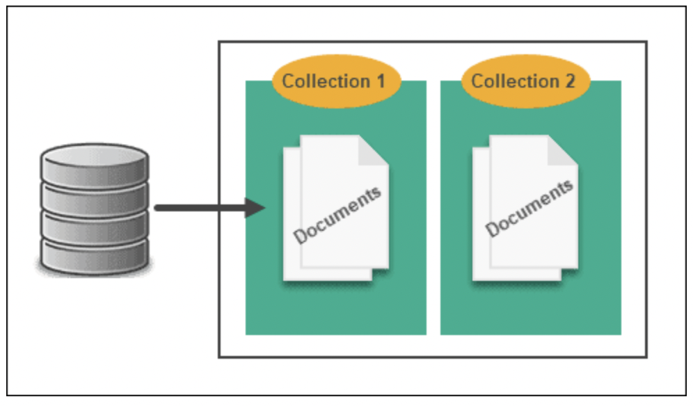
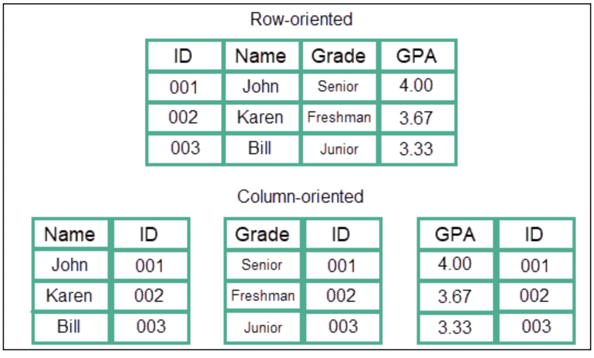
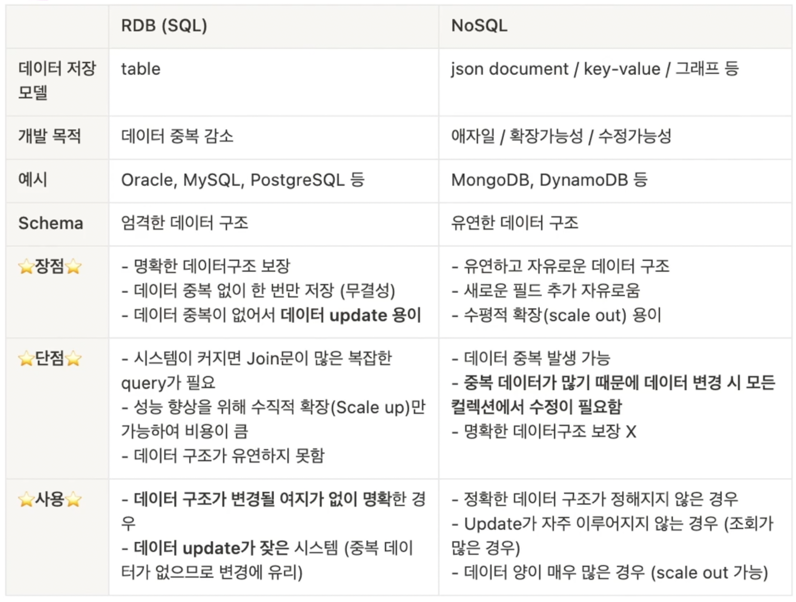

## Table of contents
{: .no_toc .text-delta }

1. TOC
{:toc}
---

- 아래의 글들을 발췌하여 작성하였습니다 
  - [AWS - NoSQL이란?](https://aws.amazon.com/ko/nosql/)
  - [NoSQL Data Modeling](https://phoenixnap.com/kb/nosql-data-modeling)
  - [NoSQL에 대해 알아보자](https://shoark7.github.io/programming/knowledge/what-is-NoSQL)
  - [What is NoSQL](https://github.com/alstjgg/cs-study/blob/main/%EB%8D%B0%EC%9D%B4%ED%84%B0%EB%B2%A0%EC%9D%B4%EC%8A%A4/NoSQL%20-%202.%20What%20is%20NoSQL.md)
  - [Scale-up과 Scale-out에 대해 알아보자!](https://tecoble.techcourse.co.kr/post/2021-10-12-scale-up-scale-out/)
  - [분산 DB , 파티셔닝 , 샤딩](https://umbum.dev/969)
  - [NHN의 안과 밖: Sharding Platform](https://d2.naver.com/helloworld/14822)

# 용어 정리

## **SQL(Structured Query Language)** 
- 관계형 데이터베이스 관리 시스템의 데이터를 관리하기 위해 설계된 **특수 목적의 프로그래밍 언어**이다 
- 관계형 데이터베이스 관리 시스템에서 **자료의 검색과 관리, 데이터베이스 스키마 생성과 수정, 데이터베이스 객체 접근 조정 관리**를 위해 고안되었다.
- 데이터베이스의 경우 표준 SQL을 지키기는 하지만 `각각의 제품에 특화시킨 SQL을 사용한다`
 - 오라클 → `PL/SQL`
 - SQL Server → `T-SQL`
 - MySQL → `SQL`

1. **DDL(Data Definition Language)**
   - 데이터베이스 구조를 정의, 수정, 삭제하는 언어이며 create, alter, drop 등이 있다.
2. **DML(Data Manipulation Language)**
   - 데이터베이스 내의 자료 검색, 삽입, 갱신, 삭제를 위한 언어로 select, delete, update, insert가 있다.
3. **DCL(Data Control Language)**
   - 데이터에 대해 무결성을 유지, 병행 수행 제어, 보호와 관리를 위한 언어로 commit, rollback, grant, revoke가 있다.

## **Scale Up**
- 기존의 서버를 보다 높은 사양으로 업그레이드 하는 것
- **수직 스케일링 `Vertical Scaling`**
  - AWS의 EC2 인스턴스 사양을 micro에서 small, small에서 medium 등으로 높이는 것으로 생각하면 된다

 
1. 추가적인 네트워크 연결 없이 용량 증강
2. 스케일 아웃보다 관리 비용이나 운영 이슈가 적고 , 사양만 올리면 되기 때문에 비교적 쉽다
3. 하지만 성능 향상에 한계와 비용 부담이 크다

## **Scale Out**
- 장비를 추가해서 확장하는 방식
- 기존의 서버만으로 용량이나 성능의 한계에 도달했을 때
- 비슷한 사양의 서버를 추가로 연결해 처리할 수 있는 **데이터 용량이 증가할 뿐만 아니라 기존 서버의 부하를 분담해 성능 향상 기대**
- **수평 스케일링 `Horizontal Scaling`**
  - 클라우드 서비스에서는 자원 사용량을 모니터링하여 자동으로 서버를 증설 `Scale Out` 하는 **Auto Scaling**기능도 있다

 

1. 확장의 유연성
2. 필요한 만큼 서버를 추가해 용량과 성능을 확장 할 수 있다 `pay-as-you-grow`
3. 하지만 여러 노드를 연결해 병렬 컴퓨팅 환경을 구성하고 유지하려면 아키텍처에 대한 높은 이해도가 요구된다
4. 서버의 수가 늘어날수록 관리가 힘들어져 여러 노드에 부하를 균등하게 분산시키기 위해 **로드 밸런싱**이 필요하다
5. 노드를 확장할수록 문재 발생의 잠재 원인 또한 추가한 만큼 늘어나게 된다

## **Partitioning**
- 저장해야하는 정보가 많은 대규모 시스템의 경우 하나의 DB에 모든 정보를 저장해서는 제대로 된 응답성을 기대할 수 없다
- 가장 쉽게 생각해 볼만한건 `Master DB`의 데이터를 복제한 `Slave DB`를 두고 **read**를 분산하는 것이다
  - *스캔 속도는 그대로겠지만 요청을 분산할 순 있다*
- 하지만 이 방법은 **write**는 분산되지 않는다

- **분산 DBMS**는 위처럼 여러 개의 DB가 모두 같은 전체 데이터를 가지고 있고 응답만 분산하는 형태가 아니라 , **각각의 DB가 데이터 일부분씩 나눠 가지고 있도록 구성**한다
  - *이것이 파티셔닝 (`단편화`)이다*
- `[X 테이블은 A DB , Y 테이블은 B DB]` 형식으로 나눠 가지는게 아니라 `[X 테이블의 일부분은 A DB , X 테이블의 다른 일부분은 B DB]`형식으로 테이블을 나눠 가져 **테이블을 잘라서 일부분 나눠 가지게 된다**
- 테이블을 나눠 가지는 방식에 따라 **수평 단편화**`Sharding = Horizontal Partitioning` 와 **수직 단편화**로 나눌 수 있다

 

- **샤딩은 물리적으로 다른 데이터베이스에 데이터를 `수평 분할 방식`으로 분산 저장하고 조회하는 방법을 말한다**
- 여러 데이터베이스를 대상으로 작업해야 하기 때문에 경우에 따라서는 기능에 제약이 있을 수 있고 (`JOIN 연산 등`), **일관성 `Consistency`** , **복제 `Replication`**등에서 불리한 점이 많다
- 샤딩은 결국 테이블을 수평으로 쪼개는 것 이기 때문에 , 어떤 DB에 해당 데이터가 있을지 찾아갈 수 있어야 한다
- 해당 데이터가 존재하는 DB를 잘 찾아낼 수 있도록 , 그리고 각 DB에 공평하게 row들이 분배되도록 Key를 잘 설계하는 것이 중요하다
- [확장성 해싱 VS 선형 해싱 : Shard Key](https://umbum.tistory.com/813)

 

- 일반적으로 엔티티를 분리할 때 처럼 , 컬럼을 나눠 새로운 테이블로 만들어서 나눠갖는 것
- 이렇게 나누는 경우는 **보통 어떤 컬럼이 빈번하게 참조될 때**다
  - *한 row가 작아서 상대적으로 여러 row가 캐시에 올라갈 수 있고*
  - *해당 컬럼의 여러 데이터가 캐시에 올라갈 수 있다는 말이 되어 `Hit Rate`가 좋아진다*

***

# **관계형 데이터베이스**
- **사전에 엄격하게 정의돤 DB Schema를 요구하는 Table 기반 데이터 구조를 갖는다**
- 데이터는 스키마(Schema)로 정의된 2차원 테이블에 저장
- 각 열은 하나의 속성에 대한 정보를 저장
- 각 행은 각 열의 데이터 형식에 맞는 데이터가 저장
- 데이터 관리를 위해 테이블 간의 관계를 구조화하는 것이 중요
- 이러한 관계를 나타내기 위해 `외래 키(Foreign Key)` 라는 것을 사용한다
- 데이터의 일관성을 보장한다

 

**SQL의 모든 transaction은 `ACID`한 특성을 유지해야 한다**   
  - *ACID Atomicity, Consistency, Isolation, Durability*
 

- **원자성** `Atomicity` : 트랜잭션 내에서 실행한 작업들은 마치 하나의 작업인 것처럼 모두 성공하거나 혹은 모두 실패해야 합니다.
- **일관성** `Consistency` : 모든 트랜잭션은 일관성있는 데이터베이스 상태를 유지해야 합니다. 
  - *예를 들면 데이터베이스에서 정한 무결성 제약 조건을 항상 만족해야 합니다.*
- **격리성** `Isolation` : 동시에 실행되는 트랜잭션들이 서로에게 영향을 미치지 않도록 격리해야 합니다. 
  - *예를 들면 동시에 같은 데이터를 수정하지 못하도록 해야 합니다.* 
  - 격리성은 동시성과 관련된 성능 이슈로 인해 격리 수준을 선택할 수 있습니다.
- **지속성** `Durability` : 트랜잭션을 성공적으로 끝내면 그 결과가 항상 기록되어야 합니다. 
  - 중간에 시스템에 문제가 발생하더라도 데이터베이스 로그 등을 사용해서 성공한 트랜잭션 내용을 복구해야 합니다.

 

# **NoSQL 데이터베이스** Not only SQL
 

1. **Key-value 방식(Riak, Redis, Voldmort)**
   - 키를 고유한 식별자로 사용하는 **키-값 쌍으로 데이터를 저장**한다
   - 키-값 데이터베이스는 `Partitioning`이 가능하고, `Scale Out`이 가능하다

 

2. **Document 방식(MongoDB, CouchDB)**
   - 문서 처럼 저장하는 데이터베이스를 의미한다
   - XML이나 JSON, YAML 같은 **데이터 타입(document)을 이용해서 레코드를 저장**한다
   - 각각의 문서는 하나의 속성에 대한 데이터를 가지고 있고 , 컬렉션이라고 하는 그룹으로 묶어서 관리한다

 

3. **Column 방식(Hbase, Casandra)**
   - key-value와 데이터 저장 방식은 동일
   - 보통의 NoSQL은 order by 같은 정렬 기능을 제공하지 않지만, 이 모델은 내부적으로 key를 정렬
   - **RDBMS에서는 데이터를 row 단위로 저장한다면, column model 은 column 단위로 저장한다**
   - 각 column은 column family로 묶이고, 이 family들은 또 다른 column이 될 수 있다
   - 하나의 키에 여러 개의 컬럼 이름과 컬럼 값의 쌍으로 이루어진 데이터를 저장하고 조회
   - 데이터 저장의 기본 단위 (column name + column value + time stamp)

 

4. **Graph 방식(Sones, Allegro Graph)**
   - 데이터를 노드로 표현하고, 노드 사이의 관계를 화살표로 표현한다.

***

> NoSQL은 언제 사용하면 좋을까요 ?
>   - 정확한 데이터 구조가 정해져 있지 않고 , Update가 자주 일어나지 않으며 **조회가 많은 경우**
>   - 또 `scale out`이 가능하므로 데이터 양이 매우 많은 경우에 사용하면 좋다
